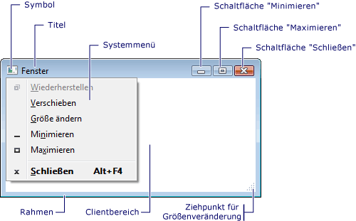
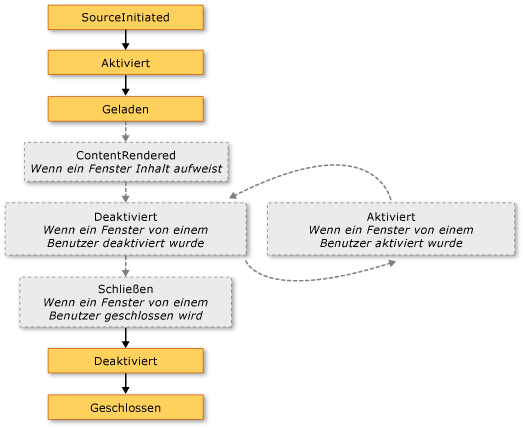
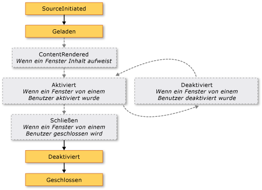

# <a name="wpf-windows-overview"></a><span data-ttu-id="59c84-102">Übersicht über WPF-Fenster</span><span class="sxs-lookup"><span data-stu-id="59c84-102">WPF Windows Overview</span></span>
<span data-ttu-id="59c84-103">Benutzer interagieren mit Windows Presentation Foundation (WPF) eigenständige Anwendungen über Windows.</span><span class="sxs-lookup"><span data-stu-id="59c84-103">Users interact with Windows Presentation Foundation (WPF) standalone applications through windows.</span></span> <span data-ttu-id="59c84-104">Die Hauptaufgabe eines Fensters besteht darin, Inhalt zu hosten, der Daten visuell darstellen kann und Benutzern die Interaktion mit Daten ermöglicht.</span><span class="sxs-lookup"><span data-stu-id="59c84-104">The primary purpose of a window is to host content that visualizes data and enables users to interact with data.</span></span> <span data-ttu-id="59c84-105">Eigenständige [!INCLUDE[TLA2#tla_wpf](../../../../includes/tla2sharptla-wpf-md.md)] Anwendungen ihre eigenen Windows bereitstellen, indem Sie mit der <xref:System.Windows.Window> Klasse.</span><span class="sxs-lookup"><span data-stu-id="59c84-105">Standalone [!INCLUDE[TLA2#tla_wpf](../../../../includes/tla2sharptla-wpf-md.md)] applications provide their own windows by using the <xref:System.Windows.Window> class.</span></span> <span data-ttu-id="59c84-106">Dieses Thema enthält <xref:System.Windows.Window> vor die Grundlagen zum Erstellen und Verwalten von Windows in eigenständigen Anwendungen abdecken.</span><span class="sxs-lookup"><span data-stu-id="59c84-106">This topic introduces <xref:System.Windows.Window> before covering the fundamentals of creating and managing windows in standalone applications.</span></span>  
  
> [!NOTE]
>  <span data-ttu-id="59c84-107">Im Browser gehostete [!INCLUDE[TLA2#tla_wpf](../../../../includes/tla2sharptla-wpf-md.md)] Anwendungen, einschließlich [!INCLUDE[TLA#tla_xbap#plural](../../../../includes/tlasharptla-xbapsharpplural-md.md)] und Netzkabel ordnungsgemäß angeschlossen sind [!INCLUDE[TLA#tla_xaml](../../../../includes/tlasharptla-xaml-md.md)] Seiten, nicht ihre eigenen Windows bereitgestellt.</span><span class="sxs-lookup"><span data-stu-id="59c84-107">Browser-hosted [!INCLUDE[TLA2#tla_wpf](../../../../includes/tla2sharptla-wpf-md.md)] applications, including [!INCLUDE[TLA#tla_xbap#plural](../../../../includes/tlasharptla-xbapsharpplural-md.md)] and loose [!INCLUDE[TLA#tla_xaml](../../../../includes/tlasharptla-xaml-md.md)] pages, don't provide their own windows.</span></span> <span data-ttu-id="59c84-108">Stattdessen werden sie in Windows gebotenen gehostet [!INCLUDE[TLA#tla_iegeneric](../../../../includes/tlasharptla-iegeneric-md.md)].</span><span class="sxs-lookup"><span data-stu-id="59c84-108">Instead, they are hosted in windows provided by [!INCLUDE[TLA#tla_iegeneric](../../../../includes/tlasharptla-iegeneric-md.md)].</span></span> <span data-ttu-id="59c84-109">Finden Sie unter [Übersicht über WPF-XAML-Browseranwendungen](../../../../docs/framework/wpf/app-development/wpf-xaml-browser-applications-overview.md).</span><span class="sxs-lookup"><span data-stu-id="59c84-109">See [WPF XAML Browser Applications Overview](../../../../docs/framework/wpf/app-development/wpf-xaml-browser-applications-overview.md).</span></span>  
  
  
<a name="TheWindowClass"></a>   
## <a name="the-window-class"></a><span data-ttu-id="59c84-110">Die Fensterklasse</span><span class="sxs-lookup"><span data-stu-id="59c84-110">The Window Class</span></span>  
 <span data-ttu-id="59c84-111">In der folgenden Abbildung werden die Bestandteile eines Fensters dargestellt.</span><span class="sxs-lookup"><span data-stu-id="59c84-111">The following figure illustrates the constituent parts of a window.</span></span>  
  
 <span data-ttu-id="59c84-112"></span><span class="sxs-lookup"><span data-stu-id="59c84-112"></span></span>  
  
 <span data-ttu-id="59c84-113">Ein Fenster wird in zwei Bereiche geteilt: der Nicht-Clientbereich und der Clientbereich.</span><span class="sxs-lookup"><span data-stu-id="59c84-113">A window is divided into two areas: the non-client area and client area.</span></span>  
  
 <span data-ttu-id="59c84-114">Die *nicht-Clientbereichs* eines Fensters wird dadurch implementiert, [!INCLUDE[TLA2#tla_wpf](../../../../includes/tla2sharptla-wpf-md.md)] und enthält die Teile eines Fensters, die für die meisten Fenster, einschließlich der folgenden gelten:</span><span class="sxs-lookup"><span data-stu-id="59c84-114">The *non-client area* of a window is implemented by [!INCLUDE[TLA2#tla_wpf](../../../../includes/tla2sharptla-wpf-md.md)] and includes the parts of a window that are common to most windows, including the following:</span></span>  
  
-   <span data-ttu-id="59c84-115">Rahmen</span><span class="sxs-lookup"><span data-stu-id="59c84-115">A border.</span></span>  
  
-   <span data-ttu-id="59c84-116">Titelleiste</span><span class="sxs-lookup"><span data-stu-id="59c84-116">A title bar.</span></span>  
  
-   <span data-ttu-id="59c84-117">Symbol</span><span class="sxs-lookup"><span data-stu-id="59c84-117">An icon.</span></span>  
  
-   <span data-ttu-id="59c84-118">Schaltflächen zum Minimieren, Maximieren und Wiederherstellen</span><span class="sxs-lookup"><span data-stu-id="59c84-118">Minimize, Maximize, and Restore buttons.</span></span>  
  
-   <span data-ttu-id="59c84-119">Schaltfläche Schließen</span><span class="sxs-lookup"><span data-stu-id="59c84-119">A Close button.</span></span>  
  
-   <span data-ttu-id="59c84-120">Ein Systemmenü mit Menüelementen, mit denen Benutzer ein Fenster minimieren, maximieren, wiederherstellen, verschieben, schließen und dessen Größe ändern können.</span><span class="sxs-lookup"><span data-stu-id="59c84-120">A System menu with menu items that allow users to minimize, maximize, restore, move, resize, and close a window.</span></span>  
  
 <span data-ttu-id="59c84-121">Die *Clientbereich* eines Fensters wird der nicht-Clientbereich eines Fensters und wird von Entwicklern verwendet, um anwendungsspezifische Inhalte wie Menüs, Symbolleisten und Steuerelemente hinzufügen.</span><span class="sxs-lookup"><span data-stu-id="59c84-121">The *client area* of a window is the area within a window's non-client area and is used by developers to add application-specific content, such as menu bars, tool bars, and controls.</span></span>  
  
 <span data-ttu-id="59c84-122">In [!INCLUDE[TLA2#tla_wpf](../../../../includes/tla2sharptla-wpf-md.md)], ein Fenster gekapselt, durch die <xref:System.Windows.Window> -Klasse, die Sie verwenden, um die folgenden Aktionen ausführen:</span><span class="sxs-lookup"><span data-stu-id="59c84-122">In [!INCLUDE[TLA2#tla_wpf](../../../../includes/tla2sharptla-wpf-md.md)], a window is encapsulated by the <xref:System.Windows.Window> class that you use to do the following:</span></span>  
  
-   <span data-ttu-id="59c84-123">Anzeigen eines Fensters</span><span class="sxs-lookup"><span data-stu-id="59c84-123">Display a window.</span></span>  
  
-   <span data-ttu-id="59c84-124">Konfigurieren der Größe, Position und Darstellung eines Fensters</span><span class="sxs-lookup"><span data-stu-id="59c84-124">Configure the size, position, and appearance of a window.</span></span>  
  
-   <span data-ttu-id="59c84-125">Hosten von anwendungsspezifischem Inhalt</span><span class="sxs-lookup"><span data-stu-id="59c84-125">Host application-specific content.</span></span>  
  
-   <span data-ttu-id="59c84-126">Verwalten der Lebensdauer eines Fensters</span><span class="sxs-lookup"><span data-stu-id="59c84-126">Manage the lifetime of a window.</span></span>  
  
<a name="DefiningAWindow"></a>   
## <a name="implementing-a-window"></a><span data-ttu-id="59c84-127">Implementieren eines Fensters</span><span class="sxs-lookup"><span data-stu-id="59c84-127">Implementing a Window</span></span>  
 <span data-ttu-id="59c84-128">Die Implementierung eines typischen Fensters umfasst, Darstellung und Verhalten, in denen *Darstellung* definiert, wie ein Fenster Benutzern aussieht und *Verhalten* bestimmt, wie ein Fenster zu Funktionen, wie Benutzer interagieren mit ihm.</span><span class="sxs-lookup"><span data-stu-id="59c84-128">The implementation of a typical window comprises both appearance and behavior, where *appearance* defines how a window looks to users and *behavior* defines the way a window functions as users interact with it.</span></span> <span data-ttu-id="59c84-129">In [!INCLUDE[TLA2#tla_wpf](../../../../includes/tla2sharptla-wpf-md.md)], können Sie implementieren, die Darstellung und Verhalten eines Fensters entweder mit code oder [!INCLUDE[TLA2#tla_xaml](../../../../includes/tla2sharptla-xaml-md.md)] Markup.</span><span class="sxs-lookup"><span data-stu-id="59c84-129">In [!INCLUDE[TLA2#tla_wpf](../../../../includes/tla2sharptla-wpf-md.md)], you can implement the appearance and behavior of a window using either code or [!INCLUDE[TLA2#tla_xaml](../../../../includes/tla2sharptla-xaml-md.md)] markup.</span></span>  
  
 <span data-ttu-id="59c84-130">Im Allgemeinen jedoch die Darstellung eines Fensters wird mithilfe von implementiert [!INCLUDE[TLA2#tla_xaml](../../../../includes/tla2sharptla-xaml-md.md)] Markup und sein Verhalten ist implementiert mit Code-Behind, wie im folgenden Beispiel gezeigt.</span><span class="sxs-lookup"><span data-stu-id="59c84-130">In general, however, the appearance of a window is implemented using [!INCLUDE[TLA2#tla_xaml](../../../../includes/tla2sharptla-xaml-md.md)] markup, and its behavior is implemented using code-behind, as shown in the following example.</span></span>  
  
 [!code-xaml[WindowsOverviewSnippets#MarkupAndCodeBehindWindowMARKUP](../../../../samples/snippets/csharp/VS_Snippets_Wpf/WindowsOverviewSnippets/CSharp/MarkupAndCodeBehindWindow.xaml#markupandcodebehindwindowmarkup)]  
  
 [!code-csharp[WindowsOverviewSnippets#MarkupAndCodeBehindWindowCODEBEHIND](../../../../samples/snippets/csharp/VS_Snippets_Wpf/WindowsOverviewSnippets/CSharp/MarkupAndCodeBehindWindow.xaml.cs#markupandcodebehindwindowcodebehind)]
 [!code-vb[WindowsOverviewSnippets#MarkupAndCodeBehindWindowCODEBEHIND](../../../../samples/snippets/visualbasic/VS_Snippets_Wpf/WindowsOverviewSnippets/VisualBasic/MarkupAndCodeBehindWindow.xaml.vb#markupandcodebehindwindowcodebehind)]  
  
 <span data-ttu-id="59c84-131">So aktivieren Sie eine [!INCLUDE[TLA2#tla_xaml](../../../../includes/tla2sharptla-xaml-md.md)] Markup und CodeBehind-Datei zusammenarbeiten sind Folgendes erforderlich:</span><span class="sxs-lookup"><span data-stu-id="59c84-131">To enable a [!INCLUDE[TLA2#tla_xaml](../../../../includes/tla2sharptla-xaml-md.md)] markup file and code-behind file to work together, the following are required:</span></span>  
  
-   <span data-ttu-id="59c84-132">Im Markup der `Window` -Element muss enthalten die `x:Class` Attribut.</span><span class="sxs-lookup"><span data-stu-id="59c84-132">In markup, the `Window` element must include the `x:Class` attribute.</span></span> <span data-ttu-id="59c84-133">Als die Anwendung erstellt wird, wird das Vorhandensein des `x:Class` im Markup Datei bewirkt, dass [!INCLUDE[TLA#tla_msbuild](../../../../includes/tlasharptla-msbuild-md.md)] zum Erstellen einer `partial` von abgeleitete Klasse <xref:System.Windows.Window> und hat den Namen, die von angegeben wird die `x:Class` Attribut.</span><span class="sxs-lookup"><span data-stu-id="59c84-133">When the application is built, the existence of `x:Class` in the markup file causes [!INCLUDE[TLA#tla_msbuild](../../../../includes/tlasharptla-msbuild-md.md)] to create a `partial` class that derives from <xref:System.Windows.Window> and has the name that is specified by the `x:Class` attribute.</span></span> <span data-ttu-id="59c84-134">Dies erfordert das Hinzufügen einer [!INCLUDE[TLA2#tla_xml](../../../../includes/tla2sharptla-xml-md.md)] Namespacedeklaration für das [!INCLUDE[TLA2#tla_xaml](../../../../includes/tla2sharptla-xaml-md.md)] Schema ( `xmlns:x="http://schemas.microsoft.com/winfx/2006/xaml"` ).</span><span class="sxs-lookup"><span data-stu-id="59c84-134">This requires the addition of an [!INCLUDE[TLA2#tla_xml](../../../../includes/tla2sharptla-xml-md.md)] namespace declaration for the [!INCLUDE[TLA2#tla_xaml](../../../../includes/tla2sharptla-xaml-md.md)] schema ( `xmlns:x="http://schemas.microsoft.com/winfx/2006/xaml"` ).</span></span> <span data-ttu-id="59c84-135">Die generierte `partial` -Klasse implementiert die `InitializeComponent` -Methode, die aufgerufen wird, um die Ereignisse zu registrieren, und legen Sie die Eigenschaften, die im Markup implementiert werden.</span><span class="sxs-lookup"><span data-stu-id="59c84-135">The generated `partial` class implements the `InitializeComponent` method, which is called to register the events and set the properties that are implemented in markup.</span></span>  
  
-   <span data-ttu-id="59c84-136">In der CodeBehind-Klasse muss eine `partial` Klasse mit dem gleichen Namen, die von angegeben wird die `x:Class` Attribut in Markup aus, und leiten sich aus <xref:System.Windows.Window>.</span><span class="sxs-lookup"><span data-stu-id="59c84-136">In code-behind, the class must be a `partial` class with the same name that is specified by the `x:Class` attribute in markup, and it must derive from <xref:System.Windows.Window>.</span></span> <span data-ttu-id="59c84-137">Dadurch wird der Code-Behind-Datei zugeordnet werden die `partial` -Klasse, die für die Markupdatei generiert wird, wenn die Anwendung erstellt wurde (finden Sie unter [Erstellen einer WPF-Anwendung](../../../../docs/framework/wpf/app-development/building-a-wpf-application-wpf.md)).</span><span class="sxs-lookup"><span data-stu-id="59c84-137">This allows the code-behind file to be associated with the `partial` class that is generated for the markup file when the application is built (see [Building a WPF Application](../../../../docs/framework/wpf/app-development/building-a-wpf-application-wpf.md)).</span></span>  
  
-   <span data-ttu-id="59c84-138">Im Code-Behind die <xref:System.Windows.Window> Klasse muss einen Konstruktor, der Aufrufe implementieren die `InitializeComponent` Methode.</span><span class="sxs-lookup"><span data-stu-id="59c84-138">In code-behind, the <xref:System.Windows.Window> class must implement a constructor that calls the `InitializeComponent` method.</span></span> <span data-ttu-id="59c84-139">`InitializeComponent` wird implementiert von Markup generierte `partial` Klasse, um Ereignisse zu registrieren, und legen Sie Eigenschaften, die im Markup definiert sind.</span><span class="sxs-lookup"><span data-stu-id="59c84-139">`InitializeComponent` is implemented by the markup file's generated `partial` class to register events and set properties that are defined in markup.</span></span>  
  
> [!NOTE]
>  <span data-ttu-id="59c84-140">Beim Hinzufügen einer neuen <xref:System.Windows.Window> zu Ihrem Projekt mithilfe von [!INCLUDE[TLA#tla_visualstu](../../../../includes/tlasharptla-visualstu-md.md)], die <xref:System.Windows.Window> wird mithilfe von Markup und CodeBehind implementiert sind, sowie die erforderliche Konfiguration zum Erstellen der Zuordnung zwischen dem Markup und Code-Behind-Dateien als Die hier beschriebenen.</span><span class="sxs-lookup"><span data-stu-id="59c84-140">When you add a new <xref:System.Windows.Window> to your project by using [!INCLUDE[TLA#tla_visualstu](../../../../includes/tlasharptla-visualstu-md.md)], the <xref:System.Windows.Window> is implemented using both markup and code-behind, and includes the necessary configuration to create the association between the markup and code-behind files as described here.</span></span>  
  
 <span data-ttu-id="59c84-141">Mit dieser Konfiguration vorhanden, Sie können den Fokus auf definieren die Darstellung des Fensters in [!INCLUDE[TLA2#tla_xaml](../../../../includes/tla2sharptla-xaml-md.md)] Markup und dessen Verhalten zu implementieren, im Code-Behind.</span><span class="sxs-lookup"><span data-stu-id="59c84-141">With this configuration in place, you can focus on defining the appearance of the window in [!INCLUDE[TLA2#tla_xaml](../../../../includes/tla2sharptla-xaml-md.md)] markup and implementing its behavior in code-behind.</span></span> <span data-ttu-id="59c84-142">Das folgende Beispiel zeigt ein Fenster mit einer Schaltfläche, implementiert [!INCLUDE[TLA2#tla_xaml](../../../../includes/tla2sharptla-xaml-md.md)] Markup und einen Ereignishandler für der Schaltfläche <xref:System.Windows.Controls.Primitives.ButtonBase.Click> Ereignis im Code-Behind implementiert.</span><span class="sxs-lookup"><span data-stu-id="59c84-142">The following example shows a window with a button, implemented in [!INCLUDE[TLA2#tla_xaml](../../../../includes/tla2sharptla-xaml-md.md)] markup, and an event handler for the button's <xref:System.Windows.Controls.Primitives.ButtonBase.Click> event, implemented in code-behind.</span></span>  
  
 [!code-xaml[WindowsOverviewWindowWithButtonSnippets#MarkupAndCodeBehindWindowMARKUP](../../../../samples/snippets/csharp/VS_Snippets_Wpf/WindowsOverviewWindowWithButtonSnippets/CSharp/MarkupAndCodeBehindWindow.xaml#markupandcodebehindwindowmarkup)]  
  
 [!code-csharp[WindowsOverviewWindowWithButtonSnippets#MarkupAndCodeBehindWindowCODEBEHIND](../../../../samples/snippets/csharp/VS_Snippets_Wpf/WindowsOverviewWindowWithButtonSnippets/CSharp/MarkupAndCodeBehindWindow.xaml.cs#markupandcodebehindwindowcodebehind)]
 [!code-vb[WindowsOverviewWindowWithButtonSnippets#MarkupAndCodeBehindWindowCODEBEHIND](../../../../samples/snippets/visualbasic/VS_Snippets_Wpf/WindowsOverviewWindowWithButtonSnippets/VisualBasic/MarkupAndCodeBehindWindow.xaml.vb#markupandcodebehindwindowcodebehind)]  
  
<a name="ConfiguringWindowForMSBuild"></a>   
## <a name="configuring-a-window-definition-for-msbuild"></a><span data-ttu-id="59c84-143">Konfigurieren einer Fensterdefinition für MSBuild</span><span class="sxs-lookup"><span data-stu-id="59c84-143">Configuring a Window Definition for MSBuild</span></span>  
 <span data-ttu-id="59c84-144">Bestimmt, wie Sie das Fenster implementieren Konfiguration für [!INCLUDE[TLA2#tla_msbuild](../../../../includes/tla2sharptla-msbuild-md.md)].</span><span class="sxs-lookup"><span data-stu-id="59c84-144">How you implement your window determines how it is configured for [!INCLUDE[TLA2#tla_msbuild](../../../../includes/tla2sharptla-msbuild-md.md)].</span></span> <span data-ttu-id="59c84-145">Für ein Fenster, das definiert ist, verwenden beide [!INCLUDE[TLA2#tla_xaml](../../../../includes/tla2sharptla-xaml-md.md)] Markup und CodeBehind:</span><span class="sxs-lookup"><span data-stu-id="59c84-145">For a window that is defined using both [!INCLUDE[TLA2#tla_xaml](../../../../includes/tla2sharptla-xaml-md.md)] markup and code-behind:</span></span>  
  
-   [!INCLUDE[TLA2#tla_xaml](../../../../includes/tla2sharptla-xaml-md.md)]<span data-ttu-id="59c84-146"> Markupdateien werden als konfiguriert [!INCLUDE[TLA2#tla_msbuild](../../../../includes/tla2sharptla-msbuild-md.md)] `Page` Elemente.</span><span class="sxs-lookup"><span data-stu-id="59c84-146"> markup files are configured as [!INCLUDE[TLA2#tla_msbuild](../../../../includes/tla2sharptla-msbuild-md.md)]`Page` items.</span></span>  
  
-   <span data-ttu-id="59c84-147">Code-Behind-Dateien werden als konfiguriert [!INCLUDE[TLA2#tla_msbuild](../../../../includes/tla2sharptla-msbuild-md.md)] `Compile` Elemente.</span><span class="sxs-lookup"><span data-stu-id="59c84-147">Code-behind files are configured as [!INCLUDE[TLA2#tla_msbuild](../../../../includes/tla2sharptla-msbuild-md.md)]`Compile` items.</span></span>  
  
 <span data-ttu-id="59c84-148">Dies wird im folgenden gezeigt [!INCLUDE[TLA2#tla_msbuild](../../../../includes/tla2sharptla-msbuild-md.md)] Projektdatei.</span><span class="sxs-lookup"><span data-stu-id="59c84-148">This is shown in the following [!INCLUDE[TLA2#tla_msbuild](../../../../includes/tla2sharptla-msbuild-md.md)] project file.</span></span>  
  
```xml  
<Project ...  
                xmlns="http://schemas.microsoft.com/developer/msbuild/2003">  
    ...  
    <Page Include="MarkupAndCodeBehindWindow.xaml" />  
    <Compile Include=" MarkupAndCodeBehindWindow.xaml.cs" />  
    ...  
</Project>  
```  
  
 <span data-ttu-id="59c84-149">Informationen zum Erstellen von [!INCLUDE[TLA2#tla_wpf](../../../../includes/tla2sharptla-wpf-md.md)] -Anwendungen finden Sie unter [Erstellen einer WPF-Anwendung](../../../../docs/framework/wpf/app-development/building-a-wpf-application-wpf.md).</span><span class="sxs-lookup"><span data-stu-id="59c84-149">For information about building [!INCLUDE[TLA2#tla_wpf](../../../../includes/tla2sharptla-wpf-md.md)] applications, see [Building a WPF Application](../../../../docs/framework/wpf/app-development/building-a-wpf-application-wpf.md).</span></span>  
  
<a name="WindowLifetime"></a>   
## <a name="window-lifetime"></a><span data-ttu-id="59c84-150">Fensterlebensdauer</span><span class="sxs-lookup"><span data-stu-id="59c84-150">Window Lifetime</span></span>  
 <span data-ttu-id="59c84-151">Wie alle Klassen hat auch ein Fenster eine Lebensdauer, die mit dem erstmaligen Instanziieren beginnt. Anschließend wird es geöffnet, aktiviert, deaktiviert und schließlich geschlossen.</span><span class="sxs-lookup"><span data-stu-id="59c84-151">As with any class, a window has a lifetime that begins when it is first instantiated, after which it is opened, activated and deactivated, and eventually closed.</span></span>  
  
  
<a name="Opening_a_Window"></a>   
### <a name="opening-a-window"></a><span data-ttu-id="59c84-152">Öffnen eines Fensters</span><span class="sxs-lookup"><span data-stu-id="59c84-152">Opening a Window</span></span>  
 <span data-ttu-id="59c84-153">Wenn Sie ein Fenster öffnen möchten, müssen Sie zuerst eine Instanz davon erstellen. Dies wird im folgenden Beispiel veranschaulicht.</span><span class="sxs-lookup"><span data-stu-id="59c84-153">To open a window, you first create an instance of it, which is demonstrated in the following example.</span></span>  
  
 [!code-xaml[WindowsOverviewStartupEventSnippets#AppMARKUP](../../../../samples/snippets/csharp/VS_Snippets_Wpf/WindowsOverviewStartupEventSnippets/CSharp/App.xaml#appmarkup)]  
  
 [!code-csharp[WindowsOverviewStartupEventSnippets#AppCODEBEHIND](../../../../samples/snippets/csharp/VS_Snippets_Wpf/WindowsOverviewStartupEventSnippets/CSharp/App.xaml.cs#appcodebehind)]  
  
 <span data-ttu-id="59c84-154">In diesem Beispiel wird die `MarkupAndCodeBehindWindow` wird instanziiert, wenn die Anwendung gestartet wird, Dies tritt ein, wenn die <xref:System.Windows.Application.Startup> Ereignis wird ausgelöst.</span><span class="sxs-lookup"><span data-stu-id="59c84-154">In this example, the `MarkupAndCodeBehindWindow` is instantiated when the application starts, which occurs when the <xref:System.Windows.Application.Startup> event is raised.</span></span>  
  
 <span data-ttu-id="59c84-155">Bei der Instanziierung ein Fensters verwendet wird, wird ein Verweis darauf automatisch eine Liste von Fenstern, die von verwalteten hinzugefügt der <xref:System.Windows.Application> Objekt (siehe <xref:System.Windows.Application.Windows%2A?displayProperty=nameWithType>).</span><span class="sxs-lookup"><span data-stu-id="59c84-155">When a window is instantiated, a reference to it is automatically added to a list of windows that is managed by the <xref:System.Windows.Application> object (see <xref:System.Windows.Application.Windows%2A?displayProperty=nameWithType>).</span></span> <span data-ttu-id="59c84-156">Darüber hinaus wird das erste Fenster instanziiert werden standardmäßig durch festgelegt <xref:System.Windows.Application> als das Hauptanwendungsfenster (siehe <xref:System.Windows.Application.MainWindow%2A?displayProperty=nameWithType>).</span><span class="sxs-lookup"><span data-stu-id="59c84-156">Additionally, the first window to be instantiated is, by default, set by <xref:System.Windows.Application> as the main application window (see <xref:System.Windows.Application.MainWindow%2A?displayProperty=nameWithType>).</span></span>  
  
 <span data-ttu-id="59c84-157">Öffnen des Fensters schließlich durch Aufrufen der <xref:System.Windows.Window.Show%2A> Methode wird das Ergebnis in der folgenden Abbildung dargestellt.</span><span class="sxs-lookup"><span data-stu-id="59c84-157">The window is finally opened by calling the <xref:System.Windows.Window.Show%2A> method; the result is shown in the following figure.</span></span>  
  
 <span data-ttu-id="59c84-158"></span><span class="sxs-lookup"><span data-stu-id="59c84-158"></span></span>  
  
 <span data-ttu-id="59c84-159">Ein Fenster, das durch Aufrufen von <xref:System.Windows.Window.Show%2A> ist ein nicht modales Fenster, was bedeutet, dass die Anwendung in einem Modus ausgeführt, die Benutzern ermöglicht wird, die andere Fenster in derselben Anwendung zu aktivieren.</span><span class="sxs-lookup"><span data-stu-id="59c84-159">A window that is opened by calling <xref:System.Windows.Window.Show%2A> is a modeless window, which means that the application operates in a mode that allows users to activate other windows in the same application.</span></span>  
  
> [!NOTE]
>  <span data-ttu-id="59c84-160"><xref:System.Windows.Window.ShowDialog%2A> wird aufgerufen, um Windows, z. B. Dialogfelder modal zu öffnen.</span><span class="sxs-lookup"><span data-stu-id="59c84-160"><xref:System.Windows.Window.ShowDialog%2A> is called to open windows such as dialog boxes modally.</span></span> <span data-ttu-id="59c84-161">Finden Sie unter [Dialog Boxes Overview](../../../../docs/framework/wpf/app-development/dialog-boxes-overview.md) für Weitere Informationen.</span><span class="sxs-lookup"><span data-stu-id="59c84-161">See [Dialog Boxes Overview](../../../../docs/framework/wpf/app-development/dialog-boxes-overview.md) for more information.</span></span>  
  
 <span data-ttu-id="59c84-162">Wenn <xref:System.Windows.Window.Show%2A> ist führt Initialisierungsarbeit aufgerufen wird, ein Fenster werden, bevor es angezeigt wird, um die Infrastruktur festzulegen, die eine Benutzereingabe empfangen kann.</span><span class="sxs-lookup"><span data-stu-id="59c84-162">When <xref:System.Windows.Window.Show%2A> is called, a window performs initialization work before it is shown to establish infrastructure that allows it to receive user input.</span></span> <span data-ttu-id="59c84-163">Wenn das Fenster initialisiert wird, die <xref:System.Windows.Window.SourceInitialized> Ereignis wird ausgelöst, und das Fenster wird angezeigt.</span><span class="sxs-lookup"><span data-stu-id="59c84-163">When the window is initialized, the <xref:System.Windows.Window.SourceInitialized> event is raised and the window is shown.</span></span>  
  
 <span data-ttu-id="59c84-164">Als Tastenkombination können <xref:System.Windows.Application.StartupUri%2A> kann festgelegt werden, an das erste Fenster, die automatisch geöffnet wird, wenn eine Anwendung gestartet wird.</span><span class="sxs-lookup"><span data-stu-id="59c84-164">As a shortcut, <xref:System.Windows.Application.StartupUri%2A> can be set to specify the first window that is opened automatically when an application starts.</span></span>  
  
 [!code-xaml[WindowsOverviewSnippets#ApplicationStartupUriMARKUP](../../../../samples/snippets/csharp/VS_Snippets_Wpf/WindowsOverviewSnippets/CSharp/App.xaml#applicationstartupurimarkup)]  
  
 <span data-ttu-id="59c84-165">Beim Starten der Anwendung, durch den Wert des angegebenen Fensters <xref:System.Windows.Application.StartupUri%2A> geöffnet wird nicht modalen Modus; intern Öffnen des Fensters durch Aufrufen seiner <xref:System.Windows.Window.Show%2A> Methode.</span><span class="sxs-lookup"><span data-stu-id="59c84-165">When the application starts, the window specified by the value of <xref:System.Windows.Application.StartupUri%2A> is opened modelessly; internally, the window is opened by calling its <xref:System.Windows.Window.Show%2A> method.</span></span>  
  
<a name="Ownership"></a>   
#### <a name="window-ownership"></a><span data-ttu-id="59c84-166">Besitz von Fenstern</span><span class="sxs-lookup"><span data-stu-id="59c84-166">Window Ownership</span></span>  
 <span data-ttu-id="59c84-167">Ein Fenster, das geöffnet wurde die <xref:System.Windows.Window.Show%2A> Methode verfügt nicht über eine implizite Beziehung zu dem Fenster, das sie erstellt; Benutzerinteraktion mit den beiden Fenstern unabhängig voneinander, d. h. entweder Fenster die folgenden Aktionen ausführen kann:</span><span class="sxs-lookup"><span data-stu-id="59c84-167">A window that is opened by using the <xref:System.Windows.Window.Show%2A> method does not have an implicit relationship with the window that created it; users can interact with either window independently of the other, which means that either window can do the following:</span></span>  
  
-   <span data-ttu-id="59c84-168">Abdecken, die andere (es sei denn, eines der Fenster seine <xref:System.Windows.Window.Topmost%2A> -Eigenschaftensatz auf `true`).</span><span class="sxs-lookup"><span data-stu-id="59c84-168">Cover the other (unless one of the windows has its <xref:System.Windows.Window.Topmost%2A> property set to `true`).</span></span>  
  
-   <span data-ttu-id="59c84-169">Es wird minimiert, maximiert und wiederhergestellt, ohne das andere zu beeinflussen.</span><span class="sxs-lookup"><span data-stu-id="59c84-169">Be minimized, maximized, and restored without affecting the other.</span></span>  
  
 <span data-ttu-id="59c84-170">Bei einigen Fenstern ist eine Beziehung zu dem Fenster erforderlich, durch das es geöffnet wird.</span><span class="sxs-lookup"><span data-stu-id="59c84-170">Some windows require a relationship with the window that opens them.</span></span> <span data-ttu-id="59c84-171">Angenommen, ein [!INCLUDE[TLA#tla_ide](../../../../includes/tlasharptla-ide-md.md)] Anwendung möglicherweise öffnen, Eigenschaft und Toolfenster, deren typische Verhalten besteht darin, das Fenster zu behandeln, die sie erstellt.</span><span class="sxs-lookup"><span data-stu-id="59c84-171">For example, an [!INCLUDE[TLA#tla_ide](../../../../includes/tlasharptla-ide-md.md)] application may open property windows and tool windows whose typical behavior is to cover the window that creates them.</span></span> <span data-ttu-id="59c84-172">Darüber hinaus sollten solche Fenster stets mit den Fenstern geschlossen, minimiert, maximiert und wiederhergestellt werden, durch die sie erstellt wurden.</span><span class="sxs-lookup"><span data-stu-id="59c84-172">Furthermore, such windows should always close, minimize, maximize, and restore in concert with the window that created them.</span></span> <span data-ttu-id="59c84-173">Eine solche Beziehung hergestellt werden kann, indem Sie die Verfügbarkeit von einem Fenster *eigenen* einer anderen, und erreicht, indem die <xref:System.Windows.Window.Owner%2A> Eigenschaft von der *Fenster gehören* mit einem Verweis auf die *Besitzer Fenster*.</span><span class="sxs-lookup"><span data-stu-id="59c84-173">Such a relationship can be established by making one window *own* another, and is achieved by setting the <xref:System.Windows.Window.Owner%2A> property of the *owned window* with a reference to the *owner window*.</span></span> <span data-ttu-id="59c84-174">Dies wird im folgenden Beispiel gezeigt.</span><span class="sxs-lookup"><span data-stu-id="59c84-174">This is shown in the following example.</span></span>  
  
 [!code-csharp[WindowOwnerOwnedWindowsSnippets#SetWindowOwnerCODE](../../../../samples/snippets/csharp/VS_Snippets_Wpf/WindowOwnerOwnedWindowsSnippets/CSharp/MainWindow.xaml.cs#setwindowownercode)]
 [!code-vb[WindowOwnerOwnedWindowsSnippets#SetWindowOwnerCODE](../../../../samples/snippets/visualbasic/VS_Snippets_Wpf/WindowOwnerOwnedWindowsSnippets/visualbasic/mainwindow.xaml.vb#setwindowownercode)]  
  
 <span data-ttu-id="59c84-175">Nach Einrichten des Besitzes:</span><span class="sxs-lookup"><span data-stu-id="59c84-175">After ownership is established:</span></span>  
  
-   <span data-ttu-id="59c84-176">Das zugehörige Fenster kann Besitzerfensters durch überprüfen den Wert der verweisen die <xref:System.Windows.Window.Owner%2A> Eigenschaft.</span><span class="sxs-lookup"><span data-stu-id="59c84-176">The owned window can reference its owner window by inspecting the value of its <xref:System.Windows.Window.Owner%2A> property.</span></span>  
  
-   <span data-ttu-id="59c84-177">Das besitzende Fenster erkennen alle Fenster, die er besitzt, durch den Wert der Überprüfen seiner <xref:System.Windows.Window.OwnedWindows%2A> Eigenschaft.</span><span class="sxs-lookup"><span data-stu-id="59c84-177">The owner window can discover all the windows it owns by inspecting the value of its <xref:System.Windows.Window.OwnedWindows%2A> property.</span></span>  
  
<a name="Preventing"></a>   
#### <a name="preventing-window-activation"></a><span data-ttu-id="59c84-178">Verhindern der Fensteraktivierung</span><span class="sxs-lookup"><span data-stu-id="59c84-178">Preventing Window Activation</span></span>  
 <span data-ttu-id="59c84-179">Es gibt Szenarien, in denen Windows nicht aktiviert werden soll, wenn Sie z. B. Konversation Windows über eine internetanwendung der Messenger-Format oder Benachrichtigungsfenster einer e-Mail-Anwendung angezeigt.</span><span class="sxs-lookup"><span data-stu-id="59c84-179">There are scenarios where windows should not be activated when shown, such as conversation windows of an Internet messenger-style application or notification windows of an email application.</span></span>  
  
 <span data-ttu-id="59c84-180">Wenn die Anwendung ein Fenster verfügt, die nicht aktiviert werden sollte, wenn Sie angezeigt wird, legen Sie seine <xref:System.Windows.Window.ShowActivated%2A> Eigenschaft, um `false` vor dem Aufruf der <xref:System.Windows.Window.Show%2A> Methode zum ersten Mal.</span><span class="sxs-lookup"><span data-stu-id="59c84-180">If your application has a window that shouldn't be activated when shown, you can set its <xref:System.Windows.Window.ShowActivated%2A> property to `false` before calling the <xref:System.Windows.Window.Show%2A> method for the first time.</span></span> <span data-ttu-id="59c84-181">Daraus folgt:</span><span class="sxs-lookup"><span data-stu-id="59c84-181">As a consequence:</span></span>  
  
-   <span data-ttu-id="59c84-182">Das Fenster wird nicht aktiviert.</span><span class="sxs-lookup"><span data-stu-id="59c84-182">The window is not activated.</span></span>  
  
-   <span data-ttu-id="59c84-183">Des Fensters <xref:System.Windows.Window.Activated> Ereignis wird nicht ausgelöst.</span><span class="sxs-lookup"><span data-stu-id="59c84-183">The window's <xref:System.Windows.Window.Activated> event is not raised.</span></span>  
  
-   <span data-ttu-id="59c84-184">Das momentan aktivierte Fenster bleibt aktiviert.</span><span class="sxs-lookup"><span data-stu-id="59c84-184">The currently activated window remains activated.</span></span>  
  
 <span data-ttu-id="59c84-185">Das Fenster wird jedoch aktiviert, sobald der Benutzer es durch Klicken auf den Client- oder Nicht-Clientbereich aktiviert.</span><span class="sxs-lookup"><span data-stu-id="59c84-185">The window will become activated, however, as soon as the user activates it by clicking either the client or non-client area.</span></span> <span data-ttu-id="59c84-186">In diesem Fall gilt Folgendes:</span><span class="sxs-lookup"><span data-stu-id="59c84-186">In this case:</span></span>  
  
-   <span data-ttu-id="59c84-187">Das Fenster wird aktiviert.</span><span class="sxs-lookup"><span data-stu-id="59c84-187">The window is activated.</span></span>  
  
-   <span data-ttu-id="59c84-188">Des Fensters <xref:System.Windows.Window.Activated> Ereignis wird ausgelöst.</span><span class="sxs-lookup"><span data-stu-id="59c84-188">The window's <xref:System.Windows.Window.Activated> event is raised.</span></span>  
  
-   <span data-ttu-id="59c84-189">Das zuvor aktivierte Fenster wird deaktiviert.</span><span class="sxs-lookup"><span data-stu-id="59c84-189">The previously activated window is deactivated.</span></span>  
  
-   <span data-ttu-id="59c84-190">Des Fensters <xref:System.Windows.Window.Deactivated> und <xref:System.Windows.Window.Activated> Ereignisse werden anschließend als Reaktion auf Benutzeraktionen wie erwartet ausgelöst.</span><span class="sxs-lookup"><span data-stu-id="59c84-190">The window's <xref:System.Windows.Window.Deactivated> and <xref:System.Windows.Window.Activated> events are subsequently raised as expected in response to user actions.</span></span>  
  
<a name="Window_Activation"></a>   
### <a name="window-activation"></a><span data-ttu-id="59c84-191">Aktivieren von Fenstern</span><span class="sxs-lookup"><span data-stu-id="59c84-191">Window Activation</span></span>  
 <span data-ttu-id="59c84-192">Wenn ein Fenster erstmalig geöffnet wird, wird das aktive Fenster (es sei denn, dies mit dargestellt ist <xref:System.Windows.Window.ShowActivated%2A> festgelegt `false`).</span><span class="sxs-lookup"><span data-stu-id="59c84-192">When a window is first opened, it becomes the active window (unless it is shown with <xref:System.Windows.Window.ShowActivated%2A> set to `false`).</span></span> <span data-ttu-id="59c84-193">Die *aktive Fenster* ist das Fenster, das derzeit von Benutzereingaben, z. B. Tastenanschläge und Mausklicks erfasst.</span><span class="sxs-lookup"><span data-stu-id="59c84-193">The *active window* is the window that is currently capturing user input, such as key strokes and mouse clicks.</span></span> <span data-ttu-id="59c84-194">Wenn ein Fenster aktiv wird, löst die <xref:System.Windows.Window.Activated> Ereignis.</span><span class="sxs-lookup"><span data-stu-id="59c84-194">When a window becomes active, it raises the <xref:System.Windows.Window.Activated> event.</span></span>  
  
> [!NOTE]
>  <span data-ttu-id="59c84-195">Wenn ein Fenster erstmalig geöffnet wird, die <xref:System.Windows.FrameworkElement.Loaded> und <xref:System.Windows.Window.ContentRendered> Ereignisse werden erst ausgelöst, nachdem die <xref:System.Windows.Window.Activated> Ereignis wird ausgelöst.</span><span class="sxs-lookup"><span data-stu-id="59c84-195">When a window is first opened, the <xref:System.Windows.FrameworkElement.Loaded> and <xref:System.Windows.Window.ContentRendered> events are raised only after the <xref:System.Windows.Window.Activated> event is raised.</span></span> <span data-ttu-id="59c84-196">In diesem Sinn, ein Fenster als tatsächlich geöffnet, wenn <xref:System.Windows.Window.ContentRendered> ausgelöst wird.</span><span class="sxs-lookup"><span data-stu-id="59c84-196">With this in mind, a window can effectively be considered opened when <xref:System.Windows.Window.ContentRendered> is raised.</span></span>  
  
 <span data-ttu-id="59c84-197">Nachdem ein Fenster aktiv geworden ist, kann ein Benutzer ein weiteres Fenster in derselben Anwendung oder eine andere Anwendung aktivieren.</span><span class="sxs-lookup"><span data-stu-id="59c84-197">After a window becomes active, a user can activate another window in the same application, or activate another application.</span></span> <span data-ttu-id="59c84-198">In diesem Fall wird das derzeit aktive Fenster deaktiviert und löst die <xref:System.Windows.Window.Deactivated> Ereignis.</span><span class="sxs-lookup"><span data-stu-id="59c84-198">When that happens, the currently active window becomes deactivated and raises the <xref:System.Windows.Window.Deactivated> event.</span></span> <span data-ttu-id="59c84-199">Ebenso, wenn der Benutzer ein derzeit deaktiviertes Fenster auswählt, das Fenster wird wieder aktiv und <xref:System.Windows.Window.Activated> ausgelöst wird.</span><span class="sxs-lookup"><span data-stu-id="59c84-199">Likewise, when the user selects a currently deactivated window, the window becomes active again and <xref:System.Windows.Window.Activated> is raised.</span></span>  
  
 <span data-ttu-id="59c84-200">Ein häufiger Grund zum Behandeln <xref:System.Windows.Window.Activated> und <xref:System.Windows.Window.Deactivated> ist das Aktivieren und Deaktivieren von Funktionen, die nur ausgeführt werden kann, wenn ein Fenster aktiv ist.</span><span class="sxs-lookup"><span data-stu-id="59c84-200">One common reason to handle <xref:System.Windows.Window.Activated> and <xref:System.Windows.Window.Deactivated> is to enable and disable functionality that can only run when a window is active.</span></span> <span data-ttu-id="59c84-201">In einigen Fenstern wird beispielsweise interaktiver Inhalt angezeigt, der andauernde Benutzereingaben oder Aufmerksamkeit erfordert, wie beispielsweise Spiele und Videoplayer.</span><span class="sxs-lookup"><span data-stu-id="59c84-201">For example, some windows display interactive content that requires constant user input or attention, including games and video players.</span></span> <span data-ttu-id="59c84-202">Das folgende Beispiel ist eine vereinfachte Videoplayer, die zeigt, wie behandelt <xref:System.Windows.Window.Activated> und <xref:System.Windows.Window.Deactivated> dieses Verhalten zu implementieren.</span><span class="sxs-lookup"><span data-stu-id="59c84-202">The following example is a simplified video player that demonstrates how to handle <xref:System.Windows.Window.Activated> and <xref:System.Windows.Window.Deactivated> to implement this behavior.</span></span>  
  
 [!code-xaml[WindowsOverviewSnippets#ActivationDeactivationMARKUP](../../../../samples/snippets/csharp/VS_Snippets_Wpf/WindowsOverviewSnippets/CSharp/CustomMediaPlayerWindow.xaml#activationdeactivationmarkup)]  
  
 [!code-csharp[WindowsOverviewSnippets#ActivationDeactivationCODEBEHIND](../../../../samples/snippets/csharp/VS_Snippets_Wpf/WindowsOverviewSnippets/CSharp/CustomMediaPlayerWindow.xaml.cs#activationdeactivationcodebehind)]
 [!code-vb[WindowsOverviewSnippets#ActivationDeactivationCODEBEHIND](../../../../samples/snippets/visualbasic/VS_Snippets_Wpf/WindowsOverviewSnippets/VisualBasic/CustomMediaPlayerWindow.xaml.vb#activationdeactivationcodebehind)]  
  
 <span data-ttu-id="59c84-203">Andere Anwendungstypen führen im Hintergrund möglicherweise weiterhin Code aus, nachdem ein Fenster deaktiviert wurde.</span><span class="sxs-lookup"><span data-stu-id="59c84-203">Other types of applications may still run code in the background when a window is deactivated.</span></span> <span data-ttu-id="59c84-204">Ein E-Mail-Client kann z. B. weiterhin den E-Mail-Server abrufen, während der Benutzer andere Anwendungen verwendet.</span><span class="sxs-lookup"><span data-stu-id="59c84-204">For example, a mail client may continue polling the mail server while the user is using other applications.</span></span> <span data-ttu-id="59c84-205">Während das Hauptfenster deaktiviert ist, stellen derartige Anwendungen häufig zusätzliches oder anderes Verhalten zur Verfügung.</span><span class="sxs-lookup"><span data-stu-id="59c84-205">Applications like these often provide different or additional behavior while the main window is deactivated.</span></span> <span data-ttu-id="59c84-206">Im Hinblick auf das E-Mail-Programm kann das sowohl das Hinzufügen des neuen E-Mail-Elements zum Posteingang als auch eines Benachrichtigungssymbol in die Taskleiste bedeuten.</span><span class="sxs-lookup"><span data-stu-id="59c84-206">With respect to the mail program, this may mean both adding the new mail item to the inbox and adding a notification icon to the system tray.</span></span> <span data-ttu-id="59c84-207">Ein Benachrichtigungssymbol muss nur angezeigt, wenn das e-Mail-Fenster nicht aktiv ist, der durch Überprüfung bestimmt werden kann die <xref:System.Windows.Window.IsActive%2A> Eigenschaft.</span><span class="sxs-lookup"><span data-stu-id="59c84-207">A notification icon need only be displayed when the mail window isn't active, which can be determined by inspecting the <xref:System.Windows.Window.IsActive%2A> property.</span></span>  
  
 <span data-ttu-id="59c84-208">Wenn eine Hintergrundtask abgeschlossen ist, ein Fenster sollten mehr dringend Benachrichtigung des Benutzers durch Aufrufen <xref:System.Windows.Window.Activate%2A> Methode.</span><span class="sxs-lookup"><span data-stu-id="59c84-208">If a background task completes, a window may want to notify the user more urgently by calling <xref:System.Windows.Window.Activate%2A> method.</span></span> <span data-ttu-id="59c84-209">Wenn es sich bei der Interaktion des Benutzers mit einer anderen Anwendung aktiviert, wenn <xref:System.Windows.Window.Activate%2A> aufgerufen wird, wird die Schaltfläche auf der Taskleiste das Fenster blinkt.</span><span class="sxs-lookup"><span data-stu-id="59c84-209">If the user is interacting with another application activated when <xref:System.Windows.Window.Activate%2A> is called, the window's taskbar button flashes.</span></span> <span data-ttu-id="59c84-210">Wenn ein Benutzer mit der aktuellen Anwendung interagiert, Aufrufen von <xref:System.Windows.Window.Activate%2A> wird das Fenster in den Vordergrund bringen.</span><span class="sxs-lookup"><span data-stu-id="59c84-210">If a user is interacting with the current application, calling <xref:System.Windows.Window.Activate%2A> will bring the window to the foreground.</span></span>  
  
> [!NOTE]
>  <span data-ttu-id="59c84-211">Können Sie behandeln, Anwendungsbereich Aktivierung mit der <xref:System.Windows.Application.Activated?displayProperty=nameWithType> und <xref:System.Windows.Application.Deactivated?displayProperty=nameWithType> Ereignisse.</span><span class="sxs-lookup"><span data-stu-id="59c84-211">You can handle application-scope activation using the <xref:System.Windows.Application.Activated?displayProperty=nameWithType> and <xref:System.Windows.Application.Deactivated?displayProperty=nameWithType> events.</span></span>  
  
<a name="Closing_a_Window"></a>   
### <a name="closing-a-window"></a><span data-ttu-id="59c84-212">Schließen eines Fensters</span><span class="sxs-lookup"><span data-stu-id="59c84-212">Closing a Window</span></span>  
 <span data-ttu-id="59c84-213">Die Lebensdauer eines Fensters endet, wenn der Benutzer das Fenster schließt.</span><span class="sxs-lookup"><span data-stu-id="59c84-213">The life of a window starts coming to an end when a user closes it.</span></span> <span data-ttu-id="59c84-214">Ein Fenster kann mithilfe der Elemente im Nicht-Clientbereich geschlossen werden, z. B. mit den folgenden:</span><span class="sxs-lookup"><span data-stu-id="59c84-214">A window can be closed by using elements in the non-client area, including the following:</span></span>  
  
-   <span data-ttu-id="59c84-215">Die **schließen** Elements von der **System** Menü.</span><span class="sxs-lookup"><span data-stu-id="59c84-215">The **Close** item of the **System** menu.</span></span>  
  
-   <span data-ttu-id="59c84-216">Drücken von ALT+F4.</span><span class="sxs-lookup"><span data-stu-id="59c84-216">Pressing ALT+F4.</span></span>  
  
-   <span data-ttu-id="59c84-217">Drücken Sie die **schließen** Schaltfläche.</span><span class="sxs-lookup"><span data-stu-id="59c84-217">Pressing the **Close** button.</span></span>  
  
 <span data-ttu-id="59c84-218">Zum Schließen eines Fensters können Sie dem Clientbereich weitere Mechanismen hinzufügen. Zu den gebräuchlichsten zählen:</span><span class="sxs-lookup"><span data-stu-id="59c84-218">You can provide additional mechanisms to the client area to close a window, the more common of which include the following:</span></span>  
  
-   <span data-ttu-id="59c84-219">Ein **beenden** Element in der **Datei** Menü, in der Regel für die Hauptassembly der Anwendung Windows.</span><span class="sxs-lookup"><span data-stu-id="59c84-219">An **Exit** item in the **File** menu, typically for main application windows.</span></span>  
  
-   <span data-ttu-id="59c84-220">Ein **schließen** Element in der **Datei** im Menü in der Regel auf einem sekundären Anwendungsfenster.</span><span class="sxs-lookup"><span data-stu-id="59c84-220">A **Close** item in the **File** menu, typically on a secondary application window.</span></span>  
  
-   <span data-ttu-id="59c84-221">Ein **"Abbrechen"** Schaltfläche in der Regel auf ein modales Dialogfeld.</span><span class="sxs-lookup"><span data-stu-id="59c84-221">A **Cancel** button, typically on a modal dialog box.</span></span>  
  
-   <span data-ttu-id="59c84-222">Ein **schließen** Schaltfläche in der Regel auf ein nicht modales Dialogfeld.</span><span class="sxs-lookup"><span data-stu-id="59c84-222">A **Close** button, typically on a modeless dialog box.</span></span>  
  
 <span data-ttu-id="59c84-223">Um ein Fenster als Antwort auf eine der benutzerdefinierten Mechanismen zu schließen, müssen Sie zum Aufrufen der <xref:System.Windows.Window.Close%2A> Methode.</span><span class="sxs-lookup"><span data-stu-id="59c84-223">To close a window in response to one of these custom mechanisms, you need to call the <xref:System.Windows.Window.Close%2A> method.</span></span> <span data-ttu-id="59c84-224">Das folgende Beispiel implementiert die Möglichkeit, ein Fenster zu schließen, indem Sie auswählen der **beenden** auf die **Datei** Menü.</span><span class="sxs-lookup"><span data-stu-id="59c84-224">The following example implements the ability to close a window by choosing the **Exit** on the **File** menu.</span></span>  
  
 [!code-xaml[WindowsOverviewSnippets#WindowWithFileExitMARKUP](../../../../samples/snippets/csharp/VS_Snippets_Wpf/WindowsOverviewSnippets/CSharp/WindowWithFileExit.xaml#windowwithfileexitmarkup)]  
  
 [!code-csharp[WindowsOverviewSnippets#WindowWithFileExitCODEBEHIND](../../../../samples/snippets/csharp/VS_Snippets_Wpf/WindowsOverviewSnippets/CSharp/WindowWithFileExit.xaml.cs#windowwithfileexitcodebehind)]
 [!code-vb[WindowsOverviewSnippets#WindowWithFileExitCODEBEHIND](../../../../samples/snippets/visualbasic/VS_Snippets_Wpf/WindowsOverviewSnippets/VisualBasic/WindowWithFileExit.xaml.vb#windowwithfileexitcodebehind)]  
  
 <span data-ttu-id="59c84-225">Wenn ein Fenster wird, und geschlossen es werden zwei Ereignisse ausgelöst: <xref:System.Windows.Window.Closing> und <xref:System.Windows.Window.Closed>.</span><span class="sxs-lookup"><span data-stu-id="59c84-225">When a window closes, it raises two events: <xref:System.Windows.Window.Closing> and <xref:System.Windows.Window.Closed>.</span></span>  
  
 <span data-ttu-id="59c84-226"><xref:System.Windows.Window.Closing> wird ausgelöst, bevor das Fenster wird geschlossen, und bietet einen Mechanismus, durch welches, den Fenster Closure verhindert werden kann.</span><span class="sxs-lookup"><span data-stu-id="59c84-226"><xref:System.Windows.Window.Closing> is raised before the window closes, and it provides a mechanism by which window closure can be prevented.</span></span> <span data-ttu-id="59c84-227">Der häufigste Grund, um das Schließen eines Fensters zu verhindern, liegt darin, dass Fensterinhalt geänderte Daten enthält.</span><span class="sxs-lookup"><span data-stu-id="59c84-227">One common reason to prevent window closure is if window content contains modified data.</span></span> <span data-ttu-id="59c84-228">In diesem Fall die <xref:System.Windows.Window.Closing> -Ereignis behandelt werden, um zu bestimmen, ob Daten geändert wurden, und wenn Ja, auf der Benutzer gefragt, ob Sie entweder weiterhin das Fenster schließen, ohne die Daten zu speichern oder Schließen des Fensters "Abbrechen".</span><span class="sxs-lookup"><span data-stu-id="59c84-228">In this situation, the <xref:System.Windows.Window.Closing> event can be handled to determine whether data is dirty and, if so, to ask the user whether to either continue closing the window without saving the data or to cancel window closure.</span></span> <span data-ttu-id="59c84-229">Das folgende Beispiel zeigt die wichtigsten Aspekte bei der Behandlung <xref:System.Windows.Window.Closing>.</span><span class="sxs-lookup"><span data-stu-id="59c84-229">The following example shows the key aspects of handling <xref:System.Windows.Window.Closing>.</span></span>  
  
 [!code-csharp[WindowClosingSnippets](../../../../samples/snippets/csharp/VS_Snippets_Wpf/WindowClosingSnippets/CSharp/DataWindow.xaml.cs)]
 [!code-vb[WindowClosingSnippets](../../../../samples/snippets/visualbasic/VS_Snippets_Wpf/WindowClosingSnippets/visualbasic/datawindow.xaml.vb)]  
 
  
 <span data-ttu-id="59c84-230">Die <xref:System.Windows.Window.Closing> übergebene Ereignishandler eine <xref:System.ComponentModel.CancelEventArgs>, implementiert die `Boolean` <xref:System.ComponentModel.CancelEventArgs.Cancel%2A> -Eigenschaft, die Sie, um festlegen `true` zum Schließen ein Fensters zu verhindern.</span><span class="sxs-lookup"><span data-stu-id="59c84-230">The <xref:System.Windows.Window.Closing> event handler is passed a <xref:System.ComponentModel.CancelEventArgs>, which implements the `Boolean`<xref:System.ComponentModel.CancelEventArgs.Cancel%2A> property that you set to `true` to prevent a window from closing.</span></span>  
  
 <span data-ttu-id="59c84-231">Wenn <xref:System.Windows.Window.Closing> nicht behandelt wird, oder behandelt, aber nicht abgebrochen wird, wird das Fenster zu schließen.</span><span class="sxs-lookup"><span data-stu-id="59c84-231">If <xref:System.Windows.Window.Closing> is not handled, or it is handled but not canceled, the window will close.</span></span> <span data-ttu-id="59c84-232">Kurz bevor tatsächlich ein Fenster wird, und geschlossen <xref:System.Windows.Window.Closed> ausgelöst wird.</span><span class="sxs-lookup"><span data-stu-id="59c84-232">Just before a window actually closes, <xref:System.Windows.Window.Closed> is raised.</span></span> <span data-ttu-id="59c84-233">An dieser Stelle kann das Schließen des Fensters nicht verhindert werden.</span><span class="sxs-lookup"><span data-stu-id="59c84-233">At this point, a window cannot be prevented from closing.</span></span>  
  
> [!NOTE]
>  <span data-ttu-id="59c84-234">Eine Anwendung kann so konfiguriert werden, dass heruntergefahren, wenn entweder das Hauptanwendungsfenster automatisch schließt (finden Sie unter <xref:System.Windows.Application.MainWindow%2A>) oder den letzten Fenster geschlossen wird.</span><span class="sxs-lookup"><span data-stu-id="59c84-234">An application can be configured to shut down automatically when either the main application window closes (see <xref:System.Windows.Application.MainWindow%2A>) or the last window closes.</span></span> <span data-ttu-id="59c84-235">Ausführliche Informationen finden Sie unter <xref:System.Windows.Application.ShutdownMode%2A>.</span><span class="sxs-lookup"><span data-stu-id="59c84-235">For details, see <xref:System.Windows.Application.ShutdownMode%2A>.</span></span>  
  
 <span data-ttu-id="59c84-236">Während ein Fensters über Mechanismen, die in den Bereichen clientfremden und Client explizit geschlossen werden kann, ein Fenster kann implizit geschlossen werden als Ergebnis Verhalten in anderen Teilen der Anwendung oder [!INCLUDE[TLA#tla_mswin](../../../../includes/tlasharptla-mswin-md.md)], u. a. folgende:</span><span class="sxs-lookup"><span data-stu-id="59c84-236">While a window can be explicitly closed through mechanisms provided in the non-client and client areas, a window can also be implicitly closed as a result of behavior in other parts of the application or [!INCLUDE[TLA#tla_mswin](../../../../includes/tlasharptla-mswin-md.md)], including the following:</span></span>  
  
-   <span data-ttu-id="59c84-237">Ein Benutzer abmeldet oder Windows heruntergefahren.</span><span class="sxs-lookup"><span data-stu-id="59c84-237">A user logs off or shuts down Windows.</span></span>  
  
-   <span data-ttu-id="59c84-238">Der Besitzer eines Fensters geschlossen wird (siehe <xref:System.Windows.Window.Owner%2A>).</span><span class="sxs-lookup"><span data-stu-id="59c84-238">A window's owner closes (see <xref:System.Windows.Window.Owner%2A>).</span></span>  
  
-   <span data-ttu-id="59c84-239">Das Hauptanwendungsfenster wird geschlossen und <xref:System.Windows.Application.ShutdownMode%2A> ist <xref:System.Windows.ShutdownMode.OnMainWindowClose>.</span><span class="sxs-lookup"><span data-stu-id="59c84-239">The main application window is closed and <xref:System.Windows.Application.ShutdownMode%2A> is <xref:System.Windows.ShutdownMode.OnMainWindowClose>.</span></span>  
  
-   <span data-ttu-id="59c84-240"><xref:System.Windows.Application.Shutdown%2A> wird aufgerufen.</span><span class="sxs-lookup"><span data-stu-id="59c84-240"><xref:System.Windows.Application.Shutdown%2A> is called.</span></span>  
  
> [!NOTE]
>  <span data-ttu-id="59c84-241">Ein Fenster kann nicht erneut geöffnet werden, nachdem es geschlossen wurde.</span><span class="sxs-lookup"><span data-stu-id="59c84-241">A window cannot be reopened after it is closed.</span></span>  
  
<a name="Window_Lifetime_Events"></a>   
### <a name="window-lifetime-events"></a><span data-ttu-id="59c84-242">Ereignisse in der Lebensdauer eines Fensters</span><span class="sxs-lookup"><span data-stu-id="59c84-242">Window Lifetime Events</span></span>  
 <span data-ttu-id="59c84-243">In der folgenden Darstellung wird die Abfolge der wichtigsten Ereignisse in der Lebensdauer eines Fensters gezeigt.</span><span class="sxs-lookup"><span data-stu-id="59c84-243">The following illustration shows the sequence of the principal events in the lifetime of a window.</span></span>  
  
 <span data-ttu-id="59c84-244"></span><span class="sxs-lookup"><span data-stu-id="59c84-244"></span></span>  
  
 <span data-ttu-id="59c84-245">Die folgende Abbildung veranschaulicht die Abfolge der wichtigsten Ereignisse in der Lebensdauer eines Fensters, das ohne Aktivierung angezeigt wird (<xref:System.Windows.Window.ShowActivated%2A> festgelegt ist, um `false` , bevor das Fenster angezeigt wird).</span><span class="sxs-lookup"><span data-stu-id="59c84-245">The following illustration shows the sequence of the principal events in the lifetime of a window that is shown without activation (<xref:System.Windows.Window.ShowActivated%2A> is set to `false` before the window is shown).</span></span>  
  
 <span data-ttu-id="59c84-246"></span><span class="sxs-lookup"><span data-stu-id="59c84-246"></span></span>  
  
<a name="WindowLocation"></a>   
## <a name="window-location"></a><span data-ttu-id="59c84-247">Fensterposition</span><span class="sxs-lookup"><span data-stu-id="59c84-247">Window Location</span></span>  
 <span data-ttu-id="59c84-248">Solange ein Fenster geöffnet ist, befindet sich dessen Position in der x- und y-Dimension relativ zum Desktop.</span><span class="sxs-lookup"><span data-stu-id="59c84-248">While a window is open, it has a location in the x and y dimensions relative to the desktop.</span></span> <span data-ttu-id="59c84-249">Dieser Speicherort kann bestimmt werden, durch Überprüfen der <xref:System.Windows.Window.Left%2A> und <xref:System.Windows.Window.Top%2A> Eigenschaften bzw.</span><span class="sxs-lookup"><span data-stu-id="59c84-249">This location can be determined by inspecting the <xref:System.Windows.Window.Left%2A> and <xref:System.Windows.Window.Top%2A> properties, respectively.</span></span> <span data-ttu-id="59c84-250">Sie können diese Eigenschaften festlegen, um die Position des Fensters zu ändern.</span><span class="sxs-lookup"><span data-stu-id="59c84-250">You can set these properties to change the location of the window.</span></span>  
  
 <span data-ttu-id="59c84-251">Sie können auch angeben, die ursprüngliche Position des eine <xref:System.Windows.Window> bei seinem ersten Auftreten durch Festlegen der <xref:System.Windows.Window.WindowStartupLocation%2A> Eigenschaft mit einem der folgenden <xref:System.Windows.WindowStartupLocation> Enumerationswerte:</span><span class="sxs-lookup"><span data-stu-id="59c84-251">You can also specify the initial location of a <xref:System.Windows.Window> when it first appears by setting the <xref:System.Windows.Window.WindowStartupLocation%2A> property with one of the following <xref:System.Windows.WindowStartupLocation> enumeration values:</span></span>  
  
-   <span data-ttu-id="59c84-252"><xref:System.Windows.WindowStartupLocation.CenterOwner> (Standardwert)</span><span class="sxs-lookup"><span data-stu-id="59c84-252"><xref:System.Windows.WindowStartupLocation.CenterOwner> (default)</span></span>  
  
-   <xref:System.Windows.WindowStartupLocation.CenterScreen>  
  
-   <xref:System.Windows.WindowStartupLocation.Manual>  
  
 <span data-ttu-id="59c84-253">Wenn die Startposition, als angegeben wird <xref:System.Windows.WindowStartupLocation.Manual>, und die <xref:System.Windows.Window.Left%2A> und <xref:System.Windows.Window.Top%2A> Eigenschaften wurden nicht festgelegt wurde, <xref:System.Windows.Window> fragt Windows nach einem Speicherort im angezeigt werden.</span><span class="sxs-lookup"><span data-stu-id="59c84-253">If the startup location is specified as <xref:System.Windows.WindowStartupLocation.Manual>, and the <xref:System.Windows.Window.Left%2A> and <xref:System.Windows.Window.Top%2A> properties have not been set, <xref:System.Windows.Window> will ask Windows for a location to appear in.</span></span>  
  
<a name="Topmost_Windows_and_Z_Order"></a>   
### <a name="topmost-windows-and-z-order"></a><span data-ttu-id="59c84-254">Oberstes Fenster und Z-Reihenfolge</span><span class="sxs-lookup"><span data-stu-id="59c84-254">Topmost Windows and Z-Order</span></span>  
 <span data-ttu-id="59c84-255">Neben der X- und Y-Position verfügt das Fenster auch über eine Position in der Z-Dimension, die dessen vertikale Position im Verhältnis zu anderen Fenstern bestimmt.</span><span class="sxs-lookup"><span data-stu-id="59c84-255">Besides having an x and y location, a window also has a location in the z dimension, which determines its vertical position with respect to other windows.</span></span> <span data-ttu-id="59c84-256">Dies wird als Z-Reihenfolge des Fensters bezeichnet. Davon gibt es zwei Typen: die normale Z-Reihenfolge und die oberste Z-Reihenfolge.</span><span class="sxs-lookup"><span data-stu-id="59c84-256">This is known as the window's z-order, and there are two types: normal z-order and topmost z-order.</span></span> <span data-ttu-id="59c84-257">Die Position eines Fensters in den *normalen Z-Reihenfolge* richtet sich nach, ob es derzeit aktiv ist.</span><span class="sxs-lookup"><span data-stu-id="59c84-257">The location of a window in the *normal z-order* is determined by whether it is currently active or not.</span></span> <span data-ttu-id="59c84-258">Standardmäßig befindet sich ein Fenster in der normalen Z-Reihenfolge.</span><span class="sxs-lookup"><span data-stu-id="59c84-258">By default, a window is located in the normal z-order.</span></span> <span data-ttu-id="59c84-259">Die Position eines Fensters in den *oberste Z-Reihenfolge* richtet sich zudem nach, ob es derzeit aktiv ist.</span><span class="sxs-lookup"><span data-stu-id="59c84-259">The location of a window in the *topmost z-order* is also determined by whether it is currently active or not.</span></span> <span data-ttu-id="59c84-260">Darüber hinaus befinden sich Fenster in der obersten Z-Reihenfolge stets über den Fenstern in der normalen Z-Reihenfolge.</span><span class="sxs-lookup"><span data-stu-id="59c84-260">Furthermore, windows in the topmost z-order are always located above windows in the normal z-order.</span></span> <span data-ttu-id="59c84-261">Ein Fenster befindet sich im obersten Z-Reihenfolge durch Festlegen seiner <xref:System.Windows.Window.Topmost%2A> Eigenschaft `true`.</span><span class="sxs-lookup"><span data-stu-id="59c84-261">A window is located in the topmost z-order by setting its <xref:System.Windows.Window.Topmost%2A> property to `true`.</span></span>  
  
 [!code-xaml[WindowsOverviewSnippets#TopmostWindowMARKUP1](../../../../samples/snippets/csharp/VS_Snippets_Wpf/WindowsOverviewSnippets/CSharp/TopmostWindow.xaml#topmostwindowmarkup1)]  
  
 <span data-ttu-id="59c84-262">Innerhalb jeder Z-Reihenfolge wird das aktuell aktive Fenster über allen anderen Fenstern derselben Z-Reihenfolge angezeigt.</span><span class="sxs-lookup"><span data-stu-id="59c84-262">Within each z-order, the currently active window appears above all other windows in the same z-order.</span></span>  
  
<a name="WindowSize"></a>   
## <a name="window-size"></a><span data-ttu-id="59c84-263">Fenstergröße</span><span class="sxs-lookup"><span data-stu-id="59c84-263">Window Size</span></span>  
 <span data-ttu-id="59c84-264">Abgesehen von einer Position auf dem desktop ein Fenster hat eine Größe, die durch mehrere Eigenschaften, einschließlich der verschiedenen Eigenschaften der Breite und Höhe bestimmt ist und <xref:System.Windows.Window.SizeToContent%2A>.</span><span class="sxs-lookup"><span data-stu-id="59c84-264">Besides having a desktop location, a window has a size that is determined by several properties, including the various width and height properties and <xref:System.Windows.Window.SizeToContent%2A>.</span></span>  
  
 <span data-ttu-id="59c84-265"><xref:System.Windows.FrameworkElement.MinWidth%2A>, <xref:System.Windows.FrameworkElement.Width%2A>, und <xref:System.Windows.FrameworkElement.MaxWidth%2A> dienen zum Verwalten des Bereichs von Breiten verwendet, ein Fensters während seiner Lebensdauer haben kann konfiguriert werden, wie im folgenden Beispiel gezeigt.</span><span class="sxs-lookup"><span data-stu-id="59c84-265"><xref:System.Windows.FrameworkElement.MinWidth%2A>, <xref:System.Windows.FrameworkElement.Width%2A>, and <xref:System.Windows.FrameworkElement.MaxWidth%2A> are used to manage the range of widths that a window can have during its lifetime, and are configured as shown in the following example.</span></span>  
  
 [!code-xaml[WindowsOverviewSnippets#WidthWindowMARKUP1](../../../../samples/snippets/csharp/VS_Snippets_Wpf/WindowsOverviewSnippets/CSharp/WidthWindow.xaml#widthwindowmarkup1)]  
  
 <span data-ttu-id="59c84-266">Fensterhöhe erfolgt durch <xref:System.Windows.FrameworkElement.MinHeight%2A>, <xref:System.Windows.FrameworkElement.Height%2A>, und <xref:System.Windows.FrameworkElement.MaxHeight%2A>, und konfiguriert sind, wie im folgenden Beispiel gezeigt.</span><span class="sxs-lookup"><span data-stu-id="59c84-266">Window height is managed by <xref:System.Windows.FrameworkElement.MinHeight%2A>, <xref:System.Windows.FrameworkElement.Height%2A>, and <xref:System.Windows.FrameworkElement.MaxHeight%2A>, and are configured as shown in the following example.</span></span>  
  
 [!code-xaml[WindowsOverviewSnippets#HeightWindowMARKUP1](../../../../samples/snippets/csharp/VS_Snippets_Wpf/WindowsOverviewSnippets/CSharp/HeightWindow.xaml#heightwindowmarkup1)]  
  
 <span data-ttu-id="59c84-267">Da die verschiedenen Werte für die Breite und für die Höhe jeweils einen Bereich angeben, kann die Breite und Höhe eines in der Größe veränderbaren Fensters irgendwo innerhalb des angegebenen Bereichs für die entsprechende Dimension liegen.</span><span class="sxs-lookup"><span data-stu-id="59c84-267">Because the various width values and height values each specify a range, it is possible for the width and height of a resizable window to be anywhere within the specified range for the respective dimension.</span></span> <span data-ttu-id="59c84-268">Um die aktuelle Breite und Höhe zu ermitteln, untersuchen Sie <xref:System.Windows.FrameworkElement.ActualWidth%2A> und <xref:System.Windows.FrameworkElement.ActualHeight%2A>zugeordnet.</span><span class="sxs-lookup"><span data-stu-id="59c84-268">To detect its current width and height, inspect <xref:System.Windows.FrameworkElement.ActualWidth%2A> and <xref:System.Windows.FrameworkElement.ActualHeight%2A>, respectively.</span></span>  
  
 <span data-ttu-id="59c84-269">Wenn Sie die Breite und Höhe des Fensters möchten den Inhalt eine Größe aufweisen, die auf die Größe des Fensters entspricht, können Sie mithilfe der <xref:System.Windows.Window.SizeToContent%2A> -Eigenschaft, die den folgenden Werten:</span><span class="sxs-lookup"><span data-stu-id="59c84-269">If you'd like the width and height of your window to have a size that fits to the size of the window's content, you can use the <xref:System.Windows.Window.SizeToContent%2A> property, which has the following values:</span></span>  
  
-   <span data-ttu-id="59c84-270"><xref:System.Windows.SizeToContent.Manual></span><span class="sxs-lookup"><span data-stu-id="59c84-270"><xref:System.Windows.SizeToContent.Manual>.</span></span> <span data-ttu-id="59c84-271">Keine Auswirkung (Standard).</span><span class="sxs-lookup"><span data-stu-id="59c84-271">No effect (default).</span></span>  
  
-   <span data-ttu-id="59c84-272"><xref:System.Windows.SizeToContent.Width></span><span class="sxs-lookup"><span data-stu-id="59c84-272"><xref:System.Windows.SizeToContent.Width>.</span></span> <span data-ttu-id="59c84-273">An Inhalt Breite dieselbe Wirkung hat wie das Festlegen von sowohl anpassen <xref:System.Windows.FrameworkElement.MinWidth%2A> und <xref:System.Windows.FrameworkElement.MaxWidth%2A> auf die Breite des Inhalts.</span><span class="sxs-lookup"><span data-stu-id="59c84-273">Fit to content width, which has the same effect as setting both <xref:System.Windows.FrameworkElement.MinWidth%2A> and <xref:System.Windows.FrameworkElement.MaxWidth%2A> to the width of the content.</span></span>  
  
-   <span data-ttu-id="59c84-274"><xref:System.Windows.SizeToContent.Height></span><span class="sxs-lookup"><span data-stu-id="59c84-274"><xref:System.Windows.SizeToContent.Height>.</span></span> <span data-ttu-id="59c84-275">An Inhalt Höhe dieselbe Wirkung hat wie das Festlegen von sowohl anpassen <xref:System.Windows.FrameworkElement.MinHeight%2A> und <xref:System.Windows.FrameworkElement.MaxHeight%2A> an die Höhe des Inhalts.</span><span class="sxs-lookup"><span data-stu-id="59c84-275">Fit to content height, which has the same effect as setting both <xref:System.Windows.FrameworkElement.MinHeight%2A> and <xref:System.Windows.FrameworkElement.MaxHeight%2A> to the height of the content.</span></span>  
  
-   <span data-ttu-id="59c84-276"><xref:System.Windows.SizeToContent.WidthAndHeight></span><span class="sxs-lookup"><span data-stu-id="59c84-276"><xref:System.Windows.SizeToContent.WidthAndHeight>.</span></span> <span data-ttu-id="59c84-277">An Inhalt Breite und Höhe dieselbe Wirkung hat wie das Festlegen von sowohl anpassen <xref:System.Windows.FrameworkElement.MinHeight%2A> und <xref:System.Windows.FrameworkElement.MaxHeight%2A> die Höhe der Inhalte und Einstellung beide <xref:System.Windows.FrameworkElement.MinWidth%2A> und <xref:System.Windows.FrameworkElement.MaxWidth%2A> auf die Breite des Inhalts.</span><span class="sxs-lookup"><span data-stu-id="59c84-277">Fit to content width and height, which has the same effect as setting both <xref:System.Windows.FrameworkElement.MinHeight%2A> and <xref:System.Windows.FrameworkElement.MaxHeight%2A> to the height of the content, and setting both <xref:System.Windows.FrameworkElement.MinWidth%2A> and <xref:System.Windows.FrameworkElement.MaxWidth%2A> to the width of the content.</span></span>  
  
 <span data-ttu-id="59c84-278">Im folgenden Beispiel wird ein Fenster dass die Größe automatisch an seinen Inhalt vertikal und horizontal an, wenn es zuerst angezeigt wird.</span><span class="sxs-lookup"><span data-stu-id="59c84-278">The following example shows a window that automatically sizes to fit its content, both vertically and horizontally, when first shown.</span></span>  
  
 [!code-xaml[WindowsOverviewSnippets#SizeToContentWindowMARKUP1](../../../../samples/snippets/csharp/VS_Snippets_Wpf/WindowsOverviewSnippets/CSharp/SizeToContentWindow.xaml#sizetocontentwindowmarkup1)]  
  
 <span data-ttu-id="59c84-279">Im folgende Beispiel wird gezeigt, wie zum Festlegen der <xref:System.Windows.Window.SizeToContent%2A> -Eigenschaft im Code angeben, wie die Fenstergröße an ihren Inhalt.</span><span class="sxs-lookup"><span data-stu-id="59c84-279">The following example shows how to set the <xref:System.Windows.Window.SizeToContent%2A> property in code to specify how a window resizes to fit its content    .</span></span>
  
 [!code-csharp[HOWTOWindowManagementSnippets#SetWindowSizeToContentPropertyCODE](../../../../samples/snippets/csharp/VS_Snippets_Wpf/HOWTOWindowManagementSnippets/CSharp/MainWindow.xaml.cs#setwindowsizetocontentpropertycode)]
 [!code-vb[HOWTOWindowManagementSnippets#SetWindowSizeToContentPropertyCODE](../../../../samples/snippets/visualbasic/VS_Snippets_Wpf/HOWTOWindowManagementSnippets/visualbasic/mainwindow.xaml.vb#setwindowsizetocontentpropertycode)]  
  
<a name="OrderOfPrecedence"></a>   
## <a name="order-of-precedence-for-sizing-properties"></a><span data-ttu-id="59c84-280">Rangfolge der Größeneigenschaften</span><span class="sxs-lookup"><span data-stu-id="59c84-280">Order of Precedence for Sizing Properties</span></span>  
 <span data-ttu-id="59c84-281">Im Wesentlichen werden die verschiedenen Größeneigenschaften eines Fensters kombiniert, um den Bereich der Breite und der Höhe für ein in der Größe veränderbares Fenster zu definieren.</span><span class="sxs-lookup"><span data-stu-id="59c84-281">Essentially, the various sizes properties of a window combine to define the range of width and height for a resizable window.</span></span> <span data-ttu-id="59c84-282">Um sicherzustellen, dass ein gültiger Bereich beibehalten wird, <xref:System.Windows.Window> die Werte der Größeneigenschaften anhand der folgenden Rangfolge ausgewertet.</span><span class="sxs-lookup"><span data-stu-id="59c84-282">To ensure a valid range is maintained, <xref:System.Windows.Window> evaluates the values of the size properties using the following orders of precedence.</span></span>  
  
 <span data-ttu-id="59c84-283">**Für Höheneigenschaften:**</span><span class="sxs-lookup"><span data-stu-id="59c84-283">**For Height Properties:**</span></span>  
  
1.  <xref:System.Windows.FrameworkElement.MinHeight%2A?displayProperty=nameWithType> >  
  
2.  <xref:System.Windows.FrameworkElement.MaxHeight%2A?displayProperty=nameWithType> >  
  
3.  <xref:System.Windows.SizeToContent.Height?displayProperty=nameWithType>/<xref:System.Windows.SizeToContent.WidthAndHeight?displayProperty=nameWithType> >  
  
4.  <xref:System.Windows.FrameworkElement.Height%2A?displayProperty=nameWithType>  
  
 <span data-ttu-id="59c84-284">**Für Breiteneigenschaften:**</span><span class="sxs-lookup"><span data-stu-id="59c84-284">**For Width Properties:**</span></span>  
  
1.  <xref:System.Windows.FrameworkElement.MinWidth%2A?displayProperty=nameWithType> >  
  
2.  <xref:System.Windows.FrameworkElement.MaxWidth%2A?displayProperty=nameWithType> >  
  
3.  <xref:System.Windows.SizeToContent.Width?displayProperty=nameWithType>/<xref:System.Windows.SizeToContent.WidthAndHeight?displayProperty=nameWithType> >  
  
4.  <xref:System.Windows.FrameworkElement.Width%2A?displayProperty=nameWithType>  
  
 <span data-ttu-id="59c84-285">Rangfolge kann bestimmen die Größe eines Fensters auch zu, wenn dieses die maximiert mit verwaltet wird, die <xref:System.Windows.Window.WindowState%2A> Eigenschaft.</span><span class="sxs-lookup"><span data-stu-id="59c84-285">The order of precedence can also determine the size of a window when it is maximized, which is managed with the <xref:System.Windows.Window.WindowState%2A> property.</span></span>  
  
<a name="WindowState"></a>   
## <a name="window-state"></a><span data-ttu-id="59c84-286">Fensterzustand</span><span class="sxs-lookup"><span data-stu-id="59c84-286">Window State</span></span>  
 <span data-ttu-id="59c84-287">Während der Lebensdauer eines in der Größe veränderbaren Fenster kann dieses über drei Zustände verfügen: normal, minimiert und maximiert.</span><span class="sxs-lookup"><span data-stu-id="59c84-287">During the lifetime of a resizable window, it can have three states: normal, minimized, and maximized.</span></span> <span data-ttu-id="59c84-288">Ein Fenster mit einem *normalen* Zustand ist der Standardzustand eines Fensters.</span><span class="sxs-lookup"><span data-stu-id="59c84-288">A window with a *normal* state is the default state of a window.</span></span> <span data-ttu-id="59c84-289">Ein Benutzer kann ein Fenster mit diesem Zustand verschieben und dessen Größe ändern, indem er den Ziehpunkt zur Größenänderung oder den Rahmen verwendet, sofern er in der Größe veränderbar ist.</span><span class="sxs-lookup"><span data-stu-id="59c84-289">A window with this state allows a user to move and resize it by using a resize grip or the border, if it is resizable.</span></span>  
  
 <span data-ttu-id="59c84-290">Ein Fenster mit einem *minimiert* Status wird auf seine Taskleistenschaltfläche reduziert, wenn <xref:System.Windows.Window.ShowInTaskbar%2A> festgelegt ist, um `true`ist, andernfalls wird reduziert, um die kleinstmögliche Größe es kann sein, und verschiebt selbst in der unteren linken Ecke des Desktops.</span><span class="sxs-lookup"><span data-stu-id="59c84-290">A window with a *minimized* state collapses to its task bar button if <xref:System.Windows.Window.ShowInTaskbar%2A> is set to `true`; otherwise, it collapses to the smallest possible size it can be and relocates itself to the bottom-left corner of the desktop.</span></span> <span data-ttu-id="59c84-291">Keiner der minimierten Fenstertypen kann mithilfe des Ziehpunkts zur Größenreduzierung oder mit dem Rahmen in der Größe verändert werden. Allerdings kann ein minimiertes Fenster, das nicht in der Taskleiste angezeigt wird, auf dem Desktop hin und her verschoben werden.</span><span class="sxs-lookup"><span data-stu-id="59c84-291">Neither type of minimized window can be resized using a border or resize grip, although a minimized window that isn't shown in the task bar can be dragged around the desktop.</span></span>  
  
 <span data-ttu-id="59c84-292">Ein Fenster mit einem *maximiert* Zustand wird erweitert, um die maximale Größe möglich, die nur so groß wie dessen <xref:System.Windows.FrameworkElement.MaxWidth%2A>, <xref:System.Windows.FrameworkElement.MaxHeight%2A>, und <xref:System.Windows.Window.SizeToContent%2A> Eigenschaften vorgeben.</span><span class="sxs-lookup"><span data-stu-id="59c84-292">A window with a *maximized* state expands to the maximum size it can be, which will only be as large as its <xref:System.Windows.FrameworkElement.MaxWidth%2A>, <xref:System.Windows.FrameworkElement.MaxHeight%2A>, and <xref:System.Windows.Window.SizeToContent%2A> properties dictate.</span></span> <span data-ttu-id="59c84-293">Wie ein minimiertes Fenster kann auch ein maximiertes Fenster nicht mithilfe des Ziehpunkts zur Größenänderung oder durch Ziehen des Rahmens in seiner Größe verändert werden.</span><span class="sxs-lookup"><span data-stu-id="59c84-293">Like a minimized window, a maximized window cannot be resized by using a resize grip or by dragging the border.</span></span>  
  
> [!NOTE]
>  <span data-ttu-id="59c84-294">Die Werte der <xref:System.Windows.Window.Top%2A>, <xref:System.Windows.Window.Left%2A>, <xref:System.Windows.FrameworkElement.Width%2A>, und <xref:System.Windows.FrameworkElement.Height%2A> Eigenschaften eines Fensters stellen immer die Werte für den Zustand "normal", selbst wenn das Fenster derzeit maximiert oder minimiert wird.</span><span class="sxs-lookup"><span data-stu-id="59c84-294">The values of the <xref:System.Windows.Window.Top%2A>, <xref:System.Windows.Window.Left%2A>, <xref:System.Windows.FrameworkElement.Width%2A>, and <xref:System.Windows.FrameworkElement.Height%2A> properties of a window always represent the values for the normal state, even when the window is currently maximized or minimized.</span></span>  
  
 <span data-ttu-id="59c84-295">Der Status eines Fensters kann konfiguriert werden, durch Festlegen seiner <xref:System.Windows.Window.WindowState%2A> -Eigenschaft, die einen der folgenden verfügen, können <xref:System.Windows.WindowState> Enumerationswerte:</span><span class="sxs-lookup"><span data-stu-id="59c84-295">The state of a window can be configured by setting its <xref:System.Windows.Window.WindowState%2A> property, which can have one of the following <xref:System.Windows.WindowState> enumeration values:</span></span>  
  
-   <span data-ttu-id="59c84-296"><xref:System.Windows.WindowState.Normal> (Standardwert)</span><span class="sxs-lookup"><span data-stu-id="59c84-296"><xref:System.Windows.WindowState.Normal> (default)</span></span>  
  
-   <xref:System.Windows.WindowState.Maximized>  
  
-   <xref:System.Windows.WindowState.Minimized>  
  
 <span data-ttu-id="59c84-297">Im folgenden Beispiel wird veranschaulicht, wie Sie ein Fenster erstellen, das beim Öffnen als maximiert angezeigt wird.</span><span class="sxs-lookup"><span data-stu-id="59c84-297">The following example shows how to create a window that is shown as maximized when it opens.</span></span>  
  
 [!code-xaml[WindowsOverviewSnippets#WindowStateWindowMARKUP1](../../../../samples/snippets/csharp/VS_Snippets_Wpf/WindowsOverviewSnippets/CSharp/WindowStateWindow.xaml#windowstatewindowmarkup1)]  
  
 <span data-ttu-id="59c84-298">Sie sollten im Allgemeinen festlegen <xref:System.Windows.Window.WindowState%2A> an den Ausgangszustand eines Fensters zu konfigurieren.</span><span class="sxs-lookup"><span data-stu-id="59c84-298">In general, you should set <xref:System.Windows.Window.WindowState%2A> to configure the initial state of a window.</span></span> <span data-ttu-id="59c84-299">Wenn ein in der Größe veränderbares Fenster angezeigt wird, können die Benutzer die Schaltflächen zum Minimieren, Maximieren oder Wiederherstellen auf der Titelleiste des Fensters aktivieren, um den Fensterzustand zu ändern.</span><span class="sxs-lookup"><span data-stu-id="59c84-299">Once a resizable window is shown, users can press the minimize, maximize, and restore buttons on the window's title bar to change the window state.</span></span>  
  
<a name="WindowAppearance"></a>   
## <a name="window-appearance"></a><span data-ttu-id="59c84-300">Fensterdarstellung</span><span class="sxs-lookup"><span data-stu-id="59c84-300">Window Appearance</span></span>  
 <span data-ttu-id="59c84-301">Sie ändern die Darstellung des Clientbereichs eines Fensters, indem Sie fensterspezifischen Inhalt hinzufügen, z. B. Schaltflächen, Bezeichnungen und Textfelder.</span><span class="sxs-lookup"><span data-stu-id="59c84-301">You change the appearance of the client area of a window by adding window-specific content to it, such as buttons, labels, and text boxes.</span></span> <span data-ttu-id="59c84-302">So konfigurieren Sie den nicht-Clientbereich <xref:System.Windows.Window> enthält verschiedene Eigenschaften, darunter <xref:System.Windows.Window.Icon%2A> Symbol für ein Fenster festlegen und <xref:System.Windows.Window.Title%2A> seinen Titel festlegen.</span><span class="sxs-lookup"><span data-stu-id="59c84-302">To configure the non-client area, <xref:System.Windows.Window> provides several properties, which include <xref:System.Windows.Window.Icon%2A> to set a window's icon and <xref:System.Windows.Window.Title%2A> to set its title.</span></span>  
  
 <span data-ttu-id="59c84-303">Außerdem können Sie die Darstellung und das Verhalten des Rahmens im Nicht-Clientbereich ändern, indem Sie den Größenänderungsmodus, den Fensterstil und die Tatsache konfigurieren, ob es als Schaltfläche in der Desktoptaskleiste angezeigt wird.</span><span class="sxs-lookup"><span data-stu-id="59c84-303">You can also change the appearance and behavior of non-client area border by configuring a window's resize mode, window style, and whether it appears as a button in the desktop task bar.</span></span>  
  
  
<a name="Resize_Mode"></a>   
### <a name="resize-mode"></a><span data-ttu-id="59c84-304">Größenänderungsmodus</span><span class="sxs-lookup"><span data-stu-id="59c84-304">Resize Mode</span></span>  
 <span data-ttu-id="59c84-305">Je nach den <xref:System.Windows.Window.WindowStyle%2A> -Eigenschaft, können Sie steuern, wie (und ob) Benutzer können die Größe des Fensters.</span><span class="sxs-lookup"><span data-stu-id="59c84-305">Depending on the <xref:System.Windows.Window.WindowStyle%2A> property, you can control how (and if) users can resize the window.</span></span> <span data-ttu-id="59c84-306">Die Auswahl des Fensterstil auswirkt, ob ein Benutzer die Größe des Editorfensters kann durch Ziehen eine Rahmenlinie mit der Maus, ob die **Minimieren**, **Maximieren**, und **Größe** Schaltflächen auf den nicht-Clientbereich angezeigt werden und, falls sie angezeigt, ob sie aktiviert sind.</span><span class="sxs-lookup"><span data-stu-id="59c84-306">The choice of window style affects whether a user can resize the window by dragging its border with the mouse, whether the **Minimize**, **Maximize**, and **Resize** buttons appear on the non-client area, and, if they do appear, whether they are enabled.</span></span>  
  
 <span data-ttu-id="59c84-307">Sie können konfigurieren, wie eine Fenstergröße durch Festlegen seiner <xref:System.Windows.Window.ResizeMode%2A> -Eigenschaft, die in der folgenden Werte sind möglich <xref:System.Windows.ResizeMode> Enumerationswerte:</span><span class="sxs-lookup"><span data-stu-id="59c84-307">You can configure how a window resizes by setting its <xref:System.Windows.Window.ResizeMode%2A> property, which can be one of the following <xref:System.Windows.ResizeMode> enumeration values:</span></span>  
  
-   <xref:System.Windows.ResizeMode.NoResize>  
  
-   <xref:System.Windows.ResizeMode.CanMinimize>  
  
-   <span data-ttu-id="59c84-308"><xref:System.Windows.ResizeMode.CanResize> (Standardwert)</span><span class="sxs-lookup"><span data-stu-id="59c84-308"><xref:System.Windows.ResizeMode.CanResize> (default)</span></span>  
  
-   <xref:System.Windows.ResizeMode.CanResizeWithGrip>  
  
 <span data-ttu-id="59c84-309">Wie bei <xref:System.Windows.Window.WindowStyle%2A>, der Größenänderungsmodus eines Fensters ist es unwahrscheinlich, dass während seiner Lebensdauer zu ändern, was bedeutet, dass sie über sehr wahrscheinlich festgelegt werden [!INCLUDE[TLA2#tla_xaml](../../../../includes/tla2sharptla-xaml-md.md)] Markup.</span><span class="sxs-lookup"><span data-stu-id="59c84-309">As with <xref:System.Windows.Window.WindowStyle%2A>, the resize mode of a window is unlikely to change during its lifetime, which means that you'll most likely set it from [!INCLUDE[TLA2#tla_xaml](../../../../includes/tla2sharptla-xaml-md.md)] markup.</span></span>  
  
 [!code-xaml[WindowsOverviewSnippets#ResizeModeWindowMARKUP1](../../../../samples/snippets/csharp/VS_Snippets_Wpf/WindowsOverviewSnippets/CSharp/ResizeModeWindow.xaml#resizemodewindowmarkup1)]  
  
 <span data-ttu-id="59c84-310">Beachten Sie, die Sie erkennen, ob ein Fenster maximiert ist, minimiert oder wiederhergestellt, indem Sie überprüfen die <xref:System.Windows.Window.WindowState%2A> Eigenschaft.</span><span class="sxs-lookup"><span data-stu-id="59c84-310">Note that you can detect whether a window is maximized, minimized, or restored by inspecting the <xref:System.Windows.Window.WindowState%2A> property.</span></span>  
  
<a name="Window_Style"></a>   
### <a name="window-style"></a><span data-ttu-id="59c84-311">Fensterstil</span><span class="sxs-lookup"><span data-stu-id="59c84-311">Window Style</span></span>  
 <span data-ttu-id="59c84-312">Der Rahmen, der vom Nicht-Clientbereich eines Fensters verfügbar gemacht wird, eignet sich für die meisten Anwendungen.</span><span class="sxs-lookup"><span data-stu-id="59c84-312">The border that is exposed from the non-client area of a window is suitable for most applications.</span></span> <span data-ttu-id="59c84-313">Unter bestimmten Umständen werden je nach Fenstertyp dennoch andere Rahmentypen oder überhaupt keine Rahmen benötigt.</span><span class="sxs-lookup"><span data-stu-id="59c84-313">However, there are circumstances where different types of borders are needed, or no borders are needed at all, depending on the type of window.</span></span>  
  
 <span data-ttu-id="59c84-314">Steuern, welche Art des Rahmens ein Fensters, legen Sie seine <xref:System.Windows.Window.WindowStyle%2A> Eigenschaft mit einem der folgenden Werte für die <xref:System.Windows.WindowStyle> Enumeration:</span><span class="sxs-lookup"><span data-stu-id="59c84-314">To control what type of border a window gets, you set its <xref:System.Windows.Window.WindowStyle%2A> property with one of the following values of the <xref:System.Windows.WindowStyle> enumeration:</span></span>  
  
-   <xref:System.Windows.WindowStyle.None>  
  
-   <span data-ttu-id="59c84-315"><xref:System.Windows.WindowStyle.SingleBorderWindow> (Standardwert)</span><span class="sxs-lookup"><span data-stu-id="59c84-315"><xref:System.Windows.WindowStyle.SingleBorderWindow> (default)</span></span>  
  
-   <xref:System.Windows.WindowStyle.ThreeDBorderWindow>  
  
-   <xref:System.Windows.WindowStyle.ToolWindow>  
  
 <span data-ttu-id="59c84-316">Die Auswirkung dieser Fensterstile wird in der folgenden Abbildung veranschaulicht.</span><span class="sxs-lookup"><span data-stu-id="59c84-316">The effect of these window styles are illustrated in the following figure.</span></span>  
  
 <span data-ttu-id="59c84-317"></span><span class="sxs-lookup"><span data-stu-id="59c84-317"></span></span>  
  
 <span data-ttu-id="59c84-318">Sie können festlegen, <xref:System.Windows.Window.WindowStyle%2A> entweder [!INCLUDE[TLA2#tla_xaml](../../../../includes/tla2sharptla-xaml-md.md)] Markup oder-Code; da es unwahrscheinlich ist, während der Lebensdauer eines Fensters zu ändern, wahrscheinlich konfigurieren Sie ihn mit [!INCLUDE[TLA2#tla_xaml](../../../../includes/tla2sharptla-xaml-md.md)] Markup.</span><span class="sxs-lookup"><span data-stu-id="59c84-318">You can set <xref:System.Windows.Window.WindowStyle%2A> using either [!INCLUDE[TLA2#tla_xaml](../../../../includes/tla2sharptla-xaml-md.md)] markup or code; because it is unlikely to change during the lifetime of a window, you will most likely configure it using [!INCLUDE[TLA2#tla_xaml](../../../../includes/tla2sharptla-xaml-md.md)] markup.</span></span>  
  
 [!code-xaml[WindowsOverviewSnippets#WindowStyleWindowMARKUP1](../../../../samples/snippets/csharp/VS_Snippets_Wpf/WindowsOverviewSnippets/CSharp/WindowStyleWindow.xaml#windowstylewindowmarkup1)]  
  
#### <a name="non-rectangular-window-style"></a><span data-ttu-id="59c84-319">Nicht rechteckiger Fensterstil</span><span class="sxs-lookup"><span data-stu-id="59c84-319">Non-Rectangular Window Style</span></span>  
 <span data-ttu-id="59c84-320">Es gibt auch Situationen, in dem der Rahmen Formatvorlagen, <xref:System.Windows.Window.WindowStyle%2A> ermöglicht es Ihnen, sind nicht ausreichend.</span><span class="sxs-lookup"><span data-stu-id="59c84-320">There are also situations where the border styles that <xref:System.Windows.Window.WindowStyle%2A> allows you to have are not sufficient.</span></span> <span data-ttu-id="59c84-321">Sie möchten beispielsweise erstellen Sie eine Anwendung mit einem viereckig Rahmen wie [!INCLUDE[TLA#tla_wmp](../../../../includes/tlasharptla-wmp-md.md)] verwendet.</span><span class="sxs-lookup"><span data-stu-id="59c84-321">For example, you may want to create an application with a non-rectangular border, like [!INCLUDE[TLA#tla_wmp](../../../../includes/tlasharptla-wmp-md.md)] uses.</span></span>  
  
 <span data-ttu-id="59c84-322">Betrachten Sie beispielsweise das Sprechblasenfenster in der folgenden Abbildung.</span><span class="sxs-lookup"><span data-stu-id="59c84-322">For example, consider the speech bubble window shown in the following figure.</span></span>  
  
 <span data-ttu-id="59c84-323"></span><span class="sxs-lookup"><span data-stu-id="59c84-323"></span></span>  
  
 <span data-ttu-id="59c84-324">Diese Art von Fenster erstellt werden, indem Sie die Einstellung der <xref:System.Windows.Window.WindowStyle%2A> Eigenschaft <xref:System.Windows.WindowStyle.None>, und mit besonderen unterstützen, die <xref:System.Windows.Window> wurde für die Transparenz.</span><span class="sxs-lookup"><span data-stu-id="59c84-324">This type of window can be created by setting the <xref:System.Windows.Window.WindowStyle%2A> property to <xref:System.Windows.WindowStyle.None>, and by using special support that <xref:System.Windows.Window> has for transparency.</span></span>  
  
 [!code-xaml[WindowsOverviewSnippets#TransparentWindowMARKUP1](../../../../samples/snippets/csharp/VS_Snippets_Wpf/WindowsOverviewSnippets/CSharp/TransparentWindow.xaml#transparentwindowmarkup1)]  
  
 <span data-ttu-id="59c84-325">Durch diese Kombination von Werten wird das Fenster angewiesen, ein vollkommen transparentes Rendering zu übernehmen.</span><span class="sxs-lookup"><span data-stu-id="59c84-325">This combination of values instructs the window to render completely transparent.</span></span> <span data-ttu-id="59c84-326">In diesem Zustand können die Zusatzelemente des Nicht-Clientbereichs des Fensters (das Menü „Schließen“, die Schaltflächen „Minimieren“, „Maximieren“ und „Wiederherstellen“ usw.) nicht verwendet werden.</span><span class="sxs-lookup"><span data-stu-id="59c84-326">In this state, the window's non-client area adornments (the Close menu, Minimize, Maximize, and Restore buttons, and so on) cannot be used.</span></span> <span data-ttu-id="59c84-327">Folglich müssen Sie Ihre eigenen bereitstellen.</span><span class="sxs-lookup"><span data-stu-id="59c84-327">Consequently, you need to provide your own.</span></span>  
  
<a name="Task_Bar_Presence"></a>   
### <a name="task-bar-presence"></a><span data-ttu-id="59c84-328">Vorhandensein der Taskleiste</span><span class="sxs-lookup"><span data-stu-id="59c84-328">Task Bar Presence</span></span>  
 <span data-ttu-id="59c84-329">Die Standarddarstellung eines Fensters umfasst eine Taskleistenschaltfläche wie in der folgenden Abbildung.</span><span class="sxs-lookup"><span data-stu-id="59c84-329">The default appearance of a window includes a task bar button, like the one shown in the following figure.</span></span>  
  
 <span data-ttu-id="59c84-330"></span><span class="sxs-lookup"><span data-stu-id="59c84-330"></span></span>  
  
 <span data-ttu-id="59c84-331">Bei einigen Typen von Windows keine Taskleistenschaltfläche wie Meldungsfelder und Dialogfelder sind (finden Sie unter [Dialog Boxes Overview](../../../../docs/framework/wpf/app-development/dialog-boxes-overview.md)).</span><span class="sxs-lookup"><span data-stu-id="59c84-331">Some types of windows don't have a task bar button, such as message boxes and dialog boxes (see [Dialog Boxes Overview](../../../../docs/framework/wpf/app-development/dialog-boxes-overview.md)).</span></span> <span data-ttu-id="59c84-332">Sie können steuern, ob die Taskleistenschaltfläche für ein Fenster, durch Festlegen angezeigt wird der <xref:System.Windows.Window.ShowInTaskbar%2A> Eigenschaft (`true` standardmäßig).</span><span class="sxs-lookup"><span data-stu-id="59c84-332">You can control whether the task bar button for a window is shown by setting the <xref:System.Windows.Window.ShowInTaskbar%2A> property (`true` by default).</span></span>  
  
 [!code-xaml[WindowsOverviewSnippets#ShowInTaskbarWindowMARKUP1](../../../../samples/snippets/csharp/VS_Snippets_Wpf/WindowsOverviewSnippets/CSharp/ShowInTaskbarWindow.xaml#showintaskbarwindowmarkup1)]  
  
<a name="SecurityConsiderations"></a>   
## <a name="security-considerations"></a><span data-ttu-id="59c84-333">Sicherheitsüberlegungen</span><span class="sxs-lookup"><span data-stu-id="59c84-333">Security Considerations</span></span>  
 <span data-ttu-id="59c84-334"><xref:System.Windows.Window> erfordert `UnmanagedCode` Sicherheitsberechtigung instanziiert werden.</span><span class="sxs-lookup"><span data-stu-id="59c84-334"><xref:System.Windows.Window> requires `UnmanagedCode` security permission to be instantiated.</span></span> <span data-ttu-id="59c84-335">Bei Anwendungen, die auf dem lokalen Computer installiert und gestartet werden, wird dies durch die Berechtigungen abgedeckt, die der Anwendung gewährt werden.</span><span class="sxs-lookup"><span data-stu-id="59c84-335">For applications installed on and launched from the local machine, this falls within the set of permissions that are granted to the application.</span></span>  
  
 <span data-ttu-id="59c84-336">Allerdings Dies liegt außerhalb des Satzes von Berechtigungen für Anwendungen, die aus dem Internet oder lokales Intranet-Zone mit gestartet werden [!INCLUDE[TLA#tla_clickonce](../../../../includes/tlasharptla-clickonce-md.md)].</span><span class="sxs-lookup"><span data-stu-id="59c84-336">However, this falls outside the set of permissions granted to applications that are launched from the Internet or Local intranet zone using [!INCLUDE[TLA#tla_clickonce](../../../../includes/tlasharptla-clickonce-md.md)].</span></span> <span data-ttu-id="59c84-337">Folglich erhalten Benutzer eine [!INCLUDE[TLA2#tla_clickonce](../../../../includes/tla2sharptla-clickonce-md.md)] sicherheitswarnung, und müssen den Berechtigungssatz für die Anwendung auf volle Vertrauenswürdigkeit zu erhöhen.</span><span class="sxs-lookup"><span data-stu-id="59c84-337">Consequently, users will receive a [!INCLUDE[TLA2#tla_clickonce](../../../../includes/tla2sharptla-clickonce-md.md)] security warning and will need to elevate the permission set for the application to full trust.</span></span>  
  
 <span data-ttu-id="59c84-338">Darüber hinaus [!INCLUDE[TLA2#tla_xbap#plural](../../../../includes/tla2sharptla-xbapsharpplural-md.md)] kann nicht in der Standardeinstellung Windows- oder Dialogfeldern angezeigt.</span><span class="sxs-lookup"><span data-stu-id="59c84-338">Additionally, [!INCLUDE[TLA2#tla_xbap#plural](../../../../includes/tla2sharptla-xbapsharpplural-md.md)] cannot show windows or dialog boxes by default.</span></span> <span data-ttu-id="59c84-339">Ausführliche Informationen zu sicherheitsüberlegungen für eigenständige Anwendung, finden Sie unter [WPF-Sicherheitsstrategie – Plattformsicherheit](../../../../docs/framework/wpf/wpf-security-strategy-platform-security.md).</span><span class="sxs-lookup"><span data-stu-id="59c84-339">For a discussion on standalone application security considerations, see [WPF Security Strategy - Platform Security](../../../../docs/framework/wpf/wpf-security-strategy-platform-security.md).</span></span>  
  
<a name="Other_Types_of_Windows"></a>   
## <a name="other-types-of-windows"></a><span data-ttu-id="59c84-340">Andere Fenstertypen</span><span class="sxs-lookup"><span data-stu-id="59c84-340">Other Types of Windows</span></span>  
 <span data-ttu-id="59c84-341"><xref:System.Windows.Navigation.NavigationWindow> ist ein Fenster, die zum Hosten von navigierbaren Inhalt vorgesehen ist.</span><span class="sxs-lookup"><span data-stu-id="59c84-341"><xref:System.Windows.Navigation.NavigationWindow> is a window that is designed to host navigable content.</span></span> <span data-ttu-id="59c84-342">Weitere Informationen finden Sie unter [Navigation Overview](../../../../docs/framework/wpf/app-development/navigation-overview.md)).</span><span class="sxs-lookup"><span data-stu-id="59c84-342">For more information, see [Navigation Overview](../../../../docs/framework/wpf/app-development/navigation-overview.md)).</span></span>  
  
 <span data-ttu-id="59c84-343">Dialogfelder sind Fenster, die häufig zum Erfassen von Benutzerinformationen verwendet werden, um eine Funktion ausführen.</span><span class="sxs-lookup"><span data-stu-id="59c84-343">Dialog boxes are windows that are often used to gather information from a user to complete a function.</span></span> <span data-ttu-id="59c84-344">Z. B. wenn ein Benutzer möchte zum Öffnen einer Datei, die **Datei öffnen** Dialogfeld wird in der Regel von einer Anwendung zum Abrufen des Dateinamens aus dem Benutzer angezeigt.</span><span class="sxs-lookup"><span data-stu-id="59c84-344">For example, when a user wants to open a file, the **Open File** dialog box is usually displayed by an application to get the file name from the user.</span></span> <span data-ttu-id="59c84-345">Weitere Informationen finden Sie unter [Übersicht über Dialogfelder](../../../../docs/framework/wpf/app-development/dialog-boxes-overview.md).</span><span class="sxs-lookup"><span data-stu-id="59c84-345">For more information, see [Dialog Boxes Overview](../../../../docs/framework/wpf/app-development/dialog-boxes-overview.md).</span></span>  
  
## <a name="see-also"></a><span data-ttu-id="59c84-346">Siehe auch</span><span class="sxs-lookup"><span data-stu-id="59c84-346">See Also</span></span>  
 <xref:System.Windows.Window>  
 <xref:System.Windows.MessageBox>  
 <xref:System.Windows.Navigation.NavigationWindow>  
 <xref:System.Windows.Application>  
 [<span data-ttu-id="59c84-347">Übersicht über Dialogfelder</span><span class="sxs-lookup"><span data-stu-id="59c84-347">Dialog Boxes Overview</span></span>](../../../../docs/framework/wpf/app-development/dialog-boxes-overview.md)  
 [<span data-ttu-id="59c84-348">Erstellen einer WPF-Anwendung</span><span class="sxs-lookup"><span data-stu-id="59c84-348">Building a WPF Application</span></span>](../../../../docs/framework/wpf/app-development/building-a-wpf-application-wpf.md)
