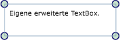

# &#220;bersicht &#252;ber Adorner
Adorner sind ein besonderer Typ von <xref:System.Windows.FrameworkElement>, mit denen visuelle Hinweise für einen Benutzer angezeigt werden.  Unter anderem können Adorner verwendet werden, um Elementen funktionale Handles hinzuzufügen oder Zustandsinformationen über ein Steuerelement zur Verfügung zu stellen.  
  
   
  
   
## Informationen über Adorner  
 Ein <xref:System.Windows.Documents.Adorner> ist ein benutzerdefiniertes <xref:System.Windows.FrameworkElement>, das an ein <xref:System.Windows.UIElement> gebunden wird.  Adorner werden in einer <xref:System.Windows.Documents.AdornerLayer> gerendert, einer Renderingoberfläche, die sich immer über dem verzierten Element oder einer Auflistung verzierter Elemente befindet.  Das Rendern eines Adorners ist unabhängig vom Rendern des <xref:System.Windows.UIElement>, an das der Adorner gebunden wird.  Ein Adorner wird typischerweise relativ zu dem Element positioniert, an das dieser gebunden ist. Dazu wird ein 2D\-Standardkoordinatenursprung verwendet, der sich in der linken oberen Ecke des verzierten Elements befindet.  
  
 Zu den häufigen Anwendungen für Adorner zählen:  
  
-   Hinzufügen funktionaler Handles für ein <xref:System.Windows.UIElement>, mit denen ein Benutzer das Element bearbeiten kann \(Größenanpassung, Drehung, Neuanordnung usw.\).  
  
-   Bereitstellen von visuellem Feedback, um verschiedene Zustände anzugeben oder als Reaktion auf verschiedene Ereignisse.  
  
-   Überlagern von <xref:System.Windows.UIElement> mit visuellen Ergänzungen.  
  
-   Visuelles Maskieren oder Überschreiben eines Teils von <xref:System.Windows.UIElement> oder des gesamten Elements.  
  
 [!INCLUDE[TLA#tla_winclient](../../../../includes/tlasharptla-winclient-md.md)] stellt ein grundlegendes Framework zum Verzieren visueller Elemente bereit.  In der folgenden Tabelle werden die zum Verzieren von Objekten verwendeten primären Typen und ihre Funktion aufgelistet.  Es folgen mehrere Verwendungsbeispiele.  
  
|||  
|-|-|  
|<xref:System.Windows.Documents.Adorner>|Eine abstrakte Basisklasse, von der alle konkreten Adornerimplementierungen erben.|  
|<xref:System.Windows.Documents.AdornerLayer>|Eine Klasse, die eine Renderingebene für den \(die\) Adorner von einem oder mehreren verzierten Elementen darstellt.|  
|<xref:System.Windows.Documents.AdornerDecorator>|Eine Klasse, die ermöglicht, dass eine Adornerebene einer Auflistung von Elementen zugeordnet werden kann.|  
  
   
## Implementieren eines benutzerdefinierten Adorners  
 Das von [!INCLUDE[TLA#tla_winclient](../../../../includes/tlasharptla-winclient-md.md)] bereitgestellte Adornerframework dient in erster Linie der Unterstützung beim Erstellen benutzerdefinierter Adorner.  Ein benutzerdefinierter Adorner wird erstellt, indem man eine Klasse implementiert, die von der abstrakten <xref:System.Windows.Documents.Adorner>\-Klasse erbt.  
  
> [!NOTE]
>  Das übergeordnete Element eines <xref:System.Windows.Documents.Adorner> ist die <xref:System.Windows.Documents.AdornerLayer>, die den <xref:System.Windows.Documents.Adorner> rendert, nicht das zu verzierende Element.  
  
 Im folgenden Beispiel wird eine Klasse dargestellt, die einen einfachen Adorner implementiert.  Der Beispieladorner versieht einfach die Ecken eines <xref:System.Windows.UIElement> mit Kreisen.  
  
 [!code-csharp[Adorners_SimpleCircleAdorner#_SimpleCircleAdornerBody](../../../../samples/snippets/csharp/VS_Snippets_Wpf/Adorners_SimpleCircleAdorner/CSharp/Window1.xaml.cs#_simplecircleadornerbody)]
 [!code-vb[Adorners_SimpleCircleAdorner#_SimpleCircleAdornerBody](../../../../samples/snippets/visualbasic/VS_Snippets_Wpf/Adorners_SimpleCircleAdorner/VisualBasic/Window1.xaml.vb#_simplecircleadornerbody)]  
  
 Im folgenden Bild wird der auf ein <xref:System.Windows.Controls.TextBox> angewendete SimpleCircleAdorner dargestellt.  
  
   
  
   
## Renderingverhalten für Adorner  
 Beachten Sie, dass für Adorner kein Renderingverhalten festgelegt ist. Sicherzustellen, dass ein Adorner rendert, ist Aufgabe des Implementierers.  Zur Implementierung von Renderingverhalten wird meistens die <xref:System.Windows.UIElement.OnRender%2A>\-Methode überschrieben, und es werden ein oder mehrere <xref:System.Windows.Media.DrawingContext>\-Objekte verwendet, um die Darstellung des Adorners wie gewünscht zu rendern \(wie im oben stehenden Beispiel gezeigt\).  
  
> [!NOTE]
>  Sämtliche Elemente auf der Adornerebene werden über allen anderen möglicherweise festgelegten Stilen gerendert.  Anders gesagt, befinden sich Adorner stets visuell im Vordergrund und können nicht mit der [Z\-Reihenfolge](GTMT) überschrieben werden.  
  
   
## Ereignisse und Treffertests  
 Adorner empfangen Eingabeereignisse wie jedes andere <xref:System.Windows.FrameworkElement>.  Da sich ein Adorner immer höher in der [Z\-Reihenfolge](GTMT) befindet als das Element, das verziert wird, empfängt der Adorner Eingabeereignisse \(z. B. <xref:System.Windows.UIElement.Drop> oder <xref:System.Windows.UIElement.MouseMove>\), die möglicherweise für das zugrunde liegende verzierte Element bestimmt sind.  Ein Adorner kann bestimmte Eingabeereignisse überwachen und sie durch erneutes Auslösen des Ereignisses an das zugrunde liegende verzierte Element weiterleiten.  
  
 Um die Pass\-Through\-Treffertests von Elementen unter einem Adorner zu aktivieren, legen Sie die <xref:System.Windows.UIElement.IsHitTestVisible%2A>\-Eigenschaft des Treffertests für den Adorner auf **false** fest.  Weitere Informationen zu Treffertests finden Sie unter  
  
 [Treffertests in der visuellen Ebene](../../../../docs/framework/wpf/graphics-multimedia/hit-testing-in-the-visual-layer.md).  
  
   
## Verzieren eines einzelnen UIElements  
 Um einen Adorner an ein bestimmtes <xref:System.Windows.UIElement> zu binden, führen Sie die folgenden Schritte aus:  
  
1.  Rufen Sie die statische Methode <xref:System.Windows.Documents.AdornerLayer.GetAdornerLayer%2A> auf, um ein <xref:System.Windows.Documents.AdornerLayer>\-Objekt für das zu verzierende <xref:System.Windows.UIElement>\-Element abzurufen.  <xref:System.Windows.Documents.AdornerLayer.GetAdornerLayer%2A> durchläuft, beginnend am angegebenen <xref:System.Windows.UIElement>\-Element , die visuelle Struktur und gibt die erste gefundene Adornerebene zurück.  \(Wenn keine Adornerebenen gefunden werden, gibt die Methode NULL zurück.\)  
  
2.  Rufen Sie die <xref:System.Windows.Documents.AdornerLayer.Add%2A>\-Methode auf, um den Adorner an das Ziel\-<xref:System.Windows.UIElement> zu binden.  
  
 Im folgenden Beispiel wird ein SimpleCircleAdorner \(siehe weiter oben\) an ein <xref:System.Windows.Controls.TextBox> mit dem Namen *myTextBox* gebunden.  
  
 [!code-csharp[Adorners_SimpleCircleAdorner#_AdornSingleElement](../../../../samples/snippets/csharp/VS_Snippets_Wpf/Adorners_SimpleCircleAdorner/CSharp/Window1.xaml.cs#_adornsingleelement)]
 [!code-vb[Adorners_SimpleCircleAdorner#_AdornSingleElement](../../../../samples/snippets/visualbasic/VS_Snippets_Wpf/Adorners_SimpleCircleAdorner/VisualBasic/Window1.xaml.vb#_adornsingleelement)]  
  
> [!NOTE]
>  Die Verwendung von [!INCLUDE[TLA#tla_xaml](../../../../includes/tlasharptla-xaml-md.md)] zum Binden eines Adorners an ein anderes Element wird derzeit nicht unterstützt.  
  
   
## Verzieren der untergeordneten Elemente eines Bereichs  
 Um einen Adorner an die untergeordneten Elemente eines <xref:System.Windows.Controls.Panel> zu binden, führen Sie diese Schritte aus:  
  
1.  Rufen Sie die `static` Methode <xref:System.Windows.Documents.AdornerLayer.GetAdornerLayer%2A> auf, um eine Adornerebene für das Element zu finden, dessen untergeordnete Elemente verziert werden sollen.  
  
2.  Durchlaufen Sie die untergeordneten Elemente des übergeordneten Elements, und rufen Sie die <xref:System.Windows.Documents.AdornerLayer.Add%2A>\-Methode auf, um einen Adorner an jedes untergeordnete Element zu binden.  
  
 Im folgenden Beispiel wird ein SimpleCircleAdorner \(siehe weiter oben\) an die untergeordneten Elemente eines <xref:System.Windows.Controls.StackPanel> mit dem Namen *myStackPanel* gebunden.  
  
 [!code-csharp[Adorners_SimpleCircleAdorner#_AdornChildren](../../../../samples/snippets/csharp/VS_Snippets_Wpf/Adorners_SimpleCircleAdorner/CSharp/Window1.xaml.cs#_adornchildren)]
 [!code-vb[Adorners_SimpleCircleAdorner#_AdornChildren](../../../../samples/snippets/visualbasic/VS_Snippets_Wpf/Adorners_SimpleCircleAdorner/VisualBasic/Window1.xaml.vb#_adornchildren)]  
  
## Siehe auch  
 <xref:System.Windows.Media.AdornerHitTestResult>   
 [Übersicht über Formen und die grundlegenden Funktionen zum Zeichnen in WPF](../../../../docs/framework/wpf/graphics-multimedia/shapes-and-basic-drawing-in-wpf-overview.md)   
 [Zeichnen mit Bildern, Zeichnungen und visuellen Elementen](../../../../docs/framework/wpf/graphics-multimedia/painting-with-images-drawings-and-visuals.md)   
 [Übersicht über Zeichnungsobjekte](../../../../docs/framework/wpf/graphics-multimedia/drawing-objects-overview.md)   
 [Gewusst wie\-Themen](../../../../docs/framework/wpf/controls/adorners-how-to-topics.md)