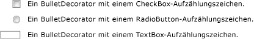

# BulletDecorator
<xref:System.Windows.Controls.Primitives.BulletDecorator>verfügt über zwei Inhaltseigenschaften: <xref:System.Windows.Controls.Primitives.BulletDecorator.Bullet%2A> und <xref:System.Windows.Controls.Decorator.Child%2A>. Die <xref:System.Windows.Controls.Primitives.BulletDecorator.Bullet%2A> Eigenschaft definiert die <xref:System.Windows.UIElement> als Aufzählungszeichen verwenden. Die <xref:System.Windows.Controls.Decorator.Child%2A> Eigenschaft definiert eine <xref:System.Windows.UIElement> , die visuell mit Aufzählungszeichen ausgerichtet.  
  
 Die folgende Abbildung zeigt Beispiele für Steuerelemente, mit denen eine <xref:System.Windows.Controls.Primitives.BulletDecorator>.  
  
   
  
## Verweis  
 <xref:System.Windows.Controls.Primitives.BulletDecorator>
