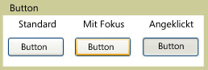

# SchaltflächeButton
Ein <xref:System.Windows.Controls.Button> Steuerelement reagiert auf Benutzereingaben, die über eine Maus, Tastatur, Stift, oder anderes Eingabegerät und löst eine <xref:System.Windows.Controls.Primitives.ButtonBase.Click> Ereignis.A <xref:System.Windows.Controls.Button> control reacts to user input from a mouse, keyboard, stylus, or other input device and raises a <xref:System.Windows.Controls.Primitives.ButtonBase.Click> event. Ein <xref:System.Windows.Controls.Button> ist eine grundlegende [!INCLUDE[TLA#tla_ui](../../../../includes/tlasharptla-ui-md.md)] -Komponente, die einfachen Inhalt, z. B. Text, enthalten und kann auch enthalten komplexe Inhaltstypen wie Bild- und <xref:System.Windows.Controls.Panel> Steuerelemente.A <xref:System.Windows.Controls.Button> is a basic [!INCLUDE[TLA#tla_ui](../../../../includes/tlasharptla-ui-md.md)] component that can contain simple content, such as text, and can also contain complex content, such as images and <xref:System.Windows.Controls.Panel> controls.  
  
   
  
## In diesem AbschnittIn This Section  
 [Erstellen einer Schaltfläche mit einem BildCreate a Button That Has an Image](how-to-create-a-button-that-has-an-image.md)  
  
## ReferenzReference  
 <xref:System.Windows.Controls.Button>  
 <xref:System.Windows.Controls.Primitives.ButtonBase>  
 <xref:System.Windows.Controls.RadioButton>  
 <xref:System.Windows.Controls.Primitives.RepeatButton>
