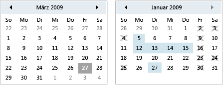

# Kalender
Ein Kalender ermöglicht einem Benutzer das Auswählen eines Datums mithilfe einer visuellen Kalender Anzeige.  
  
 Ein <xref:System.Windows.Controls.Calendar>-Steuerelement kann eigenständig oder als Dropdown Teil eines <xref:System.Windows.Controls.DatePicker> Steuer Elements verwendet werden. Weitere Informationen finden Sie unter <xref:System.Windows.Controls.DatePicker>.  
  
 In der folgenden Abbildung sind zwei <xref:System.Windows.Controls.Calendar> Steuerelemente dargestellt: eine mit Auswahl-und Datenstrom Daten und eine ohne.  
  
   
Calendar-Steuerelemente  
  
 In der folgenden Tabelle finden Sie Informationen zu Aufgaben, die in der Regel mit dem <xref:System.Windows.Controls.Calendar>verknüpft sind.  
  
|Aufgabe|Implementierung|  
|----------|--------------------|  
|Angeben von Datumsangaben, die nicht ausgewählt werden können.|Verwenden Sie die <xref:System.Windows.Controls.Calendar.BlackoutDates%2A>-Eigenschaft.|  
|Lassen Sie die <xref:System.Windows.Controls.Calendar> einen Monat, ein ganzes Jahr oder ein Jahrzehnt anzeigen.|Legen Sie die <xref:System.Windows.Controls.Calendar.DisplayMode%2A>-Eigenschaft auf month, Year oder Decade fest.|  
|Geben Sie an, ob der Benutzer ein Datum, einen Datumsbereich oder mehrere Datumsbereiche auswählen kann.|Verwenden Sie die <xref:System.Windows.Controls.Calendar.SelectionMode%2A>.|  
|Geben Sie den Datumsbereich an, der in der <xref:System.Windows.Controls.Calendar> angezeigt wird.|Verwenden Sie die <xref:System.Windows.Controls.Calendar.DisplayDateStart%2A>-Eigenschaft und die <xref:System.Windows.Controls.Calendar.DisplayDateEnd%2A>-Eigenschaft.|  
|Geben Sie an, ob das aktuelle Datum hervorgehoben ist.|Verwenden Sie die <xref:System.Windows.Controls.Calendar.IsTodayHighlighted%2A>-Eigenschaft. Standardmäßig ist <xref:System.Windows.Controls.Calendar.IsTodayHighlighted%2A> `true`.|  
|Ändern Sie die Größe der <xref:System.Windows.Controls.Calendar>.|Verwenden Sie einen <xref:System.Windows.Controls.Viewbox>, oder legen Sie die <xref:System.Windows.FrameworkElement.LayoutTransform%2A>-Eigenschaft auf einen <xref:System.Windows.Media.ScaleTransform>fest. Beachten Sie, dass beim Festlegen der Eigenschaften <xref:System.Windows.FrameworkElement.Width%2A> und <xref:System.Windows.FrameworkElement.Height%2A> eines <xref:System.Windows.Controls.Calendar>der tatsächliche Kalender seine Größe nicht ändert.|  
  
 Das <xref:System.Windows.Controls.Calendar> Steuerelement ermöglicht die einfache Navigation mit der Maus oder der Tastatur. In der folgenden Tabelle wird die Tastaturnavigation zusammengefasst.  
  
|Tastenkombination|<xref:System.Windows.Controls.Calendar.DisplayMode%2A>|Aktion|  
|---------------------|-----------------------------------------------------------------------------------------------------------------------------------------------------------|------------|  
|Gift|<xref:System.Windows.Controls.CalendarMode.Month>|Ändert die <xref:System.Windows.Controls.Calendar.SelectedDate%2A>-Eigenschaft, wenn die <xref:System.Windows.Controls.Calendar.SelectionMode%2A>-Eigenschaft nicht auf "<xref:System.Windows.Controls.CalendarSelectionMode.None>" festgelegt ist.|  
|Gift|<xref:System.Windows.Controls.CalendarMode.Year>|Ändert den Monat der <xref:System.Windows.Controls.Calendar.DisplayDate%2A>-Eigenschaft. Beachten Sie, dass sich die <xref:System.Windows.Controls.Calendar.SelectedDate%2A> nicht ändert.|  
|Gift|<xref:System.Windows.Controls.CalendarMode.Decade>|Ändert das Jahr des <xref:System.Windows.Controls.Calendar.DisplayDate%2A>. Beachten Sie, dass sich die <xref:System.Windows.Controls.Calendar.SelectedDate%2A> nicht ändert.|  
|Umschalt + Pfeil|<xref:System.Windows.Controls.CalendarMode.Month>|Wenn <xref:System.Windows.Controls.Calendar.SelectionMode%2A> nicht auf <xref:System.Windows.Controls.CalendarSelectionMode.SingleDate> oder <xref:System.Windows.Controls.CalendarSelectionMode.None>festgelegt ist, erweitert den Bereich der ausgewählten Datumsangaben.|  
|START|<xref:System.Windows.Controls.CalendarMode.Month>|Ändert die <xref:System.Windows.Controls.Calendar.SelectedDate%2A> in den ersten Tag des aktuellen Monats.|  
|START|<xref:System.Windows.Controls.CalendarMode.Year>|Ändert den Monat des <xref:System.Windows.Controls.Calendar.DisplayDate%2A> in den ersten Monat des Jahres. Der <xref:System.Windows.Controls.Calendar.SelectedDate%2A> ändert sich nicht.|  
|START|<xref:System.Windows.Controls.CalendarMode.Decade>|Ändert das Jahr des <xref:System.Windows.Controls.Calendar.DisplayDate%2A> in das erste Jahr des Jahrzehnts. Der <xref:System.Windows.Controls.Calendar.SelectedDate%2A> ändert sich nicht.|  
|ENDE|<xref:System.Windows.Controls.CalendarMode.Month>|Ändert die <xref:System.Windows.Controls.Calendar.SelectedDate%2A> auf den letzten Tag des aktuellen Monats.|  
|ENDE|<xref:System.Windows.Controls.CalendarMode.Year>|Ändert den Monat des <xref:System.Windows.Controls.Calendar.DisplayDate%2A> in den letzten Monat des Jahres. Der <xref:System.Windows.Controls.Calendar.SelectedDate%2A> ändert sich nicht.|  
|ENDE|<xref:System.Windows.Controls.CalendarMode.Decade>|Ändert das Jahr des <xref:System.Windows.Controls.Calendar.DisplayDate%2A> in das letzte Jahr des Jahrzehnts. Der <xref:System.Windows.Controls.Calendar.SelectedDate%2A> ändert sich nicht.|  
|STRG+NACH-OBEN|Beliebig|Wechselt zum nächsten größeren <xref:System.Windows.Controls.Calendar.DisplayMode%2A>. Wenn <xref:System.Windows.Controls.Calendar.DisplayMode%2A> bereits <xref:System.Windows.Controls.CalendarMode.Decade>ist, wird keine Aktion ausgeführt.|  
|STRG+NACH-UNTEN|Beliebig|Wechselt zum nächsten kleineren <xref:System.Windows.Controls.Calendar.DisplayMode%2A>. Wenn <xref:System.Windows.Controls.Calendar.DisplayMode%2A> bereits <xref:System.Windows.Controls.CalendarMode.Month>ist, wird keine Aktion ausgeführt.|  
|Leertaste oder EINGABETASTE|<xref:System.Windows.Controls.CalendarMode.Year> oder <xref:System.Windows.Controls.CalendarMode.Decade>|Schaltet <xref:System.Windows.Controls.Calendar.DisplayMode%2A> auf die <xref:System.Windows.Controls.CalendarMode.Month> oder <xref:System.Windows.Controls.CalendarMode.Year>, die durch das fokussierte Element dargestellt werden.|  
  
## Siehe auch

- [Steuerelemente](index.md)
- [Erstellen von Formaten und Vorlagen](../../../desktop-wpf/fundamentals/styles-templates-overview.md)
