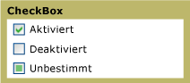

# CheckBox
Sie können eine <xref:System.Windows.Controls.CheckBox> in der [!INCLUDE[TLA#tla_ui](../../../../includes/tlasharptla-ui-md.md)] Ihrer Anwendung für Optionen verwenden, die ein Benutzer auswählen oder deaktivieren kann.  Sie können ein einzelnes Kontrollkästchen verwenden, oder Sie können zwei oder mehr Kontrollkästchen gruppieren.  
  
 Die folgende Grafik zeigt die unterschiedlichen Zustände einer <xref:System.Windows.Controls.CheckBox>.  
  
   
CheckBox\-Steuerelemente in unterschiedlichen Zuständen  
  
## Referenz  
 <xref:System.Windows.Controls.CheckBox>  
 <xref:System.Windows.Controls.RadioButton>  
 <xref:System.Windows.Controls.Primitives.ButtonBase>  
 <xref:System.Windows.Controls.Primitives.RepeatButton>  
  
## Verwandte Abschnitte