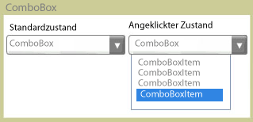

# ComboBoxComboBox
Die <xref:System.Windows.Controls.ComboBox> -Steuerelement stellt Benutzern eine Liste mit Optionen.The <xref:System.Windows.Controls.ComboBox> control presents users with a list of options. Die Liste wird angezeigt und ausgeblendet, wenn das Steuerelement erweitert oder reduziert.The list is shown and hidden as the control expands and collapses. Die Liste ist in seinem Standardzustand reduziert und zeigt nur eine Auswahl.In its default state, the list is collapsed, displaying only one choice. Der Benutzer klickt auf eine Schaltfläche, um die vollständige Liste der Optionen anzuzeigen.The user clicks a button to see the complete list of options.  
  
 Die folgende Abbildung zeigt eine <xref:System.Windows.Controls.ComboBox> in unterschiedlichen Zuständen.The following illustration shows a <xref:System.Windows.Controls.ComboBox> in different states.  
  
   
Reduziert und erweitertCollapsed and expanded  
  
## In diesem AbschnittIn This Section  
 [Vorgehensweise: Abrufen eines ComboBoxItemHow to: Get a ComboBoxItem](http://msdn.microsoft.com/library/8a0d2622-64b6-41fc-bf80-9669a1eacb53)  
  
## ReferenzReference  
 <xref:System.Windows.Controls.ComboBox>
