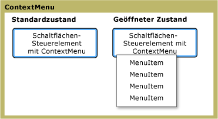

# ContextMenu
Die <xref:System.Windows.Controls.ContextMenu> ermöglicht es einem Steuerelement zum Anzeigen einer <xref:System.Windows.Controls.Menu> , ist nur für den Kontext des Steuerelements. In der Regel die <xref:System.Windows.Controls.ContextMenu> wird verfügbar gemacht, der [!INCLUDE[TLA#tla_ui](../../../../includes/tlasharptla-ui-md.md)] über die rechte Maustaste gedrückt oder über die Tastatur Menüschaltfläche.  
  
 Die folgende Abbildung veranschaulicht einen <xref:System.Windows.Controls.ContextMenu> in zwei verschiedenen Zustände: den Standardstatus und den geöffneten Zustand. In den Standardzustand zurückgesetzt ist das Steuerelement reduziert. Beim Klicken auf die rechten Maustaste auf das übergeordnete Element des Menüs aufgerufen wird, wird das Steuerelement erweitert und zeigt die Menüelemente.  
  
   
Kontextmenü in unterschiedlichen Zuständen  
  
## In diesem Abschnitt  
 [Übersicht über ContextMenu](../../../../docs/framework/wpf/controls/contextmenu-overview.md)  
  
## Referenz  
 <xref:System.Windows.Controls.ContextMenu>  
  
## Verwandte Abschnitte
