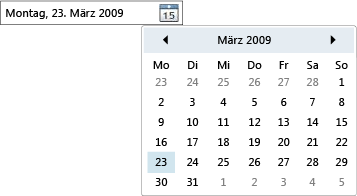

# DatePickerDatePicker
Das <xref:System.Windows.Controls.DatePicker> Steuerelement ermöglicht es dem Benutzer, ein Datum auszuwählen, indem es entweder in ein Textfeld eingegeben oder mithilfe eines Dropdown <xref:System.Windows.Controls.Calendar> Steuer Elements verwendet wird.The <xref:System.Windows.Controls.DatePicker> control allows the user to select a date by either typing it into a text field or by using a drop-down <xref:System.Windows.Controls.Calendar> control.  
  
 Die folgende Abbildung zeigt eine <xref:System.Windows.Controls.DatePicker>.The following illustration shows a <xref:System.Windows.Controls.DatePicker>.  
  
   
DatePicker-SteuerelementDatePicker Control  
  
 Viele der Eigenschaften eines <xref:System.Windows.Controls.DatePicker> Steuer Elements dienen zum Verwalten der integrierten <xref:System.Windows.Controls.Calendar>und funktionieren identisch mit der entsprechenden Eigenschaft in <xref:System.Windows.Controls.Calendar>.Many of a <xref:System.Windows.Controls.DatePicker> control's properties are for managing its built-in <xref:System.Windows.Controls.Calendar>, and function identically to the equivalent property in <xref:System.Windows.Controls.Calendar>. Insbesondere die Eigenschaften <xref:System.Windows.Controls.DatePicker.IsTodayHighlighted%2A?displayProperty=nameWithType>, <xref:System.Windows.Controls.DatePicker.FirstDayOfWeek%2A?displayProperty=nameWithType>, <xref:System.Windows.Controls.DatePicker.BlackoutDates%2A?displayProperty=nameWithType>, <xref:System.Windows.Controls.DatePicker.DisplayDateStart%2A?displayProperty=nameWithType>, <xref:System.Windows.Controls.DatePicker.DisplayDateEnd%2A?displayProperty=nameWithType>, <xref:System.Windows.Controls.DatePicker.DisplayDate%2A?displayProperty=nameWithType>und <xref:System.Windows.Controls.DatePicker.SelectedDate%2A?displayProperty=nameWithType> funktionieren identisch mit ihren <xref:System.Windows.Controls.Calendar> Entsprechungen.In particular, the <xref:System.Windows.Controls.DatePicker.IsTodayHighlighted%2A?displayProperty=nameWithType>, <xref:System.Windows.Controls.DatePicker.FirstDayOfWeek%2A?displayProperty=nameWithType>, <xref:System.Windows.Controls.DatePicker.BlackoutDates%2A?displayProperty=nameWithType>, <xref:System.Windows.Controls.DatePicker.DisplayDateStart%2A?displayProperty=nameWithType>, <xref:System.Windows.Controls.DatePicker.DisplayDateEnd%2A?displayProperty=nameWithType>, <xref:System.Windows.Controls.DatePicker.DisplayDate%2A?displayProperty=nameWithType>, and <xref:System.Windows.Controls.DatePicker.SelectedDate%2A?displayProperty=nameWithType> properties function identically to their <xref:System.Windows.Controls.Calendar> counterparts. Weitere Informationen finden Sie unter <xref:System.Windows.Controls.Calendar>.For more information, see <xref:System.Windows.Controls.Calendar>.  
  
 Benutzer können ein Datum direkt in ein Textfeld eingeben, das die <xref:System.Windows.Controls.DatePicker.Text%2A>-Eigenschaft festlegt.Users can type a date directly into a text field, which sets the <xref:System.Windows.Controls.DatePicker.Text%2A> property. Wenn das <xref:System.Windows.Controls.DatePicker> die eingegebene Zeichenfolge nicht in ein gültiges Datum konvertieren kann, wird das <xref:System.Windows.Controls.DatePicker.DateValidationError> Ereignis ausgelöst.If the <xref:System.Windows.Controls.DatePicker> cannot convert the entered string to a valid date, the <xref:System.Windows.Controls.DatePicker.DateValidationError> event will be raised. Standardmäßig verursacht dies eine Ausnahme, aber ein Ereignishandler für <xref:System.Windows.Controls.DatePicker.DateValidationError> kann die <xref:System.Windows.Controls.DatePickerDateValidationErrorEventArgs.ThrowException%2A>-Eigenschaft auf `false` festlegen und verhindern, dass eine Ausnahme ausgelöst wird.By default, this causes an exception, but an event handler for <xref:System.Windows.Controls.DatePicker.DateValidationError> can set the <xref:System.Windows.Controls.DatePickerDateValidationErrorEventArgs.ThrowException%2A> property to `false` and prevent an exception from being raised.  
  
## Siehe auchSee also

- [SteuerelementeControls](index.md)
- [Erstellen von Formaten und VorlagenStyling and Templating](../../../desktop-wpf/fundamentals/styles-templates-overview.md)
