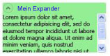

# Übersicht über Expander-SteuerelementeExpander Overview
Ein <xref:System.Windows.Controls.Expander> Steuerelement bietet eine Möglichkeit zum Bereitstellen von Inhalt in einem erweiterbaren Bereich, der einem Fenster ähnelt und einen Header enthält.An <xref:System.Windows.Controls.Expander> control provides a way to provide content in an expandable area that resembles a window and includes a header.  
  
  
   
## Erstellen einer einfachen ExpandersCreating a Simple Expander  
 Im folgende Beispiel veranschaulicht die Erstellung eines einfachen <xref:System.Windows.Controls.Expander> Steuerelement.The following example shows how to create a simple <xref:System.Windows.Controls.Expander> control. In diesem Beispiel wird ein <xref:System.Windows.Controls.Expander> sieht in der vorherige Abbildung.This example creates an <xref:System.Windows.Controls.Expander> that looks like the previous illustration.  
  
 [!code-xaml[ExpanderExample#2](../../../../samples/snippets/csharp/VS_Snippets_Wpf/ExpanderExample/CSharp/Page1.xaml#2)]  
  
 Die <xref:System.Windows.Controls.ContentControl.Content%2A> und <xref:System.Windows.Controls.HeaderedContentControl.Header%2A> von einer <xref:System.Windows.Controls.Expander> können auch keine komplexen Inhalt wie <xref:System.Windows.Controls.RadioButton> und <xref:System.Windows.Controls.Image> Objekte.The <xref:System.Windows.Controls.ContentControl.Content%2A> and <xref:System.Windows.Controls.HeaderedContentControl.Header%2A> of an <xref:System.Windows.Controls.Expander> can also contain complex content, such as <xref:System.Windows.Controls.RadioButton> and <xref:System.Windows.Controls.Image> objects.  
  
   
## Festlegen der Erweiterungsrichtung des InhaltsbereichsSetting the Direction of the Expanding Content Area  
 Sie können festlegen, dass den Inhaltsbereich des ein <xref:System.Windows.Controls.Expander> Steuerelement in einem der vier Richtungen erweitern (<xref:System.Windows.Controls.ExpandDirection.Down>, <xref:System.Windows.Controls.ExpandDirection.Up>, <xref:System.Windows.Controls.ExpandDirection.Left>, oder <xref:System.Windows.Controls.ExpandDirection.Right>) mithilfe der <xref:System.Windows.Controls.ExpandDirection> Eigenschaft.You can set the content area of an <xref:System.Windows.Controls.Expander> control to expand in one of four directions (<xref:System.Windows.Controls.ExpandDirection.Down>, <xref:System.Windows.Controls.ExpandDirection.Up>, <xref:System.Windows.Controls.ExpandDirection.Left>, or <xref:System.Windows.Controls.ExpandDirection.Right>) by using the <xref:System.Windows.Controls.ExpandDirection> property. Wenn der Inhaltsbereich reduziert ist, werden nur die <xref:System.Windows.Controls.Expander> <xref:System.Windows.Controls.HeaderedContentControl.Header%2A> und entsprechende Umschaltfläche angezeigt.When the content area is collapsed, only the <xref:System.Windows.Controls.Expander><xref:System.Windows.Controls.HeaderedContentControl.Header%2A> and its toggle button appear. Ein <xref:System.Windows.Controls.Button> Steuerelement, das einen Pfeil zeigt dient als eine Umschaltfläche zum Erweitern oder Reduzieren des Inhaltsbereichs.A <xref:System.Windows.Controls.Button> control that displays a directional arrow is used as a toggle button to expand or collapse the content area. Wenn die Kategorie erweitert ist, die <xref:System.Windows.Controls.Expander> versucht, alle ihre Inhalte in einem Fenster-ähnliche Bereich anzuzeigen.When expanded, the <xref:System.Windows.Controls.Expander> tries to display all of its content in a window-like area.  
  
   
## Steuerung der Größe eines Expanders in einem PanelControlling the Size of an Expander in a Panel  
 Wenn ein <xref:System.Windows.Controls.Expander> Steuerelement ist in einem Layoutsteuerelement, die von erben <xref:System.Windows.Controls.Panel>, wie z. B. <xref:System.Windows.Controls.StackPanel>, geben Sie keine <xref:System.Windows.FrameworkElement.Height%2A> auf der <xref:System.Windows.Controls.Expander> bei der <xref:System.Windows.Controls.Expander.ExpandDirection%2A> -Eigenschaftensatz auf <xref:System.Windows.Controls.ExpandDirection.Down> oder <xref:System.Windows.Controls.ExpandDirection.Up>.If an <xref:System.Windows.Controls.Expander> control is inside a layout control that inherits from <xref:System.Windows.Controls.Panel>, such as <xref:System.Windows.Controls.StackPanel>, do not specify a <xref:System.Windows.FrameworkElement.Height%2A> on the <xref:System.Windows.Controls.Expander> when the <xref:System.Windows.Controls.Expander.ExpandDirection%2A> property is set to <xref:System.Windows.Controls.ExpandDirection.Down> or <xref:System.Windows.Controls.ExpandDirection.Up>. Auf ähnliche Weise Geben Sie kein <xref:System.Windows.FrameworkElement.Width%2A> auf die <xref:System.Windows.Controls.Expander> bei der <xref:System.Windows.Controls.Expander.ExpandDirection%2A> -Eigenschaftensatz auf <xref:System.Windows.Controls.ExpandDirection.Left> oder <xref:System.Windows.Controls.ExpandDirection.Right>.Similarly, do not specify a <xref:System.Windows.FrameworkElement.Width%2A> on the <xref:System.Windows.Controls.Expander> when the <xref:System.Windows.Controls.Expander.ExpandDirection%2A> property is set to <xref:System.Windows.Controls.ExpandDirection.Left> or <xref:System.Windows.Controls.ExpandDirection.Right>.  
  
 Wenn Sie eine Größendimension festlegen, auf ein <xref:System.Windows.Controls.Expander> -Steuerelement in die Richtung an, dass der erweiterte Inhalt angezeigt wird, die <xref:System.Windows.Controls.Expander> übernimmt die Kontrolle des Bereichs, der anhand des Inhalts verwendet wird, und zeigt einen Rahmen.When you set a size dimension on an <xref:System.Windows.Controls.Expander> control in the direction that the expanded content is displayed, the <xref:System.Windows.Controls.Expander> takes control of the area that is used by the content and displays a border around it. Der Rahmen wird auch angezeigt, wenn der Inhalt reduziert ist.The border shows even when the content is collapsed. Legen Sie zum Festlegen der Größe des erweiterten Inhaltsbereichs größenabmessungen für den Inhalt der <xref:System.Windows.Controls.Expander>, oder wenn Sie möchten Scrollen Fähigkeit, auf die <xref:System.Windows.Controls.ScrollViewer> , das den Inhalt einschließt.To set the size of the expanded content area, set size dimensions on the content of the <xref:System.Windows.Controls.Expander>, or if you want scrolling capability, on the <xref:System.Windows.Controls.ScrollViewer> that encloses the content.  
  
 Beim ein <xref:System.Windows.Controls.Expander> Steuerelement ist das letzte Element in eine <xref:System.Windows.Controls.DockPanel>, [!INCLUDE[TLA#tla_winclient](../../../../includes/tlasharptla-winclient-md.md)] legt automatisch die <xref:System.Windows.Controls.Expander> Dimensionen so, dass den verbleibenden Bereich von der <xref:System.Windows.Controls.DockPanel>.When an <xref:System.Windows.Controls.Expander> control is the last element in a <xref:System.Windows.Controls.DockPanel>, [!INCLUDE[TLA#tla_winclient](../../../../includes/tlasharptla-winclient-md.md)] automatically sets the <xref:System.Windows.Controls.Expander> dimensions to equal the remaining area of the <xref:System.Windows.Controls.DockPanel>. Um dieses Standardverhalten zu verhindern, legen die <xref:System.Windows.Controls.DockPanel.LastChildFill%2A> Eigenschaft auf die <xref:System.Windows.Controls.DockPanel> -Objekt `false`, oder stellen Sie sicher, dass die <xref:System.Windows.Controls.Expander> ist nicht das letzte Element in einer <xref:System.Windows.Controls.DockPanel>.To prevent this default behavior, set the <xref:System.Windows.Controls.DockPanel.LastChildFill%2A> property on the <xref:System.Windows.Controls.DockPanel> object to `false`, or make sure that the <xref:System.Windows.Controls.Expander> is not the last element in a <xref:System.Windows.Controls.DockPanel>.  
  
   
## Erstellen vom bildlauffähigem InhaltCreating Scrollable Content  
 Wenn der Inhalt für die Größe des Inhaltsbereichs zu groß ist, können Sie den Inhalt des umschließen einer <xref:System.Windows.Controls.Expander> in eine <xref:System.Windows.Controls.ScrollViewer> um bildlauffähigem Inhalt bereitzustellen.If the content is too large for the size of the content area, you can wrap the content of an <xref:System.Windows.Controls.Expander> in a <xref:System.Windows.Controls.ScrollViewer> in order to provide scrollable content. Die <xref:System.Windows.Controls.Expander> Steuerelement stellt Bildlauffunktion nicht automatisch bereit.The <xref:System.Windows.Controls.Expander> control does not automatically provide scrolling capability. Die folgende Abbildung zeigt ein <xref:System.Windows.Controls.Expander> -Steuerelement, enthält eine <xref:System.Windows.Controls.ScrollViewer> Steuerelement.The following illustration shows an <xref:System.Windows.Controls.Expander> control that contains a <xref:System.Windows.Controls.ScrollViewer> control.  
  
 **Expander-Steuerelement in einem ScrollViewer****Expander in a ScrollViewer**  
  
   
  
 Beim Platzieren ein <xref:System.Windows.Controls.Expander> steuern, eine <xref:System.Windows.Controls.ScrollViewer>legen die <xref:System.Windows.Controls.ScrollViewer> -Dimensionseigenschaft, der die Richtung, in der entspricht der <xref:System.Windows.Controls.Expander> Inhalt wird geöffnet, auf die Größe des der <xref:System.Windows.Controls.Expander> Inhaltsbereich.When you place an <xref:System.Windows.Controls.Expander> control in a <xref:System.Windows.Controls.ScrollViewer>, set the <xref:System.Windows.Controls.ScrollViewer> dimension property that corresponds to the direction in which the <xref:System.Windows.Controls.Expander> content opens to the size of the <xref:System.Windows.Controls.Expander> content area. Z. B., wenn Sie festlegen der <xref:System.Windows.Controls.Expander.ExpandDirection%2A> Eigenschaft auf die <xref:System.Windows.Controls.Expander> auf <xref:System.Windows.Controls.ExpandDirection.Down> (der Inhaltsbereich wird nach unten), Festlegen der <xref:System.Windows.FrameworkElement.Height%2A> Eigenschaft auf die <xref:System.Windows.Controls.ScrollViewer> Steuerelement, um die erforderliche Höhe des Inhaltsbereichs.For example, if you set the <xref:System.Windows.Controls.Expander.ExpandDirection%2A> property on the <xref:System.Windows.Controls.Expander> to <xref:System.Windows.Controls.ExpandDirection.Down> (the content area opens down), set the <xref:System.Windows.FrameworkElement.Height%2A> property on the <xref:System.Windows.Controls.ScrollViewer> control to the required height for the content area. Wenn Sie stattdessen höhenabmessung des Inhalts selbst festlegen <xref:System.Windows.Controls.ScrollViewer> diese Einstellung nicht erkannt und daher keinen bildlauffähigem Inhalt.If you instead set the height dimension on the content itself, <xref:System.Windows.Controls.ScrollViewer> does not recognize this setting and therefore, does not provide scrollable content.  
  
 Im folgende Beispiel wird gezeigt, wie zum Erstellen einer <xref:System.Windows.Controls.Expander> Steuerelement mit komplexen Inhalt enthält, die eine <xref:System.Windows.Controls.ScrollViewer> Steuerelement.The following example shows how to create an <xref:System.Windows.Controls.Expander> control that has complex content and that contains a <xref:System.Windows.Controls.ScrollViewer> control. In diesem Beispiel wird eine <xref:System.Windows.Controls.Expander> , die wie in der Abbildung am Anfang dieses Abschnitts ist.This example creates an <xref:System.Windows.Controls.Expander> that is like the illustration at the beginning of this section.  
  
 [!code-csharp[ExpanderRichContent#1](../../../../samples/snippets/csharp/VS_Snippets_Wpf/ExpanderRichContent/CSharp/Window1.xaml.cs#1)]
 [!code-vb[ExpanderRichContent#1](../../../../samples/snippets/visualbasic/VS_Snippets_Wpf/ExpanderRichContent/VisualBasic/Window1.xaml.vb#1)]
 [!code-xaml[ExpanderRichContent#1](../../../../samples/snippets/csharp/VS_Snippets_Wpf/ExpanderRichContent/CSharp/Window1.xaml#1)]  
  
   
## Verwenden der AusrichtungseigenschaftenUsing the Alignment Properties  
 Ausrichten von Inhalt durch Festlegen der <xref:System.Windows.Controls.Control.HorizontalContentAlignment%2A> und <xref:System.Windows.Controls.Control.VerticalContentAlignment%2A> Eigenschaften auf der <xref:System.Windows.Controls.Expander> Steuerelement.You can align content by setting the <xref:System.Windows.Controls.Control.HorizontalContentAlignment%2A> and <xref:System.Windows.Controls.Control.VerticalContentAlignment%2A> properties on the <xref:System.Windows.Controls.Expander> control. Wenn Sie diese Eigenschaften festlegen, wird die Ausrichtung sowohl auf den Header, als auch auf den erweiterten Inhalt angewendet.When you set these properties, the alignment applies to the header and also to the expanded content.  
  
## Siehe auchSee Also  
 <xref:System.Windows.Controls.Expander>  
 <xref:System.Windows.Controls.ExpandDirection>  
 [Gewusst wie-ThemenHow-to Topics](../../../../docs/framework/wpf/controls/expander-how-to-topics.md)
