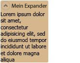

# Expander
Ein <xref:System.Windows.Controls.Expander> ermöglicht es einem Benutzer auf einen Header anzuzeigen und zu erweitern, um weitere Details anzuzeigen oder um einen Abschnitt eines Headers zu reduzieren.  
  
 Die folgende Abbildung zeigt ein Beispiel für dieses Steuerelement in der erweiterten Position.  
  
   
Expander-Steuerelement  
  
## In diesem Abschnitt  
 [Übersicht über Expander-Steuerelemente](../../../../docs/framework/wpf/controls/expander-overview.md)  
 [Themen zu Vorgehensweisen](../../../../docs/framework/wpf/controls/expander-how-to-topics.md)  
  
## Verweis  
 <xref:System.Windows.Controls.Expander>  
  
## Verwandte Abschnitte
