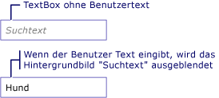

# Gewusst wie: Hinzufügen eines Wasserzeichens zu einer TextBoxHow to: Add a Watermark to a TextBox
Im folgende Beispiel wird gezeigt, wie die Verwendbarkeit einer <xref:System.Windows.Controls.TextBox> durch Anzeigen eines erläuternden Hintergrundbilds innerhalb eines der <xref:System.Windows.Controls.TextBox> bis der Benutzer Text eingibt, an welchem Punkt das Bild wird entfernt.The following example shows how to aid usability of a <xref:System.Windows.Controls.TextBox> by displaying an explanatory background image inside of the <xref:System.Windows.Controls.TextBox> until the user inputs text, at which point the image is removed. Darüber hinaus wird das Hintergrundbild erneut wiederhergestellt werden, wenn der Benutzer die Eingabe entfernt.In addition, the background image is restored again if the user removes their input. Siehe folgende Abbildung.See illustration below.  
  
   
  
> [!NOTE]
>  Der Grund, ein Hintergrundbild wird in diesem Beispiel stattdessen dann einfach bearbeiten verwendet, die <xref:System.Windows.Controls.TextBox.Text%2A> Eigenschaft <xref:System.Windows.Controls.TextBox>, darin, dass ein Hintergrundbild nicht in Konflikt mit dem Datenbindung wird.The reason a background image is used in this example rather then simply manipulating the <xref:System.Windows.Controls.TextBox.Text%2A> property of <xref:System.Windows.Controls.TextBox>, is that a background image will not interfere with data binding.  
  
## BeispielExample  
 [!code-xaml[TextBoxMiscSnippets_snip#TextBoxBackgroundExampleWholePage](../../../../samples/snippets/csharp/VS_Snippets_Wpf/TextBoxMiscSnippets_snip/csharp/textbox_with_background_image.xaml#textboxbackgroundexamplewholepage)]  
  
 [!code-csharp[TextBoxMiscSnippets_snip#TextBoxBackgroundCodeExampleWholePage](../../../../samples/snippets/csharp/VS_Snippets_Wpf/TextBoxMiscSnippets_snip/csharp/textbox_with_background_image.xaml.cs#textboxbackgroundcodeexamplewholepage)]
 [!code-vb[TextBoxMiscSnippets_snip#TextBoxBackgroundCodeExampleWholePage](../../../../samples/snippets/visualbasic/VS_Snippets_Wpf/TextBoxMiscSnippets_snip/visualbasic/textbox_with_background_image.xaml.vb#textboxbackgroundcodeexamplewholepage)]  
  
## Siehe auchSee Also  
 [Übersicht über TextBoxTextBox Overview](../../../../docs/framework/wpf/controls/textbox-overview.md)  
 [Übersicht über RichTextBoxRichTextBox Overview](../../../../docs/framework/wpf/controls/richtextbox-overview.md)
