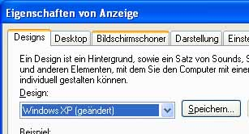

# BezeichnungLabel
<xref:System.Windows.Controls.Label> Steuerelemente in der Regel geben Sie Informationen in den [!INCLUDE[TLA#tla_ui](../../../../includes/tlasharptla-ui-md.md)].<xref:System.Windows.Controls.Label> controls usually provide information in the [!INCLUDE[TLA#tla_ui](../../../../includes/tlasharptla-ui-md.md)].  In der Vergangenheit ein <xref:System.Windows.Controls.Label> hat nur Text enthalten, aber da die <xref:System.Windows.Controls.Label> , im Lieferumfang [!INCLUDE[TLA#tla_winclient](../../../../includes/tlasharptla-winclient-md.md)] ist eine <xref:System.Windows.Controls.ContentControl>, es kann entweder Text enthalten oder ein <xref:System.Windows.UIElement>.Historically, a <xref:System.Windows.Controls.Label> has contained only text, but because the <xref:System.Windows.Controls.Label> that ships with [!INCLUDE[TLA#tla_winclient](../../../../includes/tlasharptla-winclient-md.md)] is a <xref:System.Windows.Controls.ContentControl>, it can contain either text or a <xref:System.Windows.UIElement>.  
  
 Ein <xref:System.Windows.Controls.Label> liefert funktionale und visuelle Unterstützung für Tastenkombinationen.A <xref:System.Windows.Controls.Label> provides both functional and visual support for access keys. Es wird häufig verwendet, um schnell den Zugriff auf Steuerelemente zu ermöglichen, z.B. eine <xref:System.Windows.Controls.TextBox>.It is frequently used to enable quick keyboard access to controls such as a <xref:System.Windows.Controls.TextBox>. Zuweisen einer <xref:System.Windows.Controls.Label> auf eine <xref:System.Windows.Controls.Control>legen die <xref:System.Windows.Controls.Label.Target%2A?displayProperty=nameWithType> Eigenschaft, um das Steuerelement, das Fokus erhalten soll, wenn der Benutzer die Zugriffstaste drückt.To assign a <xref:System.Windows.Controls.Label> to a <xref:System.Windows.Controls.Control>, set the <xref:System.Windows.Controls.Label.Target%2A?displayProperty=nameWithType> property to the control that should get focus when the user presses the access key.  
  
 Die folgende Abbildung zeigt eine <xref:System.Windows.Controls.Label> "Designs", dessen Ziel eine <xref:System.Windows.Controls.ComboBox>.The following image shows a <xref:System.Windows.Controls.Label> "Themes" that targets a <xref:System.Windows.Controls.ComboBox>.  Wenn der Benutzer drückt, die <xref:System.Windows.Controls.ComboBox> den Fokus erhält.When the user presses , the <xref:System.Windows.Controls.ComboBox> receives focus.  Weitere Informationen finden Sie unter [Vorgehensweise: Festlegen der Zieleigenschaft einer Bezeichnung](https://msdn.microsoft.com/library/b24c6977-ebcb-4855-a9bb-3fd4435af8f8).For more information, see [How to: Set the Target Property of a Label](https://msdn.microsoft.com/library/b24c6977-ebcb-4855-a9bb-3fd4435af8f8).  
  
   
  
## In diesem AbschnittIn This Section  
 [Vorgehensweise: Festlegen der Eigenschaft „Target“ einer BezeichnungHow to: Set the Target Property of a Label](https://msdn.microsoft.com/library/b24c6977-ebcb-4855-a9bb-3fd4435af8f8)  
  
## ReferenzReference  
 <xref:System.Windows.Controls.Label>
