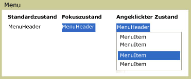

# Menü
Ein <xref:System.Windows.Controls.Menu> ist ein Steuerelement, das hierarchische Organisation der Elemente, die mithilfe von Befehlen oder Ereignishandlern ermöglicht. Jede <xref:System.Windows.Controls.Menu> können enthält mehrere <xref:System.Windows.Controls.MenuItem> Steuerelemente. Jede <xref:System.Windows.Controls.MenuItem> können einen Befehl aufrufen, oder rufen einen `Click` -Ereignishandler. Ein <xref:System.Windows.Controls.MenuItem> kann auch über mehrere verfügen <xref:System.Windows.Controls.MenuItem> -Elemente als untergeordnete Elemente, die ein Untermenü bilden.  
  
 Die folgende Abbildung zeigt die drei verschiedenen Zustände eines Steuerelements im Menü. Der Standardstatus lautet, wenn kein Gerät wie z. B. ein Mauszeiger befindet sich auf die <xref:System.Windows.Controls.Menu>. Des Fokuszustands tritt auf, wenn der Mauszeiger zeigt die <xref:System.Windows.Controls.Menu> und gedrückten Zustand tritt auf, wenn eine Maustaste, über geklickt wird die <xref:System.Windows.Controls.Menu>.  
  
   
Menüs in unterschiedlichen Zuständen  
  
## In diesem Abschnitt  
 [Übersicht über Menu](menu-overview.md)  
  
## Referenz  
 <xref:System.Windows.Controls.Menu>  
  <xref:System.Windows.Controls.MenuItem>  
  <xref:System.Windows.Controls.Primitives.MenuBase>  
  <xref:System.Windows.Controls.ContextMenu>  
  
## Verwandte Abschnitte
