# Verhalten beim Platzieren von PopupsPopup Placement Behavior
Ein <xref:System.Windows.Controls.Primitives.Popup> -Steuerelement zeigt den Inhalt in einem separaten Fenster, die über eine Anwendung gleitet.A <xref:System.Windows.Controls.Primitives.Popup> control displays content in a separate window that floats over an application. Sie können angeben, der die Position des eine <xref:System.Windows.Controls.Primitives.Popup> relativ zu einem Steuerelement, die Maus oder den Bildschirm mit den <xref:System.Windows.Controls.Primitives.Popup.PlacementTarget%2A>, <xref:System.Windows.Controls.Primitives.Popup.Placement%2A>, <xref:System.Windows.Controls.Primitives.Popup.PlacementRectangle%2A>, <xref:System.Windows.Controls.Primitives.Popup.HorizontalOffset%2A>, und <xref:System.Windows.Controls.Primitives.Popup.VerticalOffset%2A> Eigenschaften.You can specify the position of a <xref:System.Windows.Controls.Primitives.Popup> relative to a control, the mouse, or the screen by using the <xref:System.Windows.Controls.Primitives.Popup.PlacementTarget%2A>, <xref:System.Windows.Controls.Primitives.Popup.Placement%2A>, <xref:System.Windows.Controls.Primitives.Popup.PlacementRectangle%2A>, <xref:System.Windows.Controls.Primitives.Popup.HorizontalOffset%2A>, and <xref:System.Windows.Controls.Primitives.Popup.VerticalOffset%2A> properties.  Diese Eigenschaften arbeiten zusammen, um die Flexibilität in die Position des angeben der <xref:System.Windows.Controls.Primitives.Popup>.These properties work together to give you flexibility in specifying the position of the <xref:System.Windows.Controls.Primitives.Popup>.  
  
> [!NOTE]
>  Die <xref:System.Windows.Controls.ToolTip> und <xref:System.Windows.Controls.ContextMenu> Klassen auch definieren diese fünf Eigenschaften und Verhalten sich ähnlich.The <xref:System.Windows.Controls.ToolTip> and <xref:System.Windows.Controls.ContextMenu> classes also define these five properties and behave similarly.  
  

  
   
## Positionieren von PopupsPositioning the Popup  
 Die Platzierung von einer <xref:System.Windows.Controls.Primitives.Popup> kann relativ zu einer <xref:System.Windows.UIElement> oder den gesamten Bildschirm.The placement of a <xref:System.Windows.Controls.Primitives.Popup> can be relative to a <xref:System.Windows.UIElement> or to the entire screen.  Das folgende Beispiel erstellt vier <xref:System.Windows.Controls.Primitives.Popup> Steuerelemente relativ zu einem <xref:System.Windows.UIElement>– in diesem Fall kann ein Bild.The following example creates four <xref:System.Windows.Controls.Primitives.Popup> controls that are relative to a <xref:System.Windows.UIElement>—in this case, an image. Alle der <xref:System.Windows.Controls.Primitives.Popup> Steuerelemente verfügen über die <xref:System.Windows.Controls.Primitives.Popup.PlacementTarget%2A> -Eigenschaftensatz auf `image1`, aber jedes <xref:System.Windows.Controls.Primitives.Popup> verfügt über einen anderen Wert für die Platzierungseigenschaft.All of the <xref:System.Windows.Controls.Primitives.Popup> controls have the <xref:System.Windows.Controls.Primitives.Popup.PlacementTarget%2A> property set to `image1`, but each <xref:System.Windows.Controls.Primitives.Popup> has a different value for the placement property.  
  
 [!code-xaml[PopupPositionSnippet#3](../../../../samples/snippets/csharp/VS_Snippets_Wpf/PopupPositionSnippet/CS/Window1.xaml#3)]  
  
 Die folgende Abbildung zeigt das Bild und die <xref:System.Windows.Controls.Primitives.Popup> SteuerelementeThe following illustration shows the image and the <xref:System.Windows.Controls.Primitives.Popup> controls  
  
   
Bild mit vier PopupsImage with four Popups  
  
 Dieses einfache Beispiel veranschaulicht das Festlegen der <xref:System.Windows.Controls.Primitives.Popup.PlacementTarget%2A> und <xref:System.Windows.Controls.Primitives.Popup.Placement%2A> Eigenschaften, aber mithilfe der <xref:System.Windows.Controls.Primitives.Popup.PlacementRectangle%2A>, <xref:System.Windows.Controls.Primitives.Popup.HorizontalOffset%2A>, und <xref:System.Windows.Controls.Primitives.Popup.VerticalOffset%2A> Eigenschaften, Sie haben noch mehr Kontrolle über die Where der <xref:System.Windows.Controls.Primitives.Popup> positioniert ist.This simple example demonstrates how to set the <xref:System.Windows.Controls.Primitives.Popup.PlacementTarget%2A> and <xref:System.Windows.Controls.Primitives.Popup.Placement%2A> properties, but by using the <xref:System.Windows.Controls.Primitives.Popup.PlacementRectangle%2A>, <xref:System.Windows.Controls.Primitives.Popup.HorizontalOffset%2A>, and <xref:System.Windows.Controls.Primitives.Popup.VerticalOffset%2A> properties, you have even more control over where the <xref:System.Windows.Controls.Primitives.Popup> is positioned.  
  
   
## Begriffsdefinition: der Aufbau eines PopupsDefinitions of Terms: The Anatomy of a Popup  
 Die folgenden Begriffe sind hilfreich zu verstehen, wie die <xref:System.Windows.Controls.Primitives.Popup.PlacementTarget%2A>, <xref:System.Windows.Controls.Primitives.Popup.Placement%2A>, <xref:System.Windows.Controls.Primitives.Popup.PlacementRectangle%2A>, <xref:System.Windows.Controls.Primitives.Popup.HorizontalOffset%2A>, und <xref:System.Windows.Controls.Primitives.Popup.VerticalOffset%2A> Eigenschaften aufeinander beziehen und die <xref:System.Windows.Controls.Primitives.Popup>:The following terms are useful in understanding how the <xref:System.Windows.Controls.Primitives.Popup.PlacementTarget%2A>, <xref:System.Windows.Controls.Primitives.Popup.Placement%2A>, <xref:System.Windows.Controls.Primitives.Popup.PlacementRectangle%2A>, <xref:System.Windows.Controls.Primitives.Popup.HorizontalOffset%2A>, and <xref:System.Windows.Controls.Primitives.Popup.VerticalOffset%2A> properties relate to each other and the <xref:System.Windows.Controls.Primitives.Popup>:  
  
-   Das ZielobjektTarget object  
  
-   Der ZielbereichTarget area  
  
-   Der ZielursprungTarget origin  
  
-   Der PopupausrichtungspunktPopup alignment point  
  
 Diese Begriffe stellen eine bequeme Möglichkeit zum Verweisen auf verschiedene Aspekte der <xref:System.Windows.Controls.Primitives.Popup> und das Steuerelement, das diesem zugeordnet ist.These terms provide a convenient way to refer to various aspects of the <xref:System.Windows.Controls.Primitives.Popup> and the control that it is associated with.  
  
### Das ZielobjektTarget Object  
 Die *Zielobjekt* ist das Element, das die <xref:System.Windows.Controls.Primitives.Popup> zugeordnet ist.The *target object* is the element that the <xref:System.Windows.Controls.Primitives.Popup> is associated with. Wenn die <xref:System.Windows.Controls.Primitives.Popup.PlacementTarget%2A> Eigenschaft festgelegt ist, gibt das Zielobjekt.If the <xref:System.Windows.Controls.Primitives.Popup.PlacementTarget%2A> property is set, it specifies the target object.  Wenn <xref:System.Windows.Controls.Primitives.Popup.PlacementTarget%2A> nicht festgelegt ist, und die <xref:System.Windows.Controls.Primitives.Popup> besitzt ein übergeordnetes Element das übergeordnete Element ist das Zielobjekt.If <xref:System.Windows.Controls.Primitives.Popup.PlacementTarget%2A> is not set, and the <xref:System.Windows.Controls.Primitives.Popup> has a parent, the parent is the target object.  Liegt keine <xref:System.Windows.Controls.Primitives.Popup.PlacementTarget%2A> Wert und kein übergeordnetes Element kein Zielobjekt vorhanden ist und die <xref:System.Windows.Controls.Primitives.Popup> relativ zu dem Bildschirm befindet.If there is no <xref:System.Windows.Controls.Primitives.Popup.PlacementTarget%2A> value and no parent, there is no target object, and the <xref:System.Windows.Controls.Primitives.Popup> is positioned relative to the screen.  
  
 Das folgende Beispiel erstellt eine <xref:System.Windows.Controls.Primitives.Popup> also das untergeordnete Element des eine <xref:System.Windows.Controls.Canvas>.The following example creates a <xref:System.Windows.Controls.Primitives.Popup> that is the child of a <xref:System.Windows.Controls.Canvas>.  Im Beispiel wird nicht festgelegt. die <xref:System.Windows.Controls.Primitives.Popup.PlacementTarget%2A> Eigenschaft auf die <xref:System.Windows.Controls.Primitives.Popup>.The example does not set the <xref:System.Windows.Controls.Primitives.Popup.PlacementTarget%2A> property on the <xref:System.Windows.Controls.Primitives.Popup>. Der Standardwert für <xref:System.Windows.Controls.Primitives.Popup.Placement%2A> ist <xref:System.Windows.Controls.Primitives.PlacementMode.Bottom?displayProperty=nameWithType>, sodass die <xref:System.Windows.Controls.Primitives.Popup> wird unterhalb der <xref:System.Windows.Controls.Canvas>.The default value for <xref:System.Windows.Controls.Primitives.Popup.Placement%2A> is <xref:System.Windows.Controls.Primitives.PlacementMode.Bottom?displayProperty=nameWithType>, so the <xref:System.Windows.Controls.Primitives.Popup> appears below the <xref:System.Windows.Controls.Canvas>.  
  
 [!code-xaml[PopupPositionSnippet#1](../../../../samples/snippets/csharp/VS_Snippets_Wpf/PopupPositionSnippet/CS/Window1.xaml#1)]  
  
 Die folgende Abbildung zeigt, dass die <xref:System.Windows.Controls.Primitives.Popup> positioniert ist, relativ zu den <xref:System.Windows.Controls.Canvas>.The following illustration shows that the <xref:System.Windows.Controls.Primitives.Popup> is positioned relative to the <xref:System.Windows.Controls.Canvas>.  
  
   
Popup ohne PlacementTargetPopup with no PlacementTarget  
  
 Das folgende Beispiel erstellt eine <xref:System.Windows.Controls.Primitives.Popup> also das untergeordnete Element des eine <xref:System.Windows.Controls.Canvas>, dieses Mal jedoch die <xref:System.Windows.Controls.Primitives.Popup.PlacementTarget%2A> auf festgelegt ist `ellipse1`, sodass das Popupfenster angezeigt, unter wird der <xref:System.Windows.Shapes.Ellipse>.The following example creates a <xref:System.Windows.Controls.Primitives.Popup> that is the child of a <xref:System.Windows.Controls.Canvas>, but this time the <xref:System.Windows.Controls.Primitives.Popup.PlacementTarget%2A> is set to `ellipse1`, so the popup appears below the <xref:System.Windows.Shapes.Ellipse>.  
  
 [!code-xaml[PopupPositionSnippet#2](../../../../samples/snippets/csharp/VS_Snippets_Wpf/PopupPositionSnippet/CS/Window1.xaml#2)]  
  
 Die folgende Abbildung zeigt, dass die <xref:System.Windows.Controls.Primitives.Popup> positioniert ist, relativ zu den <xref:System.Windows.Shapes.Ellipse>.The following illustration shows that the <xref:System.Windows.Controls.Primitives.Popup> is positioned relative to the <xref:System.Windows.Shapes.Ellipse>.  
  
   
Popup mit PlacementTargetPopup with PlacementTarget  
  
> [!NOTE]
>  Für <xref:System.Windows.Controls.ToolTip>, der Standardwert von <xref:System.Windows.Controls.Primitives.Popup.Placement%2A> ist <xref:System.Windows.Controls.Primitives.PlacementMode.Mouse>.For <xref:System.Windows.Controls.ToolTip>, the default value of <xref:System.Windows.Controls.Primitives.Popup.Placement%2A> is <xref:System.Windows.Controls.Primitives.PlacementMode.Mouse>.  Für <xref:System.Windows.Controls.ContextMenu>, der Standardwert von <xref:System.Windows.Controls.Primitives.Popup.Placement%2A> ist <xref:System.Windows.Controls.Primitives.PlacementMode.MousePoint>.For <xref:System.Windows.Controls.ContextMenu>, the default value of <xref:System.Windows.Controls.Primitives.Popup.Placement%2A> is <xref:System.Windows.Controls.Primitives.PlacementMode.MousePoint>. Diese Werte werden später in „Zusammenwirken der Eigenschaften“ erklärt.These values are explained later, in "How the Properties Work Together."  
  
### Der ZielbereichTarget Area  
 Die *Zielbereich* ist der Bereich auf dem Bildschirm, der <xref:System.Windows.Controls.Primitives.Popup> relativ ist.The *target area* is the area on the screen that the <xref:System.Windows.Controls.Primitives.Popup> is relative to. In den vorherigen Beispielen die <xref:System.Windows.Controls.Primitives.Popup> ausgerichtet ist, mit den Grenzen des Zielobjekts, aber in einigen Fällen die <xref:System.Windows.Controls.Primitives.Popup> zu anderen Grenzen ausgerichtet ist auch dann, wenn die <xref:System.Windows.Controls.Primitives.Popup> verfügt über ein Zielobjekt.In the previous examples, the <xref:System.Windows.Controls.Primitives.Popup> is aligned with the bounds of the target object, but in some cases, the <xref:System.Windows.Controls.Primitives.Popup> is aligned to other bounds, even if the <xref:System.Windows.Controls.Primitives.Popup> has a target object.  Wenn die <xref:System.Windows.Controls.Primitives.Popup.PlacementRectangle%2A> Eigenschaft festgelegt ist, der Zielbereich unterscheidet sich die Grenzen des Zielobjekts.If the <xref:System.Windows.Controls.Primitives.Popup.PlacementRectangle%2A> property is set, the target area is different than the bounds of the target object.  
  
 Das folgende Beispiel erstellt zwei <xref:System.Windows.Controls.Canvas> Objekte aufweist, jeweils mit einem <xref:System.Windows.Shapes.Rectangle> und ein <xref:System.Windows.Controls.Primitives.Popup>.The following example creates two <xref:System.Windows.Controls.Canvas> objects, each one containing a <xref:System.Windows.Shapes.Rectangle> and a <xref:System.Windows.Controls.Primitives.Popup>.  In beiden Fällen das Zielobjekt für den <xref:System.Windows.Controls.Primitives.Popup> ist die <xref:System.Windows.Controls.Canvas>.In both cases, the target object for the <xref:System.Windows.Controls.Primitives.Popup> is the <xref:System.Windows.Controls.Canvas>. Die <xref:System.Windows.Controls.Primitives.Popup> in der ersten <xref:System.Windows.Controls.Canvas> hat die <xref:System.Windows.Controls.Primitives.Popup.PlacementRectangle%2A> festgelegt wird, mit dessen <xref:System.Windows.Rect.X%2A>, <xref:System.Windows.Rect.Y%2A>, <xref:System.Windows.Rect.Width%2A>, und <xref:System.Windows.Rect.Height%2A> Eigenschaften, die auf 50, 50, 50 und 100 festgelegt.The <xref:System.Windows.Controls.Primitives.Popup> in the first <xref:System.Windows.Controls.Canvas> has the <xref:System.Windows.Controls.Primitives.Popup.PlacementRectangle%2A> set, with its <xref:System.Windows.Rect.X%2A>, <xref:System.Windows.Rect.Y%2A>, <xref:System.Windows.Rect.Width%2A>, and <xref:System.Windows.Rect.Height%2A> properties set to 50, 50, 50, and 100, respectively. Die <xref:System.Windows.Controls.Primitives.Popup> in der zweiten <xref:System.Windows.Controls.Canvas> verfügt nicht über die <xref:System.Windows.Controls.Primitives.Popup.PlacementRectangle%2A> festgelegt.The <xref:System.Windows.Controls.Primitives.Popup> in the second <xref:System.Windows.Controls.Canvas> does not have the <xref:System.Windows.Controls.Primitives.Popup.PlacementRectangle%2A> set.  Daher die erste <xref:System.Windows.Controls.Primitives.Popup> unten positioniert ist die <xref:System.Windows.Controls.Primitives.Popup.PlacementRectangle%2A> und das zweite <xref:System.Windows.Controls.Primitives.Popup> befindet sich unterhalb der <xref:System.Windows.Controls.Canvas>.As a result, the first <xref:System.Windows.Controls.Primitives.Popup> is positioned below the <xref:System.Windows.Controls.Primitives.Popup.PlacementRectangle%2A> and the second <xref:System.Windows.Controls.Primitives.Popup> is positioned below the <xref:System.Windows.Controls.Canvas>. Jede <xref:System.Windows.Controls.Canvas> enthält auch eine <xref:System.Windows.Shapes.Rectangle> , besitzt die gleichen Grenzen wie die <xref:System.Windows.Controls.Primitives.Popup.PlacementRectangle%2A> für die erste <xref:System.Windows.Controls.Primitives.Popup>.Each <xref:System.Windows.Controls.Canvas> also contains a <xref:System.Windows.Shapes.Rectangle> that has the same bounds as the <xref:System.Windows.Controls.Primitives.Popup.PlacementRectangle%2A> for the first <xref:System.Windows.Controls.Primitives.Popup>.  Beachten Sie, dass die <xref:System.Windows.Controls.Primitives.Popup.PlacementRectangle%2A> erstellt keine visible-Element in der Anwendung ein, das Beispiel erstellt eine <xref:System.Windows.Shapes.Rectangle> zur Darstellung der <xref:System.Windows.Controls.Primitives.Popup.PlacementRectangle%2A>.Note that the <xref:System.Windows.Controls.Primitives.Popup.PlacementRectangle%2A> does not create a visible element in the application; the example creates a <xref:System.Windows.Shapes.Rectangle> to represent the <xref:System.Windows.Controls.Primitives.Popup.PlacementRectangle%2A>.  
  
 [!code-xaml[PopupPositionSnippet#4](../../../../samples/snippets/csharp/VS_Snippets_Wpf/PopupPositionSnippet/CS/Window1.xaml#4)]  
  
 Die folgende Abbildung zeigt das Ergebnis des vorherigen Beispiels.The following illustration shows the result of the preceding example.  
  
   
Popup mit und ohne PlacementRectanglePopup with and without PlacementRectangle  
  
### Zielursprung und PopupausrichtungspunktTarget Origin and Popup Alignment Point  
 Der *Zielursprung* und *Popupausrichtungspunkt* sind Bezugspunkte für die Positionierung im Zielbereich und im Popup.The *target origin* and *popup alignment point* are reference points on the target area and popup, respectively, that are used for positioning. Sie können die <xref:System.Windows.Controls.Primitives.Popup.HorizontalOffset%2A> und <xref:System.Windows.Controls.Primitives.Popup.VerticalOffset%2A> Eigenschaften, um das Popup aus dem Zielbereich versetzt.You can use the <xref:System.Windows.Controls.Primitives.Popup.HorizontalOffset%2A> and <xref:System.Windows.Controls.Primitives.Popup.VerticalOffset%2A> properties to offset the popup from the target area.  Die <xref:System.Windows.Controls.Primitives.Popup.HorizontalOffset%2A> und <xref:System.Windows.Controls.Primitives.Popup.VerticalOffset%2A> sind relativ zum Zielursprung und das Popup-Ausrichtungspunkt an.The <xref:System.Windows.Controls.Primitives.Popup.HorizontalOffset%2A> and <xref:System.Windows.Controls.Primitives.Popup.VerticalOffset%2A> are relative to the target origin and the popup alignment point. Der Wert, der die <xref:System.Windows.Controls.Primitives.Popup.Placement%2A> Eigenschaft bestimmt, in dem sich der Ursprung und Popup befinden.The value of the <xref:System.Windows.Controls.Primitives.Popup.Placement%2A> property determines where the target origin and popup alignment point are located.  
  
 Das folgende Beispiel erstellt eine <xref:System.Windows.Controls.Primitives.Popup> und legt die <xref:System.Windows.Controls.Primitives.Popup.HorizontalOffset%2A> und <xref:System.Windows.Controls.Primitives.Popup.VerticalOffset%2A> Eigenschaften auf 20.The following example creates a <xref:System.Windows.Controls.Primitives.Popup> and sets the <xref:System.Windows.Controls.Primitives.Popup.HorizontalOffset%2A> and <xref:System.Windows.Controls.Primitives.Popup.VerticalOffset%2A> properties to 20.  Die <xref:System.Windows.Controls.Primitives.Popup.Placement%2A> -Eigenschaftensatz auf <xref:System.Windows.Controls.Primitives.PlacementMode.Bottom> (Standard), daher ist des Ursprungs Ziel der unteren linken Ecke des Zielbereichs und der Popup-Ausrichtungspunkt an ist die linke obere Ecke des der <xref:System.Windows.Controls.Primitives.Popup>.The <xref:System.Windows.Controls.Primitives.Popup.Placement%2A> property is set to <xref:System.Windows.Controls.Primitives.PlacementMode.Bottom> (the default), so the target origin is the bottom-left corner of the target area and the popup alignment point is the top-left corner of the <xref:System.Windows.Controls.Primitives.Popup>.  
  
 [!code-xaml[PopupPositionSnippet#5](../../../../samples/snippets/csharp/VS_Snippets_Wpf/PopupPositionSnippet/CS/Window1.xaml#5)]  
  
 Die folgende Abbildung zeigt das Ergebnis des vorherigen Beispiels.The following illustration shows the result of the preceding example.  
  
 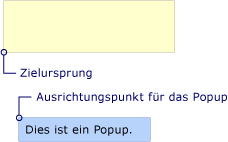  
Popup mit HorizontalOffset und VerticalOffsetPopup with HorizontalOffset and VerticalOffset  
  
   
## Zusammenwirken der EigenschaftenHow the Properties Work Together  
 Die Werte der <xref:System.Windows.Controls.Primitives.Popup.PlacementTarget%2A>, <xref:System.Windows.Controls.Primitives.Popup.PlacementRectangle%2A>, und <xref:System.Windows.Controls.Primitives.Popup.Placement%2A> müssen zusammen berücksichtigt werden, um das richtige Zielbereich Zielursprung und Popup-Ausrichtungspunkt an zu ermitteln.The values of <xref:System.Windows.Controls.Primitives.Popup.PlacementTarget%2A>, <xref:System.Windows.Controls.Primitives.Popup.PlacementRectangle%2A>, and <xref:System.Windows.Controls.Primitives.Popup.Placement%2A> need to be considered together to figure out the correct target area, target origin, and popup alignment point.  Z. B. wenn der Wert der <xref:System.Windows.Controls.Primitives.Popup.Placement%2A> ist <xref:System.Windows.Controls.Primitives.PlacementMode.Mouse>, es wurde kein Zielobjekt der <xref:System.Windows.Controls.Primitives.Popup.PlacementRectangle%2A> ignoriert, und der Zielbereich ist die Grenzen des Mauszeigers.For example, if the value of <xref:System.Windows.Controls.Primitives.Popup.Placement%2A> is <xref:System.Windows.Controls.Primitives.PlacementMode.Mouse>, there is no target object, the <xref:System.Windows.Controls.Primitives.Popup.PlacementRectangle%2A> is ignored, and the target area is the bounds of the mouse pointer. Andererseits, wenn <xref:System.Windows.Controls.Primitives.Popup.Placement%2A> ist <xref:System.Windows.Controls.Primitives.PlacementMode.Bottom>, <xref:System.Windows.Controls.Primitives.Popup.PlacementTarget%2A> oder übergeordneten bestimmt das Zielobjekt und <xref:System.Windows.Controls.Primitives.Popup.PlacementRectangle%2A> legt den Zielbereich.On the other hand, if <xref:System.Windows.Controls.Primitives.Popup.Placement%2A> is <xref:System.Windows.Controls.Primitives.PlacementMode.Bottom>, the <xref:System.Windows.Controls.Primitives.Popup.PlacementTarget%2A> or parent determines the target object and <xref:System.Windows.Controls.Primitives.Popup.PlacementRectangle%2A> determines the target area.  
  
 Die folgende Tabelle beschreibt das Zielobjekt, Zielbereich Zielursprung und Popup-Ausrichtungspunkt an und gibt an, ob <xref:System.Windows.Controls.Primitives.Popup.PlacementTarget%2A> und <xref:System.Windows.Controls.Primitives.Popup.PlacementRectangle%2A> werden verwendet, für die einzelnen <xref:System.Windows.Controls.Primitives.PlacementMode> -Enumerationswert.The following table describes the target object, target area, target origin, and popup alignment point and indicates whether <xref:System.Windows.Controls.Primitives.Popup.PlacementTarget%2A> and <xref:System.Windows.Controls.Primitives.Popup.PlacementRectangle%2A> are used for each <xref:System.Windows.Controls.Primitives.PlacementMode> enumeration value.  
  
|PlacementModePlacementMode|Das ZielobjektTarget object|Der ZielbereichTarget area|Der ZielursprungTarget origin|Der PopupausrichtungspunktPopup alignment point|  
|-------------------|-------------------|-----------------|-------------------|---------------------------|  
|<xref:System.Windows.Controls.Primitives.PlacementMode.Absolute>|Nicht zutreffend.Not applicable. <xref:System.Windows.Controls.Primitives.Popup.PlacementTarget%2A> wird ignoriert.<xref:System.Windows.Controls.Primitives.Popup.PlacementTarget%2A> is ignored.|Der Bildschirm oder <xref:System.Windows.Controls.Primitives.Popup.PlacementRectangle%2A> ist die Eigenschaft festgelegt.The screen, or <xref:System.Windows.Controls.Primitives.Popup.PlacementRectangle%2A> if it is set.  Die <xref:System.Windows.Controls.Primitives.Popup.PlacementRectangle%2A> ist relativ zu dem Bildschirm.The <xref:System.Windows.Controls.Primitives.Popup.PlacementRectangle%2A> is relative to the screen.|Die linke obere Ecke des ZielbereichsThe top-left corner of the target area.|Die linke obere Ecke des der <xref:System.Windows.Controls.Primitives.Popup>.The top-left corner of the <xref:System.Windows.Controls.Primitives.Popup>.|  
|<xref:System.Windows.Controls.Primitives.PlacementMode.AbsolutePoint>|Nicht zutreffend.Not applicable. <xref:System.Windows.Controls.Primitives.Popup.PlacementTarget%2A> wird ignoriert.<xref:System.Windows.Controls.Primitives.Popup.PlacementTarget%2A> is ignored.|Der Bildschirm oder <xref:System.Windows.Controls.Primitives.Popup.PlacementRectangle%2A> ist die Eigenschaft festgelegt.The screen, or <xref:System.Windows.Controls.Primitives.Popup.PlacementRectangle%2A> if it is set.  Die <xref:System.Windows.Controls.Primitives.Popup.PlacementRectangle%2A> ist relativ zu dem Bildschirm.The <xref:System.Windows.Controls.Primitives.Popup.PlacementRectangle%2A> is relative to the screen.|Die linke obere Ecke des ZielbereichsThe top-left corner of the target area.|Die linke obere Ecke des der <xref:System.Windows.Controls.Primitives.Popup>.The top-left corner of the <xref:System.Windows.Controls.Primitives.Popup>.|  
|<xref:System.Windows.Controls.Primitives.PlacementMode.Bottom>|<xref:System.Windows.Controls.Primitives.Popup.PlacementTarget%2A> oder übergeordnetes Element.<xref:System.Windows.Controls.Primitives.Popup.PlacementTarget%2A> or parent.|Das Zielobjekt oder <xref:System.Windows.Controls.Primitives.Popup.PlacementRectangle%2A> ist die Eigenschaft festgelegt.The target object, or <xref:System.Windows.Controls.Primitives.Popup.PlacementRectangle%2A> if it is set.  Die <xref:System.Windows.Controls.Primitives.Popup.PlacementRectangle%2A> ist relativ zum Zielobjekt.The <xref:System.Windows.Controls.Primitives.Popup.PlacementRectangle%2A> is relative to the target object.|Die linke untere Ecke des ZielbereichsThe bottom-left corner of the target area.|Die linke obere Ecke des der <xref:System.Windows.Controls.Primitives.Popup>.The top-left corner of the <xref:System.Windows.Controls.Primitives.Popup>.|  
|<xref:System.Windows.Controls.Primitives.PlacementMode.Center>|<xref:System.Windows.Controls.Primitives.Popup.PlacementTarget%2A> oder übergeordnetes Element.<xref:System.Windows.Controls.Primitives.Popup.PlacementTarget%2A> or parent.|Das Zielobjekt oder <xref:System.Windows.Controls.Primitives.Popup.PlacementRectangle%2A> ist die Eigenschaft festgelegt.The target object, or <xref:System.Windows.Controls.Primitives.Popup.PlacementRectangle%2A> if it is set.  Die <xref:System.Windows.Controls.Primitives.Popup.PlacementRectangle%2A> ist relativ zum Zielobjekt.The <xref:System.Windows.Controls.Primitives.Popup.PlacementRectangle%2A> is relative to the target object.|Die Mitte des ZielbereichsThe center of the target area.|Das Zentrum des der <xref:System.Windows.Controls.Primitives.Popup>.The center of the <xref:System.Windows.Controls.Primitives.Popup>.|  
|<xref:System.Windows.Controls.Primitives.PlacementMode.Custom>|<xref:System.Windows.Controls.Primitives.Popup.PlacementTarget%2A> oder übergeordnetes Element.<xref:System.Windows.Controls.Primitives.Popup.PlacementTarget%2A> or parent.|Das Zielobjekt oder <xref:System.Windows.Controls.Primitives.Popup.PlacementRectangle%2A> ist die Eigenschaft festgelegt.The target object, or <xref:System.Windows.Controls.Primitives.Popup.PlacementRectangle%2A> if it is set.  Die <xref:System.Windows.Controls.Primitives.Popup.PlacementRectangle%2A> ist relativ zum Zielobjekt.The <xref:System.Windows.Controls.Primitives.Popup.PlacementRectangle%2A> is relative to the target object.|Definiert durch den <xref:System.Windows.Controls.Primitives.CustomPopupPlacementCallback>.Defined by the <xref:System.Windows.Controls.Primitives.CustomPopupPlacementCallback>.|Definiert durch den <xref:System.Windows.Controls.Primitives.CustomPopupPlacementCallback>.Defined by the <xref:System.Windows.Controls.Primitives.CustomPopupPlacementCallback>.|  
|<xref:System.Windows.Controls.Primitives.PlacementMode.Left>|<xref:System.Windows.Controls.Primitives.Popup.PlacementTarget%2A> oder übergeordnetes Element.<xref:System.Windows.Controls.Primitives.Popup.PlacementTarget%2A> or parent.|Das Zielobjekt oder <xref:System.Windows.Controls.Primitives.Popup.PlacementRectangle%2A> ist die Eigenschaft festgelegt.The target object, or <xref:System.Windows.Controls.Primitives.Popup.PlacementRectangle%2A> if it is set.  Die <xref:System.Windows.Controls.Primitives.Popup.PlacementRectangle%2A> ist relativ zum Zielobjekt.The <xref:System.Windows.Controls.Primitives.Popup.PlacementRectangle%2A> is relative to the target object.|Die linke obere Ecke des ZielbereichsThe top-left corner of the target area.|Der oberen rechten Ecke des der <xref:System.Windows.Controls.Primitives.Popup>.The top-right corner of the <xref:System.Windows.Controls.Primitives.Popup>.|  
|<xref:System.Windows.Controls.Primitives.PlacementMode.Mouse>|Nicht zutreffend.Not applicable. <xref:System.Windows.Controls.Primitives.Popup.PlacementTarget%2A> wird ignoriert.<xref:System.Windows.Controls.Primitives.Popup.PlacementTarget%2A> is ignored.|Die Grenzen des MauszeigersThe bounds of the mouse pointer. <xref:System.Windows.Controls.Primitives.Popup.PlacementRectangle%2A> wird ignoriert.<xref:System.Windows.Controls.Primitives.Popup.PlacementRectangle%2A> is ignored.|Die linke untere Ecke des ZielbereichsThe bottom-left corner of the target area.|Die linke obere Ecke des der <xref:System.Windows.Controls.Primitives.Popup>.The top-left corner of the <xref:System.Windows.Controls.Primitives.Popup>.|  
|<xref:System.Windows.Controls.Primitives.PlacementMode.MousePoint>|Nicht zutreffend.Not applicable. <xref:System.Windows.Controls.Primitives.Popup.PlacementTarget%2A> wird ignoriert.<xref:System.Windows.Controls.Primitives.Popup.PlacementTarget%2A> is ignored.|Die Grenzen des MauszeigersThe bounds of the mouse pointer. <xref:System.Windows.Controls.Primitives.Popup.PlacementRectangle%2A> wird ignoriert.<xref:System.Windows.Controls.Primitives.Popup.PlacementRectangle%2A> is ignored.|Die linke obere Ecke des ZielbereichsThe top-left corner of the target area.|Die linke obere Ecke des der <xref:System.Windows.Controls.Primitives.Popup>.The top-left corner of the <xref:System.Windows.Controls.Primitives.Popup>.|  
|<xref:System.Windows.Controls.Primitives.PlacementMode.Relative>|<xref:System.Windows.Controls.Primitives.Popup.PlacementTarget%2A> oder übergeordnetes Element.<xref:System.Windows.Controls.Primitives.Popup.PlacementTarget%2A> or parent.|Das Zielobjekt oder <xref:System.Windows.Controls.Primitives.Popup.PlacementRectangle%2A> ist die Eigenschaft festgelegt.The target object, or <xref:System.Windows.Controls.Primitives.Popup.PlacementRectangle%2A> if it is set.  Die <xref:System.Windows.Controls.Primitives.Popup.PlacementRectangle%2A> ist relativ zum Zielobjekt.The <xref:System.Windows.Controls.Primitives.Popup.PlacementRectangle%2A> is relative to the target object.|Die linke obere Ecke des ZielbereichsThe top-left corner of the target area.|Die linke obere Ecke des der <xref:System.Windows.Controls.Primitives.Popup>.The top-left corner of the <xref:System.Windows.Controls.Primitives.Popup>.|  
|<xref:System.Windows.Controls.Primitives.PlacementMode.RelativePoint>|<xref:System.Windows.Controls.Primitives.Popup.PlacementTarget%2A> oder übergeordnetes Element.<xref:System.Windows.Controls.Primitives.Popup.PlacementTarget%2A> or parent.|Das Zielobjekt oder <xref:System.Windows.Controls.Primitives.Popup.PlacementRectangle%2A> ist die Eigenschaft festgelegt.The target object, or <xref:System.Windows.Controls.Primitives.Popup.PlacementRectangle%2A> if it is set.  Die <xref:System.Windows.Controls.Primitives.Popup.PlacementRectangle%2A> ist relativ zum Zielobjekt.The <xref:System.Windows.Controls.Primitives.Popup.PlacementRectangle%2A> is relative to the target object.|Die linke obere Ecke des ZielbereichsThe top-left corner of the target area.|Die linke obere Ecke des der <xref:System.Windows.Controls.Primitives.Popup>.The top-left corner of the <xref:System.Windows.Controls.Primitives.Popup>.|  
|<xref:System.Windows.Controls.Primitives.PlacementMode.Right>|<xref:System.Windows.Controls.Primitives.Popup.PlacementTarget%2A> oder übergeordnetes Element.<xref:System.Windows.Controls.Primitives.Popup.PlacementTarget%2A> or parent.|Das Zielobjekt oder <xref:System.Windows.Controls.Primitives.Popup.PlacementRectangle%2A> ist die Eigenschaft festgelegt.The target object, or <xref:System.Windows.Controls.Primitives.Popup.PlacementRectangle%2A> if it is set.  Die <xref:System.Windows.Controls.Primitives.Popup.PlacementRectangle%2A> ist relativ zum Zielobjekt.The <xref:System.Windows.Controls.Primitives.Popup.PlacementRectangle%2A> is relative to the target object.|Die rechte obere Ecke des ZielbereichsThe top-right corner of the target area.|Die linke obere Ecke des der <xref:System.Windows.Controls.Primitives.Popup>.The top-left corner of the <xref:System.Windows.Controls.Primitives.Popup>.|  
|<xref:System.Windows.Controls.Primitives.PlacementMode.Top>|<xref:System.Windows.Controls.Primitives.Popup.PlacementTarget%2A> oder übergeordnetes Element.<xref:System.Windows.Controls.Primitives.Popup.PlacementTarget%2A> or parent.|Das Zielobjekt oder <xref:System.Windows.Controls.Primitives.Popup.PlacementRectangle%2A> ist die Eigenschaft festgelegt.The target object, or <xref:System.Windows.Controls.Primitives.Popup.PlacementRectangle%2A> if it is set.  Die <xref:System.Windows.Controls.Primitives.Popup.PlacementRectangle%2A> ist relativ zum Zielobjekt.The <xref:System.Windows.Controls.Primitives.Popup.PlacementRectangle%2A> is relative to the target object.|Die linke obere Ecke des ZielbereichsThe top-left corner of the target area.|Der unteren linken Ecke des der <xref:System.Windows.Controls.Primitives.Popup>.The bottom-left corner of the <xref:System.Windows.Controls.Primitives.Popup>.|  
  
 Die folgenden Abbildungen zeigen die <xref:System.Windows.Controls.Primitives.Popup>, Zielbereich Zielursprung und Ausrichtungspunkt zeigen für jede <xref:System.Windows.Controls.Primitives.PlacementMode> Wert.The following illustrations show the <xref:System.Windows.Controls.Primitives.Popup>, target area, target origin, and popup alignment point for each <xref:System.Windows.Controls.Primitives.PlacementMode> value. In jeder Abbildung ist der Zielbereich Gelb, und die <xref:System.Windows.Controls.Primitives.Popup> ist Blau.In each figure, the target area is yellow, and the <xref:System.Windows.Controls.Primitives.Popup> is blue.  
  
 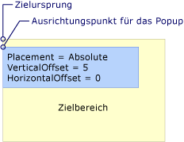  
Die Platzierung ist „Absolute“ oder „AbsolutePoint“Placement is Absolute or AbsolutePoint  
  
 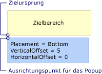  
Die Platzierung ist „Bottom“Placement is Bottom  
  
 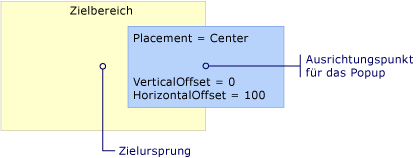  
Die Platzierung ist „Center“Placement is Center  
  
 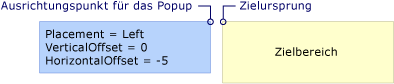  
Die Platzierung ist „Left“Placement is Left  
  
 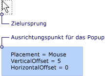  
Die Platzierung ist „Mouse“Placement is Mouse  
  
 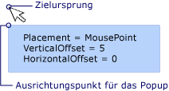  
Die Platzierung ist „MousePoint“Placement is MousePoint  
  
 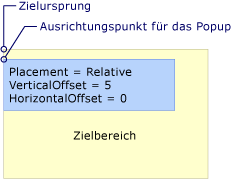  
Die Platzierung ist „Relative“ oder „RelativePoint“Placement is Relative or RelativePoint  
  
   
Die Platzierung ist „Right“Placement is Right  
  
 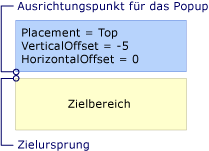  
Die Platzierung ist „Top“Placement is Top  
  
   
## Wenn das Popup auf einen Bildschirmrand trifftWhen the Popup Encounters the Edge of the Screen  
 Aus Gründen der Sicherheit einer <xref:System.Windows.Controls.Primitives.Popup> kann nicht ausgeblendet werden, indem am Rand eines Bildschirms.For security reasons, a <xref:System.Windows.Controls.Primitives.Popup> cannot be hidden by the edge of a screen. Einer der drei folgenden Punkte geschieht bei der <xref:System.Windows.Controls.Primitives.Popup> trifft eine Bildschirmkante:One of the following three things happens when the <xref:System.Windows.Controls.Primitives.Popup> encounters a screen edge:  
  
-   Das Popup richtet sich selbst am Bildschirm Rand, die verdecken würde die <xref:System.Windows.Controls.Primitives.Popup>.The popup realigns itself along the screen edge that would obscure the <xref:System.Windows.Controls.Primitives.Popup>.  
  
-   Das Popup verwendet einen anderen Popupausrichtungspunkt.The popup uses a different popup alignment point.  
  
-   Das Popup verwendet einen anderen Zielursprungs und Popupausrichtungspunkt.The popup uses a different target origin and popup alignment point.  
  
 Diese Optionen werden weiter unten in diesem Abschnitt beschrieben.These options are described further later in this section.  
  
 Das Verhalten von der <xref:System.Windows.Controls.Primitives.Popup> Wenn festgestellt wird eine Bildschirmkante hängt vom Wert von der <xref:System.Windows.Controls.Primitives.Popup.Placement%2A> -Eigenschaft und die Bildschirmrand das Popup stößt.The behavior of the <xref:System.Windows.Controls.Primitives.Popup> when it encounters a screen edge depends on the value of the <xref:System.Windows.Controls.Primitives.Popup.Placement%2A> property and which screen edge the popup encounters. In der folgenden Tabelle wird das Verhalten zusammengefasst. wenn die <xref:System.Windows.Controls.Primitives.Popup> trifft eine Bildschirmkante für jede <xref:System.Windows.Controls.Primitives.PlacementMode> Wert.The following table summarizes the behavior when the <xref:System.Windows.Controls.Primitives.Popup> encounters a screen edge for each <xref:System.Windows.Controls.Primitives.PlacementMode> value.  
  
|PlacementModePlacementMode|Oberer RandTop edge|Unterer RandBottom edge|Linker RandLeft edge|Rechter RandRight edge|  
|-------------------|--------------|-----------------|---------------|----------------|  
|<xref:System.Windows.Controls.Primitives.PlacementMode.Absolute>|Richtet sich am oberen Rand ausAligns to the top edge.|Richtet sich am unteren Rand ausAligns to the bottom edge.|Richtet sich am linken Rand ausAligns to the left edge.|Richtet sich am rechten Rand ausAligns to the right edge.|  
|<xref:System.Windows.Controls.Primitives.PlacementMode.AbsolutePoint>|Richtet sich am oberen Rand ausAligns to the top edge.|Das Popup-Ausrichtungspunkt an ändert sich in der unteren linken Ecke des der <xref:System.Windows.Controls.Primitives.Popup>.The popup alignment point changes to the bottom-left corner of the <xref:System.Windows.Controls.Primitives.Popup>.|Richtet sich am linken Rand ausAligns to the left edge.|Das Popup-Ausrichtungspunkt an ändert sich in der oberen rechten Ecke des der <xref:System.Windows.Controls.Primitives.Popup>.The popup alignment point changes to the top-right corner of the <xref:System.Windows.Controls.Primitives.Popup>.|  
|<xref:System.Windows.Controls.Primitives.PlacementMode.Bottom>|Richtet sich am oberen Rand ausAligns to the top edge.|Der Zielursprung ändert sich in der oberen linken Ecke des Zielbereichs und das Popup-Ausrichtungspunkt an ändert sich in der unteren linken Ecke des der <xref:System.Windows.Controls.Primitives.Popup>.The target origin changes to the top-left corner of the target area and the popup alignment point changes to the bottom-left corner of the <xref:System.Windows.Controls.Primitives.Popup>.|Richtet sich am linken Rand ausAligns to the left edge.|Richtet sich am rechten Rand ausAligns to the right edge.|  
|<xref:System.Windows.Controls.Primitives.PlacementMode.Center>|Richtet sich am oberen Rand ausAligns to the top edge.|Richtet sich am unteren Rand ausAligns to the bottom edge.|Richtet sich am linken Rand ausAligns to the left edge.|Richtet sich am rechten Rand ausAligns to the right edge.|  
|<xref:System.Windows.Controls.Primitives.PlacementMode.Left>|Richtet sich am oberen Rand ausAligns to the top edge.|Richtet sich am unteren Rand ausAligns to the bottom edge.|Der Zielursprung ändert sich in der oberen rechten Ecke des Zielbereichs und das Popup-Ausrichtungspunkt an ändert sich in der oberen linken Ecke des der <xref:System.Windows.Controls.Primitives.Popup>.The target origin changes to the top-right corner of the target area and the popup alignment point changes to the top-left corner of the <xref:System.Windows.Controls.Primitives.Popup>.|Richtet sich am rechten Rand ausAligns to the right edge.|  
|<xref:System.Windows.Controls.Primitives.PlacementMode.Mouse>|Richtet sich am oberen Rand ausAligns to the top edge.|Der Zielursprung ändert sich in der oberen linken Ecke des Zielbereichs (die Grenzen des Mauszeigers) und das Popup-Ausrichtungspunkt an ändert sich in der unteren linken Ecke des der <xref:System.Windows.Controls.Primitives.Popup>.The target origin changes to the top-left corner of the target area (the bounds of the mouse pointer) and the popup alignment point changes to the bottom-left corner of the <xref:System.Windows.Controls.Primitives.Popup>.|Richtet sich am linken Rand ausAligns to the left edge.|Richtet sich am rechten Rand ausAligns to the right edge.|  
|<xref:System.Windows.Controls.Primitives.PlacementMode.MousePoint>|Richtet sich am oberen Rand ausAligns to the top edge.|Das Popup-Ausrichtungspunkt an ändert sich in der unteren linken Ecke des der <xref:System.Windows.Controls.Primitives.Popup>.The popup alignment point changes to the bottom-left corner of the <xref:System.Windows.Controls.Primitives.Popup>.|Richtet sich am linken Rand ausAligns to the left edge.|Der Ausrichtungspunkt wird auf die obere rechte Ecke des Popups geändert.The popup alignment point changes to the top-right corner of the popup.|  
|<xref:System.Windows.Controls.Primitives.PlacementMode.Relative>|Richtet sich am oberen Rand ausAligns to the top edge.|Richtet sich am unteren Rand ausAligns to the bottom edge.|Richtet sich am linken Rand ausAligns to the left edge.|Richtet sich am rechten Rand ausAligns to the right edge.|  
|<xref:System.Windows.Controls.Primitives.PlacementMode.RelativePoint>|Richtet sich am oberen Rand ausAligns to the top edge.|Das Popup-Ausrichtungspunkt an ändert sich in der unteren linken Ecke des der <xref:System.Windows.Controls.Primitives.Popup>.The popup alignment point changes to the bottom-left corner of the <xref:System.Windows.Controls.Primitives.Popup>.|Richtet sich am linken Rand ausAligns to the left edge.|Der Ausrichtungspunkt wird auf die obere rechte Ecke des Popups geändert.The popup alignment point changes to the top-right corner of the popup.|  
|<xref:System.Windows.Controls.Primitives.PlacementMode.Right>|Richtet sich am oberen Rand ausAligns to the top edge.|Richtet sich am unteren Rand ausAligns to the bottom edge.|Richtet sich am linken Rand ausAligns to the left edge.|Der Zielursprung ändert sich in der oberen linken Ecke des Zielbereichs und das Popup-Ausrichtungspunkt an ändert sich in der oberen rechten Ecke des der <xref:System.Windows.Controls.Primitives.Popup>.The target origin changes to the top-left corner of the target area and the popup alignment point changes to the top-right corner of the <xref:System.Windows.Controls.Primitives.Popup>.|  
|<xref:System.Windows.Controls.Primitives.PlacementMode.Top>|Der Zielursprung ändert sich in der unteren linken Ecke des Zielbereichs und das Popup-Ausrichtungspunkt an ändert sich in der oberen linken Ecke des der <xref:System.Windows.Controls.Primitives.Popup>.The target origin changes to the bottom-left corner of the target area and the popup alignment point changes to the top-left corner of the <xref:System.Windows.Controls.Primitives.Popup>. Aktiviert ist, dies ist genauso wie beim <xref:System.Windows.Controls.Primitives.Popup.Placement%2A> ist <xref:System.Windows.Controls.Primitives.PlacementMode.Bottom>.In effect, this is the same as when <xref:System.Windows.Controls.Primitives.Popup.Placement%2A> is <xref:System.Windows.Controls.Primitives.PlacementMode.Bottom>.|Richtet sich am unteren Rand ausAligns to the bottom edge.|Richtet sich am linken Rand ausAligns to the left edge.|Richtet sich am rechten Rand ausAligns to the right edge.|  
  
### Ausrichten am BildschirmrandAligning to the Screen Edge  
 Ein <xref:System.Windows.Controls.Primitives.Popup> können ausrichten, die an den Rand des Bildschirms durch Neupositionieren selbst daher die gesamte <xref:System.Windows.Controls.Primitives.Popup> auf dem Bildschirm sichtbar ist.A <xref:System.Windows.Controls.Primitives.Popup> can align to the edge of the screen by repositioning itself so the entire <xref:System.Windows.Controls.Primitives.Popup> is visible on the screen.  In diesem Fall der Abstand zwischen dem Ursprung und Popup unterscheidet sich möglicherweise von den Werten der <xref:System.Windows.Controls.Primitives.Popup.HorizontalOffset%2A> und <xref:System.Windows.Controls.Primitives.Popup.VerticalOffset%2A>.When this occurs, the distance between the target origin and popup alignment point might differ from the values of <xref:System.Windows.Controls.Primitives.Popup.HorizontalOffset%2A> and <xref:System.Windows.Controls.Primitives.Popup.VerticalOffset%2A>. Wenn <xref:System.Windows.Controls.Primitives.Popup.Placement%2A> ist <xref:System.Windows.Controls.Primitives.PlacementMode.Absolute>, <xref:System.Windows.Controls.Primitives.PlacementMode.Center>, oder <xref:System.Windows.Controls.Primitives.PlacementMode.Relative>die <xref:System.Windows.Controls.Primitives.Popup> richtet sich selbst an jeder Bildschirmkante aus.When <xref:System.Windows.Controls.Primitives.Popup.Placement%2A> is <xref:System.Windows.Controls.Primitives.PlacementMode.Absolute>, <xref:System.Windows.Controls.Primitives.PlacementMode.Center>, or <xref:System.Windows.Controls.Primitives.PlacementMode.Relative>, the <xref:System.Windows.Controls.Primitives.Popup> aligns itself to every screen edge.  Nehmen wir beispielsweise an, die eine <xref:System.Windows.Controls.Primitives.Popup> hat <xref:System.Windows.Controls.Primitives.Popup.Placement%2A> festgelegt <xref:System.Windows.Controls.Primitives.PlacementMode.Relative> und <xref:System.Windows.Controls.Primitives.Popup.VerticalOffset%2A> auf 100 festgelegt.For example, assume that a <xref:System.Windows.Controls.Primitives.Popup> has <xref:System.Windows.Controls.Primitives.Popup.Placement%2A> set to <xref:System.Windows.Controls.Primitives.PlacementMode.Relative> and <xref:System.Windows.Controls.Primitives.Popup.VerticalOffset%2A> set to 100.  Wenn der unteren Rand des Bildschirms ganz oder teilweise verdeckt die <xref:System.Windows.Controls.Primitives.Popup>die <xref:System.Windows.Controls.Primitives.Popup> positioniert selbst am unteren Rand des Bildschirms und dem vertikalen Abstand zwischen dem Zielursprung und Popup-Ausrichtungspunkt an ist kleiner als 100.If the bottom edge of the screen hides all or part of the <xref:System.Windows.Controls.Primitives.Popup>, the <xref:System.Windows.Controls.Primitives.Popup> repositions itself along the bottom edge of the screen and the vertical distance between the target origin and popup alignment point is less than 100. Dies wird in der folgenden Abbildung veranschaulicht.The following illustration demonstrates this.  
  
 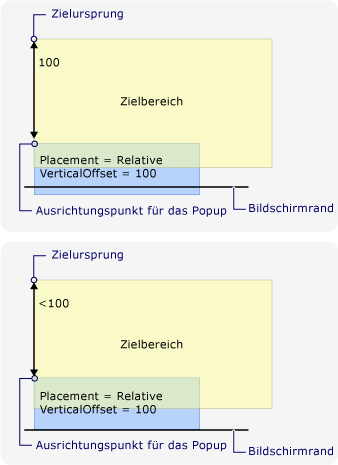  
Popup richtet sich am Bildschirmrand ausPopup aligns to the edge of the screen  
  
### Ändern des PopupausrichtungspunktsChanging the Popup Alignment Point  
 Wenn <xref:System.Windows.Controls.Primitives.Popup.Placement%2A> ist <xref:System.Windows.Controls.Primitives.PlacementMode.AbsolutePoint>, <xref:System.Windows.Controls.Primitives.PlacementMode.RelativePoint>, oder <xref:System.Windows.Controls.Primitives.PlacementMode.MousePoint>, Popup-Ausrichtungspunkt an ändert, wenn das Popup unten oder rechter Bildschirmkante stößt.If <xref:System.Windows.Controls.Primitives.Popup.Placement%2A> is <xref:System.Windows.Controls.Primitives.PlacementMode.AbsolutePoint>, <xref:System.Windows.Controls.Primitives.PlacementMode.RelativePoint>, or <xref:System.Windows.Controls.Primitives.PlacementMode.MousePoint>, the popup alignment point changes when the popup encounters the bottom or right screen edge.  
  
 Die folgende Abbildung zeigt, dass bei der unteren Bildschirmrand ganz oder teilweise Blendet die <xref:System.Windows.Controls.Primitives.Popup>, Popup-Ausrichtungspunkt an ist die linke untere Ecke des der <xref:System.Windows.Controls.Primitives.Popup>.The following illustration demonstrates that when the bottom screen edge hides all or part of the <xref:System.Windows.Controls.Primitives.Popup>, the popup alignment point is the bottom-left corner of the <xref:System.Windows.Controls.Primitives.Popup>.  
  
 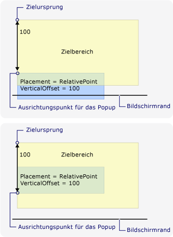  
Das Popup trifft auf den unteren Bildschirmrand und ändert den Popupausrichtungspunkt.Popup encounters bottom edge of the screen and changes the popup alignment point  
  
 Die folgende Abbildung zeigt, dass wenn die <xref:System.Windows.Controls.Primitives.Popup> wird ausgeblendet, vom rechten Bildschirmrand Popup-Ausrichtungspunkt an der oberen rechten Ecke des ist die <xref:System.Windows.Controls.Primitives.Popup>.The following illustration demonstrates that when the <xref:System.Windows.Controls.Primitives.Popup> is hidden by the right screen edge, the popup alignment point is the top-right corner of the <xref:System.Windows.Controls.Primitives.Popup>.  
  
 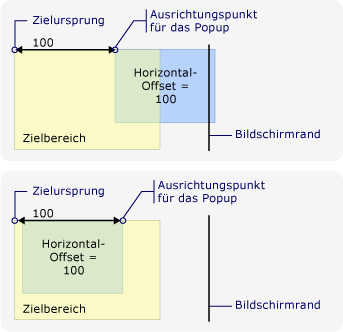  
Das Popup stößt auf den rechten Bildschirmrand und ändert den Popupausrichtungspunkt.Popup encounters right edge of the screen and changes the popup alignment point  
  
 Wenn die <xref:System.Windows.Controls.Primitives.Popup> trifft die unteren und rechten Bildschirmrand Kanten, Popup-Ausrichtungspunkt an ist die unten rechts auf der die <xref:System.Windows.Controls.Primitives.Popup>.If the <xref:System.Windows.Controls.Primitives.Popup> encounters the bottom and right screen edges, the popup alignment point is the bottom-right corner of the <xref:System.Windows.Controls.Primitives.Popup>.  
  
### Ändern des Zielursprungs und des PopupausrichtungspunktsChanging the Target Origin and Popup Alignment Point  
 Wenn <xref:System.Windows.Controls.Primitives.Popup.Placement%2A> ist <xref:System.Windows.Controls.Primitives.PlacementMode.Bottom>, <xref:System.Windows.Controls.Primitives.PlacementMode.Left>, <xref:System.Windows.Controls.Primitives.PlacementMode.Mouse>, <xref:System.Windows.Controls.Primitives.PlacementMode.Right>, oder <xref:System.Windows.Controls.Primitives.PlacementMode.Top>, die Ziel-Ursprungs- und der Popup-Ausrichtung zeigen ändern, wenn eine bestimmte Bildschirmkante kommt.When <xref:System.Windows.Controls.Primitives.Popup.Placement%2A> is <xref:System.Windows.Controls.Primitives.PlacementMode.Bottom>, <xref:System.Windows.Controls.Primitives.PlacementMode.Left>, <xref:System.Windows.Controls.Primitives.PlacementMode.Mouse>, <xref:System.Windows.Controls.Primitives.PlacementMode.Right>, or <xref:System.Windows.Controls.Primitives.PlacementMode.Top>, the target origin and popup alignment point change if a certain screen edge is encountered.  Hängt von der Bildschirmkante aus, die bewirkt, die Position dass so ändern Sie die <xref:System.Windows.Controls.Primitives.PlacementMode> Wert.The screen edge that causes the position to change depends on the <xref:System.Windows.Controls.Primitives.PlacementMode> value.  
  
 Die folgende Abbildung zeigt, dass wenn <xref:System.Windows.Controls.Primitives.Popup.Placement%2A> ist <xref:System.Windows.Controls.Primitives.PlacementMode.Bottom> und die <xref:System.Windows.Controls.Primitives.Popup> erkennt den unteren Bildschirmrand Zielursprung der oberen linken Ecke des Zielbereichs und das Popup-Ausrichtungspunkt an der unteren linken Ecke des der <xref:System.Windows.Controls.Primitives.Popup>.The following illustration demonstrates that when <xref:System.Windows.Controls.Primitives.Popup.Placement%2A> is <xref:System.Windows.Controls.Primitives.PlacementMode.Bottom> and the <xref:System.Windows.Controls.Primitives.Popup> encounters the bottom screen edge, the target origin is the top-left corner of the target area and the popup alignment point is the bottom-left corner of the <xref:System.Windows.Controls.Primitives.Popup>.  
  
 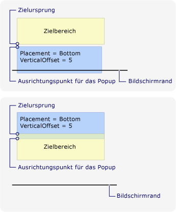  
Die Platzierung ist „Bottom“, und das Popup stößt auf den unteren Rand des BildschirmsPlacement is Bottom and the popup encounters the bottom edge of the screen  
  
 Die folgende Abbildung zeigt, dass wenn <xref:System.Windows.Controls.Primitives.Popup.Placement%2A> ist <xref:System.Windows.Controls.Primitives.PlacementMode.Left> und <xref:System.Windows.Controls.Primitives.Popup> findet der Linker Bildschirmkante Zielursprung ist der oberen rechten Ecke des Zielbereichs und das Popup-Ausrichtungspunkt an der linken oberen Ecke des der <xref:System.Windows.Controls.Primitives.Popup>.The following illustration demonstrates that when <xref:System.Windows.Controls.Primitives.Popup.Placement%2A> is <xref:System.Windows.Controls.Primitives.PlacementMode.Left> and the <xref:System.Windows.Controls.Primitives.Popup> encounters the left screen edge, the target origin is the top-right corner of the target area and the popup alignment point is the top-left corner of the <xref:System.Windows.Controls.Primitives.Popup>.  
  
 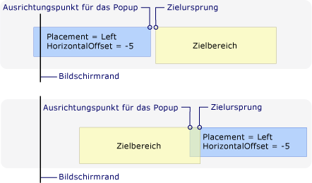  
Die Platzierung ist „Left“, und das Popup stößt auf den linken Bildschirmrand.Placement is Left and the popup encounters the left edge of the screen  
  
 Die folgende Abbildung zeigt, dass wenn <xref:System.Windows.Controls.Primitives.Popup.Placement%2A> ist <xref:System.Windows.Controls.Primitives.PlacementMode.Right> und die <xref:System.Windows.Controls.Primitives.Popup> trifft die rechter Bildschirmkante Zielursprung der oberen linken Ecke des Zielbereichs und das Popup-Ausrichtungspunkt an der oberen rechten Ecke des der <xref:System.Windows.Controls.Primitives.Popup>.The following illustration demonstrates that when <xref:System.Windows.Controls.Primitives.Popup.Placement%2A> is <xref:System.Windows.Controls.Primitives.PlacementMode.Right> and the <xref:System.Windows.Controls.Primitives.Popup> encounters the right screen edge, the target origin is the top-left corner of the target area and the popup alignment point is the top-right corner of the <xref:System.Windows.Controls.Primitives.Popup>.  
  
 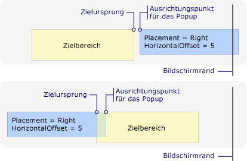  
Die Platzierung ist „Right“, und das Popup stößt auf den rechten BildschirmrandPlacement is Right and the popup encounters the right edge of the screen  
  
 Die folgende Abbildung zeigt, dass wenn <xref:System.Windows.Controls.Primitives.Popup.Placement%2A> ist <xref:System.Windows.Controls.Primitives.PlacementMode.Top> und die <xref:System.Windows.Controls.Primitives.Popup> am oberen Bildschirmrand trifft Zielursprung der unteren linken Ecke des Zielbereichs und das Popup-Ausrichtungspunkt an der linken oberen Ecke des der <xref:System.Windows.Controls.Primitives.Popup>.The following illustration demonstrates that when <xref:System.Windows.Controls.Primitives.Popup.Placement%2A> is <xref:System.Windows.Controls.Primitives.PlacementMode.Top> and the <xref:System.Windows.Controls.Primitives.Popup> encounters the top screen edge, the target origin is the bottom-left corner of the target area and the popup alignment point is the top-left corner of the <xref:System.Windows.Controls.Primitives.Popup>.  
  
 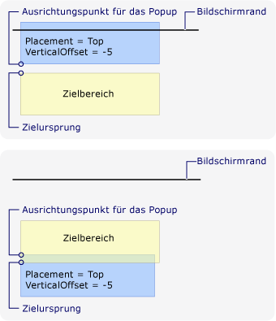  
Die Platzierung ist „Top“, und das Popup stößt auf den oberen BildschirmrandPlacement is Top and the popup encounters the top edge of the screen  
  
 Die folgende Abbildung zeigt, dass wenn <xref:System.Windows.Controls.Primitives.Popup.Placement%2A> ist <xref:System.Windows.Controls.Primitives.PlacementMode.Mouse> und <xref:System.Windows.Controls.Primitives.Popup> auf den unteren Bildschirmrand stößt der Zielursprung ist der linken oberen Ecke des Zielbereichs (die Grenzen des Mauszeigers) und dem Ausrichtungspunkt ist der unteren linken Ecke des der <xref:System.Windows.Controls.Primitives.Popup>.The following illustration demonstrates that when <xref:System.Windows.Controls.Primitives.Popup.Placement%2A> is <xref:System.Windows.Controls.Primitives.PlacementMode.Mouse> and the <xref:System.Windows.Controls.Primitives.Popup> encounters the bottom screen edge, the target origin is the top-left corner of the target area (the bounds of the mouse pointer) and the popup alignment point is the bottom-left corner of the <xref:System.Windows.Controls.Primitives.Popup>.  
  
 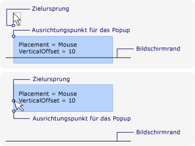  
Die Platzierung ist „Mouse“, und das Popup stößt auf den unteren Rand des Bildschirms.Placement is Mouse and the popup encounters the bottom edge of the screen  
  
### Anpassen der PopupplatzierungCustomizing Popup Placement  
 Sie können das Ziel Ursprungs- und der Popup-Ausrichtungspunkt an anpassen, indem Sie die Einstellung der <xref:System.Windows.Controls.Primitives.Popup.Placement%2A> Eigenschaft <xref:System.Windows.Controls.Primitives.PlacementMode.Custom>.You can customize the target origin and popup alignment point by setting the <xref:System.Windows.Controls.Primitives.Popup.Placement%2A> property to <xref:System.Windows.Controls.Primitives.PlacementMode.Custom>. Definieren Sie dann eine <xref:System.Windows.Controls.Primitives.CustomPopupPlacementCallback> Delegat, der für eine Reihe von möglichen Platzierung Punkte und Primärachsen (in Prioritätsreihenfolge) gibt die <xref:System.Windows.Controls.Primitives.Popup>.Then define a <xref:System.Windows.Controls.Primitives.CustomPopupPlacementCallback> delegate that returns a set of possible placement points and primary axes (in order of preference) for the <xref:System.Windows.Controls.Primitives.Popup>. Der Punkt, der den größten Teil zeigt die <xref:System.Windows.Controls.Primitives.Popup> ausgewählt ist.The point that shows the largest portion of the <xref:System.Windows.Controls.Primitives.Popup> is selected.  Die Position des der <xref:System.Windows.Controls.Primitives.Popup> wird automatisch angepasst, wenn die <xref:System.Windows.Controls.Primitives.Popup> an der Ecke des Bildschirms ausgeblendet ist.The position of the <xref:System.Windows.Controls.Primitives.Popup> is automatically adjusted if the <xref:System.Windows.Controls.Primitives.Popup> is hidden by the edge of the screen. Ein Beispiel finden Sie unter [Angeben einer benutzerdefinierten Popupposition](../../../../docs/framework/wpf/controls/how-to-specify-a-custom-popup-position.md).For an example, see [Specify a Custom Popup Position](../../../../docs/framework/wpf/controls/how-to-specify-a-custom-popup-position.md).  
  
## Siehe auchSee Also  
 [Beispiel für das Platzieren eines PopupsPopup Placement Sample](http://go.microsoft.com/fwlink/?LinkID=160032)
