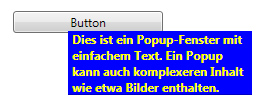

# Popup
Die <xref:System.Windows.Controls.Primitives.Popup> -Steuerelement zeigt Inhalt in einem separaten Fenster, die über das aktuelle Anwendungsfenster gleitet.  
  
 Die folgende Abbildung zeigt eine <xref:System.Windows.Controls.Primitives.Popup> -Steuerelement, das in Bezug auf positioniert ist eine <xref:System.Windows.Controls.Button> , die das übergeordnete Element.  
  
   
  
## In diesem Abschnitt  
 [Übersicht über Popups](popup-overview.md)  
 [Verhalten beim Platzieren von Popups](popup-placement-behavior.md)  
 [Themen zu Vorgehensweisen](popup-how-to-topics.md)  
  
## Referenz  
 <xref:System.Windows.Controls.Primitives.Popup>  
  
## Verwandte Abschnitte
