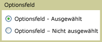

# RadioButton
<xref:System.Windows.Controls.RadioButton>\-Steuerelemente werden in der Regel gruppiert, um Benutzern die Möglichkeit zu geben, eine Auswahl aus mehreren Möglichkeiten zu treffen. Hierbei kann jeweils nur ein Optionsfeld ausgewählt werden.  
  
 Die folgende Abbildung enthält ein Beispiel für ein <xref:System.Windows.Controls.RadioButton>\-Steuerelement.  
  
   
Typischer RadioButton  
  
## Referenz  
 <xref:System.Windows.Controls.Primitives.ToggleButton>  
  
## Verwandte Abschnitte