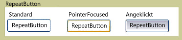

# RepeatButtonRepeatButton
Die <xref:System.Windows.Controls.Primitives.RepeatButton> ähnelt einer <xref:System.Windows.Controls.Button>.The <xref:System.Windows.Controls.Primitives.RepeatButton> is similar to a <xref:System.Windows.Controls.Button>. Allerdings <xref:System.Windows.Controls.Primitives.RepeatButton> -Elementen können Sie, wann steuern und wie sich das <xref:System.Windows.Controls.Primitives.ButtonBase.Click> Ereignis auftritt.However, <xref:System.Windows.Controls.Primitives.RepeatButton> elements give you control over when and how the <xref:System.Windows.Controls.Primitives.ButtonBase.Click> event occurs.  
  
 Die folgende Abbildung zeigt ein Beispiel für die drei Zustände einer Wiederholung Button-Steuerelement, Default-, PointerFocused und gedrückt.The following graphic shows an example of the three states of a repeat button control, Default, PointerFocused, and Pressed. Die erste Schaltfläche zeigt den Standardzustand des der <xref:System.Windows.Controls.Primitives.RepeatButton>.The first button shows the default state of the <xref:System.Windows.Controls.Primitives.RepeatButton>. Das zweite Beispiel zeigt wie die Darstellung der Schaltfläche ändert, wenn der Mauszeiger bewegt wird, über die Schaltfläche "", und geben sie Ihnen den Fokus.The second shows how the appearance of the button changes when the mouse pointer hovers over the button, giving it focus. Die dritte Schaltfläche zeigt die Darstellung der <xref:System.Windows.Controls.Primitives.RepeatButton> Wenn der Benutzer die Maustaste über dem Steuerelement drückt.The last button shows the appearance of the <xref:System.Windows.Controls.Primitives.RepeatButton> when the user presses the mouse button over the control.  
  
   
Typische RepeatButtonTypical RepeatButton  
  
## In diesem AbschnittIn This Section  
  
## VerweisReference  
 <xref:System.Windows.Controls.Primitives.RepeatButton>  
  
## Verwandte AbschnitteRelated Sections
