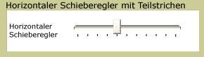

# Slider
Die <xref:System.Windows.Controls.Slider> können Sie aus einem Wertebereich auswählen, durch das Verschieben einer <xref:System.Windows.Controls.Primitives.Thumb> entlang einer <xref:System.Windows.Controls.Primitives.Track>.  
  
 Die folgende Abbildung zeigt ein Beispiel für eine horizontale <xref:System.Windows.Controls.Slider> Steuerelement.  
  
   
  
## In diesem Abschnitt  
 [Anpassen der Teilstriche auf einem Schieberegler](how-to-customize-the-ticks-on-a-slider.md)  
  
## Referenz  
 <xref:System.Windows.Controls.Slider>  
  <xref:System.Windows.Controls.Primitives.Track>  
  <xref:System.Windows.Controls.Primitives.Thumb>
