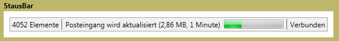

# StatusBar
Ein <xref:System.Windows.Controls.Primitives.StatusBar> ist ein horizontaler Bereich am unteren Rand eines Fensters, in dem eine Anwendung Statusinformationen anzeigen kann.  
  
 Die folgende Abbildung zeigt ein Beispiel für eine <xref:System.Windows.Controls.Primitives.StatusBar>.  
  
   
  
## In diesem Abschnitt  
  
## Verweis  
 <xref:System.Windows.Controls.Primitives.StatusBar>  
  <xref:System.Windows.Controls.Primitives.StatusBarItem>  
  
## Verwandte Abschnitte
