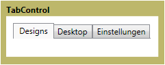

# TabControl
<xref:System.Windows.Controls.TabControl> Elemente anzeigen von Inhalt auf einzelne Seiten zugegriffen, indem die entsprechende Registerkarte ausgewählt. Jede Registerkarte enthält eine <xref:System.Windows.Controls.TabItem>.  
  
 Die folgende Abbildung zeigt eine <xref:System.Windows.Controls.TabControl>.  
  
   
Typische TabControl  
  
## Referenz  
 <xref:System.Windows.Controls.TabControl>  
  <xref:System.Windows.Controls.TabItem>  
  
## Verwandte Abschnitte
