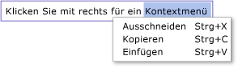

# Übersicht über TextBox
Mit <xref:System.Windows.Controls.TextBox> der Klasse können Sie unformatierten Text anzeigen oder bearbeiten. Eine häufige Verwendung <xref:System.Windows.Controls.TextBox> von a ist das Bearbeiten von unformatiertem Text in einem Formular. Beispielsweise würde ein Formular, in dem der Name, die <xref:System.Windows.Controls.TextBox> Telefonnummer usw. des Benutzers gefragt werden, Steuerelemente für die Texteingabe verwenden. In diesem <xref:System.Windows.Controls.TextBox> Thema wird die Klasse vorgestellt und [!INCLUDE[TLA#tla_xaml](../../../../includes/tlasharptla-xaml-md.md)] enthält Beispiele für die Verwendung in beiden und C-Dateien.  

## TextBox oder RichTextBox?  
 Beide <xref:System.Windows.Controls.TextBox> <xref:System.Windows.Controls.RichTextBox> und ermöglichen Benutzern die Eingabe von Text, aber die beiden Steuerelemente werden für verschiedene Szenarien verwendet. A <xref:System.Windows.Controls.TextBox> benötigt weniger Systemressourcen als eine, <xref:System.Windows.Controls.RichTextBox> daher ist es ideal, wenn nur Klartext bearbeitet werden muss (d. h. Verwendung in einem Formular). A <xref:System.Windows.Controls.RichTextBox> ist eine bessere Wahl, wenn der Benutzer formatierten Text, Bilder, Tabellen oder andere unterstützte Inhalte bearbeiten muss. Beispielsweise ist das Bearbeiten eines Dokuments, Artikels oder Blogs, das Formatierungen, Bilder usw. erfordert, am besten mit einer <xref:System.Windows.Controls.RichTextBox>zu erreichen. Die folgende Tabelle fasst die <xref:System.Windows.Controls.TextBox> <xref:System.Windows.Controls.TextBox>primären Features von und zusammen.  
  
|Control|Rechtschreibprüfung in Echtzeit|Kontextmenü|Formatieren <xref:System.Windows.Documents.EditingCommands.ToggleBold%2A> von Befehlen wie (Ctr+B)|<xref:System.Windows.Documents.FlowDocument>Inhalte wie Bilder, Absätze, Tabellen usw.|  
|-------------|------------------------------|------------------|------------------------------------------------------------------------------------------------------------------------------------------------------------------------------------------------------|--------------------------------------------------------------------------------------------------------------------------------------------------------------------------------------------------|  
|<xref:System.Windows.Controls.TextBox>|Ja|Ja|Nein |Nein.|  
|<xref:System.Windows.Controls.RichTextBox>|Ja|Ja|Ja (Siehe [Übersicht über RichTextBox](richtextbox-overview.md))|Ja (Siehe [Übersicht über RichTextBox](richtextbox-overview.md))|  
  
> [!NOTE]
> Obwohl <xref:System.Windows.Controls.TextBox> die Formatierung verwandter <xref:System.Windows.Documents.EditingCommands.ToggleBold%2A> Bearbeitungsbefehle wie (Ctr+B) nicht unterstützt <xref:System.Windows.Documents.EditingCommands.MoveToLineEnd%2A>wird, werden viele grundlegende Befehle von beiden Steuerelementen wie unterstützt. Weitere Informationen finden Sie unter <xref:System.Windows.Documents.EditingCommands>.  
  
 Die von <xref:System.Windows.Controls.TextBox> den folgenden Features unterstützten Funktionen werden in den folgenden Abschnitten behandelt. Weitere Informationen <xref:System.Windows.Controls.RichTextBox>zu finden Sie unter [RichTextBox Overview](richtextbox-overview.md).  
  
### Rechtschreibprüfung in Echtzeit  
 Sie können die Echtzeit-Rechtschreibprüfung in einem <xref:System.Windows.Controls.TextBox> oder <xref:System.Windows.Controls.RichTextBox>aktivieren. Wenn die Rechtschreibprüfung aktiviert ist, wird eine rote Linie unter falsch geschriebenen Wörtern angezeigt (siehe Abbildung unten).  
  
   
  
 Wie Sie die Rechtschreibprüfung aktivieren, erfahren Sie unter [Aktivieren der Rechtschreibprüfung in einem Textbearbeitungssteuerelement](how-to-enable-spell-checking-in-a-text-editing-control.md).  
  
### Kontextmenü  
 Standardmäßig haben <xref:System.Windows.Controls.TextBox> beide <xref:System.Windows.Controls.RichTextBox> und haben ein Kontextmenü, das angezeigt wird, wenn ein Benutzer mit der rechten Maustaste innerhalb des Steuerelements klickt. Das Kontextmenü ermöglicht dem Benutzer das Ausschneiden, Kopieren und Einfügen (siehe Bild unten).  
  
   
  
 Sie können Ihr eigenes benutzerdefiniertes Kontextmenü erstellen, um das Standardverhalten zu überschreiben. Weitere Informationen finden Sie unter [Verwenden eines benutzerdefinierten Kontextmenüs mit „TextBox“](how-to-use-a-custom-context-menu-with-a-textbox.md).  
  

## Erstellen von TextBoxes  
 A <xref:System.Windows.Controls.TextBox> kann eine einzelne Linie in der Höhe sein oder mehrere Linien umfassen. Eine einzelne <xref:System.Windows.Controls.TextBox> Zeile eignet sich am besten für die Eingabe kleiner Mengen von Nur-Text (d. h. "Name", "Telefonnummer", etc. in einem Formular). Das folgende Beispiel zeigt, wie <xref:System.Windows.Controls.TextBox>eine einzelne Zeile erstellt wird.  
  
 [!code-xaml[TextBoxMiscSnippets_snip#BasicTextBoxExampleWholePage](~/samples/snippets/csharp/VS_Snippets_Wpf/TextBoxMiscSnippets_snip/csharp/basictextboxexample.xaml#basictextboxexamplewholepage)]  
  
 Sie können auch <xref:System.Windows.Controls.TextBox> eine erstellen, mit der der Benutzer mehrere Textzeilen eingeben kann. Wenn Das Formular z. B. nach einer biografischen Skizze <xref:System.Windows.Controls.TextBox> des Benutzers gefragt hat, sollten Sie eine verwenden, die mehrere Textzeilen unterstützt. Das folgende Beispiel zeigt, wie Sie [!INCLUDE[TLA#tla_xaml](../../../../includes/tlasharptla-xaml-md.md)] ein <xref:System.Windows.Controls.TextBox> Steuerelement definieren, das automatisch erweitert wird, um mehrere Textzeilen aufzunehmen.  
  
 [!code-xaml[TextBox_MiscCode#_MultilineTextBoxXAML](~/samples/snippets/csharp/VS_Snippets_Wpf/TextBox_MiscCode/CSharp/Window1.xaml#_multilinetextboxxaml)]  
  
 Wenn <xref:System.Windows.Controls.TextBox.TextWrapping%2A> Sie `Wrap` das Attribut so festlegen, dass Text <xref:System.Windows.Controls.TextBox> in eine neue Zeile <xref:System.Windows.Controls.TextBox> umbrochen wird, wenn die Kante des Steuerelements erreicht wird, wird das Steuerelement automatisch erweitert, um bei Bedarf Platz für eine neue Zeile einzuschließen.  
  
 Wenn <xref:System.Windows.Controls.Primitives.TextBoxBase.AcceptsReturn%2A> Sie `true` das Attribut so festlegen, dass eine neue Zeile eingefügt wird, wenn die RETURN-Taste gedrückt wird, wird der <xref:System.Windows.Controls.TextBox> Raum für eine neue Zeile bei Bedarf erneut automatisch erweitert.  
  
 Das <xref:System.Windows.Controls.Primitives.TextBoxBase.VerticalScrollBarVisibility%2A> Attribut fügt dem <xref:System.Windows.Controls.TextBox>eine Bildlaufleiste hinzu, sodass der Inhalt des durchgescrollt werden <xref:System.Windows.Controls.TextBox> kann, wenn der <xref:System.Windows.Controls.TextBox> über die Größe des Rahmens oder Fensters hinaus erweitert wird, das ihn umschließt.  
  
 Weitere Informationen zu verschiedenen Aufgaben <xref:System.Windows.Controls.TextBox>im Zusammenhang mit der Verwendung einer finden Sie unter [Anleitungsthemen](textbox-how-to-topics.md).  
  

## Erkennen, wenn Inhalt geändert wird  
 Normalerweise <xref:System.Windows.Controls.Primitives.TextBoxBase.TextChanged> sollte das Ereignis verwendet werden, <xref:System.Windows.Controls.TextBox> um <xref:System.Windows.Controls.RichTextBox> zu erkennen, wann der Text in einem oder ändert, anstatt, <xref:System.Windows.UIElement.KeyDown> wie Sie vielleicht erwarten. Ein Beispiel finden Sie unter [Erkennen von Änderungen an Text in einem Textfeld](how-to-detect-when-text-in-a-textbox-has-changed.md).  
  
## Weitere Informationen

- [How-to-Themen](textbox-how-to-topics.md)
- [Übersicht über RichTextBox](richtextbox-overview.md)
