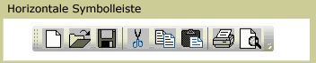
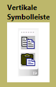

# ToolBarToolBar
Die <xref:System.Windows.Controls.ToolBar> Steuerelement ist ein Container für eine Gruppe von Befehlen oder Steuerelementen, die in der Regel in ihrer Funktion verknüpft sind.The <xref:System.Windows.Controls.ToolBar> control is a container for a group of commands or controls that are typically related in their function.  
  
 Die folgenden Abbildungen zeigen die horizontalen und vertikalen <xref:System.Windows.Controls.ToolBar> Steuerelemente.The following illustrations show horizontal and vertical <xref:System.Windows.Controls.ToolBar> controls.  
  
   
Horizontale SymbolleisteHorizontal Toolbar  
  
   
Vertikale SymbolleisteVertical Toolbar  
  
## In diesem AbschnittIn This Section  
 [Übersicht über ToolBarToolBar Overview](toolbar-overview.md)  
  [Formatieren von Steuerelementen in einer SymbolleisteStyle Controls on a ToolBar](how-to-style-controls-on-a-toolbar.md)  
  
## ReferenzReference  
 <xref:System.Windows.Controls.ToolBar>  
  <xref:System.Windows.Controls.ToolBarTray>  
  
## Verwandte AbschnitteRelated Sections
