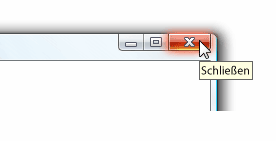

# QuickInfoToolTip
Eine QuickInfo ist ein kleines Popupfenster, das angezeigt wird, wenn ein Benutzer den Mauszeiger auf ein Element, beispielsweise über hält eine <xref:System.Windows.Controls.Button>.A tooltip is a small pop-up window that appears when a user pauses the mouse pointer over an element, such as over a <xref:System.Windows.Controls.Button>.  
  
 Die folgende Abbildung zeigt ein Mauszeiger-auf, die auf zeigt die **schließen**<xref:System.Windows.Controls.Button>, das dann zeigt an, die identifizieren <xref:System.Windows.Controls.ToolTip>.The following illustration shows a mouse pointer that points to the **Close**<xref:System.Windows.Controls.Button>, which then displays its identifying <xref:System.Windows.Controls.ToolTip>.  
  
 Schaltfläche "Schließen" der QuickInfoClose button with its tooltip displayed  
  
   
  
## In diesem AbschnittIn This Section  
 [Übersicht über QuickInfoToolTip Overview](tooltip-overview.md)  
  [Themen zu VorgehensweisenHow-to Topics](tooltip-how-to-topics.md)  
  
## ReferenzReference  
 <xref:System.Windows.Controls.ToolTip>  
  <xref:System.Windows.Controls.ToolTipService>  
  <xref:System.Windows.Controls.Primitives.Popup>  
  
## Verwandte AbschnitteRelated Sections  
 [Übersicht über PopupsPopup Overview](popup-overview.md)  
  [Themen zu VorgehensweisenHow-to Topics](popup-how-to-topics.md)
