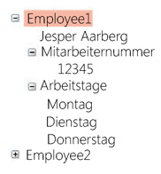

# TreeView
Die <xref:System.Windows.Controls.TreeView> -Steuerelement zeigt Informationen in einer hierarchischen Struktur mit reduzierbaren Knoten.  
  
 Die folgende Abbildung ist ein Beispiel für eine <xref:System.Windows.Controls.TreeView> Steuerelement, das geschachtelte <xref:System.Windows.Controls.TreeViewItem> Steuerelemente.  
  
   
  
## In diesem Abschnitt  
 [Übersicht über TreeView](../../../../docs/framework/wpf/controls/treeview-overview.md)  
 [Themen zu Vorgehensweisen](../../../../docs/framework/wpf/controls/treeview-how-to-topics.md)  
  
## Referenz  
 <xref:System.Windows.Controls.TreeView>  
  <xref:System.Windows.Controls.TreeViewItem>  
  
## Verwandte Abschnitte  
 [Übersicht zur Datenbindung](../../../../docs/framework/wpf/data/data-binding-overview.md)  
  [Übersicht über Datenvorlagen](../../../../docs/framework/wpf/data/data-templating-overview.md)
