# Exemplarische Vorgehensweise: Erstellen einer Schaltfläche mit Microsoft Expression BlendWalkthrough: Create a Button by Using Microsoft Expression Blend

Diese exemplarische Vorgehensweise führt Sie durch die Erstellung einer [!INCLUDE[TLA2#tla_wpf](../../../../includes/tla2sharptla-wpf-md.md)] angepassten Schaltfläche mit Microsoft Expression Blend.This walkthrough steps you through the process of creating a [!INCLUDE[TLA2#tla_wpf](../../../../includes/tla2sharptla-wpf-md.md)] customized button using Microsoft Expression Blend.

> [!IMPORTANT]
> Microsoft Expression Blend funktioniert, indem [!INCLUDE[TLA#tla_xaml](../../../../includes/tlasharptla-xaml-md.md)] erstellt wird, die dann kompiliert werden, um das ausführbare Programm zu erstellen.Microsoft Expression Blend works by generating [!INCLUDE[TLA#tla_xaml](../../../../includes/tlasharptla-xaml-md.md)] that is then compiled to make the executable program. Wenn Sie lieber direkt mit XAML arbeiten, gibt es eine weitere Exemplarische Vorgehensweise, in der dieselbe Anwendung wie diese mit XAML und Visual Studio anstelle von Blend erstellt wird.If you would rather work with XAML directly, there is another walkthrough that creates the same application as this one using XAML with Visual Studio rather than Blend. Weitere Informationen finden [Sie unter Erstellen einer Schaltfläche mit XAML](walkthrough-create-a-button-by-using-xaml.md) .See [Create a Button by Using XAML](walkthrough-create-a-button-by-using-xaml.md) for more information.

Die folgende Abbildung zeigt die angepasste Schaltfläche, die Sie erstellen werden.The following illustration shows the customized button that you will create.

## Konvertieren einer Form in eine SchaltflächeConvert a Shape to a Button

Im ersten Teil dieser exemplarischen Vorgehensweise erstellen Sie das benutzerdefinierte Aussehen der benutzerdefinierten Schaltfläche.In the first part of this walkthrough you create the custom look of the custom button. Zu diesem Zweck konvertieren Sie zuerst ein Rechteck in eine Schaltfläche.To do this, you first convert a rectangle to a button. Fügen Sie dann der Vorlage der Schaltfläche Weitere Formen hinzu, und erstellen Sie eine komplexere Schaltfläche.You then add additional shapes to the template of the button, creating a more complex looking button. Warum beginnen Sie nicht mit einer regulären Schaltfläche, und passen Sie Sie an?Why not start with a regular button and customize it? Eine Schaltfläche verfügt über integrierte Funktionen, die Sie nicht benötigen. bei benutzerdefinierten Schaltflächen ist es einfacher, mit einem Rechteck zu beginnen.Because a button has built-in functionality that you do not need; for custom buttons, it is easier to start with a rectangle.

### So erstellen Sie ein neues Projekt in Expression BlendTo create a new project in Expression Blend

1. Starten Sie Expression Blend.Start Expression Blend. (Klicken Sie auf **Start**, zeigen Sie auf **Alle Programme**, zeigen Sie auf **Microsoft Expression**, und klicken Sie dann auf **Microsoft Expression Blend**.)(Click **Start**, point to **All Programs**, point to **Microsoft Expression**, and then click **Microsoft Expression Blend**.)

2. Maximieren Sie die Anwendung bei Bedarf.Maximize the application if needed.

3. Klicken Sie im Menü **Datei** auf **Neues Projekt**.On the **File** menu, click **New Project**.

4. Wählen Sie **Standard Anwendung (. exe)** aus.Select **Standard Application (.exe)**.

5. Benennen Sie das Projekt `CustomButton`, und klicken Sie auf **OK**.Name the project `CustomButton` and press **OK**.

An diesem Punkt verfügen Sie über ein leeres [!INCLUDE[TLA2#tla_wpf](../../../../includes/tla2sharptla-wpf-md.md)] Projekt.At this point you have a blank [!INCLUDE[TLA2#tla_wpf](../../../../includes/tla2sharptla-wpf-md.md)] project. Sie können F5 drücken, um die Anwendung auszuführen.You can press F5 to run the application. Wie Sie vielleicht erwarten, besteht die Anwendung nur aus einem leeren Fenster.As you might expect, the application consists of only a blank window. Als Nächstes erstellen Sie ein abgerundetes Rechteck und konvertieren es in eine Schaltfläche.Next, you create a rounded rectangle and convert it into a button.

### So konvertieren Sie ein Rechteck in eine SchaltflächeTo convert a Rectangle to a Button

1. **Legen Sie die Eigenschaft Window Background auf Black fest:** Wählen Sie das Fenster aus, klicken Sie auf die **Registerkarte Eigenschaften**, und legen Sie die Eigenschaft <xref:System.Windows.Controls.Control.Background%2A> auf `Black`fest.**Set the Window Background property to black:** Select the Window, click the **Properties Tab**, and set the <xref:System.Windows.Controls.Control.Background%2A> property to `Black`.

    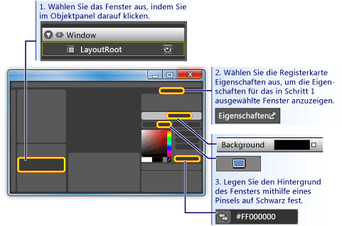

2. **Zeichnen Sie ein Rechteck ungefähr die Größe einer Schaltfläche im Fenster:** Wählen Sie im linken Werkzeug Panel das Rechteck Tool aus, und ziehen Sie das Rechteck in das Fenster.**Draw a rectangle approximately the size of a button on the Window:** Select the rectangle tool on the left-hand tool panel and drag the rectangle onto the Window.

    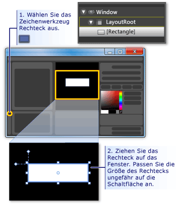

3. **Runden Sie die Ecken des Rechtecks ab:** Ziehen Sie entweder die Steuerungs Punkte des Rechtecks, oder legen Sie die Eigenschaften <xref:System.Windows.Shapes.Rectangle.RadiusX%2A> und <xref:System.Windows.Shapes.Rectangle.RadiusY%2A> direkt fest.**Round out the corners of the rectangle:** Either drag the control points of the rectangle or directly set the <xref:System.Windows.Shapes.Rectangle.RadiusX%2A> and <xref:System.Windows.Shapes.Rectangle.RadiusY%2A> properties. Legen Sie die Werte von <xref:System.Windows.Shapes.Rectangle.RadiusX%2A> und <xref:System.Windows.Shapes.Rectangle.RadiusY%2A> auf 20 fest.Set the values of <xref:System.Windows.Shapes.Rectangle.RadiusX%2A> and <xref:System.Windows.Shapes.Rectangle.RadiusY%2A> to 20.

    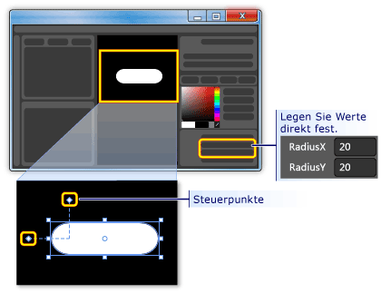

4. **Ändern Sie das Rechteck in eine Schaltfläche:** Wählen Sie das Rechteck aus.**Change the rectangle into a button:** Select the rectangle. Klicken Sie **im Menü Extras** auf die **Schaltfläche erstellen**.On the **Tools** menu, click **Make Button**.

    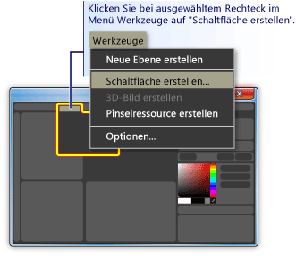

5. **Geben Sie den Bereich des Stils/der Vorlage an:** Ein Dialogfeld wie das folgende wird angezeigt.**Specify the scope of the style/template:** A dialog box like the following appears.

    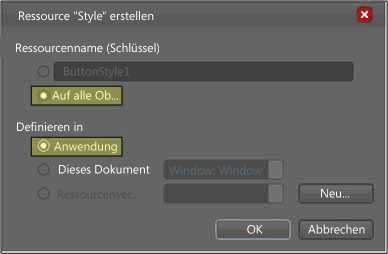

    Wählen Sie unter **Ressourcen Name (Schlüssel)** **die Option auf alle anwenden**aus.For **Resource name (Key)**, select **Apply to all**.  Dadurch wird die resultierende Stil-und Schaltflächen Vorlage auf alle Objekte angewendet, bei denen es sich um Schaltflächen handelt.This will make the resulting style and button template apply to all objects that are buttons. Wählen Sie **unter Definieren in**die Option **Anwendung**aus.For **Define in**, select **Application**. Dadurch wird der resultierende Stil und die Schaltflächen Vorlage über die gesamte Anwendung verfügen.This will make the resulting style and button template have scope over the entire application. Wenn Sie die Werte in diesen beiden Feldern festlegen, werden der Schaltflächen Stil und die Vorlage auf alle Schaltflächen innerhalb der gesamten Anwendung angewendet, und jede Schaltfläche, die Sie in der Anwendung erstellen, wird standardmäßig diese Vorlage verwenden.When you set the values in these two boxes, the button style and template apply to all buttons within the entire application and any button you create in the application will, by default, use this template.

## Bearbeiten der Schaltflächen VorlageEdit the Button Template

Sie verfügen jetzt über ein Rechteck, das in eine Schaltfläche geändert wurde.You now have a rectangle that has been changed to a button. In diesem Abschnitt ändern Sie die Vorlage der Schaltfläche und passen Sie an, wie Sie aussieht.In this section, you'll modify the template of the button and further customize how it looks.

### So bearbeiten Sie die Schaltflächen Vorlage zum Ändern der Schaltflächen DarstellungTo edit the button template to change the button appearance

1. Wechseln Sie **in Vorlagen Ansicht bearbeiten:** Um das Aussehen unserer Schaltfläche weiter anzupassen, müssen wir die Schaltflächen Vorlage bearbeiten.**Go into edit template view:** To further customize the look of our button, we need to edit the button template. Diese Vorlage wurde erstellt, als das Rechteck in eine Schaltfläche konvertiert wurde.This template was created when we converted the rectangle into a button. Klicken Sie zum Bearbeiten der Schaltflächen Vorlage mit der rechten Maustaste auf die Schaltfläche, und wählen Sie **Steuerelemente bearbeiten (Vorlage)** und dann **Vorlage bearbeiten**aus.To edit the button template, right-click the button and select **Edit Control Parts (Template)** and then **Edit Template**.

    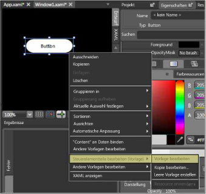

    Beachten Sie im Vorlagen-Editor, dass die Schaltfläche nun in eine <xref:System.Windows.Shapes.Rectangle> und die <xref:System.Windows.Controls.ContentPresenter>aufgeteilt ist.In the template editor, notice that the button is now separated into a <xref:System.Windows.Shapes.Rectangle> and the <xref:System.Windows.Controls.ContentPresenter>. Der <xref:System.Windows.Controls.ContentPresenter> wird verwendet, um Inhalt in der Schaltfläche darzustellen (z. b. die Zeichenfolge "Button").The <xref:System.Windows.Controls.ContentPresenter> is used to present content within the button (for example, the string "Button"). Sowohl das Rechteck als auch das <xref:System.Windows.Controls.ContentPresenter> werden innerhalb eines <xref:System.Windows.Controls.Grid>angeordnet.Both the rectangle and <xref:System.Windows.Controls.ContentPresenter> are laid out inside of a <xref:System.Windows.Controls.Grid>.

    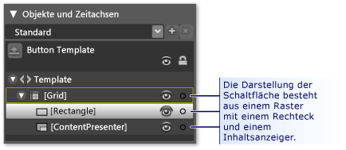

2. **Ändern Sie die Namen der Vorlagen Komponenten:** Klicken Sie mit der rechten Maustaste auf das Rechteck im Vorlagen bestand, ändern Sie den <xref:System.Windows.Shapes.Rectangle> Namen von "[Rechteck]" in "outerrechteck", und ändern Sie "[ContentPresenter]" in "myContentPresenter".**Change the names of the template components:** Right-click the rectangle in the template inventory, change the <xref:System.Windows.Shapes.Rectangle> name from "[Rectangle]" to "outerRectangle", and change "[ContentPresenter]" to "myContentPresenter".

    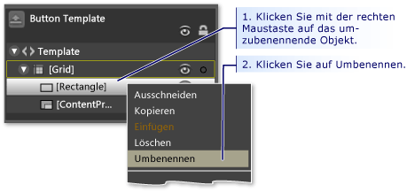

3. **Ändern Sie das Rechteck so, dass es in (z. b. in einem Ring) leer ist:** Wählen Sie **outerrechteck** aus, und legen Sie <xref:System.Windows.Shapes.Shape.Fill%2A> auf "transparent" und <xref:System.Windows.Shapes.Shape.StrokeThickness%2A> auf 5 fest.**Alter the rectangle so that it is empty inside (like a donut):** Select **outerRectangle** and set <xref:System.Windows.Shapes.Shape.Fill%2A> to "Transparent" and <xref:System.Windows.Shapes.Shape.StrokeThickness%2A> to 5.

    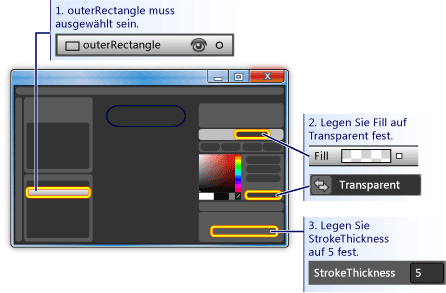

    Legen Sie dann die <xref:System.Windows.Shapes.Shape.Stroke%2A> auf die Farbe der Vorlage fest.Then set the <xref:System.Windows.Shapes.Shape.Stroke%2A> to the color of whatever the template will be. Klicken Sie hierzu auf das kleine weiße Feld neben **Stroke**, wählen Sie **CustomExpression**aus, und geben Sie im Dialogfeld "{TemplateBinding Background}" ein.To do this, click the small white box next to **Stroke**, select **CustomExpression**, and type "{TemplateBinding Background}" in the dialog box.

    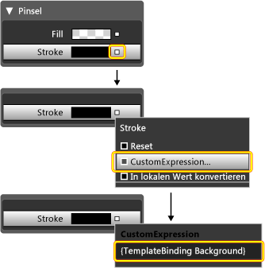

4. **Erstellen eines inneren Rechtecks:** Erstellen Sie nun ein weiteres Rechteck (benennen Sie es "innerrechteck"), und positionieren Sie es symmetrisch im Inneren von **outerrechteck** .**Create an inner rectangle:** Now, create another rectangle (name it "innerRectangle") and position it symmetrically on the inside of **outerRectangle** . Für diese Art von Arbeit möchten Sie wahrscheinlich vergrößern, um die Schaltfläche im Bearbeitungsbereich zu vergrößern.For this kind of work, you will probably want to zoom to make the button larger in the editing area.

    > [!NOTE]
    > Das Rechteck kann sich von dem in der Abbildung abweichenden (z. b. möglicherweise gerundete Ecken) unterscheiden.Your rectangle might look different than the one in the figure (for example, it might have rounded corners).

    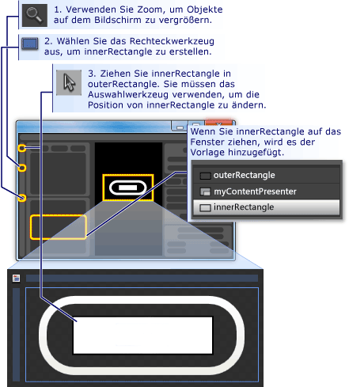

5. **Verschieben Sie ContentPresenter an den Anfang:** An diesem Punkt ist es möglich, dass der Text "Button" nicht mehr sichtbar ist.**Move ContentPresenter to the top:** At this point, it is possible that the text "Button" will not be visible any longer. Wenn dies der Fall ist, liegt dies daran, dass **innerrechteck** oberhalb von **myContentPresenter**liegt.If this is so, this is because **innerRectangle** is on top of the **myContentPresenter**. Um dieses Problem zu beheben, ziehen Sie **myContentPresenter** unterhalb des **innerrechtecks**.To fix this, drag **myContentPresenter** below **innerRectangle**. Ordnen Sie Rechtecke und **myContentPresenter** so an, dass Sie in etwa wie folgt aussehen.Reposition rectangles and **myContentPresenter** to look similar to below.

    > [!NOTE]
    > Alternativ können Sie **myContentPresenter** auch oben positionieren, indem Sie mit der rechten Maustaste darauf klicken und dann auf **senden**klicken.Alternatively, you can also position **myContentPresenter** on top by right-clicking it and pressing **Send Forward**.

    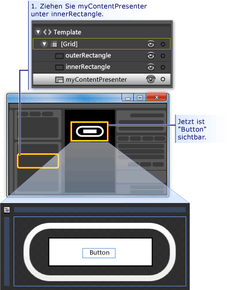

6. **Ändern Sie das Aussehen des innerrechtecks:** Legen Sie die Werte für <xref:System.Windows.Shapes.Rectangle.RadiusX%2A>, <xref:System.Windows.Shapes.Rectangle.RadiusY%2A>und <xref:System.Windows.Shapes.Shape.StrokeThickness%2A> auf 20 fest.**Change the look of innerRectangle:** Set the <xref:System.Windows.Shapes.Rectangle.RadiusX%2A>, <xref:System.Windows.Shapes.Rectangle.RadiusY%2A>, and <xref:System.Windows.Shapes.Shape.StrokeThickness%2A> values to 20. Legen Sie außerdem die <xref:System.Windows.Shapes.Shape.Fill%2A> mithilfe des benutzerdefinierten Ausdrucks "{TemplateBinding Background}" auf den Hintergrund der Vorlage fest, und legen Sie <xref:System.Windows.Shapes.Shape.Stroke%2A> auf "transparent" fest.In addition, set the <xref:System.Windows.Shapes.Shape.Fill%2A> to the background of the template using the custom expression "{TemplateBinding Background}" ) and set <xref:System.Windows.Shapes.Shape.Stroke%2A> to "transparent". Beachten Sie, dass die Einstellungen für die <xref:System.Windows.Shapes.Shape.Fill%2A> und <xref:System.Windows.Shapes.Shape.Stroke%2A> von **innerrechteck** das Gegenteil von der für **outerrechteck**sind.Notice that the settings for the <xref:System.Windows.Shapes.Shape.Fill%2A> and <xref:System.Windows.Shapes.Shape.Stroke%2A> of **innerRectangle** are the opposite of those for **outerRectangle**.

    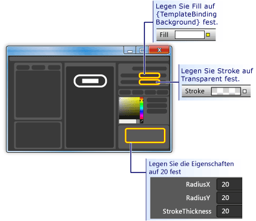

7. **Fügen Sie oben eine Glasebene hinzu:** Das letzte Mal, das Aussehen der Schaltfläche anzupassen, besteht darin, eine Glasebene oben hinzuzufügen.**Add a glass layer on top:** The final piece of customizing the look of the button is to add a glass layer on top. Diese Glasschicht besteht aus einem dritten Rechteck.This glass layer consists of a third rectangle. Da das Glas die gesamte Schaltfläche abdeckt, ähnelt das Glas Rechteck den Abmessungen des **outerrechtecks**.Because the glass will cover the entire button, the glass rectangle is similar in dimensions to the **outerRectangle**. Erstellen Sie daher das Rechteck, indem Sie einfach eine Kopie des **outerrechtecks**erstellen.Therefore, create the rectangle by simply making a copy of the **outerRectangle**. Markieren Sie **outerrechteck** , und verwenden Sie STRG + C und STRG + V, um eine Kopie zu erstellen.Highlight **outerRectangle** and use CTRL+C and CTRL+V to make a copy. Nennen Sie dieses neue Rechteck "glassCube".Name this new rectangle "glassCube".

8. **Neupositionieren von glassCube, falls erforderlich:** Wenn **glassCube** nicht bereits so positioniert ist, dass es die gesamte Schaltfläche abdeckt, ziehen Sie es in die Position.**Reposition glassCube if necessary:** If **glassCube** is not already positioned so that it covers the entire button, drag it into position.

9. **Geben Sie glassCube eine etwas andere Form als outerrechteck an:** Ändern Sie die Eigenschaften von " **glassCube**".**Give glassCube a slightly different shape than outerRectangle:** Change the properties of **glassCube**. Beginnen Sie, indem Sie die Eigenschaften für <xref:System.Windows.Shapes.Rectangle.RadiusX%2A> und <xref:System.Windows.Shapes.Rectangle.RadiusY%2A> auf 10 und die <xref:System.Windows.Shapes.Shape.StrokeThickness%2A> auf 2 ändern.Start off by changing the <xref:System.Windows.Shapes.Rectangle.RadiusX%2A> and <xref:System.Windows.Shapes.Rectangle.RadiusY%2A> properties to 10 and the <xref:System.Windows.Shapes.Shape.StrokeThickness%2A> to 2.

    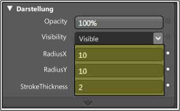

10. **Lassen Sie glassCube wie Glas aussehen:** Legen Sie den <xref:System.Windows.Shapes.Shape.Fill%2A> auf ein Glassy-Aussehen fest, indem Sie einen linearen Farbverlauf verwenden, der 75% deckend ist, und zwischen Farbe weiß und transparent über 6 in ungefähr gleichmäßigen Abständen umzustellen.**Make glassCube look like glass:** Set the <xref:System.Windows.Shapes.Shape.Fill%2A> to a glassy look by  using a linear gradient that is 75% opaque and alternates between the color White and Transparent over 6 approximately evenly spaced intervals. So legen Sie die Farbverlaufs Stopps fest:This is what to set the gradient stops to:

    - Farbverlaufs Ende 1: weiß mit Alpha-Wert von 75%Gradient Stop 1: White with Alpha value of 75%

    - Farbverlaufs Ende 2: transparentGradient Stop 2: Transparent

    - Farbverlaufs Ende 3: weiß mit Alpha-Wert von 75%Gradient Stop 3: White with Alpha value of 75%

    - Farbverlaufs Ende 4: transparentGradient Stop 4: Transparent

    - Farbverlaufs Ende 5: weiß mit Alpha-Wert von 75%Gradient Stop 5: White with Alpha value of 75%

    - Farbverlaufs Ende 6: transparentGradient Stop 6: Transparent

    Dadurch wird eine "wellenförmige" Glas Suche erstellt.This creates a "wavy" glass look.

    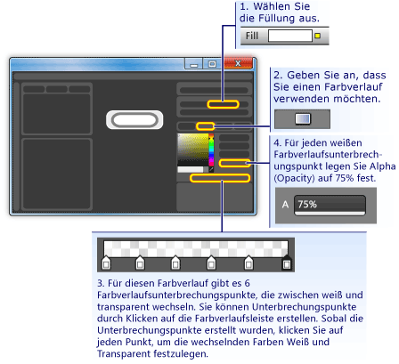

11. **Die Glasebene ausblenden:** Nachdem Sie nun sehen, wie die Glassy-Schicht aussieht, wechseln Sie in den Bereich Darstellung des **Eigenschaften Panels** , und legen **Sie die** Deckkraft auf 0% fest, um sie auszublenden.**Hide the glass layer:** Now that you see what the glassy layer looks like, go into the **Appearance pane** of the **Properties panel** and set the Opacity to 0% to hide it. In den Abschnitten weiter oben verwenden wir Eigenschafts Trigger und-Ereignisse, um die Glasschicht anzuzeigen und zu bearbeiten.In the sections ahead, we'll use property triggers and events to show and manipulate the glass layer.

    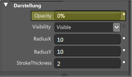

## Anpassen des Schaltflächen VerhaltensCustomize the Button Behavior

An diesem Punkt haben Sie die Darstellung der Schaltfläche angepasst, indem Sie die zugehörige Vorlage bearbeiten, aber die Schaltfläche reagiert nicht auf Benutzeraktionen wie normale Schaltflächen (z. b. das Ändern der Darstellung nach dem Mauszeiger, das Empfangen des Fokus und das Klicken auf). In den nächsten zwei Prozeduren wird veranschaulicht, wie Sie Verhalten wie diese in der benutzerdefinierten Schaltfläche erstellen.At this point, you have customized the presentation of the button by editing its template, but the button does not react to user actions as typical buttons do (for example, changing appearance upon mouse-over, receiving focus, and clicking.) The next two procedures show how to build behaviors like these into the custom button. Wir beginnen mit einfachen Eigenschafts Triggern und fügen dann Ereignis Trigger und Animationen hinzu.We'll start with simple property triggers, and then add event triggers and animations.

### So legen Sie Eigenschafts Trigger festTo set property triggers

1. **Erstellen Sie einen neuen Eigenschafts--Auslöse** Wenn Sie die Option " **glassCube** " ausgewählt haben, klicken Sie im **triggerpanel** auf **+ Eigenschaft** (siehe die Abbildung, die dem nächsten Schritt folgt).**Create a new property trigger:** With **glassCube** selected, click **+ Property** in the **Triggers** panel (see the figure that follows the next step). Dadurch wird ein Eigenschafts-und ein Standard Eigenschafts-Auslösung erstellt.This creates a property trigger with a default property trigger.

2. **Machen Sie IsMouseOver der Eigenschaft, die vom-Auslösers verwendet wird:** Ändern Sie die-Eigenschaft in <xref:System.Windows.UIElement.IsMouseOver%2A>.**Make IsMouseOver the property used by the trigger:** Change the property to <xref:System.Windows.UIElement.IsMouseOver%2A>. Dadurch wird der Eigenschafts-und Aktivierungs Modus aktiviert, wenn die <xref:System.Windows.UIElement.IsMouseOver%2A>-Eigenschaft `true` wird (wenn der Benutzer auf die Schaltfläche mit der Maus zeigt).This makes the property trigger activate when the <xref:System.Windows.UIElement.IsMouseOver%2A> property is `true` (when the user points to the button with the mouse).

    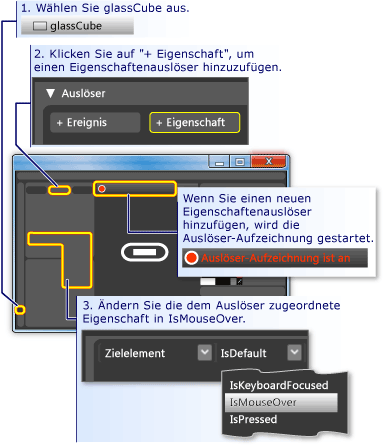

3. **IsMouseOver löst die Deckkraft von 100% für glassCube aus:** Beachten Sie, dass die **triggeraufzeichnung auf ON fest steht** (siehe vorherige Abbildung).**IsMouseOver triggers opacity of 100% for glassCube:** Notice that the **Trigger recording is on** (see the preceding figure). Dies bedeutet, dass alle Änderungen, die Sie an den Eigenschafts Werten von " **glassCube** " vornehmen, während die Aufzeichnung aktiviert ist, zu einer Aktion werden, die ausgeführt wird, wenn <xref:System.Windows.UIElement.IsMouseOver%2A> `true`.This means that any changes you make to the property values of **glassCube** while recording is on will become an action that takes place when <xref:System.Windows.UIElement.IsMouseOver%2A> is `true`. Ändern Sie während der Aufzeichnung die <xref:System.Windows.UIElement.Opacity%2A> von **glassCube** in 100%.While recording, change the <xref:System.Windows.UIElement.Opacity%2A> of **glassCube** to 100%.

    

    Sie haben jetzt Ihren ersten Eigenschafts--Auslösers erstellt.You have now created your first property trigger. Beachten Sie, dass das **triggerpanel** des Editors die <xref:System.Windows.UIElement.Opacity%2A> in 100% geändert hat.Notice that the **Triggers panel** of the editor has recorded the <xref:System.Windows.UIElement.Opacity%2A> being changed to 100%.

    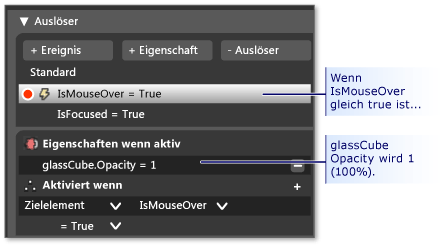

    Drücken Sie F5, um die Anwendung auszuführen, und bewegen Sie den Mauszeiger über die Schaltfläche.Press F5 to run the application, and move the mouse pointer over and off the button. Sie sollten sehen, dass die Glasebene angezeigt wird, wenn Sie mit dem Mauszeiger auf die Schaltfläche klicken.You should see the glass layer appear when you mouse-over the button and disappear when the pointer leaves.

4. **IsMouseOver-Trigger: Änderung von Strich Werten:** Im folgenden werden einige weitere Aktionen mit dem <xref:System.Windows.UIElement.IsMouseOver%2A>-Auslösung verknüpft.**IsMouseOver triggers stroke value change:** Let's associate some other actions with the <xref:System.Windows.UIElement.IsMouseOver%2A> trigger. Wenn die Aufzeichnung fortgesetzt wird, ändern Sie die Auswahl von **glassCube** zu **outerrechteck**.While recording continues, switch your selection from **glassCube** to **outerRectangle**. Legen Sie dann die <xref:System.Windows.Shapes.Shape.Stroke%2A> des **outerrechtecks** auf den benutzerdefinierten Ausdruck "{dynamikresource {x:static SystemColors. HighlightBrushKey}}" fest.Then set the <xref:System.Windows.Shapes.Shape.Stroke%2A> of **outerRectangle** to the custom expression of "{DynamicResource {x:Static SystemColors.HighlightBrushKey}}". Dadurch wird der <xref:System.Windows.Shapes.Shape.Stroke%2A> auf die von Schaltflächen verwendete typische Hervorhebungs Farbe festgelegt.This sets the <xref:System.Windows.Shapes.Shape.Stroke%2A> to the typical highlight color used by buttons. Drücken Sie F5, um die Auswirkung anzuzeigen, wenn Sie mit dem Mauszeiger auf die SchaltflächePress F5 to see the effect when you mouse over the button.

    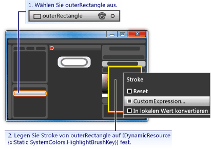

5. **IsMouseOver löst verschwommene Text aus:** Ordnen Sie dem <xref:System.Windows.UIElement.IsMouseOver%2A>-Eigenschafts Triggern eine weitere Aktion zu.**IsMouseOver triggers blurry text:** Let's associate one more action to the <xref:System.Windows.UIElement.IsMouseOver%2A> property trigger. Legen Sie den Inhalt der Schaltfläche ein wenig verschwommen, wenn das Glas darüber angezeigt wird.Make the content of the button appear a little blurry when the glass appears over it. Zu diesem Zweck können wir eine weich <xref:System.Windows.Media.Effects.BitmapEffect> auf die <xref:System.Windows.Controls.ContentPresenter> (**myContentPresenter**) anwenden.To do this, we can apply a blur <xref:System.Windows.Media.Effects.BitmapEffect> to the <xref:System.Windows.Controls.ContentPresenter> (**myContentPresenter**).

    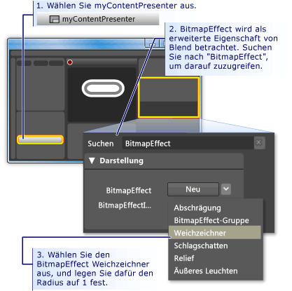

    > [!NOTE]
    > Löschen Sie den Text aus dem **Suchfeld**, um den Eigenschaften Bereich wieder zurück zu den **Voreinstellungen** zu erhalten, bevor Sie die Suche nach <xref:System.Windows.Media.Effects.BitmapEffect>durchgeführt haben.To return the **Properties panel** back to what it was before you did the search for <xref:System.Windows.Media.Effects.BitmapEffect>, clear the text from the **Search box**.

    An diesem Punkt haben wir einen Eigenschafts-und mehrere zugeordneten Aktionen verwendet, um das Hervorhebungs Verhalten zu erstellen, wenn der Mauszeiger in den Schaltflächen Bereich wechselt und verlässt.At this point, we have used a property trigger with several associated actions to create highlighting behavior for when the mouse pointer enters and leaves the button area. Ein weiteres typisches Verhalten für eine Schaltfläche besteht darin, zu markieren, wann Sie den Fokus besitzt (wie nach dem klicken).Another typical behavior for a button is to highlight when it has focus (as after it is clicked). Dieses Verhalten kann durch Hinzufügen eines weiteren Eigenschafts Auslösers für die <xref:System.Windows.UIElement.IsFocused%2A>-Eigenschaft hinzugefügt werden.We can add such behavior by adding another property trigger for the <xref:System.Windows.UIElement.IsFocused%2A> property.

6. **Erstellen eines Eigenschafts Auslösers für isfokussiert:** Erstellen Sie mit der gleichen Prozedur wie für <xref:System.Windows.UIElement.IsMouseOver%2A> (siehe den ersten Schritt dieses Abschnitts) einen weiteren Eigenschafts--Auslösers für die <xref:System.Windows.UIElement.IsFocused%2A>-Eigenschaft.**Create property trigger for IsFocused:** Using the same procedure as for <xref:System.Windows.UIElement.IsMouseOver%2A> (see the first step of this section), create another property trigger for the <xref:System.Windows.UIElement.IsFocused%2A> property. Während die **triggeraufzeichnung auf on basiert**, fügen Sie dem-Triggern die folgenden Aktionen hinzu:While **Trigger recording is on**, add the following actions to the trigger:

    - " **glassCube** " erhält eine <xref:System.Windows.UIElement.Opacity%2A> von 100%.**glassCube** gets an <xref:System.Windows.UIElement.Opacity%2A> of 100%.

    - **outerrechteck** Ruft einen <xref:System.Windows.Shapes.Shape.Stroke%2A> benutzerdefinierten Ausdruckswert "{dynamikresource {x:static SystemColors. HighlightBrushKey}}" ab.**outerRectangle** gets a <xref:System.Windows.Shapes.Shape.Stroke%2A> custom expression value of "{DynamicResource {x:Static SystemColors.HighlightBrushKey}}".

Als letzten Schritt in dieser exemplarischen Vorgehensweise fügen wir der Schaltfläche Animationen hinzu.As the final step in this walkthrough, we will add animations to the button. Diese Animationen werden durch Ereignisse ausgelöst – insbesondere die Ereignisse <xref:System.Windows.UIElement.MouseEnter> und <xref:System.Windows.Controls.Primitives.ButtonBase.Click>.These animations will be triggered by events—specifically, the <xref:System.Windows.UIElement.MouseEnter> and <xref:System.Windows.Controls.Primitives.ButtonBase.Click> events.

### So verwenden Sie Ereignis Trigger und Animationen zum Hinzufügen von InteraktivitätTo use event triggers and animations to add interactivity

1. **Erstellen eines mouevent Enter-Ereignis Auslösers:** Fügen Sie einen neuen Ereignis--Auslösers hinzu, und wählen Sie <xref:System.Windows.UIElement.MouseEnter> als Ereignis aus, das Sie im-**Create a MouseEnter Event Trigger:** Add a new event trigger and select <xref:System.Windows.UIElement.MouseEnter> as the event to use in the trigger.

     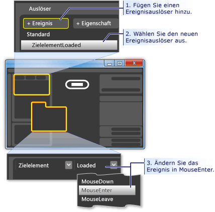

2. **Erstellen Sie eine Animations Zeitachse:** Ordnen Sie als nächstes dem <xref:System.Windows.UIElement.MouseEnter>-Ereignis eine Animations Zeitachse zu.**Create an animation timeline:** Next, associate an animation timeline to the <xref:System.Windows.UIElement.MouseEnter> event.

    

    Nachdem Sie auf **OK** geklickt haben, um eine neue Zeitachse zu erstellen, wird ein **Zeitachsen Panel** angezeigt, und "Zeitachsen Aufzeichnung ist eingeschaltet" ist im Entwurfs Panel sichtbar.After you press **OK** to create a new timeline, a **Timeline Panel** appears and "Timeline recording is on" is visible in the design panel. Dies bedeutet, dass die Aufzeichnung von Eigenschafts Änderungen in der Zeitachse gestartet werden kann (Animieren von Eigenschaften Änderungen)This means we can start recording property changes in the timeline (animate property changes).

    > [!NOTE]
    > Möglicherweise müssen Sie die Größe des Fensters und/oder der Panels ändern, damit die Anzeige angezeigt wird.You may need to resize your window and/or panels to see the display.

    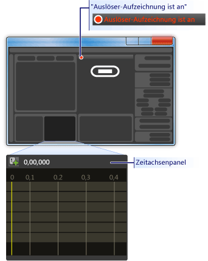

3. **Erstellen Sie einen Keyframe:** Wählen Sie zum Erstellen einer Animation das zu animierende Objekt aus, erstellen Sie zwei oder mehr Keyframes auf der Zeitachse, und legen Sie für diese Keyframes die Eigenschaftswerte fest, zwischen denen die Animation interpolieren soll.**Create a keyframe:** To create an animation, select the object you want to animate, create two or more keyframes on the timeline, and for those keyframes, set the property values you want the animation to interpolate between. Die folgende Abbildung führt Sie durch die Erstellung eines Keyframes.The following figure guides you through the creation of a keyframe.

    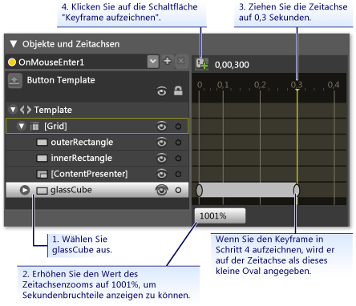

4. **Verkleinern von glassCube an diesem Keyframe:** Wenn der zweite Keyframe ausgewählt ist, verkleinern Sie die Größe des **glassCube** auf 90% seiner vollen Größe, indem Sie die **Transformation Größe**verwenden.**Shrink glassCube at this keyframe:** With the second keyframe selected, shrink the size of the **glassCube** to 90% of its full size using the **Size Transform**.

    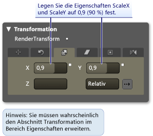

    Drücken Sie F5, um die Anwendung auszuführen.Press F5 to run the application. Bewegen Sie den Mauszeiger über die Schaltfläche.Move the mouse pointer over the button. Beachten Sie, dass sich die Glasschicht oberhalb der Schaltfläche verkleinert.Notice that the glass layer shrinks on top of the button.

5. **Erstellen eines weiteren Ereignis Auslösers und Zuordnen einer anderen Animation:** Fügen wir eine weitere Animation hinzu.**Create another Event Trigger and associate a different animation with it:** Let's add one more animation. Verwenden Sie ein ähnliches Verfahren, das Sie zum Erstellen der vorherigen Ereignis auslöseranimation verwendet haben:Use a similar procedure to what you used to create the previous event trigger animation:

    1. Erstellen Sie mit dem <xref:System.Windows.Controls.Primitives.ButtonBase.Click>-Ereignis einen neuen Ereignis Auslösers.Create a new event trigger using the <xref:System.Windows.Controls.Primitives.ButtonBase.Click> event.

    2. Ordnen Sie dem <xref:System.Windows.Controls.Primitives.ButtonBase.Click>-Ereignis eine neue Zeitachse zu.Associate a new timeline with the <xref:System.Windows.Controls.Primitives.ButtonBase.Click> event.

        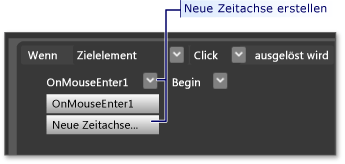

    3. Erstellen Sie für diese Zeitachse zwei Keyframes, eine mit 0,0 Sekunden und die zweite für 0,3 Sekunden.For this timeline, create two keyframes, one at 0.0 seconds and the second one at 0.3 seconds.

    4. Legen Sie bei markiertem Keyframe um 0,3 Sekunden den **Winkel Drehung drehen** auf 360 Grad fest.With the keyframe at 0.3 seconds highlighted, set the **Rotate Transform Angle** to 360 degrees.

        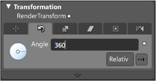

    5. Drücken Sie F5, um die Anwendung auszuführen.Press F5 to run the application. Klicken Sie auf die Schaltfläche.Click the button. Beachten Sie, dass sich die Glasschicht dreht.Notice that the glass layer spins around.

## SchlussfolgerungConclusion

Sie haben eine angepasste Schaltfläche abgeschlossen.You have completed a customized button. Dazu haben Sie eine Schaltflächen Vorlage verwendet, die auf alle Schaltflächen in der Anwendung angewendet wurde.You did this using a button template that was applied to all buttons in the application. Wenn Sie den Vorlagen Bearbeitungsmodus verlassen (siehe folgende Abbildung) und weitere Schaltflächen erstellen, sehen Sie, dass Sie sich wie die benutzerdefinierte Schaltfläche und nicht wie die Standard Schaltfläche Verhalten.If you leave the template editing mode (see the following figure) and create more buttons, you will see that they look and behave like your custom button rather than like the default button.

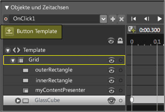

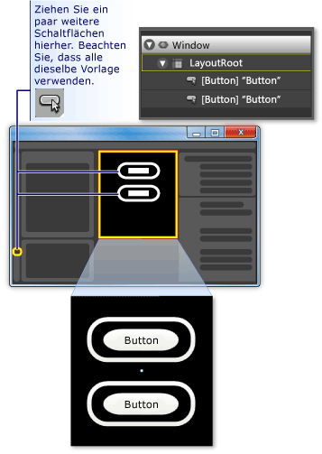

Drücken Sie F5, um die Anwendung auszuführen.Press F5 to run the application. Klicken Sie auf die Schaltflächen, und sehen Sie sich an, wie sich alle Verhalten.Click the buttons and notice how they all behave the same.

Beachten Sie, dass Sie beim Anpassen der Vorlage die <xref:System.Windows.Shapes.Shape.Fill%2A>-Eigenschaft von **innerrechteck** und die <xref:System.Windows.Shapes.Shape.Stroke%2A>-Eigenschaft **outerrechteck** auf den Vorlagen Hintergrund ({TemplateBinding background}) festgelegt haben.Remember that while you were customizing the template, you set the <xref:System.Windows.Shapes.Shape.Fill%2A> property of **innerRectangle** and the <xref:System.Windows.Shapes.Shape.Stroke%2A> property **outerRectangle** to the template background ({TemplateBinding Background}). Wenn Sie daher die Hintergrundfarbe der einzelnen Schaltflächen festlegen, wird der von Ihnen festgelegte Hintergrund für die jeweiligen Eigenschaften verwendet.Because of this, when you set the background color of the individual buttons, the background you set will be used for those respective properties. Ändern Sie nun die Hintergründe.Try changing the backgrounds now. In der folgenden Abbildung werden verschiedene Farbverläufe verwendet.In the following figure, different gradients are used. Obwohl eine Vorlage für die allgemeine Anpassung von Steuerelementen wie Schaltfläche nützlich ist, können Steuerelemente mit Vorlagen so geändert werden, dass Sie unterschiedlich aussehen.Therefore, although a template is useful for overall customization of controls like button, controls with templates can still be modified to look different from each other.

Im Zuge der Anpassung einer Schaltflächen Vorlage haben Sie in Microsoft Expression Blend Folgendes gelernt:In conclusion, in the process of customizing a button template you have learned how to do the following in Microsoft Expression Blend:

- Passen Sie das Aussehen eines Steuer Elements an.Customize the look of a control.

- Festlegen von Eigenschafts Triggern.Set property triggers. Eigenschafts Trigger sind sehr nützlich, da Sie für die meisten Objekte verwendet werden können, nicht nur für Steuerelemente.Property triggers are very useful because they can be used on most objects, not just controls.

- Legen Sie Ereignis Trigger fest.Set event triggers. Ereignis Trigger sind sehr nützlich, da Sie für die meisten Objekte verwendet werden können, nicht nur für Steuerelemente.Event triggers are very useful because they can be used on most objects, not just controls.

- Erstellen von AnimationenCreate animations.

- Sonstige: Erstellen von Farbverläufen, Hinzufügen von bitmapeer-ffects, verwenden von Transformationen und Festlegen grundlegender Eigenschaften von Objekten.Miscellaneous: create gradients, add BitmapEffects, use transforms, and set basic properties of objects.

## Siehe auchSee also

- [Erstellen einer Schaltfläche mit XAMLCreate a Button by Using XAML](walkthrough-create-a-button-by-using-xaml.md)
- [Erstellen von Formaten und VorlagenStyling and Templating](../../../desktop-wpf/fundamentals/styles-templates-overview.md)
- [Übersicht über AnimationenAnimation Overview](../graphics-multimedia/animation-overview.md)
- [Übersicht über das Zeichnen mit Volltonfarben und FarbverläufenPainting with Solid Colors and Gradients Overview](../graphics-multimedia/painting-with-solid-colors-and-gradients-overview.md)
- [Übersicht über BitmapeffekteBitmap Effects Overview](../graphics-multimedia/bitmap-effects-overview.md)
