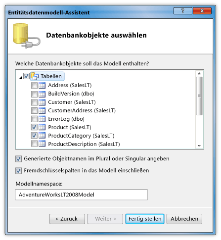
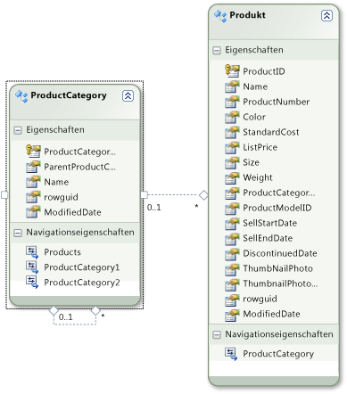

# Exemplarische Vorgehensweise: Anzeigen von Daten aus einer SQL Server Datenbank in einem DataGrid-SteuerelementWalkthrough: Display data from a SQL Server database in a DataGrid control

In dieser exemplarischen Vorgehensweise rufen Sie Daten aus einer SQL Server Datenbank ab und zeigen diese Daten in einem-Steuerelement an <xref:System.Windows.Controls.DataGrid> .In this walkthrough, you retrieve data from a SQL Server database and display that data in a <xref:System.Windows.Controls.DataGrid> control. Verwenden Sie die ADO.NET-Entity Framework, um die Entitäts Klassen zu erstellen, die die Daten darstellen, und verwenden Sie LINQ, um eine Abfrage zu schreiben, mit der die angegebenen Daten aus einer Entitäts Klasse abgerufen werden.You use the ADO.NET Entity Framework to create the entity classes that represent the data, and use LINQ to write a query that retrieves the specified data from an entity class.

## VoraussetzungenPrerequisites

Zum Abschließen dieser exemplarischen Vorgehensweise benötigen Sie Folgendes:You need the following components to complete this walkthrough:

- Visual StudioVisual Studio.

- Zugriff auf eine laufende Instanz von SQL Server oder SQL Server Express, der die AdventureWorks-Beispieldatenbank angefügt ist.Access to a running instance of SQL Server or SQL Server Express that has the AdventureWorks sample database attached to it. Sie können die AdventureWorks-Datenbank von [GitHub](https://github.com/Microsoft/sql-server-samples/releases)herunterladen.You can download the AdventureWorks database from the [GitHub](https://github.com/Microsoft/sql-server-samples/releases).

## Erstellen von Entitäts KlassenCreate entity classes

1. Erstellen Sie ein neues WPF-Anwendungsprojekt in Visual Basic oder c#, und nennen Sie es `DataGridSQLExample` .Create a new WPF Application project in Visual Basic or C#, and name it `DataGridSQLExample`.

2. Klicken Sie in Projektmappen-Explorer mit der rechten Maustaste auf das Projekt, zeigen Sie auf **Hinzufügen**, und wählen Sie dann **Neues Element**aus.In Solution Explorer, right-click your project, point to **Add**, and then select **New Item**.

     Das Dialogfeld Neues Element hinzufügen wird angezeigt.The Add New Item dialog box appears.

3. Wählen Sie im Bereich installierte Vorlagen die Option **Daten** aus, und wählen Sie in der Liste der Vorlagen die Option **ADO.NET Entity Data Model**aus.In the Installed Templates pane, select **Data** and in the list of templates, select **ADO.NET Entity Data Model**.

     

4. Benennen Sie die Datei, `AdventureWorksModel.edmx` und klicken Sie auf **Hinzufügen**.Name the file `AdventureWorksModel.edmx` and then click **Add**.

     Der Assistent für Entity Data Model wird angezeigt.The Entity Data Model Wizard appears.

5. Wählen Sie im Bildschirm Modell Inhalt auswählen die Option **EF-Designer aus Datenbank aus** , und klicken Sie dann auf **weiter**.In the Choose Model Contents screen, select **EF Designer from database** and then click **Next**.

6. Stellen Sie im Bildschirm Wählen Sie Ihre Datenverbindung aus die Verbindung mit der AdventureWorksLT2008-Datenbank her.In the Choose Your Data Connection screen, provide the connection to your AdventureWorksLT2008 database. Weitere Informationen finden Sie unter [Auswählen der Datenverbindung (Dialog Feld](https://docs.microsoft.com/previous-versions/dotnet/netframework-4.0/bb399244(v=vs.100))).For more information, see [Choose Your Data Connection Dialog Box](https://docs.microsoft.com/previous-versions/dotnet/netframework-4.0/bb399244(v=vs.100)).

    Stellen Sie sicher, dass der Name lautet `AdventureWorksLT2008Entities` und dass das Kontrollkästchen **Entitäts Verbindungseinstellungen in App.Config as speichern** aktiviert ist, und klicken Sie dann auf **weiter**.Make sure that the name is `AdventureWorksLT2008Entities` and that the **Save entity connection settings in App.Config as** check box is selected, and then click **Next**.

7. Erweitern Sie im Bildschirm Wählen Sie Ihre Datenbankobjekte aus den Knoten Tabellen, und wählen Sie die Tabelle **Product** und **ProductCategory** aus.In the Choose Your Database Objects screen, expand the Tables node, and select the **Product** and **ProductCategory** tables.

     Sie können Entitäts Klassen für alle Tabellen generieren. in diesem Beispiel rufen Sie jedoch nur Daten aus diesen beiden Tabellen ab.You can generate entity classes for all of the tables; however, in this example you only retrieve data from those two tables.

     

8. Klicken Sie auf **Fertig stellen**.Click **Finish**.

     Die Product-und ProductCategory-Entitäten werden in der Entity Designer angezeigt.The Product and ProductCategory entities are displayed in the Entity Designer.

     

## Abrufen und präsentieren der DatenRetrieve and present the data

1. Öffnen Sie die Datei "MainWindow. XAML".Open the MainWindow.xaml file.

2. Legen Sie die- <xref:System.Windows.FrameworkElement.Width%2A> Eigenschaft für den auf <xref:System.Windows.Window> 450 fest.Set the <xref:System.Windows.FrameworkElement.Width%2A> property on the <xref:System.Windows.Window> to 450.

3. Fügen Sie im XAML-Editor das folgende <xref:System.Windows.Controls.DataGrid> -Tag zwischen den `<Grid>` Tags und hinzu, `</Grid>` um einen mit dem Namen hinzuzufügen <xref:System.Windows.Controls.DataGrid> `dataGrid1` .In the XAML editor, add the following <xref:System.Windows.Controls.DataGrid> tag between the `<Grid>` and `</Grid>` tags to add a <xref:System.Windows.Controls.DataGrid> named `dataGrid1`.

     [!code-xaml[DataGrid_SQL_EF_Walkthrough#3](~/samples/snippets/csharp/VS_Snippets_Wpf/DataGrid_SQL_EF_Walkthrough/CS/MainWindow.xaml#3)]

     

4. Wählen Sie <xref:System.Windows.Window> aus.Select the <xref:System.Windows.Window>.

5. Erstellen Sie mit dem Eigenschaftenfenster-oder XAML-Editor einen Ereignishandler für das mit <xref:System.Windows.Window> `Window_Loaded` dem Namen für das- <xref:System.Windows.FrameworkElement.Loaded> Ereignis.Using the Properties window or XAML editor, create an event handler for the <xref:System.Windows.Window> named `Window_Loaded` for the <xref:System.Windows.FrameworkElement.Loaded> event. Weitere Informationen finden Sie unter Gewusst [wie: Erstellen eines einfachen Ereignis Handlers](https://docs.microsoft.com/previous-versions/visualstudio/visual-studio-2010/bb675300(v=vs.100)).For more information, see [How to: Create a Simple Event Handler](https://docs.microsoft.com/previous-versions/visualstudio/visual-studio-2010/bb675300(v=vs.100)).

     Der folgende Code zeigt das XAML für "MainWindow. XAML".The following shows the XAML for MainWindow.xaml.

    > [!NOTE]
    > Wenn Sie Visual Basic verwenden, ersetzen Sie in der ersten Zeile der Datei "MainWindow. XAML" `x:Class="DataGridSQLExample.MainWindow"` durch `x:Class="MainWindow"` .If you are using Visual Basic, in the first line of MainWindow.xaml, replace `x:Class="DataGridSQLExample.MainWindow"` with `x:Class="MainWindow"`.

     [!code-xaml[DataGrid_SQL_EF_Walkthrough#1](~/samples/snippets/csharp/VS_Snippets_Wpf/DataGrid_SQL_EF_Walkthrough/CS/MainWindow.xaml#1)]

6. Öffnen Sie die Code Behind-Datei (MainWindow. XAML. vb oder MainWindow.XAML.cs) für das <xref:System.Windows.Window> .Open the code-behind file (MainWindow.xaml.vb or MainWindow.xaml.cs) for the <xref:System.Windows.Window>.

7. Fügen Sie den folgenden Code hinzu, um nur bestimmte Werte aus den verbundenen Tabellen abzurufen, und legen Sie die- <xref:System.Windows.Controls.ItemsControl.ItemsSource%2A> Eigenschaft des-Objekts <xref:System.Windows.Controls.DataGrid> auf die Ergebnisse der Abfrage fest.Add the following code to retrieve only specific values from the joined tables and set the <xref:System.Windows.Controls.ItemsControl.ItemsSource%2A> property of the <xref:System.Windows.Controls.DataGrid> to the results of the query.

     [!code-csharp[DataGrid_SQL_EF_Walkthrough#2](~/samples/snippets/csharp/VS_Snippets_Wpf/DataGrid_SQL_EF_Walkthrough/CS/MainWindow.xaml.cs#2)]
     [!code-vb[DataGrid_SQL_EF_Walkthrough#2](~/samples/snippets/visualbasic/VS_Snippets_Wpf/DataGrid_SQL_EF_Walkthrough/VB/MainWindow.xaml.vb#2)]

8. Führen Sie das Beispiel aus.Run the example.

     Es sollte ein <xref:System.Windows.Controls.DataGrid> angezeigt werden, in dem Daten angezeigt werden.You should see a <xref:System.Windows.Controls.DataGrid> that displays data.

     

## Siehe auchSee also

- <xref:System.Windows.Controls.DataGrid>
