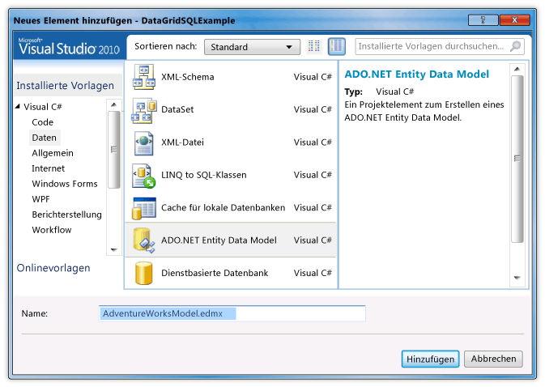
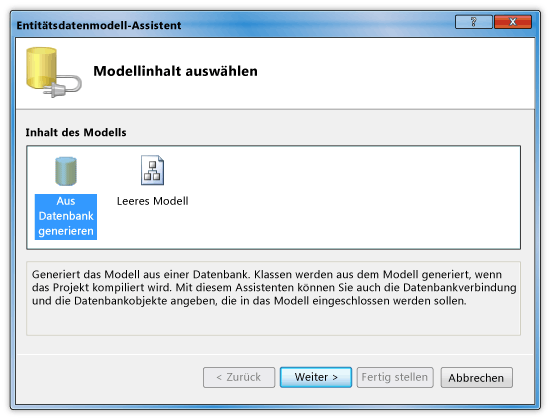
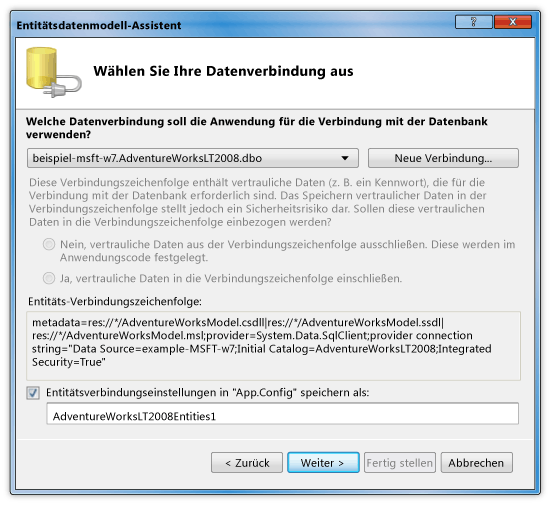

# Exemplarische Vorgehensweise: Anzeigen von Daten aus einer SQL Server-Datenbank in einem DataGrid-Steuerelement
In dieser exemplarischen Vorgehensweise können Sie auch Daten aus einer SQL Server-Datenbank abgerufen und Daten angezeigt werden, in einem <xref:System.Windows.Controls.DataGrid> Steuerelement. Sie verwenden das ADO.NET Entity Framework, um die Entitätsklassen erstellt wurden, die die Daten darstellen, und Verwenden von LINQ eine Abfrage schreiben, die die angegebenen Daten aus einer Entitätsklasse abruft.  
  
## Erforderliche Komponenten  
 Zum Durchführen dieser exemplarischen Vorgehensweise benötigen Sie die folgenden Komponenten:  
  
-   [!INCLUDE[vs_dev11_long](../../../../includes/vs-dev11-long-md.md)]  
  
-   Zugriff auf eine ausgeführte Instanz von SQL Server oder SQL Server Express, die AdventureWorks-Beispieldatenbank angefügt ist. Sie können die AdventureWorks-Datenbank aus der [GitHub](https://github.com/Microsoft/sql-server-samples/releases).  
  
### Erstellen von Entitätsklassen  
  
1.  Erstellen Sie in Visual Basic oder c# ein neues WPF-Anwendungsprojekt, und nennen Sie sie `DataGridSQLExample`.  
  
2.  Im Projektmappen-Explorer mit der Maustaste des Projekts, zeigen Sie auf **hinzufügen**, und wählen Sie dann **neues Element**.  
  
     Das Dialogfeld "Neues Element hinzufügen" angezeigt wird.  
  
3.  Wählen Sie im Bereich installierte Vorlagen **Daten** , und wählen Sie in der Liste der Vorlagen, **ADO.NET Entity Data Modus**l.  
  
       
  
4.  Nennen Sie die Datei `AdventureWorksModel.edmx` , und klicken Sie dann auf **hinzufügen**.  
  
     Der Assistent für Entity Data Model wird angezeigt.  
  
5.  Wählen Sie im Bildschirm Modellinhalt **aus Datenbank generieren** , und klicken Sie dann auf **Weiter**.  
  
       
  
6.  Geben Sie die Verbindung mit der Datenbank AdventureWorksLT2008, auf dem Bildschirm Wählen Sie Ihre Datenverbindung. Weitere Informationen finden Sie unter [wählen Sie Ihre Daten Verbindungsdialogfeld](http://go.microsoft.com/fwlink/?LinkId=160190).  
  
       
  
7.  Stellen Sie sicher, dass der Name `AdventureWorksLT2008Entities` und dass die **Entität Speichern der Verbindungseinstellungen in app.config-Datei als** Kontrollkästchen ausgewählt ist, und klicken Sie dann auf **Weiter**.  
  
8.  Klicken Sie im Bildschirm Datenbankobjekte auswählen, erweitern Sie den Knoten "Tabellen", und wählen die **Produkt** und **"ProductCategory"** Tabellen.  
  
     Sie können Entitätsklassen für alle Tabellen generieren; Allerdings rufen Sie in diesem Beispiel nur Daten aus diesen beiden Tabellen.  
  
       
  
9. Klicken Sie auf **Fertig stellen**.  
  
     Die Entitäten Product und ProductCategory sind im Entity Designer angezeigt.  
  
       
  
### Zum Abrufen und präsentieren der Daten  
  
1.  Öffnen Sie die Datei "MainWindow.xaml".  
  
2.  Legen Sie die <xref:System.Windows.FrameworkElement.Width%2A> Eigenschaft auf die <xref:System.Windows.Window> auf 450.  
  
3.  In der XAML-Editor, fügen Sie die folgenden <xref:System.Windows.Controls.DataGrid> -Tag zwischen der `<Grid>` und `</Grid>` von Tags zum Hinzufügen einer <xref:System.Windows.Controls.DataGrid> mit dem Namen `dataGrid1`.  
  
     [!code-xaml[DataGrid_SQL_EF_Walkthrough#3](../../../../samples/snippets/csharp/VS_Snippets_Wpf/DataGrid_SQL_EF_Walkthrough/CS/MainWindow.xaml#3)]  
  
       
  
4.  Wählen Sie das <xref:System.Windows.Window>-Steuerelement aus.  
  
5.  Im Fenster "Eigenschaften" oder XAML-Editor, erstellen Sie einen Ereignishandler für das <xref:System.Windows.Window> mit dem Namen `Window_Loaded` für die <xref:System.Windows.FrameworkElement.Loaded> Ereignis. Weitere Informationen finden Sie unter [Vorgehensweise: Erstellen einer einfachen Ereignishandler](http://msdn.microsoft.com/library/b1456e07-9dec-4354-99cf-18666b64f480).  
  
     Das folgende Beispiel zeigt die XAML für "MainWindow.xaml".  
  
    > [!NOTE]
    >  Ersetzen Sie bei Verwendung von Visual Basic, in der ersten Zeile von "MainWindow.xaml" `x:Class="DataGridSQLExample.MainWindow"` mit `x:Class="MainWindow"`.  
  
     [!code-xaml[DataGrid_SQL_EF_Walkthrough#1](../../../../samples/snippets/csharp/VS_Snippets_Wpf/DataGrid_SQL_EF_Walkthrough/CS/MainWindow.xaml#1)]  
  
6.  Öffnen Sie die Code-Behind-Datei ("MainWindow.Xaml.vb" bzw. "MainWindow.Xaml.cs") für die <xref:System.Windows.Window>.  
  
7.  Fügen Sie den folgenden Code aus, um nur bestimmte Werte aus den verknüpften Tabellen abzurufen, und legen Sie die <xref:System.Windows.Controls.ItemsControl.ItemsSource%2A> Eigenschaft der <xref:System.Windows.Controls.DataGrid> mit den Ergebnissen der Abfrage.  
  
     [!code-csharp[DataGrid_SQL_EF_Walkthrough#2](../../../../samples/snippets/csharp/VS_Snippets_Wpf/DataGrid_SQL_EF_Walkthrough/CS/MainWindow.xaml.cs#2)]
     [!code-vb[DataGrid_SQL_EF_Walkthrough#2](../../../../samples/snippets/visualbasic/VS_Snippets_Wpf/DataGrid_SQL_EF_Walkthrough/VB/MainWindow.xaml.vb#2)]  
  
8.  Führen Sie das Beispiel aus.  
  
     Daraufhin sollte eine <xref:System.Windows.Controls.DataGrid> , die Daten anzeigt.  
  
       
  
## Nächste Schritte  
  
## Siehe auch  
 <xref:System.Windows.Controls.DataGrid>  
 [Wie beginne I: mit Entity Framework in WPF-Anwendungen?](http://go.microsoft.com/fwlink/?LinkId=159868)
