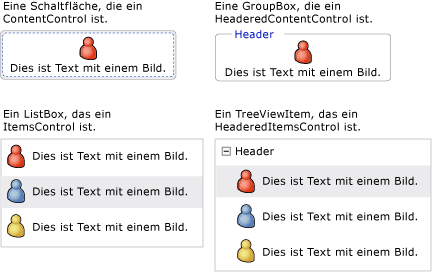
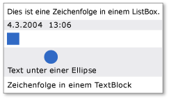

# WPF-Inhaltsmodell
[!INCLUDE[TLA#tla_winclient](../../../../includes/tlasharptla-winclient-md.md)] ist eine Präsentationsplattform, die viele Steuerelemente und steuerelementähnliche Typen enthält, deren Hauptaufgabe darin besteht, unterschiedliche Inhaltstypen anzuzeigen.  Um zu ermitteln, welches Steuerelement verwendet werden soll oder von welchem Steuerelement abgeleitet werden soll, sollten Sie mit den Arten von Objekten vertraut sein, die ein bestimmtes Steuerelement am besten anzeigen kann.  
  
 Dieses Thema fasst das Inhaltsmodell für [!INCLUDE[TLA2#tla_winclient](../../../../includes/tla2sharptla-winclient-md.md)]\-Steuerelement\- und steuerelementähnliche Typen zusammen.  Das Inhaltsmodell beschreibt, welcher Inhalt in einem Steuerelement verwendet werden kann. In diesem Thema sind auch die Inhaltseigenschaften für jedes Inhaltsmodell aufgeführt.  Eine Inhaltseigenschaft ist eine Eigenschaft, mit der der Inhalt des Objekts gespeichert werden kann.  
  
   
  
   
## Klassen, die beliebigen Inhalt enthalten  
 Einige Steuerelemente können ein Objekt irgendeines Typs enthalten, z. B. eine Zeichenfolge, ein <xref:System.DateTime>\-Objekt oder ein <xref:System.Windows.UIElement>, das ein Container für zusätzliche Elemente ist.  Eine <xref:System.Windows.Controls.Button> kann z. B. ein Bild und etwas Text enthalten; oder ein <xref:System.Windows.Controls.CheckBox> kann den Wert von <xref:System.DateTime.Now%2A?displayProperty=fullName> enthalten.  
  
 [!INCLUDE[TLA2#tla_winclient](../../../../includes/tla2sharptla-winclient-md.md)] verfügt über vier Klassen, die beliebigen Inhalt enthalten können.  In der folgenden Tabelle sind die Klassen aufgelistet, die von <xref:System.Windows.Controls.Control> erben.  
  
|Klasse, die beliebigen Inhalt enthält|Inhalt|  
|-------------------------------------------|------------|  
|<xref:System.Windows.Controls.ContentControl>|Ein einzelnes beliebiges Objekt.|  
|<xref:System.Windows.Controls.HeaderedContentControl>|Ein Header und ein einzelnes Element \- beides sind beliebige Objekte.|  
|<xref:System.Windows.Controls.ItemsControl>|Eine Auflistung von beliebigen Objekten.|  
|<xref:System.Windows.Controls.HeaderedItemsControl>|Ein Header und eine Auflistung von Elementen \- alle sind beliebige Objekte.|  
  
 Steuerelemente, die von diesen Klassen erben, können denselben Inhaltstyp enthalten und den Inhalt auf die gleiche Weise behandeln.  Die folgende Abbildung zeigt ein Steuerelement von den einzelnen Inhaltsmodellen an, das ein Bild und einigen Text enthält.  
  
   
  
### Steuerelemente, die ein einzelnes beliebiges Objekt enthalten  
 Die <xref:System.Windows.Controls.ContentControl>\-Klasse enthält beliebigen Inhalt.  Die Inhaltseigenschaft ist <xref:System.Windows.Controls.ContentControl.Content%2A>.  Die folgenden Steuerelemente erben von <xref:System.Windows.Controls.ContentControl> und verwenden sein Inhaltsmodell:  
  
-   <xref:System.Windows.Controls.Button>  
  
-   <xref:System.Windows.Controls.Primitives.ButtonBase>  
  
-   <xref:System.Windows.Controls.CheckBox>  
  
-   <xref:System.Windows.Controls.ComboBoxItem>  
  
-   <xref:System.Windows.Controls.ContentControl>  
  
-   <xref:System.Windows.Controls.Frame>  
  
-   <xref:System.Windows.Controls.GridViewColumnHeader>  
  
-   <xref:System.Windows.Controls.GroupItem>  
  
-   <xref:System.Windows.Controls.Label>  
  
-   <xref:System.Windows.Controls.ListBoxItem>  
  
-   <xref:System.Windows.Controls.ListViewItem>  
  
-   <xref:System.Windows.Navigation.NavigationWindow>  
  
-   <xref:System.Windows.Controls.RadioButton>  
  
-   <xref:System.Windows.Controls.Primitives.RepeatButton>  
  
-   <xref:System.Windows.Controls.ScrollViewer>  
  
-   <xref:System.Windows.Controls.Primitives.StatusBarItem>  
  
-   <xref:System.Windows.Controls.Primitives.ToggleButton>  
  
-   <xref:System.Windows.Controls.ToolTip>  
  
-   <xref:System.Windows.Controls.UserControl>  
  
-   <xref:System.Windows.Window>  
  
 In der folgenden Abbildung sind vier Schaltflächen dargestellt, deren <xref:System.Windows.Controls.ContentControl.Content%2A> auf eine Zeichenfolge, ein <xref:System.DateTime>\-Objekt, ein <xref:System.Windows.Shapes.Rectangle> und ein <xref:System.Windows.Controls.Panel> festgelegt wird, die eine <xref:System.Windows.Shapes.Ellipse> und einen <xref:System.Windows.Controls.TextBlock> enthalten.  
  
   
Vier Schaltflächen mit verschiedenen Inhaltstypen  
  
 Ein Beispiel für das Festlegen der <xref:System.Windows.Controls.ContentControl.Content%2A>\-Eigenschaft finden Sie unter <xref:System.Windows.Controls.ContentControl>.  
  
### Steuerelemente, die einen Header und ein einzelnes beliebiges Objekt enthalten  
 Die <xref:System.Windows.Controls.HeaderedContentControl>\-Klasse erbt von <xref:System.Windows.Controls.ContentControl> und zeigt Inhalt mit einem Header an.  Sie erbt die <xref:System.Windows.Controls.ContentControl.Content%2A>\-Inhaltseigenschaft von <xref:System.Windows.Controls.ContentControl> und definiert die <xref:System.Windows.Controls.HeaderedContentControl.Header%2A>\-Eigenschaft, die den <xref:System.Object>\-Typ aufweist. Daher können beide ein beliebiges Objekt sein.  
  
 Die folgenden Steuerelemente erben von <xref:System.Windows.Controls.HeaderedContentControl> und verwenden das entsprechende Inhaltsmodell:  
  
-   <xref:System.Windows.Controls.Expander>  
  
-   <xref:System.Windows.Controls.GroupBox>  
  
-   <xref:System.Windows.Controls.TabItem>  
  
 Die folgende Abbildung zeigt zwei <xref:System.Windows.Controls.TabItem>\-Objekte.  Das erste <xref:System.Windows.Controls.TabItem> hat <xref:System.Windows.UIElement>\-Objekte als <xref:System.Windows.Controls.HeaderedContentControl.Header%2A> und <xref:System.Windows.Controls.ContentControl.Content%2A>.  Der <xref:System.Windows.Controls.HeaderedContentControl.Header%2A> ist auf ein  <xref:System.Windows.Controls.StackPanel> festgelegt, das eine <xref:System.Windows.Shapes.Ellipse> und einen <xref:System.Windows.Controls.TextBlock> enthält.  Der <xref:System.Windows.Controls.ContentControl.Content%2A> ist auf ein  <xref:System.Windows.Controls.StackPanel> festgelegt, das eine <xref:System.Windows.Controls.TextBlock> und einen <xref:System.Windows.Controls.Label> enthält.  Das zweite <xref:System.Windows.Controls.TabItem> hat eine Zeichenfolge im <xref:System.Windows.Controls.HeaderedContentControl.Header%2A> und einen <xref:System.Windows.Controls.TextBlock> im <xref:System.Windows.Controls.ContentControl.Content%2A>.  
  
   
TabControl, der unterschiedliche Typen in der Header\-Eigenschaft verwendet  
  
 Ein Beispiel für die Erstellung von <xref:System.Windows.Controls.TabItem>\-Objekten finden Sie unter <xref:System.Windows.Controls.HeaderedContentControl>.  
  
### Steuerelemente, die eine Auflistung beliebiger Objekte enthalten  
 Die <xref:System.Windows.Controls.ItemsControl>\-Klasse erbt von <xref:System.Windows.Controls.Control> und kann mehrere Elemente enthalten, z. B. Zeichenfolgen, Objekte oder andere Elemente.  Die Inhaltseigenschaften sind <xref:System.Windows.Controls.ItemsControl.ItemsSource%2A> und <xref:System.Windows.Controls.ItemsControl.Items%2A>.  <xref:System.Windows.Controls.ItemsControl.ItemsSource%2A> wird in der Regel verwendet, um den <xref:System.Windows.Controls.ItemsControl> mit einer Datensammlung aufzufüllen.  Wenn Sie keine Sammlung verwende möchten, um das <xref:System.Windows.Controls.ItemsControl> aufzufüllen, können Sie mithilfe der <xref:System.Windows.Controls.ItemsControl.Items%2A>\-Eigenschaft Elemente hinzufügen.  
  
 Die folgenden Steuerelemente erben von <xref:System.Windows.Controls.ItemsControl> und verwenden sein Inhaltsmodell:  
  
-   <xref:System.Windows.Controls.Menu>  
  
-   <xref:System.Windows.Controls.Primitives.MenuBase>  
  
-   <xref:System.Windows.Controls.ContextMenu>  
  
-   <xref:System.Windows.Controls.ComboBox>  
  
-   <xref:System.Windows.Controls.ItemsControl>  
  
-   <xref:System.Windows.Controls.ListBox>  
  
-   <xref:System.Windows.Controls.ListView>  
  
-   <xref:System.Windows.Controls.TabControl>  
  
-   <xref:System.Windows.Controls.TreeView>  
  
-   <xref:System.Windows.Controls.Primitives.Selector>  
  
-   <xref:System.Windows.Controls.Primitives.StatusBar>  
  
 In der folgenden Abbildung wird ein <xref:System.Windows.Controls.ListBox> dargestellt, das die folgenden Elementtypen enthält.  
  
-   Eine Zeichenfolge.  
  
-   Ein <xref:System.DateTime>\-Objekt.  
  
-   Ein <xref:System.Windows.UIElement>.  
  
-   Ein <xref:System.Windows.Controls.Panel>, der eine <xref:System.Windows.Shapes.Ellipse> und einen <xref:System.Windows.Controls.TextBlock> enthält.  
  
   
Listenfeld, das mehrere Typen von Objekten enthält  
  
### Steuerelemente, die einen Header und eine Auflistung beliebiger Objekte enthalten  
 Die <xref:System.Windows.Controls.HeaderedItemsControl>\-Klasse erbt von <xref:System.Windows.Controls.ItemsControl> und kann mehrere Elemente enthalten, z. B. Zeichenfolgen, Objekte oder andere Elemente sowie eine Kopfzeile.  Sie erbt die <xref:System.Windows.Controls.ItemsControl>\-Inhaltseigenschaften, <xref:System.Windows.Controls.ItemsControl.ItemsSource%2A> und <xref:System.Windows.Controls.ItemsControl.Items%2A>, und definiert die <xref:System.Windows.Controls.HeaderedItemsControl.Header%2A>\-Eigenschaft, die ein beliebiges Objekt sein kann.  
  
 Die folgenden Steuerelemente erben von <xref:System.Windows.Controls.HeaderedItemsControl> und verwenden sein Inhaltsmodell:  
  
-   <xref:System.Windows.Controls.MenuItem>  
  
-   <xref:System.Windows.Controls.ToolBar>  
  
-   <xref:System.Windows.Controls.TreeViewItem>  
  
   
## Klassen, die eine Auflistung von UIElement\-Objekten enthalten  
 Die <xref:System.Windows.Controls.Panel>\-Klasse positioniert und ordnet untergeordnete <xref:System.Windows.UIElement>\-Objekte an.  Die Inhaltseigenschaft ist <xref:System.Windows.Controls.Panel.Children%2A>.  
  
 Die folgenden Klassen erben von der <xref:System.Windows.Controls.Panel>\-Klasse und verwenden ihr Inhaltsmodell:  
  
-   <xref:System.Windows.Controls.Canvas>  
  
-   <xref:System.Windows.Controls.DockPanel>  
  
-   <xref:System.Windows.Controls.Grid>  
  
-   <xref:System.Windows.Controls.Primitives.TabPanel>  
  
-   <xref:System.Windows.Controls.Primitives.ToolBarOverflowPanel>  
  
-   <xref:System.Windows.Controls.Primitives.ToolBarPanel>  
  
-   <xref:System.Windows.Controls.Primitives.UniformGrid>  
  
-   <xref:System.Windows.Controls.StackPanel>  
  
-   <xref:System.Windows.Controls.VirtualizingPanel>  
  
-   <xref:System.Windows.Controls.VirtualizingStackPanel>  
  
-   <xref:System.Windows.Controls.WrapPanel>  
  
 Weitere Informationen finden Sie unter [Übersicht über Panel\-Elemente](../../../../docs/framework/wpf/controls/panels-overview.md).  
  
   
## Klassen, die sich auf die Darstellung eines UI\-Elements auswirken  
 Die <xref:System.Windows.Controls.Decorator>\-Klasse wendet visuelle Effekte auf oder um ein einzelnes untergeordnetes <xref:System.Windows.UIElement> an.  Die Inhaltseigenschaft ist <xref:System.Windows.Controls.Decorator.Child%2A>.  Die folgenden Klassen erben von <xref:System.Windows.Controls.Decorator> und verwenden dessen  Inhaltsmodell:  
  
-   <xref:System.Windows.Documents.AdornerDecorator>  
  
-   <xref:System.Windows.Controls.Border>  
  
-   <xref:System.Windows.Controls.Primitives.BulletDecorator>  
  
-   <xref:Microsoft.Windows.Themes.ButtonChrome>  
  
-   <xref:Microsoft.Windows.Themes.ClassicBorderDecorator>  
  
-   <xref:System.Windows.Controls.InkPresenter>  
  
-   <xref:Microsoft.Windows.Themes.ListBoxChrome>  
  
-   <xref:Microsoft.Windows.Themes.SystemDropShadowChrome>  
  
-   <xref:System.Windows.Controls.Viewbox>  
  
 Die folgende Abbildung zeigt ein <xref:System.Windows.Controls.TextBox>, das mit einem umlaufenden <xref:System.Windows.Controls.Border>\-Element ergänzt wurde.  
  
   
Textblock mit einem Rahmen  
  
   
## Klassen, die Visual\-Feedback zu einem UI\-Element bereitstellen  
 Die <xref:System.Windows.Documents.Adorner>\-Klasse stellt einem Benutzer visuelle Hinweise bereit.  Verwenden Sie z. B. einen <xref:System.Windows.Documents.Adorner>, um Elementen funktionale Handles hinzuzufügen oder Zustandsinformationen zu einem Steuerelement bereitzustellen.  Die <xref:System.Windows.Documents.Adorner>\-Klasse stellt ein Framework bereit, damit Sie eigene Adorner erstellen können.  [!INCLUDE[TLA2#tla_winclient](../../../../includes/tla2sharptla-winclient-md.md)] stellt keine implementierten Adorner bereit.  Weitere Informationen finden Sie unter [Übersicht über Adorner](../../../../docs/framework/wpf/controls/adorners-overview.md).  
  
   
## Klassen, die Benutzern die Eingabe von Text ermöglichen  
 WPF stellt drei primäre Steuerelemente bereit, die Benutzern die Eingabe von Text ermöglichen.  Jedes Steuerelement zeigt den Text anders an.  In der folgenden Tabelle sind diese drei textbezogenen Steuerelemente aufgeführt sowie ihre Funktionen, wenn sie Text anzeigen, und ihre Eigenschaften, die den Text des Steuerelements enthalten.  
  
|Steuerelement|Text wird angezeigt als|Inhaltseigenschaft|  
|-------------------|-----------------------------|------------------------|  
|<xref:System.Windows.Controls.TextBox>|Nur\-Text|<xref:System.Windows.Controls.TextBox.Text%2A>|  
|<xref:System.Windows.Controls.RichTextBox>|Formatierter Text|<xref:System.Windows.Controls.RichTextBox.Document%2A>|  
|<xref:System.Windows.Controls.PasswordBox>|Ausgeblendeter Text \(Zeichen werden maskiert\)|<xref:System.Windows.Controls.PasswordBox.Password%2A>|  
  
   
## Klassen, die Ihren Text anzeigen  
 Mehrere Klassen können verwendet werden, um einfachen oder formatierten Text anzuzeigen.  Sie können kleine Mengen an Text mithilfe von <xref:System.Windows.Controls.TextBlock> anzeigen.  Wenn Sie große Textmengen anzeigen möchten, verwenden Sie die Steuerelemente <xref:System.Windows.Controls.FlowDocumentReader>, <xref:System.Windows.Controls.FlowDocumentPageViewer> oder <xref:System.Windows.Controls.FlowDocumentScrollViewer>.  
  
 Der <xref:System.Windows.Controls.TextBlock> verfügt über zwei Inhaltseigenschaften: <xref:System.Windows.Controls.TextBlock.Text%2A> und <xref:System.Windows.Controls.TextBlock.Inlines%2A>.  Wenn Sie Text anzeigen möchten, der eine einheitliche Formatierung verwendet, ist die <xref:System.Windows.Controls.TextBlock.Text%2A>\-Eigenschaft oft die beste Auswahl.  Wenn Sie im gesamten Text eine andere Formatierung verwenden möchten, verwenden Sie die <xref:System.Windows.Controls.TextBlock.Inlines%2A>\-Eigenschaft.  Die <xref:System.Windows.Controls.TextBlock.Inlines%2A>\-Eigenschaft ist eine Auflistung von <xref:System.Windows.Documents.Inline>\-Objekten, die angeben, wie Text formatiert werden soll.  
  
 In der folgenden Tabelle ist die Inhaltseigenschaft für <xref:System.Windows.Controls.FlowDocumentReader>\-, <xref:System.Windows.Controls.FlowDocumentPageViewer>\- und <xref:System.Windows.Controls.FlowDocumentScrollViewer>\-Klassen aufgeführt.  
  
|Steuerelement|Inhaltseigenschaft|Typ der Inhaltseigenschaft|  
|-------------------|------------------------|--------------------------------|  
|<xref:System.Windows.Controls.FlowDocumentPageViewer>|Document|<xref:System.Windows.Documents.IDocumentPaginatorSource>|  
|<xref:System.Windows.Controls.FlowDocumentReader>|Document|<xref:System.Windows.Documents.FlowDocument>|  
|<xref:System.Windows.Controls.FlowDocumentScrollViewer>|Document|<xref:System.Windows.Documents.FlowDocument>|  
  
 Das <xref:System.Windows.Documents.FlowDocument>\-Element implementiert die <xref:System.Windows.Documents.IDocumentPaginatorSource>\-Schnittstelle. Daher können alle drei Klassen ein <xref:System.Windows.Documents.FlowDocument>\-Element als Inhalt annehmen.  
  
   
## Klassen, die Ihren Text formatieren  
 Mit <xref:System.Windows.Documents.TextElement> und den zugehörigen Klassen können Sie Text formatieren.  <xref:System.Windows.Documents.TextElement>\-Objekte enthalten und formatieren Text in <xref:System.Windows.Controls.TextBlock>\- und <xref:System.Windows.Documents.FlowDocument>\-Objekten.  Die zwei primären Typen von <xref:System.Windows.Documents.TextElement>\-Objekten sind <xref:System.Windows.Documents.Block>\-Elemente und <xref:System.Windows.Documents.Inline>\-Elemente.  Ein <xref:System.Windows.Documents.Block>\-Element stellt einen Textblock dar, z. B. einen Absatz oder eine Liste.  Ein <xref:System.Windows.Documents.Inline>\-Element stellt einen Teil des Texts in einem Block dar.  Viele <xref:System.Windows.Documents.Inline>\-Klassen geben Formatierung für den Text an, auf den sie angewendet werden.  Jedes <xref:System.Windows.Documents.TextElement> hat ein eigenes Inhaltsmodell.  Weitere Informationen finden Sie unter [Übersicht über das TextElement\-Inhaltsmodell](../../../../docs/framework/wpf/advanced/textelement-content-model-overview.md).  
  
## Siehe auch  
 [Erweitert](../../../../docs/framework/wpf/advanced/index.md)