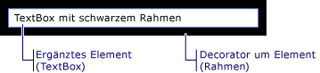

# WPF-Inhaltsmodell
[!INCLUDE[TLA#tla_winclient](../../../../includes/tlasharptla-winclient-md.md)] ist eine Präsentationsplattform, die viele Steuerelemente und steuerelementähnliche Typen bereitstellt, deren Hauptaufgabe in der Anzeige unterschiedlicher Inhaltstypen besteht. Um zu bestimmen, welches Steuerelement verwendet oder von welchem Steuerelement abgeleitet werden soll, sollten Sie mit den Objektarten vertraut sein, die ein bestimmtes Steuerelement am besten anzeigen können.  
  
 In diesem Thema wird das Inhaltsmodell für [!INCLUDE[TLA2#tla_winclient](../../../../includes/tla2sharptla-winclient-md.md)]-Steuerelemente und steuerelementähnliche Typen zusammengefasst. Das Inhaltsmodell beschreibt, welche Inhalte in einem Steuerelement verwendet werden können. In diesem Thema werden ebenfalls die Inhaltseigenschaften für jedes Inhaltsmodell aufgezählt. Eine Inhaltseigenschaft ist eine Eigenschaft, die zum Speichern des Inhalts des Objekts verwendet wird.  

## Klassen mit beliebigem Inhalt  
 Einige Steuerelemente können ein Objekt eines beliebigen Typs enthalten, z. B. eine Zeichenfolge, ein <xref:System.DateTime> Objekt oder ein <xref:System.Windows.UIElement> Container für zusätzliche Elemente. Ein <xref:System.Windows.Controls.Button> kann z. B. ein Bild und Text enthalten. oder <xref:System.Windows.Controls.CheckBox> a kann den <xref:System.DateTime.Now%2A?displayProperty=nameWithType>Wert von enthalten.  
  
 In [!INCLUDE[TLA2#tla_winclient](../../../../includes/tla2sharptla-winclient-md.md)] gibt es vier Klassen, die beliebigen Inhalt enthalten. In der folgenden Tabelle sind die <xref:System.Windows.Controls.Control>Klassen aufgeführt, die von erben.  
  
|Klassen mit beliebigem Inhalt|Inhalt|  
|-------------------------------------------|-------------|  
|<xref:System.Windows.Controls.ContentControl>|Ein einzelnes beliebiges Objekt|  
|<xref:System.Windows.Controls.HeaderedContentControl>|Ein Header und ein einzelnes Element, die beide beliebige Objekte sind|  
|<xref:System.Windows.Controls.ItemsControl>|Eine Auflistung beliebiger Objekte|  
|<xref:System.Windows.Controls.HeaderedItemsControl>|Ein Header und eine Auflistung von Elementen, die alle beliebige Objekte sind|  
  
 Steuerelemente, die von diesen Klassen erben, können dieselbe Art von Inhalt enthalten und den Inhalt auf die gleiche Weise behandeln. Die folgende Abbildung zeigt ein Steuerelement aus jedem Inhaltsmodell, das ein Bild und texteinen Text enthält:  
  
   
  
### Steuerelemente mit einem einzelnen beliebigen Objekt  
 Die <xref:System.Windows.Controls.ContentControl> Klasse enthält ein einzelnes Element beliebigen Inhalts. Seine Inhaltseigenschaft <xref:System.Windows.Controls.ContentControl.Content%2A>ist . Die folgenden Steuerelemente <xref:System.Windows.Controls.ContentControl> erben von und verwenden das Inhaltsmodell:  
  
- <xref:System.Windows.Controls.Button>  
  
- <xref:System.Windows.Controls.Primitives.ButtonBase>  
  
- <xref:System.Windows.Controls.CheckBox>  
  
- <xref:System.Windows.Controls.ComboBoxItem>  
  
- <xref:System.Windows.Controls.ContentControl>  
  
- <xref:System.Windows.Controls.Frame>  
  
- <xref:System.Windows.Controls.GridViewColumnHeader>  
  
- <xref:System.Windows.Controls.GroupItem>  
  
- <xref:System.Windows.Controls.Label>  
  
- <xref:System.Windows.Controls.ListBoxItem>  
  
- <xref:System.Windows.Controls.ListViewItem>  
  
- <xref:System.Windows.Navigation.NavigationWindow>  
  
- <xref:System.Windows.Controls.RadioButton>  
  
- <xref:System.Windows.Controls.Primitives.RepeatButton>  
  
- <xref:System.Windows.Controls.ScrollViewer>  
  
- <xref:System.Windows.Controls.Primitives.StatusBarItem>  
  
- <xref:System.Windows.Controls.Primitives.ToggleButton>  
  
- <xref:System.Windows.Controls.ToolTip>  
  
- <xref:System.Windows.Controls.UserControl>  
  
- <xref:System.Windows.Window>  
  
 Die folgende Abbildung zeigt <xref:System.Windows.Controls.ContentControl.Content%2A> vier Schaltflächen, <xref:System.DateTime> deren <xref:System.Windows.Shapes.Rectangle>Einstellung auf <xref:System.Windows.Controls.Panel> eine <xref:System.Windows.Shapes.Ellipse> Zeichenfolge, <xref:System.Windows.Controls.TextBlock>ein Objekt, ein und eine, die eine und eine enthalten:  
  
   
  
 Ein Beispiel zum Festlegen <xref:System.Windows.Controls.ContentControl.Content%2A> der Eigenschaft <xref:System.Windows.Controls.ContentControl>finden Sie unter .  
  
### Steuerelemente mit einem Header und einzelnen beliebigen Objekt  
 Die <xref:System.Windows.Controls.HeaderedContentControl> Klasse erbt <xref:System.Windows.Controls.ContentControl> von und zeigt Inhalte mit einem Header an. Erbt die content-Eigenschaft <xref:System.Windows.Controls.ContentControl.Content%2A>, <xref:System.Windows.Controls.ContentControl> von und <xref:System.Windows.Controls.HeaderedContentControl.Header%2A> definiert die <xref:System.Object>Eigenschaft vom Typ ; Daher können beide ein beliebiges Objekt sein.  
  
 Die folgenden Steuerelemente <xref:System.Windows.Controls.HeaderedContentControl> erben von und verwenden das Inhaltsmodell:  
  
- <xref:System.Windows.Controls.Expander>  
  
- <xref:System.Windows.Controls.GroupBox>  
  
- <xref:System.Windows.Controls.TabItem>  
  
 Die folgende Abbildung <xref:System.Windows.Controls.TabItem> zeigt zwei Objekte. Die <xref:System.Windows.Controls.TabItem> erste <xref:System.Windows.UIElement> hat <xref:System.Windows.Controls.HeaderedContentControl.Header%2A> Objekte <xref:System.Windows.Controls.ContentControl.Content%2A>als und die . Der <xref:System.Windows.Controls.HeaderedContentControl.Header%2A> ist auf <xref:System.Windows.Controls.StackPanel> eine <xref:System.Windows.Shapes.Ellipse> festgelegt, <xref:System.Windows.Controls.TextBlock>die eine und eine enthält. Der <xref:System.Windows.Controls.ContentControl.Content%2A> ist auf <xref:System.Windows.Controls.StackPanel> eine <xref:System.Windows.Controls.TextBlock> festgelegt, <xref:System.Windows.Controls.Label>die eine und eine enthält. Die <xref:System.Windows.Controls.TabItem> zweite hat eine <xref:System.Windows.Controls.HeaderedContentControl.Header%2A> Zeichenfolge <xref:System.Windows.Controls.TextBlock> in <xref:System.Windows.Controls.ContentControl.Content%2A>der und eine in .  
  
   
  
 Ein Beispiel zum Erstellen <xref:System.Windows.Controls.TabItem> von <xref:System.Windows.Controls.HeaderedContentControl>Objekten finden Sie unter .  
  
### Steuerelemente mit einer Auflistung von beliebigen Objekten  
 Die <xref:System.Windows.Controls.ItemsControl> Klasse erbt <xref:System.Windows.Controls.Control> von mehreren Elementen, z. B. Zeichenfolgen, Objekten oder anderen Elementen, und kann sie enthalten. Seine Inhaltseigenschaften <xref:System.Windows.Controls.ItemsControl.ItemsSource%2A> <xref:System.Windows.Controls.ItemsControl.Items%2A>sind und . <xref:System.Windows.Controls.ItemsControl.ItemsSource%2A>wird in der Regel <xref:System.Windows.Controls.ItemsControl> verwendet, um die mit einer Datensammlung aufzufüllen. Wenn Sie keine Auflistung zum Auffüllen der <xref:System.Windows.Controls.ItemsControl>verwenden möchten, können <xref:System.Windows.Controls.ItemsControl.Items%2A> Sie Elemente mithilfe der Eigenschaft hinzufügen.  
  
 Die folgenden Steuerelemente <xref:System.Windows.Controls.ItemsControl> erben von und verwenden das Inhaltsmodell:  
  
- <xref:System.Windows.Controls.Menu>  
  
- <xref:System.Windows.Controls.Primitives.MenuBase>  
  
- <xref:System.Windows.Controls.ContextMenu>  
  
- <xref:System.Windows.Controls.ComboBox>  
  
- <xref:System.Windows.Controls.ItemsControl>  
  
- <xref:System.Windows.Controls.ListBox>  
  
- <xref:System.Windows.Controls.ListView>  
  
- <xref:System.Windows.Controls.TabControl>  
  
- <xref:System.Windows.Controls.TreeView>  
  
- <xref:System.Windows.Controls.Primitives.Selector>  
  
- <xref:System.Windows.Controls.Primitives.StatusBar>  
  
 Die folgende Abbildung <xref:System.Windows.Controls.ListBox> zeigt eine, die diese Arten von Elementen enthält:  
  
- Eine Zeichenfolge.  
  
- Ein <xref:System.DateTime> -Objekt.  
  
- Ein <xref:System.Windows.UIElement>.  
  
- A, <xref:System.Windows.Controls.Panel> das <xref:System.Windows.Shapes.Ellipse> eine <xref:System.Windows.Controls.TextBlock>und eine enthält.  
  
   
  
### Steuerelemente mit einem Header und einer Auflistung von beliebigen Objekten  
 Die <xref:System.Windows.Controls.HeaderedItemsControl> Klasse erbt <xref:System.Windows.Controls.ItemsControl> von mehreren Elementen, z. B. Zeichenfolgen, Objekten oder anderen Elementen, und kann mehrere Elemente enthalten. <xref:System.Windows.Controls.ItemsControl> Erbt die Inhaltseigenschaften <xref:System.Windows.Controls.ItemsControl.ItemsSource%2A>, <xref:System.Windows.Controls.ItemsControl.Items%2A>und , und <xref:System.Windows.Controls.HeaderedItemsControl.Header%2A> es definiert die Eigenschaft, die ein beliebiges Objekt sein kann.  
  
 Die folgenden Steuerelemente <xref:System.Windows.Controls.HeaderedItemsControl> erben von und verwenden das Inhaltsmodell:  
  
- <xref:System.Windows.Controls.MenuItem>  
  
- <xref:System.Windows.Controls.ToolBar>  
  
- <xref:System.Windows.Controls.TreeViewItem>  
  

## Klassen mit einer Auflistung von UIElement-Objekten  
 Die <xref:System.Windows.Controls.Panel> Klasse positioniert und <xref:System.Windows.UIElement> ordnet untergeordnete Objekte an. Seine Inhaltseigenschaft <xref:System.Windows.Controls.Panel.Children%2A>ist .  
  
 Die folgenden Klassen erben <xref:System.Windows.Controls.Panel> von der Klasse und verwenden ihr Inhaltsmodell:  
  
- <xref:System.Windows.Controls.Canvas>  
  
- <xref:System.Windows.Controls.DockPanel>  
  
- <xref:System.Windows.Controls.Grid>  
  
- <xref:System.Windows.Controls.Primitives.TabPanel>  
  
- <xref:System.Windows.Controls.Primitives.ToolBarOverflowPanel>  
  
- <xref:System.Windows.Controls.Primitives.ToolBarPanel>  
  
- <xref:System.Windows.Controls.Primitives.UniformGrid>  
  
- <xref:System.Windows.Controls.StackPanel>  
  
- <xref:System.Windows.Controls.VirtualizingPanel>  
  
- <xref:System.Windows.Controls.VirtualizingStackPanel>  
  
- <xref:System.Windows.Controls.WrapPanel>  
  
 Weitere Informationen finden Sie unter [Übersicht über Panel-Elemente](panels-overview.md).  
  

## Klassen, die sich auf die Anzeige eines UIElement-Objekts auswirken  
 Die <xref:System.Windows.Controls.Decorator> Klasse wendet visuelle Effekte auf <xref:System.Windows.UIElement>oder um ein einzelnes Kind an. Seine Inhaltseigenschaft <xref:System.Windows.Controls.Decorator.Child%2A>ist . Die folgenden Klassen erben <xref:System.Windows.Controls.Decorator> von und verwenden das Inhaltsmodell:  
  
- <xref:System.Windows.Documents.AdornerDecorator>  
  
- <xref:System.Windows.Controls.Border>  
  
- <xref:System.Windows.Controls.Primitives.BulletDecorator>  
  
- <xref:Microsoft.Windows.Themes.ButtonChrome>  
  
- <xref:Microsoft.Windows.Themes.ClassicBorderDecorator>  
  
- <xref:System.Windows.Controls.InkPresenter>  
  
- <xref:Microsoft.Windows.Themes.ListBoxChrome>  
  
- <xref:Microsoft.Windows.Themes.SystemDropShadowChrome>  
  
- <xref:System.Windows.Controls.Viewbox>  
  
 Die folgende Abbildung <xref:System.Windows.Controls.TextBox> zeigt eine, die <xref:System.Windows.Controls.Border> eine um ihn herum hat (mit ihr verziert ist).  
  
   
Textfeld mit einem Rahmen  
  

## Klassen, die visuelles Feedback zu einem UIElement bereitstellen  
 Die <xref:System.Windows.Documents.Adorner> Klasse stellt visuelle Hinweise für einen Benutzer bereit. Verwenden Sie z. B. eine, <xref:System.Windows.Documents.Adorner> um Elementen funktionale Handles hinzuzufügen oder Statusinformationen zu einem Steuerelement bereitzustellen. Die <xref:System.Windows.Documents.Adorner> Klasse stellt ein Framework bereit, sodass Sie eigene Adorner erstellen können. [!INCLUDE[TLA2#tla_winclient](../../../../includes/tla2sharptla-winclient-md.md)] stellt keine implementierten Adorner bereit. Weitere Informationen finden Sie unter [Übersicht über Adorner](adorners-overview.md).  
  

## Klassen, mit denen Benutzer Text eingeben können  
 WPF bietet drei primäre Steuerelemente, mit denen Benutzer Text eingeben können. Jedes Steuerelement zeigt den Text unterschiedlich an. Die folgende Tabelle enthält diese drei textbezogene Steuerelemente, ihre Funktionen bei der Textanzeige und ihre Eigenschaften, die den Text des Steuerelements enthalten.  
  
|Control|Text wird angezeigt als|Inhaltseigenschaft|  
|-------------|--------------------------|----------------------|  
|<xref:System.Windows.Controls.TextBox>|Nur-Text|<xref:System.Windows.Controls.TextBox.Text%2A>|  
|<xref:System.Windows.Controls.RichTextBox>|Formatierter Text|<xref:System.Windows.Controls.RichTextBox.Document%2A>|  
|<xref:System.Windows.Controls.PasswordBox>|Ausgeblendeter Text (Zeichen werden maskiert)|<xref:System.Windows.Controls.PasswordBox.Password%2A>|  
  

## Klassen, die Ihren Text anzeigen  
 Es können mehrere Klassen verwendet werden, um einfachen oder formatierten Text anzuzeigen. Sie können <xref:System.Windows.Controls.TextBlock> kleine Textmengen anzeigen. Wenn Sie große Textmengen anzeigen möchten, verwenden Sie die <xref:System.Windows.Controls.FlowDocumentReader>Steuerelemente , <xref:System.Windows.Controls.FlowDocumentPageViewer>oder <xref:System.Windows.Controls.FlowDocumentScrollViewer> Steuerelemente.  
  
 Der <xref:System.Windows.Controls.TextBlock> hat zwei <xref:System.Windows.Controls.TextBlock.Text%2A> Inhaltseigenschaften: und <xref:System.Windows.Controls.TextBlock.Inlines%2A>. Wenn Sie Text anzeigen möchten, der <xref:System.Windows.Controls.TextBlock.Text%2A> konsistente Formatierung verwendet, ist die Eigenschaft häufig die beste Wahl. Wenn Sie beabsichtigen, im gesamten Text <xref:System.Windows.Controls.TextBlock.Inlines%2A> unterschiedliche Formatierungen zu verwenden, verwenden Sie die Eigenschaft. Die <xref:System.Windows.Controls.TextBlock.Inlines%2A> Eigenschaft ist <xref:System.Windows.Documents.Inline> eine Auflistung von Objekten, die angeben, wie Text formatiert werden soll.  
  
 In der folgenden Tabelle <xref:System.Windows.Controls.FlowDocumentReader>sind <xref:System.Windows.Controls.FlowDocumentPageViewer>die <xref:System.Windows.Controls.FlowDocumentScrollViewer> Inhaltseigenschaft für , und Klassen aufgeführt.  
  
|Control|Inhaltseigenschaft|Inhaltseigenschaftstyp|  
|-------------|----------------------|---------------------------|  
|<xref:System.Windows.Controls.FlowDocumentPageViewer>|Dokument|<xref:System.Windows.Documents.IDocumentPaginatorSource>|  
|<xref:System.Windows.Controls.FlowDocumentReader>|Dokument|<xref:System.Windows.Documents.FlowDocument>|  
|<xref:System.Windows.Controls.FlowDocumentScrollViewer>|Dokument|<xref:System.Windows.Documents.FlowDocument>|  
  
 Der <xref:System.Windows.Documents.FlowDocument> implementiert <xref:System.Windows.Documents.IDocumentPaginatorSource> die Schnittstelle; Daher können alle drei <xref:System.Windows.Documents.FlowDocument> Klassen einen als Inhalt annehmen.  
  

## Klassen, die den Text formatieren  
 <xref:System.Windows.Documents.TextElement>und die zugehörigen Klassen ermöglichen es Ihnen, Text zu formatieren. <xref:System.Windows.Documents.TextElement>Objekte enthalten und <xref:System.Windows.Controls.TextBlock> formatieren Text in und <xref:System.Windows.Documents.FlowDocument> Objekte. Die beiden primären <xref:System.Windows.Documents.TextElement> Objekttypen <xref:System.Windows.Documents.Block> <xref:System.Windows.Documents.Inline> sind Elemente und Elemente. Ein <xref:System.Windows.Documents.Block> Element stellt einen Textblock dar, z. B. einen Absatz oder eine Liste. Ein <xref:System.Windows.Documents.Inline> Element stellt einen Teil des Textes in einem Block dar. Viele <xref:System.Windows.Documents.Inline> Klassen geben die Formatierung des Texts an, auf den sie angewendet werden. Jedes <xref:System.Windows.Documents.TextElement> hat sein eigenes Inhaltsmodell. Weitere Informationen finden Sie unter [Übersicht über das TextElement-Inhaltsmodell](../advanced/textelement-content-model-overview.md).  
  
## Weitere Informationen

- [Erweitert](../advanced/index.md)
