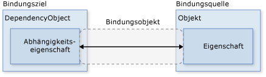
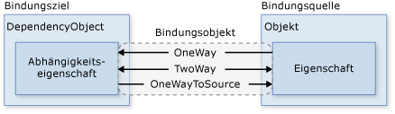
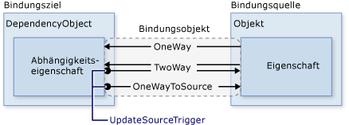
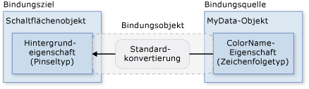
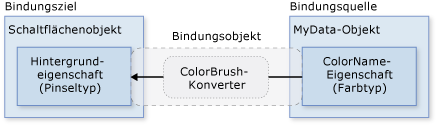
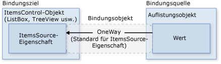

# &#220;bersicht &#252;ber Datenbindung
Die [!INCLUDE[TLA#tla_winclient](../../../../includes/tlasharptla-winclient-md.md)]\-Datenbindung bietet für Anwendungen eine einfache und konsistente Möglichkeit, Daten darzustellen und mit ihnen zu interagieren.  Elemente können an Daten aus einer Vielzahl von Datenquellen in Form von [!INCLUDE[TLA#tla_clr](../../../../includes/tlasharptla-clr-md.md)]\-Objekten und [!INCLUDE[TLA#tla_xml](../../../../includes/tlasharptla-xml-md.md)] gebunden werden.  <xref:System.Windows.Controls.ContentControl> wie <xref:System.Windows.Controls.Button> und <xref:System.Windows.Controls.ItemsControl> wie <xref:System.Windows.Controls.ListBox> und <xref:System.Windows.Controls.ListView> verfügen über integrierte Funktionen, die eine flexible Formatierung von einzelnen Datenelementen oder Auflistungen von Datenelementen ermöglichen.  Sortier\-, Filter\- und Gruppenansichten können übergreifend für die Daten generiert werden.  
  
 Die Datenbindungsfunktionen in [!INCLUDE[TLA2#tla_winclient](../../../../includes/tla2sharptla-winclient-md.md)] bieten gegenüber herkömmlichen Modellen einige Vorteile. Dazu zählen eine Reihe von Eigenschaften, die Datenbindung grundsätzlich unterstützen, eine flexible Darstellung von Daten auf einer [!INCLUDE[TLA2#tla_ui](../../../../includes/tla2sharptla-ui-md.md)] sowie die klare Trennung zwischen Geschäftslogik und [!INCLUDE[TLA2#tla_ui](../../../../includes/tla2sharptla-ui-md.md)].  
  
 In diesem Thema werden zunächst die grundlegenden Konzepte der [!INCLUDE[TLA2#tla_winclient](../../../../includes/tla2sharptla-winclient-md.md)]\-Datenbindung erläutert, und anschließend wird auf die Verwendung der <xref:System.Windows.Data.Binding>\-Klasse und anderer Datenbindungsfunktionen eingegangen.  
  
   
  
<a name="what_is_data_binding"></a>   
## Was ist Datenbindung?  
 Durch Datenbindung wird eine Verbindung zwischen der [!INCLUDE[TLA2#tla_ui](../../../../includes/tla2sharptla-ui-md.md)] der Anwendung und der Geschäftslogik hergestellt.  Wenn die Bindung über die korrekten Einstellungen verfügt und die Daten die richtigen Benachrichtigungen bereitstellen, ändern sich die an die Daten gebundenen Elemente automatisch bei jeder Änderung des Werts der Daten, sodass die Änderungen entsprechend wiedergegeben werden.  Datenbindung kann auch bedeuten, dass bei einer Änderung der äußeren Darstellung von Daten in einem Element die zugrunde liegenden Daten automatisch aktualisiert werden können, um die Änderung wiederzugeben.  Wenn der Benutzer beispielsweise den Wert in einem <xref:System.Windows.Controls.TextBox>\-Element bearbeitet, wird der zugrunde liegende Datenwert automatisch aktualisiert, um diese Änderung anzuzeigen.  
  
 Eine typische Verwendung der Datenbindung wäre, die auf einem Server oder lokal gespeicherten Konfigurationsdaten in Formulare oder andere Steuerelemente der [!INCLUDE[TLA2#tla_ui](../../../../includes/tla2sharptla-ui-md.md)] einzufügen.  In [!INCLUDE[TLA2#tla_winclient](../../../../includes/tla2sharptla-winclient-md.md)] wird dieses Konzept dahingehend erweitert, dass auch eine Vielzahl von Eigenschaften an die unterschiedlichsten Datenquellen gebunden werden können.  In [!INCLUDE[TLA2#tla_winclient](../../../../includes/tla2sharptla-winclient-md.md)] können [Abhängigkeitseigenschaften](GTMT) von Elementen an [!INCLUDE[TLA2#tla_clr](../../../../includes/tla2sharptla-clr-md.md)]\-Objekte \(einschließlich [!INCLUDE[TLA#tla_adonet](../../../../includes/tlasharptla-adonet-md.md)]\-Objekte oder Objekte, die Webdiensten und Webeigenschaften zugeordnet sind\) und [!INCLUDE[TLA2#tla_xml](../../../../includes/tla2sharptla-xml-md.md)]\-Daten gebunden werden.  
  
 Ein Beispiel für eine Datenbindung finden Sie in der folgenden Anwendung [!INCLUDE[TLA2#tla_ui](../../../../includes/tla2sharptla-ui-md.md)] in der [Demo für die Datenbindung](http://go.microsoft.com/fwlink/?LinkID=163703):  
  
   
  
 Oben sehen Sie die [!INCLUDE[TLA2#tla_ui](../../../../includes/tla2sharptla-ui-md.md)] einer Anwendung, die eine Liste von Auktionselementen anzeigt.  Die Anwendung veranschaulicht die folgenden Datenbindungsfunktionen:  
  
-   Der Inhalt von <xref:System.Windows.Controls.ListBox> ist an eine Auflistung von *AuctionItem*\-Objekten gebunden.  Ein *AuctionItem*\-Objekt verfügt über Eigenschaften wie *Description*, *StartPrice*, *StartDate*, *Category*, *SpecialFeatures* usw.  
  
-   Die Daten \(*AuctionItem*\-Objekte\), die in <xref:System.Windows.Controls.ListBox> angezeigt werden, sind vorlagenbasiert, sodass für jedes Element Beschreibung und aktueller Preis zu sehen sind.  Zu diesem Zweck wird <xref:System.Windows.DataTemplate> verwendet.  Darüber hinaus hängt die Darstellung jedes Elements vom *SpecialFeatures*\-Wert des angezeigten *AuctionItem* ab.  Wenn der *SpecialFeatures*\-Wert von *AuctionItem* *Color* ist, hat das Element einen blauen Rahmen.  Wenn der Wert *Highlight* ist, hat das Element einen orangefarbenen Rahmen und einen Stern.  Im Abschnitt [Datenvorlagen](#data_templating) erhalten Sie weitere Informationen über Datenvorlagen.  
  
-   Der Benutzer kann die Daten mithilfe der bereitgestellten <xref:System.Windows.Controls.CheckBox> gruppieren, filtern oder sortieren.  Im oben gezeigten Bild sind die beiden Kontrollkästchen \(<xref:System.Windows.Controls.CheckBox>\) "Group by category" und "Sort by category and date" aktiviert.  Möglicherweise haben Sie bereits bemerkt, dass die Daten nach der Kategorie des Produkts gruppiert sind und der Name der Kategorie in alphabetischer Reihenfolge aufgeführt ist.  Im Bild ist nicht so gut zu erkennen, dass auch die Elemente innerhalb der einzelnen Kategorien nach Startdatum sortiert sind.  Dazu wird eine *Auflistungsansicht* verwendet.  Im Abschnitt [Binden an Auflistungen](#binding_to_collections) werden Auflistungsansichten erläutert.  
  
-   Wenn der Benutzer ein Element auswählt, werden in <xref:System.Windows.Controls.ContentControl> die Einzelheiten zum ausgewählten Element angezeigt.  Dies wird als *Master\/Detail\-Szenario* bezeichnet.  Im Abschnitt [Master\/Detail\-Szenario](#master_detail_scenario) erhalten Sie Informationen über diesen Bindungsszenariotyp.  
  
-   Der Typ der *StartDate*\-Eigenschaft ist <xref:System.DateTime>, wodurch ein Datum mit der Zeit bis auf die Millisekunde genau zurückgegeben wird.  In dieser Anwendung wurde ein benutzerdefinierter Konverter verwendet, damit eine kürzere Datumszeichenfolge angezeigt wird.  Weitere Informationen zu Konvertern finden Sie im Abschnitt [Datenkonvertierung](#data_conversion).  
  
 Wenn der Benutzer auf die Schaltfläche *Add Product* klickt, wird das folgende Formular aufgerufen:  
  
   
  
 Der Benutzer kann die Felder im Formular bearbeiten, die Produktauflistung in der Kurzvorschau und in den detaillierteren Vorschaufenstern anzeigen und dann auf *submit* klicken, um die neue Produktauflistung hinzuzufügen.  Alle vorhandenen Gruppierungs\-, Filter\- und Sortierfunktionen werden auf den neuen Eintrag angewendet.  In diesem speziellen Fall wird das im obigen Bild eingegebene Element in der Kategorie *Computer* an zweiter Stelle angezeigt.  
  
 Was in diesem Bild nicht angezeigt wird, ist die in der <xref:System.Windows.Controls.TextBox> *Start Date* bereitgestellte Validierungslogik.  Wenn der Benutzer ein ungültiges Datum eingibt \(mit ungültiger Formatierung oder einem vergangenen Datum\), wird er durch einen <xref:System.Windows.Controls.ToolTip> und ein rotes Ausrufezeichen neben <xref:System.Windows.Controls.TextBox> benachrichtigt.  Im Abschnitt [Datenvalidierung](#data_validation) wird näher auf das Erstellen von Validierungslogik eingegangen.  
  
 Bevor die oben genannten unterschiedlichen Datenbindungsfunktionen näher erläutert werden, werden im nächsten Abschnitt die grundlegenden Konzepte erläutert, die für ein Verständnis der [!INCLUDE[TLA2#tla_winclient](../../../../includes/tla2sharptla-winclient-md.md)]\-Datenbindung unerlässlich sind.  
  
<a name="basic_data_binding_concepts"></a>   
## Grundlegende Konzepte zur Datenbindung  
   
  
 Unabhängig davon, was für ein Element Sie binden und welcher Art die Datenquelle ist, geschieht die Bindung immer nach dem in der folgenden Abbildung gezeigten Modell:  
  
   
  
 Wie in der Abbildung dargestellt, ist Datenbindung die Brücke zwischen dem [Bindungsziel](GTMT) und der [Bindungsquelle](GTMT).  Die Abbildung veranschaulicht die folgenden grundlegenden Konzepte der [!INCLUDE[TLA2#tla_winclient](../../../../includes/tla2sharptla-winclient-md.md)]\-Datenbindung:  
  
-   Eine Bindung besteht in der Regel aus diesen vier Komponenten: einem [Bindungszielobjekt](GTMT), einer Zieleigenschaft, einer [Bindungsquelle](GTMT) sowie einem Pfad zum Wert in der [Bindungsquelle](GTMT), die verwendet werden soll.  Angenommen, Sie möchten den Inhalt von <xref:System.Windows.Controls.TextBox> an die *Name*\-Eigenschaft eines *Employee*\-Objekts binden, dann ist Ihr Zielobjekt <xref:System.Windows.Controls.TextBox>, die Zieleigenschaft die <xref:System.Windows.Controls.TextBox.Text%2A>\-Eigenschaft, der zu verwendende Wert *Name* und das Quellobjekt das *Employee*\-Objekt.  
  
-   Die Zieleigenschaft muss eine [Abhängigkeitseigenschaft](GTMT) sein.  Die meisten <xref:System.Windows.UIElement>\-Eigenschaften sind [Abhängigkeitseigenschaften](GTMT), und die meisten [Abhängigkeitseigenschaften](GTMT), mit Ausnahme der schreibgeschützten, unterstützen die Datenbindung standardmäßig.  \(Lediglich <xref:System.Windows.DependencyObject>\-Typen können [Abhängigkeitseigenschaften](GTMT) definieren, und jedes <xref:System.Windows.UIElement> wird von <xref:System.Windows.DependencyObject> abgeleitet.\)  
  
-   Obwohl nicht in der Abbildung angegeben, sollte beachtet werden, dass das [Bindungsquellen](GTMT)\-Objekt nicht darauf beschränkt ist, als benutzerdefiniertes [!INCLUDE[TLA2#tla_clr](../../../../includes/tla2sharptla-clr-md.md)]\-Objekt zu fungieren.  Die [!INCLUDE[TLA2#tla_winclient](../../../../includes/tla2sharptla-winclient-md.md)]\-Datenbindung unterstützt Daten in Form von [!INCLUDE[TLA2#tla_clr](../../../../includes/tla2sharptla-clr-md.md)]\-Objekten und [!INCLUDE[TLA2#tla_xml](../../../../includes/tla2sharptla-xml-md.md)].  So könnte es sich bei Ihrer Bindungsquelle um <xref:System.Windows.UIElement> handeln, ein beliebiges Listenobjekt, ein [!INCLUDE[TLA2#tla_clr](../../../../includes/tla2sharptla-clr-md.md)]\-Objekt, das [!INCLUDE[TLA#tla_adonet](../../../../includes/tlasharptla-adonet-md.md)]\-Daten oder \-Webdiensten zugeordnet ist, oder um einen XmlNode, der Ihre [!INCLUDE[TLA2#tla_xml](../../../../includes/tla2sharptla-xml-md.md)]\-Daten enthält.  Weitere Informationen finden Sie unter [Übersicht über Bindungsquellen](../../../../docs/framework/wpf/data/binding-sources-overview.md).  
  
 Beim Lesen anderer [!INCLUDE[TLA#tla_sdk](../../../../includes/tlasharptla-sdk-md.md)]\-Themen sollten Sie daran denken, dass Sie beim Einrichten einer Bindung ein [Bindungsziel](GTMT) *an* eine [Bindungsquelle](GTMT) binden.  Wenn Sie z. B. zugrunde liegende [!INCLUDE[TLA2#tla_xml](../../../../includes/tla2sharptla-xml-md.md)]\-Daten mithilfe der Datenbindung in <xref:System.Windows.Controls.ListBox> anzeigen, binden Sie <xref:System.Windows.Controls.ListBox> an die [!INCLUDE[TLA2#tla_xml](../../../../includes/tla2sharptla-xml-md.md)]\-Daten.  
  
 Zum Einrichten einer Bindung verwenden Sie das <xref:System.Windows.Data.Binding>\-Objekt.  Im weiteren Verlauf dieses Themas werden zahlreiche Konzepte zum <xref:System.Windows.Data.Binding>\-Objekt, einige Eigenschaften und dessen Verwendung erläutert.  
  
<a name="direction_of_data_flow"></a>   
### Richtung des Datenflusses  
 Wie bereits erwähnt und durch den Pfeil in der Abbildung oben gezeigt, kann der Datenfluss einer Bindung vom [Bindungsziel](GTMT) zur [Bindungsquelle](GTMT) verlaufen \(z. B. ändert sich der Quellwert, wenn ein Benutzer den Wert von <xref:System.Windows.Controls.TextBox> bearbeitet\) und\/oder von der [Bindungsquelle](GTMT) zum [Bindungsziel](GTMT) \(z. B. wenn der <xref:System.Windows.Controls.TextBox>\-Inhalt durch Änderungen in der [Bindungsquelle](GTMT) aktualisiert wird\), wenn die Bindungsquelle die entsprechenden Benachrichtigungen bereitstellt.  
  
 Sie können die Anwendung so einrichten, dass Benutzer die Daten ändern und zurück an das Quellobjekt übertragen können.  Sie können auch das Aktualisieren von Quelldaten durch Benutzer unterbinden.  Legen Sie dazu die <xref:System.Windows.Data.Binding.Mode%2A>\-Eigenschaft des <xref:System.Windows.Data.Binding>\-Objekts fest.  In der folgenden Abbildung werden die unterschiedlichen Datenflusstypen veranschaulicht:  
  
   
  
-   <xref:System.Windows.Data.BindingMode>\-Bindung bewirkt, dass bei Änderungen an der Quelleigenschaft die Zieleigenschaft automatisch aktualisiert wird, ohne dass Änderungen an der Zieleigenschaft an die Quelleigenschaft zurückübertragen werden.  Dieser Typ von Bindung empfiehlt sich, wenn das gebundene Steuerelement implizit als schreibgeschützt festgelegt wurde.  Sie können beispielsweise eine Bindung an eine Quelle wie einen Börsenticker erstellen, oder möglicherweise ist für die Zieleigenschaft keine Steuerungsoberfläche verfügbar, um Änderungen vorzunehmen, z. B. an der datengebundenen Hintergrundfarbe einer Tabelle.  Wenn die Änderungen der Zieleigenschaft nicht überwacht werden müssen, vermeiden Sie mit dem <xref:System.Windows.Data.BindingMode>\-Bindungsmodus den zusätzlichen Aufwand durch den <xref:System.Windows.Data.BindingMode>\-Bindungsmodus.  
  
-   <xref:System.Windows.Data.BindingMode>\-Bindung bewirkt, dass bei Änderungen an der Quelleigenschaft bzw. der Zieleigenschaft die jeweils andere automatisch aktualisiert wird.  Dieser Typ von Bindung ist für bearbeitbare Formulare und sonstige vollständig interaktive [!INCLUDE[TLA2#tla_ui](../../../../includes/tla2sharptla-ui-md.md)]nszenarien geeignet.  Die meisten Eigenschaften sind standardmäßig auf <xref:System.Windows.Data.BindingMode>\-Bindung festgelegt, aber einige [Abhängigkeitseigenschaften](GTMT) \(meistens Eigenschaften von Steuerelementen, die vom Benutzer bearbeitet werden können, z. B. die <xref:System.Windows.Controls.TextBox.Text%2A>\-Eigenschaft von <xref:System.Windows.Controls.TextBox> und die <xref:System.Windows.Controls.Primitives.ToggleButton.IsChecked%2A>\-Eigenschaft von <xref:System.Windows.Controls.CheckBox>\) sind standardmäßig auf <xref:System.Windows.Data.BindingMode>\-Bindung festgelegt.  Eine programmgesteuerte Möglichkeit zu bestimmen, ob eine [Abhängigkeitseigenschaft](GTMT) über eine unidirektionale oder bidirektionale Bindung verfügt, besteht darin, die Eigenschaftenmetadaten der Eigenschaft mithilfe von <xref:System.Windows.DependencyProperty.GetMetadata%2A> abzurufen und anschließend den booleschen Wert der <xref:System.Windows.FrameworkPropertyMetadata.BindsTwoWayByDefault%2A>\-Eigenschaft zu überprüfen.  
  
-   <xref:System.Windows.Data.BindingMode> stellt die Umkehrung der <xref:System.Windows.Data.BindingMode>\-Bindung dar: die Quelleigenschaft wird aktualisiert, wenn sich die Zieleigenschaft ändert.  Ein Beispielszenario besteht darin, einfach den Quellwert von der [!INCLUDE[TLA2#tla_ui](../../../../includes/tla2sharptla-ui-md.md)] neu zu bewerten.  
  
-   In der Abbildung nicht gezeigt wird die <xref:System.Windows.Data.BindingMode>\-Bindung, die bewirkt, dass die Quelleigenschaft die Zieleigenschaft initialisiert, ohne dass nachfolgende Änderungen weitergegeben werden.  Wenn sich also der Datenkontext oder das Objekt im Datenkontext ändert, wird die Änderung in der Zieleigenschaft nicht angezeigt.  Dieser Typ von Bindung empfiehlt sich, wenn Sie Daten verwenden, bei denen eine Momentaufnahme des aktuellen Zustands verwendet werden kann oder die Daten tatsächlich statisch sind.  Dieser Bindungstyp ist auch hilfreich, wenn die Zieleigenschaft mit einem bestimmten Wert der Quelleigenschaft initialisiert werden soll und der Datenkontext vorab nicht bekannt ist.  Dies ist eine wesentlich einfachere Form der <xref:System.Windows.Data.BindingMode>\-Bindung, die eine bessere Leistung in Situationen bietet, in denen der Quellwert unverändert bleibt.  
  
 Beachten Sie, dass zum Erkennen von Quelländerungen \(das gilt für die <xref:System.Windows.Data.BindingMode>\-Bindung und die <xref:System.Windows.Data.BindingMode>\-Bindung\) die Quelle einen geeigneten Mechanismus für Benachrichtigungen bei Eigenschaftenänderungen implementieren muss, z. B. <xref:System.ComponentModel.INotifyPropertyChanged>.  Unter [Implementieren von Benachrichtigungen bei Eigenschaftenänderungen](../../../../docs/framework/wpf/data/how-to-implement-property-change-notification.md) finden Sie ein Beispiel für eine <xref:System.ComponentModel.INotifyPropertyChanged>\-Implementierung.  
  
 Die <xref:System.Windows.Data.Binding.Mode%2A>\-Eigenschaftenseite bietet weitere Informationen zu Bindungsmodi und ein Beispiel zum Angeben der Bindungsrichtung.  
  
<a name="what_triggers_source_updates"></a>   
### Wodurch werden Quellaktualisierungen ausgelöst?  
 Bindungen vom Typ <xref:System.Windows.Data.BindingMode> oder <xref:System.Windows.Data.BindingMode> überwachen die Zieleigenschaft auf Änderungen und übertragen sie zurück an die Quelle.  Dies wird als Aktualisieren der Quelle bezeichnet.  Sie könnten beispielsweise den Text eines TextBox\-Elements bearbeiten, um den zugrunde liegenden Quellwert zu ändern.  Wie im letzten Abschnitt beschrieben, wird die Richtung des Datenflusses durch den Wert der <xref:System.Windows.Data.Binding.Mode%2A>\-Eigenschaft der Bindung bestimmt.  
  
 Wird der Quellwert aktualisiert, während Sie den Text bearbeiten oder nachdem Sie die Bearbeitung abgeschlossen haben und den Mauszeiger aus dem TextBox\-Steuerelement bewegen?  Durch die <xref:System.Windows.Data.Binding.UpdateSourceTrigger%2A>\-Eigenschaft der Bindung ist festgelegt, wodurch die Aktualisierung der Quelle ausgelöst wird.  Die Punkte der nach rechts weisen den Pfeile in der folgenden Abbildung veranschaulichen die Rolle der <xref:System.Windows.Data.Binding.UpdateSourceTrigger%2A>\-Eigenschaft:  
  
   
  
 Ist der <xref:System.Windows.Data.Binding.UpdateSourceTrigger%2A>\-Wert auf <xref:System.Windows.Data.UpdateSourceTrigger> festgelegt, wird der Wert, auf den mit dem nach rechts weisenden Pfeil der <xref:System.Windows.Data.BindingMode>\-Bindung oder der <xref:System.Windows.Data.BindingMode>\-Bindungen gezeigt wird, aktualisiert, sobald sich die Zieleigenschaft ändert.  Ist der <xref:System.Windows.Data.Binding.UpdateSourceTrigger%2A>\-Wert hingegen auf <xref:System.Windows.Data.UpdateSourceTrigger> festgelegt, wird dieser Wert nur dann durch den neuen Wert aktualisiert, wenn die Zieleigenschaft den Fokus verliert.  
  
 Wie bei der <xref:System.Windows.Data.Binding.Mode%2A>\-Eigenschaft haben verschiedene [Abhängigkeitseigenschaften](GTMT) unterschiedliche <xref:System.Windows.Data.Binding.UpdateSourceTrigger%2A>\-Standardwerte.  Der Standardwert für die meisten [Abhängigkeitseigenschaften](GTMT) lautet <xref:System.Windows.Data.UpdateSourceTrigger>, während die <xref:System.Windows.Controls.TextBox.Text%2A>\-Eigenschaft den Standardwert <xref:System.Windows.Data.UpdateSourceTrigger> aufweist.  Dies bedeutet, dass Quellaktualisierungen automatisch bei jeder Änderung der Zieleigenschaft erfolgen, was bei <xref:System.Windows.Controls.CheckBox> und anderen einfachen Steuerelementen unproblematisch ist.  Bei Textfeldern kann eine Aktualisierung nach jeder Tastatureingabe die Leistung mindern und führt außerdem dazu, dass der Benutzer nicht wie gewohnt durch Drücken der Rücktaste Tippfehler beheben kann, bevor der neue Wert übergeben wird.  Aus diesem Grund hat die <xref:System.Windows.Controls.TextBox.Text%2A>\-Eigenschaft den Standardwert <xref:System.Windows.Data.UpdateSourceTrigger> und nicht <xref:System.Windows.Data.UpdateSourceTrigger>.  
  
 Auf der <xref:System.Windows.Data.Binding.UpdateSourceTrigger%2A>\-Eigenschaftenseite erhalten Sie weitere Informationen zur Suche nach dem <xref:System.Windows.Data.Binding.UpdateSourceTrigger%2A>\-Standardwert einer [Abhängigkeitseigenschaft](GTMT).  
  
 In der folgenden Tabelle sehen Sie ein Beispielszenario für jeden <xref:System.Windows.Data.Binding.UpdateSourceTrigger%2A>\-Wert, wobei <xref:System.Windows.Controls.TextBox> als Beispiel verwendet wird:  
  
|UpdateSourceTrigger\-Wert|Wenn der Quellwert aktualisiert wird|Beispielszenario für TextBox|  
|-------------------------------|------------------------------------------|----------------------------------|  
|LostFocus \(Standard für <xref:System.Windows.Controls.TextBox.Text%2A?displayProperty=fullName>\)|Wenn das TextBox\-Steuerelement den Fokus verliert|Eine <xref:System.Windows.Controls.TextBox>, der Validierungslogik zugeordnet ist \(siehe Abschnitt zur Datenvalidierung\).|  
|PropertyChanged|Während der Eingabe in <xref:System.Windows.Controls.TextBox>|<xref:System.Windows.Controls.TextBox>\-Steuerelemente in einem Chatroom\-Fenster|  
|Explicit|Wenn die Anwendung <xref:System.Windows.Data.BindingExpression.UpdateSource%2A> aufruft|<xref:System.Windows.Controls.TextBox>\-Steuerelemente in einem bearbeitbaren Formular \(aktualisiert die Quellwerte nur dann, wenn der Benutzer auf die Schaltfläche zum Senden klickt\)|  
  
 Ein Beispiel finden Sie unter [Steuern, wann der TextBox\-Text die Quelle aktualisiert](../../../../docs/framework/wpf/data/how-to-control-when-the-textbox-text-updates-the-source.md).  
  
<a name="creating_a_binding"></a>   
## Erstellen einer Bindung  
   
  
 Um nochmals auf die in den vorigen Abschnitten vorgestellten Konzepte einzugehen, richten Sie mithilfe des <xref:System.Windows.Data.Binding>\-Objekts eine Bindung ein. Bindungen bestehen in der Regel aus vier Komponenten: Bindungsziel, Zieleigenschaft, Bindungsquelle sowie ein Pfad zum Quellwert, der verwendet werden soll.  In diesem Abschnitt wird das Einrichten einer Bindung erläutert.  
  
 Im folgenden Beispiel ist das Bindungsquellobjekt eine Klasse namens *MyData*, die im *SDKSample*\-Namespace definiert ist.  Zu Demonstrationszwecken hat die *MyData*\-Klasse eine Zeichenfolgeneigenschaft namens *ColorName*, deren Wert auf "Red" festgelegt ist.  In diesem Beispiel wird also eine Schaltfläche mit einem roten Hintergrund erstellt.  
  
 [!code-xml[BindNonTextProperty#1](../../../../samples/snippets/csharp/VS_Snippets_Wpf/BindNonTextProperty/CS/Page1.xaml#1)]  
  
 Weitere Informationen zur Syntax der Bindungsdeklaration und Beispiele zum Einrichten einer Bindung im Code finden Sie unter [Übersicht über Bindungsdeklarationen](../../../../docs/framework/wpf/data/binding-declarations-overview.md).  
  
 Wenn dieses Beispiel auf das einfache Diagramm angewendet wird, wird eine Abbildung wie die folgende angezeigt.  Dies ist eine <xref:System.Windows.Data.BindingMode>\-Bindung, da die Background\-Eigenschaft standardmäßig <xref:System.Windows.Data.BindingMode>\-Bindungen unterstützt.  
  
   
  
 Sie fragen sich vielleicht, warum das funktioniert, obwohl die *ColorName*\-Eigenschaft ein Zeichenfolgentyp ist, während die <xref:System.Windows.Controls.Control.Background%2A>\-Eigenschaft vom Typ <xref:System.Windows.Media.Brush> ist.  Der Grund dafür ist die Standardtypkonvertierung, die im Abschnitt [Datenkonvertierung](#data_conversion) näher erläutert wird.  
  
<a name="specifying_the_binding_source"></a>   
### Angeben der Bindungsquelle  
 Beachten Sie, dass im vorigen Beispiel die Bindungsquelle durch Festlegen der <xref:System.Windows.FrameworkElement.DataContext%2A>\-Eigenschaft für das <xref:System.Windows.Controls.DockPanel>\-Element angegeben wurde.  <xref:System.Windows.Controls.Button> erbt dann den <xref:System.Windows.FrameworkElement.DataContext%2A>\-Wert von <xref:System.Windows.Controls.DockPanel>, wobei es sich um das übergeordnete Element handelt.  Das Bindungsquellobjekt stellt, wie bereits erwähnt, eine der vier erforderlichen Komponenten einer Bindung dar.  Wäre das Bindungsquellobjekt nicht angegeben, hätte die Bindung keine Auswirkungen.  
  
 Zum Angeben des Bindungsquellobjekts gibt es mehrere Möglichkeiten.  Die Verwendung der <xref:System.Windows.FrameworkElement.DataContext%2A>\-Eigenschaft für ein übergeordnetes Element ist hilfreich, wenn Sie mehrere Eigenschaften an dieselbe Quelle binden.  Es kann aber auch zweckmäßiger sein, die Bindungsquelle in einzelnen Bindungsdeklarationen anzugeben.  Im vorigen Beispiel können Sie auch, anstatt die <xref:System.Windows.FrameworkElement.DataContext%2A>\-Eigenschaft zu verwenden, die Bindungsquelle angeben, indem Sie die <xref:System.Windows.Data.Binding.Source%2A>\-Eigenschaft direkt in der Bindungsdeklaration der Schaltfläche festlegen, wie im folgenden Beispiel gezeigt:  
  
 [!code-xml[BindNonTextProperty#BackgroundBindingCompact](../../../../samples/snippets/csharp/VS_Snippets_Wpf/BindNonTextProperty/CS/Page2.xaml#backgroundbindingcompact)]  
  
 Statt die <xref:System.Windows.FrameworkElement.DataContext%2A>\-Eigenschaft direkt für ein Element festzulegen, den <xref:System.Windows.FrameworkElement.DataContext%2A>\-Wert von einem übergeordneten Element zu erben \(z. B. die Schaltfläche im ersten Beispiel\) und die Bindungsquelle explizit durch Festlegen der <xref:System.Windows.Data.Binding.Source%2A>\-Eigenschaft für <xref:System.Windows.Data.Binding> anzugeben \(z. B. die Schaltfläche im letzten Beispiel\), können Sie zum Angeben der Bindungsquelle auch die <xref:System.Windows.Data.Binding.ElementName%2A>\-Eigenschaft oder die <xref:System.Windows.Data.Binding.RelativeSource%2A>\-Eigenschaft verwenden.  Die <xref:System.Windows.Data.Binding.ElementName%2A>\-Eigenschaft ist hilfreich zum Binden an andere Elemente in der Anwendung, beispielsweise wenn Sie die Breite einer Schaltfläche mit einem Schieberegler anpassen.  Die <xref:System.Windows.Data.Binding.RelativeSource%2A>\-Eigenschaft bietet sich an, wenn die Bindung in <xref:System.Windows.Controls.ControlTemplate> oder <xref:System.Windows.Style> angegeben ist.  Weitere Informationen finden Sie unter [Angeben der Bindungsquelle](../../../../docs/framework/wpf/data/how-to-specify-the-binding-source.md).  
  
<a name="specifying_the_path_to_the_value"></a>   
### Angeben des Pfads zum Wert  
 Wenn die Bindungsquelle ein Objekt ist, verwenden Sie die <xref:System.Windows.Data.Binding.Path%2A>\-Eigenschaft, um den für die Bindung zu verwendenden Wert anzugeben.  Wenn Sie eine Bindung an [!INCLUDE[TLA2#tla_xml](../../../../includes/tla2sharptla-xml-md.md)]\-Daten vornehmen, geben Sie den Wert mithilfe der <xref:System.Windows.Data.Binding.XPath%2A>\-Eigenschaft an.  In einigen Fällen können Sie die <xref:System.Windows.Data.Binding.Path%2A>\-Eigenschaft auch dann verwenden, wenn es sich bei den Daten um [!INCLUDE[TLA2#tla_xml](../../../../includes/tla2sharptla-xml-md.md)] handelt.  Angenommen, Sie möchten auf die Name\-Eigenschaft eines zurückgegebenen XmlNode zugreifen \(als Ergebnis einer XPath\-Abfrage\), dann sollten Sie die <xref:System.Windows.Data.Binding.Path%2A>\-Eigenschaft zusätzlich zur <xref:System.Windows.Data.Binding.XPath%2A>\-Eigenschaft verwenden.  
  
 Informationen zur Syntax und Beispiele finden Sie auf den Eigenschaftenseiten zu <xref:System.Windows.Data.Binding.Path%2A> und <xref:System.Windows.Data.Binding.XPath%2A>.  
  
 Obwohl darauf hingewiesen wurde, dass der <xref:System.Windows.Data.Binding.Path%2A> zum Wert, der verwendet werden soll, einer der vier erforderlichen Komponenten einer Bindung entspricht, so ist der in den Szenarien zum Binden an ein vollständiges Objekt zu verwendende Wert identisch mit dem [Bindungsquellobjekt](GTMT).  In einem solchen Fall muss kein <xref:System.Windows.Data.Binding.Path%2A> angegeben werden.  Betrachten Sie das folgende Beispiel:  
  
 [!code-xml[MasterDetail#EmptyBinding](../../../../samples/snippets/csharp/VS_Snippets_Wpf/MasterDetail/CSharp/Page1.xaml#emptybinding)]  
  
 Im obigen Beispiel wird die leere Bindungssyntax verwendet: {Binding}.  In diesem Fall erbt <xref:System.Windows.Controls.ListBox> den DataContext von einem übergeordneten DockPanel\-Element \(wird in diesem Beispiel nicht gezeigt\).  Wenn der Pfad nicht angegeben wurde, erfolgt die Bindung standardmäßig an das gesamte Objekt.  Mit anderen Worten, der Pfad wird in diesem Beispiel ausgelassen, da die <xref:System.Windows.Controls.ItemsControl.ItemsSource%2A>\-Eigenschaft an das gesamte Objekt gebunden wird.  \(Im Abschnitt [Binden an Auflistungen](#binding_to_collections) wird ausführlich darauf eingegangen.\)  
  
 Dieses Szenario ist nicht nur zum Binden an eine Auflistung hilfreich, sondern auch zum Binden an ein vollständiges Objekt statt nur an eine einzelne Eigenschaft eines Objekts.  Wenn es sich beim Quellobjekt beispielsweise um einen Zeichenfolgentyp handelt und Sie lediglich an die Zeichenfolge binden möchten.  Ein anderes allgemeines Szenario besteht darin, ein Element an ein Objekt mit mehreren Eigenschaften zu binden.  
  
 Beachten Sie, dass Sie ggf. benutzerdefinierte Logik anwenden müssen, damit die Daten für die gebundene Zieleigenschaft sinnvoll sind.  Bei der benutzerdefinierten Logik kann es sich z. B. um einen benutzerdefinierten Konverter handeln \(falls keine Standardtypkonvertierung vorhanden ist\).  Weitere Informationen über Konverter finden Sie unter [Datenkonvertierung](#data_conversion).  
  
<a name="binding_bindingexpression"></a>   
### Bindung und BindingExpression  
 Bevor auf andere Features und Verwendungsmöglichkeiten der Datenbindung eingegangen wird, ist es sinnvoll, die <xref:System.Windows.Data.BindingExpression>\-Klasse einzuführen.  Wie die vorherigen Abschnitte gezeigt haben, handelt es sich bei der <xref:System.Windows.Data.Binding>\-Klasse um die Klasse höherer Ebene für die Deklaration einer Bindung. Die <xref:System.Windows.Data.Binding>\-Klasse bietet zahlreiche Eigenschaften, mit denen Sie die Merkmale einer Bindung angeben können.  Die verwandte <xref:System.Windows.Data.BindingExpression>\-Klasse ist das zugrunde liegende Objekt, das die Verbindung zwischen Quelle und Ziel aufrechterhält.  Ein Bindung enthält sämtliche Informationen, die von mehreren Bindungsausdrücken gemeinsam genutzt werden können.  <xref:System.Windows.Data.BindingExpression> ist ein Instanzenausdruck, der nicht gemeinsam genutzt werden kann und sämtliche Instanzeninformationen von <xref:System.Windows.Data.Binding> enthält.  
  
 Beachten Sie folgendes Beispiel: *myDataObject* ist eine Instanz der *MyData*\-Klasse, *myBinding* das Quellobjekt von <xref:System.Windows.Data.Binding>, und die *MyData*\-Klasse ist eine definierte Klasse, die die Zeichenfolgeneigenschaft *MyDataProperty* enthält.  In diesem Beispiel wird der Textinhalt von *mytext*, einer Instanz von <xref:System.Windows.Controls.TextBlock>, an *MyDataProperty* gebunden.  
  
 [!code-csharp[CodeOnlyBinding#1](../../../../samples/snippets/csharp/VS_Snippets_Wpf/CodeOnlyBinding/CSharp/binding.cs#1)]
 [!code-vb[CodeOnlyBinding#1](../../../../samples/snippets/visualbasic/VS_Snippets_Wpf/CodeOnlyBinding/VisualBasic/App.vb#1)]  
  
 Mit demselben *myBinding*\-Objekt können Sie auch andere Bindungen erstellen.  Sie können beispielsweise mit dem *myBinding*\-Objekt eine Bindung des Textinhalts eines Kontrollkästchens an *MyDataProperty* herstellen.  In diesem Szenario werden zwei Instanzen von <xref:System.Windows.Data.BindingExpression> verwendet, die das *myBinding*\-Objekt gemeinsam nutzen.  
  
 Ein <xref:System.Windows.Data.BindingExpression>\-Objekt kann durch den Wert abgerufen werden, der nach dem Aufrufen von <xref:System.Windows.Data.BindingOperations.GetBindingExpression%2A> für ein datengebundenes Objekt zurückgegeben wird.  In den folgenden Themen werden einige Verwendungsmöglichkeiten der <xref:System.Windows.Data.BindingExpression>\-Klasse veranschaulicht:  
  
-   [Abrufen des Bindungsobjekts aus einer gebundenen Zieleigenschaft](../../../../docs/framework/wpf/data/how-to-get-the-binding-object-from-a-bound-target-property.md)  
  
-   [Steuern, wann der TextBox\-Text die Quelle aktualisiert](../../../../docs/framework/wpf/data/how-to-control-when-the-textbox-text-updates-the-source.md)  
  
<a name="data_conversion"></a>   
## Datenkonvertierung  
 Im vorherigen Beispiel ist die Schaltfläche rot, da die <xref:System.Windows.Controls.Control.Background%2A>\-Eigenschaft an eine Zeichenfolgeneigenschaft mit dem Wert "Red" gebunden ist.  Dies funktioniert, weil ein Typkonverter für den <xref:System.Windows.Media.Brush>\-Typ vorhanden ist, mit dem der Zeichenfolgenwert in <xref:System.Windows.Media.Brush> konvertiert wird.  
  
 Wenn diese Informationen der Abbildung im Abschnitt [Erstellen einer Bindung](#creating_a_binding) hinzugefügt werden, sieht das Diagramm folgendermaßen aus:  
  
   
  
 Was geschieht jedoch, wenn keine Eigenschaft mit einem Zeichenfolgentyp vorhanden ist, sondern das Bindungsquellobjekt eine *Color*\-Eigenschaft mit dem Typ <xref:System.Windows.Media.Color> aufweist?  Damit in diesem Fall die Bindung funktioniert, müssten Sie den *Color*\-Eigenschaftswert zuerst in einen Wert ändern, der von der <xref:System.Windows.Controls.Control.Background%2A>\-Eigenschaft akzeptiert wird.  Dazu müssten Sie einen benutzerdefinierten Konverter erstellen, indem Sie die <xref:System.Windows.Data.IValueConverter>\-Schnittstelle implementieren, wie im folgenden Beispiel gezeigt:  
  
 [!code-csharp[ColorPicker_snip#16](../../../../samples/snippets/csharp/VS_Snippets_Wpf/ColorPicker_snip/CSharp/ColorPickerLib/ColorPicker.cs#16)]
 [!code-vb[ColorPicker_snip#16](../../../../samples/snippets/visualbasic/VS_Snippets_Wpf/ColorPicker_snip/visualbasic/colorpickerlib/colorpicker.vb#16)]  
  
 Auf der <xref:System.Windows.Data.IValueConverter>\-Referenzseite erhalten Sie weitere Informationen.  
  
 Jetzt wird anstelle der Standardkonvertierung der benutzerdefinierte Konverter verwendet, und unser Diagramm sieht wie folgt aus:  
  
   
  
 Wie bereits ausgeführt, können aufgrund von Typkonvertern, die im Typ vorhanden sind, an den gebunden wird, Standardkonvertierungen verfügbar sein.  Dieses Verhalten hängt von den im Ziel vorhandenen Typkonvertern ab.  Erstellen Sie im Zweifelsfall einen eigenen Konverter.  
  
 Es folgen einige typische Szenarien, in denen die Implementierung eines Datenkonverters sinnvoll ist:  
  
-   Die Daten sollen, abhängig von der Kultur, unterschiedlich angezeigt werden.  Sie können z. B. einen Währungskonverter oder einen Datum\-\/Uhrzeitkonverter implementieren, der auf den Werten oder Standards basiert, die in einer bestimmten Kultur verwendet werden.  
  
-   Die verwendeten Daten müssen nicht unbedingt dazu dienen, den Textwert einer Eigenschaft zu ändern. Sie können auch den Zweck haben, andere Werte zu ändern, beispielsweise die Quelle für ein Bild oder die Farbe bzw. das Format des Anzeigetexts.  Konverter können in dieser Instanz verwendet werden, indem die Bindung einer Eigenschaft konvertiert wird, die ungeeignet zu sein scheint, z. B. wenn ein Textfeld an die Background\-Eigenschaft einer Tabellenzelle gebunden wird.  
  
-   Mehrere Steuerelemente oder mehrere Steuerelementeigenschaften sind an dieselben Daten gebunden.  In diesem Fall wird durch die primäre Bindung möglicherweise nur der Text angezeigt, wohingegen andere Bindungen bestimmte Anzeigeprobleme behandeln, aber dieselben Bindungen als Quellinformationen verwenden.  
  
-   Bisher wurde noch nicht auf <xref:System.Windows.Data.MultiBinding> eingegangen, wobei eine Zieleigenschaft über einer Auflistung von Bindungen verfügt.  Bei <xref:System.Windows.Data.MultiBinding> verwenden Sie einen benutzerdefinierten <xref:System.Windows.Data.IMultiValueConverter>, um einen endgültigen Wert aus den Werten der Bindungen zu generieren.  So kann die Farbe beispielsweise aus roten, blauen und grünen Werten berechnet werden, die aus denselben oder anderen Bindungsquellobjekten stammen können.  Auf der Seite zur <xref:System.Windows.Data.MultiBinding>\-Klasse finden Sie Beispiele und weitere Informationen.  
  
<a name="binding_to_collections"></a>   
## Binden an Auflistungen  
   
  
 Ein Bindungsquellobjekt kann als einzelnes Objekt behandelt werden, dessen Eigenschaften Daten enthalten, oder als eine Datenauflistung von polymorphen Objekten, die häufig zusammen gruppiert werden \(beispielsweise als Ergebnis einer Datenbankabfrage\).  Bisher wurde nur das Binden an einzelne Objekte behandelt, aber auch das Binden an eine Datenauflistung ist ein gängiges Szenario.  So besteht ein häufiges Szenario darin, ein <xref:System.Windows.Controls.ItemsControl> wie <xref:System.Windows.Controls.ListBox>, <xref:System.Windows.Controls.ListView> oder <xref:System.Windows.Controls.TreeView> zu verwenden, um eine Datenauflistung anzuzeigen. Ein Beispiel finden Sie in der Anwendung, die im Abschnitt [Was ist Datenbindung?](#what_is_data_binding) verwendet wird.  
  
 Das bisherige einfache Diagramm ist praktischerweise immer noch gültig.  Wenn Sie <xref:System.Windows.Controls.ItemsControl> an eine Auflistung binden, sieht das Diagramm wie folgt aus:  
  
   
  
 Wie in diesem Diagramm gezeigt, muss zum Binden von <xref:System.Windows.Controls.ItemsControl> an ein Auflistungsobjekt die <xref:System.Windows.Controls.ItemsControl.ItemsSource%2A>\-Eigenschaft verwendet werden.  Sie können sich die <xref:System.Windows.Controls.ItemsControl.ItemsSource%2A>\-Eigenschaft als Inhalt von <xref:System.Windows.Controls.ItemsControl> vorstellen.  Beachten Sie, dass die Bindung <xref:System.Windows.Data.BindingMode> entspricht, da die <xref:System.Windows.Controls.ItemsControl.ItemsSource%2A>\-Eigenschaft standardmäßig <xref:System.Windows.Data.BindingMode>\-Bindungen unterstützt.  
  
<a name="how_to_implement_collections"></a>   
### Implementieren von Auflistungen  
 Sie können jede Auflistung auflisten, die die <xref:System.Collections.IEnumerable>\-Schnittstelle implementiert.  Um dynamische Bindungen einzurichten, bei denen die [!INCLUDE[TLA2#tla_ui](../../../../includes/tla2sharptla-ui-md.md)] automatisch nach Einfügungen oder Löschungen in der Auflistung aktualisiert wird, muss die Auflistung die <xref:System.Collections.Specialized.INotifyCollectionChanged>\-Schnittstelle implementieren.  Diese Schnittstelle macht ein Ereignis verfügbar, das bei jeder Änderung der zugrunde liegenden Auflistung ausgelöst werden sollte.  
  
 [!INCLUDE[TLA2#tla_winclient](../../../../includes/tla2sharptla-winclient-md.md)] stellt die <xref:System.Collections.ObjectModel.ObservableCollection%601>\-Klasse bereit, bei der es sich um die integrierte Implementierung einer Datenauflistung handelt, die die <xref:System.Collections.Specialized.INotifyCollectionChanged>\-Schnittstelle verfügbar macht.  Um eine vollständige Unterstützung für die Übertragung von Datenwerten von Quellobjekten zu Zielen zu gewährleisten, muss jedes Objekt in der Auflistung, die bindbare Eigenschaften unterstützt, auch die <xref:System.ComponentModel.INotifyPropertyChanged>\-Schnittstelle implementieren.  Weitere Informationen finden Sie unter [Übersicht über Bindungsquellen](../../../../docs/framework/wpf/data/binding-sources-overview.md).  
  
 Statt eigene Auflistungen zu implementieren, können Sie auch <xref:System.Collections.ObjectModel.ObservableCollection%601> bzw. eine vorhandene Auflistungsklasse wie <xref:System.Collections.Generic.List%601>, <xref:System.Collections.ObjectModel.Collection%601> oder <xref:System.ComponentModel.BindingList%601> verwenden.  Falls Sie für ein erweitertes Szenario Ihre eigene Auflistung implementieren möchten, können Sie <xref:System.Collections.IList> und somit eine nicht generische Auflistung von Objekten verwenden, auf die einzeln über den Index zugegriffen werden kann. So lässt sich eine optimale Leistung erzielen.  
  
<a name="collection_views"></a>   
### Auflistungsansichten  
 Nachdem <xref:System.Windows.Controls.ItemsControl> an eine Datenauflistung gebunden wurde, können Sie die Daten sortieren, filtern oder gruppieren.  Hierzu verwenden Sie Auflistungsansichten, bei denen es sich um Klassen handelt, die die <xref:System.ComponentModel.ICollectionView>\-Schnittstelle implementieren.  
  
   
  
<a name="what_are_collection_views"></a>   
#### Was sind Auflistungsansichten?  
 Eine Auflistungsansicht fungiert als Ebene über der Bindungsquellauflistung, in der Sie mit Sortier\-, Filter\- und Gruppierungsabfragen navigieren und die jeweilige Quellauflistung anzeigen können, ohne die zugrunde liegende Quellauflistung selbst ändern zu müssen.  Eine Auflistungsansicht stellt außerdem einen Zeiger auf das aktuelle Element in der Auflistung zur Verfügung.  Wenn die Quellauflistung die <xref:System.Collections.Specialized.INotifyCollectionChanged>\-Schnittstelle implementiert, werden die vom <xref:System.Collections.Specialized.INotifyCollectionChanged.CollectionChanged>\-Ereignis ausgelösten Änderungen an die Ansichten weitergegeben.  
  
 Da in Ansichten die zugrunde liegenden Quellauflistungen nicht geändert werden, können einer Quellauflistung mehrere Ansichten zugeordnet sein.  Angenommen, Sie verfügen über eine Auflistung von *Task*\-Objekten.  Mithilfe von Ansichten können Sie dieselben Daten auf verschiedene Weise anzeigen.  Beispielsweise können Sie links auf der Seite Aufgaben nach Priorität und rechts nach Bereich sortieren.  
  
<a name="how_to_create_a_view"></a>   
#### So erstellen Sie eine Ansicht  
 Eine Möglichkeit, eine Ansicht zu erstellen und zu verwenden, besteht darin, das Ansichtsobjekt direkt zu instanziieren und dann als Bindungsquelle zu verwenden.  Betrachten Sie z. B. die Anwendung [Demo für die Datenbindung](http://go.microsoft.com/fwlink/?LinkID=163703), die im Abschnitt [Was ist Datenbindung?](#what_is_data_binding) dargestellt wird.  Die Anwendung wurde so implementiert, dass <xref:System.Windows.Controls.ListBox> an eine Ansicht über die Datenauflistung gebunden wird, anstatt direkt an die Datenauflistung.  Das folgende Beispiel wird aus der [Demo für die Datenbindung](http://go.microsoft.com/fwlink/?LinkID=163703)\-Anwendung extrahiert.  Die <xref:System.Windows.Data.CollectionViewSource>\-Klasse ist eine [!INCLUDE[TLA#tla_xaml](../../../../includes/tlasharptla-xaml-md.md)]\-Proxyklasse, die von <xref:System.Windows.Data.CollectionView> erbt.  In diesem Beispiel ist die <xref:System.Windows.Data.CollectionViewSource.Source%2A> der Ansicht an die *AuctionItems*\-Auflistung \(vom Typ <xref:System.Collections.ObjectModel.ObservableCollection%601>\) des aktuellen Anwendungsobjekts gebunden.  
  
 [!code-xml[DataBindingLab#WindowResources1](../../../../samples/snippets/csharp/VS_Snippets_Wpf/DataBindingLab/CSharp/MainWindow.xaml#windowresources1)]  
[!code-xml[DataBindingLab#CollectionViewSource](../../../../samples/snippets/csharp/VS_Snippets_Wpf/DataBindingLab/CSharp/MainWindow.xaml#collectionviewsource)]  
[!code-xml[DataBindingLab#WindowResources2](../../../../samples/snippets/csharp/VS_Snippets_Wpf/DataBindingLab/CSharp/MainWindow.xaml#windowresources2)]  
  
 Die Ressource *listingDataView* dient dann als Bindungsquelle für Elemente in der Anwendung, z. B. <xref:System.Windows.Controls.ListBox>:  
  
 [!code-xml[DataBindingLab#Master1](../../../../samples/snippets/csharp/VS_Snippets_Wpf/DataBindingLab/CSharp/MainWindow.xaml#master1)]  
[!code-xml[DataBindingLab#Master2](../../../../samples/snippets/csharp/VS_Snippets_Wpf/DataBindingLab/CSharp/MainWindow.xaml#master2)]  
  
 Wenn Sie eine weitere Ansicht für dieselbe Auflistung erstellen möchten, können Sie eine weitere <xref:System.Windows.Data.CollectionViewSource>\-Instanz erstellen und ihr einen anderen `x:Key`\-Namen geben.  
  
 Die folgende Tabelle zeigt, welche Ansichtsdatentypen als Standardauflistungsansicht bzw. mit <xref:System.Windows.Data.CollectionViewSource> basierend auf dem Quellauflistungstyp erstellt werden.  
  
|Quellauflistungstyp|Auflistungsansichtstyp|Hinweise|  
|-------------------------|----------------------------|--------------|  
|<xref:System.Collections.IEnumerable>|Ein interner Typ auf Basis von <xref:System.Windows.Data.CollectionView>|Kann Elemente nicht gruppieren.|  
|<xref:System.Collections.IList>|<xref:System.Windows.Data.ListCollectionView>|Am schnellsten.|  
|<xref:System.ComponentModel.IBindingList>|<xref:System.Windows.Data.BindingListCollectionView>||  
  
##### Verwenden einer Standardansicht  
 Die Angabe einer Auflistungsansicht als Bindungsquelle ist eine Möglichkeit, eine Auflistungsansicht zu erstellen und zu verwenden.  WPF erstellt außerdem eine Standardauflistungsansicht für jede als Bindungsquelle verwendete Auflistung.  Bei der direkten Bindung an eine Auflistung bindet WPF an die Standardansicht der Auflistung.  Diese Standardansicht wird von allen Bindungen an diese Auflistung gemeinsam verwendet, sodass eine Änderung an der Standardansicht durch ein gebundenes Steuerelement oder Code, z. B. Sortierung oder eine Änderung des aktuellen Elementzeigers \(dies wird zu einem späteren Zeitpunkt erläutert\), sich auf alle anderen Bindungen an dieselbe Auflistung auswirkt.  
  
 Zum Abrufen der Standardansicht verwenden Sie die <xref:System.Windows.Data.CollectionViewSource.GetDefaultView%2A>\-Methode.  Ein Beispiel finden Sie unter [Abrufen der Standardansicht einer Datenauflistung](../../../../docs/framework/wpf/data/how-to-get-the-default-view-of-a-data-collection.md).  
  
##### Auflistungsansichten mit ADO.NET\-Datentabellen  
 Zur Leistungsoptimierung wird bei Auflistungsansichten für ADO.NET <xref:System.Data.DataTable>\-Objekte oder <xref:System.Data.DataView>\-Objekte die Sortierung und Filterung an die <xref:System.Data.DataView> delegiert.  So wird die Sortierung und Filterung von allen Auflistungsansichten der Datenquelle gemeinsam verwendet.  Um für die einzelnen Auflistungsansichten eine eigene Sortierung und Filterung zu ermöglichen, müssen Sie jede Auflistungsansicht mit einem eigenen <xref:System.Data.DataView>\-Objekt initialisieren.  
  
<a name="sorting"></a>   
#### Sortieren  
 Wie bereits erwähnt, können mit Ansichten Sortierreihenfolgen auf Auflistungen angewendet werden.  Da sie in der zugrunde liegenden Auflistung vorhanden sind, haben die Daten möglicherweise eine relevante inhärente Reihenfolge oder nicht.  Die Ansicht der Auflistung ermöglicht Ihnen das Festlegen einer Reihenfolge oder das Ändern der Standardreihenfolge, je nachdem, welche Vergleichskriterien Sie angeben.  Da es sich um eine clientbasierte Ansicht der Daten handelt, besteht ein übliches Szenario darin, dass der Benutzer Spalten mit Tabellendaten nach dem Wert sortiert, dem die Spalte entspricht.  Mithilfe von Ansichten kann diese benutzerdefinierte Sortierung angewendet werden, ohne die zugrunde liegende Auflistung ändern oder den Auflistungsinhalt erneut abfragen zu müssen.  Ein Beispiel finden Sie unter [Sortieren einer GridView\-Spalte beim Klicken auf einen Header](../../../../docs/framework/wpf/controls/how-to-sort-a-gridview-column-when-a-header-is-clicked.md).  
  
 Das folgende Beispiel zeigt die Sortierlogik des Kontrollkästchens \(<xref:System.Windows.Controls.CheckBox>\) "Sort by category and date", das in der [!INCLUDE[TLA2#tla_ui](../../../../includes/tla2sharptla-ui-md.md)] der Anwendung im Abschnitt [Was ist Datenbindung?](#what_is_data_binding) verwendet wird.  
  
 [!code-csharp[DataBindingLab#8](../../../../samples/snippets/csharp/VS_Snippets_Wpf/DataBindingLab/CSharp/MainWindow.xaml.cs#8)]
 [!code-vb[DataBindingLab#8](../../../../samples/snippets/visualbasic/VS_Snippets_Wpf/DataBindingLab/VisualBasic/MainWindow.xaml.vb#8)]  
  
<a name="filtering"></a>   
#### Filtern  
 Ansichten können auch einen Filter auf eine Auflistung anwenden.  Dies bedeutet, dass in der Auflistung zwar ein Element vorhanden sein kann, in dieser bestimmten Ansicht jedoch nur eine bestimmte Teilmenge der gesamten Auflistung angezeigt werden soll.  Sie können die Daten nach einer Bedingung filtern.  In der Anwendung im Abschnitt [Was ist Datenbindung?](#what_is_data_binding) enthält das Kontrollkästchen \(<xref:System.Windows.Controls.CheckBox>\) z. B. eine Logik, mit der Elemente herausgefiltert werden, die mehr als 25 Dollar kosten.  Der folgende Code wird ausgeführt, um *ShowOnlyBargainsFilter* als den <xref:System.Windows.Data.CollectionViewSource.Filter>\-Ereignishandler festzulegen, wenn <xref:System.Windows.Controls.CheckBox> ausgewählt wird:  
  
 [!code-csharp[DataBindingLab#10](../../../../samples/snippets/csharp/VS_Snippets_Wpf/DataBindingLab/CSharp/MainWindow.xaml.cs#10)]
 [!code-vb[DataBindingLab#10](../../../../samples/snippets/visualbasic/VS_Snippets_Wpf/DataBindingLab/VisualBasic/MainWindow.xaml.vb#10)]  
  
 Der *ShowOnlyBargainsFilter*\-Ereignishandler hat folgende Implementierung:  
  
 [!code-csharp[DataBindingLab#5](../../../../samples/snippets/csharp/VS_Snippets_Wpf/DataBindingLab/CSharp/MainWindow.xaml.cs#5)]
 [!code-vb[DataBindingLab#5](../../../../samples/snippets/visualbasic/VS_Snippets_Wpf/DataBindingLab/VisualBasic/MainWindow.xaml.vb#5)]  
  
 Wenn Sie direkt eine der <xref:System.Windows.Data.CollectionView>\-Klassen anstelle von <xref:System.Windows.Data.CollectionViewSource> verwenden, verwenden Sie die <xref:System.Windows.Data.CollectionView.Filter%2A>\-Eigenschaft zum Angeben eines Rückrufs.  Ein Beispiel finden Sie unter [Filtern von Daten in einer Ansicht](../../../../docs/framework/wpf/data/how-to-filter-data-in-a-view.md).  
  
<a name="grouping"></a>   
#### Gruppierung  
 Mit Ausnahme der internen Klasse zur Ansicht einer <xref:System.Collections.IEnumerable>\-Auflistung unterstützen alle Auflistungsansichten Gruppierungsfunktionen, wodurch der Benutzer die Auflistung in der Auflistungsansicht in logische Gruppen unterteilen kann.  Die Gruppen können explizit sein, wobei Benutzer eine Liste von Gruppen angeben. Sie können auch implizit sein, wobei die Gruppen dynamisch in Abhängigkeit von den Daten generiert werden.  
  
 Das folgende Beispiel zeigt die Logik des Kontrollkästchens \(<xref:System.Windows.Controls.CheckBox>\) "Group by category":  
  
 [!code-csharp[DataBindingLab#6](../../../../samples/snippets/csharp/VS_Snippets_Wpf/DataBindingLab/CSharp/MainWindow.xaml.cs#6)]
 [!code-vb[DataBindingLab#6](../../../../samples/snippets/visualbasic/VS_Snippets_Wpf/DataBindingLab/VisualBasic/MainWindow.xaml.vb#6)]  
  
 Ein weiteres Beispiel zu Gruppierungen finden Sie unter [Gruppieren von Elementen in einem ListView, in dem ein GridView implementiert ist](../../../../docs/framework/wpf/controls/how-to-group-items-in-a-listview-that-implements-a-gridview.md).  
  
<a name="current_record_pointers"></a>   
#### Zeiger auf aktuelle Elemente  
 Ansichten unterstützen ebenfalls das Konzept eines aktuellen Elements.  Sie können durch die Objekte in einer Auflistungsansicht navigieren.  Beim Navigieren verschieben Sie einen Elementzeiger, mit dem Sie das Objekt abrufen können, das sich an einer bestimmten Position in der Auflistung befindet.  Ein Beispiel finden Sie unter [Navigieren durch die Objekte in einer Datenauflistungsansicht](../../../../docs/framework/wpf/data/how-to-navigate-through-the-objects-in-a-data-collectionview.md).  
  
 Da WPF Bindungen an Auflistungen immer über Ansichten herstellt \(entweder über eine von Ihnen erstellte Ansicht oder über die Standardansicht der jeweiligen Auflistung\), verfügen alle Bindungen an Auflistungen über einen Zeiger auf das aktuelle Element.  Bei der Bindung an eine Ansicht gibt der Schrägstrich \("\/"\) im `Path`\-Wert das aktuelle Element der Ansicht an.  Der Datenkontext im folgenden Beispiel ist eine Auflistungsansicht.  Die erste Zeile wird an die Auflistung gebunden.  Die zweite Zeile wird an das aktuelle Element in der Auflistung gebunden.  Die dritte Zeile wird an die `Description`\-Eigenschaft des aktuellen Elements in der Auflistung gebunden.  
  
```xaml  
<Button Content="{Binding }" />  
<Button Content="{Binding Path=/}" />  
<Button Content="{Binding Path=/Description}" />   
```  
  
 Der Schrägstrich und die Eigenschaftensyntax können gestapelt werden, um eine Hierarchie von Auflistungen zu durchlaufen.  Im folgenden Beispiel erfolgt die Bindung an das aktuelle Element einer Auflistung mit dem Namen `Offices`, wobei es sich um eine Eigenschaft des aktuellen Elements der Quellauflistung handelt.  
  
```xaml  
<Button Content="{Binding /Offices/}" />  
```  
  
 Sortier\- und Filtervorgänge, die für die Auflistung erfolgen, können Auswirkungen auf den Zeiger auf das aktuelle Element haben.  Beim Sortieren verbleibt der Zeiger für das aktuelle Element auf dem zuletzt ausgewählten Element, die Auflistungsansicht wird jedoch nun um den Zeiger herum neu angeordnet.  \(Möglicherweise befand sich das ausgewählte Element zuvor am Anfang der Liste, jetzt aber in der Mitte.\) Beim Filtern wird das ausgewählte Element beibehalten, wenn diese Auswahl nach dem Filtern in der Ansicht verbleibt.  Andernfalls wird der Zeiger für das aktuelle Element auf das erste Element der gefilterten Auflistungsansicht festgelegt.  
  
<a name="master_detail_scenario"></a>   
#### Szenario für Master\-Detail\-Bindung  
 Das Konzept eines aktuellen Elements ist nicht nur hilfreich, um durch Elemente in einer Auflistung zu navigieren, sondern auch für das Szenario einer Master\-Detail\-Bindung.  Betrachten Sie wieder die [!INCLUDE[TLA2#tla_ui](../../../../includes/tla2sharptla-ui-md.md)] der Anwendung, die im Abschnitt [Was ist Datenbindung?](#what_is_data_binding) verwendet wird.  In dieser Anwendung wird durch die Auswahl in <xref:System.Windows.Controls.ListBox> der in <xref:System.Windows.Controls.ContentControl> angezeigte Inhalt bestimmt.  Anders ausgedrückt, wenn ein <xref:System.Windows.Controls.ListBox>\-Element ausgewählt wird, werden in <xref:System.Windows.Controls.ContentControl> die Einzelheiten zum ausgewählten Element angezeigt.  
  
 Sie können das Master\-Detail\-Szenario auch einfach dadurch implementieren, dass mindestens zwei Steuerelemente an dieselbe Ansicht gebunden sind.  Im folgenden Beispiel aus der [Demo für die Datenbindung](http://go.microsoft.com/fwlink/?LinkID=163703) ist das Markup des <xref:System.Windows.Controls.ListBox> und des <xref:System.Windows.Controls.ContentControl> dargestellt, das in der [!INCLUDE[TLA2#tla_ui](../../../../includes/tla2sharptla-ui-md.md)] der Anwendung im Abschnitt [Was ist Datenbindung?](#what_is_data_binding) verwendet wird.  
  
 [!code-xml[DataBindingLab#Master1](../../../../samples/snippets/csharp/VS_Snippets_Wpf/DataBindingLab/CSharp/MainWindow.xaml#master1)]  
[!code-xml[DataBindingLab#Master2](../../../../samples/snippets/csharp/VS_Snippets_Wpf/DataBindingLab/CSharp/MainWindow.xaml#master2)]  
[!code-xml[DataBindingLab#Detail](../../../../samples/snippets/csharp/VS_Snippets_Wpf/DataBindingLab/CSharp/MainWindow.xaml#detail)]  
  
 Beachten Sie, dass beide Steuerelemente an dieselbe Quelle gebunden sind, und zwar die statische *listingDataView*\-Ressource \(siehe die Definition dieser Ressource im Abschnitt [So erstellen Sie eine Ansicht](#how_to_create_a_view)\).  Dies funktioniert deshalb, weil ein Singleton\-Objekt \(in diesem Fall <xref:System.Windows.Controls.ContentControl>\) beim Binden an eine Auflistungsansicht automatisch an <xref:System.Windows.Data.CollectionView.CurrentItem%2A> in der Ansicht gebunden wird.  Beachten Sie, dass <xref:System.Windows.Data.CollectionViewSource>\-Objekte Währung und Auswahl automatisch synchronisieren.  Ist Ihr Listensteuerelement, anders als in diesem Beispiel, nicht an ein <xref:System.Windows.Data.CollectionViewSource>\-Objekt gebunden, müssten Sie dessen <xref:System.Windows.Controls.Primitives.Selector.IsSynchronizedWithCurrentItem%2A>\-Eigenschaft auf `true` festlegen.  
  
 Weitere Beispiele finden Sie unter [Binden an eine Auflistung und Anzeigen von Informationen auf Grundlage der Auswahl](../../../../docs/framework/wpf/data/how-to-bind-to-a-collection-and-display-information-based-on-selection.md) und [Verwenden des Master\-\/Detailmusters mit hierarchischen Daten](../../../../docs/framework/wpf/data/how-to-use-the-master-detail-pattern-with-hierarchical-data.md).  
  
 Ihnen ist vielleicht aufgefallen, dass im oben gezeigten Beispiel eine Vorlage verwendet wird.  Die Daten würden nicht wunschgemäß angezeigt, wenn keine Vorlagen verwendet würden \(eine wird explizit von <xref:System.Windows.Controls.ContentControl> verwendet und die andere implizit von <xref:System.Windows.Controls.ListBox>\).  Im nächsten Abschnitt geht es um Datenvorlagen.  
  
<a name="data_templating"></a>   
## Datenvorlagen  
 Ohne Datenvorlagen würde die [!INCLUDE[TLA2#tla_ui](../../../../includes/tla2sharptla-ui-md.md)] der Anwendung im Abschnitt [Was ist Datenbindung?](#what_is_data_binding) wie folgt aussehen:  
  
   
  
 Wie im Beispiel im vorherigen Abschnitt gezeigt, werden sowohl das <xref:System.Windows.Controls.ListBox>\-Steuerelement als auch das <xref:System.Windows.Controls.ContentControl> an das gesamte \(oder genauer gesagt, die Ansicht des Auflistungsobjekts\) von *AuctionItem* gebunden.  Ohne spezielle Anzeigeanweisungen für die Datensammlung, wird das <xref:System.Windows.Controls.ListBox> als Zeichenfolgendarstellung der Objekte in der zugrunde liegenden Auflistung angezeigt, und das <xref:System.Windows.Controls.ContentControl> wird als Zeichenfolgendarstellung des Objekts angezeigt, an das es gebunden ist.  
  
 Um dieses Problem zu beheben, definiert die Anwendung <xref:System.Windows.DataTemplate>n.  Wie im Beispiel im vorherigen Abschnitt gezeigt, verwendet das <xref:System.Windows.Controls.ContentControl> explizit die *detailsProductListingTemplate* <xref:System.Windows.DataTemplate>.  Das <xref:System.Windows.Controls.ListBox>\-Steuerelement verwendet implizit folgende <xref:System.Windows.DataTemplate>, wenn die *AuctionItem*\-Objekte in der Auflistung angezeigt werden:  
  
 [!code-xml[DataBindingLab#AuctionItemDataTemplate](../../../../samples/snippets/csharp/VS_Snippets_Wpf/DataBindingLab/CSharp/DataBindingLabApp.xaml#auctionitemdatatemplate)]  
  
 Bei Verwendung dieser beiden <xref:System.Windows.DataTemplate>s entspricht die resultierende Benutzeroberfläche der im Abschnitt [Was ist Datenbindung?](#what_is_data_binding) dargestellten Benutzeroberfläche.  Wie Sie in dieser Bildschirmabbildung erkennen können, ermöglichen die <xref:System.Windows.DataTemplate>s nicht nur das Einfügen von Daten in die Steuerelemente, sondern auch das Definieren überzeugender Grafiken für Ihre Daten.  Beispielsweise werden <xref:System.Windows.DataTrigger> in der obigen <xref:System.Windows.DataTemplate> verwendet, sodass *AuctionItem*\-Objekte mit einem *SpecialFeatures*\-Wert von *HighLight* mit einem orangefarbenen Rahmen und einem Stern angezeigt würden.  
  
 Weitere Informationen zu Datenvorlagen finden Sie unter [Übersicht über Datenvorlagen](../../../../docs/framework/wpf/data/data-templating-overview.md).  
  
<a name="data_validation"></a>   
## Datenvalidierung  
   
  
 Die meisten Anwendungen, bei denen Benutzereingaben erfolgen, benötigen Validierungslogik, um sicherzustellen, dass der Benutzer die erwarteten Informationen eingegeben hat.  Die Validierungsüberprüfungen können auf Typ, Bereich, Format oder anderen anwendungsspezifischen Anforderungen basieren.  In diesem Abschnitt wird erklärt, wie Datenvalidierung in [!INCLUDE[TLA2#tla_winclient](../../../../includes/tla2sharptla-winclient-md.md)] funktioniert.  
  
<a name="validation_rules"></a>   
### Zuordnen von Validierungsregeln zu einer Bindung  
 Das [!INCLUDE[TLA2#tla_winclient](../../../../includes/tla2sharptla-winclient-md.md)]\-Datenbindungsmodell ermöglicht Ihnen die Zuordnung von <xref:System.Windows.Data.Binding.ValidationRules%2A> zum <xref:System.Windows.Data.Binding>\-Objekt.  Im folgenden Beispiel wird z. B. ein <xref:System.Windows.Controls.TextBox>\-Element an eine Eigenschaft mit der Bezeichnung `StartPrice` gebunden, und ein <xref:System.Windows.Controls.ExceptionValidationRule>\-Objekt wird der <xref:System.Windows.Data.Binding.ValidationRules%2A?displayProperty=fullName>\-Eigenschaft hinzugefügt.  
  
 [!code-xml[DataBindingLab#DefaultValidation](../../../../samples/snippets/csharp/VS_Snippets_Wpf/DataBindingLab/CSharp/AddProductWindow.xaml#defaultvalidation)]  
  
 Ein <xref:System.Windows.Controls.ValidationRule>\-Objekt überprüft, ob der Wert einer Eigenschaft gültig ist.  [!INCLUDE[TLA2#tla_winclient](../../../../includes/tla2sharptla-winclient-md.md)] verfügt über die folgenden zwei Typen integrierter <xref:System.Windows.Controls.ValidationRule>\-Objekte:  
  
-   Eine <xref:System.Windows.Controls.ExceptionValidationRule> überprüft, ob während des Updates der Bindungsquelleigenschaft Ausnahmen ausgelöst wurden.  In vorherigen Beispiel ist `StartPrice` eine ganze Zahl.  Wenn der Benutzer einen Wert eingibt, der nicht in eine ganze Zahl konvertiert werden kann, wird eine Ausnahme ausgelöst, wodurch die Bindung als ungültig markiert wird.  Alternativ zum expliziten Festlegen der <xref:System.Windows.Controls.ExceptionValidationRule> können Sie die <xref:System.Windows.Data.Binding.ValidatesOnExceptions%2A>\-Eigenschaft des <xref:System.Windows.Data.Binding>\-Objekts oder des <xref:System.Windows.Data.MultiBinding>\-Objekts auf `true` festlegen.  
  
-   Ein <xref:System.Windows.Controls.DataErrorValidationRule>\-Objekt überprüft, ob Fehler vorliegen, die von Objekten ausgelöst werden, die die <xref:System.ComponentModel.IDataErrorInfo>\-Schnittstelle implementieren.  Ein Beispiel für die Verwendung dieser Validierungsregel finden Sie unter <xref:System.Windows.Controls.DataErrorValidationRule>.  Alternativ zum expliziten Festlegen der <xref:System.Windows.Controls.DataErrorValidationRule> können Sie die <xref:System.Windows.Data.Binding.ValidatesOnDataErrors%2A>\-Eigenschaft des <xref:System.Windows.Data.Binding>\-Objekts oder des <xref:System.Windows.Data.MultiBinding>\-Objekts auf `true` festlegen.  
  
 Sie können auch eigene Validierungsregeln erstellen, indem Sie von der <xref:System.Windows.Controls.ValidationRule>\-Klasse ableiten und die <xref:System.Windows.Controls.ValidationRule.Validate%2A>\-Methode implementieren.  Das folgende Beispiel zeigt die Regel, die vom <xref:System.Windows.Controls.TextBox> "Start Date" von *Add Product Listing* im Abschnitt [Was ist Datenbindung?](#what_is_data_binding) verwendet wird:  
  
 [!code-csharp[DataBindingLab#2](../../../../samples/snippets/csharp/VS_Snippets_Wpf/DataBindingLab/CSharp/FutureDateRule.cs#2)]
 [!code-vb[DataBindingLab#2](../../../../samples/snippets/visualbasic/VS_Snippets_Wpf/DataBindingLab/VisualBasic/FutureDateRule.vb#2)]  
  
 Die *StartDateEntryForm*\-<xref:System.Windows.Controls.TextBox> verwendet diese *FutureDateRule*, wie im folgenden Beispiel gezeigt:  
  
 [!code-xml[DataBindingLab#CustomValidation](../../../../samples/snippets/csharp/VS_Snippets_Wpf/DataBindingLab/CSharp/AddProductWindow.xaml#customvalidation)]  
  
 Da der <xref:System.Windows.Data.Binding.UpdateSourceTrigger%2A>\-Wert auf <xref:System.Windows.Data.UpdateSourceTrigger> festgelegt ist, aktualisiert das Bindungsmodul den Quellwert bei jeder Tastatureingabe und überprüft daher auch alle Regeln in der <xref:System.Windows.Data.Binding.ValidationRules%2A>\-Auflistung bei jeder Tastatureingabe.  Dies wird im Abschnitt zum Validierungsprozess näher erläutert.  
  
<a name="invalidation_feedback"></a>   
### Bereitstellen von visuellem Feedback  
 Wenn der Benutzer einen ungültigen Wert eingibt, könnte es sinnvoll sein, Feedback zum Fehler in der [!INCLUDE[TLA2#tla_ui](../../../../includes/tla2sharptla-ui-md.md)] der Anwendung zu geben.  Eine Möglichkeit zum Bereitstellen von Feedback besteht darin, die angefügte Eigenschaft <xref:System.Windows.Controls.Validation.ErrorTemplate%2A?displayProperty=fullName> auf eine benutzerdefinierte <xref:System.Windows.Controls.ControlTemplate> festzulegen.  Wie im vorherigen Unterabschnitt gezeigt, verwendet die *StartDateEntryForm*\-<xref:System.Windows.Controls.TextBox> eine <xref:System.Windows.Controls.Validation.ErrorTemplate%2A> namens *validationTemplate*.  Im folgenden Beispiel sehen Sie die Definition von *validationTemplate*:  
  
 [!code-xml[DataBindingLab#1](../../../../samples/snippets/csharp/VS_Snippets_Wpf/DataBindingLab/CSharp/AddProductWindow.xaml#1)]  
  
 Das <xref:System.Windows.Controls.AdornedElementPlaceholder>\-Element gibt an, wo das erweiterte Steuerelement platziert werden soll.  
  
 Darüber hinaus können Sie <xref:System.Windows.Controls.ToolTip> verwenden, um die Fehlermeldung anzuzeigen.  Sowohl die *StartDateEntryForm*\- als auch die *StartPriceEntryForm*\-<xref:System.Windows.Controls.TextBox> verwenden das Format *textStyleTextBox*, das einen <xref:System.Windows.Controls.ToolTip> erstellt, um die Fehlermeldung anzuzeigen.  Im folgenden Beispiel wird die Definition von *textStyleTextBox* dargestellt.  Die [angefügte Eigenschaft](GTMT) <xref:System.Windows.Controls.Validation.HasError%2A?displayProperty=fullName> ist `true`, wenn mindestens eine der Bindungen an die Eigenschaften des gebundenen Elements fehlerhaft ist.  
  
 [!code-xml[DataBindingLab#14](../../../../samples/snippets/csharp/VS_Snippets_Wpf/DataBindingLab/CSharp/DataBindingLabApp.xaml#14)]  
  
 Mit der benutzerdefinierten <xref:System.Windows.Controls.Validation.ErrorTemplate%2A> und <xref:System.Windows.Controls.ToolTip> sieht die *StartDateEntryForm*\-<xref:System.Windows.Controls.TextBox> bei einem Validierungsfehler wie folgt aus:  
  
   
  
 Verfügt <xref:System.Windows.Data.Binding> über zugeordnete Validierungsregeln, Sie aber keine <xref:System.Windows.Controls.Validation.ErrorTemplate%2A> für das gebundene Steuerelement angeben, wird eine standardmäßige <xref:System.Windows.Controls.Validation.ErrorTemplate%2A> verwendet, um Benutzer bei einem Validierungsfehler zu benachrichtigen.  Die standardmäßige <xref:System.Windows.Controls.Validation.ErrorTemplate%2A> ist eine Steuerelementvorlage, die einen roten Rahmen auf der Adornerebene definiert.  Mit der standardmäßigen <xref:System.Windows.Controls.Validation.ErrorTemplate%2A> und <xref:System.Windows.Controls.ToolTip> sieht die [!INCLUDE[TLA2#tla_ui](../../../../includes/tla2sharptla-ui-md.md)] der *StartPriceEntryForm*\-<xref:System.Windows.Controls.TextBox> bei einem Validierungsfehler wie folgt aus:  
  
   
  
 Ein Beispiel zum Bereitstellen von Logik zum Validieren aller Steuerelemente in einem Dialogfeld finden Sie im Abschnitt zu benutzerdefinierten Dialogfeldern in der [Übersicht über Dialogfelder](../../../../docs/framework/wpf/app-development/dialog-boxes-overview.md).  
  
<a name="validation_process"></a>   
### Validierungsprozess  
 Eine Validierung erfolgt normalerweise, wenn der Wert eines Ziels an die Bindungsquelleigenschaft übergeben wird.  Dies tritt bei <xref:System.Windows.Data.BindingMode>\-Bindungen und <xref:System.Windows.Data.BindingMode>\-Bindungen auf.  Wodurch die Aktualisierung einer Quelle verursacht wird, hängt also vom Wert der <xref:System.Windows.Data.Binding.UpdateSourceTrigger%2A>\-Eigenschaft ab, wie im Abschnitt [Wodurch werden Quellaktualisierungen ausgelöst?](#what_triggers_source_updates) beschrieben.  
  
 In der folgenden Tabelle wird der Prozess der *Validierung* beschrieben.  Beachten Sie, dass der Prozess beim Auftreten eines Validierungs\- oder anderen Fehlers während dieses Prozesses angehalten wird.  
  
1.  Das Bindungsmodul überprüft, ob benutzerdefinierte <xref:System.Windows.Controls.ValidationRule>\-Objekte definiert sind, dessen <xref:System.Windows.Controls.ValidationRule.ValidationStep%2A> auf <xref:System.Windows.Controls.ValidationStep> für die <xref:System.Windows.Data.Binding> festgelegt ist. In diesem Fall wird die <xref:System.Windows.Controls.ValidationRule.Validate%2A>\-Methode für jede <xref:System.Windows.Controls.ValidationRule> aufgerufen, bis eine der Regeln einen Fehler zurückgibt oder alle Regeln erfolgreich überprüft wurden  
  
2.  Anschließend ruft das Bindungsmodul den Konverter auf, sofern vorhanden.  
  
3.  Bei erfolgreicher Ausführung des Konverters überprüft das Bindungsmodul, ob benutzerdefinierte <xref:System.Windows.Controls.ValidationRule>\-Objekte definiert sind, dessen <xref:System.Windows.Controls.ValidationRule.ValidationStep%2A> auf <xref:System.Windows.Controls.ValidationStep> für die <xref:System.Windows.Data.Binding> festgelegt ist. In diesem Fall wird die <xref:System.Windows.Controls.ValidationRule.Validate%2A>\-Methode für jede <xref:System.Windows.Controls.ValidationRule> aufgerufen, für die <xref:System.Windows.Controls.ValidationRule.ValidationStep%2A> auf <xref:System.Windows.Controls.ValidationStep> festgelegt ist, bis eine der Regeln einen Fehler zurückgibt oder alle Regeln erfolgreich überprüft wurden.  
  
4.  Das Bindungsmodul legt die Quelleigenschaft fest.  
  
5.  Das Bindungsmodul überprüft, ob benutzerdefinierte <xref:System.Windows.Controls.ValidationRule>\-Objekte definiert sind, dessen <xref:System.Windows.Controls.ValidationRule.ValidationStep%2A> auf <xref:System.Windows.Controls.ValidationStep> für die <xref:System.Windows.Data.Binding> festgelegt ist. In diesem Fall wird die <xref:System.Windows.Controls.ValidationRule.Validate%2A>\-Methode für jede <xref:System.Windows.Controls.ValidationRule> aufgerufen, für die <xref:System.Windows.Controls.ValidationRule.ValidationStep%2A> auf <xref:System.Windows.Controls.ValidationStep> festgelegt ist, bis eine der Regeln einen Fehler zurückgibt oder alle Regeln erfolgreich überprüft wurden.  Wird ein <xref:System.Windows.Controls.DataErrorValidationRule>\-Element einer Bindung zugeordnet und wird das <xref:System.Windows.Controls.ValidationRule.ValidationStep%2A>\-Element des Objekts auf den Standardwert \(<xref:System.Windows.Controls.ValidationStep>\) festgelegt, wird an dieser Stelle das <xref:System.Windows.Controls.DataErrorValidationRule>\-Element geprüft.  An dieser Stelle werden auch Bindungen geprüft, deren <xref:System.Windows.Data.Binding.ValidatesOnDataErrors%2A>\-Element auf `true` festgelegt ist.  
  
6.  Das Bindungsmodul überprüft, ob benutzerdefinierte <xref:System.Windows.Controls.ValidationRule>\-Objekte definiert sind, deren <xref:System.Windows.Controls.ValidationRule.ValidationStep%2A>\-Elemente auf <xref:System.Windows.Controls.ValidationStep> für das <xref:System.Windows.Data.Binding>\-Element festgelegt ist. In diesem Fall wird die <xref:System.Windows.Controls.ValidationRule.Validate%2A>\-Methode für jedes <xref:System.Windows.Controls.ValidationRule>\-Element aufgerufen, für das das <xref:System.Windows.Controls.ValidationRule.ValidationStep%2A>\-Element auf <xref:System.Windows.Controls.ValidationStep> festgelegt ist, bis eine der Regeln einen Fehler zurückgibt oder alle Regeln erfolgreich überprüft wurden.  
  
 Wenn während dieses Prozesses eine <xref:System.Windows.Controls.ValidationRule> nicht erfolgreich überprüft wird, erstellt das Bindungsmodul ein <xref:System.Windows.Controls.ValidationError>\-Objekt und fügt es der <xref:System.Windows.Controls.Validation.Errors%2A?displayProperty=fullName>\-Auflistung des gebundenen Elements hinzu.  Bevor das Bindungsmodul die <xref:System.Windows.Controls.ValidationRule>\-Objekte im Rahmen eines Schritts ausführt, werden alle <xref:System.Windows.Controls.ValidationError> entfernt, die der <xref:System.Windows.Controls.Validation.Errors%2A?displayProperty=fullName> [angefügten Eigenschaft](GTMT) des gebundenen Elements während dieses Schritts hinzugefügt wurden.  Wenn beispielsweise eine <xref:System.Windows.Controls.ValidationRule>, dessen <xref:System.Windows.Controls.ValidationRule.ValidationStep%2A> auf <xref:System.Windows.Controls.ValidationStep> festgelegt ist, fehlgeschlagen ist, entfernt das Bindungsmodul bei der nächsten Ausführung des Validierungsprozesses diesen <xref:System.Windows.Controls.ValidationError> unmittelbar vor dem Aufruf einer <xref:System.Windows.Controls.ValidationRule>, für die <xref:System.Windows.Controls.ValidationRule.ValidationStep%2A> auf <xref:System.Windows.Controls.ValidationStep> festgelegt ist.  
  
 Wenn <xref:System.Windows.Controls.Validation.Errors%2A?displayProperty=fullName> nicht leer ist, wird die [angefügte Eigenschaft](GTMT) <xref:System.Windows.Controls.Validation.HasError%2A?displayProperty=fullName> des Elements auf `true` festgelegt.  Wenn außerdem die <xref:System.Windows.Data.Binding.NotifyOnValidationError%2A>\-Eigenschaft der <xref:System.Windows.Data.Binding> auf `true` festgelegt ist, löst das Bindungsmodul das [angefügte Ereignis](GTMT) <xref:System.Windows.Controls.Validation.Error?displayProperty=fullName> des Elements aus.  
  
 Beachten Sie außerdem, dass durch eine gültige Wertübertragung \(Ziel zu Quelle oder umgekehrt\) die <xref:System.Windows.Controls.Validation.Errors%2A?displayProperty=fullName> [angefügte Eigenschaft](GTMT) gelöscht wird.  
  
 Wenn der Bindung entweder ein <xref:System.Windows.Controls.ExceptionValidationRule>\-Element zugeordnet ist oder die <xref:System.Windows.Data.Binding.ValidatesOnExceptions%2A>\-Eigenschaft der Bindung auf `true` festgelegt wurde und beim Festlegen der Quelle durch das Bindungsmodul eine Ausnahme ausgelöst wird, überprüft das Bindungsmodul, ob ein <xref:System.Windows.Data.Binding.UpdateSourceExceptionFilter%2A>\-Element vorhanden ist.  Sie können den <xref:System.Windows.Data.Binding.UpdateSourceExceptionFilter%2A>\-Rückruf verwenden, um einen benutzerdefinierten Handler zum Behandeln von Ausnahmen bereitzustellen.  Wenn kein <xref:System.Windows.Data.Binding.UpdateSourceExceptionFilter%2A> für die <xref:System.Windows.Data.Binding> angegeben ist, erstellt das Bindungsmodul einen <xref:System.Windows.Controls.ValidationError> mit der Ausnahme und fügt ihn der <xref:System.Windows.Controls.Validation.Errors%2A?displayProperty=fullName>\-Auflistung des gebundenen Elements hinzu.  
  
<a name="debugging_mechanism"></a>   
## Debugverfahren  
 Sie können die angefügte Eigenschaft <xref:System.Diagnostics.PresentationTraceSources.TraceLevel%2A?displayProperty=fullName> auf ein für die Datenbindung relevantes Objekt festlegen, um Informationen über den Status einer bestimmten Bindung zu erhalten.  
  
## Siehe auch  
 <xref:System.Windows.Controls.DataErrorValidationRule>   
 [Neues in WPF Version 4.5](../../../../docs/framework/wpf/getting-started/whats-new.md)   
 [Binden an die Ergebnisse einer LINQ\-Abfrage](../../../../docs/framework/wpf/data/how-to-bind-to-the-results-of-a-linq-query.md)   
 [Datenbindung](../../../../docs/framework/wpf/advanced/optimizing-performance-data-binding.md)   
 [Demo für die Datenbindung](http://go.microsoft.com/fwlink/?LinkID=163703)   
 [Gewusst wie\-Themen](../../../../docs/framework/wpf/data/data-binding-how-to-topics.md)   
 [Binden an eine ADO.NET\-Datenquelle](../../../../docs/framework/wpf/data/how-to-bind-to-an-ado-net-data-source.md)