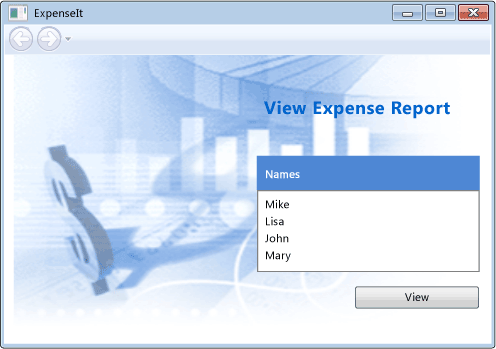
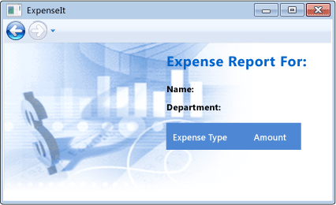
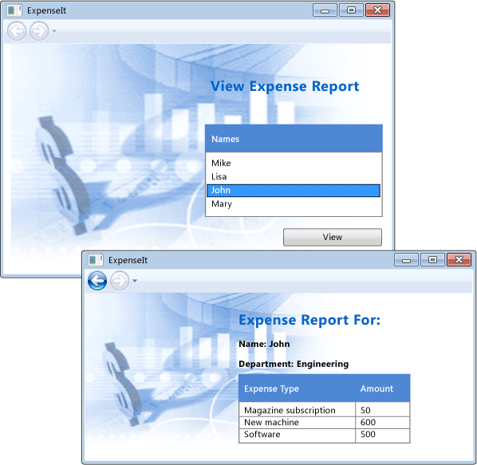

# <a name="walkthrough-my-first-wpf-desktop-application"></a>Exemplarische Vorgehensweise: Meine erste WPF-Desktopanwendung

In diesem Artikel erfahren Sie, wie Sie eine einfache Windows Presentation Foundation (WPF)-Anwendung entwickeln, die die Elemente enthält, die für die meisten WPF-Anwendungen gelten: Extensible Application Markup Language (XAML) Markup, CodeBehind, Anwendungsdefinitionen, Steuerelemente, Layout, Datenbindung und Stile.

Diese exemplarische Vorgehensweise umfasst die folgenden Schritte aus:

- Verwenden Sie XAML zum Entwerfen der Darstellung der Benutzeroberfläche (UI) der Anwendung.

- Schreiben Sie Code, um das Verhalten der Anwendung zu erstellen.

- Erstellen Sie eine Anwendungsdefinition, um die Anwendung zu verwalten.

- Fügen Sie Steuerelemente hinzu, und erstellen Sie das Layout der Benutzeroberfläche die Anwendung zu erstellen.

- Stile für ein konsistentes Erscheinungsbild in der gesamten Benutzeroberfläche einer Anwendung zu erstellen.

- Binden Sie die Benutzeroberfläche, auf Daten in der Benutzeroberfläche aus Daten füllen und behalten Sie die Daten und die Benutzeroberfläche, die synchronisiert.

Am Ende dieser exemplarischen Vorgehensweise werden Sie eine eigenständigen Windows-Anwendung erstellt haben, die Benutzer spesenabrechnungen für bestimmte Personen anzeigen können. Die Anwendung besteht aus der WPF-Seiten, die in einem Fenster im Browserstil gehostet werden.

> [!TIP]
> Der Beispielcode, der verwendet wird, in dieser exemplarischen Vorgehensweise steht für Visual Basic und c# in [Introduction to Building WPF Applications](https://go.microsoft.com/fwlink/?LinkID=160008).

## <a name="prerequisites"></a>Vorraussetzungen

- Visual Studio 2017 oder höher

   Weitere Informationen zum Installieren der neuesten Version von Visual Studio finden Sie unter [Installieren von Visual Studio](/visualstudio/install/install-visual-studio).

## <a name="create-the-application-project"></a>Erstellen des Anwendungsprojekts

Der erste Schritt ist die Erstellung von Infrastruktur der Anwendung, die eine Anwendungsdefinition, zwei Seiten und ein Bild enthält.

1. Erstellen Sie ein neues WPF-Anwendungsprojekt in Visual Basic oder Visual c# mit dem Namen **`ExpenseIt`**:

   1. Öffnen Sie Visual Studio, und wählen Sie **Datei** > **neu** > **Projekt**.

      Die **neues Projekt** Dialogfeld wird geöffnet.

   2. Unter den **installiert** (Kategorie), erweitern Sie entweder die **Visual C#**  oder **Visual Basic** Knoten, und wählen Sie dann **Windows Desktop**.

   3. Wählen Sie die **WPF-App ((.NET Framework)** Vorlage. Geben Sie den Namen **`ExpenseIt`** und wählen Sie dann **OK**.

      

      Visual Studio erstellt das Projekt und öffnet den Designer für das standardanwendungsfenster namens **"MainWindow.xaml"**.

   > [!NOTE]
   > Diese exemplarische Vorgehensweise verwendet die <xref:System.Windows.Controls.DataGrid> Steuerelement, das in .NET Framework 4 und höher verfügbar ist. Stellen Sie sicher, dass das Projekt auf .NET Framework 4 abzielt oder höher. Weitere Informationen finden Sie unter [Vorgehensweise: Erstellen von Projekten für eine bestimmte .NET Framework-Version](/visualstudio/ide/how-to-target-a-version-of-the-dotnet-framework).

2. Open *"Application.xaml"* (Visual Basic) oder *"App.xaml"* (c#).

    Diese XAML-Datei definiert eine WPF-Anwendung und alle Anwendungsressourcen. Sie verwenden diese Datei auch an der Benutzeroberfläche, die automatisch, wenn zeigt die Anwendung gestartet wird. In diesem Fall *"MainWindow.xaml"*.

    Ihre XAML sollte in Visual Basic wie folgt aussehen:

    [!code-xaml[ExpenseIt#1_A](../../../../samples/snippets/visualbasic/VS_Snippets_Wpf/ExpenseIt/VB/ExpenseIt1_A/Application.xaml#1_a)]

    Oder in C# wie folgt:

    [!code-xaml[ExpenseIt#1](../../../../samples/snippets/csharp/VS_Snippets_Wpf/ExpenseIt/CSharp/ExpenseIt/App.xaml#1)]

3. Open *"MainWindow.xaml"*.

    Dieser XAML-Datei ist das Hauptfenster der Anwendung und zeigt erstellten Inhalt auf Seiten. Die <xref:System.Windows.Window> Klasse definiert die Eigenschaften eines Fensters wie Titel, Größe oder Symbol, und behandelt Ereignisse wie schließen oder ausblenden.

4. Ändern der <xref:System.Windows.Window> Element eine <xref:System.Windows.Navigation.NavigationWindow>, wie in den folgenden XAML dargestellt:

   ```xaml
   <NavigationWindow x:Class="ExpenseIt.MainWindow"
        xmlns="http://schemas.microsoft.com/winfx/2006/xaml/presentation"
        xmlns:x="http://schemas.microsoft.com/winfx/2006/xaml"
        ...
   </NavigationWindow>
   ```

   Diese app navigiert zu anderem Inhalt, abhängig von der Benutzereingabe. Deshalb ist die Main <xref:System.Windows.Window> muss geändert werden, um eine <xref:System.Windows.Navigation.NavigationWindow>. <xref:System.Windows.Navigation.NavigationWindow> erbt alle Eigenschaften des <xref:System.Windows.Window>. Die <xref:System.Windows.Navigation.NavigationWindow> Element in der XAML-Datei erstellt eine Instanz der <xref:System.Windows.Navigation.NavigationWindow> Klasse. Weitere Informationen finden Sie unter [Übersicht über die Navigation](../../../../docs/framework/wpf/app-development/navigation-overview.md).

5. Ändern Sie die folgenden Eigenschaften auf der <xref:System.Windows.Navigation.NavigationWindow> Element:

    - Legen Sie die <xref:System.Windows.Window.Title%2A> Eigenschaft "`ExpenseIt`".

    - Legen Sie die <xref:System.Windows.FrameworkElement.Width%2A> Eigenschaft auf 500 Pixel.

    - Legen Sie die <xref:System.Windows.FrameworkElement.Height%2A> -Eigenschaft auf 350 Pixel.

    - Entfernen Sie die <xref:System.Windows.Controls.Grid> Elemente zwischen den <xref:System.Windows.Navigation.NavigationWindow> Tags.

    Ihre XAML sollte in Visual Basic wie folgt aussehen:

    [!code-xaml[ExpenseIt#2_A](../../../../samples/snippets/visualbasic/VS_Snippets_Wpf/ExpenseIt/VB/ExpenseIt/MainWindow.xaml#2_a)]

    Oder in C# wie folgt:

    [!code-xaml[ExpenseIt#2](../../../../samples/snippets/csharp/VS_Snippets_Wpf/ExpenseIt/CSharp/ExpenseIt/MainWindow.xaml#2)]

6. Open *"MainWindow.Xaml.vb"* oder *"MainWindow.Xaml.cs"*.

    Diese Datei ist eine Code-Behind-Datei Code zum Behandeln der Ereignisse, die im deklarierten mit *"MainWindow.xaml"*. Diese Datei enthält eine partielle Klasse für das in XAML definierte Fenster.

7. Wenn Sie c# verwenden, ändern Sie die `MainWindow` Klasse abgeleitet <xref:System.Windows.Navigation.NavigationWindow>. (In Visual Basic geschieht dies automatisch, wenn Sie das Fenster in XAML ändern.)

   Ihr Code sollte wie folgt aussehen:

   [!code-csharp[ExpenseIt#3](../../../../samples/snippets/csharp/VS_Snippets_Wpf/ExpenseIt/CSharp/ExpenseIt/MainWindow.xaml.cs#3)]
   [!code-vb[ExpenseIt#3](../../../../samples/snippets/visualbasic/VS_Snippets_Wpf/ExpenseIt/VB/ExpenseIt1_A/MainWindow.xaml.vb#3)]

   > [!TIP]
   > Sie können die Codesprache des Beispielcodes zwischen c# und Visual Basic in Umschalten der **Sprache** Dropdownliste oben rechts auf der in diesem Artikel.

## <a name="add-files-to-the-application"></a>Hinzufügen von Dateien zur Anwendung

In diesem Abschnitt fügen Sie der Anwendung zwei Seiten und ein Bild hinzu.

1. Fügen Sie eine neue WPF-Seite auf das Projekt, und nennen Sie sie *`ExpenseItHome.xaml`*:

   1. In **Projektmappen-Explorer**, mit der rechten Maustaste auf die **`ExpenseIt`** Projektknoten und wählen **hinzufügen** > **Seite**.

   1. In der **neues Element hinzufügen** im Dialogfeld die **Seite (WPF)** Vorlage bereits ausgewählt ist. Geben Sie den Namen **`ExpenseItHome`**, und wählen Sie dann **hinzufügen**.

    Diese Seite ist die erste Seite, die angezeigt wird, wenn die Anwendung gestartet wird. Es zeigt eine Liste der Personen an, wählen aus, um eine Spesenabrechnung anzuzeigen.

2. Open *`ExpenseItHome.xaml`*.

3. Legen Sie die <xref:System.Windows.Controls.Page.Title%2A> auf "`ExpenseIt - Home`".

    Ihre XAML sollte in Visual Basic wie folgt aussehen:

    [!code-xaml[ExpenseIt#6_A](../../../../samples/snippets/visualbasic/VS_Snippets_Wpf/ExpenseIt/VB/ExpenseIt1_A/ExpenseItHome.xaml#6_a)]

    Oder in C# wie folgt:

    [!code-xaml[ExpenseIt#6](../../../../samples/snippets/csharp/VS_Snippets_Wpf/ExpenseIt/CSharp/ExpenseIt2/ExpenseItHome.xaml#6)]

4. Open *"MainWindow.xaml"*.

5. Legen Sie die <xref:System.Windows.Navigation.NavigationWindow.Source%2A> Eigenschaft für die <xref:System.Windows.Navigation.NavigationWindow> auf "`ExpenseItHome.xaml`".

    Hiermit *`ExpenseItHome.xaml`* werden von der ersten Seite geöffnet werden soll, wenn die Anwendung gestartet wird. Ihre XAML sollte in Visual Basic wie folgt aussehen:

    [!code-xaml[ExpenseIt#7_A](../../../../samples/snippets/visualbasic/VS_Snippets_Wpf/ExpenseIt/VB/ExpenseIt1_A/MainWindow.xaml#7_a)]

    Oder in C# wie folgt:

    [!code-xaml[ExpenseIt#7](../../../../samples/snippets/csharp/VS_Snippets_Wpf/ExpenseIt/CSharp/ExpenseIt2/MainWindow.xaml#7)]

   > [!TIP]
   > Sie können auch Festlegen der **Quelle** -Eigenschaft in der **Sonstiges** Kategorie der **Eigenschaften** Fenster.
   >
   > 

6. Hinzufügen einer anderen neuen WPF-Seite auf das Projekt, und nennen Sie sie *"ExpenseReportPage.xaml"*::

   1. In **Projektmappen-Explorer**, mit der rechten Maustaste auf die **`ExpenseIt`** Projektknoten und wählen **hinzufügen** > **Seite**.

   1. In der **neues Element hinzufügen** im Dialogfeld die **Seite (WPF)** Vorlage bereits ausgewählt ist. Geben Sie den Namen **ExpenseReportPage**, und wählen Sie dann **hinzufügen**.

    Auf dieser Seite zeigt die Spesenabrechnung für die Person, die für ausgewählt, wird die **`ExpenseItHome`** Seite.

7. Öffnen Sie *ExpenseReportPage.xaml*.

8. Legen Sie die <xref:System.Windows.Controls.Page.Title%2A> auf "`ExpenseIt - View Expense`".

    Ihre XAML sollte in Visual Basic wie folgt aussehen:

    [!code-xaml[ExpenseIt#4_A](../../../../samples/snippets/visualbasic/VS_Snippets_Wpf/ExpenseIt/VB/ExpenseIt1_A/ExpenseReportPage.xaml#4_a)]

    Oder in C# wie folgt:

    [!code-xaml[ExpenseIt#4](../../../../samples/snippets/csharp/VS_Snippets_Wpf/ExpenseIt/CSharp/ExpenseIt/ExpenseReportPage.xaml#4)]

9. Open *"ExpenseItHome.Xaml.vb"* und *ExpenseReportPage.xaml.vb*, oder *"ExpenseItHome.Xaml.cs"* und *"ExpenseReportPage.Xaml.cs"*.

    Wenn Sie eine neue Seitendatei erstellen, erstellt Visual Studio automatisch eine *CodeBehind* Datei. Diese CodeBehind-Dateien behandeln die Logik zum Reagieren auf Benutzereingabe.

    Der Code sollte aussehen wie folgt für **`ExpenseItHome`**:

    [!code-csharp[ExpenseIt#2_5](../../../../samples/snippets/csharp/VS_Snippets_Wpf/ExpenseIt/CSharp/ExpenseIt2/ExpenseItHome.xaml.cs#2_5)]
    [!code-vb[ExpenseIt#2_5](../../../../samples/snippets/visualbasic/VS_Snippets_Wpf/ExpenseIt/VB/ExpenseIt1_A/ExpenseItHome.xaml.vb#2_5)]

    Und wie folgt für **ExpenseReportPage**:

    [!code-csharp[ExpenseIt#5](../../../../samples/snippets/csharp/VS_Snippets_Wpf/ExpenseIt/CSharp/ExpenseIt/ExpenseReportPage.xaml.cs#5)]
    [!code-vb[ExpenseIt#5](../../../../samples/snippets/visualbasic/VS_Snippets_Wpf/ExpenseIt/VB/ExpenseIt1_A/ExpenseReportPage.xaml.vb#5)]

10. Fügen Sie ein Bild mit dem Namen *watermark.png* zum Projekt. Sie können Ihr eigenes Image erstellen, kopieren Sie die Datei aus dem Beispielcode oder erhalten sie [hier](https://github.com/dotnet/docs/blob/master/docs/framework/wpf/getting-started/media/watermark.png).

   1. Mit der rechten Maustaste auf den Projektknoten, und wählen Sie **hinzufügen** > **vorhandenes Element**, oder drücken Sie **UMSCHALT**+**Alt** + **Ein**.

   2. In der **vorhandenes Element hinzufügen** suchen Sie die Image-Datei, die Sie verwenden möchten, und wählen Sie dann im Dialogfeld **hinzufügen**.

## <a name="build-and-run-the-application"></a>Erstellen eines Builds und Ausführen der Anwendung

1. Zum Erstellen und die Anwendung auszuführen, drücken Sie die **F5** oder wählen Sie **Debuggen starten** aus der **Debuggen** Menü.

    Die folgende Abbildung zeigt die Anwendung mit der <xref:System.Windows.Navigation.NavigationWindow> Schaltflächen:

    

2. Schließen Sie die Anwendung zu Visual Studio zurückzukehren.

## <a name="create-the-layout"></a>Erstellen Sie das layout

Layout bietet die Möglichkeit, Elemente der Benutzeroberfläche zu platzieren und verwaltet auch die Größe und Position dieser Elemente beim Ändern der Größe einer Benutzeroberflächenautomatisierungs. In der Regel erstellen Sie Layout mit einem der folgenden Layoutsteuerelemente:

- <xref:System.Windows.Controls.Canvas>
- <xref:System.Windows.Controls.DockPanel>
- <xref:System.Windows.Controls.Grid>
- <xref:System.Windows.Controls.StackPanel>
- <xref:System.Windows.Controls.VirtualizingStackPanel>
- <xref:System.Windows.Controls.WrapPanel>

Jedes dieser Layoutsteuerelemente unterstützt einen speziellen Layouttyp für seine untergeordneten Elemente. `ExpenseIt` Seiten geändert werden können, und jede Seite verfügt über Elemente, die horizontal und vertikal neben anderen Elementen angeordnet sind. Daher die <xref:System.Windows.Controls.Grid> ist das ideale Layoutelement für die Anwendung.

> [!TIP]
> Weitere Informationen zu <xref:System.Windows.Controls.Panel> Elemente finden Sie unter [Übersicht über Panel](../../../../docs/framework/wpf/controls/panels-overview.md). Weitere Informationen zum Layout finden Sie unter [Layout](../../../../docs/framework/wpf/advanced/layout.md).

Klicken Sie im Abschnitt erstellen Sie eine einspaltige Tabelle mit drei Zeilen und einen 10-Pixel-Rand durch Hinzufügen von Spalten- und Zeilendefinitionen zu den <xref:System.Windows.Controls.Grid> in *`ExpenseItHome.xaml`*.

1. Open *`ExpenseItHome.xaml`*.

2. Legen Sie die <xref:System.Windows.FrameworkElement.Margin%2A> Eigenschaft für die <xref:System.Windows.Controls.Grid> Element auf "10,0,10,10", auf der linken, oberen, rechten und unteren Ränder entspricht:

   ```xaml
   <Grid Margin="10,0,10,10">
   ```

   > [!TIP]
   > Sie können auch Festlegen der **Rand** Werte in der **Eigenschaften** Fenster unter dem **Layout** Kategorie:
   >
   > 

3. Fügen Sie das folgende XAML zwischen den <xref:System.Windows.Controls.Grid> Tags aus, um die Zeilen- und Spaltendefinitionen zu erstellen:

    [!code-xaml[ExpenseIt#8](../../../../samples/snippets/csharp/VS_Snippets_Wpf/ExpenseIt/CSharp/ExpenseIt3/ExpenseItHome.xaml#8)]

    Die <xref:System.Windows.Controls.RowDefinition.Height%2A> zwei Zeilen wird festgelegt <xref:System.Windows.GridLength.Auto%2A>, was bedeutet, dass die Größe der Zeilen basierend auf dem Inhalt in den Zeilen. Der Standardwert <xref:System.Windows.Controls.RowDefinition.Height%2A> ist <xref:System.Windows.GridUnitType.Star> größenanpassung, was bedeutet, dass die Zeilenhöhe eine gewichtete Proportion des verfügbaren Platzes ist. Wenn z. B. zwei Zeilen jeweils eine <xref:System.Windows.Controls.RowDefinition.Height%2A> von "*", sie verfügen jeweils über eine Höhe von der Hälfte des verfügbaren Platzes ist.

    Ihre <xref:System.Windows.Controls.Grid> sollte jetzt aussehen wie der folgende XAML:

    [!code-xaml[ExpenseIt#9](../../../../samples/snippets/csharp/VS_Snippets_Wpf/ExpenseIt/CSharp/ExpenseIt3/ExpenseItHome.xaml#9)]

## <a name="add-controls"></a>Hinzufügen von Steuerelementen

In diesem Abschnitt Aktualisieren Sie die Homepage Benutzeroberfläche, um eine Liste der Personen anzuzeigen, die ein Benutzer auswählen kann, die Spesenabrechnung anzuzeigen. Steuerelemente sind Benutzeroberflächenobjekte, die Benutzern die Interaktion mit der Anwendung ermöglichen. Weitere Informationen finden Sie unter [Steuerelemente](../../../../docs/framework/wpf/controls/index.md).

Um diese Benutzeroberfläche zu erstellen, fügen Sie die folgenden Elemente zu *`ExpenseItHome.xaml`*:

- <xref:System.Windows.Controls.ListBox> (für die Liste der Personen).
- <xref:System.Windows.Controls.Label> (für den Listenheader).
- <xref:System.Windows.Controls.Button> (zum klicken, um die Spesenabrechnung für die Person anzuzeigen, die in der Liste ausgewählt ist).

Jedes Steuerelement wird in einer Zeile platziert die <xref:System.Windows.Controls.Grid> durch Festlegen der <xref:System.Windows.Controls.Grid.Row%2A?displayProperty=nameWithType> angefügte Eigenschaft. Weitere Informationen zu angefügten Eigenschaften finden Sie unter [Übersicht über angefügte Eigenschaften](../../../../docs/framework/wpf/advanced/attached-properties-overview.md).

1. Open *`ExpenseItHome.xaml`*.

2. Fügen Sie den folgenden XAML an einer beliebigen Stelle zwischen den <xref:System.Windows.Controls.Grid> Tags:

   [!code-xaml[ExpenseIt#10](../../../../samples/snippets/csharp/VS_Snippets_Wpf/ExpenseIt/CSharp/ExpenseIt4/ExpenseItHome.xaml#10)]

   > [!TIP]
   > Sie können die Steuerelemente auch erstellen, ziehen sie aus der **Toolbox** Fenster in das Entwurfsfenster, und klicken Sie dann ihre Einstellungen der **Eigenschaften** Fenster.

3. Erstellen Sie die Anwendung, und führen Sie sie aus.

Die folgende Abbildung zeigt die Steuerelemente, dass Sie gerade erstellt haben:


## <a name="add-an-image-and-a-title"></a>Fügen Sie ein Image und einen Titel hinzu

In diesem Abschnitt Aktualisieren Sie die Benutzeroberfläche der Homepage mit einem Bild und einem Seitentitel.

1. Open *`ExpenseItHome.xaml`*.

2. Fügen Sie eine andere Spalte als die <xref:System.Windows.Controls.Grid.ColumnDefinitions%2A> mit einer festen <xref:System.Windows.Controls.ColumnDefinition.Width%2A> von 230 Pixel:

    [!code-xaml[ExpenseIt#11](../../../../samples/snippets/csharp/VS_Snippets_Wpf/ExpenseIt/CSharp/ExpenseIt5/ExpenseItHome.xaml#11)]

3. Hinzufügen zu einer anderen Zeile der <xref:System.Windows.Controls.Grid.RowDefinitions%2A>, also insgesamt vier Zeilen:

    [!code-xaml[ExpenseIt#11b](../../../../samples/snippets/csharp/VS_Snippets_Wpf/ExpenseIt/CSharp/ExpenseIt5/ExpenseItHome.xaml#11b)]

4. Verschieben Sie die Steuerelemente in die zweite Spalte, durch Festlegen der <xref:System.Windows.Controls.Grid.Column%2A?displayProperty=nameWithType> -Eigenschaft auf 1 in jedem der drei Steuerelemente (Rahmen, ListBox und Schaltfläche ").

5. Verschieben Sie jedes Steuerelement eine Zeile aus, nach unten durch Erhöhen der <xref:System.Windows.Controls.Grid.Row%2A?displayProperty=nameWithType> -Wert um 1.

   Der XAML für die drei Steuerelemente sieht nun folgendermaßen aus:

    [!code-xaml[ExpenseIt#12](../../../../samples/snippets/csharp/VS_Snippets_Wpf/ExpenseIt/CSharp/ExpenseIt5/ExpenseItHome.xaml#12)]

6. Festlegen der <xref:System.Windows.Controls.Panel.Background%2A> von der <xref:System.Windows.Controls.Grid> sein der *watermark.png* Bilddatei, durch das Hinzufügen der folgende XAML irgendwo zwischen der `<Grid>` und `</Grid>` Tags:

    [!code-xaml[ExpenseIt#14](../../../../samples/snippets/csharp/VS_Snippets_Wpf/ExpenseIt/CSharp/ExpenseIt5/ExpenseItHome.xaml#14)]

7. Vor der <xref:System.Windows.Controls.Border> -Element, Hinzufügen einer <xref:System.Windows.Controls.Label> mit dem Inhalt "View Expense Report". Dies ist der Titel der Seite.

    [!code-xaml[ExpenseIt#13](../../../../samples/snippets/csharp/VS_Snippets_Wpf/ExpenseIt/CSharp/ExpenseIt5/ExpenseItHome.xaml#13)]

8. Erstellen Sie die Anwendung, und führen Sie sie aus.

Die folgende Abbildung zeigt die Ergebnisse von was Sie gerade hinzugefügt haben:



## <a name="add-code-to-handle-events"></a>Fügen Sie Code zum Verarbeiten von Ereignissen

1. Open *`ExpenseItHome.xaml`*.

2. Hinzufügen einer <xref:System.Windows.Controls.Primitives.ButtonBase.Click> -Ereignishandler der <xref:System.Windows.Controls.Button> Element. Weitere Informationen finden Sie unter [Vorgehensweise: Erstellen eines einfachen ereignishandlers](https://docs.microsoft.com/previous-versions/visualstudio/visual-studio-2010/bb675300(v=vs.100)).

    [!code-xaml[ExpenseIt#15](../../../../samples/snippets/csharp/VS_Snippets_Wpf/ExpenseIt/CSharp/ExpenseIt6/ExpenseItHome.xaml#15)]

3. Open *`ExpenseItHome.xaml.vb`* oder *`ExpenseItHome.xaml.cs`*.

4. Fügen Sie den folgenden Code der `ExpenseItHome` Klasse, um eine Schaltfläche hinzufügen-click-Ereignishandler. Der Ereignishandler öffnet die **ExpenseReportPage** Seite.

    [!code-csharp[ExpenseIt#16](../../../../samples/snippets/csharp/VS_Snippets_Wpf/ExpenseIt/CSharp/ExpenseIt6/ExpenseItHome.xaml.cs#16)]
    [!code-vb[ExpenseIt#16](../../../../samples/snippets/visualbasic/VS_Snippets_Wpf/ExpenseIt/VB/ExpenseIt6/ExpenseItHome.xaml.vb#16)]

## <a name="create-the-ui-for-expensereportpage"></a>Erstellen der Benutzeroberfläche für ExpenseReportPage

*"ExpenseReportPage.xaml"* zeigt die Spesenabrechnung für die Person, die für ausgewählt, wird die **`ExpenseItHome`** Seite. In diesem Abschnitt erstellen Sie die Benutzeroberfläche für **ExpenseReportPage**. Außerdem fügen Hintergrund und Füllfarben zwischen den verschiedenen UI-Elementen.

1. Öffnen Sie *ExpenseReportPage.xaml*.

2. Fügen Sie das folgende XAML zwischen den <xref:System.Windows.Controls.Grid> Tags:

    [!code-xaml[ExpenseIt#17](../../../../samples/snippets/csharp/VS_Snippets_Wpf/ExpenseIt/CSharp/ExpenseIt6/ExpenseReportPage.xaml#17)]

    Diese Benutzeroberfläche ähnelt *`ExpenseItHome.xaml`*, außer dass die Daten des Berichts, in angezeigt werden einem <xref:System.Windows.Controls.DataGrid>.

3. Erstellen Sie die Anwendung, und führen Sie sie aus.

    > [!NOTE]
    > Wenn Sie eine Fehlermeldung, die erhalten die <xref:System.Windows.Controls.DataGrid> wurde nicht gefunden oder nicht vorhanden ist, stellen Sie sicher, dass das Projekt auf .NET Framework 4 oder höher abzielt. Weitere Informationen finden Sie unter [Vorgehensweise: Erstellen von Projekten für eine bestimmte .NET Framework-Version](/visualstudio/ide/how-to-target-a-version-of-the-dotnet-framework).

4. Wählen Sie die **Ansicht** Schaltfläche.

    Die Spesenabrechnungsseite wird angezeigt. Beachten Sie außerdem, dass die Navigationsschaltfläche "zurück" aktiviert ist.

Die folgende Abbildung zeigt die Elemente der Benutzeroberfläche hinzugefügt *"ExpenseReportPage.xaml"*.



## <a name="style-controls"></a>Formatieren von Steuerelementen

Die Darstellung verschiedener Elemente ist häufig für alle Elemente des gleichen Typs in einer Benutzeroberfläche identisch. Benutzeroberfläche verwendet [Stile](../../../../docs/framework/wpf/controls/styling-and-templating.md) Darstellungen in mehreren Elementen wieder verwendbaren vornehmen. Die wiederverwendbarkeit von Stilen können Sie die um XAML-Erstellung und Verwaltung zu vereinfachen. Dieser Abschnitt ersetzt die Attribute pro Element, die in den vorherigen Schritten mit Stilen definiert wurden.

1. Open *"Application.xaml"* oder *"App.xaml"*.

2. Fügen Sie das folgende XAML zwischen den <xref:System.Windows.Application.Resources%2A?displayProperty=nameWithType> Tags:

    [!code-xaml[ExpenseIt#18](../../../../samples/snippets/csharp/VS_Snippets_Wpf/ExpenseIt/CSharp/ExpenseIt7/App.xaml#18)]

    Durch diese XAML werden folgende Stile hinzugefügt:

    - `headerTextStyle`: Zum Formatieren des Seitentitels <xref:System.Windows.Controls.Label>.

    - `labelStyle`: Zum Formatieren der <xref:System.Windows.Controls.Label> Steuerelemente.

    - `columnHeaderStyle`: Zum Formatieren der <xref:System.Windows.Controls.Primitives.DataGridColumnHeader>.

    - `listHeaderStyle`: Zum Formatieren der Kopfzeile <xref:System.Windows.Controls.Border> Steuerelemente.

    - `listHeaderTextStyle`: Zum Formatieren der Kopfzeile <xref:System.Windows.Controls.Label>.

    - `buttonStyle`: Zum Formatieren der <xref:System.Windows.Controls.Button> auf `ExpenseItHome.xaml`.

    Beachten Sie, dass die Ressourcen und die untergeordneten Elemente werden der <xref:System.Windows.Application.Resources%2A?displayProperty=nameWithType> Property-Element. An diesem Speicherort werden die Stile auf alle Elemente in einer Anwendung angewendet. Ein Beispiel der Verwendung von Ressourcen in einer .NET Framework-Anwendung finden Sie unter [Verwenden von Anwendungsressourcen](../../../../docs/framework/wpf/advanced/how-to-use-application-resources.md).

3. Open *`ExpenseItHome.xaml`*.

4. Ersetzen Sie alles zwischen dem <xref:System.Windows.Controls.Grid> Elemente mit den folgenden XAML:

    [!code-xaml[ExpenseIt#19](../../../../samples/snippets/csharp/VS_Snippets_Wpf/ExpenseIt/CSharp/ExpenseIt7/ExpenseItHome.xaml#19)]

    Eigenschaften wie <xref:System.Windows.VerticalAlignment> und <xref:System.Windows.Media.FontFamily> , die die Darstellung der einzelnen Steuerelemente definieren, werden entfernt und ersetzt, indem die Stile angewendet werden. Z. B. die `headerTextStyle` gilt für die "View Expense Report" <xref:System.Windows.Controls.Label>.

5. Öffnen Sie *ExpenseReportPage.xaml*.

6. Ersetzen Sie alles zwischen dem <xref:System.Windows.Controls.Grid> Elemente mit den folgenden XAML:

    [!code-xaml[ExpenseIt#20](../../../../samples/snippets/csharp/VS_Snippets_Wpf/ExpenseIt/CSharp/ExpenseIt7/ExpenseReportPage.xaml#20)]

    Dadurch werden dem <xref:System.Windows.Controls.Label> -Element und <xref:System.Windows.Controls.Border> -Element Stile hinzugefügt.

## <a name="bind-data-to-a-control"></a>Binden von Daten an ein Steuerelement

In diesem Abschnitt erstellen Sie die XML-Daten, die an verschiedene Steuerelemente gebunden ist.

1. Open *`ExpenseItHome.xaml`*.

2. Nach dem öffnenden <xref:System.Windows.Controls.Grid> -Element, fügen Sie den folgenden XAML zum Erstellen einer <xref:System.Windows.Data.XmlDataProvider> , die Daten für jede Person enthält:

    [!code-xaml[ExpenseIt#21](../../../../samples/snippets/csharp/VS_Snippets_Wpf/ExpenseIt/CSharp/ExpenseIt8/ExpenseItHome.xaml#21)]
    [!code-xaml[ExpenseIt#23](../../../../samples/snippets/csharp/VS_Snippets_Wpf/ExpenseIt/CSharp/ExpenseIt8/ExpenseItHome.xaml#23)]
    [!code-xaml[ExpenseIt#22](../../../../samples/snippets/csharp/VS_Snippets_Wpf/ExpenseIt/CSharp/ExpenseIt8/ExpenseItHome.xaml#22)]

    Die Daten werden als erstellt eine <xref:System.Windows.Controls.Grid> Ressource. Normalerweise würde sie als Datei geladen, aus Gründen der Einfachheit werden die Daten aber inline hinzugefügt.

3. In der `<Grid.Resources>` -Element, fügen Sie die folgenden <xref:System.Windows.DataTemplate>, die definiert, wie zum Anzeigen der Daten in die <xref:System.Windows.Controls.ListBox>:

    [!code-xaml[ExpenseIt#21](../../../../samples/snippets/csharp/VS_Snippets_Wpf/ExpenseIt/CSharp/ExpenseIt8/ExpenseItHome.xaml#21)]
    [!code-xaml[ExpenseIt#24](../../../../samples/snippets/csharp/VS_Snippets_Wpf/ExpenseIt/CSharp/ExpenseIt8/ExpenseItHome.xaml#24)]
    [!code-xaml[ExpenseIt#22](../../../../samples/snippets/csharp/VS_Snippets_Wpf/ExpenseIt/CSharp/ExpenseIt8/ExpenseItHome.xaml#22)]

    Weitere Informationen zu Datenvorlagen finden Sie unter [Übersicht über Datenvorlagen](../../../../docs/framework/wpf/data/data-templating-overview.md).

4. Ersetzen Sie die vorhandene <xref:System.Windows.Controls.ListBox> mit den folgenden XAML:

    [!code-xaml[ExpenseIt#25](../../../../samples/snippets/csharp/VS_Snippets_Wpf/ExpenseIt/CSharp/ExpenseIt8/ExpenseItHome.xaml#25)]

    Dieses XAML bindet die <xref:System.Windows.Controls.ItemsControl.ItemsSource%2A> Eigenschaft der <xref:System.Windows.Controls.ListBox> an die Datenquelle und wendet die Datenvorlage als die <xref:System.Windows.Controls.ItemsControl.ItemTemplate%2A>.

## <a name="connect-data-to-controls"></a>Verbinden Sie Daten an Steuerelemente

Anschließend fügen Sie Code zum Abrufen des Namens, der ausgewählt wird die **`ExpenseItHome`** Seite, und übergeben Sie es an den Konstruktor der **ExpenseReportPage**. **ExpenseReportPage** legt den Datenkontext mithilfe des übergebenen Elements, die die Steuerelemente definierten in *"ExpenseReportPage.xaml"* Binden an.

1. Öffnen Sie *ExpenseReportPage.xaml.vb* oder *ExpenseReportPage.xaml.cs*.

2. Fügen Sie einen Konstruktor hinzu, der ein Objekt akzeptiert, damit Sie die Spesenabrechnungsdaten der ausgewählten Person übergeben können.

    [!code-csharp[ExpenseIt#26](../../../../samples/snippets/csharp/VS_Snippets_Wpf/ExpenseIt/CSharp/ExpenseIt8/ExpenseReportPage.xaml.cs#26)]
    [!code-vb[ExpenseIt#26](../../../../samples/snippets/visualbasic/VS_Snippets_Wpf/ExpenseIt/VB/ExpenseIt8/ExpenseReportPage.xaml.vb#26)]

3. Open *`ExpenseItHome.xaml.vb`* oder *`ExpenseItHome.xaml.cs`*.

4. Ändern der <xref:System.Windows.Controls.Primitives.ButtonBase.Click> -Ereignishandler aufrufen, den neuen Konstruktor, der die Spesenabrechnungsdaten der ausgewählten Person übergeben.

    [!code-csharp[ExpenseIt#27](../../../../samples/snippets/csharp/VS_Snippets_Wpf/ExpenseIt/CSharp/ExpenseIt8/ExpenseItHome.xaml.cs#27)]
    [!code-vb[ExpenseIt#27](../../../../samples/snippets/visualbasic/VS_Snippets_Wpf/ExpenseIt/VB/ExpenseIt8/ExpenseItHome.xaml.vb#27)]

## <a name="style-data-with-data-templates"></a>Style-Daten mit Datenvorlagen

In diesem Abschnitt Aktualisieren Sie die Benutzeroberfläche für jedes Element in den datengebundenen Listen mithilfe von Datenvorlagen.

1. Öffnen Sie *ExpenseReportPage.xaml*.

2. Binden Sie den Inhalt der "Name" und "Department" <xref:System.Windows.Controls.Label> Elemente an die entsprechende Datenquelleneigenschaft. Weitere Informationen zur Datenbindung finden Sie unter [Übersicht über die Datenbindung](../../../../docs/framework/wpf/data/data-binding-overview.md).

    [!code-xaml[ExpenseIt#31](../../../../samples/snippets/csharp/VS_Snippets_Wpf/ExpenseIt/CSharp/ExpenseIt9/ExpenseReportPage.xaml#31)]

3. Nach dem öffnenden <xref:System.Windows.Controls.Grid> -Element, fügen Sie die folgenden Datenvorlagen, die definieren, wie die Spesenabrechnungsdaten angezeigt werden:

    [!code-xaml[ExpenseIt#30](../../../../samples/snippets/csharp/VS_Snippets_Wpf/ExpenseIt/CSharp/ExpenseIt9/ExpenseReportPage.xaml#30)]

4. Ersetzen Sie die <xref:System.Windows.Controls.DataGridTextColumn> Elemente mit <xref:System.Windows.Controls.DataGridTemplateColumn> unter der <xref:System.Windows.Controls.DataGrid> Element und die Vorlagen auf sie angewendet.

    [!code-xaml[ExpenseIt#32](../../../../samples/snippets/csharp/VS_Snippets_Wpf/ExpenseIt/CSharp/ExpenseIt9/ExpenseReportPage.xaml#32)]

5. Erstellen Sie die Anwendung, und führen Sie sie aus.

6. Wählen Sie eine Person ein, und wählen Sie dann die **Ansicht** Schaltfläche.

Die folgende Abbildung zeigt die beiden Seiten von der `ExpenseIt` Anwendung mit Steuerelementen, Layout, Stilen, Datenbindung und Datenvorlagen angewendet:



> [!NOTE]
> In diesem Beispiel wird veranschaulicht, eine bestimmte Funktion von WPF und nicht alle bewährte Methoden für Aspekte wie Sicherheit, Lokalisierung und Eingabehilfen. Umfassende Behandlung von WPF und bewährte Methoden für die Anwendungsentwicklung die .NET Framework finden Sie unter den folgenden Themen:
>
> - [Barrierefreiheit](../../../../docs/framework/ui-automation/accessibility-best-practices.md)
>
> - [Sicherheit](../../../../docs/framework/wpf/security-wpf.md)
>
> - [Übersicht über WPF-Globalisierung und -Lokalisierung](../../../../docs/framework/wpf/advanced/wpf-globalization-and-localization-overview.md)
>
> - [Von WPF](../../../../docs/framework/wpf/advanced/optimizing-wpf-application-performance.md)

## <a name="next-steps"></a>Nächste Schritte

In dieser exemplarischen Vorgehensweise haben Sie gelernt, eine Reihe von Techniken zum Erstellen einer Benutzeroberfläche mit Windows Presentation Foundation (WPF). Sie verfügen nun über einen grundlegenden Überblick über die Bausteine einer datengebundenen, .NET Framework-Anwendung. Weitere Informationen über die WPF-Architektur und -Programmiermodelle finden Sie in den folgenden Themen:

- [WPF-Architektur](../../../../docs/framework/wpf/advanced/wpf-architecture.md)
- [Übersicht über XAML (WPF)](../../../../docs/framework/wpf/advanced/xaml-overview-wpf.md)
- [Übersicht über Abhängigkeitseigenschaften](../../../../docs/framework/wpf/advanced/dependency-properties-overview.md)
- [Layout](../../../../docs/framework/wpf/advanced/layout.md)

Weitere Informationen zum Erstellen von Anwendungen finden Sie in den folgenden Themen:

- [Anwendungsentwicklung](../../../../docs/framework/wpf/app-development/index.md)
- [Steuerelemente](../../../../docs/framework/wpf/controls/index.md)
- [Übersicht über Datenbindung](../../../../docs/framework/wpf/data/data-binding-overview.md)
- [Grafiken und multimedia](../../../../docs/framework/wpf/graphics-multimedia/index.md)
- [Dokumente in WPF](../../../../docs/framework/wpf/advanced/documents-in-wpf.md)

## <a name="see-also"></a>Siehe auch

- [Übersicht über Panel](../../../../docs/framework/wpf/controls/panels-overview.md)
- [Übersicht über Datenvorlagen](../../../../docs/framework/wpf/data/data-templating-overview.md)
- [Erstellen einer WPF-Anwendung](../../../../docs/framework/wpf/app-development/building-a-wpf-application-wpf.md)
- [Stile und-Vorlagen](../../../../docs/framework/wpf/controls/styles-and-templates.md)
