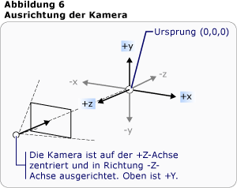
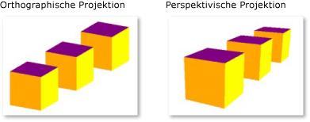

# Übersicht über 3D-Grafiken
Die 3D-Funktionalität in [!INCLUDE[TLA#tla_winclient](../../../../includes/tlasharptla-winclient-md.md)] ermöglicht Entwicklern das Zeichnen, Transformieren und Animieren von 3D-Grafiken in Markup-und prozeduralem Code. Entwickler können 2D-und 3D-Grafiken kombinieren, um umfangreiche Steuerelemente zu erstellen, komplexe Abbildungen von Daten bereitzustellen oder die Benutzeroberfläche einer Anwendungs Schnittstelle zu verbessern. die 3D-Unterstützung in [!INCLUDE[TLA2#tla_winclient](../../../../includes/tla2sharptla-winclient-md.md)] ist nicht für die Bereitstellung einer voll funktionsfähigen Spiele Entwicklungsplattform konzipiert. Dieses Thema enthält eine Übersicht über die 3D-Funktionalität im [!INCLUDE[TLA2#tla_winclient](../../../../includes/tla2sharptla-winclient-md.md)] Grafiksystem.  

## 3D in einem 2D-Container  
 3D-Grafik Inhalte in werden [!INCLUDE[TLA2#tla_winclient](../../../../includes/tla2sharptla-winclient-md.md)] in einem Element <xref:System.Windows.Controls.Viewport3D> gekapselt,, das an der zweidimensionalen Elementstruktur teilnehmen kann. Das Grafiksystem behandelt <xref:System.Windows.Controls.Viewport3D> als ein zweidimensionales visuelles Element wie viele andere in [!INCLUDE[TLA2#tla_winclient](../../../../includes/tla2sharptla-winclient-md.md)] . <xref:System.Windows.Controls.Viewport3D>Funktionen als Fenster – ein Viewport – in eine dreidimensionale Szene. Genauer betrachtet ist es eine Oberfläche, auf der eine 3D-Szene projiziert wird.  
  
 Verwenden Sie in einer konventionellen 2D-Anwendung wie bei einem <xref:System.Windows.Controls.Viewport3D> anderen Containerelement, wie z. b. Raster oder Canvas.  Obwohl Sie <xref:System.Windows.Controls.Viewport3D> mit anderen 2D-Zeichnungsobjekten im gleichen Szenen Diagramm verwenden können, ist es nicht möglich, 2D-und 3D-Objekte innerhalb einer zu durchdringen <xref:System.Windows.Controls.Viewport3D> .  Dieses Thema konzentriert sich darauf, wie 3D-Grafiken in gezeichnet werden <xref:System.Windows.Controls.Viewport3D> .  
  

## 3D-Koordinaten Bereich  
 Das [!INCLUDE[TLA2#tla_winclient](../../../../includes/tla2sharptla-winclient-md.md)] Koordinatensystem für 2D-Grafiken sucht den Ursprung in der oberen linken Ecke des Renderingbereichs (in der Regel der Bildschirm). Im 2D-System werden die positiven Werte der x-Achse nach rechts und die positiven Werte der y-Achse nach unten fortgesetzt.  Im 3D-Koordinatensystem befindet sich der Ursprung jedoch in der Mitte des Renderingbereichs, wobei die positiven Werte der x-Achse nach rechts fortgesetzt werden, die positiven Werte der y-Achse jedoch weiter oben fortgesetzt werden, und positive z-Achsen-Werte, die sich nach außen vom Ursprung bis zum Viewer befinden.  
  
   
Herkömmliche 2D-und 3D-Koordinatensystem Darstellungen  
  
 Der von diesen Achsen definierte Raum ist der stationäre Frame des Verweises für 3D-Objekte in [!INCLUDE[TLA2#tla_winclient](../../../../includes/tla2sharptla-winclient-md.md)] . Wenn Sie innerhalb dieses Raumes Modelle erstellen und Lichter und Kameras, um sie anzuzeigen, ist es hilfreich, diesen feststehenden Verweisrahmen oder „Weltenraum“ vom lokalen zu unterscheiden, den Sie beim Anwenden von Transformationen für jedes Modell erstellen. Beachten Sie außerdem, dass Objekte im Weltenraum je nach der Kamera und den Einstellungen völlig anders oder überhaupt nicht angezeigt werden können. Die Position der Kamera ändert aber nicht die Position von Objekten im Weltenraum.  
  

## Kameras und Projektionen  
 Entwickler, die in 2D arbeiten, sind daran gewöhnt, Zeichnungs primitive auf einem zweidimensionalen Bildschirm zu positionieren. Wenn Sie eine 3D-Szene erstellen, müssen Sie unbedingt daran denken, dass Sie eine 2D-Darstellung von 3D-Objekten erstellen. Da eine 3D-Szene abhängig von der Sicht des Onlooker abweicht, müssen Sie diese Perspektive angeben. <xref:System.Windows.Media.Media3D.Camera>Mit der-Klasse können Sie diesen Ansichts Punkt für eine 3D-Szene angeben.  
  
 Eine andere Möglichkeit, um zu verstehen, wie eine 3D-Szene auf einer 2D-Oberfläche dargestellt wird, besteht darin, die Szene als Projektion auf der Anzeige Oberfläche zu beschreiben. Mit <xref:System.Windows.Media.Media3D.ProjectionCamera> können Sie verschiedene Projektionen und deren Eigenschaften angeben, um zu ändern, wie der Betrachters angibt 3D-Modelle sieht. Ein <xref:System.Windows.Media.Media3D.PerspectiveCamera> gibt eine Projektion an, die die Szene vornimmt.  Mit anderen Worten: die <xref:System.Windows.Media.Media3D.PerspectiveCamera> stellt die Perspektive des verschwindenden Punkts bereit.  Sie können die Position der Kamera im Koordinatenbereich der Szene, die Richtung und das Sichtfeld der Kamera und ein Vektor angeben, der die Richtung „nach oben“ in der Szene definiert. Im folgenden Diagramm wird die <xref:System.Windows.Media.Media3D.PerspectiveCamera> Projektion von veranschaulicht.  
  
 Die-Eigenschaft <xref:System.Windows.Media.Media3D.ProjectionCamera.NearPlaneDistance%2A> und die <xref:System.Windows.Media.Media3D.ProjectionCamera.FarPlaneDistance%2A> -Eigenschaft von <xref:System.Windows.Media.Media3D.ProjectionCamera> schränken den Bereich der Kamera Projektion ein. Da sich Kameras überall in der Szene befinden können, kann die Kamera auch innerhalb eines Modells oder sehr nah an einem Modell positioniert werden. Dies erschwert ordnungsgemäße die Unterscheidung von Objekten.  <xref:System.Windows.Media.Media3D.ProjectionCamera.NearPlaneDistance%2A>ermöglicht es Ihnen, einen minimalen Abstand von der Kamera anzugeben, über den die Objekte nicht gezeichnet werden.  Umgekehrt <xref:System.Windows.Media.Media3D.ProjectionCamera.FarPlaneDistance%2A> können Sie eine Entfernung von der Kamera angeben, nach der keine Objekte mehr gezeichnet werden. Dadurch wird sichergestellt, dass Objekte, die zu weit entfernt sind, nicht mehr in der Szene enthalten sind.  
  
   
Kameraposition  
  
 <xref:System.Windows.Media.Media3D.OrthographicCamera>gibt eine orthogonale Projektion eines 3D-Modells auf eine visuelle 2D-Oberfläche an. Wie andere Kameras gibt es eine Position, Blickrichtung und die Richtung „nach oben“ an. Anders als <xref:System.Windows.Media.Media3D.PerspectiveCamera> wird jedoch <xref:System.Windows.Media.Media3D.OrthographicCamera> eine Projektion beschrieben, die keine Perspektiven Vorhersage einschließt. Anders ausgedrückt: <xref:System.Windows.Media.Media3D.OrthographicCamera> beschreibt ein Anzeige Feld, dessen Seiten parallel sind, anstatt eines, dessen Seite an einem Punkt auf der Kamera steht. Die folgende Abbildung zeigt das gleiche Modell, das mit <xref:System.Windows.Media.Media3D.PerspectiveCamera> und angezeigt wird <xref:System.Windows.Media.Media3D.OrthographicCamera> .  
  
   
Perspektivische und orthografische Projektionen  
  
 Der folgende Code zeigt einige typische Kameraeinstellungen.  
  
 [!code-csharp[3dgallery_procedural_snip#Basic3DShapeCodeExampleInline1](~/samples/snippets/csharp/VS_Snippets_Wpf/3DGallery_procedural_snip/CSharp/Basic3DShapeExample.cs#basic3dshapecodeexampleinline1)]
 [!code-vb[3dgallery_procedural_snip#Basic3DShapeCodeExampleInline1](~/samples/snippets/visualbasic/VS_Snippets_Wpf/3DGallery_procedural_snip/visualbasic/basic3dshapeexample.vb#basic3dshapecodeexampleinline1)]  
  

## Modell- und primitive Gittertypen  
  
 <xref:System.Windows.Media.Media3D.Model3D>ist die abstrakte Basisklasse, die ein generisches 3D-Objekt darstellt. Zum Erstellen einer 3D-Szene müssen einige Objekte angezeigt werden, und die Objekte, aus denen sich das Szenen Diagramm besteht, werden von abgeleitet <xref:System.Windows.Media.Media3D.Model3D> . Derzeit [!INCLUDE[TLA2#tla_winclient](../../../../includes/tla2sharptla-winclient-md.md)] unterstützt Modellierungs Geometrien mit <xref:System.Windows.Media.Media3D.GeometryModel3D> . Die- <xref:System.Windows.Media.Media3D.GeometryModel3D.Geometry%2A> Eigenschaft dieses Modells nimmt ein Mesh-primitiv.  
  
 Um ein Modell zu erstellen, erstellen Sie zuerst einen primitiven Typen oder ein Gitter. Ein 3D-primitiv ist eine Sammlung von Vertices, die eine einzelne 3D-Entität bilden. Die meisten 3D-Systeme stellen Primitive dar, die auf der einfachsten geschlossenen Abbildung modelliert sind: ein Dreieck, das durch drei Vertices definiert wird.  Da die drei Punkte eines Dreiecks auf derselben Ebene liegen, können Sie weiterhin Dreiecke hinzufügen, um komplexere Formen, die Gitter genannt werden, zu modellieren.  
  
 Das [!INCLUDE[TLA2#tla_winclient](../../../../includes/tla2sharptla-winclient-md.md)] 3D-System stellt derzeit die- <xref:System.Windows.Media.Media3D.MeshGeometry3D> Klasse bereit, mit der Sie beliebig eine beliebige Geometrie angeben können. vordefinierte 3D-Primitive wie z. b. Bereiche und kubische Formulare werden derzeit nicht unterstützt. Beginnen Sie mit dem Erstellen eines, <xref:System.Windows.Media.Media3D.MeshGeometry3D> indem Sie eine Liste von Dreiecks Scheitel Punkten als- <xref:System.Windows.Media.Media3D.MeshGeometry3D.Positions%2A> Eigenschaft angeben. Jeder Scheitelpunkt wird als angegeben <xref:System.Windows.Media.Media3D.Point3D> .  ( [!INCLUDE[TLA#tla_xaml](../../../../includes/tlasharptla-xaml-md.md)] Geben Sie diese Eigenschaft in als eine Liste von Zahlen an, die in dreien gruppiert sind, die die Koordinaten der einzelnen Scheitel Punkte darstellen.) Abhängig von der Geometrie kann das Mesh aus vielen Dreiecken bestehen, von denen einige die gleichen Ecken (Scheitel Punkte) gemeinsam nutzen. Um das Gitter ordnungsgemäß zu zeichnen, braucht [!INCLUDE[TLA2#tla_winclient](../../../../includes/tla2sharptla-winclient-md.md)] Informationen darüber, welche Eckpunkte von welchen Dreiecken geteilt werden. Sie geben diese Informationen an, indem Sie eine Liste von Dreiecks Indizes mit der- <xref:System.Windows.Media.Media3D.MeshGeometry3D.TriangleIndices%2A> Eigenschaft angeben. Diese Liste gibt die Reihenfolge an, in der die in der Liste angegebenen Punkte <xref:System.Windows.Media.Media3D.MeshGeometry3D.Positions%2A> ein Dreieck bestimmen.  
  
 [!code-xaml[basic3d#Basic3DXAML3DN3](~/samples/snippets/xaml/VS_Snippets_Wpf/Basic3D/XAML/Window1.xaml#basic3dxaml3dn3)]  
  
 Im vorherigen Beispiel <xref:System.Windows.Media.Media3D.MeshGeometry3D.Positions%2A> gibt die Liste acht Vertices an, um ein Cube-geformtes Mesh zu definieren. Die- <xref:System.Windows.Media.Media3D.MeshGeometry3D.TriangleIndices%2A> Eigenschaft gibt eine Liste von zwölf Gruppen mit drei Indizes an.  Jede Zahl in der Liste verweist auf einen Offset in der <xref:System.Windows.Media.Media3D.MeshGeometry3D.Positions%2A> Liste.  Beispielsweise sind die ersten drei Scheitel Punkte, die durch die <xref:System.Windows.Media.Media3D.MeshGeometry3D.Positions%2A> Liste angegeben werden (1, 1, 0), (0, 1, 0) und (0,0). Die ersten drei von der Liste angegebenen Indizes <xref:System.Windows.Media.Media3D.MeshGeometry3D.TriangleIndices%2A> sind 0, 2 und 1, die dem ersten, dritten und zweiten Punkt in der <xref:System.Windows.Media.Media3D.MeshGeometry3D.Positions%2A> Liste entsprechen. Daher setzt sich das erste Dreieck, aus dem das Würfelmodells besteht, aus (1,1,0), (0,1,0), (0,0,0) zusammen. Die verbleibenden elf Dreiecke werden ähnlich ermittelt.  
  
 Sie können das Modell weiterhin definieren, indem Sie Werte für die-Eigenschaft und die-Eigenschaft angeben <xref:System.Windows.Media.Media3D.MeshGeometry3D.Normals%2A> <xref:System.Windows.Media.Media3D.MeshGeometry3D.TextureCoordinates%2A> .  Um die Oberfläche des Modells zu rendern, benötigt das Grafiksystem Informationen darüber, in welche Richtung die Oberfläche bei jedem gegebenen Dreieck zeigt. Diese Informationen werden dazu verwendet, die Beleuchtung für das Modell zu berechnen: Flächen, die einer Lichtquelle direkt zugewendet sind, erscheinen heller als solche, die von Licht abgewandt sind. Obwohl [!INCLUDE[TLA2#tla_winclient](../../../../includes/tla2sharptla-winclient-md.md)] die Standardnormalvektoren mithilfe der Positionskoordinaten ermitteln kann, können Sie auch verschiedene Normalvektoren angeben, um sich der Darstellung von gekrümmten Oberflächen zu nähern.  
  
 Die- <xref:System.Windows.Media.Media3D.MeshGeometry3D.TextureCoordinates%2A> Eigenschaft gibt eine Auflistung von-Objekten an <xref:System.Windows.Point> , die dem Grafiksystem mitteilen, wie die Koordinaten zugeordnet werden, die bestimmen, wie eine Textur zu den Scheitel Punkten des Mesh gezeichnet wird. <xref:System.Windows.Media.Media3D.MeshGeometry3D.TextureCoordinates%2A>werden als ein Wert zwischen 0 (null) und 1 (einschließlich) angegeben.  Wie bei der- <xref:System.Windows.Media.Media3D.MeshGeometry3D.Normals%2A> Eigenschaft kann das Grafiksystem standardmäßige Texturkoordinaten berechnen, aber Sie können auch verschiedene Texturkoordinaten festlegen, um die Zuordnung einer Textur zu steuern, die einen Teil eines sich wiederholenden Musters einschließt, z. b.. Weitere Informationen zu Texturkoordinaten finden Sie in den nachfolgenden Themen oder im Managed Direct3D SDK.  
  
 Im folgenden Beispiel wird veranschaulicht, wie eine Seite des Würfelmodells in prozeduralem Code erstellt wird. Sie können den gesamten Cube als einzelnes GeometryModel3D zeichnen. in diesem Beispiel wird das Gesicht des Cubes als ein unterschiedliches Modell gezeichnet, um zu einem späteren Zeitpunkt separate Texturen auf jede Seite anzuwenden.  
  
 [!code-csharp[3doverview#3DOverview3DN6](~/samples/snippets/csharp/VS_Snippets_Wpf/3DOverview/CSharp/Window1.xaml.cs#3doverview3dn6)]
 [!code-vb[3doverview#3DOverview3DN6](~/samples/snippets/visualbasic/VS_Snippets_Wpf/3DOverview/visualbasic/window1.xaml.vb#3doverview3dn6)]  
  
 [!code-csharp[3doverview#3DOverview3DN7](~/samples/snippets/csharp/VS_Snippets_Wpf/3DOverview/CSharp/Window1.xaml.cs#3doverview3dn7)]
 [!code-vb[3doverview#3DOverview3DN7](~/samples/snippets/visualbasic/VS_Snippets_Wpf/3DOverview/visualbasic/window1.xaml.vb#3doverview3dn7)]  
  
'
## Anwenden von Materialien auf das Modell  
  
 Damit ein Gitter wie ein dreidimensionales Objekt aussieht, muss eine Textur darauf angewendet werden, die die von den Vertices und Dreiecken definierte Fläche abdeckt, sodass es beleuchtet und von der Kamera projiziert werden kann. In 2D verwenden Sie die- <xref:System.Windows.Media.Brush> Klasse zum Anwenden von Farben, Mustern, Farbverläufen oder anderen visuellen Inhalten auf die Bereiche des Bildschirms.  Die Darstellung von 3D-Objekten ist jedoch eine Funktion des Beleuchtungs Modells, nicht nur die Farbe oder das Muster, auf die es angewendet wird. Reale Objekte reflektieren Licht unterschiedlich, je nach der Qualität ihrer Oberflächen: glänzende und leuchtende Oberflächen sehen anders aus als raue oder matte Oberflächen, und einige Objekte scheinen Licht zu absorbieren, während andere leuchten. Sie können dieselben Pinsel auf 3D-Objekte anwenden, die Sie auf 2D-Objekte anwenden können. Sie können Sie jedoch nicht direkt anwenden.  
  
 Zum Definieren der Merkmale der Oberfläche eines Modells [!INCLUDE[TLA2#tla_winclient](../../../../includes/tla2sharptla-winclient-md.md)] verwendet die <xref:System.Windows.Media.Media3D.Material> abstrakte-Klasse. Die konkreten Unterklassen von „Material“ bestimmen einige der Darstellungseigenschaften der Modelloberfläche und stellen jeweils eine Pinseleigenschaft bereit, der Sie ein SolidColorBrush, TileBrush oder VisualBrush übergeben können.  
  
- <xref:System.Windows.Media.Media3D.DiffuseMaterial>Gibt an, dass der Pinsel auf das Modell angewendet wird, als ob dieses Modell diffus beleuchtet wäre. Die Verwendung von DiffuseMaterial ähnelt in den meisten Fällen der Verwendung von Pinseln direkt auf 2D Modell Oberflächen spiegeln das Licht nicht wider, als wäre es glänzend.  
  
- <xref:System.Windows.Media.Media3D.SpecularMaterial>Gibt an, dass der Pinsel auf das Modell angewendet wird, als ob die Oberfläche des Modells hart oder glänzend wäre, und kann Hervorhebungen reflektieren. Sie können den Grad festlegen, bis zu dem die Textur diese reflektierende Qualität vorschlägt, oder "Glanz", indem Sie einen Wert für die- <xref:System.Windows.Media.Media3D.SpecularMaterial.SpecularPower%2A> Eigenschaft angeben.  
  
- <xref:System.Windows.Media.Media3D.EmissiveMaterial>ermöglicht es Ihnen anzugeben, dass die Textur angewendet wird, als ob das Modell ein Licht ausgibt, das der Farbe des Pinsels entspricht. Dies macht das Modell nicht zu Licht. Schatteneffekte werden jedoch anders dargestellt, als mit DiffuseMaterial oder SpecularMaterial.  
  
 Um eine bessere Leistung zu erzielen, werden die Hinterflächen eines <xref:System.Windows.Media.Media3D.GeometryModel3D> (die Gesichter, die nicht angezeigt werden, da Sie sich auf der gegenüberliegenden Seite des Modells von der Kamera befinden) aus der Szene herausgefiltert.  <xref:System.Windows.Media.Media3D.Material>Legen Sie die-Eigenschaft des Modells fest, um ein-Objekt anzugeben, das auf das Rückseite eines Modells wie einer Ebene angewendet werden soll <xref:System.Windows.Media.Media3D.GeometryModel3D.BackMaterial%2A> .  
  
 Um einige Oberflächenqualitäten zu erzielen, z.B. ein Leuchten oder reflektierende Effekte, können Sie nacheinander mehrere unterschiedliche Pinsel auf ein Modell anwenden. Mithilfe der-Klasse können Sie mehrere Materialien anwenden und wieder verwenden <xref:System.Windows.Media.Media3D.MaterialGroup> . Die untergeordneten Elemente von MaterialGroup werden nacheinander in mehreren Renderingdurchläufen angewendet.  
  
 In den folgenden Codebeispielen wird gezeigt, wie eine voll Tonfarbe und eine Zeichnung als Pinsel auf 3D-Modelle angewendet werden.  
  
 [!code-xaml[basic3d#Basic3DXAML3DN5](~/samples/snippets/xaml/VS_Snippets_Wpf/Basic3D/XAML/Window1.xaml#basic3dxaml3dn5)]  
  ' [!code-xaml[3doverview#3DOverview3DN9](~/samples/snippets/csharp/VS_Snippets_Wpf/3DOverview/CSharp/app.xaml#3doverview3dn9)]  
 ' [!code-csharp[3doverview#3DOverview3DN8](~/samples/snippets/csharp/VS_Snippets_Wpf/3DOverview/CSharp/Window1.xaml.cs#3doverview3dn8)]
  [!code-vb[3doverview#3DOverview3DN8](~/samples/snippets/visualbasic/VS_Snippets_Wpf/3DOverview/visualbasic/window1.xaml.vb#3doverview3dn8)]  
  

## Beleuchten der Szene  
 Beleuchtung in 3D-Grafiken gibt an, welche Leuchten in der realen Welt funktionieren: Sie machen Oberflächen sichtbar. Genauer gesagt bestimmen Lichter, welcher Teil einer Szene auch Teil der Projektion ist. Helle Objekte in [!INCLUDE[TLA2#tla_winclient](../../../../includes/tla2sharptla-winclient-md.md)] erzeugen eine Vielzahl von Licht- und Schatteneffekten und werden nach dem Verhalten verschiedener realer Lichter modelliert. Fügen Sie mindestens ein Licht in die Szene ein, oder es sind keine Modelle sichtbar.  
  
 Die folgenden Leuchten werden von der-Basisklasse abgeleitet <xref:System.Windows.Media.Media3D.Light> :  
  
- <xref:System.Windows.Media.Media3D.AmbientLight>: Bietet Umgebungsbeleuchtung, bei der alle Objekte unabhängig von ihrer Position oder Ausrichtung gleichmäßig beleuchtet werden.  
  
- <xref:System.Windows.Media.Media3D.DirectionalLight>: Beleuchtet wie eine entfernte Lichtquelle.  Bei direktionalen Lichtern <xref:System.Windows.Media.Media3D.DirectionalLight.Direction%2A> ist als Vector3D, aber nicht als Speicherort angegeben.  
  
- <xref:System.Windows.Media.Media3D.PointLight>: Beleuchtet wie eine nahe gelegene Light-Quelle. PointLights verfügen über eine Position und senden Licht von dieser Position aus. Objekte in der Szene werden je nach deren Position und Abstand von der Lichtquelle beleuchtet. <xref:System.Windows.Media.Media3D.PointLightBase>macht eine- <xref:System.Windows.Media.Media3D.PointLightBase.Range%2A> Eigenschaft verfügbar, die eine Distanz bestimmt, nach der Modelle nicht durch das Licht beleuchtet werden. PointLight macht auch Dämpfungseigenschaften verfügbar, die bestimmen, wie sich die Intensität des Lichts mit der Entfernung verringert. Sie können die konstante, lineare oder quadratische Interpolationen für die Lichtabnahme angeben.  
  
- <xref:System.Windows.Media.Media3D.SpotLight>: Erbt von <xref:System.Windows.Media.Media3D.PointLight> . Scheinwerfer beleuchten wie PointLight und weisen sowohl eine Position als auch eine Richtung auf. Sie projizieren das Licht in einem kegelförmigen Bereich, der durch die-Eigenschaft und die-Eigenschaft festgelegt <xref:System.Windows.Media.Media3D.SpotLight.InnerConeAngle%2A> <xref:System.Windows.Media.Media3D.SpotLight.OuterConeAngle%2A> wird.  
  
 Beleuchtung sind <xref:System.Windows.Media.Media3D.Model3D> Objekte, sodass Sie helle Eigenschaften, einschließlich Position, Farbe, Richtung und Bereich, Transformieren und animieren können.  
  
 [!code-xaml[hittest3d#HitTest3D3DN6](~/samples/snippets/csharp/VS_Snippets_Wpf/HitTest3D/CSharp/Window1.xaml#hittest3d3dn6)]  
  
 [!code-csharp[basic3d#Basic3D3DN11](~/samples/snippets/csharp/VS_Snippets_Wpf/Basic3D/CSharp/Window1.xaml.cs#basic3d3dn11)]
 [!code-vb[basic3d#Basic3D3DN11](~/samples/snippets/visualbasic/VS_Snippets_Wpf/Basic3D/visualbasic/window1.xaml.vb#basic3d3dn11)]  
  
 [!code-csharp[basic3d#Basic3D3DN12](~/samples/snippets/csharp/VS_Snippets_Wpf/Basic3D/CSharp/Window1.xaml.cs#basic3d3dn12)]
 [!code-vb[basic3d#Basic3D3DN12](~/samples/snippets/visualbasic/VS_Snippets_Wpf/Basic3D/visualbasic/window1.xaml.vb#basic3d3dn12)]  
  
 [!code-csharp[basic3d#Basic3D3DN13](~/samples/snippets/csharp/VS_Snippets_Wpf/Basic3D/CSharp/Window1.xaml.cs#basic3d3dn13)]
 [!code-vb[basic3d#Basic3D3DN13](~/samples/snippets/visualbasic/VS_Snippets_Wpf/Basic3D/visualbasic/window1.xaml.vb#basic3d3dn13)]  
  

## Transformieren von Modellen  
 Wenn Sie Modelle erstellen, verfügen diese über eine bestimmte Position in der Szene. Um die Position dieser Modelle in der Szene zu verändern, sie zu drehen oder ihre Größe zu ändern, sollten Sie nicht die Vertices ändern, die die Modelle selbst definieren.  Stattdessen können Sie wie in 2D Transformationen auf Modelle anwenden.  
  
 Jedes Modell Objekt verfügt über eine- <xref:System.Windows.Media.Media3D.Model3D.Transform%2A> Eigenschaft, mit der Sie das Modell verschieben, neu ausrichten oder die Größe ändern können.  Wenn Sie eine Transformation anwenden, versetzen Sie alle Punkte des Modells durch den in der Transformation angegebenen Vektor oder Wert. Sie haben also den Koordinatenbereich transformiert, in dem das Modell definiert ist (Modellraum), aber Sie haben noch nicht die Werte geändert, die die Geometrie des Modells im Koordinatensystem der gesamten Szene („Weltenraum“) ausmachen.  
  
 Weitere Informationen zum Transformieren von Modellen finden Sie unter [Übersicht über 3D-Transformationen](3-d-transformations-overview.md).  
  

## Animieren von Modellen  
 Die [!INCLUDE[TLA2#tla_winclient](../../../../includes/tla2sharptla-winclient-md.md)] 3D-Implementierung ist an demselben Zeit-und Animationssystem beteiligt wie 2D-Grafiken. Das heißt, um eine 3D-Szene zu animieren, animieren Sie die Eigenschaften der Modelle. Es ist möglich, die Eigenschaften von primitiven Typen direkt zu animieren. In der Regel ist es aber einfacher, Transformationen zu animieren, die die Position oder die Darstellung von Modellen ändern. Da Transformationen <xref:System.Windows.Media.Media3D.Model3DGroup> sowohl auf Objekte als auch auf einzelne Modelle angewendet werden können, ist es möglich, einen Satz von Animationen auf ein untergeordnetes Element eines Model3DGroup und einen anderen Satz von Animationen auf eine Gruppe von untergeordneten Objekten anzuwenden. Sie können eine Vielzahl von visuellen Effekten erzielen, indem Sie die Eigenschaften der Beleuchtung Ihrer Szene animieren. Schließlich können Sie ggf. die Projektion selbst animieren, indem Sie die Kameraposition oder das Sichtfeld animieren. Hintergrundinformationen zum Zeitsteuerungs- und Animationssystem von [!INCLUDE[TLA2#tla_winclient](../../../../includes/tla2sharptla-winclient-md.md)] finden Sie in den Themen [Übersicht über Animationen](animation-overview.md), [Übersicht über Storyboards](storyboards-overview.md) und [Übersicht über Freezable-Objekte](../advanced/freezable-objects-overview.md).  
  
 Um ein Objekt in [!INCLUDE[TLA2#tla_winclient](../../../../includes/tla2sharptla-winclient-md.md)] zu animieren, erstellen Sie eine Zeitachse, definieren Sie eine Animation (die im Zeitablauf eine tatsächliche Änderung einiger Eigenschaftswerte darstellt), und geben Sie die Eigenschaft an, auf die die Animation angewendet werden soll. Da alle Objekte in einer 3D-Szene untergeordnete Elemente von sind <xref:System.Windows.Controls.Viewport3D> , sind die Eigenschaften, die für jede Animation gelten, die Sie auf die Szene anwenden möchten, die Eigenschaften von Viewport3D.  
  
 Angenommen, ein Modell soll an seiner Position als wackelnd angezeigt werden. Sie können ein <xref:System.Windows.Media.Media3D.RotateTransform3D> auf das Modell anwenden und die Achse seiner Drehung von einem Vektor zu einem anderen animieren. Das folgende Codebeispiel veranschaulicht die Anwendung einer Vector3DAnimation auf die Achseneigenschaft der Rotation3D-Klasse der Transformation unter der Annahme, dass RotateTransform3D eine der vielen Transformationen darstellt, die auf das Modell mit TransformGroup angewendet werden.  
  
 [!code-csharp[3doverview#3DOverview3DN1](~/samples/snippets/csharp/VS_Snippets_Wpf/3DOverview/CSharp/Window1.xaml.cs#3doverview3dn1)]
 [!code-vb[3doverview#3DOverview3DN1](~/samples/snippets/visualbasic/VS_Snippets_Wpf/3DOverview/visualbasic/window1.xaml.vb#3doverview3dn1)]  
  
 [!code-csharp[3doverview#3DOverview3DN3](~/samples/snippets/csharp/VS_Snippets_Wpf/3DOverview/CSharp/Window1.xaml.cs#3doverview3dn3)]
 [!code-vb[3doverview#3DOverview3DN3](~/samples/snippets/visualbasic/VS_Snippets_Wpf/3DOverview/visualbasic/window1.xaml.vb#3doverview3dn3)]  
  
 [!code-csharp[3doverview#3DOverview3DN4](~/samples/snippets/csharp/VS_Snippets_Wpf/3DOverview/CSharp/Window1.xaml.cs#3doverview3dn4)]
 [!code-vb[3doverview#3DOverview3DN4](~/samples/snippets/visualbasic/VS_Snippets_Wpf/3DOverview/visualbasic/window1.xaml.vb#3doverview3dn4)]  
  
 [!code-csharp[3doverview#3DOverview3DN5](~/samples/snippets/csharp/VS_Snippets_Wpf/3DOverview/CSharp/Window1.xaml.cs#3doverview3dn5)]
 [!code-vb[3doverview#3DOverview3DN5](~/samples/snippets/visualbasic/VS_Snippets_Wpf/3DOverview/visualbasic/window1.xaml.vb#3doverview3dn5)]  
  

## Hinzufügen von 3D-Inhalt zum Fenster  
 Um die Szene zu Rendering, fügen Sie Modelle und Lichter zu einem hinzu <xref:System.Windows.Media.Media3D.Model3DGroup> , und legen Sie dann <xref:System.Windows.Media.Media3D.Model3DGroup> als eines fest <xref:System.Windows.Media.Media3D.ModelVisual3D.Content%2A> <xref:System.Windows.Media.Media3D.ModelVisual3D> . Fügen Sie der-Auflistung <xref:System.Windows.Media.Media3D.ModelVisual3D> <xref:System.Windows.Controls.Viewport3D.Children%2A> von hinzu <xref:System.Windows.Controls.Viewport3D> . Fügen Sie Kameras hinzu, indem Sie die zugehörige- <xref:System.Windows.Controls.Viewport3D> <xref:System.Windows.Controls.Viewport3D.Camera%2A> Eigenschaft festlegen.  
  
 Fügen Sie schließlich dem- <xref:System.Windows.Controls.Viewport3D> Fenster hinzu. Wenn <xref:System.Windows.Controls.Viewport3D> als Inhalt eines Layoutelements wie Canvas enthalten ist, geben Sie die Größe des Viewport3D an, indem Sie dessen <xref:System.Windows.FrameworkElement.Height%2A> -Eigenschaft und die-Eigenschaft festlegen <xref:System.Windows.FrameworkElement.Width%2A> (geerbt von <xref:System.Windows.FrameworkElement> ).  
  
 [!code-xaml[hostingwpfusercontrolinwf#1](~/samples/snippets/csharp/VS_Snippets_Wpf/HostingWpfUserControlInWf/CSharp/HostingWpfUserControlInWf/ConeControl.xaml#1)]  
  
## Siehe auch

- <xref:System.Windows.Controls.Viewport3D>
- <xref:System.Windows.Media.Media3D.PerspectiveCamera>
- <xref:System.Windows.Media.Media3D.DirectionalLight>
- <xref:System.Windows.Media.Media3D.Material>
- [Übersicht über 3D-Transformationen](3-d-transformations-overview.md)
- [Maximieren der 3D-Leistung von WPF](maximize-wpf-3d-performance.md)
- [Artikel zu Vorgehensweisen](3-d-graphics-how-to-topics.md)
- [Übersicht über Formen und die grundlegenden Funktionen zum Zeichnen in WPF](shapes-and-basic-drawing-in-wpf-overview.md)
- [Zeichnen mit Bildern, Zeichnungen und visuellen Elementen](painting-with-images-drawings-and-visuals.md)
