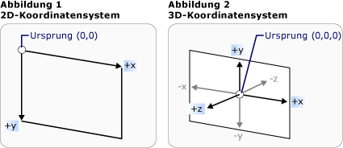
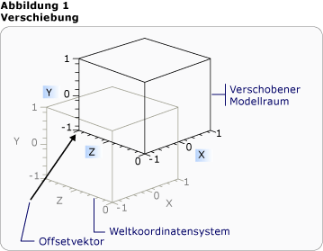
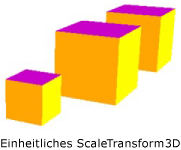
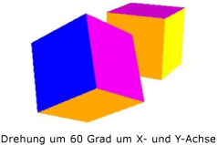

# Übersicht über 3D-Transformationen3-D Transformations Overview
In diesem Thema wird beschrieben, wie Transformationen im [!INCLUDE[TLA#tla_winclient](../../../../includes/tlasharptla-winclient-md.md)]-Grafiksystem auf 3D-Modelle angewendet werden.This topic describes how to apply transformations to 3-D models in the [!INCLUDE[TLA#tla_winclient](../../../../includes/tlasharptla-winclient-md.md)] graphics system. Mit Transformationen können Entwickler die Position und Größe von Modellen ändern und sie neu ausrichten, ohne die Basiswerte zu verändern, die sie definieren.Transformations allow the developer to reposition, resize, and reorient models without changing the base values that define them.  

## 3D-Koordinatenbereich3-D Coordinate Space  
 3D-Grafik Inhalte in [!INCLUDE[TLA#tla_winclient](../../../../includes/tlasharptla-winclient-md.md)] sind in einem Element <xref:System.Windows.Controls.Viewport3D>gekapselt, das an der zweidimensionalen Elementstruktur teilnehmen kann.3-D graphics content in [!INCLUDE[TLA#tla_winclient](../../../../includes/tlasharptla-winclient-md.md)] is encapsulated in an element, <xref:System.Windows.Controls.Viewport3D>, that can participate in the two-dimensional element structure. Das Grafiksystem behandelt Viewport3D als ein zweidimensionales visuelles Objekt, wie viele andere auch in [!INCLUDE[TLA#tla_winclient](../../../../includes/tlasharptla-winclient-md.md)].The graphics system treats Viewport3D as a two-dimensional visual element like many others in [!INCLUDE[TLA#tla_winclient](../../../../includes/tlasharptla-winclient-md.md)]. Viewport3D fungiert als Fenster – ein Anzeigebereich – in eine dreidimensionale Szene.Viewport3D functions as a window—a viewport—into a three-dimensional scene. Genauer gesagt handelt es sich um eine Oberfläche, auf die eine 3D-Szene projiziert wird.More accurately, it is a surface on which a 3-D scene is projected.  Obwohl Sie Viewport3D mit anderen 2D-Zeichenobjekten im selben Szenegraphen verwenden können, können Sie keine 2D- und 3D-Objekte in Viewport3D durchdringen.Although you can use Viewport3D with other 2-D drawing objects in the same scene graph, you cannot interpenetrate 2-D and 3-D objects within a Viewport3D. In der folgenden Erläuterung ist der beschriebene Koordinatenraum im Viewport3D-Element enthalten.In the following discussion, the coordinate space described is contained by the Viewport3D element.  
  
 Im [!INCLUDE[TLA#tla_winclient](../../../../includes/tlasharptla-winclient-md.md)]-Koordinatensystem für 2D-Grafiken befindet sich der Ursprung in der linken oberen Ecke der Renderingoberfläche (in der Regel der Bildschirm).The [!INCLUDE[TLA#tla_winclient](../../../../includes/tlasharptla-winclient-md.md)] coordinate system for 2-D graphics locates the origin in the upper left of the rendering surface (typically the screen). Im 2D-System verlaufen die positiven Werte der x-Achse nach rechts und die positiven Werte der y-Achse nach unten.In the 2-D system, positive x-axis values proceed to the right and positive y-axis values proceed downward. Im 3D-Koordinatensystem befindet sich der Ursprung hingegen in der Mitte des Bildschirms. Die positiven Werte der x-Achse verlaufen auch nach rechts, die positiven Werte der y-Achse verlaufen aber nach oben und die positiven Werte der z-Achse laufen vom Ursprung ausgehend auf den Betrachter zu.In the 3-D coordinate system, however, the origin is located in the center of the screen, with positive x-axis values proceeding to the right but positive y-axis values proceeding upward instead, and positive z-axis values proceeding outward from the origin, toward the viewer.  
  
   
Vergleich der KoordinatensystemeCoordinate System Comparison  
  
 Der von diesen Achsen definierte Raum ist der feststehende Verweisrahmen für 3D-Objekte in [!INCLUDE[TLA#tla_winclient](../../../../includes/tlasharptla-winclient-md.md)].The space defined by these axes is the stationary frame of reference for 3-D objects in [!INCLUDE[TLA#tla_winclient](../../../../includes/tlasharptla-winclient-md.md)]. Wenn Sie innerhalb dieses Raumes Modelle erstellen und Lichter und Kameras, um sie anzuzeigen, ist es hilfreich, diesen feststehenden Verweisrahmen oder „Weltenraum“ vom lokalen zu unterscheiden, den Sie beim Anwenden von Transformationen für jedes Modell erstellen.As you build models in this space and create lights and cameras to view them, it's helpful to distinguish this stationary frame of reference, or "world space," from the local frame of reference you create for each model when you apply transformations to it. Beachten Sie außerdem, dass Objekte im Weltenraum je nach der Kamera und den Einstellungen völlig anders oder überhaupt nicht angezeigt werden können. Die Position der Kamera ändert aber nicht die Position von Objekten im Weltenraum.Remember also that objects in world space might look entirely different, or not be visible at all, depending on light and camera settings, but the position of the camera does not change the location of objects in world space.  
  
## Transformieren von ModellenTransforming Models  
 Wenn Sie Modelle erstellen, verfügen diese über eine bestimmte Position in der Szene.When you create models, they have a particular location in the scene. Um die Position dieser Modelle in der Szene zu verändern, sie zu drehen oder ihre Größe zu ändern, sollten Sie nicht die Vertices ändern, die die Modelle selbst definieren.To move those models around in the scene, to rotate them, or to change their size, it's not practical to change the vertices that define the models themselves. Wenden Sie stattdessen wie in 2D-Modellen Transformationen auf Modelle an.Instead, just as in 2-D, you apply transformations to models.  
  
 Jedes Modell Objekt verfügt über eine <xref:System.Windows.Media.Media3D.Model3D.Transform%2A>-Eigenschaft, mit der Sie das Modell verschieben, neu ausrichten oder die Größe ändern können.Each model object has a <xref:System.Windows.Media.Media3D.Model3D.Transform%2A> property with which you can move, re-orient, or resize the model. Wenn Sie eine Transformation anwenden, versetzen Sie alle Punkte des Modells um den in der Transformation angegebenen Vektor oder Wert.When you apply a transform, you effectively offset all the points of the model by whatever vector or value is specified by the transform. Mit anderen Worten: Sie haben den Koordinatenbereich transformiert, in dem das Modell definiert ist (Modellraum), aber Sie haben noch nicht die Werte geändert, die die Geometrie des Modells im Koordinatensystem der gesamten Szene („Weltenraum“) ausmachen.In other words, you've transformed the coordinate space in which the model is defined ("model space"), but you haven't changed the values that make up the model's geometry in the coordinate system of the entire scene ("world space").  
  
## ÜbersetzungstransformationenTranslation Transformations  
 3D-Transformationen erben von der abstrakten Basisklasse <xref:System.Windows.Media.Media3D.Transform3D>; Hierzu gehören die affinen Transformations Klassen <xref:System.Windows.Media.Media3D.TranslateTransform3D>, <xref:System.Windows.Media.Media3D.ScaleTransform3D>und <xref:System.Windows.Media.Media3D.RotateTransform3D>.3-D transformations inherit from the abstract base class <xref:System.Windows.Media.Media3D.Transform3D>; these include the affine transform classes <xref:System.Windows.Media.Media3D.TranslateTransform3D>, <xref:System.Windows.Media.Media3D.ScaleTransform3D>, and <xref:System.Windows.Media.Media3D.RotateTransform3D>. Das [!INCLUDE[TLA#tla_winclient](../../../../includes/tlasharptla-winclient-md.md)] 3D-System stellt außerdem eine <xref:System.Windows.Media.Media3D.MatrixTransform3D> Klasse bereit, mit der Sie dieselben Transformationen in präziseren Matrix Vorgängen angeben können.The [!INCLUDE[TLA#tla_winclient](../../../../includes/tlasharptla-winclient-md.md)] 3-D system also provides a <xref:System.Windows.Media.Media3D.MatrixTransform3D> class that lets you specify the same transformations in more concise matrix operations.  
  
 <xref:System.Windows.Media.Media3D.TranslateTransform3D> verschiebt alle Punkte in der Model3D in die Richtung des Offset Vektors, den Sie mit den Eigenschaften "<xref:System.Windows.Media.Media3D.TranslateTransform3D.OffsetX%2A>", "<xref:System.Windows.Media.Media3D.TranslateTransform3D.OffsetY%2A>" und "<xref:System.Windows.Media.Media3D.TranslateTransform3D.OffsetZ%2A>" angeben.<xref:System.Windows.Media.Media3D.TranslateTransform3D> moves all the points in the Model3D in the direction of the offset vector you specify with the <xref:System.Windows.Media.Media3D.TranslateTransform3D.OffsetX%2A>, <xref:System.Windows.Media.Media3D.TranslateTransform3D.OffsetY%2A>, and <xref:System.Windows.Media.Media3D.TranslateTransform3D.OffsetZ%2A> properties. Bei einem Vertex eines Würfels auf (2,2,2) würde ein Offsetvektor von (0,1.6,1) den Vertex (2,2,2) auf (2,3.6,3).) verschieben.For example, given one vertex of a cube at (2,2,2), an offset vector of (0,1.6,1) would move that vertex (2,2,2) to (2,3.6,3). Der Vertex des Würfels befindet sich noch immer auf (2,2,2) im Modellraum. Da sich nun aber die Beziehung des Modellraums zum Weltenraum geändert hat, entsprechen die Koordinaten (2,2,2) im Modellraum den Koordinaten (2,3.6,3) im Weltenraum.The cube's vertex is still (2,2,2) in model space, but now that model space has changed its relationship to world space so that (2,2,2) in model space is (2,3.6,3) in world space.  
  
   
Übersetzung mit OffsetTranslation with Offset  
  
 In den folgenden Codebeispielen wird die Anwendung einer Übersetzung veranschaulicht.The following code examples show how to apply a translation.  
  
 [!code-xaml[animation3dgallery_snip#Translation3DAnimationExampleWholePage](~/samples/snippets/csharp/VS_Snippets_Wpf/Animation3DGallery_snip/CS/Translation3DAnimationExample.xaml#translation3danimationexamplewholepage)]  
  
## SkalierungstransformationenScale Transformations  
 <xref:System.Windows.Media.Media3D.ScaleTransform3D> ändert die Skalierung des Modells um einen angegebenen Skalierungs Vektor durch einen Verweis auf einen Mittelpunkt.<xref:System.Windows.Media.Media3D.ScaleTransform3D> changes the model's scale by a specified scale vector with reference to a center point. Geben Sie eine einheitliche Skalierung an, die das Modell um den gleichen Wert auf den x-, y- und z-Achsen skaliert, um die Größe des Modells proportional zu ändern.Specify a uniform scale, which scales the model by the same value in the X, Y, and Z axes, to change the model's size proportionally. Wenn Sie z. b. die Eigenschaften <xref:System.Windows.Media.ScaleTransform.ScaleX%2A>, <xref:System.Windows.Media.ScaleTransform.ScaleY%2A>und <xref:System.Windows.Media.Media3D.ScaleTransform3D.ScaleZ%2A> der Transformation auf 0,5 halbieren, wird die Größe des Modells festgelegt. Wenn die gleichen Eigenschaften auf 2 festgelegt werden, wird die Skalierung in allen drei Achsen verdoppelt.For example, setting the transform's <xref:System.Windows.Media.ScaleTransform.ScaleX%2A>, <xref:System.Windows.Media.ScaleTransform.ScaleY%2A>, and <xref:System.Windows.Media.Media3D.ScaleTransform3D.ScaleZ%2A> properties to 0.5 halves the size of the model; setting the same properties to 2 doubles its scale in all three axes.  
  
   
ScaleVector-BeispielScaleVector Example  
  
 Durch Angabe einer ungleichmäßigen Skalierungstransformation – eine Skalierungstransformation, deren x-, y- und z-Werte nicht alle identisch sind – kann ein Modell in einer oder zwei Dimensionen ohne Auswirkung auf die anderen gestreckt oder verkleinert werden.By specifying a non-uniform scale transformation—a scale transformation whose X, Y, and Z values are not all the same—you can cause a model to stretch or contract in one or two dimensions without affecting the others. Wenn Sie <xref:System.Windows.Media.ScaleTransform.ScaleX%2A> z. b. auf 1, <xref:System.Windows.Media.ScaleTransform.ScaleY%2A> auf 2 und <xref:System.Windows.Media.Media3D.ScaleTransform3D.ScaleZ%2A> auf 1 festlegen, würde das transformierte Modell in Höhe von Double, aber an der X-und Z-Achse unverändert bleiben.For example, setting <xref:System.Windows.Media.ScaleTransform.ScaleX%2A> to 1, <xref:System.Windows.Media.ScaleTransform.ScaleY%2A> to 2, and <xref:System.Windows.Media.Media3D.ScaleTransform3D.ScaleZ%2A> to 1 would cause the transformed model to double in height but remain unchanged along the X and Z axes.  
  
 Aufgrund von ScaleTransform3D erweitern oder verkleinern sich Vertices standardmäßig um den Ursprung (0,0,0).By default, ScaleTransform3D causes vertices to expand or contract about the origin (0,0,0). Wenn das Modell, das Sie transformieren möchten, nicht vom Ursprung aus gezeichnet wurde, wird eine Skalierung vom Ursprung aus das Modell nicht „an Ort und Stelle“ skalieren.If the model you want to transform is not drawn from the origin, however, scaling the model from the origin will not scale the model "in place." Stattdessen wird das Modell durch den Skalierungsvorgang sowohl übersetzt als auch skaliert, wenn die Vertices des Modells mit dem Skalierungsvektor multipliziert werden.Instead, when the model's vertices are multiplied by the scale vector, the scale operation will have the effect of translating the model as well as scaling it.  
  
   
Beispiel für die Skalierung um den MittelpunktScale Center Example  
  
 Zum horizontalen Skalieren eines Modells legen Sie den Mittelpunkt des Modells fest, indem Sie die Eigenschaften ScaleTransform3D's <xref:System.Windows.Media.ScaleTransform.CenterX%2A>, <xref:System.Windows.Media.ScaleTransform.CenterY%2A>und <xref:System.Windows.Media.Media3D.ScaleTransform3D.CenterZ%2A> festlegen.To scale a model "in place," specify the center of the model by setting the ScaleTransform3D's <xref:System.Windows.Media.ScaleTransform.CenterX%2A>, <xref:System.Windows.Media.ScaleTransform.CenterY%2A>, and <xref:System.Windows.Media.Media3D.ScaleTransform3D.CenterZ%2A> properties. Dadurch wird sichergestellt, dass das Grafiksystem den Modellbereich skaliert und dann in den Mittelpunkt des angegebenen <xref:System.Windows.Media.Media3D.Point3D>übersetzt.This ensures that the graphics system scales the model space and then translates it to center on the specified <xref:System.Windows.Media.Media3D.Point3D>. Wenn Sie das Modell umgekehrt um den Ursprung erstellt haben und geben einen anderen Mittelpunkt angeben, wird das Modell vom Ursprung weg übersetzt.Conversely, if you've built the model about the origin and specify a different center point, expect to see the model translated away from the origin.  
  
## RotationstransformationenRotation Transformations  
 Sie können ein Modell in 3D auf verschiedene Weise drehen.You can rotate a model in 3-D in several different ways. Eine normale Rotationstransformation gibt eine Achse und einen Drehwinkel um diese Achse an.A typical rotation transformation specifies an axis and an angle of rotation around that axis. Die <xref:System.Windows.Media.Media3D.RotateTransform3D>-Klasse ermöglicht es Ihnen, eine <xref:System.Windows.Media.Media3D.Rotation3D> mit der <xref:System.Windows.Media.Media3D.RotateTransform3D.Rotation%2A>-Eigenschaft zu definieren.The <xref:System.Windows.Media.Media3D.RotateTransform3D> class allows you to define a <xref:System.Windows.Media.Media3D.Rotation3D> with its <xref:System.Windows.Media.Media3D.RotateTransform3D.Rotation%2A> property. Anschließend geben Sie <xref:System.Windows.Media.Media3D.AxisAngleRotation3D.Axis%2A> und <xref:System.Windows.Media.Media3D.AxisAngleRotation3D.Angle%2A> Eigenschaften für Rotation3D, in diesem Fall einen <xref:System.Windows.Media.Media3D.AxisAngleRotation3D>, an, um die Transformation zu definieren.You then specify <xref:System.Windows.Media.Media3D.AxisAngleRotation3D.Axis%2A> and <xref:System.Windows.Media.Media3D.AxisAngleRotation3D.Angle%2A> properties on the Rotation3D, in this case an <xref:System.Windows.Media.Media3D.AxisAngleRotation3D>, to define the transformation. In den folgenden Beispielen wird ein Modell um 60 Grad um die y-Achse gedreht.The following examples rotate a model by 60 degrees around the Y axis.  
  
 [!code-xaml[animation3dgallery_snip#Rotate3DUsingAxisAngleRotation3DExampleWholePage](~/samples/snippets/csharp/VS_Snippets_Wpf/Animation3DGallery_snip/CS/Rotat3DUsingAxisAngleRotation3DExample.xaml#rotate3dusingaxisanglerotation3dexamplewholepage)]  
  
 Hinweis: [!INCLUDE[TLA#tla_winclient](../../../../includes/tlasharptla-winclient-md.md)] 3D ist ein rechtshändiges System, was bedeutet, dass ein positiver Winkelwert für eine Drehung eine Rotation gegen den Uhrzeigersinn um die Achse ergibt.Note:[!INCLUDE[TLA#tla_winclient](../../../../includes/tlasharptla-winclient-md.md)] 3-D is a right-handed system, which means that a positive angle value for a rotation results in a counter-clockwise rotation about the axis.  
  
 Bei Achsen Spitzen Drehungen wird die Drehung über den Ursprung angenommen, wenn für die Eigenschaften <xref:System.Windows.Media.Media3D.RotateTransform3D.CenterX%2A>, <xref:System.Windows.Media.Media3D.RotateTransform3D.CenterY%2A>und <xref:System.Windows.Media.Media3D.RotateTransform3D.CenterZ%2A> in RotateTransform3D kein Wert angegeben wurde.Axis-angle rotations assume rotation about the origin if a value is not specified for the <xref:System.Windows.Media.Media3D.RotateTransform3D.CenterX%2A>, <xref:System.Windows.Media.Media3D.RotateTransform3D.CenterY%2A>, and <xref:System.Windows.Media.Media3D.RotateTransform3D.CenterZ%2A> properties on RotateTransform3D. Wie bei der Skalierung ist es hilfreich zu wissen, dass die Rotation den gesamten Koordinatenraum des Modells transformiert.As with scaling, it's helpful to remember that the rotation transforms the model's entire coordinate space. Wenn das Modell nicht um den Ursprung erstellt wurde oder bereits übersetzt wurde, könnte die Drehung um den Ursprung und nicht an Ort und Stelle erfolgen.If the model was not created about the origin, or has been translated previously, the rotation might "pivot" about the origin instead of rotating in place.  
  
   
Drehung mit neuem, angegebenen MittelpunktRotation with new center specified  
  
 Geben Sie zum Drehen des Modells „an Ort und Stelle“ den tatsächlichen Mittelpunkt des Modells als Mittelpunkt der Rotation an.To rotate the model "in place," specify the model's actual center as the center of rotation. Da die Geometrie in der Regel um den Ursprung modelliert wird, sollten Sie zuerst die Größe des Modells anpassen (skalieren), dann die Ausrichtung festlegen (drehen) und es anschließend an die gewünschte Position verschieben (übersetzen). So erzielen Sie bei einer Reihe von Transformationen normalerweise das erwünschte Ergebnis.Because geometry is typically modeled about the origin, you can most often get the expected result of a set of transformations by first sizing the model (scaling it), then setting its orientation (rotating it), and finally moving it to the desired location (translating it).  
  
   
RotationsbeispieleRotation Example  
  
 Achsen-Winkel-Rotationen eignen sich für statische Transformationen und einige Animationen.Axis-angle rotations work well for static transformations and some animations. Denken Sie jedoch daran, ein Cube-Modell um die X-Achse um 60 Grad zu drehen, und um die Z-Achse um 45 Grad.However, consider rotating a cube model 60 degrees around the X axis, then 45 degrees around the Z axis. Sie können diese Transformation als zwei diskrete affine Transformationen oder als Matrix beschreiben.You can describe this transformation as two discrete affine transformations, or as a matrix. Die Animation der beschriebenen Rotation kann sich aber als problematisch herausstellen.However, it might be difficult to smoothly animate a rotation defined this way. Obwohl die Anfangs- und Endposition des Modells bei beiden Ansätzen identisch sind, sind die Zwischenpositionen des Modells rechnerisch nicht sicher.Although the beginning and ending positions of the model computed by either approach are the same, the intermediate positions taken by the model are computationally uncertain. Quaternionen stellen eine alternative Möglichkeit zum Berechnen der Interpolation zwischen dem Start und dem Ende einer Rotation dar.Quaternions represent an alternative way to compute the interpolation between the start and end of a rotation.  
  
 Eine Quaternion stellt eine Achse in einem 3D-Raum und eine Rotation um diese Achse dar.A quaternion represents an axis in 3-D space and a rotation around that axis. Eine Quaternion kann z.B. eine Achse (1,1,2) und eine Drehung um 50 Grad darstellen.For example, a quaternion might represent a (1,1,2) axis and a rotation of 50 degrees. Die Leistungsstärke von Quaternionen beim Definieren von Rotationen gründet in zwei Vorgängen, die Sie dafür ausführen können: die Zusammensetzung und die Interpolation.Quaternions’ power in defining rotations comes from the two operations that you can perform on them: composition and interpolation. Die auf eine Geometrie angewendete Zusammensetzung von zwei Quaternionen bedeutet, dass die Geometrie um Achse2 um Rotation2 und anschließend um Achse1 um Rotation1 gedreht wird.The composition of two quaternions applied to a geometry means "rotate the geometry around axis2 by rotation2, then rotate it around axis1 by rotation1." Mithilfe der Zusammensetzung können Sie diese zwei Rotationen der Geometrie kombinieren, um eine einzelne Quaternion zu erstellen, die das Ergebnis darstellt.By using composition, you can combine the two rotations on the geometry to get a single quaternion that represents the result. Da die Interpolation von Quaternionen einen eindeutigen Pfad von einer Achse und ihrer Ausrichtung zu einer anderen berechnen kann, können Sie vom Original zum zusammengesetzten Quaternion interpolieren, um einen reibungslosen Übergang von einem zum anderen zu erreichen und die Transformation dadurch zu animieren.Because quaternion interpolation can calculate a smooth and reasonable path from one axis and orientation to another, you can interpolate from the original to the composed quaternion to achieve a smooth transition from one to the other, enabling you to animate the transformation. Für Modelle, die Sie animieren möchten, können Sie eine Ziel <xref:System.Windows.Media.Media3D.Quaternion> für die Drehung angeben, indem Sie eine <xref:System.Windows.Media.Media3D.QuaternionRotation3D> für die <xref:System.Windows.Media.Media3D.RotateTransform3D.Rotation%2A>-Eigenschaft verwenden.For models that you want to animate, you can specify a destination <xref:System.Windows.Media.Media3D.Quaternion> for the rotation by using a <xref:System.Windows.Media.Media3D.QuaternionRotation3D> for the <xref:System.Windows.Media.Media3D.RotateTransform3D.Rotation%2A> property.  
  
## Verwenden von AuflistungstransformationenUsing Transformation Collections  
 Beim Erstellen einer Szene ist es üblich, mehr als eine Transformation auf ein Modell anzuwenden.When building a scene, it's common to apply more than one transformation to a model. Fügen Sie der <xref:System.Windows.Media.Media3D.Transform3DGroup.Children%2A>-Auflistung der <xref:System.Windows.Media.Media3D.Transform3DGroup>-Klasse Transformationen hinzu, um Transformationen bequem zu gruppieren und auf verschiedene Modelle in der Szene anzuwenden.Add transforms to the <xref:System.Windows.Media.Media3D.Transform3DGroup.Children%2A> collection of the <xref:System.Windows.Media.Media3D.Transform3DGroup> class to group transforms conveniently to apply to various models in the scene. Häufig ist es sinnvoll, eine Transformation in mehreren verschiedenen Gruppen wiederzuverwenden, so wie Sie auch ein Modell durch Anwenden eines anderen Satzes von Transformationen auf jede Instanz wiederverwenden können.It's often convenient to reuse a transformation in several different groups, in much the way that you can reuse a model by applying a different set of transforms to each instance. Beachten Sie, dass die Reihenfolge, in der die Transformationen der Auflistung hinzugefügt werden, relevant ist: Die ersten Transformationen in der Auflistung werden zuerst und die letzten zuletzt angewendet.Note that order in which the transformations are added to the collection is significant: transforms in the collection are applied from first to last.  
  
## Animieren von TransformationenAnimating Transformations  
 Die 3D-Implementierung von [!INCLUDE[TLA#tla_winclient](../../../../includes/tlasharptla-winclient-md.md)] gehört dem gleichen Zeitsteuerungs- und Animationssystem an wie die 2D-Grafiken.The [!INCLUDE[TLA#tla_winclient](../../../../includes/tlasharptla-winclient-md.md)] 3-D implementation participates in the same timing and animation system as 2-D graphics. Das heißt, dass Sie die Eigenschaften von dessen Modellen animieren müssen, um eine 3D-Szene zu animieren.In other words, to animate a 3-D scene, animate the properties of its models. Es ist möglich, die Eigenschaften von primitiven Typen direkt zu animieren. In der Regel ist es aber einfacher, Transformationen zu animieren, die die Position oder die Darstellung von Modellen ändern.It's possible to animate properties of primitives directly, but it's typically easier to animate transformations that change the position or appearance of models. Da Transformationen sowohl auf <xref:System.Windows.Media.Media3D.Model3DGroup>-Objekte als auch auf einzelne Modelle angewendet werden können, ist es möglich, einen Satz von Animationen auf die untergeordneten Elemente eines Model3DGroup und einen anderen Satz von Animationen auf eine Gruppe von Objekten anzuwenden.Because transformations can be applied to <xref:System.Windows.Media.Media3D.Model3DGroup> objects as well as individual models, it's possible to apply one set of animations to the children of a Model3Dgroup and another set of animations to a group of objects.  Hintergrundinformationen zum Zeitsteuerungs- und Animationssystem von [!INCLUDE[TLA#tla_winclient](../../../../includes/tlasharptla-winclient-md.md)] finden Sie unter [Übersicht über Animationen](animation-overview.md) und [Übersicht über Storyboards](storyboards-overview.md).For background information on the [!INCLUDE[TLA#tla_winclient](../../../../includes/tlasharptla-winclient-md.md)] timing and animation system, see [Animation Overview](animation-overview.md) and [Storyboards Overview](storyboards-overview.md).  
  
 Um ein Objekt in [!INCLUDE[TLA#tla_winclient](../../../../includes/tlasharptla-winclient-md.md)] zu animieren, erstellen Sie eine Zeitachse, definieren Sie eine Animation (die im Zeitablauf eine tatsächliche Änderung einiger Eigenschaftswerte darstellt), und geben Sie die Eigenschaft an, auf die die Animation angewendet werden soll.To animate an object in [!INCLUDE[TLA#tla_winclient](../../../../includes/tlasharptla-winclient-md.md)], create a timeline, define an animation (which is really a change in some property value over time), and specify the property to which to apply the animation. Diese Eigenschaft muss eine Eigenschaft von FrameworkElement sein.This property must be a property of a FrameworkElement. Da alle Objekte in einer 3D-Szene untergeordnete Elemente von Viewport3D sind, handelt es sich bei den Eigenschaften, an die sich alle Animationen richten, die Sie auf die Szene anwenden möchten, um Eigenschaften von Viewport3D-Eigenschaften.Because all the objects in a 3-D scene are children of Viewport3D, the properties targeted by any animation you want to apply to the scene are properties of properties of Viewport3D. Es ist wichtig, den Eigenschaftenpfad für die Animation sorgfältig anzupassen, da die Syntax sehr ausführlich sein kann.It's important to work out the property path for the animation carefully, because the syntax can be verbose.  
  
 Angenommen Sie möchten ein Objekt an Ort und Stelle drehen und außerdem eine Schwingbewegung darauf anwenden, um mehr von dem anzuzeigenden Objekt darzustellen.Suppose you want to rotate an object in place, but also to apply a swinging motion to expose more of the object to view. Sie können dazu RotateTransform3D auf das Modell anwenden und dessen Rotationsachse von einem Vektor zu einem anderen animieren.You might choose to apply a RotateTransform3D to the model, and animate the axis of its rotation from one vector to another. Im folgenden Codebeispiel wird veranschaulicht, wie ein <xref:System.Windows.Media.Animation.Vector3DAnimation> auf die Axis-Eigenschaft des Rotation3D der Transformation angewendet wird, wobei angenommen wird, dass das RotateTransform3D eine von mehreren Transformationen ist, die auf das Modell mit einem <xref:System.Windows.Media.TransformGroup>angewendet werden.The following code example demonstrates applying a <xref:System.Windows.Media.Animation.Vector3DAnimation> to the Axis property of the transformation's Rotation3D, assuming the RotateTransform3D to be one of several transforms applied to the model with a <xref:System.Windows.Media.TransformGroup>.  
  
 [!code-csharp[3doverview#3DOverview3DN1](~/samples/snippets/csharp/VS_Snippets_Wpf/3DOverview/CSharp/Window1.xaml.cs#3doverview3dn1)]
 [!code-vb[3doverview#3DOverview3DN1](~/samples/snippets/visualbasic/VS_Snippets_Wpf/3DOverview/visualbasic/window1.xaml.vb#3doverview3dn1)]  
  
 [!code-csharp[3doverview#3DOverview3DN3](~/samples/snippets/csharp/VS_Snippets_Wpf/3DOverview/CSharp/Window1.xaml.cs#3doverview3dn3)]
 [!code-vb[3doverview#3DOverview3DN3](~/samples/snippets/visualbasic/VS_Snippets_Wpf/3DOverview/visualbasic/window1.xaml.vb#3doverview3dn3)]  
  
 Verwenden Sie eine ähnliche Syntax, um auf andere zu verschiebende Transformationseigenschaften abzuzielen oder das Objekt zu skalieren.Use a similar syntax to target other transformation properties to move or scale the object.  Beispielsweise können Sie eine <xref:System.Windows.Media.Animation.Point3DAnimation> auf die ScaleCenter-Eigenschaft einer Skalierungs Transformation anwenden, um zu bewirken, dass die Form eines Modells reibungslos verzerrt wird.For example, you might apply a <xref:System.Windows.Media.Animation.Point3DAnimation> to the ScaleCenter property on a scale transform to cause a model to smoothly distort its shape.  
  
 Obwohl in den vorangehenden Beispielen die Eigenschaften von <xref:System.Windows.Media.Media3D.GeometryModel3D>transformiert werden, ist es auch möglich, die Eigenschaften anderer Modelle in der Szene zu transformieren.Although the preceding examples transform the properties of <xref:System.Windows.Media.Media3D.GeometryModel3D>, it’s also possible to transform the properties of other models in the scene.  Durch die Animation von Übersetzungen, die z.B. auf Lichtobjekte angewendet werden, können Sie wechselnde Licht- und Schatteneffekte erstellen, die die Darstellung eines Modells eindrucksvoll ändern.By animating translations applied to Light objects, for example, you can create moving light and shadow effects that can dramatically change the appearance of your models.  
  
 Da Kameras auch Modelle sind, können Kameraeigenschaften ebenfalls transformiert werden.Because cameras are also models, it’s possible to transform camera properties as well.  Sie können zwar die Darstellung der Szene durch die Transformation der Kameraposition oder der Ebenenabstände (also die Projektion der gesamten Szene) ändern, allerdings ergeben viele der so erzielten Effekte als auf die Modellposition angewendete Transformationen optisch kaum Sinn für den Zuschauer.While you can certainly change the appearance of the scene by transforming the camera location or plane distances—in effect, transforming the entire scene projection—note that many of the effects you achieve this way may not make as much "visual sense" to the viewer as transformations applied to the location or position of the models in the scene.  
  
## Siehe auchSee also

- [Übersicht über 3D-Grafiken3-D Graphics Overview](3-d-graphics-overview.md)
- [Übersicht über TransformationenTransforms Overview](transforms-overview.md)
- [Beispiel für 2D-Transformation2-D Transforms Sample](https://github.com/Microsoft/WPF-Samples/tree/master/Graphics/2DTransforms)
