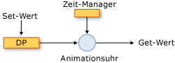
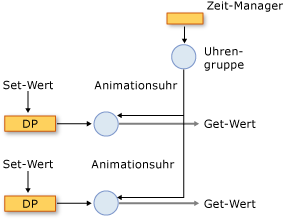
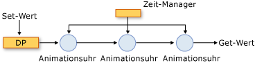

# Übersicht über das Animations- und Zeitsteuerungssystem
In diesem Thema wird beschrieben, <xref:System.Windows.Media.Animation.Timeline>wie <xref:System.Windows.Media.Animation.Clock> das Timingsystem die Animationen, , und Klassen zum Animieren von Eigenschaften verwendet.  
  

## Voraussetzungen  
 Um dieses Thema zu verstehen, sollten Sie [!INCLUDE[TLA2#tla_winclient](../../../../includes/tla2sharptla-winclient-md.md)]-Animationen zum Animieren von Eigenschaften verwenden können, wie in [Übersicht über Animationen](animation-overview.md) beschrieben. Auch Kenntnisse über Abhängigkeitseigenschaften sind hilfreich. Weitere Informationen finden Sie unter [Übersicht über Abhängigkeitseigenschaften](../advanced/dependency-properties-overview.md).  
  

## Zeitachsen und Uhren  
 In der [Animationsübersicht](animation-overview.md) wurde beschrieben, wie ein <xref:System.Windows.Media.Animation.Timeline> Zeitsegment <xref:System.Windows.Media.Animation.Timeline> dargestellt wird, und eine Animation ist ein Typ, der Ausgabewerte erzeugt. An sich <xref:System.Windows.Media.Animation.Timeline>tut ein , nichts anderes, als nur ein Segment der Zeit zu beschreiben. Es ist das <xref:System.Windows.Media.Animation.Clock> Objekt der Zeitleiste, das die eigentliche Arbeit macht. Ebenso wird die Animation nicht wirklich Eigenschaften animieren: Eine Animationsklasse beschreibt, <xref:System.Windows.Media.Animation.Clock> wie Ausgabewerte berechnet werden sollen, aber es ist die, die für die Animation erstellt wurde, die die Animationsausgabe steuert und sie auf Eigenschaften anwendet.  
  
 A <xref:System.Windows.Media.Animation.Clock> ist ein spezieller Objekttyp, der den zeitbezogenen Laufzeitstatus für die <xref:System.Windows.Media.Animation.Timeline>beibehält. Es bietet drei Bits von Informationen, die für <xref:System.Windows.Media.Animation.Clock.CurrentTime%2A> <xref:System.Windows.Media.Animation.Clock.CurrentProgress%2A>das <xref:System.Windows.Media.Animation.Clock.CurrentState%2A>Animations- und Timing-System unerlässlich sind: , , und . A <xref:System.Windows.Media.Animation.Clock> bestimmt die aktuelle Zeit, den Fortschritt und den <xref:System.Windows.Media.Animation.Timeline>Status, indem die Timing-Verhalten verwendet werden, die durch : <xref:System.Windows.Media.Animation.Timeline.Duration%2A>, <xref:System.Windows.Media.Animation.Timeline.RepeatBehavior%2A>, <xref:System.Windows.Media.Animation.Timeline.AutoReverse%2A>usw. beschrieben werden.  
  
 In den meisten <xref:System.Windows.Media.Animation.Clock> Fällen wird automatisch eine für Ihre Zeitachse erstellt. Wenn Sie mit <xref:System.Windows.Media.Animation.Storyboard> einer <xref:System.Windows.Media.Animation.Animatable.BeginAnimation%2A> oder der Methode animieren, werden automatisch Uhren für Ihre Zeitachsen und Animationen erstellt und auf ihre Zieleigenschaften angewendet. Sie können auch <xref:System.Windows.Media.Animation.Clock> eine explizit <xref:System.Windows.Media.Animation.Timeline.CreateClock%2A> erstellen, <xref:System.Windows.Media.Animation.Timeline>indem Sie die Methode Ihrer verwenden. Die <xref:System.Windows.Media.MediaTimeline.CreateClock%2A?displayProperty=nameWithType> Methode erstellt eine Uhr des <xref:System.Windows.Media.Animation.Timeline> entsprechenden Typs für den, auf dem sie aufgerufen wird. Wenn <xref:System.Windows.Media.Animation.Timeline> die untergeordnete Zeitachsen <xref:System.Windows.Media.Animation.Clock> enthält, werden auch Objekte für sie erstellt. Die <xref:System.Windows.Media.Animation.Clock> resultierenden Objekte sind in Bäumen <xref:System.Windows.Media.Animation.Timeline> angeordnet, die der Struktur der Objektstruktur entsprechen, aus der sie erstellt werden.  
  
 Es gibt verschiedene Typen von Uhren für verschiedene Typen von Zeitachsen. Die folgende Tabelle <xref:System.Windows.Media.Animation.Clock> zeigt die Typen, <xref:System.Windows.Media.Animation.Timeline> die einigen der verschiedenen Typen entsprechen.  
  
|Zeitachsentypen|Typ der Uhr|Zweck der Uhr|  
|-------------------|----------------|-------------------|  
|Animation (erbt <xref:System.Windows.Media.Animation.AnimationTimeline>von )|<xref:System.Windows.Media.Animation.AnimationClock>|Generiert Ausgabewerte für eine Abhängigkeitseigenschaft|  
|<xref:System.Windows.Media.MediaTimeline>|<xref:System.Windows.Media.MediaClock>|Verarbeitet eine Mediendatei|  
|<xref:System.Windows.Media.Animation.ParallelTimeline>|<xref:System.Windows.Media.Animation.ClockGroup>|Gruppiert und steuert <xref:System.Windows.Media.Animation.Clock> seine untergeordneten Objekte|  
|<xref:System.Windows.Media.Animation.Storyboard>|<xref:System.Windows.Media.Animation.ClockGroup>|Gruppiert und steuert <xref:System.Windows.Media.Animation.Clock> seine untergeordneten Objekte|  
  
 Sie können <xref:System.Windows.Media.Animation.AnimationClock> alle Objekte, die Sie erstellen, mithilfe der <xref:System.Windows.Media.Animation.IAnimatable.ApplyAnimationClock%2A> Methode auf kompatible Abhängigkeitseigenschaften anwenden.  
  
 In rechenintensiven Szenarios, z. B. Animieren einer großen Anzahl ähnlicher Objekte verwalten Ihre eigenen <xref:System.Windows.Media.Animation.Clock> verwenden, kann Leistungsvorteile bieten.  
  

## Uhren und der Zeit-Manager  
 Wenn Sie Objekte [!INCLUDE[TLA2#tla_winclient](../../../../includes/tla2sharptla-winclient-md.md)]in animieren, ist <xref:System.Windows.Media.MediaPlayer.Clock%2A> es der Zeitmanager, der die für Ihre Zeitachsen erstellten Objekte verwaltet. Der Zeit-Manager ist der Stamm einer Struktur von <xref:System.Windows.Media.MediaPlayer.Clock%2A> Objekten und steuert den Zeitablauf in dieser Struktur.  Ein Zeit-Manager wird automatisch für jede [!INCLUDE[TLA2#tla_winclient](../../../../includes/tla2sharptla-winclient-md.md)]-Anwendung erstellt und ist für den Anwendungsentwickler nicht sichtbar. Der Zeit-Manager „tickt“ mehrmals pro Sekunde. Die tatsächliche Anzahl von Ticks pro Sekunde variiert je nach den verfügbaren Systemressourcen. Während jedes dieser Ticks berechnet der Zeitmanager den <xref:System.Windows.Media.Animation.ClockState.Active> <xref:System.Windows.Media.Animation.Clock> Status aller Objekte in der Zeitstruktur.  
  
 Die folgende Abbildung zeigt die Beziehung <xref:System.Windows.Media.Animation.AnimationClock>zwischen dem Zeitmanager und einer animierten Abhängigkeitseigenschaft.  
  
   
Animieren einer Eigenschaft  
  
 Wenn der Zeitmanager tickt, aktualisiert <xref:System.Windows.Media.Animation.ClockState.Active> <xref:System.Windows.Media.Animation.Clock> er die Uhrzeit jeder In-/Anwendung. Wenn <xref:System.Windows.Media.Animation.Clock> es <xref:System.Windows.Media.Animation.AnimationClock>sich um <xref:System.Windows.Media.Animation.AnimationTimeline.GetCurrentValue%2A> ein handelt, verwendet er die Methode der, aus der <xref:System.Windows.Media.Animation.AnimationTimeline> er erstellt wurde, um den aktuellen Ausgabewert zu berechnen. Der <xref:System.Windows.Media.Animation.AnimationClock> liefert <xref:System.Windows.Media.Animation.AnimationTimeline> die mit der aktuellen ortszeiten Zeit, einem Eingabewert, der in der Regel der Basiswert der Eigenschaft ist, und einem Standardzielwert. Wenn Sie den Wert einer animierten <xref:System.Windows.DependencyObject.GetValue%2A> Eigenschaft mithilfe der Methode oder ihres <xref:System.Windows.Media.Animation.AnimationClock>CLR-Accessors abrufen, erhalten Sie die Ausgabe der .  
  
#### Uhrgruppen  
 Im vorherigen Abschnitt wurde beschrieben, <xref:System.Windows.Media.Animation.Clock> wie es verschiedene Objekttypen für verschiedene Arten von Zeitachsen gibt. Die folgende Abbildung zeigt die Beziehung <xref:System.Windows.Media.Animation.ClockGroup>zwischen <xref:System.Windows.Media.Animation.AnimationClock>dem Zeitmanager, einer , an und einer animierten Abhängigkeitseigenschaft. A <xref:System.Windows.Media.Animation.ClockGroup> wird für Zeitachsen erstellt, die andere <xref:System.Windows.Media.Animation.Storyboard> Zeitachsen gruppieren, z. B. die Klasse, die Animationen und andere Zeitachsen gruppiert.  
  
   
Eine ClockGroup  
  
#### Komposition  
 Es ist möglich, mehrere Uhren einer einzelnen Eigenschaft zuzuordnen. Jede Uhr verwendet dann den Ausgabewert der vorangehenden Uhr als Basiswert. Die folgende Abbildung <xref:System.Windows.Media.Animation.AnimationClock> zeigt drei Objekte, die auf dieselbe Eigenschaft angewendet werden. Uhr1 verwendet den Basiswert der animierten Eigenschaft als Eingabe und verwendet ihn, um die Ausgabe zu generieren. Uhr2 nimmt die Ausgabe von Uhr1 als Eingabe und verwendet sie, um die Ausgabe zu generieren. Uhr3 nimmt die Ausgabe von Uhr2 als Eingabe und verwendet sie, um die Ausgabe zu generieren. Wenn mehrere Uhren gleichzeitig dieselbe Eigenschaft beeinflussen, befinden sie sich in einer Kompositionskette.  
  
   
Eine Kompositionskette  
  
 Beachten Sie, dass zwar eine Beziehung zwischen <xref:System.Windows.Media.Animation.AnimationClock> der Eingabe und Ausgabe der Objekte in der Kompositionskette erstellt wird, ihr Timingverhalten jedoch nicht beeinträchtigt wird. <xref:System.Windows.Media.Animation.Clock> Objekte (einschließlich <xref:System.Windows.Media.Animation.AnimationClock> Objekte) haben eine hierarchische Abhängigkeit von ihren übergeordneten <xref:System.Windows.Media.Animation.Clock> Objekten.  
  
 Um mehrere Takte auf dieselbe Eigenschaft <xref:System.Windows.Media.Animation.HandoffBehavior.Compose> <xref:System.Windows.Media.Animation.HandoffBehavior> anzuwenden, <xref:System.Windows.Media.Animation.Storyboard>verwenden Sie <xref:System.Windows.Media.Animation.AnimationClock>die beim Anwenden einer , Animation oder .  
  
#### Tick- und Ereigniskonsolidierung  
 Zusätzlich zum Berechnen von Ausgabewerten verrichtet der Zeit-Manager andere Aufgaben bei jedem Tick: Er bestimmt den Zustand jeder Uhr und löst ggf. Ereignisse aus.  
  
 Wenn Ticks häufiger auftreten, kann zwischen den einzelnen Ticks Vieles geschehen. Beispielsweise kann <xref:System.Windows.Media.Animation.Clock> ein angehalten, gestartet und erneut angehalten werden, in diesem Fall hat sich sein <xref:System.Windows.Media.Animation.Clock.CurrentState%2A> Wert dreimal geändert. Theoretisch könnte <xref:System.Windows.Media.Animation.Clock.CurrentStateInvalidated> das Ereignis mehrmals in einem tick ausgelöst werden; Die Timing-Engine konsolidiert jedoch Ereignisse, <xref:System.Windows.Media.Animation.Clock.CurrentStateInvalidated> sodass das Ereignis höchstens einmal pro Tick ausgelöst werden kann. Dies gilt für alle Timing-Ereignisse: Höchstens ein Ereignis <xref:System.Windows.Media.Animation.Clock> jedes Typs wird für ein bestimmtes Objekt ausgelöst.  
  
 Wenn <xref:System.Windows.Media.Animation.Clock> ein Status wechselt und in seinen ursprünglichen Zustand zwischen <xref:System.Windows.Media.Animation.ClockState.Active> <xref:System.Windows.Media.Animation.ClockState.Stopped> Ticks <xref:System.Windows.Media.Animation.ClockState.Active>zurückkehrt (z. B. wechseln von zu und zurück zu ), tritt das zugeordnete Ereignis weiterhin auf.  
  
 Weitere Informationen zu Zeitsteuerungsereignissen finden Sie unter [Übersicht über Zeitsteuerungsereignisse](timing-events-overview.md).  
  

## Aktuelle Werte und Basiswerte von Eigenschaften  
 Eine animierbare Eigenschaft kann zwei Werte haben: einen Basiswert und einen aktuellen Wert. Wenn Sie die Eigenschaft mit ihrem <xref:System.Windows.DependencyObject.SetValue%2A> CLR-Accessor oder der Methode festlegen, legen Sie den Basiswert fest. Wenn eine Eigenschaft nicht animiert ist, sind der Basiswert und der aktuelle Wert identisch.  
  
 Wenn Sie eine Eigenschaft <xref:System.Windows.Media.Animation.AnimationClock> animieren, legt der den *aktuellen* Wert der Eigenschaft fest. Das Abrufen des Werts der Eigenschaft über <xref:System.Windows.DependencyObject.GetValue%2A> den CLR-Accessor oder die Methode gibt die Ausgabe <xref:System.Windows.Media.Animation.AnimationClock> des when the <xref:System.Windows.Media.Animation.AnimationClock> is <xref:System.Windows.Media.Animation.ClockState.Active> oder <xref:System.Windows.Media.Animation.ClockState.Filling>zurück. Sie können den Basiswert der Eigenschaft <xref:System.Windows.Media.Animation.IAnimatable.GetAnimationBaseValue%2A> mithilfe der Methode abrufen.  
  
## Weitere Informationen

- [Übersicht über Animationen](animation-overview.md)
- [Übersicht über Zeitsteuerungsereignisse](timing-events-overview.md)
- [Übersicht über Zeitsteuerungsverhalten](timing-behaviors-overview.md)
