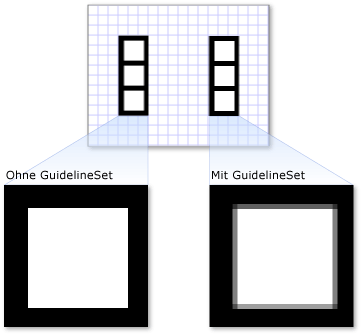

# Übersicht über Zeichnungsobjekte
In diesem <xref:System.Windows.Media.Drawing> Thema werden Objekte vorgestellt und beschrieben, wie sie zum effizienten Zeichnen von Shapes, Bitmaps, Text und Medien verwendet werden. Verwenden <xref:System.Windows.Media.Drawing> Sie Objekte, wenn Sie <xref:System.Windows.Media.DrawingBrush>ClipArt <xref:System.Windows.Media.Visual> erstellen, mit einem malen oder Objekte verwenden.  

## Was ist ein Zeichnungsobjekt?  
 Ein <xref:System.Windows.Media.Drawing> Objekt beschreibt sichtbaren Inhalt, z. B. eine Form, Bitmap, ein Video oder eine Textzeile. Verschiedene Arten von Zeichnungen beschreiben verschiedene Arten von Inhalten. Im Folgenden finden Sie eine Liste der unterschiedlichen Typen von Zeichnungsobjekten.  
  
- <xref:System.Windows.Media.GeometryDrawing>– Zeichnet eine Form.  
  
- <xref:System.Windows.Media.ImageDrawing>– Zeichnet ein Bild.  
  
- <xref:System.Windows.Media.GlyphRunDrawing>– Zeichnet Text.  
  
- <xref:System.Windows.Media.VideoDrawing>– Gibt eine Audio- oder Videodatei ab.  
  
- <xref:System.Windows.Media.DrawingGroup>– Zeichnet andere Zeichnungen. Verwenden Sie eine Zeichnungsgruppe, um andere Zeichnungen in einer zusammengesetzten Zeichnung zu kombinieren.  
  
 <xref:System.Windows.Media.Drawing>Objekte sind vielseitig; Es gibt viele Möglichkeiten, <xref:System.Windows.Media.Drawing> wie Sie ein Objekt verwenden können.  
  
- Sie können es als Bild <xref:System.Windows.Media.DrawingImage> anzeigen, <xref:System.Windows.Controls.Image> indem Sie ein und ein Steuerelement verwenden.  
  
- Sie können es <xref:System.Windows.Media.DrawingBrush> mit einem verwenden, um <xref:System.Windows.Controls.Page.Background%2A> ein <xref:System.Windows.Controls.Page>Objekt zu malen, z. B. das einer .  
  
- Sie können es verwenden, um <xref:System.Windows.Media.DrawingVisual>das Erscheinungsbild einer zu beschreiben.  
  
- Sie können damit den Inhalt einer <xref:System.Windows.Media.Visual>aufzählen.  
  
 WPF bietet andere Arten von Objekten, zeichnen Formen, Bitmaps, Text und Medien. Sie können z. <xref:System.Windows.Shapes.Shape> B. auch Objekte <xref:System.Windows.Controls.MediaElement> zum Zeichnen von Shapes verwenden, und das Steuerelement bietet eine weitere Möglichkeit, Ihrer Anwendung Video hinzuzufügen. Wann sollten Sie <xref:System.Windows.Media.Drawing> also Objekte verwenden? Wenn Sie Funktionen auf Frameworkebene opfern können, <xref:System.Windows.Freezable> um Leistungsvorteile zu erzielen, oder wenn Sie Features benötigen. Da <xref:System.Windows.Media.Drawing> Objekte [layout,](../advanced/layout.md)eingabe- und fokussierend nicht unterstützt werden, bieten sie Leistungsvorteile, die sie <xref:System.Windows.Media.Visual> ideal für die Beschreibung von Hintergründen, ClipArt und für das Zeichnen auf niedriger Ebene mit Objekten machen.  
  
 Da es sich <xref:System.Windows.Freezable> um <xref:System.Windows.Media.Drawing> ein Typobjekt handelt, erhalten Objekte mehrere spezielle Features, darunter die folgenden: Sie können als [Ressourcen](../../../desktop-wpf/fundamentals/xaml-resources-define.md)deklariert, von mehreren Objekten gemeinsam genutzt, schreibgeschützt gemacht werden, um die Leistung zu verbessern, geklont und threadsicher gemacht werden. Weitere Informationen zu den verschiedenen <xref:System.Windows.Freezable> Features, die von Objekten bereitgestellt werden, finden Sie in der [Übersicht über freisetzbare Objekte](../advanced/freezable-objects-overview.md).  
  

## Zeichnen einer Form  
 Zum Zeichnen einer Form <xref:System.Windows.Media.GeometryDrawing>verwenden Sie eine . Die <xref:System.Windows.Media.GeometryDrawing.Geometry%2A> Eigenschaft einer Geometriezeichnung beschreibt die <xref:System.Windows.Media.GeometryDrawing.Brush%2A> zu zeichnende Form, ihre Eigenschaft beschreibt, <xref:System.Windows.Media.GeometryDrawing.Pen%2A> wie das Innere der Form gezeichnet werden soll, und ihre Eigenschaft beschreibt, wie ihre Kontur gezeichnet werden soll.  
  
 Im folgenden Beispiel <xref:System.Windows.Media.GeometryDrawing> wird ein zum Zeichnen einer Form verwendet. Die Form wird <xref:System.Windows.Media.GeometryGroup> durch <xref:System.Windows.Media.EllipseGeometry> ein und zwei Objekte beschrieben. Das Innere der Form ist <xref:System.Windows.Media.LinearGradientBrush> mit einem bemalt <xref:System.Windows.Media.Brushes.Black%2A> <xref:System.Windows.Media.Pen>und seine Umrisse sind mit einem gezeichnet.  
  
 In diesem Beispiel <xref:System.Windows.Media.GeometryDrawing>wird das folgende erstellt.  
  
   
Eine GeometryDrawing  
  
 [!code-csharp[DrawingMiscSnippets_snip#GeometryDrawingExampleInline](~/samples/snippets/csharp/VS_Snippets_Wpf/DrawingMiscSnippets_snip/CSharp/GeometryDrawingExample.cs#geometrydrawingexampleinline)]
 [!code-xaml[DrawingMiscSnippets_snip#GeometryDrawingExampleInline](~/samples/snippets/xaml/VS_Snippets_Wpf/DrawingMiscSnippets_snip/XAML/GeometryDrawingExample.xaml#geometrydrawingexampleinline)]  
  
 Das vollständige Beispiel finden Sie unter [Erstellen einer GeometryDrawing](how-to-create-a-geometrydrawing.md).  
  
 Andere <xref:System.Windows.Media.Geometry> Klassen, <xref:System.Windows.Media.PathGeometry> z. B. ermöglichen es Ihnen, komplexere Formen zu erstellen, indem Sie Kurven und Bogen erstellen. Weitere Informationen <xref:System.Windows.Media.Geometry> zu Objekten finden Sie in der [Geometrieübersicht](geometry-overview.md).  
  
 Weitere Informationen zum Zeichnen von Shapes, die <xref:System.Windows.Media.Drawing> keine Objekte verwenden, finden Sie [unter Shapes und Basiszeichnung in der WPF-Übersicht](shapes-and-basic-drawing-in-wpf-overview.md).  
  

## Zeichnen eines Bilds  
 Zum Zeichnen eines Bildes <xref:System.Windows.Media.ImageDrawing>verwenden Sie eine . Die <xref:System.Windows.Media.ImageDrawing> Eigenschaft <xref:System.Windows.Media.ImageDrawing.ImageSource%2A> eines Objekts beschreibt das <xref:System.Windows.Media.ImageDrawing.Rect%2A> zu zeichnende Bild, und seine Eigenschaft definiert den Bereich, in dem das Bild gezeichnet wird.  
  
 Im folgende Beispiel wird ein Bild in ein Rechteck bei (75,75) gezeichnet, das 100 x 100 Pixel groß ist. Die folgende Abbildung <xref:System.Windows.Media.ImageDrawing> zeigt die im Beispiel erstellte Abbildung. Ein grauer Rahmen wurde hinzugefügt, <xref:System.Windows.Media.ImageDrawing>um die Grenzen der anzuzeigen.  
  
   
Eine ImageDrawing mit den Maßen 100 x 100  
  
 [!code-csharp[DrawingMiscSnippets_snip#ImageDrawing100by100Inline](~/samples/snippets/csharp/VS_Snippets_Wpf/DrawingMiscSnippets_snip/CSharp/ImageDrawingExample.cs#imagedrawing100by100inline)]
 [!code-xaml[DrawingMiscSnippets_snip#ImageDrawing100by100Inline](~/samples/snippets/xaml/VS_Snippets_Wpf/DrawingMiscSnippets_snip/XAML/ImageDrawingExample.xaml#imagedrawing100by100inline)]  
  
 Weitere Informationen zu Bildern finden Sie unter der [Überblick über die Bildverarbeitung](imaging-overview.md).  
  

## Wiedergeben von Medien (nur Code)  
  
> [!NOTE]
> Obwohl Sie eine <xref:System.Windows.Media.VideoDrawing> [!INCLUDE[TLA#tla_xaml](../../../../includes/tlasharptla-xaml-md.md)]in deklarieren können, können Sie ihre Medien nur mit Code laden und wiedergeben. Um Videos [!INCLUDE[TLA#tla_xaml](../../../../includes/tlasharptla-xaml-md.md)]in abzuspielen, verwenden Sie stattdessen eine. <xref:System.Windows.Controls.MediaElement>  
  
 Um eine Audio- oder Videodatei <xref:System.Windows.Media.VideoDrawing> wiederzugeben, verwenden Sie eine und eine <xref:System.Windows.Media.MediaPlayer>. Es gibt zwei Methoden zum Laden und Wiedergeben von Medien. Der erste ist, <xref:System.Windows.Media.MediaPlayer> a <xref:System.Windows.Media.VideoDrawing> und a selbst zu verwenden, <xref:System.Windows.Media.MediaTimeline> und der <xref:System.Windows.Media.MediaPlayer> zweite <xref:System.Windows.Media.VideoDrawing>Weg ist, Ihre eigenen zu erstellen, um mit dem und zu verwenden.  
  
> [!NOTE]
> Wenn Sie Medien mit Ihrer Anwendung verteilen, können Sie keine Mediendatei als Ressource verwenden, wie Sie das mit einem Bild machen würden. In der Projektdatei müssen Sie stattdessen den Medientyp auf `Content` festlegen, und `CopyToOutputDirectory` auf `PreserveNewest` oder `Always`.  
  
 Um Medien abzuspielen, <xref:System.Windows.Media.MediaTimeline>ohne eigene zu erstellen, führen Sie die folgenden Schritte aus.  
  
1. Erstellen eines <xref:System.Windows.Media.MediaPlayer>-Objekts  
  
     [!code-csharp[DrawingMiscSnippets_snip#VideoDrawingExampleInline1](~/samples/snippets/csharp/VS_Snippets_Wpf/DrawingMiscSnippets_snip/CSharp/VideoDrawingExample.cs#videodrawingexampleinline1)]  
  
2. Verwenden <xref:System.Windows.Media.MediaPlayer.Open%2A> Sie die Methode zum Laden der Mediendatei.  
  
     [!code-csharp[DrawingMiscSnippets_snip#VideoDrawingExampleInline2](~/samples/snippets/csharp/VS_Snippets_Wpf/DrawingMiscSnippets_snip/CSharp/VideoDrawingExample.cs#videodrawingexampleinline2)]  
  
3. Erstellen Sie eine <xref:System.Windows.Media.VideoDrawing>.  
  
     [!code-csharp[DrawingMiscSnippets_snip#VideoDrawingExampleInline3](~/samples/snippets/csharp/VS_Snippets_Wpf/DrawingMiscSnippets_snip/CSharp/VideoDrawingExample.cs#videodrawingexampleinline3)]  
  
4. Geben Sie die Größe und den <xref:System.Windows.Media.VideoDrawing.Rect%2A> Speicherort für <xref:System.Windows.Media.VideoDrawing>das Zeichnen der Medien an, indem Sie die Eigenschaft der festlegen.  
  
     [!code-csharp[DrawingMiscSnippets_snip#VideoDrawingExampleInline4](~/samples/snippets/csharp/VS_Snippets_Wpf/DrawingMiscSnippets_snip/CSharp/VideoDrawingExample.cs#videodrawingexampleinline4)]  
  
5. Legen <xref:System.Windows.Media.VideoDrawing.Player%2A> Sie die <xref:System.Windows.Media.VideoDrawing> Eigenschaft <xref:System.Windows.Media.MediaPlayer> des mit dem fest, das Sie erstellt haben.  
  
     [!code-csharp[DrawingMiscSnippets_snip#VideoDrawingExampleInline5](~/samples/snippets/csharp/VS_Snippets_Wpf/DrawingMiscSnippets_snip/CSharp/VideoDrawingExample.cs#videodrawingexampleinline5)]  
  
6. Verwenden <xref:System.Windows.Media.MediaPlayer.Play%2A> Sie die <xref:System.Windows.Media.MediaPlayer> Methode des, um mit der Wiedergabe der Medien zu beginnen.  
  
     [!code-csharp[DrawingMiscSnippets_snip#VideoDrawingExampleInline6](~/samples/snippets/csharp/VS_Snippets_Wpf/DrawingMiscSnippets_snip/CSharp/VideoDrawingExample.cs#videodrawingexampleinline6)]  
  
 Im folgenden Beispiel <xref:System.Windows.Media.VideoDrawing> werden <xref:System.Windows.Media.MediaPlayer> a und a verwendet, um eine Videodatei einmal wiederzugeben.  
  
 [!code-csharp[DrawingMiscSnippets_snip#VideoDrawingExampleInline](~/samples/snippets/csharp/VS_Snippets_Wpf/DrawingMiscSnippets_snip/CSharp/VideoDrawingExample.cs#videodrawingexampleinline)]  
  
 Um zusätzliche Timing-Kontrolle über das <xref:System.Windows.Media.MediaTimeline> Medium <xref:System.Windows.Media.MediaPlayer> <xref:System.Windows.Media.VideoDrawing> zu erhalten, verwenden Sie eine mit und Objekte. Mit <xref:System.Windows.Media.MediaTimeline> der können Sie angeben, ob das Video wiederholt werden soll. Um eine <xref:System.Windows.Media.MediaTimeline> mit <xref:System.Windows.Media.VideoDrawing>a zu verwenden, führen Sie die folgenden Schritte aus:  
  
1. Deklarieren Sie die <xref:System.Windows.Media.MediaTimeline> und legen Sie ihr Timingverhalten fest.  
  
     [!code-csharp[DrawingMiscSnippets_snip#RepeatingVideoDrawingExampleInline1](~/samples/snippets/csharp/VS_Snippets_Wpf/DrawingMiscSnippets_snip/CSharp/VideoDrawingExample.cs#repeatingvideodrawingexampleinline1)]  
  
2. Erstellen <xref:System.Windows.Media.MediaClock> Sie <xref:System.Windows.Media.MediaTimeline>eine aus der .  
  
     [!code-csharp[DrawingMiscSnippets_snip#RepeatingVideoDrawingExampleInline2](~/samples/snippets/csharp/VS_Snippets_Wpf/DrawingMiscSnippets_snip/CSharp/VideoDrawingExample.cs#repeatingvideodrawingexampleinline2)]  
  
3. Erstellen <xref:System.Windows.Media.MediaPlayer> Sie eine, und verwenden Sie die, <xref:System.Windows.Media.MediaClock> um ihre <xref:System.Windows.Media.MediaPlayer.Clock%2A> Eigenschaft festzulegen.  
  
     [!code-csharp[DrawingMiscSnippets_snip#RepeatingVideoDrawingExampleInline3](~/samples/snippets/csharp/VS_Snippets_Wpf/DrawingMiscSnippets_snip/CSharp/VideoDrawingExample.cs#repeatingvideodrawingexampleinline3)]  
  
4. Erstellen <xref:System.Windows.Media.VideoDrawing> Sie eine, <xref:System.Windows.Media.VideoDrawing.Player%2A> und weisen <xref:System.Windows.Media.VideoDrawing>Sie die <xref:System.Windows.Media.MediaPlayer> der Eigenschaft der zu.  
  
     [!code-csharp[DrawingMiscSnippets_snip#RepeatingVideoDrawingExampleInline4](~/samples/snippets/csharp/VS_Snippets_Wpf/DrawingMiscSnippets_snip/CSharp/VideoDrawingExample.cs#repeatingvideodrawingexampleinline4)]  
  
 Im folgenden Beispiel <xref:System.Windows.Media.MediaTimeline> wird <xref:System.Windows.Media.MediaPlayer> a <xref:System.Windows.Media.VideoDrawing> mit a und a verwendet, um ein Video wiederholt abzuspielen.  
  
 [!code-csharp[DrawingMiscSnippets_snip#RepeatingVideoDrawingExampleInline](~/samples/snippets/csharp/VS_Snippets_Wpf/DrawingMiscSnippets_snip/CSharp/VideoDrawingExample.cs#repeatingvideodrawingexampleinline)]  
  
 Beachten Sie, dass <xref:System.Windows.Media.MediaTimeline>Sie bei Verwendung <xref:System.Windows.Media.Animation.ClockController> von <xref:System.Windows.Media.Animation.Clock.Controller%2A> , die <xref:System.Windows.Media.MediaClock> von der Eigenschaft des zurückgegebenen <xref:System.Windows.Media.MediaPlayer>interaktiven verwenden, um die Medienwiedergabe anstelle der interaktiven Methoden von zu steuern.  
  

## Zeichnen von Text  
 Zum Zeichnen von Text <xref:System.Windows.Media.GlyphRunDrawing> verwenden <xref:System.Windows.Media.GlyphRun>Sie a und a. Im folgenden Beispiel <xref:System.Windows.Media.GlyphRunDrawing> wird ein verwendet, um den Text "Hello World" zu zeichnen.  
  
 [!code-csharp[DrawingMiscSnippets_snip#GlyphRunDrawingExampleInline](~/samples/snippets/csharp/VS_Snippets_Wpf/DrawingMiscSnippets_snip/CSharp/GlyphRunDrawingExample.cs#glyphrundrawingexampleinline)]
 [!code-xaml[DrawingMiscSnippets_snip#GlyphRunDrawingExampleInline](~/samples/snippets/xaml/VS_Snippets_Wpf/DrawingMiscSnippets_snip/XAML/GlyphRunExample.xaml#glyphrundrawingexampleinline)]  
  
 A <xref:System.Windows.Media.GlyphRun> ist ein Low-Level-Objekt, das für die Verwendung mit Dokumentpräsentations- und Druckszenarien im festen Format bestimmt ist. Eine einfachere Möglichkeit, Text auf den <xref:System.Windows.Controls.Label> Bildschirm <xref:System.Windows.Controls.TextBlock>zu zeichnen, ist die Verwendung einer oder einer . Weitere Informationen <xref:System.Windows.Media.GlyphRun>zu finden Sie in der Übersicht ["Einführung in das GlyphRun-Objekt und das Glyphenelement".](../advanced/introduction-to-the-glyphrun-object-and-glyphs-element.md)  
  

## Zusammengesetzte Zeichnungen  
 Mit <xref:System.Windows.Media.DrawingGroup> A können Sie mehrere Zeichnungen in einer einzigen zusammengesetzten Zeichnung kombinieren. Mithilfe einer <xref:System.Windows.Media.DrawingGroup>können Sie Formen, Bilder und Text <xref:System.Windows.Media.Drawing> zu einem einzelnen Objekt kombinieren.  
  
 Im folgenden Beispiel <xref:System.Windows.Media.DrawingGroup> wird <xref:System.Windows.Media.GeometryDrawing> ein verwendet, um zwei Objekte und ein <xref:System.Windows.Media.ImageDrawing> Objekt zu kombinieren. Folgende Ergebnisse werden zurückgegeben:  
  
   
Eine zusammengesetzte Zeichnung  
  
 [!code-csharp[DrawingMiscSnippets_snip#GraphicsMMSimpleDrawingGroupExample](~/samples/snippets/csharp/VS_Snippets_Wpf/DrawingMiscSnippets_snip/CSharp/DrawingGroupExample.cs#graphicsmmsimpledrawinggroupexample)]
 [!code-xaml[DrawingMiscSnippets_snip#GraphicsMMSimpleDrawingGroupExample](~/samples/snippets/xaml/VS_Snippets_Wpf/DrawingMiscSnippets_snip/XAML/DrawingGroupExample.xaml#graphicsmmsimpledrawinggroupexample)]  
  
 A <xref:System.Windows.Media.DrawingGroup> ermöglicht es Ihnen auch, Deckkraftmasken, Transformationen, Bitmapeffekte und andere Vorgänge auf den Inhalt anzuwenden. <xref:System.Windows.Media.DrawingGroup>Vorgänge werden in der <xref:System.Windows.Media.DrawingGroup.OpacityMask%2A>folgenden <xref:System.Windows.Media.DrawingGroup.Opacity%2A> <xref:System.Windows.Media.DrawingGroup.BitmapEffect%2A>Reihenfolge <xref:System.Windows.Media.DrawingGroup.ClipGeometry%2A> <xref:System.Windows.Media.DrawingGroup.GuidelineSet%2A>angewendet: <xref:System.Windows.Media.DrawingGroup.Transform%2A>, , , , und dann .  
  
 Die folgende Abbildung zeigt <xref:System.Windows.Media.DrawingGroup> die Reihenfolge, in der Vorgänge angewendet werden.  
  
   
Reihenfolge der DrawingGroup-Vorgänge  
  
 In der folgenden Tabelle werden die <xref:System.Windows.Media.DrawingGroup> Eigenschaften beschrieben, mit denen Sie den Inhalt eines Objekts bearbeiten können.  
  
|Eigenschaft|Beschreibung|Darstellung|  
|--------------|-----------------|------------------|  
|<xref:System.Windows.Media.DrawingGroup.OpacityMask%2A>|Ändert die Deckkraft ausgewählter <xref:System.Windows.Media.DrawingGroup> Teile des Inhalts. Ein Beispiel finden Sie unter [Vorgehensweise: Steuern der Durchlässigkeit einer Zeichnung](https://docs.microsoft.com/previous-versions/dotnet/netframework-3.5/ms748242(v=vs.90)).||  
|<xref:System.Windows.Media.DrawingGroup.Opacity%2A>|Ändert die Deckkraft des <xref:System.Windows.Media.DrawingGroup> Inhalts einheitlich. Verwenden Sie diese <xref:System.Windows.Media.Drawing> Eigenschaft, um eine transparente oder teilweise transparente Eigenschaft zu erstellen. Ein Beispiel finden Sie unter [Vorgehensweise: Anwenden einer Deckkraftmaske auf eine Zeichnung](https://docs.microsoft.com/previous-versions/dotnet/netframework-3.5/ms753195(v=vs.90)).||  
|<xref:System.Windows.Media.DrawingGroup.BitmapEffect%2A>|Wendet <xref:System.Windows.Media.Effects.BitmapEffect> a <xref:System.Windows.Media.DrawingGroup> auf den Inhalt an. Ein Beispiel finden Sie unter [Vorgehensweise: Anwenden von Bitmapeffekten auf eine Zeichnung](https://docs.microsoft.com/previous-versions/dotnet/netframework-3.5/ms752341(v=vs.90)).||  
|<xref:System.Windows.Media.DrawingGroup.ClipGeometry%2A>|Schneidet <xref:System.Windows.Media.DrawingGroup> den Inhalt in einen <xref:System.Windows.Media.Geometry>Bereich, den Sie mit einer beschreiben. Ein Beispiel finden Sie unter [Verfahrensweise: Beschneiden einer Zeichnung](https://docs.microsoft.com/previous-versions/dotnet/netframework-3.5/ms743068(v=vs.90)) .||  
|<xref:System.Windows.Media.DrawingGroup.GuidelineSet%2A>|Richtet geräteunabhängige Pixel anhand der angegebenen Richtlinien an Gerätepixel aus. Diese Eigenschaft ist hilfreich, um sicherzustellen, dass datailreiche Grafiken auf Bildschirmen mit niedrigem DPI-Wert scharf gerendert werden. Ein Beispiel finden Sie unter [Anwenden eines Führungsliniensatzes auf eine Zeichnung](how-to-apply-a-guidelineset-to-a-drawing.md).||  
|<xref:System.Windows.Media.DrawingGroup.Transform%2A>|Transformiert <xref:System.Windows.Media.DrawingGroup> den Inhalt. Ein Beispiel finden Sie unter [Vorgehensweise: Anwenden einer Transformation auf eine Zeichnung](https://docs.microsoft.com/previous-versions/dotnet/netframework-3.5/ms742304(v=vs.90)).||  
  

## Anzeigen einer Zeichnung als Bild  
 Um eine <xref:System.Windows.Media.Drawing> mit <xref:System.Windows.Controls.Image> einem Steuerelement <xref:System.Windows.Media.DrawingImage> anzuzeigen, verwenden <xref:System.Windows.Controls.Image.Source%2A> Sie <xref:System.Windows.Media.DrawingImage> eine als <xref:System.Windows.Media.DrawingImage.Drawing%2A?displayProperty=nameWithType> <xref:System.Windows.Controls.Image> Steuerelement, und legen Sie die Eigenschaft des Objekts auf die Zeichnung fest, die Sie anzeigen möchten.  
  
 Im folgenden Beispiel <xref:System.Windows.Media.DrawingImage> werden <xref:System.Windows.Controls.Image> ein und <xref:System.Windows.Media.GeometryDrawing>ein Steuerelement zum Anzeigen einer angezeigt. Folgende Ergebnisse werden zurückgegeben:  
  
   
Ein DrawingImage  
  
 [!code-csharp[DrawingMiscSnippets_snip#DrawingImageExampleWholePage](~/samples/snippets/csharp/VS_Snippets_Wpf/DrawingMiscSnippets_snip/CSharp/DrawingImageExample.cs#drawingimageexamplewholepage)]
 [!code-xaml[DrawingMiscSnippets_snip#DrawingImageExampleWholePage](~/samples/snippets/xaml/VS_Snippets_Wpf/DrawingMiscSnippets_snip/XAML/DrawingImageExample.xaml#drawingimageexamplewholepage)]  
  

## Zeichnen eines Objekts mit einer Zeichnung  
 A <xref:System.Windows.Media.DrawingBrush> ist ein Pinseltyp, der einen Bereich mit einem Zeichnungsobjekt malt. Sie können ihn verwenden, um ein jedes beliebige graphische Objekt mit einer Zeichnung zu zeichnen. Die <xref:System.Windows.Media.Drawing> Eigenschaft <xref:System.Windows.Media.DrawingBrush> von <xref:System.Windows.Media.DrawingBrush.Drawing%2A>a beschreibt seine . Um eine <xref:System.Windows.Media.Drawing> mit <xref:System.Windows.Media.DrawingBrush>zu rendern, fügen Sie <xref:System.Windows.Media.Drawing> sie mithilfe der Eigenschaft des Pinsels zum Pinsel hinzu, und verwenden Sie den Pinsel, um ein grafisches Objekt zu malen, z. B. ein Steuerelement oder ein Bedienfeld.  
  
 In den folgenden <xref:System.Windows.Media.DrawingBrush> Beispielen <xref:System.Windows.Shapes.Shape.Fill%2A> wird <xref:System.Windows.Shapes.Rectangle> ein verwendet, <xref:System.Windows.Media.GeometryDrawing>um die von a mit einem Muster zu malen, das aus einem erstellt wurde. Folgende Ergebnisse werden zurückgegeben:  
  
   
Eine mit einem DrawingBrush verwendete GeometryDrawing  
  
 [!code-csharp[DrawingMiscSnippets_snip#DrawingBrushExampleWholePage](~/samples/snippets/csharp/VS_Snippets_Wpf/DrawingMiscSnippets_snip/CSharp/DrawingBrushExample.cs#drawingbrushexamplewholepage)]
 [!code-xaml[DrawingMiscSnippets_snip#DrawingBrushExampleWholePage](~/samples/snippets/xaml/VS_Snippets_Wpf/DrawingMiscSnippets_snip/XAML/DrawingBrushExample.xaml#drawingbrushexamplewholepage)]  
  
 Die <xref:System.Windows.Media.DrawingBrush> Klasse bietet eine Vielzahl von Optionen zum Dehnen und Kacheln ihres Inhalts. Weitere Informationen <xref:System.Windows.Media.DrawingBrush>zu finden Sie in der Übersicht [Malerei mit Bildern, Zeichnungen und Visuals.](painting-with-images-drawings-and-visuals.md)  
  

## Rendern einer Zeichnung mit einem visuellen Element  
 A <xref:System.Windows.Media.DrawingVisual> ist ein visueller Objekttyp, der zum Rendern einer Zeichnung entwickelt wurde. Das direkte Arbeiten auf der visuellen Ebene ist eine Option für Entwickler, die eine stark benutzerdefinierte grafische Umgebung erstellen möchten; dies wird in dieser Übersicht nicht beschrieben. Weitere Informationen finden Sie unter [Verwenden von DrawingVisual-Objekten](using-drawingvisual-objects.md).  
  

## DrawingContext-Objekte  
 Mit <xref:System.Windows.Media.DrawingContext> der Klasse können Sie <xref:System.Windows.Media.Visual> einen <xref:System.Windows.Media.Drawing> oder einen mit visuellem Inhalt auffüllen. Viele dieser grafikniedrigeren Objekte <xref:System.Windows.Media.DrawingContext> verwenden eine, da sie grafische Inhalte sehr effizient beschreibt.  
  
 Obwohl <xref:System.Windows.Media.DrawingContext> die Draw-Methoden den Draw-Methoden des <xref:System.Drawing.Graphics?displayProperty=nameWithType> Typs ähneln, sind sie tatsächlich sehr unterschiedlich. <xref:System.Windows.Media.DrawingContext>wird mit einem Grafiksystem im <xref:System.Drawing.Graphics?displayProperty=nameWithType> beibehaltenen Modus verwendet, während der Typ mit einem Grafiksystem im sofortmodus verwendet wird. Wenn Sie <xref:System.Windows.Media.DrawingContext> die Zeichnungsbefehle eines Objekts verwenden, speichern Sie tatsächlich eine Reihe von Renderinganweisungen (obwohl der genaue Speichermechanismus vom Objekttyp abhängt, der die <xref:System.Windows.Media.DrawingContext>) bereitstellt, die später vom Grafiksystem verwendet werden. Sie werden nicht in Echtzeit auf den Bildschirm gezeichnet. Weitere Informationen zur Funktionsweise des Windows Presentation Foundation (WPF)-Grafiksystems finden Sie in der [WPF Graphics Rendering Overview](wpf-graphics-rendering-overview.md).  
  
 Sie instanziieren nie <xref:System.Windows.Media.DrawingContext>direkt eine ; Sie können jedoch einen Zeichnungskontext aus bestimmten <xref:System.Windows.Media.DrawingGroup.Open%2A?displayProperty=nameWithType> <xref:System.Windows.Media.DrawingVisual.RenderOpen%2A?displayProperty=nameWithType>Methoden abrufen, z. B. und .  
  

## Auflisten der Inhalte eines visuellen Objekts  
 Zusätzlich zu ihren anderen <xref:System.Windows.Media.Drawing> Verwendungen stellen Objekte auch ein Objektmodell <xref:System.Windows.Media.Visual>zum Aufzählen des Inhalts einer bereit.  
  
 Im folgenden Beispiel <xref:System.Windows.Media.VisualTreeHelper.GetDrawing%2A> wird die <xref:System.Windows.Media.DrawingGroup> Methode <xref:System.Windows.Media.Visual> verwendet, um den Wert von a abzurufen und aufzuzählen.  
  
 [!code-csharp[DrawingMiscSnippets_snip#GraphicsMMRetrieveDrawings](~/samples/snippets/csharp/VS_Snippets_Wpf/DrawingMiscSnippets_snip/CSharp/EnumerateDrawingsExample.xaml.cs#graphicsmmretrievedrawings)]  
  
## Weitere Informationen

- <xref:System.Windows.Media.Drawing>
- <xref:System.Windows.Media.DrawingGroup>
- [2D-Grafiken und Bildverarbeitung](../advanced/optimizing-performance-2d-graphics-and-imaging.md)
- [Zeichnen mit Bildern, Zeichnungen und visuellen Elementen](painting-with-images-drawings-and-visuals.md)
- [Übersicht über die Geometrie](geometry-overview.md)
- [Übersicht über Formen und die grundlegenden Funktionen zum Zeichnen in WPF](shapes-and-basic-drawing-in-wpf-overview.md)
- [Übersicht über das WPF-Grafikrendering](wpf-graphics-rendering-overview.md)
- [Übersicht über Freezable-Objekte](../advanced/freezable-objects-overview.md)
- [How-to-Themen](drawings-how-to-topics.md)
