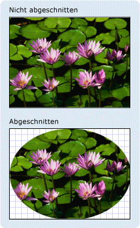

# Übersicht über die GeometrieGeometry Overview
In dieser Übersicht wird [!INCLUDE[TLA#tla_winclient](../../../../includes/tlasharptla-winclient-md.md)] <xref:System.Windows.Media.Geometry> beschrieben, wie die Klassen zum Beschreiben von Shapes verwendet werden.This overview describes how to use the [!INCLUDE[TLA#tla_winclient](../../../../includes/tlasharptla-winclient-md.md)] <xref:System.Windows.Media.Geometry> classes to describe shapes. In diesem Thema werden <xref:System.Windows.Media.Geometry> auch <xref:System.Windows.Shapes.Shape> die Unterschiede zwischen Objekten und Elementen kontrastiert.This topic also contrasts the differences between <xref:System.Windows.Media.Geometry> objects and <xref:System.Windows.Shapes.Shape> elements.  

## Was ist eine Geometrie?What Is a Geometry?  
 Die <xref:System.Windows.Media.Geometry> Klasse und die Klassen, die <xref:System.Windows.Media.EllipseGeometry>daraus <xref:System.Windows.Media.PathGeometry>ableiten, z. B. , und <xref:System.Windows.Media.CombinedGeometry>, ermöglichen es Ihnen, die Geometrie eines 2D-Shapes zu beschreiben.The <xref:System.Windows.Media.Geometry> class and the classes which derive from it, such as <xref:System.Windows.Media.EllipseGeometry>, <xref:System.Windows.Media.PathGeometry>, and <xref:System.Windows.Media.CombinedGeometry>, enable you to describe the geometry of a 2D shape. Diese geometrischen Beschreibungen haben viele Verwendungszwecke, beispielsweise zum Definieren einer am Bildschirm zu zeichnenden Form oder zum Definieren von Treffertest- und Clipbereichen.These geometric descriptions have many uses, such defining a shape to paint to the screen or defining hit-test and clip regions. Sie können mithilfe einer Geometrie sogar einen Animationspfad definieren.You can even use a geometry to define an animation path.  
  
 <xref:System.Windows.Media.Geometry>Objekte können einfach sein, z. B. Rechtecke und Kreise, oder zusammengesetzt, die aus zwei oder mehr Geometrieobjekten erstellt werden.<xref:System.Windows.Media.Geometry> objects can be simple, such as rectangles and circles, or composite, created from two or more geometry objects.  Komplexere Geometrien können mithilfe <xref:System.Windows.Media.PathGeometry> der <xref:System.Windows.Media.StreamGeometry> und-Klassen erstellt werden, mit denen Sie Bogen und Kurven beschreiben können.More complex geometries can be created by using the <xref:System.Windows.Media.PathGeometry> and <xref:System.Windows.Media.StreamGeometry> classes, which enable you to describe arcs and curves.  
  
 Da <xref:System.Windows.Media.Geometry> es sich <xref:System.Windows.Freezable>bei <xref:System.Windows.Media.Geometry> a um einen Typ von handelt, bieten Objekte mehrere spezielle Features: Sie können als [Ressourcen](../../../desktop-wpf/fundamentals/xaml-resources-define.md)deklariert, von mehreren Objekten gemeinsam genutzt, schreibgeschützt zur Verbesserung der Leistung hergestellt, geklont und threadsicher gemacht werden.Because a <xref:System.Windows.Media.Geometry> is a type of <xref:System.Windows.Freezable>, <xref:System.Windows.Media.Geometry> objects provide several special features: they can be declared as [resources](../../../desktop-wpf/fundamentals/xaml-resources-define.md), shared among multiple objects, made read-only to improve performance, cloned, and made thread-safe. Weitere Informationen zu den verschiedenen <xref:System.Windows.Freezable> Features, die von Objekten bereitgestellt werden, finden Sie in der [Übersicht über freisetzbare Objekte](../advanced/freezable-objects-overview.md).For more information about the different features provided by <xref:System.Windows.Freezable> objects, see the [Freezable Objects Overview](../advanced/freezable-objects-overview.md).  
  

## Geometrien vs. FormenGeometries vs. Shapes  
 Die <xref:System.Windows.Media.Geometry> <xref:System.Windows.Shapes.Shape> und Klassen scheinen insofern ähnlich zu <xref:System.Windows.Media.EllipseGeometry> sein, als sie beide 2D-Shapes beschreiben (vergleichen sie zum <xref:System.Windows.Shapes.Ellipse> Beispiel), aber es gibt wichtige Unterschiede.The <xref:System.Windows.Media.Geometry> and <xref:System.Windows.Shapes.Shape> classes seem similar in that they both describe 2D shapes (compare <xref:System.Windows.Media.EllipseGeometry> and <xref:System.Windows.Shapes.Ellipse> for example), but there are important differences.  
  
 Zum einen <xref:System.Windows.Media.Geometry> erbt die Klasse <xref:System.Windows.Freezable> von <xref:System.Windows.Shapes.Shape> der Klasse, <xref:System.Windows.FrameworkElement>während die Klasse von erbt.For one, the <xref:System.Windows.Media.Geometry> class inherits from the <xref:System.Windows.Freezable> class while the <xref:System.Windows.Shapes.Shape> class inherits from <xref:System.Windows.FrameworkElement>. Da es sich <xref:System.Windows.Shapes.Shape> um Elemente handelt, können Objekte <xref:System.Windows.Media.Geometry> sich selbst rendern und am Layoutsystem teilnehmen, objekte jedoch nicht.Because they are elements, <xref:System.Windows.Shapes.Shape> objects can render themselves and participate in the layout system, while <xref:System.Windows.Media.Geometry> objects cannot.  
  
 Obwohl <xref:System.Windows.Shapes.Shape> Objekte leichter verwendbar sind als <xref:System.Windows.Media.Geometry> Objekte, <xref:System.Windows.Media.Geometry> sind Objekte vielseitiger.Although <xref:System.Windows.Shapes.Shape> objects are more readily usable than <xref:System.Windows.Media.Geometry> objects, <xref:System.Windows.Media.Geometry> objects are more versatile. Während <xref:System.Windows.Shapes.Shape> ein Objekt zum Rendern von <xref:System.Windows.Media.Geometry> 2D-Grafiken verwendet wird, kann ein Objekt verwendet werden, um den geometrischen Bereich für 2D-Grafiken zu definieren, einen Bereich für das Zuschneiden zu definieren oder einen Bereich für Treffertests zu definieren.While a <xref:System.Windows.Shapes.Shape> object is used to render 2D graphics, a <xref:System.Windows.Media.Geometry> object can be used to define the geometric region for 2D graphics, define a region for clipping, or define a region for hit testing, for example.  
  
### Die Path-FormThe Path Shape  
 Eine <xref:System.Windows.Shapes.Shape>, <xref:System.Windows.Shapes.Path> die Klasse, <xref:System.Windows.Media.Geometry> verwendet tatsächlich eine, um ihren Inhalt zu beschreiben.One <xref:System.Windows.Shapes.Shape>, the <xref:System.Windows.Shapes.Path> class, actually uses a <xref:System.Windows.Media.Geometry> to describe its contents. Durch Festlegen <xref:System.Windows.Shapes.Path.Data%2A> der <xref:System.Windows.Shapes.Path> Eigenschaft <xref:System.Windows.Media.Geometry> des mit <xref:System.Windows.Shapes.Shape.Fill%2A> <xref:System.Windows.Shapes.Shape.Stroke%2A> a und Festlegen <xref:System.Windows.Media.Geometry>der en und Eigenschaften können Sie eine rendern.By setting the <xref:System.Windows.Shapes.Path.Data%2A> property of the <xref:System.Windows.Shapes.Path> with a <xref:System.Windows.Media.Geometry> and setting its <xref:System.Windows.Shapes.Shape.Fill%2A> and <xref:System.Windows.Shapes.Shape.Stroke%2A> properties, you can render a <xref:System.Windows.Media.Geometry>.  
  

## Allgemeine Eigenschaften, die eine Geometrie übernehmenCommon Properties That Take a Geometry  
 In den vorherigen Abschnitten wurde erwähnt, dass Geometry-Objekte für eine Vielzahl von Zwecken mit anderen Objekten verwendet werden können, z.B. zum Zeichnen von Formen, zum Animieren und für das Clipping.The preceding sections mentioned that Geometry objects can be used with other objects for a variety of purposes, such as drawing shapes, animating, and clipping. In der folgenden Tabelle sind mehrere <xref:System.Windows.Media.Geometry> Klassen aufgeführt, die Eigenschaften aufweisen, die ein Objekt annehmen.The following table lists several classes that have properties that take a <xref:System.Windows.Media.Geometry> object.  
  
|typeType|EigenschaftProperty|  
|----------|--------------|  
|<xref:System.Windows.Media.Animation.DoubleAnimationUsingPath>|<xref:System.Windows.Media.Animation.DoubleAnimationUsingPath.PathGeometry%2A>|  
|<xref:System.Windows.Media.DrawingGroup>|<xref:System.Windows.Media.DrawingGroup.ClipGeometry%2A>|  
|<xref:System.Windows.Media.GeometryDrawing>|<xref:System.Windows.Media.GeometryDrawing.Geometry%2A>|  
|<xref:System.Windows.Shapes.Path>|<xref:System.Windows.Shapes.Path.Data%2A>|  
|<xref:System.Windows.UIElement>|<xref:System.Windows.UIElement.Clip%2A>|  
  

## Einfache geometrische TypenSimple Geometry Types  
 Die Basisklasse für alle Geometrien <xref:System.Windows.Media.Geometry>ist die abstrakte Klasse .The base class for all geometries is the abstract class <xref:System.Windows.Media.Geometry>.  Die Klassen, die <xref:System.Windows.Media.Geometry> von der Klasse ableiten, können grob in drei Kategorien gruppiert werden: einfache Geometrien, Pfadgeometrien und zusammengesetzte Geometrien.The classes which derive from the <xref:System.Windows.Media.Geometry> class can be roughly grouped into three categories: simple geometries, path geometries, and composite geometries.  
  
 Einfache Geometrieklassen <xref:System.Windows.Media.LineGeometry> <xref:System.Windows.Media.RectangleGeometry>umfassen <xref:System.Windows.Media.EllipseGeometry> , und werden verwendet, um grundlegende geometrische Formen wie Linien, Rechtecke und Kreise zu erstellen.Simple geometry classes include <xref:System.Windows.Media.LineGeometry>, <xref:System.Windows.Media.RectangleGeometry>, and <xref:System.Windows.Media.EllipseGeometry> and are used to create basic geometric shapes, such as lines, rectangles, and circles.  
  
- A <xref:System.Windows.Media.LineGeometry> wird definiert, indem der Startpunkt der Linie und der Endpunkt angegeben werden.A <xref:System.Windows.Media.LineGeometry> is defined by specifying the start point of the line and the end point.  
  
- A <xref:System.Windows.Media.RectangleGeometry> wird mit <xref:System.Windows.Rect> einer Struktur definiert, die ihre relative Position und ihre Höhe und Breite angibt.A <xref:System.Windows.Media.RectangleGeometry> is defined with a <xref:System.Windows.Rect> structure which specifies its relative position and its height and width. Sie können ein abgerundetes <xref:System.Windows.Media.RectangleGeometry.RadiusX%2A> Rechteck <xref:System.Windows.Media.RectangleGeometry.RadiusY%2A> erstellen, indem Sie die und Eigenschaften festlegen.You can create a rounded rectangle by setting the <xref:System.Windows.Media.RectangleGeometry.RadiusX%2A> and <xref:System.Windows.Media.RectangleGeometry.RadiusY%2A> properties.  
  
- Ein <xref:System.Windows.Media.EllipseGeometry> wird durch einen Mittelpunkt, einen x-Radius und einen y-Radius definiert.An <xref:System.Windows.Media.EllipseGeometry> is defined by a center point, an x-radius and a y-radius.  Die folgenden Beispiele zeigen, wie einfache Geometrien für das Rendering und das Clipping erstellt werden können.The following examples show how to create simple geometries for rendering and for clipping.  
  
 Dieselben Formen sowie komplexere Formen können mithilfe eines <xref:System.Windows.Media.PathGeometry> oder durch Kombinieren von Geometrieobjekten zusammen erstellt werden, aber diese Klassen bieten eine einfachere Möglichkeit, diese grundlegenden geometrischen Formen zu erstellen.These same shapes, as well as more complex shapes, can be created using a <xref:System.Windows.Media.PathGeometry> or by combining geometry objects together, but these classes provide a simpler means for producing these basic geometric shapes.  
  
 Das folgende Beispiel zeigt, wie <xref:System.Windows.Media.LineGeometry>eine erstellt und gerendert wird.The following example shows how to create and render a <xref:System.Windows.Media.LineGeometry>.  Wie bereits erwähnt, kann ein <xref:System.Windows.Media.Geometry> Objekt nicht selbst <xref:System.Windows.Shapes.Path> zeichnen, sodass im Beispiel eine Form zum Rendern der Linie verwendet wird.As noted previously, a <xref:System.Windows.Media.Geometry> object is unable to draw itself, so the example uses a <xref:System.Windows.Shapes.Path> shape to render the line.  Da eine Linie keinen Bereich <xref:System.Windows.Shapes.Shape.Fill%2A> hat, <xref:System.Windows.Shapes.Path> hat das Festlegen der Eigenschaft des keine Auswirkungen. Stattdessen werden <xref:System.Windows.Shapes.Shape.Stroke%2A> nur <xref:System.Windows.Shapes.Shape.StrokeThickness%2A> die und Eigenschaften angegeben.Because a line has no area, setting the <xref:System.Windows.Shapes.Shape.Fill%2A> property of the <xref:System.Windows.Shapes.Path> would have no effect; instead, only the <xref:System.Windows.Shapes.Shape.Stroke%2A> and <xref:System.Windows.Shapes.Shape.StrokeThickness%2A> properties are specified. Die folgende Abbildung zeigt die Ausgabe des Beispiels.The following illustration shows the output from the example.  
  
   
Eine LineGeometry, gezeichnet von (10,20) bis (100,130)A LineGeometry drawn from (10,20) to (100,130)  
  
 [!code-xaml[GeometryOverviewSamples_snip#GraphicsMMLineGeometryExample](~/samples/snippets/csharp/VS_Snippets_Wpf/GeometryOverviewSamples_snip/CS/GeometryExamples.xaml#graphicsmmlinegeometryexample)]  
  
 [!code-csharp[GeometryOverviewSamples_procedural_snip#GraphicsMMLineGeometryExample](~/samples/snippets/csharp/VS_Snippets_Wpf/GeometryOverviewSamples_procedural_snip/CSharp/GeometryExamples.cs#graphicsmmlinegeometryexample)]
 [!code-vb[GeometryOverviewSamples_procedural_snip#GraphicsMMLineGeometryExample](~/samples/snippets/visualbasic/VS_Snippets_Wpf/GeometryOverviewSamples_procedural_snip/visualbasic/geometryexamples.vb#graphicsmmlinegeometryexample)]  
  
 Das nächste Beispiel zeigt, wie <xref:System.Windows.Media.EllipseGeometry>eine erstellt und gerendert wird.The next example shows how to create and render an <xref:System.Windows.Media.EllipseGeometry>.  Die Beispiele <xref:System.Windows.Media.EllipseGeometry.Center%2A> legen <xref:System.Windows.Media.EllipseGeometry> fest, dass `50,50` der auf den Punkt gesetzt ist und `50`der x-Radius und der y-Radius auf gesetzt sind, wodurch ein Kreis mit einem Durchmesser von 100 erstellt wird.The examples sets the <xref:System.Windows.Media.EllipseGeometry.Center%2A> of the <xref:System.Windows.Media.EllipseGeometry> is set to the point `50,50` and the x-radius and the y-radius are both set to `50`, which creates a circle with a diameter of 100.  Das Innere der Ellipse wird gemalt, indem der Fill-Eigenschaft des Path-Elements, in diesem Fall <xref:System.Windows.Media.Brushes.Gold%2A>, ein Wert zugewiesen wird.The interior of the ellipse is painted by assigning a value to the Path element's Fill property, in this case <xref:System.Windows.Media.Brushes.Gold%2A>. Die folgende Abbildung zeigt die Ausgabe des Beispiels.The following illustration shows the output from the example.  
  
   
EllipseGeometry, gezeichnet bei (50,50)An EllipseGeometry drawn at (50,50)  
  
 [!code-xaml[GeometryOverviewSamples_snip#GraphicsMMEllipseGeometryExample](~/samples/snippets/csharp/VS_Snippets_Wpf/GeometryOverviewSamples_snip/CS/GeometryExamples.xaml#graphicsmmellipsegeometryexample)]  
  
 [!code-csharp[GeometryOverviewSamples_procedural_snip#GraphicsMMEllipseGeometryExample](~/samples/snippets/csharp/VS_Snippets_Wpf/GeometryOverviewSamples_procedural_snip/CSharp/GeometryExamples.cs#graphicsmmellipsegeometryexample)]
 [!code-vb[GeometryOverviewSamples_procedural_snip#GraphicsMMEllipseGeometryExample](~/samples/snippets/visualbasic/VS_Snippets_Wpf/GeometryOverviewSamples_procedural_snip/visualbasic/geometryexamples.vb#graphicsmmellipsegeometryexample)]  
  
 Das folgende Beispiel zeigt, wie <xref:System.Windows.Media.RectangleGeometry>eine erstellt und gerendert wird.The following example shows how to create and render a <xref:System.Windows.Media.RectangleGeometry>.  Die Position und die Abmessungen des <xref:System.Windows.Rect> Rechtecks werden durch eine Struktur definiert.The position and the dimensions of the rectangle are defined by a <xref:System.Windows.Rect> structure. Die Position ist `50,50` und die Höhe und Breite sind beide `25`, wodurch ein Quadrat erstellt wird.The position is `50,50` and the height and width are both `25`, which creates a square. Die folgende Abbildung zeigt die Ausgabe des Beispiels.The following illustration shows the output from the example.  
  
   
Eine RectangleGeometry, gezeichnet bei 50,50A RectangleGeometry drawn at 50,50  
  
 [!code-xaml[GeometryOverviewSamples_snip#GraphicsMMRectangleGeometryExample](~/samples/snippets/csharp/VS_Snippets_Wpf/GeometryOverviewSamples_snip/CS/GeometryExamples.xaml#graphicsmmrectanglegeometryexample)]  
  
 [!code-csharp[GeometryOverviewSamples_procedural_snip#GraphicsMMRectangleGeometryExample](~/samples/snippets/csharp/VS_Snippets_Wpf/GeometryOverviewSamples_procedural_snip/CSharp/GeometryExamples.cs#graphicsmmrectanglegeometryexample)]
 [!code-vb[GeometryOverviewSamples_procedural_snip#GraphicsMMRectangleGeometryExample](~/samples/snippets/visualbasic/VS_Snippets_Wpf/GeometryOverviewSamples_procedural_snip/visualbasic/geometryexamples.vb#graphicsmmrectanglegeometryexample)]  
  
 Das folgende Beispiel zeigt, <xref:System.Windows.Media.EllipseGeometry> wie ein clip-Bereich für ein Bild verwendet wird.The following example shows how to use an <xref:System.Windows.Media.EllipseGeometry> as the clip region for an image.  Ein <xref:System.Windows.Controls.Image> Objekt wird <xref:System.Windows.FrameworkElement.Width%2A> mit einem von <xref:System.Windows.FrameworkElement.Height%2A> 200 und einem von 150 definiert.An <xref:System.Windows.Controls.Image> object is defined with a <xref:System.Windows.FrameworkElement.Width%2A> of 200 and a <xref:System.Windows.FrameworkElement.Height%2A> of 150.  Ein <xref:System.Windows.Media.EllipseGeometry> mit <xref:System.Windows.Media.EllipseGeometry.RadiusX%2A> einem Wert von <xref:System.Windows.Media.EllipseGeometry.RadiusY%2A> 100, einem <xref:System.Windows.Media.EllipseGeometry.Center%2A> Wert von 75 und einem Wert <xref:System.Windows.UIElement.Clip%2A> von 100,75 wird auf die Eigenschaft des Bildes festgelegt.An <xref:System.Windows.Media.EllipseGeometry> with a <xref:System.Windows.Media.EllipseGeometry.RadiusX%2A> value of 100, a <xref:System.Windows.Media.EllipseGeometry.RadiusY%2A> value of 75, and a <xref:System.Windows.Media.EllipseGeometry.Center%2A> value of 100,75 is set to the <xref:System.Windows.UIElement.Clip%2A> property of the image.  Es wird nur der Teil des Bilds angezeigt, der innerhalb des Bereichs der Ellipse liegt.Only the part of the image that is within the area of the ellipse will be displayed. Die folgende Abbildung zeigt die Ausgabe des Beispiels.The following illustration shows the output from the example.  
  
   
Eine EllipseGeometry zum Beschneiden eines Image-SteuerelementsAn EllipseGeometry used to clip an Image control  
  
 [!code-xaml[GeometryOverviewSamples_snip#GraphicsMMImageClipGeometryExample](~/samples/snippets/csharp/VS_Snippets_Wpf/GeometryOverviewSamples_snip/CS/GeometryExamples.xaml#graphicsmmimageclipgeometryexample)]  
  
 [!code-csharp[GeometryOverviewSamples_procedural_snip#GraphicsMMImageClipGeometryExample](~/samples/snippets/csharp/VS_Snippets_Wpf/GeometryOverviewSamples_procedural_snip/CSharp/GeometryExamples.cs#graphicsmmimageclipgeometryexample)]
 [!code-vb[GeometryOverviewSamples_procedural_snip#GraphicsMMImageClipGeometryExample](~/samples/snippets/visualbasic/VS_Snippets_Wpf/GeometryOverviewSamples_procedural_snip/visualbasic/geometryexamples.vb#graphicsmmimageclipgeometryexample)]  
  

## Path-GeometrienPath Geometries  
 Die <xref:System.Windows.Media.PathGeometry> Klasse und ihr <xref:System.Windows.Media.StreamGeometry> leichtes Äquivalent, die Klasse, bieten die Möglichkeit, mehrere komplexe Figuren zu beschreiben, die aus Bögen, Kurven und Linien bestehen.The <xref:System.Windows.Media.PathGeometry> class and its lightweight equivalent, the <xref:System.Windows.Media.StreamGeometry> class, provide the means to describe multiple complex figures composed of arcs, curves, and lines.  
  
 Im Zentrum von <xref:System.Windows.Media.PathGeometry> a befindet <xref:System.Windows.Media.PathFigure> sich eine Auflistung von Objekten, die <xref:System.Windows.Media.PathGeometry>so benannt sind, weil jede Figur eine diskrete Form im beschreibt.At the heart of a <xref:System.Windows.Media.PathGeometry> is a collection of <xref:System.Windows.Media.PathFigure> objects, so named because each figure describes a discrete shape in the <xref:System.Windows.Media.PathGeometry>. Jedes <xref:System.Windows.Media.PathFigure> besteht aus einem <xref:System.Windows.Media.PathSegment> oder mehreren Objekten, von denen jedes ein Segment der Figur beschreibt.Each <xref:System.Windows.Media.PathFigure> is itself comprised of one or more <xref:System.Windows.Media.PathSegment> objects, each of which describes a segment of the figure.  
  
 Es gibt viele Arten von Segmenten.There are many types of segments.  
  
|SegmenttypSegment Type|BeschreibungDescription|BeispielExample|  
|------------------|-----------------|-------------|  
|<xref:System.Windows.Media.ArcSegment>|Erstellt einen elliptischen Bogen zwischen zwei Punkten.Creates an elliptical arc between two points.|[Erstellen eines elliptischen Bogens](how-to-create-an-elliptical-arc.md).[Create an Elliptical Arc](how-to-create-an-elliptical-arc.md).|  
|<xref:System.Windows.Media.BezierSegment>|Erstellt eine kubische Bézierkurve zwischen zwei Punkten.Creates a cubic Bezier curve between two points.|[Erstellen Sie eine kubische Bézierkurve](how-to-create-a-cubic-bezier-curve.md).[Create a Cubic Bezier Curve](how-to-create-a-cubic-bezier-curve.md).|  
|<xref:System.Windows.Media.LineSegment>|Erstellt eine Linie zwischen zwei Punkten.Creates a line between two points.|[Erstellen eines LineSegment in einer PathGeometryCreate a LineSegment in a PathGeometry](how-to-create-a-linesegment-in-a-pathgeometry.md)|  
|<xref:System.Windows.Media.PolyBezierSegment>|Erstellt eine Reihe von kubischen Bézierkurven.Creates a series of cubic Bezier curves.|Siehe <xref:System.Windows.Media.PolyBezierSegment> Typseite.See the <xref:System.Windows.Media.PolyBezierSegment> type page.|  
|<xref:System.Windows.Media.PolyLineSegment>|Erstellt eine Reihe von Zeilen.Creates a series of lines.|Siehe <xref:System.Windows.Media.PolyLineSegment> Typseite.See the <xref:System.Windows.Media.PolyLineSegment> type page.|  
|<xref:System.Windows.Media.PolyQuadraticBezierSegment>|Erstellt eine Reihe quadratischer Bézierkurven.Creates a series of quadratic Bezier curves.|Siehe <xref:System.Windows.Media.PolyQuadraticBezierSegment> seite.See the <xref:System.Windows.Media.PolyQuadraticBezierSegment> page.|  
|<xref:System.Windows.Media.QuadraticBezierSegment>|Erstellt eine quadratische Bézierkurve.Creates a quadratic Bezier curve.|[Erstellen Sie eine quadratische Bézierkurve](how-to-create-a-quadratic-bezier-curve.md).[Create a Quadratic Bezier Curve](how-to-create-a-quadratic-bezier-curve.md).|  
  
 Die Segmente <xref:System.Windows.Media.PathFigure> innerhalb eines werden zu einer einzelnen geometrischen Form kombiniert, wobei der Endpunkt jedes Segments der Startpunkt des nächsten Segments ist.The segments within a <xref:System.Windows.Media.PathFigure> are combined into a single geometric shape with the end point of each segment being the start point of the next segment. Die <xref:System.Windows.Media.PathFigure.StartPoint%2A> Eigenschaft <xref:System.Windows.Media.PathFigure> eines gibt den Punkt an, von dem das erste Segment gezeichnet wird.The <xref:System.Windows.Media.PathFigure.StartPoint%2A> property of a <xref:System.Windows.Media.PathFigure> specifies the point from which the first segment is drawn. Jedes nachfolgende Segment beginnt am Endpunkt des vorherigen Segments.Each subsequent segment starts at the end point of the previous segment. Beispielsweise kann eine vertikale `10,50` `10,150` Linie von zu <xref:System.Windows.Media.PathFigure.StartPoint%2A> definiert `10,50` werden, <xref:System.Windows.Media.LineSegment> indem <xref:System.Windows.Media.LineSegment.Point%2A> die Eigenschaft `10,150`auf und das Erstellen einer mit einer Eigenschaftseinstellung von festgelegt wird.For example, a vertical line from `10,50` to `10,150` can be defined by setting the <xref:System.Windows.Media.PathFigure.StartPoint%2A> property to `10,50` and creating a <xref:System.Windows.Media.LineSegment> with a <xref:System.Windows.Media.LineSegment.Point%2A> property setting of `10,150`.  
  
 Im folgenden Beispiel <xref:System.Windows.Media.PathGeometry> wird eine <xref:System.Windows.Media.PathFigure> einfache <xref:System.Windows.Media.LineSegment> Einzelverbindung mit <xref:System.Windows.Shapes.Path> einem erstellt und mit einem Element angezeigt.The following example creates a simple <xref:System.Windows.Media.PathGeometry> comprised of a single <xref:System.Windows.Media.PathFigure> with a <xref:System.Windows.Media.LineSegment> and displays it using a <xref:System.Windows.Shapes.Path> element. Das <xref:System.Windows.Media.PathFigure> Objekt <xref:System.Windows.Media.PathFigure.StartPoint%2A> ist auf `10,20` und <xref:System.Windows.Media.LineSegment> a mit einem `100,130`Endpunkt von definiert.The <xref:System.Windows.Media.PathFigure> object's <xref:System.Windows.Media.PathFigure.StartPoint%2A> is set to `10,20` and a <xref:System.Windows.Media.LineSegment> is defined with an end point of `100,130`. Die folgende Abbildung <xref:System.Windows.Media.PathGeometry> zeigt die von diesem Beispiel erstellte Abbildung.The following illustration shows the <xref:System.Windows.Media.PathGeometry> created by this example.  
  
   
Eine PathGeometry, die ein einzelnes LineSegment enthältA PathGeometry that contains a single LineSegment  
  
 [!code-xaml[GeometryOverviewSamples_snip#GraphicsMMPathGeometryLineExample](~/samples/snippets/csharp/VS_Snippets_Wpf/GeometryOverviewSamples_snip/CS/GeometryExamples.xaml#graphicsmmpathgeometrylineexample)]  
  
 [!code-csharp[GeometryOverviewSamples_procedural_snip#GraphicsMMPathGeometryLineExample](~/samples/snippets/csharp/VS_Snippets_Wpf/GeometryOverviewSamples_procedural_snip/CSharp/GeometryExamples.cs#graphicsmmpathgeometrylineexample)]
 [!code-vb[GeometryOverviewSamples_procedural_snip#GraphicsMMPathGeometryLineExample](~/samples/snippets/visualbasic/VS_Snippets_Wpf/GeometryOverviewSamples_procedural_snip/visualbasic/geometryexamples.vb#graphicsmmpathgeometrylineexample)]  
  
 Es lohnt sich, dieses Beispiel <xref:System.Windows.Media.LineGeometry> mit dem vorherigen Beispiel zu vergleichen.It is worth contrasting this example with the preceding <xref:System.Windows.Media.LineGeometry> example.  Die Syntax, <xref:System.Windows.Media.PathGeometry> die für a verwendet wird, ist <xref:System.Windows.Media.LineGeometry>viel ausführlicher als die <xref:System.Windows.Media.LineGeometry> für eine einfache , und es kann <xref:System.Windows.Media.PathGeometry> sinnvoller sein, die Klasse in diesem Fall zu verwenden, aber die ausführliche Syntax des ermöglicht extrem komplizierte und komplexe geometrische Bereiche.The syntax used for a <xref:System.Windows.Media.PathGeometry> is much more verbose than that used for a simple <xref:System.Windows.Media.LineGeometry>, and it may make more sense to use the <xref:System.Windows.Media.LineGeometry> class in this case, but the verbose syntax of the <xref:System.Windows.Media.PathGeometry> allows for extremely intricate and complex geometric regions.  
  
 Komplexere Geometrien können mithilfe einer <xref:System.Windows.Media.PathSegment> Kombination von Objekten erstellt werden.More complex geometries can be created by using a combination of <xref:System.Windows.Media.PathSegment> objects.  
  
 Im nächsten Beispiel <xref:System.Windows.Media.BezierSegment>werden <xref:System.Windows.Media.LineSegment>eine <xref:System.Windows.Media.ArcSegment> , a und eine zum Erstellen einer Form verwendet.The next example uses a <xref:System.Windows.Media.BezierSegment>, a <xref:System.Windows.Media.LineSegment>, and an <xref:System.Windows.Media.ArcSegment> to create shape. Das Beispiel erstellt zuerst eine kubische Bézierkurve, indem vier Punkte definiert werden: ein Startpunkt, der der Endpunkt des vorherigen Segments ist, ein Endpunkt (<xref:System.Windows.Media.BezierSegment.Point3%2A>), und zwei Kontrollpunkte (<xref:System.Windows.Media.BezierSegment.Point1%2A> und <xref:System.Windows.Media.BezierSegment.Point2%2A>).The example first creates a cubic Bezier curve is by defining four points: a start point, which is the end point of the previous segment, an end point (<xref:System.Windows.Media.BezierSegment.Point3%2A>), and two control points (<xref:System.Windows.Media.BezierSegment.Point1%2A> and <xref:System.Windows.Media.BezierSegment.Point2%2A>).  Die beiden Kontrollpunkte einer kubischen Bézierkurve verhalten sich wie Magnete und ziehen Teile dessen an, was sonst eine gerade Linie zu sich selbst wäre, und erzeugen eine Kurve.The two control points of a cubic Bezier curve behave like magnets, attracting portions of what would otherwise be a straight line towards themselves, producing a curve. Der erste Kontrollpunkt , <xref:System.Windows.Media.BezierSegment.Point1%2A>, wirkt sich auf den Anfangsteil der Kurve aus; der zweite Kontrollpunkt , <xref:System.Windows.Media.BezierSegment.Point2%2A>wirkt sich auf den Endteil der Kurve aus.The first control point, <xref:System.Windows.Media.BezierSegment.Point1%2A>, affects the beginning portion of the curve; the second control point, <xref:System.Windows.Media.BezierSegment.Point2%2A>, affects the ending portion of the curve.  
  
 Das Beispiel fügt <xref:System.Windows.Media.LineSegment>dann eine hinzu, die zwischen <xref:System.Windows.Media.BezierSegment> dem Endpunkt des vorherigen, der ihm voranliegt, zu dem Punkt gezeichnet wird, der durch seine <xref:System.Windows.Media.LineSegment> Eigenschaft angegeben wurde.The example then adds a <xref:System.Windows.Media.LineSegment>, which is drawn between the end point of the preceding <xref:System.Windows.Media.BezierSegment> that preceded it to the point specified by its <xref:System.Windows.Media.LineSegment> property.  
  
 Das Beispiel fügt <xref:System.Windows.Media.ArcSegment>dann eine hinzu, die vom <xref:System.Windows.Media.LineSegment> Endpunkt des <xref:System.Windows.Media.ArcSegment.Point%2A> Vorderwerts zu dem Punkt gezeichnet wird, der durch seine Eigenschaft angegeben wird.The example then adds an <xref:System.Windows.Media.ArcSegment>, which is drawn from the end point of the preceding <xref:System.Windows.Media.LineSegment> to the point specified by its <xref:System.Windows.Media.ArcSegment.Point%2A> property. Das Beispiel gibt auch den x- und y-Radius<xref:System.Windows.Media.ArcSegment.Size%2A>des<xref:System.Windows.Media.ArcSegment.RotationAngle%2A>Bogens ( ), einen Drehwinkel ( ),<xref:System.Windows.Media.ArcSegment.IsLargeArc%2A>ein Flag an, das angibt, wie<xref:System.Windows.Media.ArcSegment.SweepDirection%2A>groß der Winkel des resultierenden Bogens sein soll ( ), und einen Wert, der angibt, in welche Richtung der Bogen gezeichnet wird ( ).The example also specifies the arc's x- and y-radius (<xref:System.Windows.Media.ArcSegment.Size%2A>), a rotation angle (<xref:System.Windows.Media.ArcSegment.RotationAngle%2A>), a flag indicating how large the angle of the resulting arc should be (<xref:System.Windows.Media.ArcSegment.IsLargeArc%2A>), and a value indicating in which direction the arc is drawn (<xref:System.Windows.Media.ArcSegment.SweepDirection%2A>). Die folgende Abbildung zeigt die durch dieses Beispiel erstellte Form.The following illustration shows the shape created by this example.  
  
   
Eine PathGeometryA PathGeometry  
  
 [!code-xaml[GeometryOverviewSamples_snip#GraphicsMMPathGeometryComplexExample](~/samples/snippets/csharp/VS_Snippets_Wpf/GeometryOverviewSamples_snip/CS/GeometryExamples.xaml#graphicsmmpathgeometrycomplexexample)]  
  
 [!code-csharp[GeometryOverviewSamples_procedural_snip#GraphicsMMPathGeometryComplexExample](~/samples/snippets/csharp/VS_Snippets_Wpf/GeometryOverviewSamples_procedural_snip/CSharp/GeometryExamples.cs#graphicsmmpathgeometrycomplexexample)]
 [!code-vb[GeometryOverviewSamples_procedural_snip#GraphicsMMPathGeometryComplexExample](~/samples/snippets/visualbasic/VS_Snippets_Wpf/GeometryOverviewSamples_procedural_snip/visualbasic/geometryexamples.vb#graphicsmmpathgeometrycomplexexample)]  
  
 Noch komplexere Geometrien können mithilfe <xref:System.Windows.Media.PathFigure> mehrerer <xref:System.Windows.Media.PathGeometry>Objekte in einem erstellt werden.Even more complex geometries can be created by using multiple <xref:System.Windows.Media.PathFigure> objects within a <xref:System.Windows.Media.PathGeometry>.  
  
 Im folgenden Beispiel <xref:System.Windows.Media.PathGeometry> wird <xref:System.Windows.Media.PathFigure> ein mit zwei <xref:System.Windows.Media.PathSegment> Objekten erstellt, von denen jedes mehrere Objekte enthält.The following example creates a <xref:System.Windows.Media.PathGeometry> with two <xref:System.Windows.Media.PathFigure> objects, each of which contains multiple <xref:System.Windows.Media.PathSegment> objects.  Die <xref:System.Windows.Media.PathFigure> aus dem obigen <xref:System.Windows.Media.PolyLineSegment> Beispiel <xref:System.Windows.Media.QuadraticBezierSegment> und a <xref:System.Windows.Media.PathFigure> mit a und a werden verwendet.The <xref:System.Windows.Media.PathFigure> from the above example and a <xref:System.Windows.Media.PathFigure> with a <xref:System.Windows.Media.PolyLineSegment> and a <xref:System.Windows.Media.QuadraticBezierSegment> are used.  A <xref:System.Windows.Media.PolyLineSegment> wird mit einem Array <xref:System.Windows.Media.QuadraticBezierSegment> von Punkten und der mit einem Kontrollpunkt und einem Endpunkt definiert.A <xref:System.Windows.Media.PolyLineSegment> is defined with an array of points and the <xref:System.Windows.Media.QuadraticBezierSegment> is defined with a control point and an end point. Die folgende Abbildung zeigt die durch dieses Beispiel erstellte Form.The following illustration shows the shape created by this example.  
  
   
Eine PathGeometry mit mehreren FigurenA PathGeometry with multiple figures  
  
 [!code-xaml[GeometryOverviewSamples_snip#GraphicsMMPathGeometryComplexMultiExample](~/samples/snippets/csharp/VS_Snippets_Wpf/GeometryOverviewSamples_snip/CS/GeometryExamples.xaml#graphicsmmpathgeometrycomplexmultiexample)]  
  
 [!code-csharp[GeometryOverviewSamples_procedural_snip#GraphicsMMPathGeometryComplexMultiExample](~/samples/snippets/csharp/VS_Snippets_Wpf/GeometryOverviewSamples_procedural_snip/CSharp/GeometryExamples.cs#graphicsmmpathgeometrycomplexmultiexample)]
 [!code-vb[GeometryOverviewSamples_procedural_snip#GraphicsMMPathGeometryComplexMultiExample](~/samples/snippets/visualbasic/VS_Snippets_Wpf/GeometryOverviewSamples_procedural_snip/visualbasic/geometryexamples.vb#graphicsmmpathgeometrycomplexmultiexample)]  
  
### StreamGeometryStreamGeometry  
 Wie <xref:System.Windows.Media.PathGeometry> die Klasse <xref:System.Windows.Media.StreamGeometry> definiert a eine komplexe geometrische Form, die Kurven, Bogen und Linien enthalten kann.Like the <xref:System.Windows.Media.PathGeometry> class, a <xref:System.Windows.Media.StreamGeometry> defines a complex geometric shape that may contain curves, arcs, and lines. Im <xref:System.Windows.Media.PathGeometry>Gegensatz zu einem <xref:System.Windows.Media.StreamGeometry> unterstützt der Inhalt einer datenbindung, Animation oder Änderung nicht.Unlike a <xref:System.Windows.Media.PathGeometry>, the contents of a  <xref:System.Windows.Media.StreamGeometry> do not support data binding, animation, or modification. Verwenden <xref:System.Windows.Media.StreamGeometry> Sie eine, wenn Sie eine komplexe Geometrie beschreiben müssen, aber nicht den Aufwand für die Unterstützung von Datenbindung, Animation oder Änderung benötigen.Use a <xref:System.Windows.Media.StreamGeometry> when you need to describe a complex geometry but do not want the overhead of supporting data binding, animation, or modification. Aufgrund ihrer Effizienz <xref:System.Windows.Media.StreamGeometry> ist die Klasse eine gute Wahl, um Adorner zu beschreiben.Because of its efficiency, the <xref:System.Windows.Media.StreamGeometry> class is a good choice for describing adorners.  
  
 Ein Beispiel finden Sie unter [Erstellen einer Form mithilfe von StreamGeometry](how-to-create-a-shape-using-a-streamgeometry.md).For an example, see [Create a Shape Using a StreamGeometry](how-to-create-a-shape-using-a-streamgeometry.md).  
  
### PfadmarkupsyntaxPath Markup Syntax  
 Die <xref:System.Windows.Media.PathGeometry> <xref:System.Windows.Media.StreamGeometry> und-Typen [!INCLUDE[TLA#tla_xaml](../../../../includes/tlasharptla-xaml-md.md)] unterstützen eine Attributsyntax mithilfe einer speziellen Reihe von Verschiebungs- und Zeichnungsbefehlen.The <xref:System.Windows.Media.PathGeometry> and <xref:System.Windows.Media.StreamGeometry> types support a [!INCLUDE[TLA#tla_xaml](../../../../includes/tlasharptla-xaml-md.md)] attribute syntax using a special series of move and draw commands. Weitere Informationen finden Sie unter [Pfadmarkupsyntax](path-markup-syntax.md).For more information, see [Path Markup Syntax](path-markup-syntax.md).  
  

## Zusammengesetzte GeometrienComposite Geometries  
 Zusammengesetzte Geometrieobjekte können <xref:System.Windows.Media.GeometryGroup>mit <xref:System.Windows.Media.CombinedGeometry>einer erstellt werden, <xref:System.Windows.Media.Geometry> <xref:System.Windows.Media.Geometry.Combine%2A>a , oder durch Aufrufen der statischen Methode .Composite geometry objects can be created using a <xref:System.Windows.Media.GeometryGroup>, a <xref:System.Windows.Media.CombinedGeometry>, or by calling the static <xref:System.Windows.Media.Geometry> method <xref:System.Windows.Media.Geometry.Combine%2A>.  
  
- Das <xref:System.Windows.Media.CombinedGeometry> Objekt <xref:System.Windows.Media.Geometry.Combine%2A> und die Methode führen einen booleschen Vorgang aus, um den durch zwei Geometrien definierten Bereich zu kombinieren.The <xref:System.Windows.Media.CombinedGeometry> object and the <xref:System.Windows.Media.Geometry.Combine%2A> method performs a Boolean operation to combine the area defined by two geometries. <xref:System.Windows.Media.Geometry>Objekte, die keinen Bereich haben, werden verworfen.<xref:System.Windows.Media.Geometry> objects that have no area are discarded. Es <xref:System.Windows.Media.Geometry> können nur zwei Objekte kombiniert werden (obwohl es sich bei diesen beiden Geometrien auch um zusammengesetzte Geometrien handelt).Only two <xref:System.Windows.Media.Geometry> objects can be combined (although these two geometries may also be composite geometries).  
  
- Die <xref:System.Windows.Media.GeometryGroup> Klasse erstellt eine <xref:System.Windows.Media.Geometry> Verschmelzung der darin enthaltenen Objekte, ohne ihren Bereich zu kombinieren.The <xref:System.Windows.Media.GeometryGroup> class creates an amalgamation of the <xref:System.Windows.Media.Geometry> objects it contains without combining their area. Eine beliebige <xref:System.Windows.Media.Geometry> Anzahl von Objekten <xref:System.Windows.Media.GeometryGroup>kann zu einer hinzugefügt werden.Any number of <xref:System.Windows.Media.Geometry> objects can be added to a <xref:System.Windows.Media.GeometryGroup>. Ein Beispiel finden Sie unter [Erstellen einer zusammengesetzten Form](how-to-create-a-composite-shape.md).For an example, see [Create a Composite Shape](how-to-create-a-composite-shape.md).  
  
 Da sie keinen Kombinationsvorgang <xref:System.Windows.Media.GeometryGroup> ausführen, bietet die <xref:System.Windows.Media.CombinedGeometry> Verwendung <xref:System.Windows.Media.Geometry.Combine%2A> von Objekten Leistungsvorteile gegenüber der Verwendung von Objekten oder der Methode.Because they do not perform a combine operation, using <xref:System.Windows.Media.GeometryGroup> objects provides performance benefits over using <xref:System.Windows.Media.CombinedGeometry> objects or the <xref:System.Windows.Media.Geometry.Combine%2A> method.  
  

## Kombinierte GeometrienCombined Geometries  
 Im vorherigen Abschnitt <xref:System.Windows.Media.CombinedGeometry> wurde <xref:System.Windows.Media.Geometry.Combine%2A> das Objekt erwähnt, und die Methode kombiniert den Bereich, der durch die darin enthaltenen Geometrien definiert ist.The preceding section mentioned the <xref:System.Windows.Media.CombinedGeometry> object and the <xref:System.Windows.Media.Geometry.Combine%2A> method combine the area defined by the geometries they contain. Die <xref:System.Windows.Media.GeometryCombineMode> Enumeration gibt an, wie die Geometrien kombiniert werden.The <xref:System.Windows.Media.GeometryCombineMode> enumeration specifies how the geometries are combined. Die möglichen Werte <xref:System.Windows.Media.CombinedGeometry.GeometryCombineMode%2A> für <xref:System.Windows.Media.GeometryCombineMode.Union>die <xref:System.Windows.Media.GeometryCombineMode.Intersect> <xref:System.Windows.Media.GeometryCombineMode.Exclude>Eigenschaft <xref:System.Windows.Media.GeometryCombineMode.Xor>sind: , , , und .The possible values for the <xref:System.Windows.Media.CombinedGeometry.GeometryCombineMode%2A> property are: <xref:System.Windows.Media.GeometryCombineMode.Union>, <xref:System.Windows.Media.GeometryCombineMode.Intersect>, <xref:System.Windows.Media.GeometryCombineMode.Exclude>, and <xref:System.Windows.Media.GeometryCombineMode.Xor>.  
  
 Im folgenden Beispiel <xref:System.Windows.Media.CombinedGeometry> wird a mit einem Kombinationsmodus von Union definiert.In the following example, a <xref:System.Windows.Media.CombinedGeometry> is defined with a combine mode of Union.  Beide <xref:System.Windows.Media.CombinedGeometry.Geometry1%2A> und <xref:System.Windows.Media.CombinedGeometry.Geometry2%2A> die sind definiert als Kreise mit demselben Radius, jedoch mit Einem Umstand von 50 Zentrierten.Both <xref:System.Windows.Media.CombinedGeometry.Geometry1%2A> and the <xref:System.Windows.Media.CombinedGeometry.Geometry2%2A> are defined as circles of the same radius, but with centers offset by 50.  
  
 [!code-xaml[GeometrySample#23](~/samples/snippets/csharp/VS_Snippets_Wpf/GeometrySample/CS/combininggeometriesexample.xaml#23)]  
  
   
  
 Im folgenden Beispiel <xref:System.Windows.Media.CombinedGeometry> wird a mit dem <xref:System.Windows.Media.GeometryCombineMode.Xor>Kombinationsmodus von definiert.In the following example, a <xref:System.Windows.Media.CombinedGeometry> is defined with a combine mode of <xref:System.Windows.Media.GeometryCombineMode.Xor>.  Beide <xref:System.Windows.Media.CombinedGeometry.Geometry1%2A> und <xref:System.Windows.Media.CombinedGeometry.Geometry2%2A> die sind definiert als Kreise mit demselben Radius, jedoch mit Einem Umstand von 50 Zentrierten.Both <xref:System.Windows.Media.CombinedGeometry.Geometry1%2A> and the <xref:System.Windows.Media.CombinedGeometry.Geometry2%2A> are defined as circles of the same radius, but with centers offset by 50.  
  
 [!code-xaml[GeometrySample#24](~/samples/snippets/csharp/VS_Snippets_Wpf/GeometrySample/CS/combininggeometriesexample.xaml#24)]  
  
   
  
 Weitere Beispiele finden Sie unter [Erstellen einer zusammengesetzten Form](how-to-create-a-composite-shape.md) und unter [Erstellen von kombinierten Geometrien](how-to-create-a-combined-geometry.md).For additional examples, see [Create a Composite Shape](how-to-create-a-composite-shape.md) and [Create a Combined Geometry](how-to-create-a-combined-geometry.md).  
  

## Features von FreezableFreezable Features  
 Da sie von der <xref:System.Windows.Freezable> Klasse <xref:System.Windows.Media.Geometry> erbt, bietet <xref:System.Windows.Media.Geometry> die Klasse mehrere spezielle Features: Objekte können als [XAML-Ressourcen](../../../desktop-wpf/fundamentals/xaml-resources-define.md)deklariert, von mehreren Objekten gemeinsam genutzt, schreibgeschützt gemacht werden, um die Leistung zu verbessern, geklont und threadsicher gemacht werden.Because it inherits from the <xref:System.Windows.Freezable> class, the <xref:System.Windows.Media.Geometry> class  provide several special features: <xref:System.Windows.Media.Geometry> objects can be declared as [XAML Resources](../../../desktop-wpf/fundamentals/xaml-resources-define.md), shared among multiple objects, made read-only to improve performance, cloned, and made thread-safe. Weitere Informationen zu den verschiedenen <xref:System.Windows.Freezable> Features, die von Objekten bereitgestellt werden, finden Sie in der [Übersicht über freisetzbare Objekte](../advanced/freezable-objects-overview.md).For more information about the different features provided by <xref:System.Windows.Freezable> objects, see the [Freezable Objects Overview](../advanced/freezable-objects-overview.md).  
  

## Andere GeometriefeaturesOther Geometry Features  
 Die <xref:System.Windows.Media.Geometry> Klasse bietet auch nützliche Dienstprogrammmethoden, z. B. die folgenden:The <xref:System.Windows.Media.Geometry> class also provides useful utility methods, such as the following:  
  
- <xref:System.Windows.Media.Geometry.GetArea%2A>- Ruft den <xref:System.Windows.Media.Geometry>Bereich der ab.<xref:System.Windows.Media.Geometry.GetArea%2A> - Gets the area of the <xref:System.Windows.Media.Geometry>.  
  
- <xref:System.Windows.Media.Geometry.FillContains%2A>- Bestimmt, ob <xref:System.Windows.Media.Geometry>die Geometrie eine andere enthält.<xref:System.Windows.Media.Geometry.FillContains%2A> - Determines whether the Geometry contains another <xref:System.Windows.Media.Geometry>.  
  
- <xref:System.Windows.Media.Geometry.StrokeContains%2A>- Bestimmt, ob <xref:System.Windows.Media.Geometry> der Strich von a einen angegebenen Punkt enthält.<xref:System.Windows.Media.Geometry.StrokeContains%2A> - Determines whether the stroke of a <xref:System.Windows.Media.Geometry> contains a specified point.  
  
 Eine <xref:System.Windows.Media.Geometry> vollständige Auflistung der Methoden finden Sie in der Klasse.See the <xref:System.Windows.Media.Geometry> class for a complete listing of its methods.  
  
## Weitere InformationenSee also

- <xref:System.Windows.Media.Geometry>
- <xref:System.Windows.Media.PathGeometry>
- <xref:System.Windows.Shapes.Path>
- <xref:System.Windows.Media.GeometryDrawing>
- [2D-Grafiken und Bildverarbeitung2D Graphics and Imaging](../advanced/optimizing-performance-2d-graphics-and-imaging.md)
- [PfadmarkupsyntaxPath Markup Syntax](path-markup-syntax.md)
- [How-to-ThemenHow-to Topics](geometries-how-to-topics.md)
- [Übersicht über AnimationenAnimation Overview](animation-overview.md)
- [Übersicht über Formen und die grundlegenden Funktionen zum Zeichnen in WPFShapes and Basic Drawing in WPF Overview](shapes-and-basic-drawing-in-wpf-overview.md)
- [Übersicht über ZeichnungsobjekteDrawing Objects Overview](drawing-objects-overview.md)
