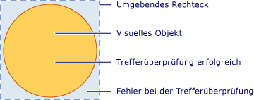
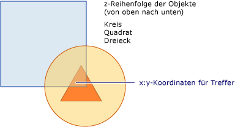

# Treffertests in der visuellen Ebene
Dieses Thema enthält eine Übersicht über die Treffertestfunktionen der visuellen Ebene. Mit der Unterstützung für Treffer Tests können Sie feststellen, ob ein Geometrie-oder Punktwert innerhalb des gerenderten Inhalts einer <xref:System.Windows.Media.Visual>liegt, sodass Sie Benutzeroberflächen Verhalten implementieren können, z. b. ein Auswahl Rechteck, um mehrere Objekte auszuwählen.  

   
## Treffertestszenarios  
 Die <xref:System.Windows.UIElement>-Klasse stellt die <xref:System.Windows.UIElement.InputHitTest%2A>-Methode bereit, mit der Sie einen Treffer Test für ein Element mit einem angegebenen Koordinaten Wert durchsetzen können. In vielen Fällen stellt die <xref:System.Windows.UIElement.InputHitTest%2A>-Methode die gewünschte Funktionalität zum Implementieren von Treffer Tests von Elementen bereit. Es gibt jedoch mehrere Szenarios, bei denen es möglicherweise erforderlich ist, den Treffertest auf der visuellen Ebene zu implementieren.  
  
- Treffer Tests für nicht-<xref:System.Windows.UIElement> Objekte: Dies gilt, wenn beim Testen von nicht<xref:System.Windows.UIElement> Objekten, wie <xref:System.Windows.Media.DrawingVisual> oder Grafikobjekten, ein Treffer auftritt.  
  
- Ein Treffertest unter Verwendung einer Geometrie: Dies gilt für Treffertests unter Verwendung eines Geometrieobjekts statt des Koordinatenwerts eines Punkts.  
  
- Ein Treffertest für mehrere Objekte: Dies gilt fürs Treffertests für mehrere Objekte, wie z.B. überlappende Objekte. Sie können Ergebnisse für alle grafischen Elemente abrufen, die eine Geometrie oder einen Punkt kreuzen, nicht nur für das erste.  
  
- Ignorieren der Richtlinie für die <xref:System.Windows.UIElement> Treffer Tests: Dies gilt, wenn Sie die Richtlinie für die <xref:System.Windows.UIElement> Treffer Tests ignorieren müssen. dabei werden Faktoren berücksichtigt, die davon abhängen, ob ein Element deaktiviert oder unsichtbar ist.  
  
> [!NOTE]
> Ein vollständiges Codebeispiel für einen Treffertest in der visuellen Ebene finden Sie unter [Beispiel für einen Treffertest mit DrawingVisuals](https://github.com/Microsoft/WPF-Samples/tree/master/Visual%20Layer/DrawingVisual) und [Beispiel für einen Treffertest mit Win32-Interoperabilität](https://github.com/microsoft/WPF-Samples/tree/master/Visual%20Layer/VisualsHitTesting).  
  
   
## Unterstützung für den Treffertest  
 Der Zweck der <xref:System.Windows.Media.VisualTreeHelper.HitTest%2A> Methoden in der <xref:System.Windows.Media.VisualTreeHelper>-Klasse besteht darin, zu bestimmen, ob sich ein Geometrie-oder Punkt Koordinaten Wert innerhalb des gerenderten Inhalts eines bestimmten Objekts befindet, z. b. ein Steuerelement oder ein grafisches Element. Sie können beispielsweise den Treffertest verwenden um zu bestimmen, ob ein Mausklick innerhalb des umgebenden Rechtecks eines Objekts in die Geometrie eines Kreises fällt. Sie können auch die Standardimplementierung für den Treffertest überschreiben, um Ihre eigenen benutzerdefinierten Treffertestberechnungen durchzuführen.  
  
 Die folgende Abbildung zeigt die Beziehung zwischen dem Bereich eines nicht rechteckigen Objekts und seinem umschließenden Rechteck.  
  
   
Diagramm eines gültigen Treffertestbereichs  
  
   
## Treffertest und Z-Reihenfolge  
 Die visuelle Ebene für [!INCLUDE[TLA#tla_winclient](../../../../includes/tlasharptla-winclient-md.md)] unterstützt den Treffertest für alle Objekte unter einem Punkt oder einer Geometrie und nicht nur für das oberste Objekt. Die Ergebnisse werden in Z-Reihenfolge zurückgegeben. Das visuelle Objekt, das Sie als Parameter an die <xref:System.Windows.Media.VisualTreeHelper.HitTest%2A>-Methode übergeben, bestimmt jedoch, welcher Teil der visuellen Struktur als Treffer Test verwendet wird. Sie können einen Treffertest für die ganze visuelle Struktur oder einen beliebigen Teil davon durchführen.  
  
 In der folgenden Abbildung befindet sich das Kreisobjekt sowohl auf dem Quadrat als auch auf dem Dreieck. Wenn Sie nur an einem Treffer Test für das visuelle Objekt interessiert sind, dessen Wert für die z-Reihenfolge oberste ist, können Sie die Enumeration des visuellen Treffer Tests so festlegen, dass <xref:System.Windows.Media.HitTestResultBehavior.Stop> vom <xref:System.Windows.Media.HitTestResultCallback> zurückgegeben wird, um den Treffer Test Durchlauf nach dem ersten Element zu unterbinden.  
  
   
Diagramm der Z-Reihenfolge einer visuellen Struktur  
  
 Wenn Sie alle visuellen Objekte unter einem bestimmten Punkt oder einer Geometrie auflisten möchten, geben Sie <xref:System.Windows.Media.HitTestResultBehavior.Continue> aus der <xref:System.Windows.Media.HitTestResultCallback>zurück. Dies bedeutet, dass Sie den Treffertest sogar für vollständig von anderen Objekten überdeckte visuelle Objekte durchführen können. Weitere Informationen finden Sie im Beispielcode im Abschnitt „Verwenden eines Treffertest-Ergebnisrückrufs“.  
  
> [!NOTE]
> Auch für transparente visuelle Objekte kann der Treffertest durchgeführt werden.  
  
   
## Verwenden des Standardtreffertests  
 Sie können ermitteln, ob sich ein Punkt innerhalb der Geometrie eines visuellen Objekts befindet, indem Sie die <xref:System.Windows.Media.VisualTreeHelper.HitTest%2A>-Methode verwenden, um ein visuelles Objekt und einen Punkt Koordinaten Wert für den Test anzugeben. Der visuelle Objektparameter identifiziert den Ausgangspunkt in der visuellen Struktur für die Treffertestsuche. Wenn ein visuelles Objekt in der visuellen Struktur gefunden wird, deren Geometrie die-Koordinate enthält, wird es auf die <xref:System.Windows.Media.HitTestResult.VisualHit%2A>-Eigenschaft eines <xref:System.Windows.Media.HitTestResult>-Objekts festgelegt. Der <xref:System.Windows.Media.HitTestResult> wird dann von der <xref:System.Windows.Media.VisualTreeHelper.HitTest%2A>-Methode zurückgegeben. Wenn der Punkt nicht in der visuellen Teilstruktur enthalten ist, für die Sie einen Treffer Test durchlaufen, gibt <xref:System.Windows.Media.VisualTreeHelper.HitTest%2A> `null`zurück.  
  
> [!NOTE]
> Der Standardtreffertest gibt immer das oberste Objekt in der Z-Reihenfolge zurück. Wenn Sie alle visuellen Objekte identifizieren möchten – auch diejenigen, die teilweise oder vollständig verdeckt sind –, verwenden Sie einen Treffertest-Ergebnisrückruf.  
  
 Der Koordinaten Wert, den Sie als Punkt Parameter für die <xref:System.Windows.Media.VisualTreeHelper.HitTest%2A>-Methode übergeben, muss relativ zum Koordinaten Bereich des visuellen Objekts sein, für das Sie den Treffer Test durchlaufen. Wenn Sie beispielsweise visuelle Objekte geschachtelt haben, die im übergeordneten Koordinatenraum bei (100, 100) definiert sind, entspricht der Treffertest eines untergeordneten visuellen Objekts bei (0, 0) dem Treffertest bei (100, 100) im übergeordneten Koordinatenraum.  
  
 Der folgende Code zeigt, wie Sie Maus Ereignishandler für ein <xref:System.Windows.UIElement> Objekt einrichten, das verwendet wird, um Ereignisse zu erfassen, die für Treffer Tests verwendet werden.  
  
 [!code-csharp[HitTestingOverview#100](~/samples/snippets/csharp/VS_Snippets_Wpf/HitTestingOverview/CSharp/Window1.xaml.cs#100)]
 [!code-vb[HitTestingOverview#100](~/samples/snippets/visualbasic/VS_Snippets_Wpf/HitTestingOverview/visualbasic/window1.xaml.vb#100)]  
  
### Beeinflussung des Treffertests durch die visuelle Struktur  
 Der Startpunkt in der visuellen Struktur bestimmt, welche Objekte während der Treffertestenumeration der Objekte zurückgegeben werden. Wenn Sie für mehrere Objekte einen Treffertest durchführen möchten, muss das in der visuellen Struktur als Startpunkt verwendete Objekt das gemeinsame übergeordnete Element aller betroffenen Objekte sein. Wenn Sie beispielsweise sowohl für das Schaltflächenelement als auch für das visuelle Zeichnungsobjekt im folgenden Diagramm einen Treffertest durchführen möchten, müssen Sie den Startpunkt in der visuellen Struktur auf das gemeinsame übergeordnete Objekt für diese beiden Elemente festlegen. In diesem Fall ist das Canvas-Element das übergeordnete Objekt für das Schaltflächenelement und das visuelle Zeichnungsobjekt.  
  
   
Diagramm einer visuellen Strukturhierarchie  
  
> [!NOTE]
> Die <xref:System.Windows.UIElement.IsHitTestVisible%2A>-Eigenschaft ruft einen Wert ab oder legt einen Wert fest, der deklariert, ob ein <xref:System.Windows.UIElement>abgeleitetes Objekt möglicherweise als Treffer Testergebnis von einem Teil des gerenderten Inhalts zurückgegeben werden kann. Dadurch haben Sie die Möglichkeit, selektiv Änderungen an der visuellen Struktur vorzunehmen, um zu bestimmen, welche visuellen Objekte an einem Treffertest beteiligt sind.  
  
   
## Verwenden eines Treffertest-Ergebnisrückrufs  
 Sie können alle visuellen Objekte in einer visuellen Struktur auflisten, deren Geometrie einen angegebenen Koordinatenwert enthält. Dadurch können Sie alle visuellen Objekte identifizieren, auch diejenigen, die teilweise oder vollständig von anderen visuellen Objekten verdeckt werden. Um visuelle Objekte in einer visuellen Struktur aufzulisten, verwenden Sie die <xref:System.Windows.Media.VisualTreeHelper.HitTest%2A>-Methode mit einer Treffer Test-Rückruffunktion. Die Treffertest-Rückruffunktion wird vom System aufgerufen, wenn der von Ihnen angegebene Koordinatenwert in einem visuellen Objekt enthalten ist.  
  
 Während der Auflistung der Treffertestergebnisse sollten Sie keine Vorgänge ausführen, die die visuelle Struktur ändern. Das Hinzufügen oder Entfernen eines Objekts aus der visuellen Struktur, während diese durchlaufen wird, kann zu unvorhersehbarem Verhalten führen. Sie können die visuelle Struktur sicher ändern, nachdem die <xref:System.Windows.Media.VisualTreeHelper.HitTest%2A>-Methode zurückgegeben wurde. Sie können eine Datenstruktur wie eine <xref:System.Collections.ArrayList>bereitstellen, um Werte während der Enumeration der Treffer Testergebnisse zu speichern.  
  
 [!code-csharp[HitTestingOverview#101](~/samples/snippets/csharp/VS_Snippets_Wpf/HitTestingOverview/CSharp/Window1.xaml.cs#101)]
 [!code-vb[HitTestingOverview#101](~/samples/snippets/visualbasic/VS_Snippets_Wpf/HitTestingOverview/visualbasic/window1.xaml.vb#101)]  
  
 Die Treffertest-Rückrufmethode definiert die Aktionen, die ausgeführt werden, wenn ein Treffertest für ein bestimmtes visuelles Objekt in der visuellen Struktur identifiziert wird. Nachdem Sie die Aktionen ausgeführt haben, geben Sie einen <xref:System.Windows.Media.HitTestResultBehavior> Wert zurück, der bestimmt, ob die Enumeration anderer visueller Objekte fortgesetzt werden soll.  
  
 [!code-csharp[HitTestingOverview#102](~/samples/snippets/csharp/VS_Snippets_Wpf/HitTestingOverview/CSharp/Window1.xaml.cs#102)]
 [!code-vb[HitTestingOverview#102](~/samples/snippets/visualbasic/VS_Snippets_Wpf/HitTestingOverview/visualbasic/window1.xaml.vb#102)]  
  
> [!NOTE]
> Die Auflistung der visuellen Objekttreffer erfolgt in Z-Reihenfolge. Das visuelle Objekt auf der obersten Z-Reihenfolgenebene ist das erste aufgelistete Objekt. Alle anderen visuellen Objekte werden absteigend gemäß der Z-Reihenfolge aufgelistet. Diese Auflistungsreihenfolge entspricht der Renderingreihenfolge der grafischen Elemente.  
  
 Sie können die Enumeration von visuellen Objekten jederzeit in der Treffer Test-Rückruffunktion abbrechen, indem Sie <xref:System.Windows.Media.HitTestResultBehavior.Stop>zurückgeben.  
  
 [!code-csharp[HitTestingOverview#103](~/samples/snippets/csharp/VS_Snippets_Wpf/HitTestingOverview/CSharp/Window1.xaml.cs#103)]
 [!code-vb[HitTestingOverview#103](~/samples/snippets/visualbasic/VS_Snippets_Wpf/HitTestingOverview/visualbasic/window1.xaml.vb#103)]  
  
   
## Verwenden eines Treffertestfilter-Rückrufs  
 Sie können einen optionalen Treffertestfilter verwenden, um die an die Treffertestergebnisse übergebenen Objekte zu begrenzen. Dadurch können Sie die Teile der visuellen Struktur ignorieren, die nicht in Ihren Treffertestergebnissen verarbeitet werden sollen. Zum Implementieren eines Treffer Test Filters definieren Sie eine Treffer Test Filter-Rückruffunktion und übergeben Sie als Parameterwert, wenn Sie die <xref:System.Windows.Media.VisualTreeHelper.HitTest%2A>-Methode aufrufen.  
  
 [!code-csharp[HitTestingOverview#104](~/samples/snippets/csharp/VS_Snippets_Wpf/HitTestingOverview/CSharp/Window1.xaml.cs#104)]
 [!code-vb[HitTestingOverview#104](~/samples/snippets/visualbasic/VS_Snippets_Wpf/HitTestingOverview/visualbasic/window1.xaml.vb#104)]  
  
 Wenn Sie die optionale Treffer Test Filter-Rückruffunktion nicht angeben möchten, übergeben Sie einen `null` Wert als Parameter für die <xref:System.Windows.Media.VisualTreeHelper.HitTest%2A>-Methode.  
  
 [!code-csharp[HitTestingOverview#105](~/samples/snippets/csharp/VS_Snippets_Wpf/HitTestingOverview/CSharp/Window1.xaml.cs#105)]
 [!code-vb[HitTestingOverview#105](~/samples/snippets/visualbasic/VS_Snippets_Wpf/HitTestingOverview/visualbasic/window1.xaml.vb#105)]  
  
   
Reduzieren der Verzweigungen in einer visuellen Struktur  
  
 Mit der Treffertestfilter-Rückruffunktion können Sie alle visuellen Objekte auflisten, deren gerenderte Inhalte die von Ihnen angegebenen Koordinaten enthalten. Sie können jedoch auch bestimmte Verzweigungen der visuellen Struktur ignorieren, die im Rahmen Ihrer Treffertestergebnis-Rückruffunktion nicht verarbeitet werden sollen. Der Rückgabewert der Treffertestfilter-Rückruffunktion bestimmt, welcher Typ von Aktion von der Enumeration der visuellen Objekte ausgeführt werden soll. Wenn Sie z. b. den Wert <xref:System.Windows.Media.HitTestFilterBehavior.ContinueSkipSelfAndChildren>zurückgeben, können Sie das aktuelle visuelle Objekt und seine untergeordneten Elemente aus der Enumeration der Treffer Testergebnisse entfernen. Dies bedeutet, dass für die Treffertestergebnis-Rückruffunktion diese Objekte nicht in der Auflistung enthalten sind. Durch das Reduzieren der Verzweigungen in der visuellen Struktur von Objekten wird der Verarbeitungsaufwand während der Übergabe der Auflistung von Treffertestergebnissen verringert. Im folgenden Codebeispiel überspringt der Filter Bezeichnungen und ihre Nachfolgerelemente und führt für alle anderen Elemente Treffertests durch.  
  
 [!code-csharp[HitTestingOverview#106](~/samples/snippets/csharp/VS_Snippets_Wpf/HitTestingOverview/CSharp/Window1.xaml.cs#106)]
 [!code-vb[HitTestingOverview#106](~/samples/snippets/visualbasic/VS_Snippets_Wpf/HitTestingOverview/visualbasic/window1.xaml.vb#106)]  
  
> [!NOTE]
> Der Treffertestfilter-Rückruf wird gelegentlich aufgerufen, wenn der Treffertestergebnis-Rückruf nicht aufgerufen wird.  
  
   
## Überschreiben des Standardtreffertests  
 Sie können die standardmäßige Treffer Testunterstützung eines visuellen Objekts überschreiben, indem Sie die <xref:System.Windows.Media.Visual.HitTestCore%2A>-Methode überschreiben. Dies bedeutet, dass die überschriebene Implementierung von <xref:System.Windows.Media.Visual.HitTestCore%2A> aufgerufen wird, wenn Sie die <xref:System.Windows.Media.VisualTreeHelper.HitTest%2A>-Methode aufrufen. Ihre überschriebene Methode wird aufgerufen, wenn sich ein Treffertest innerhalb des umgebenden Rechtecks für das visuelle Objekt befindet. Dies gilt auch dann, wenn die Koordinate außerhalb des gerenderten Inhalts des visuellen Objekts liegt.  
  
 [!code-csharp[HitTestingOverview#107](~/samples/snippets/csharp/VS_Snippets_Wpf/HitTestingOverview/CSharp/Window1.xaml.cs#107)]
 [!code-vb[HitTestingOverview#107](~/samples/snippets/visualbasic/VS_Snippets_Wpf/HitTestingOverview/visualbasic/window1.xaml.vb#107)]  
  
 Es kann vorkommen, dass Sie einen Treffertest sowohl für das umschließende Rechteck als auch für den gerenderten Inhalt eines visuellen Objekts durchführen möchten. Wenn Sie den `PointHitTestParameters` Parameterwert in der überschriebenen <xref:System.Windows.Media.Visual.HitTestCore%2A>-Methode als Parameter für die Basis Methode <xref:System.Windows.Media.Visual.HitTestCore%2A>verwenden, können Sie Aktionen auf der Grundlage eines Treffer des umschließenden Rechtecks eines visuellen Objekts ausführen und dann einen zweiten Treffer Test für den gerenderten Inhalt des visuellen Objekts durchführen.  
  
 [!code-csharp[HitTestingOverview#108](~/samples/snippets/csharp/VS_Snippets_Wpf/HitTestingOverview/CSharp/Window1.xaml.cs#108)]
 [!code-vb[HitTestingOverview#108](~/samples/snippets/visualbasic/VS_Snippets_Wpf/HitTestingOverview/visualbasic/window1.xaml.vb#108)]  
  
## Siehe auch

- <xref:System.Windows.Media.VisualTreeHelper.HitTest%2A>
- <xref:System.Windows.Media.HitTestResult>
- <xref:System.Windows.Media.HitTestResultCallback>
- <xref:System.Windows.Media.HitTestFilterCallback>
- <xref:System.Windows.UIElement.IsHitTestVisible%2A>
- [Beispiel für einen Treffer Test mit DrawingVisuals](https://github.com/Microsoft/WPF-Samples/tree/master/Visual%20Layer/DrawingVisual)
- [Beispiel für einen Treffer Test mit Win32-Interoperation](https://github.com/microsoft/WPF-Samples/tree/master/Visual%20Layer/VisualsHitTesting)
- [Vorgehensweise: Treffertest für eine Geometrie in einem visuellen Objekt](how-to-hit-test-geometry-in-a-visual.md)
- [Treffertest mithilfe eines Win32-Hostcontainers](how-to-hit-test-using-a-win32-host-container.md)
