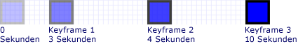
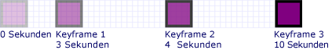
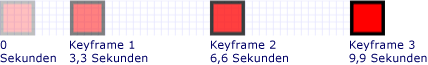
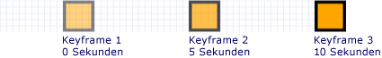

# Gewusst wie: Zeitliche Steuerung einer Keyframe-AnimationHow to: Control Key-Frame Animation Timing

In diesem Beispiel wird gezeigt, wie das Timing von Schlüsselbildern in einer Keyframe-Animation gesteuert wird.This example shows how to control the timing of key frames within a key-frame animation. Wie andere Animationen verfügen Keyframe-Animationen über eine <xref:System.Windows.Media.Animation.Timeline.Duration%2A> Eigenschaft.Like other animations, key-frame animations have a <xref:System.Windows.Media.Animation.Timeline.Duration%2A> property. Zusätzlich zur Angabe der Dauer einer Animation müssen Sie angeben, welcher Teil dieser Dauer jedem seiner Schlüsselbilder zugewiesen ist.In addition to specifying the duration of an animation, you need to specify what part of that duration is allotted to each of its key frames. Um die Zeit zuzumachen, geben Sie für jeden Schlüsselrahmen in der Animation eine <xref:System.Windows.Media.Animation.KeyTime> an.To allot the time, you specify a <xref:System.Windows.Media.Animation.KeyTime> for each key frame in the animation.

Der <xref:System.Windows.Media.Animation.KeyTime> für jeden Schlüsselrahmen gibt an, wann ein Schlüsselrahmen endet (er gibt nicht an, wie lange ein Schlüsselrahmen abgespielt wird).The <xref:System.Windows.Media.Animation.KeyTime> for each key frame specifies when a key frame ends (it does not specify the length of time a key frame plays). Sie können <xref:System.Windows.Media.Animation.KeyTime> einen <xref:System.TimeSpan> Wert als Wert, als <xref:System.Windows.Media.Animation.KeyTime.Uniform%2A> Prozentsatz <xref:System.Windows.Media.Animation.KeyTime.Paced%2A> oder als oder als Sonderwert angeben.You can specify a <xref:System.Windows.Media.Animation.KeyTime> as a <xref:System.TimeSpan> value, as a percentage, or as the <xref:System.Windows.Media.Animation.KeyTime.Uniform%2A> or <xref:System.Windows.Media.Animation.KeyTime.Paced%2A> special value.

## BeispielExample

Im folgenden Beispiel <xref:System.Windows.Media.Animation.DoubleAnimationUsingKeyFrames> wird ein verwendet, um ein Rechteck auf dem Bildschirm zu animieren.The following example uses a <xref:System.Windows.Media.Animation.DoubleAnimationUsingKeyFrames> to animate a rectangle across the screen. Die Schlüsselzeiten der Keyframes <xref:System.TimeSpan> werden mit Werten festgelegt.The key frames' key times are set with <xref:System.TimeSpan> values.

[!code-csharp[keyframes_snip#KeyTimesTimeSpanExample](~/samples/snippets/csharp/VS_Snippets_Wpf/keyframes_snip/CSharp/KeyTimesExample.cs#keytimestimespanexample)]
[!code-vb[keyframes_snip#KeyTimesTimeSpanExample](~/samples/snippets/visualbasic/VS_Snippets_Wpf/keyframes_snip/visualbasic/keytimesexample.vb#keytimestimespanexample)]
[!code-xaml[keyframes_snip#KeyTimesTimeSpanExample](~/samples/snippets/xaml/VS_Snippets_Wpf/keyframes_snip/XAML/KeyTimesExample.xaml#keytimestimespanexample)]

Die folgende Abbildung zeigt, wann der Wert jedes Schlüsselrahmens erreicht ist.The following illustration shows when the value of each key frame is reached.

Das nächste Beispiel zeigt eine Animation, die identisch ist, mit der Ausnahme, dass die Schlüsselzeiten der Schlüsselrahmen mit Prozentwerten festgelegt sind.The next example shows an animation that is identical, except that the key frames' key times are set with percentage values.

[!code-csharp[keyframes_snip#KeyTimesPercentageExample](~/samples/snippets/csharp/VS_Snippets_Wpf/keyframes_snip/CSharp/KeyTimesExample.cs#keytimespercentageexample)]
[!code-vb[keyframes_snip#KeyTimesPercentageExample](~/samples/snippets/visualbasic/VS_Snippets_Wpf/keyframes_snip/visualbasic/keytimesexample.vb#keytimespercentageexample)]
[!code-xaml[keyframes_snip#KeyTimesPercentageExample](~/samples/snippets/xaml/VS_Snippets_Wpf/keyframes_snip/XAML/KeyTimesExample.xaml#keytimespercentageexample)]

Die folgende Abbildung zeigt, wann der Wert jedes Schlüsselrahmens erreicht ist.The following illustration shows when the value of each key frame is reached.

Im nächsten <xref:System.Windows.Media.Animation.KeyTime.Uniform%2A> Beispiel werden wichtige Zeitwerte verwendet.The next example uses <xref:System.Windows.Media.Animation.KeyTime.Uniform%2A> key time values.

[!code-csharp[keyframes_snip#KeyTimesUniformExample](~/samples/snippets/csharp/VS_Snippets_Wpf/keyframes_snip/CSharp/KeyTimesExample.cs#keytimesuniformexample)]
[!code-vb[keyframes_snip#KeyTimesUniformExample](~/samples/snippets/visualbasic/VS_Snippets_Wpf/keyframes_snip/visualbasic/keytimesexample.vb#keytimesuniformexample)]
[!code-xaml[keyframes_snip#KeyTimesUniformExample](~/samples/snippets/xaml/VS_Snippets_Wpf/keyframes_snip/XAML/KeyTimesExample.xaml#keytimesuniformexample)]

Die folgende Abbildung zeigt, wann der Wert jedes Schlüsselrahmens erreicht ist.The following illustration shows when the value of each key frame is reached.

Im letzten <xref:System.Windows.Media.Animation.KeyTime.Paced%2A> Beispiel werden wichtige Zeitwerte verwendet.The final example uses <xref:System.Windows.Media.Animation.KeyTime.Paced%2A> key time values.

[!code-csharp[keyframes_snip#KeyTimesPacedExample](~/samples/snippets/csharp/VS_Snippets_Wpf/keyframes_snip/CSharp/KeyTimesExample.cs#keytimespacedexample)]
[!code-vb[keyframes_snip#KeyTimesPacedExample](~/samples/snippets/visualbasic/VS_Snippets_Wpf/keyframes_snip/visualbasic/keytimesexample.vb#keytimespacedexample)]
[!code-xaml[keyframes_snip#KeyTimesPacedExample](~/samples/snippets/xaml/VS_Snippets_Wpf/keyframes_snip/XAML/KeyTimesExample.xaml#keytimespacedexample)]

Die folgende Abbildung zeigt, wann der Wert jedes Schlüsselrahmens erreicht ist.The following illustration shows when the value of each key frame is reached.

Der Einfachheit halber verwenden die Codeversionen dieses Beispiels lokale Animationen und keine Storyboards, da nur eine einzelne Animation auf eine einzelne Eigenschaft angewendet wird, die Beispiele jedoch geändert werden können, um Storyboards stattdessen zu verwenden.For simplicity, the code versions of this example use local animations, not storyboards, because only a single animation is being applied to a single property, but the examples may be modified to use storyboards instead. Ein Beispiel zum Deklarieren eines Storyboards im Code finden Sie unter [Animieren einer Eigenschaft mithilfe eines Storyboards](how-to-animate-a-property-by-using-a-storyboard.md).For an example showing how to declare a storyboard in code, see [Animate a Property by Using a Storyboard](how-to-animate-a-property-by-using-a-storyboard.md).

Das vollständige Beispiel finden Sie unter [Beispiel für eine Keyframe-Animation](https://github.com/microsoft/WPF-Samples/tree/master/Animation/KeyFrameAnimation).For the complete sample, see [KeyFrame Animation Sample](https://github.com/microsoft/WPF-Samples/tree/master/Animation/KeyFrameAnimation). Weitere Informationen zu Keyframe-Animationen finden Sie in der [Key-Frame-Animationsübersicht](key-frame-animations-overview.md).For more information about key frame animations, see the [Key-Frame Animations Overview](key-frame-animations-overview.md).

## Siehe auchSee also

- [Übersicht über Keyframe-AnimationenKey-Frame Animations Overview](key-frame-animations-overview.md)
- [Übersicht über AnimationenAnimation Overview](animation-overview.md)
- [Gewusst wie-ThemenHow-to Topics](animation-and-timing-how-to-topics.md)
