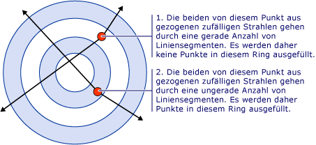
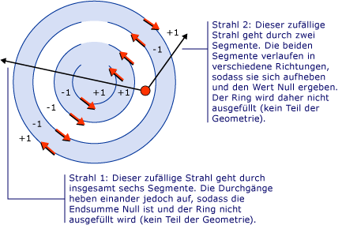
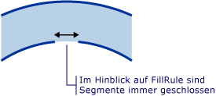

# Gewusst wie: Steuern des Ausfüllens einer zusammengesetzten Form
Die <xref:System.Windows.Media.GeometryGroup.FillRule%2A> Eigenschaft von einem <xref:System.Windows.Media.GeometryGroup> oder eine <xref:System.Windows.Media.PathGeometry>, gibt eine "Regel" die zusammengesetzte Form verwendet wird, um zu bestimmen, ob ein angegebener Punkt Teil der Geometrie ist. Es gibt zwei mögliche Werte für <xref:System.Windows.Media.FillRule>: <xref:System.Windows.Media.FillRule.EvenOdd> und <xref:System.Windows.Media.FillRule.Nonzero>. In den folgenden Abschnitten wird beschrieben, wie diese beiden Regeln verwendet werden.  
  
 **EvenOdd:** Diese Regel ermittelt, ob sich ein Punkt im Ausfüllbereich befindet, indem von diesem Punkt aus ein Strahl in beliebiger Richtung gegen Unendlich gezeichnet wird und die Anzahl der vom Strahl geschnittenen Pfadsegmente in der Form gezählt wird. Bei einer ungeraden Zahl liegt der Punkt innen, und bei einer geraden Zahl liegt er außen.  
  
 Der folgende XAML-Code erstellt z. B. eine zusammengesetzte Form, bestehend aus einer Reihe von konzentrische Ringe (Ziel) mit einem <xref:System.Windows.Media.GeometryGroup.FillRule%2A> festgelegt <xref:System.Windows.Media.FillRule.EvenOdd>.  
  
 [!code-xaml[GeometriesMiscSnippets_snip#FillRuleEvenOddValue](../../../../samples/snippets/xaml/VS_Snippets_Wpf/GeometriesMiscSnippets_snip/XAML/FillRuleExample.xaml#fillruleevenoddvalue)]  
  
 Die folgende Abbildung zeigt die im vorherigen Beispiel erstellte Form.  
  
   
  
 Beachten Sie, dass in der Abbildung oben die Mitte und der dritte Ring nicht ausgefüllt sind. Dies ist darauf zurückzuführen, dass ein Strahl, der von einem beliebigen Punkt innerhalb eines dieser beiden Ringe gezeichnet wird, eine gerade Anzahl von Segmenten schneidet. Dies wird aus der folgenden Abbildung ersichtlich:  
  
   
  
 **NonZero:** Diese Regel bestimmt, ob sich ein Punkt im Ausfüllbereich im Pfad befindet, indem ein unendlicher Strahl von diesem Punkt in eine beliebige Richtung gezeichnet wird und anschließend die Stellen überprüft werden, an denen ein Segment der Form den Strahl schneidet. Beginnen Sie mit dem Wert 0 (null), und addieren Sie für jede Stelle, an der ein Segment den Strahl von links nach rechts schneidet, den Wert 1. Wenn das Ergebnis nach dem Zählen der Überschneidungen 0 (null) ist, liegt der Punkt außerhalb des Pfads. Andernfalls liegt er innerhalb des Pfads.  
  
 [!code-xaml[GeometriesMiscSnippets_snip#FillRuleNonZeroValueEllipseGeometry](../../../../samples/snippets/xaml/VS_Snippets_Wpf/GeometriesMiscSnippets_snip/XAML/FillRuleExample.xaml#fillrulenonzerovalueellipsegeometry)]  
  
 Im Beispiel oben, einen Wert von <xref:System.Windows.Media.FillRule.Nonzero> für <xref:System.Windows.Media.GeometryGroup.FillRule%2A> erhalten Sie daher die folgende Abbildung:  
  
   
  
 Wie Sie sehen können, sind alle Ringe ausgefüllt. Dies kommt daher, dass alle Segmente in die gleiche Richtung verlaufen und deshalb ein Strahl, der von einem beliebigen Punkt aus gezeichnet wird, ein oder mehrere Segmente schneidet, sodass die Summe der Schnitte ungleich 0 (null) ist. So stellen zum Beispiel die roten Pfeile in der unten aufgeführten Abbildung die Richtung dar, in die die Segmente gezeichnet werden. Die weißen Pfeile stellen einen zufälligen Strahl dar, der von einem Punkt im innersten Ring aus verläuft. Ausgehend vom Wert 0 (null) wird für jedes Segment, das der Strahl schneidet, der Wert 1 addiert, da das Segment den Strahl von links nach rechts schneidet.  
  
   
  
 Um das Verhalten des besser zu veranschaulichen <xref:System.Windows.Media.FillRule.Nonzero> Regel eine komplexere Form mit Segmenten, die ausgeführt wird, in verschiedene Richtungen erforderlich ist. Der folgenden XAML-Code erstellt einen ähnlichen Form wie im vorherigen Beispiel, außer dass es mit erstellt wird eine <xref:System.Windows.Media.PathGeometry> anstelle einer <xref:System.Windows.Media.EllipseGeometry> erstellt vier konzentrische Bogen statt vollständig geschlossene konzentrische Kreise.  
  
 [!code-xaml[GeometriesMiscSnippets_snip#FillRuleNonZeroValuePathGeometry](../../../../samples/snippets/xaml/VS_Snippets_Wpf/GeometriesMiscSnippets_snip/XAML/FillRuleExample.xaml#fillrulenonzerovaluepathgeometry)]  
  
 Die folgende Abbildung zeigt die im vorherigen Beispiel erstellte Form.  
  
   
  
 Beachten Sie, dass der dritte Bogen ab der Mitte nicht ausgefüllt ist. Die folgende Abbildung zeigt, warum dies so ist. In der Abbildung stellen die roten Pfeile die Richtung dar, in der die Segmente gezeichnet werden. Die beiden weißen Pfeile stellen zwei zufällige Strahlen dar, die von einem Punkt im „nicht ausgefüllten“ Bereich ausgehen. Wie aus der Abbildung ersichtlich, ist die Summe der Werte eines bestimmten Strahls, der die Segmente in seinem Pfad schneidet, gleich 0 (null). Wie oben bereits definiert, bedeutet eine Summe von null, dass der Punkt nicht Teil der Geometrie ist (kein Teil der Füllung), während eine Summe, die *ungleich* null oder negativ ist, Teil der Geometrie ist.  
  
   
  
 **Hinweis:** zum Zweck der <xref:System.Windows.Media.FillRule>, alle Formen gelten als geschlossen. Wenn in einem Segment eine Lücke vorhanden ist, zeichnen Sie eine gedachte Linie, um sie zu schließen. Im oben aufgeführten Beispiel weisen die Ringe kleine Lücken auf. Daher könnte man erwarten, dass ein Strahl durch die Lücke verläuft und ein anderes Ergebnis ergibt als ein Strahl, der in eine andere Richtung verläuft. Im folgenden finden Sie eine vergrößerte Abbildung einer dieser Lücken und "imaginären Segment" (Segment, das zum Zweck der anwenden gezeichnet wird die <xref:System.Windows.Media.FillRule>), die geschlossen wird.  
  
   
  
## Beispiel  
  
## Siehe auch  
 [Erstellen einer zusammengesetzten Form](../../../../docs/framework/wpf/graphics-multimedia/how-to-create-a-composite-shape.md)  
 [Übersicht über Geometrien](../../../../docs/framework/wpf/graphics-multimedia/geometry-overview.md)
