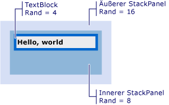

# Vorgehensweise: Abrufen des Offsets eines visuellen Objekts
Diese Beispiele zeigen, wie Sie den Offsetwert des visuellen Objekts abrufen, die relativ zu seinem übergeordneten Element oder Vorgänger oder Nachfolger ist.  
  
## Beispiel  
 Das folgende Markup-Beispiel zeigt eine <xref:System.Windows.Controls.TextBlock> , definiert ist, mit <xref:System.Windows.FrameworkElement.Margin%2A> Wert 4.  
  
 [!code-xaml[VisualSnippets#VisualSnippet1](~/samples/snippets/csharp/VS_Snippets_Wpf/VisualSnippets/CSharp/Window1.xaml#visualsnippet1)]  
  
 Im folgenden Codebeispiel wird veranschaulicht, wie Sie mit der <xref:System.Windows.Media.VisualTreeHelper.GetOffset%2A> Methode zum Abrufen des Offsets für die <xref:System.Windows.Controls.TextBlock>. Der Offset-Werte befinden sich in der zurückgegebenen <xref:System.Windows.Vector> Wert.  
  
 [!code-csharp[VisualSnippets#VisualSnippet2](~/samples/snippets/csharp/VS_Snippets_Wpf/VisualSnippets/CSharp/Window1.xaml.cs#visualsnippet2)]
 [!code-vb[VisualSnippets#VisualSnippet2](~/samples/snippets/visualbasic/VS_Snippets_Wpf/VisualSnippets/visualbasic/window1.xaml.vb#visualsnippet2)]  
  
 Der Offset berücksichtigt die <xref:System.Windows.FrameworkElement.Margin%2A> Wert. In diesem Fall <xref:System.Windows.Vector.X%2A> ist 4. und <xref:System.Windows.Vector.Y%2A> ist 4.  
  
 Der Rückgabewert der Offset ist relativ zum übergeordneten von der <xref:System.Windows.Media.Visual>. Sollten Sie einen Offset-Wert zurück, die nicht relativ zu das übergeordnete Element ist ein <xref:System.Windows.Media.Visual>, verwenden Sie die <xref:System.Windows.Media.Visual.TransformToAncestor%2A> Methode.  
  
## Den Offset abrufen relativ zu einem Vorgänger  
 Das folgende Markup-Beispiel zeigt eine <xref:System.Windows.Controls.TextBlock> , zwei geschachtelt ist <xref:System.Windows.Controls.StackPanel> Objekte.  
  
 [!code-xaml[VisualSnippets#VisualSnippet7](~/samples/snippets/csharp/VS_Snippets_Wpf/VisualSnippets/CSharp/Window2.xaml#visualsnippet7)]  
  
 Die folgende Abbildung zeigt die Ergebnisse des Markups.  
  
   
TextBlock in zwei StackPanels geschachtelt.  
  
 Im folgenden Codebeispiel wird veranschaulicht, wie Sie mit der <xref:System.Windows.Media.Visual.TransformToAncestor%2A> Methode zum Abrufen des Offsets für die <xref:System.Windows.Controls.TextBlock> relativ zum enthaltenden <xref:System.Windows.Window>. Der Offset-Werte befinden sich in der zurückgegebenen <xref:System.Windows.Media.GeneralTransform> Wert.  
  
 [!code-csharp[VisualSnippets#VisualSnippet5](~/samples/snippets/csharp/VS_Snippets_Wpf/VisualSnippets/CSharp/Window1.xaml.cs#visualsnippet5)]
 [!code-vb[VisualSnippets#VisualSnippet5](~/samples/snippets/visualbasic/VS_Snippets_Wpf/VisualSnippets/visualbasic/window1.xaml.vb#visualsnippet5)]  
  
 Der Offset berücksichtigt die <xref:System.Windows.FrameworkElement.Margin%2A> Werte für alle Objekte innerhalb des enthaltenden <xref:System.Windows.Window>. In diesem Fall <xref:System.Windows.Vector.X%2A> ist 28 (16 + 8 + 4), und <xref:System.Windows.Vector.Y%2A> ist 28.  
  
 Der Rückgabewert der Offset ist relativ zu den Vorgänger der <xref:System.Windows.Media.Visual>. Sollten Sie einen Offset-Wert zurück, der relativ zum nachfolgenden Wertes des eine <xref:System.Windows.Media.Visual>, verwenden Sie die <xref:System.Windows.Media.Visual.TransformToDescendant%2A> Methode.  
  
## Den Offset abrufen relativ zu einem Nachfolger  
 Das folgende Markup-Beispiel zeigt eine <xref:System.Windows.Controls.TextBlock> , befindet sich innerhalb einer <xref:System.Windows.Controls.StackPanel> Objekt.  
  
 [!code-xaml[VisualSnippets#VisualSnippet4](~/samples/snippets/csharp/VS_Snippets_Wpf/VisualSnippets/CSharp/Window1.xaml#visualsnippet4)]  
  
 Im folgenden Codebeispiel wird veranschaulicht, wie Sie mit der <xref:System.Windows.Media.Visual.TransformToDescendant%2A> Methode zum Abrufen des Offsets für die <xref:System.Windows.Controls.StackPanel> relativ zu dessen untergeordneten <xref:System.Windows.Controls.TextBlock>. Der Offset-Werte befinden sich in der zurückgegebenen <xref:System.Windows.Media.GeneralTransform> Wert.  
  
 [!code-csharp[VisualSnippets#VisualSnippet9](~/samples/snippets/csharp/VS_Snippets_Wpf/VisualSnippets/CSharp/Window1.xaml.cs#visualsnippet9)]
 [!code-vb[VisualSnippets#VisualSnippet9](~/samples/snippets/visualbasic/VS_Snippets_Wpf/VisualSnippets/visualbasic/window1.xaml.vb#visualsnippet9)]  
  
 Der Offset berücksichtigt die <xref:System.Windows.FrameworkElement.Margin%2A> Werte für alle Objekte. In diesem Fall <xref:System.Windows.Vector.X%2A> ist-4. und <xref:System.Windows.Vector.Y%2A> lautet 4. Der Offset-Werte sind negative Werte, da das übergeordnete Objekt relativ zu dessen untergeordneten Objekts negativ versetzt wird.  
  
## Siehe auch
- <xref:System.Windows.Media.Visual>
- <xref:System.Windows.Media.VisualTreeHelper>
- [Übersicht über das WPF-Grafikrendering](wpf-graphics-rendering-overview.md)
