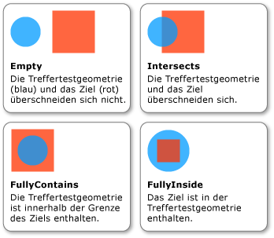

# Gewusst wie: Treffertest mit Geometrie als ParameterHow to: Hit Test Using Geometry as a Parameter
In diesem Beispiel wird gezeigt, wie zum Ausführen von Treffertests auf ein visuelles Objekt mithilfe einer <xref:System.Windows.Media.Geometry> Parameter als Treffer zu testen.This example shows how to perform a hit test on a visual object using a <xref:System.Windows.Media.Geometry> as a hit test parameter.  
  
## BeispielExample  
 Das folgende Beispiel zeigt, wie ein Treffertest mit eingerichtet <xref:System.Windows.Media.GeometryHitTestParameters> für die <xref:System.Windows.Media.VisualTreeHelper.HitTest%2A> Methode.The following example shows how to set up a hit test using <xref:System.Windows.Media.GeometryHitTestParameters> for the <xref:System.Windows.Media.VisualTreeHelper.HitTest%2A> method. Die <xref:System.Windows.Point> -Wert, der übergeben wird die `OnMouseDown` Methode dient zum Erstellen einer <xref:System.Windows.Media.Geometry> Objekt, um den Bereich des Treffertests zu erweitern.The <xref:System.Windows.Point> value that is passed to the `OnMouseDown` method is used to create a <xref:System.Windows.Media.Geometry> object in order to expand the range of the hit test.  
  
 [!code-csharp[HitTestingOverview#HitTestingOverviewSnippet10](../../../../samples/snippets/csharp/VS_Snippets_Wpf/HitTestingOverview/CSharp/GeometryHitTest.cs#hittestingoverviewsnippet10)]
 [!code-vb[HitTestingOverview#HitTestingOverviewSnippet10](../../../../samples/snippets/visualbasic/VS_Snippets_Wpf/HitTestingOverview/visualbasic/geometryhittest.vb#hittestingoverviewsnippet10)]  
  
 Die <xref:System.Windows.Media.GeometryHitTestResult.IntersectionDetail%2A> Eigenschaft <xref:System.Windows.Media.GeometryHitTestResult> enthält Informationen über die Ergebnisse eines Treffertests verwendet eine <xref:System.Windows.Media.Geometry> Parameter als Treffer zu testen.The <xref:System.Windows.Media.GeometryHitTestResult.IntersectionDetail%2A> property of <xref:System.Windows.Media.GeometryHitTestResult> provides information about the results of a hit test that uses a <xref:System.Windows.Media.Geometry> as a hit test parameter. In der folgenden Abbildung wird die Beziehung zwischen der Treffertestgeometrie (blauer Kreis) und dem gerenderten Inhalt des Zielobjekts (rotes Quadrat) dargestellt.The following illustration shows the relationship between the hit test geometry (the blue circle) and the rendered content of the target visual object (the red square).  
  
   
Schnittmenge einer Treffertestgeometrie und eines ZielobjektsIntersection between hit test geometry and target visual object  
  
 Im folgende Beispiel wird gezeigt, wie einen Treffertest-Rückruf implementieren bei einem <xref:System.Windows.Media.Geometry> als Treffertestparameter verwendet wird.The following example shows how to implement a hit test callback when a <xref:System.Windows.Media.Geometry> is used as a hit test parameter. Die `result` Parameter umgewandelt wird eine <xref:System.Windows.Media.GeometryHitTestResult> zum Abrufen des Werts der <xref:System.Windows.Media.GeometryHitTestResult.IntersectionDetail%2A> Eigenschaft.The `result` parameter is cast to a <xref:System.Windows.Media.GeometryHitTestResult> in order to retrieve the value of the <xref:System.Windows.Media.GeometryHitTestResult.IntersectionDetail%2A> property. Den Wert der Eigenschaft können Sie bestimmen, ob die <xref:System.Windows.Media.Geometry> Treffertest-Parameter ist vollständig oder teilweise enthaltenen den gerenderten Inhalt des Ziels Treffertest.The property value allows you to determine if the <xref:System.Windows.Media.Geometry> hit test parameter is fully or partially contained within the rendered content of the hit test target. In diesem Fall fügt der Beispielcode der Liste visueller Objekte nur Treffertestergebnisse hinzu, die vollständig im Zielbereich enthalten sind.In this case, the sample code is only adding hit test results to the list for visuals that are fully contained within the target boundary.  
  
 [!code-csharp[HitTestingOverview#HitTestingOverviewSnippet11](../../../../samples/snippets/csharp/VS_Snippets_Wpf/HitTestingOverview/CSharp/GeometryHitTest.cs#hittestingoverviewsnippet11)]
 [!code-vb[HitTestingOverview#HitTestingOverviewSnippet11](../../../../samples/snippets/visualbasic/VS_Snippets_Wpf/HitTestingOverview/visualbasic/geometryhittest.vb#hittestingoverviewsnippet11)]  
  
> [!NOTE]
>  Die <xref:System.Windows.Media.HitTestResult> Rückruf darf nicht aufgerufen werden, wenn die Schnittmenge ist <xref:System.Windows.Media.IntersectionDetail.Empty>.The <xref:System.Windows.Media.HitTestResult> callback should not be called when the intersection detail is <xref:System.Windows.Media.IntersectionDetail.Empty>.  
  
## Siehe auchSee Also  
 [Treffertests in der visuellen EbeneHit Testing in the Visual Layer](../../../../docs/framework/wpf/graphics-multimedia/hit-testing-in-the-visual-layer.md)  
 [Vorgehensweise: Treffertest für eine Geometrie in einem visuellen ObjektHit Test Geometry in a Visual](../../../../docs/framework/wpf/graphics-multimedia/how-to-hit-test-geometry-in-a-visual.md)
