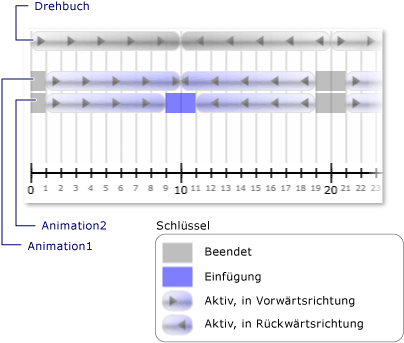

# Vorgehensweise: Benachrichtigung bei einer Uhr &#39; s Statusänderungen
Einer Uhr <xref:System.Windows.Media.Animation.Clock.CurrentStateInvalidated> Ereignis tritt auf, wenn seine <xref:System.Windows.Media.Animation.Clock.CurrentState%2A> ungültig, z. B. wenn die Uhr startet oder beendet wird. Registrieren Sie sich, für dieses Ereignis mit der Verwendung von direkt eine <xref:System.Windows.Media.Animation.Clock>, oder registrieren Sie mithilfe einer <xref:System.Windows.Media.Animation.Timeline>.  
  
 Im folgenden Beispiel ein <xref:System.Windows.Media.Animation.Storyboard> und zwei <xref:System.Windows.Media.Animation.DoubleAnimation> Objekte werden verwendet, um die Breite von zwei Rechtecken zu animieren. Die <xref:System.Windows.Media.Animation.Timeline.CurrentStateInvalidated> Ereignis wird verwendet, um die Uhr Zustandsänderungen abhören.  
  
## Beispiel  
 [!code-xaml[timingbehaviors_snip#_graphicsmm_StateExampleMarkupWholePage](../../../../samples/snippets/csharp/VS_Snippets_Wpf/timingbehaviors_snip/CSharp/StateExample.xaml#_graphicsmm_stateexamplemarkupwholepage)]  
  
 [!code-csharp[timingbehaviors_snip#_graphicsmm_StateEventHandlers](../../../../samples/snippets/csharp/VS_Snippets_Wpf/timingbehaviors_snip/CSharp/StateExample.xaml.cs#_graphicsmm_stateeventhandlers)]
 [!code-vb[timingbehaviors_snip#_graphicsmm_StateEventHandlers](../../../../samples/snippets/visualbasic/VS_Snippets_Wpf/timingbehaviors_snip/visualbasic/stateexample.xaml.vb#_graphicsmm_stateeventhandlers)]  
  
 Die folgende Abbildung zeigt die verschiedenen Zustände-Animationen geben Sie als die übergeordnete Zeitachse (*Storyboard*) im Verlauf.  
  
   
  
 Die folgende Tabelle zeigt die Zeiten, zu dem *Animation1*des <xref:System.Windows.Media.Animation.Timeline.CurrentStateInvalidated> -Ereignis ausgelöst:  
  
||||||||  
|-|-|-|-|-|-|-|  
|Zeit (in Sekunden)|1|10|19|21|30|39|  
|Zustand|Aktiv|Aktiv|Beendet|Aktiv|Aktiv|Beendet|  
  
 Die folgende Tabelle zeigt die Zeiten, zu dem *Animation2*des <xref:System.Windows.Media.Animation.Timeline.CurrentStateInvalidated> -Ereignis ausgelöst:  
  
||||||||||  
|-|-|-|-|-|-|-|-|-|  
|Zeit (in Sekunden)|1|9|11|19|21|29|31|39|  
|Zustand|Aktiv|Ausfüllen|Aktiv|Beendet|Aktiv|Ausfüllen|Aktiv|Beendet|  
  
 Beachten Sie, dass *Animation1*des <xref:System.Windows.Media.Animation.Timeline.CurrentStateInvalidated> Ereignis bei 10 Sekunden ausgelöst wird, obwohl Datenbankzustands bleibt <xref:System.Windows.Media.Animation.ClockState.Active>. Liegt darin, dass seinen Status geändert 10 Sekunden, aber es von <xref:System.Windows.Media.Animation.ClockState.Active> auf <xref:System.Windows.Media.Animation.ClockState.Filling> und dann zurück in <xref:System.Windows.Media.Animation.ClockState.Active> am selben Teilstrich.
