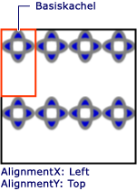
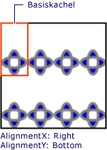

# Gewusst wie: Festlegen von horizontaler und vertikaler Ausrichtung bei einem TileBrushHow to: Set the Horizontal and Vertical Alignment of a TileBrush
In diesem Beispiel wird gezeigt, wie die horizontale und die vertikale Ausrichtung des Inhalts in einer Fläche gesteuert werden.This example shows how to control the horizontal and vertical alignment of content in a tile. Steuern Sie die horizontale und vertikale Ausrichtung des eine <xref:System.Windows.Media.TileBrush>, verwenden Sie die <xref:System.Windows.Media.TileBrush.AlignmentX%2A> und <xref:System.Windows.Media.TileBrush.AlignmentY%2A> Eigenschaften.To control the horizontal and vertical alignment of a <xref:System.Windows.Media.TileBrush>, use its <xref:System.Windows.Media.TileBrush.AlignmentX%2A> and <xref:System.Windows.Media.TileBrush.AlignmentY%2A> properties.  
  
 Die <xref:System.Windows.Media.TileBrush.AlignmentX%2A> und <xref:System.Windows.Media.TileBrush.AlignmentY%2A> Eigenschaften einer <xref:System.Windows.Media.TileBrush> werden verwendet, wenn eine der folgenden Bedingungen zutrifft:The <xref:System.Windows.Media.TileBrush.AlignmentX%2A> and <xref:System.Windows.Media.TileBrush.AlignmentY%2A> properties of a <xref:System.Windows.Media.TileBrush> are used when either of the following conditions is true:  
  
-   Die <xref:System.Windows.Media.TileBrush.Stretch%2A> Eigenschaft <xref:System.Windows.Media.Stretch.Uniform> oder <xref:System.Windows.Media.Stretch.UniformToFill> und <xref:System.Windows.Media.TileBrush.Viewbox%2A> und <xref:System.Windows.Media.TileBrush.Viewport%2A> haben unterschiedliche Seitenverhältnissen.The <xref:System.Windows.Media.TileBrush.Stretch%2A> property is <xref:System.Windows.Media.Stretch.Uniform> or <xref:System.Windows.Media.Stretch.UniformToFill> and the <xref:System.Windows.Media.TileBrush.Viewbox%2A> and <xref:System.Windows.Media.TileBrush.Viewport%2A> have different aspect ratios.  
  
-   Die <xref:System.Windows.Media.TileBrush.Stretch%2A> Eigenschaft <xref:System.Windows.Media.Stretch.None> und <xref:System.Windows.Media.TileBrush.Viewbox%2A> und <xref:System.Windows.Media.TileBrush.Viewport%2A> unterschiedlich lang sind.The <xref:System.Windows.Media.TileBrush.Stretch%2A> property is <xref:System.Windows.Media.Stretch.None> and the <xref:System.Windows.Media.TileBrush.Viewbox%2A> and <xref:System.Windows.Media.TileBrush.Viewport%2A> are different sizes.  
  
## BeispielExample  
 Das folgende Beispiel richtet den Inhalt einer <xref:System.Windows.Media.DrawingBrush>, d. h. einen Typ von <xref:System.Windows.Media.TileBrush>, auf der linken oberen Ecke der Kachel.The following example aligns the content of a <xref:System.Windows.Media.DrawingBrush>, which is a type of <xref:System.Windows.Media.TileBrush>, to the upper-left corner of its tile. Zum Ausrichten von Inhalt, der im Beispiel wird die <xref:System.Windows.Media.TileBrush.AlignmentX%2A> Eigenschaft der <xref:System.Windows.Media.DrawingBrush> auf <xref:System.Windows.Media.AlignmentX.Left> und die <xref:System.Windows.Media.TileBrush.AlignmentY%2A> Eigenschaft <xref:System.Windows.Media.AlignmentY.Top>.To align the content, the example sets the <xref:System.Windows.Media.TileBrush.AlignmentX%2A> property of the <xref:System.Windows.Media.DrawingBrush> to <xref:System.Windows.Media.AlignmentX.Left> and the <xref:System.Windows.Media.TileBrush.AlignmentY%2A> property to <xref:System.Windows.Media.AlignmentY.Top>. Folgende Ergebnisse werden zurückgegeben:This example produces the following output.  
  
   
TileBrush mit an der linken oberen Ecke ausgerichtetem InhaltTileBrush with content aligned to the upper-left corner  
  
 [!code-csharp[brushoverviewexamples_snip#TileBrushTopLeftAlignmentInline](../../../../samples/snippets/csharp/VS_Snippets_Wpf/BrushOverviewExamples_snip/CSharp/TileBrushAlignmentExample.cs#tilebrushtopleftalignmentinline)]
 [!code-vb[brushoverviewexamples_snip#TileBrushTopLeftAlignmentInline](../../../../samples/snippets/visualbasic/VS_Snippets_Wpf/BrushOverviewExamples_snip/visualbasic/tilebrushalignmentexample.vb#tilebrushtopleftalignmentinline)]
 [!code-xaml[brushoverviewexamples_snip#TileBrushTopLeftAlignmentInline](../../../../samples/snippets/xaml/VS_Snippets_Wpf/BrushOverviewExamples_snip/XAML/TileBrushAlignmentExample.xaml#tilebrushtopleftalignmentinline)]  
  
## BeispielExample  
 Im nächste Beispiel richtet den Inhalt des eine <xref:System.Windows.Media.DrawingBrush> zu unten rechts die Kachel durch Festlegen der <xref:System.Windows.Media.TileBrush.AlignmentX%2A> Eigenschaft, um <xref:System.Windows.Media.AlignmentX.Right> und die <xref:System.Windows.Media.TileBrush.AlignmentY%2A> Eigenschaft <xref:System.Windows.Media.AlignmentY.Bottom>.The next example aligns the content of a <xref:System.Windows.Media.DrawingBrush> to the lower-right corner of its tile by setting the <xref:System.Windows.Media.TileBrush.AlignmentX%2A> property to <xref:System.Windows.Media.AlignmentX.Right> and the <xref:System.Windows.Media.TileBrush.AlignmentY%2A> property to <xref:System.Windows.Media.AlignmentY.Bottom>. Das Beispiel erzeugt folgende Ausgabe.The example produces the following output.  
  
   
TileBrush mit an der rechten unteren Ecke ausgerichtetem InhaltTileBrush with content aligned to the lower-right corner  
  
 [!code-csharp[brushoverviewexamples_snip#TileBrushBottomRightAlignmentInline](../../../../samples/snippets/csharp/VS_Snippets_Wpf/BrushOverviewExamples_snip/CSharp/TileBrushAlignmentExample.cs#tilebrushbottomrightalignmentinline)]
 [!code-vb[brushoverviewexamples_snip#TileBrushBottomRightAlignmentInline](../../../../samples/snippets/visualbasic/VS_Snippets_Wpf/BrushOverviewExamples_snip/visualbasic/tilebrushalignmentexample.vb#tilebrushbottomrightalignmentinline)]
 [!code-xaml[brushoverviewexamples_snip#TileBrushBottomRightAlignmentInline](../../../../samples/snippets/xaml/VS_Snippets_Wpf/BrushOverviewExamples_snip/XAML/TileBrushAlignmentExample.xaml#tilebrushbottomrightalignmentinline)]  
  
## BeispielExample  
 Im nächste Beispiel richtet den Inhalt einer <xref:System.Windows.Media.DrawingBrush> auf der linken oberen Ecke der Kachel durch Festlegen der <xref:System.Windows.Media.TileBrush.AlignmentX%2A> Eigenschaft, um <xref:System.Windows.Media.AlignmentX.Left> und die <xref:System.Windows.Media.TileBrush.AlignmentY%2A> Eigenschaft, um <xref:System.Windows.Media.AlignmentY.Top>.The next example aligns the content of a <xref:System.Windows.Media.DrawingBrush> to the upper-left corner of its tile by setting the <xref:System.Windows.Media.TileBrush.AlignmentX%2A> property to <xref:System.Windows.Media.AlignmentX.Left> and the <xref:System.Windows.Media.TileBrush.AlignmentY%2A> property to <xref:System.Windows.Media.AlignmentY.Top>. Außerdem wird die <xref:System.Windows.Media.TileBrush.Viewport%2A> und <xref:System.Windows.Media.TileBrush.TileMode%2A> von der <xref:System.Windows.Media.DrawingBrush> um ein Kachelmuster zu erzeugen.It also sets the <xref:System.Windows.Media.TileBrush.Viewport%2A> and <xref:System.Windows.Media.TileBrush.TileMode%2A> of the <xref:System.Windows.Media.DrawingBrush> to produce a tile pattern. Das Beispiel erzeugt folgende Ausgabe.The example produces the following output.  
  
   
Flächenmuster mit in der Basisfläche oben links ausgerichtetem InhaltTile pattern with content aligned to upper-left in base tile  
  
 In der Abbildung ist eine Basisfläche hervorgehoben, damit Sie sehen können, wie der Inhalt ausgerichtet ist.The illustration highlights abase tile so that you can see how its content is aligned. Beachten Sie, dass die <xref:System.Windows.Media.TileBrush.AlignmentX%2A> Einstellung hat keine Wirkung, da der Inhalt der <xref:System.Windows.Media.DrawingBrush> vollständig horizontal füllt die Basiskachel.Notice that the <xref:System.Windows.Media.TileBrush.AlignmentX%2A> setting has no effect because the content of the <xref:System.Windows.Media.DrawingBrush> completely fills the base tile horizontally.  
  
 [!code-csharp[brushoverviewexamples_snip#TileBrushTopLeftAlignmentTiledInline](../../../../samples/snippets/csharp/VS_Snippets_Wpf/BrushOverviewExamples_snip/CSharp/TileBrushAlignmentExample.cs#tilebrushtopleftalignmenttiledinline)]
 [!code-vb[brushoverviewexamples_snip#TileBrushTopLeftAlignmentTiledInline](../../../../samples/snippets/visualbasic/VS_Snippets_Wpf/BrushOverviewExamples_snip/visualbasic/tilebrushalignmentexample.vb#tilebrushtopleftalignmenttiledinline)]
 [!code-xaml[brushoverviewexamples_snip#TileBrushTopLeftAlignmentTiledInline](../../../../samples/snippets/xaml/VS_Snippets_Wpf/BrushOverviewExamples_snip/XAML/TileBrushAlignmentExample.xaml#tilebrushtopleftalignmenttiledinline)]  
  
## BeispielExample  
 Im letzten Beispiel wird der Inhalt von einem unterteilten ausgerichtet <xref:System.Windows.Media.DrawingBrush> nach rechts unten auf seine Basiskachel durch Festlegen der <xref:System.Windows.Media.TileBrush.AlignmentX%2A> Eigenschaft <xref:System.Windows.Media.AlignmentX.Right> und die <xref:System.Windows.Media.TileBrush.AlignmentY%2A> Eigenschaft <xref:System.Windows.Media.AlignmentY.Bottom>.The final example aligns the content of a tiled <xref:System.Windows.Media.DrawingBrush> to the lower-right of its base tile by setting the <xref:System.Windows.Media.TileBrush.AlignmentX%2A> property to <xref:System.Windows.Media.AlignmentX.Right> and the <xref:System.Windows.Media.TileBrush.AlignmentY%2A> property to <xref:System.Windows.Media.AlignmentY.Bottom>. Das Beispiel erzeugt folgende Ausgabe.The example produces the following output.  
  
   
Flächenmuster mit in der Basisfläche oben rechts ausgerichtetem InhaltTile pattern with content aligned to lower-right in base tile  
  
 Erneut, die <xref:System.Windows.Media.TileBrush.AlignmentX%2A> Einstellung hat keine Wirkung, da der Inhalt der <xref:System.Windows.Media.DrawingBrush> vollständig horizontal füllt die Basiskachel.Again, the <xref:System.Windows.Media.TileBrush.AlignmentX%2A> setting has no effect because the content of the <xref:System.Windows.Media.DrawingBrush> completely fills the base tile horizontally.  
  
 [!code-csharp[brushoverviewexamples_snip#TileBrushBottomRightAlignmentInline](../../../../samples/snippets/csharp/VS_Snippets_Wpf/BrushOverviewExamples_snip/CSharp/TileBrushAlignmentExample.cs#tilebrushbottomrightalignmentinline)]
 [!code-vb[brushoverviewexamples_snip#TileBrushBottomRightAlignmentInline](../../../../samples/snippets/visualbasic/VS_Snippets_Wpf/BrushOverviewExamples_snip/visualbasic/tilebrushalignmentexample.vb#tilebrushbottomrightalignmentinline)]
 [!code-xaml[brushoverviewexamples_snip#TileBrushBottomRightAlignmentInline](../../../../samples/snippets/xaml/VS_Snippets_Wpf/BrushOverviewExamples_snip/XAML/TileBrushAlignmentExample.xaml#tilebrushbottomrightalignmentinline)]  
  
 In den Beispielen <xref:System.Windows.Media.DrawingBrush> -Objekten, die veranschaulichen, wie die <xref:System.Windows.Media.TileBrush.AlignmentX%2A> und <xref:System.Windows.Media.TileBrush.AlignmentY%2A> Eigenschaften verwendet werden.The examples use <xref:System.Windows.Media.DrawingBrush> objects to demonstrate how the <xref:System.Windows.Media.TileBrush.AlignmentX%2A> and <xref:System.Windows.Media.TileBrush.AlignmentY%2A> properties are used. Diese Eigenschaften verhalten sich identisch, für alle TileBrush-Objekte: <xref:System.Windows.Media.DrawingBrush>, <xref:System.Windows.Media.ImageBrush>, und <xref:System.Windows.Media.VisualBrush>.These properties behave identically for all the tile brushes: <xref:System.Windows.Media.DrawingBrush>, <xref:System.Windows.Media.ImageBrush>, and <xref:System.Windows.Media.VisualBrush>. Weitere Informationen zu TileBrush-Objekten finden Sie unter [Zeichnen mit Bildern, Zeichnungen und visuellen Elementen.](../../../../docs/framework/wpf/graphics-multimedia/painting-with-images-drawings-and-visuals.md).For more information about tile brushes, see [Painting with Images, Drawings, and Visuals](../../../../docs/framework/wpf/graphics-multimedia/painting-with-images-drawings-and-visuals.md).  
  
## Siehe auchSee Also  
 <xref:System.Windows.Media.DrawingBrush>  
 <xref:System.Windows.Media.ImageBrush>  
 <xref:System.Windows.Media.VisualBrush>  
 [Zeichnen mit Bildern, Zeichnungen und visuellen ElementenPainting with Images, Drawings, and Visuals](../../../../docs/framework/wpf/graphics-multimedia/painting-with-images-drawings-and-visuals.md)
