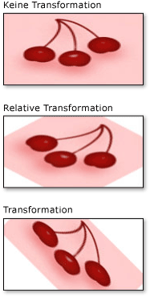

# Gewusst wie: Transformieren eines PinselsHow to: Transform a Brush
In diesem Beispiel <xref:System.Windows.Media.Brush> wird gezeigt, wie Objekte <xref:System.Windows.Media.Brush.RelativeTransform%2A> <xref:System.Windows.Media.Brush.Transform%2A>mithilfe ihrer beiden Transformationseigenschaften transformiert werden: und .This example shows how to transform <xref:System.Windows.Media.Brush> objects by using their two transformation properties: <xref:System.Windows.Media.Brush.RelativeTransform%2A> and <xref:System.Windows.Media.Brush.Transform%2A>.  
  
 In den folgenden <xref:System.Windows.Media.RotateTransform> Beispielen wird <xref:System.Windows.Media.ImageBrush> ein verwendet, um den Inhalt eines um 45 Grad zu drehen.The following examples use a <xref:System.Windows.Media.RotateTransform> to rotate the content of an <xref:System.Windows.Media.ImageBrush> by 45 degrees.  
  
 Die folgende Abbildung <xref:System.Windows.Media.ImageBrush> zeigt <xref:System.Windows.Media.RotateTransform>die <xref:System.Windows.Media.RotateTransform> ohne a, wobei die auf die <xref:System.Windows.Media.Brush.RelativeTransform%2A> Eigenschaft angewendet und die <xref:System.Windows.Media.RotateTransform> auf die <xref:System.Windows.Media.Brush.Transform%2A> Eigenschaft angewendet wird.The following illustration shows the <xref:System.Windows.Media.ImageBrush> without a <xref:System.Windows.Media.RotateTransform>, with the <xref:System.Windows.Media.RotateTransform> applied to the <xref:System.Windows.Media.Brush.RelativeTransform%2A> property, and with the <xref:System.Windows.Media.RotateTransform> applied to the <xref:System.Windows.Media.Brush.Transform%2A> property.  
  
   
  
## BeispielExample  
 Das erste Beispiel <xref:System.Windows.Media.RotateTransform> wendet <xref:System.Windows.Media.Brush.RelativeTransform%2A> eine <xref:System.Windows.Media.ImageBrush>auf die Eigenschaft einer an.The first example applies a <xref:System.Windows.Media.RotateTransform> to the <xref:System.Windows.Media.Brush.RelativeTransform%2A> property of an <xref:System.Windows.Media.ImageBrush>. Die <xref:System.Windows.Media.RotateTransform.CenterX%2A> <xref:System.Windows.Media.RotateTransform.CenterY%2A> und Eigenschaften <xref:System.Windows.Media.RotateTransform> eines Objekts sind beide auf 0,5 festgelegt, was die relative Koordinate des Mittelpunkts dieses Inhalts ist.The <xref:System.Windows.Media.RotateTransform.CenterX%2A> and <xref:System.Windows.Media.RotateTransform.CenterY%2A> properties of a <xref:System.Windows.Media.RotateTransform> object are both set to 0.5, which is the relative coordinate of the center point of this content. Dadurch dreht sich <xref:System.Windows.Media.ImageBrush> der Inhalt um seine Mitte.As a result, the <xref:System.Windows.Media.ImageBrush> content rotates about its center.  
  
 [!code-csharp[BrushesIntroduction_snip#ImageBrushRelativeTransformExample](~/samples/snippets/csharp/VS_Snippets_Wpf/BrushesIntroduction_snip/CSharp/BrushTransformExample.cs#imagebrushrelativetransformexample)]
 [!code-vb[BrushesIntroduction_snip#ImageBrushRelativeTransformExample](~/samples/snippets/visualbasic/VS_Snippets_Wpf/BrushesIntroduction_snip/visualbasic/brushtransformexample.vb#imagebrushrelativetransformexample)]
 [!code-xaml[BrushesIntroduction_snip#ImageBrushRelativeTransformExample](~/samples/snippets/xaml/VS_Snippets_Wpf/BrushesIntroduction_snip/XAML/BrushTransformExample.xaml#imagebrushrelativetransformexample)]  
  
 Das zweite Beispiel <xref:System.Windows.Media.RotateTransform> gilt <xref:System.Windows.Media.ImageBrush>auch für eine ; In diesem Beispiel <xref:System.Windows.Media.Brush.Transform%2A> wird jedoch <xref:System.Windows.Media.Brush.RelativeTransform%2A> die Eigenschaft anstelle der Eigenschaft verwendet.The second example also applies a <xref:System.Windows.Media.RotateTransform> to an <xref:System.Windows.Media.ImageBrush>; however, this example uses the <xref:System.Windows.Media.Brush.Transform%2A> property instead of the <xref:System.Windows.Media.Brush.RelativeTransform%2A> property.  
  
 Um den Pinsel um seine Mitte <xref:System.Windows.Media.RotateTransform.CenterX%2A> zu <xref:System.Windows.Media.RotateTransform.CenterY%2A> drehen, <xref:System.Windows.Media.RotateTransform> legt das Beispiel die und die Eigenschaften des Objekts auf absolute Koordinaten fest.To rotate the brush about its center, the example sets the <xref:System.Windows.Media.RotateTransform.CenterX%2A> and <xref:System.Windows.Media.RotateTransform.CenterY%2A> properties of the <xref:System.Windows.Media.RotateTransform> object to absolute coordinates. Da der Pinsel ein Rechteck mit der Größe 175 mal 90 Pixel zeichnet, liegt der Mittelpunkt des Rechtecks bei (87,5/45).Because the brush paints a rectangle that is 175 by 90 pixels, the center point of the rectangle is (87.5, 45).  
  
 [!code-csharp[BrushesIntroduction_snip#ImageBrushTransformExample](~/samples/snippets/csharp/VS_Snippets_Wpf/BrushesIntroduction_snip/CSharp/BrushTransformExample.cs#imagebrushtransformexample)]
 [!code-vb[BrushesIntroduction_snip#ImageBrushTransformExample](~/samples/snippets/visualbasic/VS_Snippets_Wpf/BrushesIntroduction_snip/visualbasic/brushtransformexample.vb#imagebrushtransformexample)]
 [!code-xaml[BrushesIntroduction_snip#ImageBrushTransformExample](~/samples/snippets/xaml/VS_Snippets_Wpf/BrushesIntroduction_snip/XAML/BrushTransformExample.xaml#imagebrushtransformexample)]  
  
 Eine Beschreibung der <xref:System.Windows.Media.Brush.RelativeTransform%2A> Funktionsweise <xref:System.Windows.Media.Brush.Transform%2A> und der Eigenschaften finden Sie in der [Pinseltransformationsübersicht](brush-transformation-overview.md).For a description of how the <xref:System.Windows.Media.Brush.RelativeTransform%2A> and <xref:System.Windows.Media.Brush.Transform%2A> properties work, see the [Brush Transformation Overview](brush-transformation-overview.md).  
  
 Das vollständige Beispiel finden Sie unter [Beispiel für Pinsel](https://github.com/Microsoft/WPF-Samples/tree/master/Graphics/Brushes).For the complete sample, see [Brushes Sample](https://github.com/Microsoft/WPF-Samples/tree/master/Graphics/Brushes). Weitere Informationen über Pinsel finden Sie unter [Übersicht über das Zeichnen mit Volltonfarben und Farbverläufen](painting-with-solid-colors-and-gradients-overview.md).For more information about brushes, see [Painting with Solid Colors and Gradients Overview](painting-with-solid-colors-and-gradients-overview.md).  
  
## Weitere InformationenSee also

- [Übersicht über PinseltransformationenBrush Transformation Overview](brush-transformation-overview.md)
- [Übersicht über das Zeichnen mit Volltonfarben und FarbverläufenPainting with Solid Colors and Gradients Overview](painting-with-solid-colors-and-gradients-overview.md)
- [Übersicht über TransformationenTransforms Overview](transforms-overview.md)
