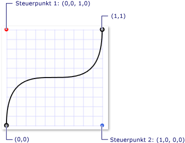
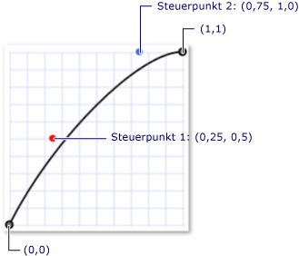

# Übersicht über Keyframe-Animationen
Dieses Thema bietet eine Einführung in Keyframe-Animationen. Mit Keyframe-Animationen können Sie bei Animationen mehr als zwei Zielwerte animieren und die Interpolationsmethode einer Animation steuern.  
  

## Voraussetzungen  
 Für diese Übersicht sollten Sie mit Animationen und Zeitachsen in [!INCLUDE[TLA#tla_winclient](../../../../includes/tlasharptla-winclient-md.md)] vertraut sein. Eine Einführung zu Animationen finden Sie unter [Übersicht über Animationen](animation-overview.md). Kenntnisse in From/To/By-Animationen sind ebenfalls hilfreich. Weitere Informationen finden Sie unter „Übersicht über From/To/by-Animationen“.  
  

## Was ist eine Keyframe-Animation?  
 Wie eine From/To/By-Animation animiert eine Keyframe-Animation den Wert einer Zieleigenschaft. Es erstellt einen Übergang zwischen <xref:System.Windows.Media.Animation.Timeline.Duration%2A>seinen Zielwerten über seine . Während eine From/To/By-Animation einen Übergang zwischen zwei Werten erstellt, kann eine einzelne Keyframe-Animation jedoch Übergänge zwischen einer beliebigen Anzahl von Zielwerten erstellen. Im Gegensatz zu einer From/To/By-Animation besitzt eine Keyframe-Animation keine From/To/by-Eigenschaften, mit denen die Zielwerte festgelegt werden könnten. Die Zielwerte einer Keyframe-Animation werden mithilfe von Keyframe-Objekten beschrieben (daher der Begriff „Keyframe-Animation“). Um die Zielwerte der Animation anzugeben, erstellen Sie Schlüsselrahmenobjekte <xref:System.Windows.Media.Animation.DoubleAnimationUsingKeyFrames.KeyFrames%2A> und fügen sie der Sammlung der Animation hinzu. Wenn die Animation ausgeführt wird, erstellt sie Übergänge zwischen den Frames, die Sie angegeben haben.  
  
 Einige Keyframe-Methoden unterstützen nicht nur mehrere Zielwerte, sondern sogar mehrere Interpolationsmethoden. Die Interpolationsmethode einer Animation definiert, wie sie einen Übergang von einem Wert zum nächsten erstellt. Es gibt drei Arten von Interpolationen: diskret, linear und Spline.  
  
 Um Animationen mit einer Keyframe-Animation auszuführen, gehen Sie folgendermaßen vor.  
  
- Deklarieren Sie <xref:System.Windows.Media.Animation.Timeline.Duration%2A>die Animation und geben Sie sie wie für eine Von/To/by-Animation an.  
  
- Erstellen Sie für jeden Zielwert einen Schlüsselrahmen des <xref:System.Windows.Media.Animation.KeyTime>entsprechenden Typs, <xref:System.Windows.Media.Animation.DoubleAnimationUsingKeyFrames.KeyFrames%2A> legen Sie dessen Wert und fest, und fügen Sie ihn der Sammlung der Animation hinzu.  
  
- Ordnen Sie der Animation eine Eigenschaft zu, genau so wie bei einer From/To/By-Animation. Weitere Informationen zum Anwenden einer Animation auf eine Eigenschaft mit einem Storyboard finden Sie unter [Übersicht über Storyboards](storyboards-overview.md).  
  
 Im folgenden Beispiel <xref:System.Windows.Media.Animation.DoubleAnimationUsingKeyFrames> wird <xref:System.Windows.Shapes.Rectangle> ein verwendet, um ein Element an vier verschiedenen Speicherorten zu animieren.  
  
 [!code-xaml[keyframes_ovw_snippet#BasicKeyFrameExampleWholePage](~/samples/snippets/csharp/VS_Snippets_Wpf/keyframes_ovw_snippet/CS/KeyFramesIntroduction.xaml#basickeyframeexamplewholepage)]  
  
 Wie eine Von/To/By-Animation kann eine Keyframe-Animation mithilfe <xref:System.Windows.Media.Animation.Storyboard> eines In-Markups und <xref:System.Windows.Media.Animation.Animatable.BeginAnimation%2A> Codes oder mithilfe der Methode im Code auf eine Eigenschaft angewendet werden. Sie können auch eine Keyframe-Animation <xref:System.Windows.Media.Animation.AnimationClock> verwenden, um eine zu erstellen und auf eine oder mehrere Eigenschaften anzuwenden. Weitere Informationen zu den verschiedenen Methoden zum Anwenden von Animationen finden Sie in der [Übersicht über Eigenschaftenanimationstechniken](property-animation-techniques-overview.md).  
  

## Keyframe-Animationstypen  
 Da Animationen Eigenschaftswerte generieren, gibt es für die einzelnen Eigenschaftentypen unterschiedliche Animationstypen. Um eine Eigenschaft zu <xref:System.Double> animieren, die <xref:System.Windows.FrameworkElement.Width%2A> eine (z. B. die Eigenschaft eines Elements) verwendet, verwenden Sie eine Animation, die Werte erzeugt. <xref:System.Double> Um eine Eigenschaft zu <xref:System.Windows.Point>animieren, die <xref:System.Windows.Point> eine verwendet, verwenden Sie eine Animation, die Werte erzeugt usw.  
  
 Die Keyframe-Animationsklassen gehören <xref:System.Windows.Media.Animation> zum Namespace und halten sich an die folgende Namenskonvention:  
  
 * \<Typ>*`AnimationUsingKeyFrames`  
  
 Wobei * \<Typ>* ist der Werttyp, den die Klasse animiert.  
  
 [!INCLUDE[TLA2#tla_winclient](../../../../includes/tla2sharptla-winclient-md.md)] bietet folgende Keyframe-Animationsklassen.  
  
|Eigenschaftstyp|Entsprechende From/To/By-Animationsklassen|Unterstützte Interpolationsmethoden|  
|-------------------|------------------------------------------------|-------------------------------------|  
|<xref:System.Boolean>|<xref:System.Windows.Media.Animation.BooleanAnimationUsingKeyFrames>|Discrete|  
|<xref:System.Byte>|<xref:System.Windows.Media.Animation.ByteAnimationUsingKeyFrames>|Diskret, linear, Spline|  
|<xref:System.Windows.Media.Color>|<xref:System.Windows.Media.Animation.ColorAnimationUsingKeyFrames>|Diskret, linear, Spline|  
|<xref:System.Decimal>|<xref:System.Windows.Media.Animation.DecimalAnimationUsingKeyFrames>|Diskret, linear, Spline|  
|<xref:System.Double>|<xref:System.Windows.Media.Animation.DoubleAnimationUsingKeyFrames>|Diskret, linear, Spline|  
|<xref:System.Int16>|<xref:System.Windows.Media.Animation.Int16AnimationUsingKeyFrames>|Diskret, linear, Spline|  
|<xref:System.Int32>|<xref:System.Windows.Media.Animation.Int32AnimationUsingKeyFrames>|Diskret, linear, Spline|  
|<xref:System.Int64>|<xref:System.Windows.Media.Animation.Int64AnimationUsingKeyFrames>|Diskret, linear, Spline|  
|<xref:System.Windows.Media.Matrix>|<xref:System.Windows.Media.Animation.MatrixAnimationUsingKeyFrames>|Discrete|  
|<xref:System.Object>|<xref:System.Windows.Media.Animation.ObjectAnimationUsingKeyFrames>|Discrete|  
|<xref:System.Windows.Point>|<xref:System.Windows.Media.Animation.PointAnimationUsingKeyFrames>|Diskret, linear, Spline|  
|<xref:System.Windows.Media.Media3D.Quaternion>|<xref:System.Windows.Media.Animation.QuaternionAnimationUsingKeyFrames>|Diskret, linear, Spline|  
|<xref:System.Windows.Rect>|<xref:System.Windows.Media.Animation.RectAnimationUsingKeyFrames>|Diskret, linear, Spline|  
|<xref:System.Windows.Media.Media3D.Rotation3D>|<xref:System.Windows.Media.Animation.Rotation3DAnimationUsingKeyFrames>|Diskret, linear, Spline|  
|<xref:System.Single>|<xref:System.Windows.Media.Animation.SingleAnimationUsingKeyFrames>|Diskret, linear, Spline|  
|<xref:System.String>|<xref:System.Windows.Media.Animation.StringAnimationUsingKeyFrames>|Discrete|  
|<xref:System.Windows.Size>|<xref:System.Windows.Media.Animation.SizeAnimationUsingKeyFrames>|Diskret, linear, Spline|  
|<xref:System.Windows.Thickness>|<xref:System.Windows.Media.Animation.ThicknessAnimationUsingKeyFrames>|Diskret, linear, Spline|  
|<xref:System.Windows.Media.Media3D.Vector3D>|<xref:System.Windows.Media.Animation.Vector3DAnimationUsingKeyFrames>|Diskret, linear, Spline|  
|<xref:System.Windows.Vector>|<xref:System.Windows.Media.Animation.VectorAnimationUsingKeyFrames>|Diskret, linear, Spline|  
  

## Zielwerte (Keyframes) und Schlüsselzeiten  
 Ebenso wie es verschiedene Typen von Keyframe-Animationen zum Animieren verschiedener Eigenschaftentypen gibt, gibt es auch verschiedene Typen von Keyframe-Objekten: einen für jeden animierten Werttyp und jede unterstützte Interpolationsmethode. Keyframe-Typen entsprechen der folgenden Benennungskonvention:  
  
 *InterpolationMethode \<>Typ>\<*`KeyFrame`  
  
 Wobei * \<InterpolationMethod>* die Interpolationsmethode ist, die der Schlüsselrahmen verwendet, und * \<Typ>* ist der Werttyp, den die Klasse animiert. Eine Keyframe-Animation, die alle drei Interpolationsmethoden unterstützt, besitzt drei Keyframe-Typen, die Sie verwenden können. Sie können z. B. drei <xref:System.Windows.Media.Animation.DoubleAnimationUsingKeyFrames>Schlüsselrahmentypen mit : <xref:System.Windows.Media.Animation.DiscreteDoubleKeyFrame>, <xref:System.Windows.Media.Animation.LinearDoubleKeyFrame>, und <xref:System.Windows.Media.Animation.SplineDoubleKeyFrame>verwenden. (Interpolationsmethoden werden in einem späteren Abschnitt ausführlich beschrieben.)  
  
 Der primäre Zweck eines Schlüsselrahmens <xref:System.Windows.Media.Animation.IKeyFrame.KeyTime%2A> besteht <xref:System.Windows.Media.Animation.IKeyFrame.Value%2A>darin, eine und eine anzugeben. Jeder Keyframe-Typ stellt diese zwei Eigenschaften bereit.  
  
- Die <xref:System.Windows.Media.Animation.IKeyFrame.Value%2A> Eigenschaft gibt den Zielwert für diesen Schlüsselrahmen an.  
  
- Die <xref:System.Windows.Media.Animation.IKeyFrame.KeyTime%2A> Eigenschaft gibt an, wann <xref:System.Windows.Media.Animation.Timeline.Duration%2A>(innerhalb der Animation) ein Schlüsselrahmen erreicht <xref:System.Windows.Media.Animation.IKeyFrame.Value%2A> wird.  
  
 Wenn eine Keyframe-Animation beginnt, durchforst sie ihre <xref:System.Windows.Media.Animation.IKeyFrame.KeyTime%2A> Schlüsselrahmen in der Reihenfolge, die durch ihre Eigenschaften definiert ist.  
  
- Wenn zum Zeitpunkt 0 kein Schlüsselrahmen vorhanden ist, erstellt die Animation einen <xref:System.Windows.Media.Animation.IKeyFrame.Value%2A> Übergang zwischen dem aktuellen Wert der Zieleigenschaft und dem des ersten Schlüsselrahmens. Andernfalls wird der Ausgabewert der Animation zum Wert des ersten Schlüsselrahmens.  
  
- Die Animation erstellt einen <xref:System.Windows.Media.Animation.IKeyFrame.Value%2A> Übergang zwischen dem ersten und zweiten Schlüsselrahmen mithilfe der Interpolationsmethode, die vom zweiten Schlüsselrahmen angegeben wird. Der Übergang beginnt am ersten <xref:System.Windows.Media.Animation.IKeyFrame.KeyTime%2A> Schlüsselrahmen und endet, wenn <xref:System.Windows.Media.Animation.IKeyFrame.KeyTime%2A> der zweite Schlüsselrahmen erreicht ist.  
  
- Die Animation wird fortgesetzt und erstellt Übergänge zwischen jedem nachfolgenden Keyframe und dem vorangehenden Keyframe.  
  
- Schließlich übergeht die Animation den Wert des Schlüsselrahmens <xref:System.Windows.Media.Animation.Timeline.Duration%2A>mit der größten Schlüsselzeit, die gleich oder kleiner als die der Animation ist.  
  
 Wenn die Animation <xref:System.Windows.Media.Animation.Timeline.Duration%2A> <xref:System.Windows.Duration.Automatic%2A> gleich <xref:System.Windows.Media.Animation.Timeline.Duration%2A> der Zeit des letzten Schlüsselrahmens ist oder ist, wird die Animation beendet. Andernfalls, wenn die <xref:System.Windows.Duration> Animation größer als die Schlüsselzeit des letzten Schlüsselrahmens ist, hält die <xref:System.Windows.Duration>Animation den Schlüsselframewert, bis sie das Ende ihrer erreicht. Wie alle Animationen verwendet eine <xref:System.Windows.Media.Animation.Timeline.FillBehavior%2A> Keyframe-Animation ihre Eigenschaft, um zu bestimmen, ob sie den endgültigen Wert enthält, wenn sie das Ende ihrer aktiven Periode erreicht. Weitere Informationen finden Sie unter [Übersicht über Zeitsteuerungsverhalten](timing-behaviors-overview.md).  
  
 Im folgenden Beispiel <xref:System.Windows.Media.Animation.DoubleAnimationUsingKeyFrames> wird das im vorherigen Beispiel <xref:System.Windows.Media.Animation.IKeyFrame.Value%2A> <xref:System.Windows.Media.Animation.IKeyFrame.KeyTime%2A> definierte Objekt verwendet, um zu veranschaulichen, wie die und-Eigenschaften funktionieren.  
  
- Der erste Keyframe legt sofort den Ausgabewert der Animation auf 0 fest.  
  
- Der zweite Keyframe führt eine Animation von 0 bis 350 aus. Sie beginnt nach dem Ende des ersten Keyframes (zur Zeit = 0 Sekunden), wird 2 Sekunden lang abgespielt und endet zur Zeit = 0:0:2.  
  
- Der dritte Keyframe führt eine Animation von 350 bis 50 aus. Sie beginnt nach dem Ende des zweiten Keyframes (zur Zeit = 2 Sekunden), wird 5 Sekunden lang abgespielt und endet zur Zeit = 0:0:7.  
  
- Der vierte Keyframe führt eine Animation von 50 bis 200 aus. Sie beginnt nach dem Ende des dritten Keyframes (zur Zeit = 7 Sekunden), wird 1 Sekunde lang abgespielt und endet zur Zeit = 0:0:8.  
  
- Da <xref:System.Windows.Media.Animation.Timeline.Duration%2A> die Eigenschaft der Animation auf 10 Sekunden festgelegt wurde, behält die Animation ihren endgültigen Wert für zwei Sekunden, bevor sie zum Zeitpunkt = 0:0:10 endet.  
  
 [!code-xaml[keyframes_ovw_snippet#BasicKeyFrameExampleWholePage](~/samples/snippets/csharp/VS_Snippets_Wpf/keyframes_ovw_snippet/CS/KeyFramesIntroduction.xaml#basickeyframeexamplewholepage)]  
  

## Interpolationsmethoden  
 In den vorherigen Abschnitten wurde erwähnt, dass einige Keyframe-Animationen mehrere Interpolationsmethoden unterstützen. Die Interpolation einer Animation beschreibt, wie eine Animation während ihrer Dauer einen Übergang zwischen Werten erstellt. Durch die Auswahl, welcher Keyframe-Typ für die Animation verwendet wird, kann die Interpolationsmethode für dieses Keyframe-Segment definiert werden. Es gibt drei verschiedene Typen von Interpolationsmethoden: linear, diskret und Spline.  
  
### Lineare Interpolation  
 Bei der linearen Interpolation verläuft die Animation mit konstanter Geschwindigkeit der Segmentdauer. Wenn z.B. ein Keyframe-Segment während einer Dauer von 5 Sekunden von 0 auf 10 wechselt, gibt die Animation zu den angegebenen Zeiten die folgenden Werte aus:  
  
|Time|Ausgabewert|  
|----------|------------------|  
|0|0|  
|1|2|  
|2|4|  
|3|6|  
|4|8|  
|4.25|8.5|  
|4,5|9|  
|5|10|  
  
### Diskrete Interpolation  
 Bei der diskreten Interpolation springt die Animationsfunktion ohne Interpolation von einem Wert zum nächsten. Wenn ein Keyframe-Segment während einer Dauer von 5 Sekunden von 0 auf 10 wechselt, gibt die Animation zu den angegebenen Zeiten die folgenden Werte aus:  
  
|Time|Ausgabewert|  
|----------|------------------|  
|0|0|  
|1|0|  
|2|0|  
|3|0|  
|4|0|  
|4.25|0|  
|4,5|0|  
|5|10|  
  
 Beachten Sie, dass die Animation ihren Ausgabewert erst ganz am Ende der Segmentdauer ändert.  
  
 Die Spline-Interpolation ist komplexer. Sie wird im nächsten Abschnitt beschrieben.  
  

### Spline-Interpolation  
 Die Spline-Interpolation kann verwendet werden, um realistischere Effekte zur Zeitsteuerung zu erreichen. Da Animationen sehr oft verwendet werden, um Effekte aus der realen Welt zu imitieren, benötigen Entwickler möglicherweise eine Feinsteuerung bei der Beschleunigung und Verlangsamung der Objekte und eine exakte Bearbeitungsmöglichkeit für die Zeitsteuerung von Segmenten. Sie können Spline-Keyframes verwenden, um Animationen mit der Spline-Interpolation auszuführen. Bei anderen Schlüsselrahmen geben <xref:System.Windows.Media.Animation.IKeyFrame.Value%2A> <xref:System.Windows.Media.Animation.IKeyFrame.KeyTime%2A>Sie eine und an. Mit einem Spline-Schlüsselrahmen geben <xref:System.Windows.Media.Animation.SplineDoubleKeyFrame.KeySpline%2A>Sie auch eine an. Das folgende Beispiel zeigt einen einzelnen <xref:System.Windows.Media.Animation.DoubleAnimationUsingKeyFrames>Spline-Schlüsselrahmen für eine . Beachten <xref:System.Windows.Media.Animation.KeySpline> Sie die Eigenschaft; Das ist es, was einen Spline-Schlüsselrahmen von den anderen Typen von Schlüsselbildern unterscheidet.  
  
 [!code-xaml[keyframes_ovw_snippet#SingleSplineKeyFrameExample](~/samples/snippets/csharp/VS_Snippets_Wpf/keyframes_ovw_snippet/CS/InterpolationMethodsExample.xaml#singlesplinekeyframeexample)]  
  
 Eine kubische Bézierkurve wird durch einen Startpunkt, einen Endpunkt und zwei Kontrollpunkte definiert. Die <xref:System.Windows.Media.Animation.KeySpline> Eigenschaft eines Spline-Schlüsselrahmens definiert die beiden Kontrollpunkte einer Bézierkurve, die sich von (0,0) bis (1,1) erstreckt. Der erste Kontrollpunkt steuert den Kurvenfaktor der ersten Hälfte der Bézierkurve, und der zweite Kontrollpunkt steuert den Kurvenfaktor der zweiten Hälfte des Béziersegments. Die resultierende Kurve beschreibt die Änderungsrate für diesen Spline-Keyframe. Je steiler die Kurve, desto schneller ändert der Keyframe seine Werte. Wenn die Kurve flacher wird, ändert der Keyframe seine Werte langsamer.  
  
 Sie können <xref:System.Windows.Media.Animation.KeySpline> physikalische Flugbahnen wie fallendes Wasser oder springende Bälle simulieren oder andere "Ease in"- und "Ease-out"-Effekte auf Bewegungsanimationen anwenden. Um Effekte für die Benutzerinteraktion wie Hintergrundausblendungen oder zurückfedernde Steuerelementschaltflächen zu erzielen, können Sie mit der Spline-Interpolation die Änderungsgeschwindigkeit einer Animation auf besondere Weise beschleunigen oder verzögern.  
  
 Das folgende Beispiel <xref:System.Windows.Media.Animation.KeySpline> gibt eine 0,1 1,0 an, wodurch die folgende Bézierkurve erstellt wird.  
  
   
Ein KeySpline mit Kontrollpunkten (0,0, 1,0) und (1,0, 0,0)  
  
 [!code-xaml[keyframes_ovw_snippet#SingleSplineKeyFrameExample](~/samples/snippets/csharp/VS_Snippets_Wpf/keyframes_ovw_snippet/CS/InterpolationMethodsExample.xaml#singlesplinekeyframeexample)]  
  
 Diese Keyframe führt die Animation am Anfang schnell aus, wird langsamer und dann wieder schneller, bevor er endet.  
  
 Das folgende Beispiel <xref:System.Windows.Media.Animation.KeySpline> gibt eine 0,5,0.25 0.75,1.0 an, wodurch die folgende Bézierkurve erstellt wird.  
  
   
Ein Spline für Keyframes mit den Kontrollpunkten (0,25, 0,5) und (0,75, 1,0)  
  
 [!code-xaml[keyframes_ovw_snippet#SingleSplineKeyFrameExampleInline3](~/samples/snippets/csharp/VS_Snippets_Wpf/keyframes_ovw_snippet/CS/InterpolationMethodsExample.xaml#singlesplinekeyframeexampleinline3)]  
  
 Da sich die Krümmung der Bézierkurve nur sehr wenig ändert, wird dieser Schlüsselrahmen mit einer nahezu konstanten Rate animiert; es verlangsamt sich etwas gegen Ende.  
  
 Im folgenden Beispiel <xref:System.Windows.Media.Animation.DoubleAnimationUsingKeyFrames> wird eine verwendet, um die Position des Rechtecks zu animieren. Da <xref:System.Windows.Media.Animation.DoubleAnimationUsingKeyFrames> die <xref:System.Windows.Media.Animation.SplineDoubleKeyFrame> Objekte verwendet werden, verwendet der Übergang zwischen den einzelnen Schlüsselrahmenwerten eine ausgesponnene Interpolation.  
  
 [!code-xaml[keyframes_ovw_snippet#SplinedInterpolationExample](~/samples/snippets/csharp/VS_Snippets_Wpf/keyframes_ovw_snippet/CS/InterpolationMethodsExample.xaml#splinedinterpolationexample)]  
  
 Die Spline-Interpolation kann schwer verständlich sein. Es kann daher hilfreich sein, mit verschiedenen Einstellungen zu experimentieren. Mit dem [Beispiel für die Animation von Splines für Keyframe](https://github.com/Microsoft/WPF-Samples/tree/master/Animation/KeySplineAnimations) können Sie die Splinewerte für Keyframes ändern und die Auswirkungen auf eine Animation anzeigen.  
  

### Kombinieren von Interpolationsmethoden  
 Sie können Keyframes mit verschiedenen Interpolationstypen in einer einzelnen Keyframe-Animation verwenden. Wenn zwei Keyframe-Animationen mit verschiedenen Interpolationen aufeinanderfolgen, wird mit der Interpolationsmethode des zweiten Keyframes der Übergang vom ersten zum zweiten Wert erstellt.  
  
 Im folgenden Beispiel <xref:System.Windows.Media.Animation.DoubleAnimationUsingKeyFrames> wird eine erstellt, die lineare, splined und diskrete Interpolation verwendet.  
  
 [!code-xaml[keyframes_ovw_snippet#ComboInterpolationExample](~/samples/snippets/csharp/VS_Snippets_Wpf/keyframes_ovw_snippet/CS/InterpolationMethodsExample.xaml#combointerpolationexample)]  
  

## Weitere Informationen zu Zeitdauer und Schlüsselzeiten  
 Wie andere Animationen verfügen Keyframe-Animationen über eine <xref:System.Windows.Duration> Eigenschaft. Zusätzlich zur Angabe der Animation <xref:System.Windows.Duration>müssen Sie angeben, welcher Teil dieser Dauer für jeden Schlüsselrahmen angegeben wird. Sie tun dies, indem Sie eine <xref:System.Windows.Media.Animation.IKeyFrame.KeyTime%2A> für jeden der Schlüsselbilder der Animation beschreiben. Jeder Schlüsselrahmen <xref:System.Windows.Media.Animation.IKeyFrame.KeyTime%2A> gibt an, wann dieser Schlüsselrahmen endet.  
  
 Die <xref:System.Windows.Media.Animation.IKeyFrame.KeyTime%2A> Eigenschaft gibt nicht an, wie lange die Schlüsselzeit abgespielt wird. Die Wiedergabedauer eines Keyframes hängt von der Animationsdauer, dem Zeitpunkt, an dem der Keyframe endet, und vom Zeitpunkt, an dem der vorherige Keyframe geendet hat, ab. Schlüsselzeiten können als Zeitwert, Prozentsatz oder als <xref:System.Windows.Media.Animation.KeyTime.Uniform%2A> Sonderwerte <xref:System.Windows.Media.Animation.KeyTime.Paced%2A>oder angegeben werden.  
  
 In der folgenden Liste werden die verschiedenen Methoden zur Angabe von Schlüsselzeiten beschrieben.  
  
### TimeSpan-Werte  
 Sie können <xref:System.TimeSpan> Werte verwenden, um eine <xref:System.Windows.Media.Animation.KeyTime>anzugeben. Der Wert muss größer als oder gleich 0 und kleiner als oder gleich der Dauer der Animation sein. Das folgende Beispiel zeigt eine Animation mit einer Dauer von 10 Sekunden und vier Keyframes, deren Schlüsselzeiten als Zeitwerte angegeben sind.  
  
- Der erste Keyframe führt die Animation vom Basiswert bis 100 in den ersten 3 Sekunden aus und endet zur Zeit = 0:0:03.  
  
- Der zweite Keyframe führt eine Animation von 100 bis 200 aus. Sie beginnt nach dem Ende des ersten Keyframes (zur Zeit = 3 Sekunden), wird 5 Sekunden lang abgespielt und endet zur Zeit = 0:0:8.  
  
- Der dritte Keyframe führt eine Animation von 200 bis 500 aus. Sie beginnt nach dem Ende des zweiten Keyframes (zur Zeit = 8 Sekunden), wird 1 Sekunden lang abgespielt und endet zur Zeit = 0:0:9.  
  
- Der vierte Keyframe führt eine Animation von 500 bis 600 aus. Sie beginnt nach dem Ende des dritten Keyframes (zur Zeit = 9 Sekunden), wird 1 Sekunde lang abgespielt und endet zur Zeit = 0:0:10.  
  
 [!code-xaml[keyframes_ovw_snippet#TimeSpanKeyTimeExample](~/samples/snippets/csharp/VS_Snippets_Wpf/keyframes_ovw_snippet/CS/KeyTimesExample.xaml#timespankeytimeexample)]  
  
### Prozentwerte  
 Ein Prozentwert gibt an, dass der Schlüsselrahmen mit <xref:System.Windows.Media.Animation.Timeline.Duration%2A>einem bestimmten Prozentsatz der Animation endet. In [!INCLUDE[TLA2#tla_xaml](../../../../includes/tla2sharptla-xaml-md.md)] wird der Prozentsatz als Zahl angegeben, gefolgt vom `%`-Symbol. Im Code verwenden <xref:System.Windows.Media.Animation.KeyTime.FromPercent%2A> Sie die Methode <xref:System.Double> und übergeben ihr eine Angabe des Prozentsatzes. Der Wert muss größer als oder gleich 0 und kleiner als oder gleich 100 Prozent sein. Das folgende Beispiel zeigt eine Animation mit einer Dauer von 10 Sekunden und vier Keyframes, deren Schlüsselzeiten als Prozentsätze angegeben sind.  
  
- Der erste Keyframe führt die Animation vom Basiswert bis 100 in den ersten 3 Sekunden aus und endet zur Zeit = 0:0:3.  
  
- Der zweite Keyframe führt eine Animation von 100 bis 200 aus. Sie beginnt nach dem Ende des ersten Keyframes (zur Zeit = 3 Sekunden), wird 5 Sekunden lang abgespielt und endet zur Zeit = 0:0:8 (0.8 * 10 = 8).  
  
- Der dritte Keyframe führt eine Animation von 200 bis 500 aus. Sie beginnt nach dem Ende des zweiten Keyframes (zur Zeit = 8 Sekunden), wird 1 Sekunden lang abgespielt und endet zur Zeit = 0:0:9 (0.9 * 10 = 9).  
  
- Der vierte Keyframe führt eine Animation von 500 bis 600 aus. Sie beginnt nach dem Ende des dritten Keyframes (zur Zeit = 9 Sekunden), wird 1 Sekunde lang abgespielt und endet zur Zeit = 0:0:10 (1 * 10 = 10).  
  
 [!code-xaml[keyframes_ovw_snippet#PercentageKeyTimeExample](~/samples/snippets/csharp/VS_Snippets_Wpf/keyframes_ovw_snippet/CS/KeyTimesExample.xaml#percentagekeytimeexample)]  
  
### Spezieller Wert „Uniform“  
 Verwenden <xref:System.Windows.Media.Animation.KeyTime.Uniform%2A> Sie timing, wenn jeder Schlüsselrahmen die gleiche Zeit in Anspruch nehmen soll.  
  
 Eine <xref:System.Windows.Media.Animation.KeyTime.Uniform%2A> Schlüsselzeit dividiert die verfügbare Zeit gleichmäßig durch die Anzahl der Schlüsselrahmen, um die Endzeit jedes Schlüsselrahmens zu bestimmen. Das folgende Beispiel zeigt eine Animation mit einer Dauer von 10 <xref:System.Windows.Media.Animation.KeyTime.Uniform%2A>Sekunden und vier Schlüsselrahmen, deren Schlüsselzeiten als angegeben sind.  
  
- Der erste Keyframe führt die Animation vom Basiswert bis 100 in den ersten 2,5 Sekunden aus und endet zur Zeit = 0:0:2.5.  
  
- Der zweite Keyframe führt eine Animation von 100 bis 200 aus. Sie beginnt nach dem Ende des ersten Keyframes (zur Zeit = 2,5 Sekunden), wird ungefähr 2,5 Sekunden lang abgespielt und endet zur Zeit = 0:0:5.  
  
- Der dritte Keyframe führt eine Animation von 200 bis 500 aus. Sie beginnt nach dem Ende des zweiten Keyframes (zur Zeit = 5 Sekunden), wird 2,5 Sekunden lang abgespielt und endet zur Zeit = 0:0:7.5.  
  
- Der vierte Keyframe führt eine Animation von 500 bis 600 aus. Sie beginnt nach dem Ende des zweiten Keyframes (zur Zeit = 7,5 Sekunden), wird 2,5 Sekunden lang abgespielt und endet zur Zeit = 0:0:1.  
  
 [!code-xaml[keyframes_ovw_snippet#UniformKeyTimeExample](~/samples/snippets/csharp/VS_Snippets_Wpf/keyframes_ovw_snippet/CS/KeyTimesExample.xaml#uniformkeytimeexample)]  
  
### Spezieller Wert „Paced“  
 Verwenden <xref:System.Windows.Media.Animation.KeyTime.Paced%2A> Sie timing, wenn Sie mit konstanter Rate animieren möchten.  
  
 Eine <xref:System.Windows.Media.Animation.KeyTime.Paced%2A> Schlüsselzeit ordnet die verfügbare Zeit entsprechend der Länge der einzelnen Schlüsselrahmen zu, um die Dauer jedes Frames zu bestimmen.  Auf diese Weise kann sichergestellt werden, dass die Geschwindigkeit der Animation konstant bleibt.  Das folgende Beispiel zeigt eine Animation mit einer Dauer von 10 <xref:System.Windows.Media.Animation.KeyTime.Paced%2A>Sekunden und drei Schlüsselrahmen, deren Schlüsselzeiten als angegeben sind.  
  
 [!code-xaml[keyframes_ovw_snippet#PacedKeyTimeExample](~/samples/snippets/csharp/VS_Snippets_Wpf/keyframes_ovw_snippet/CS/KeyTimesExample.xaml#pacedkeytimeexample)]  
  
 Beachten Sie, dass, wenn die Schlüsselzeit <xref:System.Windows.Media.Animation.KeyTime.Uniform%2A>des letzten Schlüsselrahmens oder ist, <xref:System.Windows.Media.Animation.KeyTime.Paced%2A> die aufgelöste Schlüsselzeit auf 100 Prozent festgelegt wird. Wenn der erste Keyframe in einer Multiframe-Animation einen Paced-Wert besitzt, wird die aufgelöste Schlüsselzeit auf 0 festgelegt. (Wenn die Keyframe-Auflistung nur einen einzelnen Keyframe enthält und es sich dabei um einen Keyframe mit einem Paced-Wert handelt, wird die aufgelöste Schlüsselzeit auf 100 Prozent festgelegt.)  
  
 Verschiedene Keyframes innerhalb einer einzelnen Keyframe-Animation können verschiedene Schlüsselzeittypen verwenden.  
  

## Kombinieren von Schlüsselzeiten, Keyframes in falscher Reihenfolge  
 Sie können Schlüsselbilder <xref:System.Windows.Media.Animation.KeyTime> mit unterschiedlichen Werttypen in derselben Animation verwenden. Und obwohl empfohlen wird, Keyframes in der Reihenfolge hinzuzufügen, in der sie abgespielt werden sollen, ist das nicht notwendig. Das Animations- und Zeitsteuerungssystem kann Keyframes in falscher Reihenfolge auflösen. Keyframes mit ungültigen Schlüsselzeiten werden ignoriert.  
  
 Die folgende Liste beschreibt das Verfahren, mit dem Schlüsselzeiten für Keyframes einer Keyframe-Animation aufgelöst werden.  
  
1. Auflösen von <xref:System.TimeSpan> <xref:System.Windows.Media.Animation.KeyTime> Werten.  
  
2. Bestimmen Sie die *gesamte Interpolationszeit* der Animation, die Gesamtzeit, die die Keyframe-Animation für eine vollständige Vorwärtsiteration benötigt.  
  
    1. Wenn die Animation <xref:System.Windows.Media.Animation.Timeline.Duration%2A> nicht <xref:System.Windows.Duration.Automatic%2A> <xref:System.Windows.Duration.Forever%2A>oder ist, ist die gesamte Interpolationszeit <xref:System.Windows.Media.Animation.Timeline.Duration%2A> der Wert der Eigenschaft der Animation.  
  
    2. Andernfalls ist die gesamtinterpolationszeit <xref:System.TimeSpan> <xref:System.Windows.Media.Animation.KeyTime> der größte Wert, der zwischen den Schlüsselrahmen angegeben wird, sofern vorhanden.  
  
    3. Andernfalls beträgt die gesamte Interpolationszeit Zeit 1 Sekunde.  
  
3. Verwenden Sie den Gesamtzeitwert <xref:System.Windows.Media.Animation.KeyTimeType.Percent> <xref:System.Windows.Media.Animation.KeyTime> der Interpolation, um Werte aufzulösen.  
  
4. Lösen Sie den letzten Keyframe auf, wenn er nicht bereits in den vorherigen Schritten aufgelöst wurde. Wenn <xref:System.Windows.Media.Animation.KeyTime> der letzte Schlüsselrahmen <xref:System.Windows.Media.Animation.KeyTime.Uniform%2A> <xref:System.Windows.Media.Animation.KeyTime.Paced%2A>oder ist, entspricht seine aufgelöste Zeit der gesamten Interpolationszeit.  
  
     Wenn <xref:System.Windows.Media.Animation.KeyTime> der erste Schlüsselrahmen <xref:System.Windows.Media.Animation.KeyTime.Paced%2A> ist und diese Animation mehr als <xref:System.Windows.Media.Animation.KeyTime> auf Schlüsselbildern hat, lösen Sie ihren Wert auf Null auf. Wenn es nur einen Schlüsselrahmen gibt und sein <xref:System.Windows.Media.Animation.KeyTime> Wert <xref:System.Windows.Media.Animation.KeyTime.Paced%2A>ist , wird er in die gesamte Interpolationszeit aufgelöst, wie im vorherigen Schritt beschrieben.  
  
5. Verbleibende <xref:System.Windows.Media.Animation.KeyTime.Uniform%2A> <xref:System.Windows.Media.Animation.KeyTime> Werte auflösen: Sie erhalten jeweils den gleichen Anteil an der verfügbaren Zeit.  Während dieses Vorgangs <xref:System.Windows.Media.Animation.KeyTime.Paced%2A> <xref:System.Windows.Media.Animation.KeyTime> werden nicht <xref:System.Windows.Media.Animation.KeyTime.Uniform%2A> <xref:System.Windows.Media.Animation.KeyTime> aufgelöste Werte vorübergehend als Werte behandelt und erhalten eine temporäre aufgelöste Zeit.  
  
6. Lösen <xref:System.Windows.Media.Animation.KeyTime> Sie die Werte von Schlüsselbildern mit nicht angegebenen Schlüsselzeiten auf, indem Sie die Keyframes verwenden, die ihnen am nächsten gemeldet sind und die Werte aufgelöst <xref:System.Windows.Media.Animation.KeyTime> haben.  
  
7. Lösen <xref:System.Windows.Media.Animation.KeyTime.Paced%2A> <xref:System.Windows.Media.Animation.KeyTime> Sie die verbleibenden Werte auf. <xref:System.Windows.Media.Animation.KeyTime.Paced%2A><xref:System.Windows.Media.Animation.KeyTime> Verwenden <xref:System.Windows.Media.Animation.KeyTime> Sie die Werte der benachbarten Schlüsselrahmen, um deren aufgelöste Zeit zu bestimmen.  Das Ziel ist es, sicherzustellen, dass die Geschwindigkeit der Animation um die aufgelöste Zeit dieses Keyframes herum konstant ist.  
  
8. Sortieren Sie Schlüsselrahmen in der Reihenfolge der aufgelösten Zeit (Primärschlüssel) und der Reihenfolge der Deklaration (sekundärer Schlüssel), d. h. verwenden Sie eine stabile Sortierung basierend auf den aufgelösten Schlüsselrahmenwerten. <xref:System.Windows.Media.Animation.KeyTime>  
  
## Siehe auch

- <xref:System.Windows.Media.Animation.KeyTime>
- <xref:System.Windows.Media.Animation.KeySpline>
- <xref:System.Windows.Media.Animation.Timeline>
- [Beispiel für die Animation von Splines für Keyframes](https://github.com/Microsoft/WPF-Samples/tree/master/Animation/KeySplineAnimations)
- [Beispiel einer KeyFrame-Animation](https://github.com/microsoft/WPF-Samples/tree/master/Animation/KeyFrameAnimation)
- [Übersicht über Animationen](animation-overview.md)
- [Übersicht über Storyboards](storyboards-overview.md)
- [Themen zur Vorgehensweise mit Keyframes](key-frame-animation-how-to-topics.md)
- [Übersicht über Zeitsteuerungsverhalten](timing-behaviors-overview.md)
