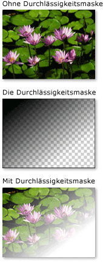
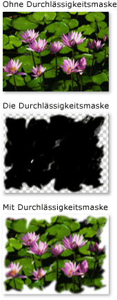
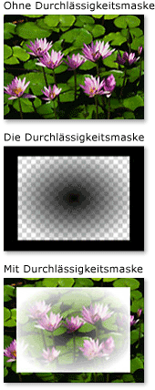

# Übersicht über Durchlässigkeitsmasken
Mit Deckkraftmasken können Sie Teile eines Elements oder visuellen Objekts transparent bzw. teilweise transparent machen. Um eine Deckkraftmaske zu <xref:System.Windows.Media.Brush> erstellen, <xref:System.Windows.UIElement.OpacityMask%2A> wenden Sie <xref:System.Windows.Media.Visual>eine auf die Eigenschaft eines Elements oder an.  Der Pinsel wird dem Element oder visuellen Objekt zugeordnet, und der Durchlässigkeitswert jedes Pinselpixels bestimmt die resultierende Durchlässigkeit der entsprechenden Pixel des Elements oder visuellen Objekts.  
  

## Voraussetzungen  
 Bei dieser Übersicht wird <xref:System.Windows.Media.Brush> davon ausgegangen, dass Sie mit Objekten vertraut sind. Eine Einführung in die Verwendung von Pinseln finden Sie unter [Übersicht über das Zeichnen mit Volltonfarben und Farbverläufen](painting-with-solid-colors-and-gradients-overview.md). Informationen <xref:System.Windows.Media.ImageBrush> zu <xref:System.Windows.Media.DrawingBrush>und finden Sie unter [Malen mit Bildern, Zeichnungen und Visuals](painting-with-images-drawings-and-visuals.md).  
  

## Erstellen von visuellen Effekten mit Deckkraftmasken  
 Eine Deckkraftmaske ordnet seine Inhalte dem Element oder visuellen Objekt zu. Der Alphakanal der einzelnen Pinselpixel bestimmt die resultierende Durchlässigkeit der entsprechenden Pixel des Elements oder visuellen Objekts. Die tatsächliche Farbe des Pinsels wird ignoriert. Wenn ein bestimmter Teil des Pinsels transparent ist, wird der entsprechende Teil des Elements oder visuellen Objekts transparent. Wenn ein bestimmter Teil des Pinsels nicht transparent ist, bleibt die Durchlässigkeit des entsprechenden Teils des Elements oder visuellen Objekts unverändert. Die von der Deckkraftmaske angegebene Deckkraft wird mit allen Deckkrafteinstellungen im Element oder visuellen Objekt kombiniert. Wenn ein Element z.B. zu 25 Prozent deckend ist und eine Deckkraftmaske angewendet wird, die von vollständig deckend in vollständig transparent übergeht, ist das Ergebnis ein Element, das von 25 Prozent deckend in vollständig transparent übergeht.  
  
> [!NOTE]
> Obwohl die Beispiele in dieser Übersicht die Verwendung von Deckkraftmasken für Bildelemente veranschaulichen, kann eine Deckkraftmaske auf jedes Element oder <xref:System.Windows.Media.Visual>, einschließlich Bedienfelder und Steuerelemente, angewendet werden.  
  
 Deckkraftmasken dienen zum Erstellen interessanter visueller Effekte, z.B. zum Erstellen von Bildern oder Schaltflächen, die ausgeblendet werden, zum Hinzufügen von Texturen zu Elementen oder Kombinieren von Farbverläufen, um glasähnliche Oberflächen zu erzeugen. Die folgende Abbildung veranschaulicht die Verwendung einer Deckkraftmaske. Ein Hintergrund im Schachbrettmuster zeigt die transparenten Teile der Maske.  
  
   
Beispiel für eine Deckkraftmaske  
  

## Erstellen einer Deckkraftmaske  
 Um eine Deckkraftmaske zu <xref:System.Windows.Media.Brush> erstellen, erstellen <xref:System.Windows.UIElement.OpacityMask%2A> Sie eine und wenden sie auf die Eigenschaft eines Elements oder visuals an. Sie können jede <xref:System.Windows.Media.Brush> Art von als Deckkraftmaske verwenden.  
  
- <xref:System.Windows.Media.LinearGradientBrush>, <xref:System.Windows.Media.RadialGradientBrush>: Wird verwendet, um ein Element oder ein visuelles Fade aus der Ansicht zu machen.  
  
     Die folgende Abbildung <xref:System.Windows.Media.LinearGradientBrush> zeigt eine als Deckkraftmaske verwendete Maske.  
  
       
Beispiel für eine LinearGradientBrush-Deckkraftmaske  
  
- <xref:System.Windows.Media.ImageBrush>: Wird verwendet, um Textur und weiche oder gerissene Kanteneffekte zu erstellen.  
  
     Die folgende Abbildung <xref:System.Windows.Media.ImageBrush> zeigt eine als Deckkraftmaske verwendete Maske.  
  
       
Beispiel für eine LinearGradientBrush-Deckkraftmaske  
  
- <xref:System.Windows.Media.DrawingBrush>: Wird verwendet, um komplexe Deckkraftmasken aus Mustern von Formen, Bildern und Farbverläufen zu erstellen.  
  
     Die folgende Abbildung <xref:System.Windows.Media.DrawingBrush> zeigt eine als Deckkraftmaske verwendete Maske.  
  
       
Beispiel für eine DrawingBrush-Deckkraftmaske  
  
 Die Farbverlaufsbürsten (<xref:System.Windows.Media.LinearGradientBrush> und <xref:System.Windows.Media.RadialGradientBrush>) eignen sich besonders gut für den Einsatz als Deckkraftmaske. Da <xref:System.Windows.Media.SolidColorBrush> ein Bereich mit einer einheitlichen Farbe gefüllt wird, bilden sie schlechte Deckkraftmasken; Die <xref:System.Windows.Media.SolidColorBrush> Verwendung von a entspricht dem Festlegen <xref:System.Windows.UIElement.OpacityMask%2A> der Eigenschaft des Elements oder visual.  
  

## Verwenden eines Farbverlaufs als Deckkraftmaske  
 Um eine graduelle Füllung zu erstellen, geben Sie mindestens zwei Farbverlaufsstopp an. Jeder Farbverlaufsstopp beschreibt eine Farbe und eine Position (weitere Informationen zum Erstellen und Verwenden von Farbverläufen finden Sie unter [Übersicht über das Zeichnen mit Volltonfarben und Farbverläufen](painting-with-solid-colors-and-gradients-overview.md)). Es handelt sich um den gleichen Vorgang wie bei der Verwendung eines Farbverlaufs als Deckkraftmaske, außer dass der Farbverlauf der Deckkraftmaske anstelle von Farben Alphakanalwerte mischt. Daher spielt die tatsächliche Farbe der Farbverlaufsinhalte keine Rolle. Nur der Alphakanal oder die Deckkraft jeder Farbe ist relevant. Im Folgenden finden Sie ein Beispiel.  
  
 [!code-xaml[OpacityMasksSnippet#LinearGradientOpacityMaskonImage](~/samples/snippets/csharp/VS_Snippets_Wpf/OpacityMasksSnippet/CS/GradientBrushExample.xaml#lineargradientopacitymaskonimage)]  
  

## Angeben von Farbverlaufsstopps für eine Deckkraftmaske  
 Im vorherigen Beispiel wird die <xref:System.Windows.Media.Colors.Black%2A> systemdefinierte Farbe als Startfarbe des Farbverlaufs verwendet. Da alle Farben in <xref:System.Windows.Media.Colors> der <xref:System.Windows.Media.Colors.Transparent%2A>Klasse, mit Ausnahme von , vollständig undurchsichtig sind, können sie verwendet werden, um einfach eine Startfarbe für eine Farbverlaufs-Opazitätsmaske zu definieren.  
  
 Für eine zusätzliche Kontrolle über Alphawerte beim Definieren einer Deckkraftmaske können Sie den Alphakanal von Farben <xref:System.Windows.Media.Color.FromScRgb%2A?displayProperty=nameWithType> mithilfe der aRGB-Hexadezimalnotation in Markup oder mit der Methode angeben.  
  

### Angeben der Deckkraft einer Farbe in „XAML“  
 In [!INCLUDE[TLA#tla_xaml](../../../../includes/tlasharptla-xaml-md.md)]verwenden Sie die hexadezimale ARGB-Notation, um die Deckkraft einzelner Farben anzugeben. Die hexadezimale Notation von ARGB verwendet die folgende Syntax:  
  
 `#` **aa** *rrggbb*  
  
 *aa* in der vorherigen Zeile stellt einen zweistelligen Hexadezimalwert dar, der verwendet wird, um die Deckkraft der Farbe anzugeben. *rr*, *gg* und *bb* repräsentieren jeweils einen zweistelligen Hexadezimalwert, der die Anteile von Rot, Grün und Blau einer Farbe angibt. Jede Hexadezimalziffer kann einen Wert von 0-9 bzw. A-F haben. 0 ist der kleinste und F der größte Wert. Der Alphawert 00 gibt eine Farbe an, die vollständig transparent ist, während ein Alphawert FF eine vollständig deckende Farbe erstellt.  Im folgenden Beispiel wird die hexadezimale ARGB-Notation verwendet, um zwei Farben anzugeben. Die erste ist vollständig deckend, während die zweite vollkommen transparent ist.  
  
 [!code-xaml[OpacityMasksSnippet#AARRGGBBValueonOpacityMask](~/samples/snippets/csharp/VS_Snippets_Wpf/OpacityMasksSnippet/CS/GradientBrushExample.xaml#aarrggbbvalueonopacitymask)]  
  

## Verwenden eines Bilds als Deckkraftmaske  
 Bilder können auch als Deckkraftmaske verwendet werden. Die folgende Abbildung zeigt ein Beispiel. Ein Hintergrund im Schachbrettmuster zeigt die transparenten Teile der Maske.  
  
   
Beispiel für eine Deckkraftmaske  
  
 Um ein Bild als Deckkraftmaske <xref:System.Windows.Media.ImageBrush> zu verwenden, verwenden Sie ein, um das Bild zu enthalten. Speichern Sie das Bild beim Erstellen eines Bildes, das als Deckkraftmaske verwendet werden soll, in einem Format, das mehrere Transparenzebenen unterstützt, z. B. Portable Network Graphics (PNG). Das folgende Beispiel zeigt den Code, der zum Erstellen der vorherigen Abbildung erforderlich ist.  
  
 [!code-xaml[OpacityMasksSnippet#UIElementOpacityMask](~/samples/snippets/csharp/VS_Snippets_Wpf/OpacityMasksSnippet/CS/ImageBrushExample.xaml#uielementopacitymask)]  
  

### Verwenden eines gekachelten Bilds als Deckkraftmaske  
 Im folgenden Beispiel wird dasselbe Bild <xref:System.Windows.Media.ImageBrush>mit einem anderen verwendet, aber die Kachelfunktionen des Pinsels werden verwendet, um Kacheln des Bildes mit 50 Pixeln quadratisch zu erzeugen.  
  
 [!code-xaml[OpacityMasksSnippet#TiledImageasOpacityMask](~/samples/snippets/csharp/VS_Snippets_Wpf/OpacityMasksSnippet/CS/ImageBrushExample.xaml#tiledimageasopacitymask)]  
  

## Erstellen einer Deckkraftmaske aus einer Zeichnung  
 Zeichnungen können als Deckkraftmaske verwendet verwenden. Die Formen innerhalb der Zeichnung können selbst mit Farbverläufen, Volltonfarben, Bildern oder sogar anderen Zeichnungen gefüllt werden. Die folgende Abbildung zeigt ein Beispiel einer Zeichnung, die als Deckkraftmaske verwendet wird. Ein Hintergrund im Schachbrettmuster zeigt die transparenten Teile der Maske.  
  
   
Beispiel für eine DrawingBrush-Deckkraftmaske  
  
 Um eine Zeichnung als Deckkraftmaske <xref:System.Windows.Media.DrawingBrush> zu verwenden, verwenden Sie eine, um die Zeichnung zu enthalten. Das folgende Beispiel zeigt den Code, der zum Erstellen der vorherigen Abbildung erforderlich ist:  
  
 [!code-xaml[OpacityMasksSnippet#OpacityMaskfromDrawing](~/samples/snippets/csharp/VS_Snippets_Wpf/OpacityMasksSnippet/CS/DrawingBrushExample.xaml#opacitymaskfromdrawing)]  
  

### Verwenden einer gekachelten Zeichnung als Deckkraftmaske  
 Wie <xref:System.Windows.Media.ImageBrush>die <xref:System.Windows.Media.DrawingBrush> kann die gemacht werden, um ihre Zeichnung zu kacheln. Im folgenden Beispiel wird ein Zeichenpinsel verwendet, um eine gekachelte Deckkraftmaske zu erstellen.  
  
 [!code-xaml[OpacityMasksSnippet#TiledDrawingasOpacityMask](~/samples/snippets/csharp/VS_Snippets_Wpf/OpacityMasksSnippet/CS/DrawingBrushExample.xaml#tileddrawingasopacitymask)]  
  
## Weitere Informationen

- [Zeichnen mit Bildern, Zeichnungen und visuellen Elementen](painting-with-images-drawings-and-visuals.md)
- [Übersicht über das Zeichnen mit Volltonfarben und Farbverläufen](painting-with-solid-colors-and-gradients-overview.md)
