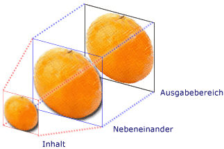
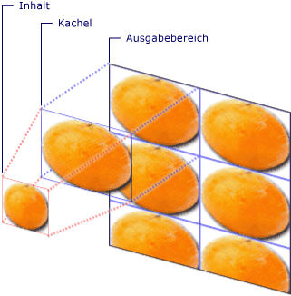

# Zeichnen mit Bildern, Zeichnungen und visuellen ElementenPainting with Images, Drawings, and Visuals
In diesem Thema <xref:System.Windows.Media.ImageBrush>wird <xref:System.Windows.Media.DrawingBrush>beschrieben, wie Sie , und <xref:System.Windows.Media.VisualBrush> <xref:System.Windows.Media.Drawing>Objekte verwenden, um einen Bereich mit einem Bild, einer oder einer <xref:System.Windows.Media.Visual>zu zeichnen.This topic describes how to use <xref:System.Windows.Media.ImageBrush>, <xref:System.Windows.Media.DrawingBrush>, and <xref:System.Windows.Media.VisualBrush> objects to paint an area with an image, a <xref:System.Windows.Media.Drawing>, or a <xref:System.Windows.Media.Visual>.  

## VoraussetzungenPrerequisites  
 Als Voraussetzung für dieses Thema sollten Sie mit den von [!INCLUDE[TLA#tla_winclient](../../../../includes/tlasharptla-winclient-md.md)] bereitgestellten unterschiedlichen Pinseltypen und ihren grundlegenden Funktionen vertraut sein.To understand this topic, you should be familiar with the different types of brushes [!INCLUDE[TLA#tla_winclient](../../../../includes/tlasharptla-winclient-md.md)] provides and their basic features. Eine Einführung finden Sie unter [Übersicht über WPF-Pinsel](wpf-brushes-overview.md).For an introduction, see the [WPF Brushes Overview](wpf-brushes-overview.md).  
  

## Zeichnen eines Bereichs mit einem BildPaint an Area with an Image  
 Ein <xref:System.Windows.Media.ImageBrush> malt einen Bereich <xref:System.Windows.Media.ImageSource>mit einem .An <xref:System.Windows.Media.ImageBrush> paints an area with an <xref:System.Windows.Media.ImageSource>. Der häufigste Typ <xref:System.Windows.Media.ImageSource> für die <xref:System.Windows.Media.ImageBrush> Verwendung <xref:System.Windows.Media.Imaging.BitmapImage>mit einer ist eine , die eine Bitmapgrafik beschreibt.The most common type of <xref:System.Windows.Media.ImageSource> to use with an <xref:System.Windows.Media.ImageBrush> is a <xref:System.Windows.Media.Imaging.BitmapImage>, which describes a bitmap graphic. Sie können <xref:System.Windows.Media.DrawingImage> eine verwenden, <xref:System.Windows.Media.Drawing> um mit einem Objekt <xref:System.Windows.Media.DrawingBrush> zu malen, aber es ist einfacher, stattdessen eine zu verwenden.You can use a <xref:System.Windows.Media.DrawingImage> to paint using a <xref:System.Windows.Media.Drawing> object, but it is simpler to use a <xref:System.Windows.Media.DrawingBrush> instead. Weitere Informationen <xref:System.Windows.Media.ImageSource> zu Objekten finden Sie in der [Imaging-Übersicht](imaging-overview.md).For more information about <xref:System.Windows.Media.ImageSource> objects, see the [Imaging Overview](imaging-overview.md).  
  
 Um mit <xref:System.Windows.Media.ImageBrush>einem zu <xref:System.Windows.Media.Imaging.BitmapImage> malen, erstellen Sie eine, und verwenden Sie diese, um den Bitmapinhalt zu laden.To paint with an <xref:System.Windows.Media.ImageBrush>, create a <xref:System.Windows.Media.Imaging.BitmapImage> and use it to load the bitmap content. Verwenden Sie <xref:System.Windows.Media.Imaging.BitmapImage> dann die, um die <xref:System.Windows.Media.ImageBrush.ImageSource%2A> Eigenschaft der <xref:System.Windows.Media.ImageBrush>festzulegen.Then, use the <xref:System.Windows.Media.Imaging.BitmapImage> to set the <xref:System.Windows.Media.ImageBrush.ImageSource%2A> property of the <xref:System.Windows.Media.ImageBrush>. Wenden Sie <xref:System.Windows.Media.ImageBrush> die schließlich auf das Objekt an, das Sie malen möchten.Finally, apply the <xref:System.Windows.Media.ImageBrush> to the object you want to paint.  In [!INCLUDE[TLA#tla_xaml](../../../../includes/tlasharptla-xaml-md.md)]können Sie auch <xref:System.Windows.Media.ImageBrush.ImageSource%2A> einfach die <xref:System.Windows.Media.ImageBrush> Eigenschaft des mit dem Pfad des zu ladenden Bildes festlegen.In [!INCLUDE[TLA#tla_xaml](../../../../includes/tlasharptla-xaml-md.md)], you can also just set the <xref:System.Windows.Media.ImageBrush.ImageSource%2A> property of the <xref:System.Windows.Media.ImageBrush> with the path of the image to load.  
  
 Wie <xref:System.Windows.Media.Brush> alle Objekte <xref:System.Windows.Media.ImageBrush> kann auch ein zum Zeichnen von Objekten wie Formen, Bedienfeldern, Steuerelementen und Text verwendet werden.Like all <xref:System.Windows.Media.Brush> objects, an <xref:System.Windows.Media.ImageBrush> can be used to paint objects such as shapes, panels, controls, and text. Die folgende Abbildung zeigt einige Effekte, <xref:System.Windows.Media.ImageBrush>die mit einem erreicht werden können.The following illustration shows some effects that can be achieved with an <xref:System.Windows.Media.ImageBrush>.  
  
   
Von einem ImageBrush gezeichnete ObjekteObjects painted by an ImageBrush  
  
 Standardmäßig dehnt ein <xref:System.Windows.Media.ImageBrush> Bild sein Bild aus, um den zu malenden Bereich vollständig zu füllen, wodurch das Bild möglicherweise verzerrt wird, wenn der gezeichnete Bereich ein anderes Seitenverhältnis als das Bild aufweist.By default, an <xref:System.Windows.Media.ImageBrush> stretches its image to completely fill the area being painted, possibly distorting the image if the painted area has a different aspect ratio than the image. Sie können dieses Verhalten <xref:System.Windows.Media.TileBrush.Stretch%2A> ändern, indem Sie <xref:System.Windows.Media.Stretch.Fill> <xref:System.Windows.Media.Stretch.None>die <xref:System.Windows.Media.Stretch.Uniform>Eigenschaft <xref:System.Windows.Media.Stretch.UniformToFill>von ihrem Standardwert von in , oder ändern.You can change this behavior by changing the <xref:System.Windows.Media.TileBrush.Stretch%2A> property from its default value of <xref:System.Windows.Media.Stretch.Fill> to <xref:System.Windows.Media.Stretch.None>, <xref:System.Windows.Media.Stretch.Uniform>, or <xref:System.Windows.Media.Stretch.UniformToFill>. Da <xref:System.Windows.Media.ImageBrush> es sich <xref:System.Windows.Media.TileBrush>um einen Typ von handelt, können Sie genau angeben, wie ein Bildpinsel den Ausgabebereich ausfüllt, und sogar Muster erstellen.Because <xref:System.Windows.Media.ImageBrush> is a type of <xref:System.Windows.Media.TileBrush>, you can specify exactly how an image brush fills the output area and even create patterns. Weitere Informationen zu <xref:System.Windows.Media.TileBrush> erweiterten Funktionen finden Sie in der [TileBrush-Übersicht](tilebrush-overview.md).For more information about advanced <xref:System.Windows.Media.TileBrush> features, see the [TileBrush Overview](tilebrush-overview.md).  
  

## Beispiel: Zeichnen eines Objekts mit einem BitmapbildExample: Paint an Object with a Bitmap Image  
 Im folgenden Beispiel <xref:System.Windows.Media.ImageBrush> wird <xref:System.Windows.Controls.Panel.Background%2A> ein <xref:System.Windows.Controls.Canvas>verwendet, um die von zu malen.The following example uses an <xref:System.Windows.Media.ImageBrush> to paint the <xref:System.Windows.Controls.Panel.Background%2A> of a <xref:System.Windows.Controls.Canvas>.  
  
 [!code-xaml[BrushOverviewExamples_snip#GraphicsMMImageBrushAsCanvasBackgroundExampleWholePage](~/samples/snippets/xaml/VS_Snippets_Wpf/BrushOverviewExamples_snip/XAML/ImageBrushExample.xaml#graphicsmmimagebrushascanvasbackgroundexamplewholepage)]  
  
 [!code-csharp[BrushOverviewExamples_procedural_snip#GraphicsMMImageBrushAsCanvasBackgroundExampleWholePage](~/samples/snippets/csharp/VS_Snippets_Wpf/BrushOverviewExamples_procedural_snip/CSharp/ImageBrushExample.cs#graphicsmmimagebrushascanvasbackgroundexamplewholepage)]
 [!code-vb[BrushOverviewExamples_procedural_snip#GraphicsMMImageBrushAsCanvasBackgroundExampleWholePage](~/samples/snippets/visualbasic/VS_Snippets_Wpf/BrushOverviewExamples_procedural_snip/visualbasic/imagebrushexample.vb#graphicsmmimagebrushascanvasbackgroundexamplewholepage)]  
  

## Zeichnen eines Bereichs mit einer ZeichnungPaint an Area with a Drawing  
 Mit <xref:System.Windows.Media.DrawingBrush> A können Sie einen Bereich mit Formen, Text, Bildern und Videos zeichnen.A <xref:System.Windows.Media.DrawingBrush> enables you to paint an area with shapes, text, images, and video. Shapes innerhalb eines Zeichenpinsels können selbst mit einer Einfarbigen <xref:System.Windows.Media.DrawingBrush>Farbe, einem Farbverlauf, einem Bild oder sogar einem anderen gezeichnet werden.Shapes inside a drawing brush may themselves be painted with a solid color, gradient, image, or even another <xref:System.Windows.Media.DrawingBrush>. Die folgende Abbildung zeigt <xref:System.Windows.Media.DrawingBrush>einige Verwendungen einer .The following illustration demonstrates some uses of a <xref:System.Windows.Media.DrawingBrush>.  
  
   
Von einem DrawingBrush gezeichnete ObjekteObjects painted by a DrawingBrush  
  
 Ein <xref:System.Windows.Media.DrawingBrush> zeichnet einen Bereich <xref:System.Windows.Media.Drawing> mit einem Objekt.A <xref:System.Windows.Media.DrawingBrush> paints an area with a <xref:System.Windows.Media.Drawing> object. Ein <xref:System.Windows.Media.Drawing> Objekt beschreibt sichtbaren Inhalt, z. B. eine Form, Bitmap, ein Video oder eine Textzeile.A <xref:System.Windows.Media.Drawing> object describes visible content, such as a shape, bitmap, video, or a line of text. Verschiedene Arten von Zeichnungen beschreiben verschiedene Arten von Inhalten.Different types of drawings describe different types of content. Im Folgenden finden Sie eine Liste der unterschiedlichen Typen von Zeichnungsobjekten.The following is a list of the different types of drawing objects.  
  
- <xref:System.Windows.Media.GeometryDrawing>– Zeichnet eine Form.<xref:System.Windows.Media.GeometryDrawing> – Draws a shape.  
  
- <xref:System.Windows.Media.ImageDrawing>– Zeichnet ein Bild.<xref:System.Windows.Media.ImageDrawing> – Draws an image.  
  
- <xref:System.Windows.Media.GlyphRunDrawing>– Zeichnet Text.<xref:System.Windows.Media.GlyphRunDrawing> – Draws text.  
  
- <xref:System.Windows.Media.VideoDrawing>– Gibt eine Audio- oder Videodatei ab.<xref:System.Windows.Media.VideoDrawing> – Plays an audio or video file.  
  
- <xref:System.Windows.Media.DrawingGroup>– Zeichnet andere Zeichnungen.<xref:System.Windows.Media.DrawingGroup> – Draws other drawings. Verwenden Sie eine Zeichnungsgruppe, um andere Zeichnungen in einer zusammengesetzten Zeichnung zu kombinieren.Use a drawing group to combine other drawings into a single composite drawing.  
  
 Weitere Informationen <xref:System.Windows.Media.Drawing> zu Objekten finden Sie in der [Übersicht über Zeichnungsobjekte](drawing-objects-overview.md).For more information about <xref:System.Windows.Media.Drawing> objects, see the [Drawing Objects Overview](drawing-objects-overview.md).  
  
 Wie <xref:System.Windows.Media.ImageBrush>ein <xref:System.Windows.Media.DrawingBrush> dehnt sich ein, <xref:System.Windows.Media.DrawingBrush.Drawing%2A> um seinen Ausgabebereich zu füllen.Like an <xref:System.Windows.Media.ImageBrush>, a <xref:System.Windows.Media.DrawingBrush> stretches its <xref:System.Windows.Media.DrawingBrush.Drawing%2A> to fill its output area. Sie können dieses Verhalten überschreiben, indem Sie die Eigenschaft aus der <xref:System.Windows.Media.TileBrush.Stretch%2A> Standardeinstellung von <xref:System.Windows.Media.Stretch.Fill>ändern.You can override this behavior by changing the <xref:System.Windows.Media.TileBrush.Stretch%2A> property from its default setting of <xref:System.Windows.Media.Stretch.Fill>. Weitere Informationen finden Sie in den Ausführungen zur <xref:System.Windows.Media.TileBrush.Stretch%2A>-Eigenschaft.For more information, see the <xref:System.Windows.Media.TileBrush.Stretch%2A> property.  
  

## Beispiel: Zeichnen eines Objekts mit einer ZeichnungExample: Paint an Object with a Drawing  
 Im folgenden Beispiel wird veranschaulicht, wie ein Objekt mit einer Zeichnung aus drei Ellipsen gezeichnet wird.The following example shows how to paint an object with a drawing of three ellipses. A <xref:System.Windows.Media.GeometryDrawing> wird verwendet, um die Ellipsen zu beschreiben.A <xref:System.Windows.Media.GeometryDrawing> is used to describe the ellipses.  
  
 [!code-xaml[BrushOverviewExamples_snip#GraphicsMMDrawingBrushAsButtonBackgroundExample](~/samples/snippets/xaml/VS_Snippets_Wpf/BrushOverviewExamples_snip/XAML/DrawingBrushExample.xaml#graphicsmmdrawingbrushasbuttonbackgroundexample)]  
  
 [!code-csharp[BrushOverviewExamples_procedural_snip#GraphicsMMDrawingBrushAsButtonBackgroundExample1](~/samples/snippets/csharp/VS_Snippets_Wpf/BrushOverviewExamples_procedural_snip/CSharp/DrawingBrushExample.cs#graphicsmmdrawingbrushasbuttonbackgroundexample1)]
 [!code-vb[BrushOverviewExamples_procedural_snip#GraphicsMMDrawingBrushAsButtonBackgroundExample1](~/samples/snippets/visualbasic/VS_Snippets_Wpf/BrushOverviewExamples_procedural_snip/visualbasic/drawingbrushexample.vb#graphicsmmdrawingbrushasbuttonbackgroundexample1)]  
  

## Zeichnen eines Bereichs mit einem visuellen ElementPaint an Area with a Visual  
 Die vielseitigste und leistungsstärkste aller <xref:System.Windows.Media.VisualBrush> Pinsel, die malt <xref:System.Windows.Media.Visual>einen Bereich mit einem .The most versatile and powerful of all the  brushes, the <xref:System.Windows.Media.VisualBrush> paints an area with a <xref:System.Windows.Media.Visual>. A <xref:System.Windows.Media.Visual> ist ein grafischer Typ auf niedriger Ebene, der als Vorfahre vieler nützlicher grafischer Komponenten dient.A <xref:System.Windows.Media.Visual> is a low-level graphical type that serves as the ancestor of many useful graphical components. Beispielsweise sind <xref:System.Windows.Window>die <xref:System.Windows.FrameworkElement>, <xref:System.Windows.Controls.Control> und Die <xref:System.Windows.Media.Visual> Klassen alle Objekttypen.For example, the <xref:System.Windows.Window>, <xref:System.Windows.FrameworkElement>, and <xref:System.Windows.Controls.Control> classes are all types of <xref:System.Windows.Media.Visual> objects. Mit <xref:System.Windows.Media.VisualBrush>einem können Sie Bereiche [!INCLUDE[TLA#tla_winclient](../../../../includes/tlasharptla-winclient-md.md)] mit fast jedem grafischen Objekt malen.Using a <xref:System.Windows.Media.VisualBrush>, you can paint areas with almost any [!INCLUDE[TLA#tla_winclient](../../../../includes/tlasharptla-winclient-md.md)] graphical object.  
  
> [!NOTE]
> Obwohl <xref:System.Windows.Media.VisualBrush> es sich <xref:System.Windows.Freezable> um einen Objekttyp handelt, kann es <xref:System.Windows.Media.VisualBrush.Visual%2A> nicht eingefroren werden (schreibgeschützt), wenn seine Eigenschaft auf einen anderen Wert als `null`festgelegt ist.Although <xref:System.Windows.Media.VisualBrush> is a type of <xref:System.Windows.Freezable> object, it cannot be frozen (made read-only) when its <xref:System.Windows.Media.VisualBrush.Visual%2A> property is set to a value other than `null`.  
  
 Es gibt zwei Möglichkeiten, <xref:System.Windows.Media.VisualBrush.Visual%2A> den <xref:System.Windows.Media.VisualBrush>Inhalt einer anzugeben.There are two ways to specify the <xref:System.Windows.Media.VisualBrush.Visual%2A> content of a <xref:System.Windows.Media.VisualBrush>.  
  
- Erstellen Sie <xref:System.Windows.Media.Visual> eine neue, <xref:System.Windows.Media.VisualBrush.Visual%2A> und verwenden <xref:System.Windows.Media.VisualBrush>Sie sie, um die Eigenschaft der festzulegen.Create a new <xref:System.Windows.Media.Visual> and use it to set the <xref:System.Windows.Media.VisualBrush.Visual%2A> property of the <xref:System.Windows.Media.VisualBrush>. Ein Beispiel finden Sie unter [Beispiel: Zeichnen eines Objekts mit einem visuellen Element](#examplevisualbrush1) im folgenden Abschnitt.For an example, see the [Example: Paint an Object with a Visual](#examplevisualbrush1) section that follows.  
  
- Verwenden Sie <xref:System.Windows.Media.Visual>eine vorhandene , die <xref:System.Windows.Media.Visual>ein doppeltes Abbild des Ziels erstellt.Use an existing <xref:System.Windows.Media.Visual>, which creates a duplicate image of the target <xref:System.Windows.Media.Visual>. Sie können dann <xref:System.Windows.Media.VisualBrush> die verwenden, um interessante Effekte wie Reflexion und Vergrößerung zu erstellen.You can then use the <xref:System.Windows.Media.VisualBrush> to create interesting effects, such as reflection and magnification. Ein Beispiel finden Sie unter [Beispiel: Erstellen einer Reflektion](#examplevisualbrush2).For an example, see the [Example: Create a Reflection](#examplevisualbrush2) section.  
  
 Wenn Sie ein <xref:System.Windows.Media.VisualBrush.Visual%2A> neues <xref:System.Windows.Media.VisualBrush> für <xref:System.Windows.Media.Visual> ein <xref:System.Windows.UIElement> definieren und das ein (z. B. ein Bedienfeld oder Einsteuerelement) ist, wird das Layoutsystem auf dem <xref:System.Windows.UIElement> und seinen untergeordneten Elementen ausgeführt, wenn die <xref:System.Windows.Media.VisualBrush.AutoLayoutContent%2A> Eigenschaft auf `true`festgelegt ist.When you define a new <xref:System.Windows.Media.VisualBrush.Visual%2A> for a <xref:System.Windows.Media.VisualBrush> and that <xref:System.Windows.Media.Visual> is a <xref:System.Windows.UIElement> (such as a panel or control), the layout system runs on the <xref:System.Windows.UIElement> and its child elements when the <xref:System.Windows.Media.VisualBrush.AutoLayoutContent%2A> property is set to `true`. Der Stamm <xref:System.Windows.UIElement> ist jedoch im Wesentlichen vom Rest des Systems isoliert: Stile und externes Layout können diese Grenze nicht durchdringen.However, the root <xref:System.Windows.UIElement> is essentially isolated from the rest of the system: styles, and external layout can't permeate this boundary. Daher sollten Sie explizit die Größe <xref:System.Windows.UIElement>des Stamms angeben, da sein einziges übergeordnetes Element der <xref:System.Windows.Media.VisualBrush> ist und sich daher nicht automatisch auf den zu malenden Bereich spezifizieren kann.Therefore, you should explicitly specify the size of the root <xref:System.Windows.UIElement>, because its only parent is the <xref:System.Windows.Media.VisualBrush> and therefore it cannot automatically size itself to the area being painted. Weitere Informationen zum Layout in [!INCLUDE[TLA#tla_winclient](../../../../includes/tlasharptla-winclient-md.md)] finden Sie unter [Layout](../advanced/layout.md).For more information about layout in [!INCLUDE[TLA#tla_winclient](../../../../includes/tlasharptla-winclient-md.md)], see the [Layout](../advanced/layout.md).  
  
 Wie <xref:System.Windows.Media.ImageBrush> <xref:System.Windows.Media.DrawingBrush>und <xref:System.Windows.Media.VisualBrush> , a dehnt seinen Inhalt, um seinen Ausgabebereich zu füllen.Like <xref:System.Windows.Media.ImageBrush> and  <xref:System.Windows.Media.DrawingBrush>, a <xref:System.Windows.Media.VisualBrush> stretches its content to fill its output area. Sie können dieses Verhalten überschreiben, indem Sie die Eigenschaft aus der <xref:System.Windows.Media.TileBrush.Stretch%2A> Standardeinstellung von <xref:System.Windows.Media.Stretch.Fill>ändern.You can override this behavior by changing the <xref:System.Windows.Media.TileBrush.Stretch%2A> property from its default setting of <xref:System.Windows.Media.Stretch.Fill>. Weitere Informationen finden Sie in den Ausführungen zur <xref:System.Windows.Media.TileBrush.Stretch%2A>-Eigenschaft.For more information, see the <xref:System.Windows.Media.TileBrush.Stretch%2A> property.  
  

## Beispiel: Zeichnen eines Objekts mit einem visuellen ElementExample: Paint an Object with a Visual  
 Im folgenden Beispiel werden mehrere Steuerelemente und ein Bereich verwendet, um ein Rechteck zu zeichnen.In the following example, several controls and a panel are used to paint a rectangle.  
  
 [!code-xaml[BrushOverviewExamples_snip#GraphicsMMVisualBrushAsRectangleBackgroundExample](~/samples/snippets/xaml/VS_Snippets_Wpf/BrushOverviewExamples_snip/XAML/VisualBrushExample.xaml#graphicsmmvisualbrushasrectanglebackgroundexample)]  
  
 [!code-csharp[BrushOverviewExamples_procedural_snip#GraphicsMMVisualBrushAsRectangleBackgroundExample1](~/samples/snippets/csharp/VS_Snippets_Wpf/BrushOverviewExamples_procedural_snip/CSharp/VisualBrushExample.cs#graphicsmmvisualbrushasrectanglebackgroundexample1)]
 [!code-vb[BrushOverviewExamples_procedural_snip#GraphicsMMVisualBrushAsRectangleBackgroundExample1](~/samples/snippets/visualbasic/VS_Snippets_Wpf/BrushOverviewExamples_procedural_snip/visualbasic/visualbrushexample.vb#graphicsmmvisualbrushasrectanglebackgroundexample1)]  
  

## Beispiel: Erstellen einer ReflektionExample: Create a Reflection  
 Das obige Beispiel zeigte, <xref:System.Windows.Media.Visual> wie Sie ein neues für die Verwendung als Hintergrund erstellen.The preceding example showed how to create a new <xref:System.Windows.Media.Visual> for use as a background. Sie können auch <xref:System.Windows.Media.VisualBrush> eine verwenden, um ein vorhandenes visuelles Element anzuzeigen. Diese Funktion ermöglicht es Ihnen, interessante visuelle Effekte wie Reflexionen und Vergrößerung zu erzeugen.You can also use a <xref:System.Windows.Media.VisualBrush> to display an existing visual; this capability enables you to produce interesting visual effects, such as reflections and magnification. Im folgenden Beispiel <xref:System.Windows.Media.VisualBrush> wird ein verwendet, um eine Reflektion eines zu <xref:System.Windows.Controls.Border> erstellen, das mehrere Elemente enthält.The following example uses a <xref:System.Windows.Media.VisualBrush> to create a reflection of a <xref:System.Windows.Controls.Border> that contains several elements. In der folgenden Abbildung ist die von diesem Beispiel erstellte Ausgabe dargestellt.The following illustration shows the output that this example produces.  
  
   
Ein reflektiertes Visual-ObjektA reflected Visual object  
  
 [!code-csharp[visualbrush_markup_snip#GraphicsMMVisualBrushReflectionExampleWholePage](~/samples/snippets/csharp/VS_Snippets_Wpf/visualbrush_markup_snip/CSharp/ReflectionExample.cs#graphicsmmvisualbrushreflectionexamplewholepage)]
 [!code-vb[visualbrush_markup_snip#GraphicsMMVisualBrushReflectionExampleWholePage](~/samples/snippets/visualbasic/VS_Snippets_Wpf/visualbrush_markup_snip/visualbasic/reflectionexample.vb#graphicsmmvisualbrushreflectionexamplewholepage)]
 [!code-xaml[visualbrush_markup_snip#GraphicsMMVisualBrushReflectionExampleWholePage](~/samples/snippets/xaml/VS_Snippets_Wpf/visualbrush_markup_snip/XAML/ReflectionExample.xaml#graphicsmmvisualbrushreflectionexamplewholepage)]  
  
 Weitere Beispiele, die zeigen, wie Bildschirmbereiche vergrößert und Reflektionen erstellt werden, finden Sie unter [Beispiel zu VisualBrush](https://github.com/Microsoft/WPF-Samples/tree/master/Graphics/VisualBrush).For additional examples that show how to magnify portions of the screen and how to create reflections, see the [VisualBrush Sample](https://github.com/Microsoft/WPF-Samples/tree/master/Graphics/VisualBrush).  
  

## TileBrush-FunktionenTileBrush Features  
 <xref:System.Windows.Media.ImageBrush>, <xref:System.Windows.Media.DrawingBrush>und <xref:System.Windows.Media.VisualBrush> sind <xref:System.Windows.Media.TileBrush> Objekttypen.<xref:System.Windows.Media.ImageBrush>, <xref:System.Windows.Media.DrawingBrush>, and <xref:System.Windows.Media.VisualBrush> are types of <xref:System.Windows.Media.TileBrush> objects. <xref:System.Windows.Media.TileBrush>Objekte geben Ihnen eine große Kontrolle darüber, wie ein Bereich mit einem Bild, einer Zeichnung oder einem visuellen Element gezeichnet wird.<xref:System.Windows.Media.TileBrush> objects provide you with a great deal of control over how an area is painted with an image, drawing, or visual. Sie können beispielsweise zum Zeichnen eines Bereichs anstelle eines einzelnen gestreckten Bilds eine Reihe von Bildkacheln verwenden, die ein Muster ergeben.For example, instead of just painting an area with a single stretched image, you can paint an area with a series of image tiles that create a pattern.  
  
 A <xref:System.Windows.Media.TileBrush> besteht aus drei Hauptkomponenten: Inhalt, Kacheln und Ausgabebereich.A <xref:System.Windows.Media.TileBrush> has three primary components: content, tiles, and the output area.  
  
   
Komponenten eines TileBrush mit einer einzelnen KachelComponents of a TileBrush with a single tile  
  
   
Komponente eines TileBrush mit mehreren KachelnComponents of a TileBrush with multiple tiles  
  
 Weitere Informationen zu den Kachelfunktionen von <xref:System.Windows.Media.TileBrush> Objekten finden Sie in der [TileBrush-Übersicht](tilebrush-overview.md).For more information about the tiling features of <xref:System.Windows.Media.TileBrush> objects, see the [TileBrush Overview](tilebrush-overview.md).  
  
## Weitere InformationenSee also

- <xref:System.Windows.Media.ImageBrush>
- <xref:System.Windows.Media.DrawingBrush>
- <xref:System.Windows.Media.VisualBrush>
- <xref:System.Windows.Media.TileBrush>
- [Übersicht über TileBrushTileBrush Overview](tilebrush-overview.md)
- [Übersicht über WPF-PinselWPF Brushes Overview](wpf-brushes-overview.md)
- [Übersicht über die BildverarbeitungImaging Overview](imaging-overview.md)
- [Übersicht über ZeichnungsobjekteDrawing Objects Overview](drawing-objects-overview.md)
- [Übersicht über DeckkraftmaskenOpacity Masks Overview](opacity-masks-overview.md)
- [Übersicht über das WPF-GrafikrenderingWPF Graphics Rendering Overview](wpf-graphics-rendering-overview.md)
- [Beispiel zu ImageBrushImageBrush Sample](https://github.com/Microsoft/WPF-Samples/tree/master/Graphics/ImageBrush)
- [VisualBrush-BeispielVisualBrush Sample](https://github.com/Microsoft/WPF-Samples/tree/master/Graphics/VisualBrush)
