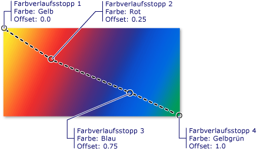
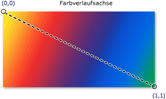

# Übersicht über das Zeichnen mit Volltonfarben und FarbverläufenPainting with Solid Colors and Gradients Overview

In diesem Thema wird beschrieben, wie Sie <xref:System.Windows.Media.SolidColorBrush> <xref:System.Windows.Media.LinearGradientBrush> mit-,-und- <xref:System.Windows.Media.RadialGradientBrush> Objekten mit voll Tonfarben, linearen Farbverläufen und radialen Farbverläufen zeichnen können.This topic describes how to use <xref:System.Windows.Media.SolidColorBrush>, <xref:System.Windows.Media.LinearGradientBrush>, and <xref:System.Windows.Media.RadialGradientBrush> objects to paint with solid colors, linear gradients, and radial gradients.

## Zeichnen einen Bereich mit einer VolltonfarbePainting an Area with a Solid Color

Einer der gängigsten Vorgänge auf einer beliebigen Plattform ist das Zeichnen eines Bereichs mit einem soliden <xref:System.Windows.Media.Color> .One of the most common operations in any platform is to paint an area with a solid <xref:System.Windows.Media.Color>. Zum Ausführen dieser Aufgabe [!INCLUDE[TLA#tla_winclient](../../../../includes/tlasharptla-winclient-md.md)] stellt die- <xref:System.Windows.Media.SolidColorBrush> Klasse bereit.To accomplish this task, [!INCLUDE[TLA#tla_winclient](../../../../includes/tlasharptla-winclient-md.md)] provides the <xref:System.Windows.Media.SolidColorBrush> class. In den folgenden Abschnitten werden die verschiedenen Methoden zum Zeichnen mit einem beschrieben <xref:System.Windows.Media.SolidColorBrush> .The following sections describe the different ways to paint with a <xref:System.Windows.Media.SolidColorBrush>.

### Verwenden eines SolidColorBrush in „XAML“Using a SolidColorBrush in "XAML"

Zum Zeichnen eines Bereichs mit einer Volltonfarbe in [!INCLUDE[TLA2#tla_xaml](../../../../includes/tla2sharptla-xaml-md.md)], verwenden Sie eine der folgenden Optionen.To paint an area with a solid color in [!INCLUDE[TLA2#tla_xaml](../../../../includes/tla2sharptla-xaml-md.md)], use one of the following options.

- Wählen Sie einen vordefinierten Volltonfarbenpinsel über den Namen aus.Select a predefined solid color brush by name.  Beispielsweise können Sie eine Schaltfläche <xref:System.Windows.Controls.Control.Background%2A> auf "Red" oder "MediumBlue" festlegen.For example, you can set a button's <xref:System.Windows.Controls.Control.Background%2A> to "Red" or "MediumBlue".  Eine Liste mit anderen vordefinierten Pinsel Farben finden Sie in den statischen Eigenschaften der- <xref:System.Windows.Media.Brushes> Klasse.For a list of other predefined solid color brushes, see the static properties of the <xref:System.Windows.Media.Brushes> class. Im Folgenden finden Sie ein Beispiel.The following is an example.

  [!code-xaml[BrushOverviewExamples_snip#SolidColorBrushNamedColor1XAML](~/samples/snippets/xaml/VS_Snippets_Wpf/BrushOverviewExamples_snip/XAML/SolidColorBrushExample.xaml#solidcolorbrushnamedcolor1xaml)]

- Wählen Sie eine Farbe aus der 32-Bit-Farbpalette aus, indem Sie die Anteile von Rot, Grün und Blau festlegen, aus denen sich eine Volltonfarbe zusammensetzt.Choose a color from the 32-bit color palette by specifying the amounts of red, green, and blue to combine into a single solid color.  Das Format zum Festlegen einer Farbe aus der 32-Bit-Palette ist „*#rrggbb*“, wobei mit dem zweistelligen Hexadezimalwert *rr* der relative Anteil von Rot, mit *gg* der Anteil von Grün und *bb* der Anteil von Blau festgelegt wird.The format for specifying a color from the 32-bit palette is "*#rrggbb*", where *rr* is a two digit hexadecimal number specifying the relative amount of red, *gg* specifies the amount of green, and *bb* specifies the amount of blue.  Darüber hinaus kann die Farbe im Format „#*Aarrggbb*“ angegeben werden, wobei *aa* für den *Alpha*wert, also die Transparenz der Farbe, steht.Additionally, the color can be specified as "#*aarrggbb*" where *aa* specifies the *alpha* value, or transparency, of the color. Dieser Ansatz ermöglicht Ihnen die Erstellung von Farben, die teilweise transparent sind.This approach enables you to create colors that are partially transparent.  Im folgenden Beispiel <xref:System.Windows.Controls.Control.Background%2A> wird der eines <xref:System.Windows.Controls.Button> mit hexadezimal Schreibweise auf vollständig deckendes Rot festgelegt.In the following example, the <xref:System.Windows.Controls.Control.Background%2A> of a <xref:System.Windows.Controls.Button> is set to fully-opaque red using hexadecimal notation.

  [!code-xaml[BrushOverviewExamples_snip#SolidColorBrushHex1XAML](~/samples/snippets/xaml/VS_Snippets_Wpf/BrushOverviewExamples_snip/XAML/SolidColorBrushExample.xaml#solidcolorbrushhex1xaml)]

- Verwenden Sie die Eigenschaft Tagsyntax, um eine zu beschreiben <xref:System.Windows.Media.SolidColorBrush> .Use property tag syntax to describe a <xref:System.Windows.Media.SolidColorBrush>. Diese Syntax ist ausführlicher, jedoch können Sie zusätzliche Einstellungen, z.B. die Deckkraft des Pinsels, angeben.This syntax is more verbose but enables you to specify additional settings, such as the brush's opacity. Im folgenden Beispiel <xref:System.Windows.Controls.Control.Background%2A> werden die Eigenschaften von zwei- <xref:System.Windows.Controls.Button> Elementen auf vollständig deckendes Rot festgelegt.In the following example, the <xref:System.Windows.Controls.Control.Background%2A> properties of two <xref:System.Windows.Controls.Button> elements are set to fully-opaque red. Die Farbe des ersten Pinsels wird mit einem vordefinierten Farbnamen beschrieben.The first brush's color is described using a predefined color name. Die Farbe des zweiten Pinsels wird mithilfe der Hexadezimalschreibweise beschrieben.The second brush's color is described using hexadecimal notation.

  [!code-xaml[BrushOverviewExamples_snip#SolidColorBrushPropertyTag1XAML](~/samples/snippets/xaml/VS_Snippets_Wpf/BrushOverviewExamples_snip/XAML/SolidColorBrushExample.xaml#solidcolorbrushpropertytag1xaml)]

### Zeichnen mit einem SolidColorBrush in CodePainting with a SolidColorBrush in Code

Zum Zeichnen eines Bereichs mit einer Volltonfarbe in Code, verwenden Sie eine der folgenden Optionen.To paint an area with a solid color in code, use one of the following options.

- Verwenden Sie eines der vordefinierten Pinsel, die von der-Klasse bereitgestellt werden <xref:System.Windows.Media.Brushes> .Use one of the predefined brushes provided by the <xref:System.Windows.Media.Brushes> class. Im folgenden Beispiel <xref:System.Windows.Controls.Control.Background%2A> wird der eines <xref:System.Windows.Controls.Button> auf festgelegt <xref:System.Windows.Media.Brushes.Red%2A> .In the following example, the <xref:System.Windows.Controls.Control.Background%2A> of a <xref:System.Windows.Controls.Button> is set to <xref:System.Windows.Media.Brushes.Red%2A>.

  [!code-csharp[BrushOverviewExamples_snip#SolidColorBrushPredefinedBrush1CSharp](~/samples/snippets/csharp/VS_Snippets_Wpf/BrushOverviewExamples_snip/CSharp/SolidColorBrushExample.cs#solidcolorbrushpredefinedbrush1csharp)]

- Erstellen Sie einen, <xref:System.Windows.Media.SolidColorBrush> und legen Sie seine- <xref:System.Windows.Media.SolidColorBrush.Color%2A> Eigenschaft mithilfe einer- <xref:System.Windows.Media.Color> Struktur festCreate a <xref:System.Windows.Media.SolidColorBrush> and set its <xref:System.Windows.Media.SolidColorBrush.Color%2A> property using a <xref:System.Windows.Media.Color> structure. Sie können eine vordefinierte Farbe aus der-Klasse verwenden, <xref:System.Windows.Media.Colors> oder Sie können <xref:System.Windows.Media.Color> mithilfe der statischen-Methode ein erstellen <xref:System.Windows.Media.Color.FromArgb%2A> .You can use a predefined color from the <xref:System.Windows.Media.Colors> class or you can create a <xref:System.Windows.Media.Color> using the static <xref:System.Windows.Media.Color.FromArgb%2A> method.

  Im folgenden Beispiel wird gezeigt, wie die- <xref:System.Windows.Media.SolidColorBrush.Color%2A> Eigenschaft eines <xref:System.Windows.Media.SolidColorBrush> mit einer vordefinierten Farbe festgelegt wird.The following example shows how to set the <xref:System.Windows.Media.SolidColorBrush.Color%2A> property of a <xref:System.Windows.Media.SolidColorBrush> using a predefined color.

  [!code-csharp[BrushOverviewExamples_snip#SolidColorBrushPredefinedColor1CSharp](~/samples/snippets/csharp/VS_Snippets_Wpf/BrushOverviewExamples_snip/CSharp/SolidColorBrushExample.cs#solidcolorbrushpredefinedcolor1csharp)]

Mit dem statischen <xref:System.Windows.Media.Color.FromArgb%2A> können Sie die Werte Alpha, rot, grün und blau der Farbe angeben.The static <xref:System.Windows.Media.Color.FromArgb%2A> enables you to specify the color's alpha, red, green, and blue values. Der normale Bereich für jeden der folgenden Werte ist 0 bis 255.The typical range for each of these values is 0-255. Beispielsweise gibt der Alphawert 0 an, dass eine Farbe völlig transparent, während der Wert 255 angibt, dass sie vollständig deckend ist.For example, an alpha value of 0 indicates that a color is completely transparent, while a value of 255 indicates the color is completely opaque. Entsprechend gibt der Wert 0 für die Farbe Rot an, dass eine Farbe keinen Rotanteil hat, während der Wert 255 angibt, dass eine Farbe den maximalen Rotanteil aufweist.Likewise, a red value of 0 indicates that a color has no red in it, while a value of 255 indicates a color has the maximum amount of red possible.  Im folgenden Beispiel wird die Farbe eines Pinsels beschrieben, indem rote, grüne und blaue Alphawert angegeben werden.In the following example, a brush's color is described by specifying alpha, red, green, and blue values.

[!code-csharp[BrushOverviewExamples_snip#SolidColorBrushfromArgbExample1CSharp](~/samples/snippets/csharp/VS_Snippets_Wpf/BrushOverviewExamples_snip/CSharp/SolidColorBrushExample.cs#solidcolorbrushfromargbexample1csharp)]

Weitere Methoden zum Angeben von Farben finden Sie im <xref:System.Windows.Media.Color> Referenz Thema.For additional ways to specify color, see the <xref:System.Windows.Media.Color> reference topic.

## Zeichnen eines Bereichs mit einem FarbverlaufPainting an Area with a Gradient

Ein Farbverlaufspinsel zeichnet einen Bereich mit mehreren Farben, die sich auf einer Achse miteinander vermischen.A gradient brush paints an area with multiple colors that blend into each other along an axis. Sie können Farbverlaufspinsel verwenden, um Eindrücke von Licht und Schatten zu erzeugen und den Steuerelementen ein dreidimensionales Aussehen zu verleihen.You can use them to create impressions of light and shadow, giving your controls a three-dimensional feel. Sie können Sie auch verwenden, um Glas, Chrom, Wasser und andere glatte Oberflächen zu simulieren.You can also use them to simulate glass, chrome, water, and other smooth surfaces.  [!INCLUDE[TLA2#tla_winclient](../../../../includes/tla2sharptla-winclient-md.md)]stellt zwei Typen von Farbverlaufs Pinsel bereit: <xref:System.Windows.Media.LinearGradientBrush> und <xref:System.Windows.Media.RadialGradientBrush> .provides two types of gradient brushes: <xref:System.Windows.Media.LinearGradientBrush> and <xref:System.Windows.Media.RadialGradientBrush>.

## Lineare FarbverläufeLinear Gradients

Ein <xref:System.Windows.Media.LinearGradientBrush> zeichnet einen Bereich mit einem Farbverlauf, der entlang einer Linie definiert ist, der *Farbverlaufs Achse*.A <xref:System.Windows.Media.LinearGradientBrush> paints an area with a gradient defined along a line, the *gradient axis*.  Mithilfe von-Objekten geben Sie die Farben des Farbverlaufs und deren Position entlang der Farbverlaufs Achse an <xref:System.Windows.Media.GradientStop> .You specify the gradient's colors and their location along the gradient axis using <xref:System.Windows.Media.GradientStop> objects.  Sie können auch die Farbverlaufsachse ändern. Dies ermöglicht Ihnen, horizontale und vertikale Farbverläufe zu erstellen und die Richtung des Farbverlaufs umzukehren.You may also modify the gradient axis, which enables you to create horizontal and vertical gradients and to reverse the gradient direction. Die Farbverlaufsachse wird im nächsten Abschnitt beschrieben.The gradient axis is described in the next section. Standardmäßig wird ein diagonaler Farbverlauf erstellt.By default, a diagonal gradient is created.

Das folgende Beispiel zeigt den Code, der einen linearen Farbverlauf mit vier Farben erstellt.The following example shows the code that creates a linear gradient with four colors.

[!code-xaml[GradientBrushExamples_snip#DiagonalGradient1XAML](~/samples/snippets/xaml/VS_Snippets_Wpf/GradientBrushExamples_snip/XAML/LinearGradientBrushExample.xaml#diagonalgradient1xaml)]

[!code-csharp[GradientBrushExamples_snip#DiagonalGradient1CSharp](~/samples/snippets/csharp/VS_Snippets_Wpf/GradientBrushExamples_snip/CSharp/LinearGradientBrushExample.cs#diagonalgradient1csharp)]

Dieser Code erzeugt den folgenden Farbverlauf:This code produces the following gradient:

> [!NOTE]
> Die Farbverlaufs Beispiele in diesem Thema verwenden das Standard Koordinatensystem zum Festlegen von Startpunkten und Endpunkten.The gradient examples in this topic use the default coordinate system for setting start points and end points. Das Standardkoordinatensystem ist relativ zu einem umgebenden Feld: 0 gibt 0 Prozent des umgebenden Felds und 1 gibt 100 Prozent des umgebenden Felds an.The default coordinate system is relative to a bounding box: 0 indicates 0 percent of the bounding box and 1 indicates 100 percent of the bounding box. Sie können dieses Koordinatensystem ändern, indem Sie die- <xref:System.Windows.Media.GradientBrush.MappingMode%2A> Eigenschaft auf den Wert festlegen <xref:System.Windows.Media.BrushMappingMode.Absolute> .You can change this coordinate system by setting the <xref:System.Windows.Media.GradientBrush.MappingMode%2A> property to the value <xref:System.Windows.Media.BrushMappingMode.Absolute>. Ein absolutes Koordinatensystem ist nicht relativ zu einem umgebenden Feld.An absolute coordinate system is not relative to a bounding box. Werte werden direkt im lokalen Raum interpretiert.Values are interpreted directly in local space.

Der <xref:System.Windows.Media.GradientStop> ist der Grundbaustein eines Farbverlaufs Pinsels.The <xref:System.Windows.Media.GradientStop> is the basic building block of a gradient brush.  Ein Farbverlaufs Ende gibt ein <xref:System.Windows.Media.GradientStop.Color%2A> an einem <xref:System.Windows.Media.GradientStop.Offset%2A> entlang der Farbverlaufs Achse an.A gradient stop specifies a <xref:System.Windows.Media.GradientStop.Color%2A> at an <xref:System.Windows.Media.GradientStop.Offset%2A> along the gradient axis.

- Die-Eigenschaft des Farbverlaufs Stopps <xref:System.Windows.Media.GradientStop.Color%2A> gibt die Farbe des Farbverlaufs Stopps an.The gradient stop's <xref:System.Windows.Media.GradientStop.Color%2A> property specifies the color of the gradient stop. Sie können die Farbe festlegen, indem Sie eine vordefinierte Farbe (die von der-Klasse bereitgestellt wird <xref:System.Windows.Media.Colors> ) verwenden oder ScRGB-oder ARGB-Werte angeben.You may set the color by using a predefined color (provided by the <xref:System.Windows.Media.Colors> class) or by specifying ScRGB or ARGB values. In [!INCLUDE[TLA2#tla_xaml](../../../../includes/tla2sharptla-xaml-md.md)] können Sie auch die Hexadezimalschreibweise verwenden, um eine Farbe zu beschreiben.In [!INCLUDE[TLA2#tla_xaml](../../../../includes/tla2sharptla-xaml-md.md)], you may also use hexadecimal notation to describe a color. Weitere Informationen finden Sie in der- <xref:System.Windows.Media.Color> Struktur.For more information, see the <xref:System.Windows.Media.Color> structure.

- Die-Eigenschaft des Farbverlaufs Stopps <xref:System.Windows.Media.GradientStop.Offset%2A> gibt die Position der Farbe des Farbverlaufs Stopps auf der Farbverlaufs Achse an.The gradient stop's <xref:System.Windows.Media.GradientStop.Offset%2A> property specifies the position of the gradient stop's color on the gradient axis. Der Offset liegt <xref:System.Double> zwischen 0 und 1.The offset is a <xref:System.Double> that ranges from 0 to 1. Je näher ist Offsetwert des Farbverlaufsstopps bei 0 liegt, desto näher befindet sich die Farbe am Beginn des Farbverlaufs.The closer a gradient stop's offset value is to 0, the closer the color is to the start of the gradient. Je näher ist Offsetwert des Farbverlaufsstopps bei 1 liegt, desto näher befindet sich die Farbe am Ende des Farbverlaufs.The closer the gradient's offset value is to 1, the closer the color is to the end of the gradient.

Die Farbe der einzelnen Punkte zwischen den Farbverlaufsstopps wird linear als eine Kombination der von den beiden umgebenden Farbverlaufsstopps angegebenen Farben interpoliert.The color of each point between gradient stops is linearly interpolated as a combination of the color specified by the two bounding gradient stops. Die folgende Abbildung zeigt die im vorherigen Beispiel erstellten Farbverlaufsstopps.The following illustration highlights the gradient stops in the previous example. Die Kreise markieren die Position der Farbverlaufsstopps, und eine gestrichelte Linie zeigt die Farbverlaufsachse an.The circles mark the position of gradient stops and a dashed line shows the gradient axis.

Der erste Farbverlaufsstopp gibt die Farbe Gelb bei einem Offset von `0.0` an.The first gradient stop specifies the color yellow at an offset of `0.0`.  Der zweite Farbverlaufsstopp gibt die Farbe Rot bei einem Offset von `0.25` an.The second gradient stop specifies the color red at an offset of `0.25`.  Die Farbe der Punkte zwischen diesen zwei Stopps ändert sich allmählich von Gelb zu Rot, wenn Sie sich von links nach rechts auf der Farbverlaufsachse bewegen.The points between these two stops gradually change from yellow to red as you move from left to right along the gradient axis.  Der dritte Farbverlaufsstopp gibt die Farbe Blau bei einem Offset von `0.75` an.The third gradient stop specifies the color blue at an offset of `0.75`.  Die Farbe der Punkte zwischen dem zweiten und dritten Farbverlaufsstopp ändert sich allmählich von Rot zu Blau.The points between the second and third gradient stops gradually change from red to blue. Der vierte Farbverlaufsstopp gibt die Farbe Gelbgrün bei einem Offset von `1.0` an.The fourth gradient stop specifies the color lime green at an offset of `1.0`. Die Farbe der Punkte zwischen dem dritten und vierten Farbverlaufsstopp ändert sich allmählich von Blau zu Gelbgrün.The points between the third and fourth gradient stops gradually change from blue to lime green.

### Die FarbverlaufsachseThe Gradient Axis

Wie bereits erwähnt, befinden sich die Farbverlaufsstopps eines Pinsel mit linearem Farbverlauf auf einer Linie, der Farbverlaufsachse.As previously mentioned, a linear gradient brush's gradient stops are positioned along a line, the gradient axis. Sie können die Ausrichtung und die Größe der Linie mithilfe der-und-Eigenschaften des Pinsels ändern <xref:System.Windows.Media.LinearGradientBrush.StartPoint%2A> <xref:System.Windows.Media.LinearGradientBrush.EndPoint%2A> .You may change the orientation and size of the line using the brush's <xref:System.Windows.Media.LinearGradientBrush.StartPoint%2A> and <xref:System.Windows.Media.LinearGradientBrush.EndPoint%2A> properties. Durch die Bearbeitung des Pinsels <xref:System.Windows.Media.LinearGradientBrush.StartPoint%2A> und <xref:System.Windows.Media.LinearGradientBrush.EndPoint%2A> können Sie horizontale und vertikale Farbverläufe erstellen, die Richtung des Farbverlaufs umkehren, die Verlaufs Verteilung und vieles mehr umkehren.By manipulating the brush's <xref:System.Windows.Media.LinearGradientBrush.StartPoint%2A> and <xref:System.Windows.Media.LinearGradientBrush.EndPoint%2A>, you can create horizontal and vertical gradients, reverse the gradient direction, condense the gradient spread, and more.

Standardmäßig sind die und der lineare Farbverlaufs Pinsel <xref:System.Windows.Media.LinearGradientBrush.StartPoint%2A> <xref:System.Windows.Media.LinearGradientBrush.EndPoint%2A> relativ zum Bereich, der gezeichnet wird.By default, the linear gradient brush's <xref:System.Windows.Media.LinearGradientBrush.StartPoint%2A> and <xref:System.Windows.Media.LinearGradientBrush.EndPoint%2A> are relative to the area being painted. Der Punkt (0,0) stellt die obere linke Ecke und der Punkt (1,1) die untere rechte Ecke des Bereichs dar, der gezeichnet wird.The point (0,0) represents the upper-left corner of the area being painted, and (1,1) represents the lower-right corner of the area being painted. Der Standardwert <xref:System.Windows.Media.LinearGradientBrush.StartPoint%2A> von <xref:System.Windows.Media.LinearGradientBrush> ist (0,0), und der Standardwert <xref:System.Windows.Media.LinearGradientBrush.EndPoint%2A> ist (1,1). Dadurch wird ein diagonaler Farbverlauf erstellt, beginnend mit der linken oberen Ecke und der Erweiterung auf die untere rechte Ecke des gezeichneten Bereichs.The default <xref:System.Windows.Media.LinearGradientBrush.StartPoint%2A> of a <xref:System.Windows.Media.LinearGradientBrush> is (0,0), and its default <xref:System.Windows.Media.LinearGradientBrush.EndPoint%2A> is (1,1), which creates a diagonal gradient starting at the upper-left corner and extending to the lower-right corner of the area being painted. Die folgende Abbildung zeigt die Farbverlaufs Achse eines linearen Farbverlaufs Pinsels mit der Standardeinstellung <xref:System.Windows.Media.LinearGradientBrush.StartPoint%2A> und <xref:System.Windows.Media.LinearGradientBrush.EndPoint%2A> .The following illustration shows the gradient axis of a linear gradient brush with default <xref:System.Windows.Media.LinearGradientBrush.StartPoint%2A> and <xref:System.Windows.Media.LinearGradientBrush.EndPoint%2A>.

Im folgenden Beispiel wird gezeigt, wie ein horizontaler Farbverlauf erstellt wird, indem der Pinsel und angegeben werden <xref:System.Windows.Media.LinearGradientBrush.StartPoint%2A> <xref:System.Windows.Media.LinearGradientBrush.EndPoint%2A> .The following example shows how to create a horizontal gradient by specifying the brush's <xref:System.Windows.Media.LinearGradientBrush.StartPoint%2A> and <xref:System.Windows.Media.LinearGradientBrush.EndPoint%2A>. Beachten Sie, dass die Farbverlaufs Stopps mit denen in den vorherigen Beispielen übereinstimmen. durch einfaches Ändern von <xref:System.Windows.Media.LinearGradientBrush.StartPoint%2A> und wurde <xref:System.Windows.Media.LinearGradientBrush.EndPoint%2A> der Farbverlauf von diagonal in horizontal geändert.Notice that the gradient stops are the same as in the previous examples; by simply changing the <xref:System.Windows.Media.LinearGradientBrush.StartPoint%2A> and <xref:System.Windows.Media.LinearGradientBrush.EndPoint%2A>, the gradient has been changed from diagonal to horizontal.

[!code-xaml[GradientBrushExamples_snip#HorizontalGradient1XAML](~/samples/snippets/xaml/VS_Snippets_Wpf/GradientBrushExamples_snip/XAML/LinearGradientBrushExample.xaml#horizontalgradient1xaml)]

[!code-csharp[GradientBrushExamples_snip#HorizontalGradient1CSharp](~/samples/snippets/csharp/VS_Snippets_Wpf/GradientBrushExamples_snip/CSharp/LinearGradientBrushExample.cs#horizontalgradient1csharp)]

Die folgende Abbildung zeigt den erstellten Farbverlauf.The following illustration shows the gradient that is created. Die Farbverlaufsachse wird mit einer gestrichelten Linie, und die Farbverlaufsstopps mit Kreisen gekennzeichnet.The gradient axis is marked with a dashed line, and the gradient stops are marked with circles.

Das nächste Beispiel veranschaulicht die Erstellung eines vertikalen Farbverlaufs.The next example shows how to create a vertical gradient.

[!code-xaml[GradientBrushExamples_snip#VerticalGradient1XAML](~/samples/snippets/xaml/VS_Snippets_Wpf/GradientBrushExamples_snip/XAML/LinearGradientBrushExample.xaml#verticalgradient1xaml)]

[!code-csharp[GradientBrushExamples_snip#VerticalGradient1CSharp](~/samples/snippets/csharp/VS_Snippets_Wpf/GradientBrushExamples_snip/CSharp/LinearGradientBrushExample.cs#verticalgradient1csharp)]

Die folgende Abbildung zeigt den erstellten Farbverlauf.The following illustration shows the gradient that is created. Die Farbverlaufsachse wird mit einer gestrichelten Linie, und die Farbverlaufsstopps mit Kreisen gekennzeichnet.The gradient axis is marked with a dashed line, and the gradient stops are marked with circles.

## Strahlenförmige FarbverläufeRadial Gradients

Wie <xref:System.Windows.Media.LinearGradientBrush> <xref:System.Windows.Media.RadialGradientBrush> bei einem zeichnet ein Bereich mit Farben, die sich entlang einer Achse vermischen.Like a <xref:System.Windows.Media.LinearGradientBrush>, a <xref:System.Windows.Media.RadialGradientBrush> paints an area with colors that blend together along an axis. In den vorherigen Beispielen wurde gezeigt, dass die Achse eines Pinsels mit linearem Farbverlauf eine gerade Linie ist.The previous examples showed how a linear gradient brush's axis is a straight line. Die Achse eines Pinsels mit strahlenförmigem Farbverlauf wird durch einen Kreis definiert. Seine Farben „strahlen“ von seinem Ursprung nach außen.A radial gradient brush's axis is defined by a circle; its colors "radiate" outward from its origin.

Im folgenden Beispiel wird ein Pinsel mit strahlenförmigem Farbverlauf verwendet, um das Innere eines Rechtecks zu zeichnen.In the following example, a radial gradient brush is used to paint the interior of a rectangle.

[!code-xaml[GradientBrushExamples_snip#RadialGradient1XAML](~/samples/snippets/xaml/VS_Snippets_Wpf/GradientBrushExamples_snip/XAML/RadialGradientBrushExample.xaml#radialgradient1xaml)]

[!code-csharp[GradientBrushExamples_snip#RadialGradient1CSharp](~/samples/snippets/csharp/VS_Snippets_Wpf/GradientBrushExamples_snip/CSharp/RadialGradientBrushExample.cs#radialgradient1csharp)]

Die folgende Abbildung zeigt den im vorherigen Beispiel erstellten Farbverlauf.The following illustration shows the gradient created in the previous example. Die Farbverlaufsstopps des Pinsels wurden hervorgehoben.The brush's gradient stops have been highlighted. Beachten Sie, dass trotz der unterschiedlichen Ergebnisse die Farbverlaufsstopps in diesem Beispiel identisch mit den Farbverlaufsstopps in den vorherigen Beispielen mit linearem Farbverlauf sind.Notice that, even though the results are different, the gradient stops in this example are identical to the gradient stops in the previous linear gradient brush examples.

Der <xref:System.Windows.Media.RadialGradientBrush.GradientOrigin%2A> gibt den Startpunkt der Farbverlaufs Achse eines radialen Farbverlaufs an.The <xref:System.Windows.Media.RadialGradientBrush.GradientOrigin%2A> specifies the start point of a radial gradient brush's gradient axis. Die Farbverlaufsachse strahlt vom Farbverlaufsursprung zum Farbverlaufskreis aus.The gradient axis radiates from the gradient origin to the gradient circle. Der Farbverlaufs Kreis eines Pinsels wird durch seine- <xref:System.Windows.Media.RadialGradientBrush.Center%2A> , <xref:System.Windows.Media.RadialGradientBrush.RadiusX%2A> -und- <xref:System.Windows.Media.RadialGradientBrush.RadiusY%2A> Eigenschaften definiert.A brush's gradient circle is defined by its <xref:System.Windows.Media.RadialGradientBrush.Center%2A>, <xref:System.Windows.Media.RadialGradientBrush.RadiusX%2A>, and <xref:System.Windows.Media.RadialGradientBrush.RadiusY%2A> properties.

Die folgende Abbildung zeigt mehrere radiale Farbverläufe mit unterschiedlichen <xref:System.Windows.Media.RadialGradientBrush.GradientOrigin%2A> Einstellungen für, <xref:System.Windows.Media.RadialGradientBrush.Center%2A> , <xref:System.Windows.Media.RadialGradientBrush.RadiusX%2A> und <xref:System.Windows.Media.RadialGradientBrush.RadiusY%2A> .The following illustration shows several radial gradients with different <xref:System.Windows.Media.RadialGradientBrush.GradientOrigin%2A>, <xref:System.Windows.Media.RadialGradientBrush.Center%2A>, <xref:System.Windows.Media.RadialGradientBrush.RadiusX%2A>, and <xref:System.Windows.Media.RadialGradientBrush.RadiusY%2A> settings.

 RadialGradientBrush mit unterschiedlichen GradientOrigin-, Center-, radiingx-und radiey-Einstellungen. RadialGradientBrushes with different GradientOrigin, Center, RadiusX, and RadiusY settings.

## Angeben transparenter oder teilweise transparenter FarbverlaufsstoppsSpecifying Transparent or Partially-Transparent Gradient Stops

Da Farbverlaufs Stopps keine Deckkraft Eigenschaft bereitstellen, müssen Sie den Alphakanal der Farben mithilfe der ARGB-hexadezimal Schreibweise in Markup angeben oder die- <xref:System.Windows.Media.Color.FromScRgb%2A?displayProperty=nameWithType> Methode verwenden, um Verlaufs Stopps zu erstellen, die transparent oder teilweise transparent sind.Because gradient stops do not provide an opacity property, you must specify the alpha channel of colors using  ARGB hexadecimal notation in markup or use the <xref:System.Windows.Media.Color.FromScRgb%2A?displayProperty=nameWithType> method to create gradient stops that are transparent or partially transparent. In den folgenden Abschnitten wird erläutert, wie teilweise transparente Farbverlaufsstopps in [!INCLUDE[TLA2#tla_xaml](../../../../includes/tla2sharptla-xaml-md.md)] und Code erstellt werden.The following sections explain how to create partially transparent gradient stops in [!INCLUDE[TLA2#tla_xaml](../../../../includes/tla2sharptla-xaml-md.md)] and code.

### Angeben der Deckkraft einer Farbe in „XAML“Specifying Color Opacity in "XAML"

In [!INCLUDE[TLA2#tla_xaml](../../../../includes/tla2sharptla-xaml-md.md)] verwenden Sie die hexadezimale Notation ARGB, um die Deckkraft einzelner Farben anzugeben.In [!INCLUDE[TLA2#tla_xaml](../../../../includes/tla2sharptla-xaml-md.md)], you use  ARGB hexadecimal notation to specify the opacity of individual colors. Bei der ARGB-hexadezimal Notation wird die folgende Syntax verwendet:ARGB hexadecimal notation uses the following syntax:

`#` **aa** *rrggbb*`#` **aa** *rrggbb*

*aa* in der vorherigen Zeile stellt einen zweistelligen Hexadezimalwert dar, der verwendet wird, um die Deckkraft der Farbe anzugeben.The *aa* in the previous line represents a two-digit hexadecimal value used to specify the opacity of the color. *rr*, *gg* und *bb* repräsentieren jeweils einen zweistelligen Hexadezimalwert, der die Anteile von Rot, Grün und Blau einer Farbe angibt.The *rr*, *gg*, and *bb* each represent a two digit hexadecimal value used to specify the amount of red, green, and blue in the color. Jede Hexadezimalziffer kann einen Wert von 0-9 bzw. A-F haben.Each hexadecimal digit may have a value from 0-9 or A-F. 0 ist der kleinste und F der größte Wert.0 is the smallest value, and F is the greatest. Der Alphawert 00 gibt eine Farbe an, die vollständig transparent ist, während ein Alphawert FF eine vollständig deckende Farbe erstellt.An alpha value of 00 specifies a color that is completely transparent, while an alpha value of FF creates a color that is fully opaque.  Im folgenden Beispiel wird die hexadezimale ARGB-Notation verwendet, um zwei Farben anzugeben.In the following example, hexadecimal ARGB notation is used to specify two colors. Die erste ist teilweise transparent (sie hat einen Alphawert von X20), während die zweite vollständig deckend ist.The first is partially transparent (it has an alpha value of x20), while the second is completely opaque.

[!code-xaml[GradientBrushExamples_snip#TransparentGradientStopExample1XAML](~/samples/snippets/xaml/VS_Snippets_Wpf/GradientBrushExamples_snip/XAML/GradientStopsExample.xaml#transparentgradientstopexample1xaml)]

### Angeben der Deckkraft einer Farbe in CodeSpecifying Color Opacity in Code

Wenn Sie Code verwenden, können Sie mit der statischen- <xref:System.Windows.Media.Color.FromArgb%2A> Methode einen Alphawert angeben, wenn Sie eine Farbe erstellen.When using code, the static <xref:System.Windows.Media.Color.FromArgb%2A> method enables you to specify an alpha value when you create a color. Die-Methode benötigt vier Parameter vom Typ <xref:System.Byte> .The method takes four parameters of type <xref:System.Byte>. Der erste Parameter gibt den Alphakanal der Farbe an. Die anderen drei Parameter geben die Rot-, Grün- und Blauwerte der Farbe an.The first parameter specifies the alpha channel of the color; the other three parameters specify the red, green, and blue values of the color. Jeder Wert sollte zwischen einschließlich 0 und 255 liegen.Each value should be between 0 to 255, inclusive. Beispielsweise gibt der Alphawert 0 an, dass eine Farbe völlig transparent ist, während der Wert 255 angibt, dass sie vollständig deckend ist.An alpha value of 0 specifies that the color is completely transparent, while an alpha value of 255 specifies that the color is completely opaque. Im folgenden Beispiel wird die- <xref:System.Windows.Media.Color.FromArgb%2A> Methode verwendet, um zwei Farben zu entwickeln.In the following example, the <xref:System.Windows.Media.Color.FromArgb%2A> method is used to produce two colors. Die erste ist teilweise transparent (sie hat einen Alphawert von 32), während die zweite vollständig deckend ist.The first color is partially transparent (it has an alpha value of 32), while the second is fully opaque.

[!code-csharp[GradientBrushExamples_snip#TransparentGradientStopExample1CSharp](~/samples/snippets/csharp/VS_Snippets_Wpf/GradientBrushExamples_snip/CSharp/GradientStopsExample.cs#transparentgradientstopexample1csharp)]

Alternativ können Sie die- <xref:System.Windows.Media.Color.FromScRgb%2A> Methode verwenden, mit der Sie ScRGB-Werte verwenden können, um eine Farbe zu erstellen.Alternatively, you may use the <xref:System.Windows.Media.Color.FromScRgb%2A> method, which enables you to use ScRGB values to create a color.

## Zeichnen mit Bildern, Zeichnungen, visuellen Elementen und MusternPainting with Images, Drawings, Visuals, and Patterns

<xref:System.Windows.Media.ImageBrush><xref:System.Windows.Media.DrawingBrush> <xref:System.Windows.Media.VisualBrush> mit den Klassen, und können Sie einen Bereich mit Bildern, Zeichnungen oder visuellen Elementen zeichnen.<xref:System.Windows.Media.ImageBrush>, <xref:System.Windows.Media.DrawingBrush>, and <xref:System.Windows.Media.VisualBrush> classes enable you to paint an area with images, drawings, or visuals. Informationen über Zeichnen mit Bildern, Zeichnungen und Mustern finden Sie unter [Zeichnen mit Bildern, Zeichnungen und visuellen Elementen](painting-with-images-drawings-and-visuals.md).For information about painting with images, drawings, and patterns, see [Painting with Images, Drawings, and Visuals](painting-with-images-drawings-and-visuals.md).

## Siehe auchSee also

- <xref:System.Windows.Media.Brush>
- <xref:System.Windows.Media.SolidColorBrush>
- <xref:System.Windows.Media.LinearGradientBrush>
- <xref:System.Windows.Media.RadialGradientBrush>
- [Zeichnen mit Bildern, Zeichnungen und visuellen ElementenPainting with Images, Drawings, and Visuals](painting-with-images-drawings-and-visuals.md)
- [Übersicht über PinseltransformationenBrush Transformation Overview](brush-transformation-overview.md)
- [Renderingebenen für GrafikenGraphics Rendering Tiers](../advanced/graphics-rendering-tiers.md)
