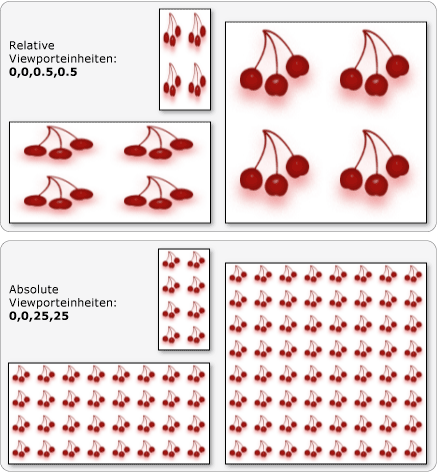

# Übersicht über TileBrushTileBrush Overview
<xref:System.Windows.Media.TileBrush>Objekte geben Ihnen eine große Kontrolle darüber, wie ein <xref:System.Windows.Media.Drawing>Bereich <xref:System.Windows.Media.Visual>mit einem Bild, oder gemalt wird.<xref:System.Windows.Media.TileBrush> objects provide you with a great deal of control over how an area is painted with an image, <xref:System.Windows.Media.Drawing>, or <xref:System.Windows.Media.Visual>. In diesem Thema <xref:System.Windows.Media.TileBrush> wird beschrieben, wie Features <xref:System.Windows.Media.ImageBrush> <xref:System.Windows.Media.DrawingBrush>verwendet <xref:System.Windows.Media.VisualBrush> werden, um mehr Kontrolle darüber zu erlangen, wie ein , oder ein Bereich gezeichnet wird.This topic describes how to use <xref:System.Windows.Media.TileBrush> features to gain more control over how an <xref:System.Windows.Media.ImageBrush>, <xref:System.Windows.Media.DrawingBrush>, or <xref:System.Windows.Media.VisualBrush> paints an area.  

## VoraussetzungenPrerequisites  
 Um dieses Thema zu verstehen, ist es hilfreich zu <xref:System.Windows.Media.ImageBrush>verstehen, wie die grundlegenden Features der , <xref:System.Windows.Media.DrawingBrush>oder <xref:System.Windows.Media.VisualBrush> Klasse verwendet werden.To understand this topic, it's helpful to understand how to use the basic features of the <xref:System.Windows.Media.ImageBrush>, <xref:System.Windows.Media.DrawingBrush>, or <xref:System.Windows.Media.VisualBrush> class. Eine Einführung in diese Typen finden Sie im [Thema Malerei mit Bildern, Zeichnungen und Visuals](painting-with-images-drawings-and-visuals.md).For an introduction to these types, see the [Painting with Images, Drawings, and Visuals](painting-with-images-drawings-and-visuals.md).  
  

## Zeichnen eines Bereichs mit KachelnPainting an Area with Tiles  
 <xref:System.Windows.Media.ImageBrush>, <xref:System.Windows.Media.DrawingBrush>sind <xref:System.Windows.Media.VisualBrush> <xref:System.Windows.Media.TileBrush> Objekttypen.<xref:System.Windows.Media.ImageBrush>, <xref:System.Windows.Media.DrawingBrush>, are <xref:System.Windows.Media.VisualBrush> are types of <xref:System.Windows.Media.TileBrush> objects. Kacheleffekte bieten Ihnen gute Steuerungsmöglichkeiten für das Malen eines Bilds, einer Zeichnung oder eines visuellen Objekts in einem Bereich.Tile brushes provide you with a great deal of control over how an area is painted with an image, drawing, or visual. Sie können beispielsweise zum Zeichnen eines Bereichs anstelle eines einzelnen gestreckten Bilds eine Reihe von Bildkacheln verwenden, die ein Muster ergeben.For example, instead of just painting an area with a single stretched image, you can paint an area with a series of image tiles that create a pattern.  
  
 Beim Zeichnen eines Bereichs mit einem Kacheleffekt spielen drei Komponenten eine Rolle: Inhalt, Basiskachel und Ausgabebereich.Painting an area with a tile brush involves three components: content, the base tile, and the output area.  
  
   
Komponenten eines TileBrush mit einer einzelnen KachelComponents of a TileBrush with a single tile  
  
   
Komponenten eines TileBrush mit einer TileMode-KachelComponents of a TileBrush with a TileMode of Tile  
  
 Der Ausgabebereich ist der Bereich, <xref:System.Windows.Shapes.Shape.Fill%2A> der <xref:System.Windows.Shapes.Ellipse> lackiert <xref:System.Windows.Controls.Control.Background%2A> wird, <xref:System.Windows.Controls.Button>z. B. der von einem oder der eines .The output area is the area being painted, such as the <xref:System.Windows.Shapes.Shape.Fill%2A> of an <xref:System.Windows.Shapes.Ellipse> or the <xref:System.Windows.Controls.Control.Background%2A> of a <xref:System.Windows.Controls.Button>. In den nächsten Abschnitten werden <xref:System.Windows.Media.TileBrush>die beiden anderen Komponenten einer beschrieben.The next sections describe the other two components of a <xref:System.Windows.Media.TileBrush>.  
  

## PinselinhaltBrush Content  
 Es gibt drei <xref:System.Windows.Media.TileBrush> verschiedene Arten von und jede Farbe mit einem anderen Inhaltstyp.There are three different types of <xref:System.Windows.Media.TileBrush> and each paints with a different type of content.  
  
- Wenn der Pinsel <xref:System.Windows.Media.ImageBrush>ein ist, ist <xref:System.Windows.Media.ImageBrush.ImageSource%2A> dieser Inhalt ein <xref:System.Windows.Media.ImageBrush>Bild Die Eigenschaft gibt den Inhalt der an.If the brush is an <xref:System.Windows.Media.ImageBrush>, this content is an image The <xref:System.Windows.Media.ImageBrush.ImageSource%2A> property specifies the contents of the <xref:System.Windows.Media.ImageBrush>.  
  
- Wenn es sich <xref:System.Windows.Media.DrawingBrush>bei dem Pinsel um einen handelt, handelt es sich bei diesem Inhalt um eine Zeichnung.If the brush is a <xref:System.Windows.Media.DrawingBrush>, this content is a drawing. Die <xref:System.Windows.Media.DrawingBrush.Drawing%2A> Eigenschaft gibt den <xref:System.Windows.Media.DrawingBrush>Inhalt der an.The <xref:System.Windows.Media.DrawingBrush.Drawing%2A> property specifies the contents of the <xref:System.Windows.Media.DrawingBrush>.  
  
- Wenn es sich <xref:System.Windows.Media.VisualBrush>bei dem Pinsel um einen handelt, handelt es sich bei diesem Inhalt um ein visuelles Element.If the brush is a <xref:System.Windows.Media.VisualBrush>, this content is a visual. Die <xref:System.Windows.Media.VisualBrush.Visual%2A> Eigenschaft gibt den <xref:System.Windows.Media.VisualBrush>Inhalt der an.The <xref:System.Windows.Media.VisualBrush.Visual%2A> property specifies the content of the <xref:System.Windows.Media.VisualBrush>.  
  
 Sie können die Position <xref:System.Windows.Media.TileBrush> und die <xref:System.Windows.Media.TileBrush.Viewbox%2A> Dimensionen des Inhalts mithilfe der <xref:System.Windows.Media.TileBrush.Viewbox%2A> Eigenschaft angeben, obwohl es üblich ist, den Satz auf den Standardwert zu belassen.You can specify the position and dimensions of <xref:System.Windows.Media.TileBrush> content by using the <xref:System.Windows.Media.TileBrush.Viewbox%2A> property, although it is common to leave the <xref:System.Windows.Media.TileBrush.Viewbox%2A> set to its default value. Standardmäßig ist <xref:System.Windows.Media.TileBrush.Viewbox%2A> der so konfiguriert, dass er den Inhalt des Pinsels vollständig enthält.By default, the <xref:System.Windows.Media.TileBrush.Viewbox%2A> is configured to completely contain the brush's contents. Weitere Informationen zum <xref:System.Windows.Controls.Viewbox>Konfigurieren der <xref:System.Windows.Controls.Viewbox> finden Sie auf der Eigenschaftenseite.For more information about configuring the <xref:System.Windows.Controls.Viewbox>, see the <xref:System.Windows.Controls.Viewbox> property page.  
  

## BasiskachelThe Base Tile  
 Ein <xref:System.Windows.Media.TileBrush> projiziert seinen Inhalt auf eine Basiskachel.A <xref:System.Windows.Media.TileBrush> projects its content onto a base tile. Die <xref:System.Windows.Media.TileBrush.Stretch%2A> Eigenschaft <xref:System.Windows.Media.TileBrush> steuert, wie der Inhalt gestreckt wird, um die Basiskachel zu füllen.The <xref:System.Windows.Media.TileBrush.Stretch%2A> property controls how <xref:System.Windows.Media.TileBrush> content is stretched to fill the base tile. Die <xref:System.Windows.Media.TileBrush.Stretch%2A> Eigenschaft akzeptiert die folgenden <xref:System.Windows.Media.Stretch> Werte, die durch die Enumeration definiert sind:The <xref:System.Windows.Media.TileBrush.Stretch%2A> property accepts the following values, defined by the <xref:System.Windows.Media.Stretch> enumeration:  
  
- <xref:System.Windows.Media.Stretch.None>: Der Inhalt des Pinsels wird nicht gedehnt, um die Kachel zu füllen.<xref:System.Windows.Media.Stretch.None>: The brush's content is not stretched to fill the tile.  
  
- <xref:System.Windows.Media.Stretch.Fill>: Der Inhalt des Pinsels wird so skaliert, dass er an die Kachel passt.<xref:System.Windows.Media.Stretch.Fill>: The brush's content is scaled to fit the tile. Da Höhe und Breite des Inhalts unabhängig voneinander skaliert werden, wird das ursprüngliche Seitenverhältnis des Inhalts möglicherweise nicht beibehalten.Because the content's height and width are scaled independently, the original aspect ratio of the content might not be preserved. Der Inhalt des Pinsels wird möglicherweise verzerrt, um die Ausgabekachel vollständig auszufüllen.That is, the brush's content might be warped in order to completely fill the output tile.  
  
- <xref:System.Windows.Media.Stretch.Uniform>: Der Inhalt des Pinsels wird so skaliert, dass er vollständig in die Kachel passt.<xref:System.Windows.Media.Stretch.Uniform>: The brush's content is scaled so that it fits completely within the tile. Das Seitenverhältnis des Inhalts wird beibehalten.The content's aspect ratio is preserved.  
  
- <xref:System.Windows.Media.Stretch.UniformToFill>: Der Inhalt des Pinsels wird so skaliert, dass er den Ausgabebereich vollständig ausfüllt, während das ursprüngliche Seitenverhältnis des Inhalts beibehalten wird.<xref:System.Windows.Media.Stretch.UniformToFill>: The brush's content is scaled so that it completely fills the output area while preserving the content's original aspect ratio.  
  
 Die folgende Abbildung veranschaulicht <xref:System.Windows.Media.TileBrush.Stretch%2A> die verschiedenen Einstellungen.The following image illustrates the different <xref:System.Windows.Media.TileBrush.Stretch%2A> settings.  
  
   
  
 Im folgenden Beispiel wird der <xref:System.Windows.Media.ImageBrush> Inhalt eines so eingestellt, dass er sich nicht erstreckt, um den Ausgabebereich zu füllen.In the following example, the content of an <xref:System.Windows.Media.ImageBrush> is set so that it does not stretch to fill the output area.  
  
 [!code-xaml[BrushOverviewExamples_snip#GraphicsMMNoStretchExample](~/samples/snippets/xaml/VS_Snippets_Wpf/BrushOverviewExamples_snip/XAML/StretchExample.xaml#graphicsmmnostretchexample)]  
  
 [!code-csharp[BrushOverviewExamples_procedural_snip#GraphicsMMNoStretchExample](~/samples/snippets/csharp/VS_Snippets_Wpf/BrushOverviewExamples_procedural_snip/CSharp/StretchExample.cs#graphicsmmnostretchexample)]
 [!code-vb[BrushOverviewExamples_procedural_snip#GraphicsMMNoStretchExample](~/samples/snippets/visualbasic/VS_Snippets_Wpf/BrushOverviewExamples_procedural_snip/visualbasic/stretchexample.vb#graphicsmmnostretchexample)]  
  
 Standardmäßig generiert <xref:System.Windows.Media.TileBrush> a eine einzelne Kachel (die Basiskachel) und dehnt diese Kachel, um den Ausgabebereich vollständig zu füllen.By default, a <xref:System.Windows.Media.TileBrush> generates a single tile (the base tile) and stretches that tile to completely fill the output area. Sie können die Größe und Position der <xref:System.Windows.Media.TileBrush.Viewport%2A> Basiskachel ändern, indem Sie die und <xref:System.Windows.Media.TileBrush.ViewportUnits%2A> die Eigenschaften festlegen.You can change the size and position of the base tile by setting the <xref:System.Windows.Media.TileBrush.Viewport%2A> and <xref:System.Windows.Media.TileBrush.ViewportUnits%2A> properties.  
  

### Größe der BasiskachelBase Tile Size  
 Die <xref:System.Windows.Media.TileBrush.Viewport%2A> Eigenschaft bestimmt die Größe und Position <xref:System.Windows.Media.TileBrush.ViewportUnits%2A> der Basiskachel, und die Eigenschaft bestimmt, ob die <xref:System.Windows.Media.TileBrush.Viewport%2A> mit absoluten oder relativen Koordinaten angegeben wird.The <xref:System.Windows.Media.TileBrush.Viewport%2A> property determines the size and position of the base tile, and the <xref:System.Windows.Media.TileBrush.ViewportUnits%2A> property determines whether the <xref:System.Windows.Media.TileBrush.Viewport%2A> is specified using absolute or relative coordinates. Wenn die Koordinaten relativ sind, sind sie relativ zur Größe des Ausgabebereichs.If the coordinates are relative, they are relative to the size of the output area. Der Punkt (0,0) stellt die obere linke Ecke des Ausgabebereichs und (1,1) stellt die untere rechte Ecke des Ausgabebereichs dar.The point (0,0) represents the top left corner of the output area, and (1,1) represents the bottom right corner of the output area. Um anzugeben, <xref:System.Windows.Media.TileBrush.Viewport%2A> dass die Eigenschaft <xref:System.Windows.Media.TileBrush.ViewportUnits%2A> absolute <xref:System.Windows.Media.BrushMappingMode.Absolute>Koordinaten verwendet, legen Sie die Eigenschaft auf fest.To specify that the <xref:System.Windows.Media.TileBrush.Viewport%2A> property uses absolute coordinates, set the <xref:System.Windows.Media.TileBrush.ViewportUnits%2A> property to <xref:System.Windows.Media.BrushMappingMode.Absolute>.  
  
 Die folgende Abbildung zeigt den <xref:System.Windows.Media.TileBrush> Unterschied in <xref:System.Windows.Media.TileBrush.ViewportUnits%2A>der Ausgabe zwischen einem mit relativen und absoluten .The following illustration shows the difference in output between a <xref:System.Windows.Media.TileBrush> with relative versus absolute <xref:System.Windows.Media.TileBrush.ViewportUnits%2A>. Beachten Sie, dass in den Abbildungen ein Kachelmuster angezeigt wird. Im nächsten Abschnitt wird beschrieben, wie Kachelmuster angegeben werden.Notice that the illustrations each show a tiled pattern; the next section describes how to specify tile pattern.  
  
   
  
 Im folgenden Beispiel wird ein Bild verwendet, um eine Kachel zu erstellen, deren Breite und Höhe 50% ist.In the following example, an image is used to create a tile that has a width and height of 50%. Die Basiskachel befindet sich bei (0,0) des Ausgabebereichs.The base tile is located at (0,0) of the output area.  
  
 [!code-xaml[BrushOverviewExamples_snip#GraphicsMMRelativeViewportUnitsExample1](~/samples/snippets/xaml/VS_Snippets_Wpf/BrushOverviewExamples_snip/XAML/TileSizeExample.xaml#graphicsmmrelativeviewportunitsexample1)]  
  
 [!code-csharp[BrushOverviewExamples_procedural_snip#GraphicsMMRelativeViewportUnitsExample1](~/samples/snippets/csharp/VS_Snippets_Wpf/BrushOverviewExamples_procedural_snip/CSharp/TileSizeExample.cs#graphicsmmrelativeviewportunitsexample1)]
 [!code-vb[BrushOverviewExamples_procedural_snip#GraphicsMMRelativeViewportUnitsExample1](~/samples/snippets/visualbasic/VS_Snippets_Wpf/BrushOverviewExamples_procedural_snip/visualbasic/tilesizeexample.vb#graphicsmmrelativeviewportunitsexample1)]  
  
 Im nächsten Beispiel werden <xref:System.Windows.Media.ImageBrush> die Kacheln von einem auf 25 mal 25 geräteunabhängige Pixel festgelegt.The next example sets the tiles of an <xref:System.Windows.Media.ImageBrush> to 25 by 25 device independent pixels. Da <xref:System.Windows.Media.TileBrush.ViewportUnits%2A> die absolut <xref:System.Windows.Media.ImageBrush> sind, sind die Kacheln immer 25 x 25 Pixel, unabhängig von der Größe des zu malenden Bereichs.Because the <xref:System.Windows.Media.TileBrush.ViewportUnits%2A> are absolute, the <xref:System.Windows.Media.ImageBrush> tiles are always 25 by 25 pixels, regardless of the size of the area being painted.  
  
 [!code-xaml[BrushOverviewExamples_snip#GraphicsMMAbsoluteViewportUnitsExample1](~/samples/snippets/xaml/VS_Snippets_Wpf/BrushOverviewExamples_snip/XAML/TileSizeExample.xaml#graphicsmmabsoluteviewportunitsexample1)]  
  
 [!code-csharp[BrushOverviewExamples_procedural_snip#GraphicsMMAbsoluteViewportUnitsExample1](~/samples/snippets/csharp/VS_Snippets_Wpf/BrushOverviewExamples_procedural_snip/CSharp/TileSizeExample.cs#graphicsmmabsoluteviewportunitsexample1)]
 [!code-vb[BrushOverviewExamples_procedural_snip#GraphicsMMAbsoluteViewportUnitsExample1](~/samples/snippets/visualbasic/VS_Snippets_Wpf/BrushOverviewExamples_procedural_snip/visualbasic/tilesizeexample.vb#graphicsmmabsoluteviewportunitsexample1)]  
  

### KachelverhaltenTiling Behavior  
 A <xref:System.Windows.Media.TileBrush> erzeugt ein gekacheltes Muster, wenn seine Basiskachel den Ausgabebereich nicht vollständig ausfüllt und ein anderer Kachelmodus angegeben <xref:System.Windows.Media.TileMode.None> wird.A <xref:System.Windows.Media.TileBrush> produces a tiled pattern when its base tile does not completely fill the output area and a tiling mode other then <xref:System.Windows.Media.TileMode.None> is specified. Wenn die Kachel eines Kachelpinsels den Ausgabebereich <xref:System.Windows.Media.TileBrush.TileMode%2A> nicht vollständig ausfüllt, gibt seine Eigenschaft an, ob die Basiskachel dupliziert werden soll, um den Ausgabebereich auszufüllen, und wenn ja, wie die Basiskachel dupliziert werden soll.When a tile brush's tile does not completely fill the output area, its <xref:System.Windows.Media.TileBrush.TileMode%2A> property specifies whether the base tile should be duplicated to fill the output area and, if so, how the base tile should be duplicated. Die <xref:System.Windows.Media.TileBrush.TileMode%2A> Eigenschaft akzeptiert die folgenden <xref:System.Windows.Media.TileMode> Werte, die durch die Enumeration definiert sind:The <xref:System.Windows.Media.TileBrush.TileMode%2A> property accepts the following values, defined by the <xref:System.Windows.Media.TileMode> enumeration:  
  
- <xref:System.Windows.Media.TileMode.None>: Es wird nur die Basiskachel gezeichnet.<xref:System.Windows.Media.TileMode.None>: Only the base tile is drawn.  
  
- <xref:System.Windows.Media.TileMode.Tile>: Die Basiskachel wird gezeichnet, und der verbleibende Bereich wird gefüllt, indem die Basiskachel so wiederholt wird, dass der rechte Rand einer Kachel neben dem linken Rand der nächsten Kachel und ähnlich für unten und oben ist.<xref:System.Windows.Media.TileMode.Tile>: The base tile is drawn and the remaining area is filled by repeating the base tile such that the right edge of one tile is adjacent to the left edge of the next, and similarly for bottom and top.  
  
- <xref:System.Windows.Media.TileMode.FlipX>: Das <xref:System.Windows.Media.TileMode.Tile>gleiche wie , aber alternative Spalten von Kacheln werden horizontal gekippt.<xref:System.Windows.Media.TileMode.FlipX>: The same as <xref:System.Windows.Media.TileMode.Tile>, but alternate columns of tiles are flipped horizontally.  
  
- <xref:System.Windows.Media.TileMode.FlipY>: Das <xref:System.Windows.Media.TileMode.Tile>gleiche wie , aber alternative Zeilen von Kacheln werden vertikal gekippt.<xref:System.Windows.Media.TileMode.FlipY>: The same as <xref:System.Windows.Media.TileMode.Tile>, but alternate rows of tiles are flipped vertically.  
  
- <xref:System.Windows.Media.TileMode.FlipXY>: Eine <xref:System.Windows.Media.TileMode.FlipX> Kombination <xref:System.Windows.Media.TileMode.FlipY>aus und .<xref:System.Windows.Media.TileMode.FlipXY>: A combination of <xref:System.Windows.Media.TileMode.FlipX> and <xref:System.Windows.Media.TileMode.FlipY>.  
  
 Die folgende Abbildung zeigt die unterschiedlichen Kachelmodi.The following image illustrates the different tiling modes.  
  
   
  
 Im folgenden Beispiel wird ein Bild verwendet, um ein Rechteck zu zeichnen, das 100 Pixel breit und 100 Pixel hoch ist.In the following example, an image is used to paint a rectangle that is 100 pixels wide and 100 pixels tall. Durch Festlegen der <xref:System.Windows.Media.TileBrush.Viewport%2A> Einstellung des Pinsels auf 0,0,0.25,0.25 wird die Basiskachel des Pinsels auf 1/4 des Ausgabebereichs festgelegt.By setting the brush's <xref:System.Windows.Media.TileBrush.Viewport%2A> has been set to 0,0,0.25,0.25, the brush's base tile is made to be 1/4 of the output area. Der Pinsel <xref:System.Windows.Media.TileBrush.TileMode%2A> ist auf <xref:System.Windows.Media.TileMode.FlipXY>gesetzt.The brush's <xref:System.Windows.Media.TileBrush.TileMode%2A> is set to <xref:System.Windows.Media.TileMode.FlipXY>. sodass er das Rechteck mit Kachelreihen ausfüllt.so that it fills the rectangle with rows of tiles.  
  
 [!code-xaml[BrushOverviewExamples_snip#GraphicsMMFlipXYExample](~/samples/snippets/xaml/VS_Snippets_Wpf/BrushOverviewExamples_snip/XAML/TilingExample.xaml#graphicsmmflipxyexample)]  
  
 [!code-csharp[BrushOverviewExamples_procedural_snip#GraphicsMMFlipXYExample](~/samples/snippets/csharp/VS_Snippets_Wpf/BrushOverviewExamples_procedural_snip/CSharp/TilingExample.cs#graphicsmmflipxyexample)]
 [!code-vb[BrushOverviewExamples_procedural_snip#GraphicsMMFlipXYExample](~/samples/snippets/visualbasic/VS_Snippets_Wpf/BrushOverviewExamples_procedural_snip/visualbasic/tilingexample.vb#graphicsmmflipxyexample)]  
  
## Weitere InformationenSee also

- <xref:System.Windows.Media.ImageBrush>
- <xref:System.Windows.Media.DrawingBrush>
- <xref:System.Windows.Media.VisualBrush>
- <xref:System.Windows.Media.TileBrush>
- [Zeichnen mit Bildern, Zeichnungen und visuellen ElementenPainting with Images, Drawings, and Visuals](painting-with-images-drawings-and-visuals.md)
- [How-to-ThemenHow-to Topics](brushes-how-to-topics.md)
- [Übersicht über Freezable-ObjekteFreezable Objects Overview](../advanced/freezable-objects-overview.md)
- [Beispiel zu ImageBrushImageBrush Sample](https://github.com/Microsoft/WPF-Samples/tree/master/Graphics/ImageBrush)
- [VisualBrush-BeispielVisualBrush Sample](https://github.com/Microsoft/WPF-Samples/tree/master/Graphics/VisualBrush)
